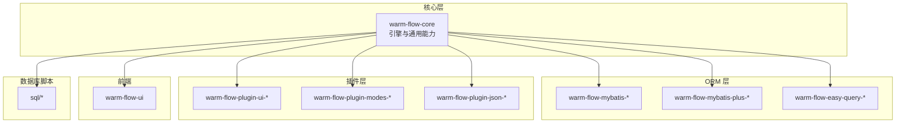
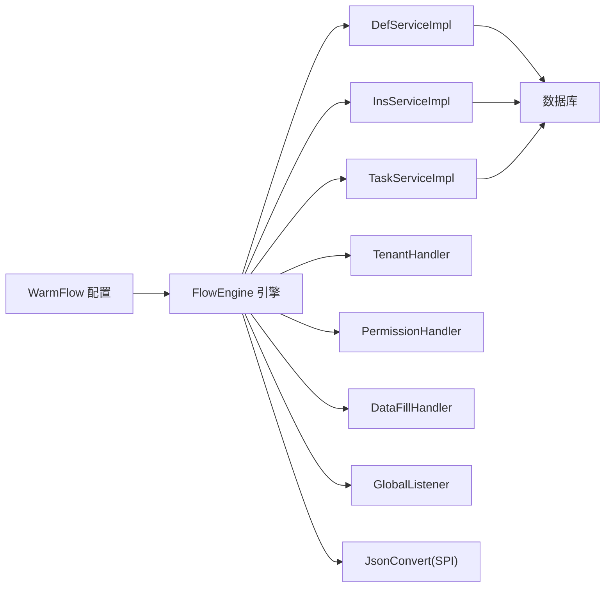
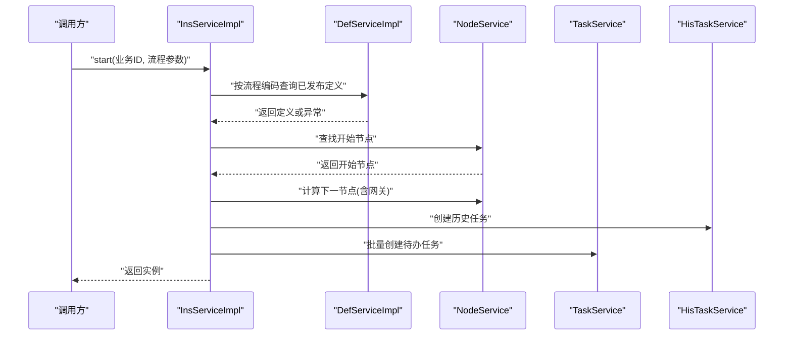
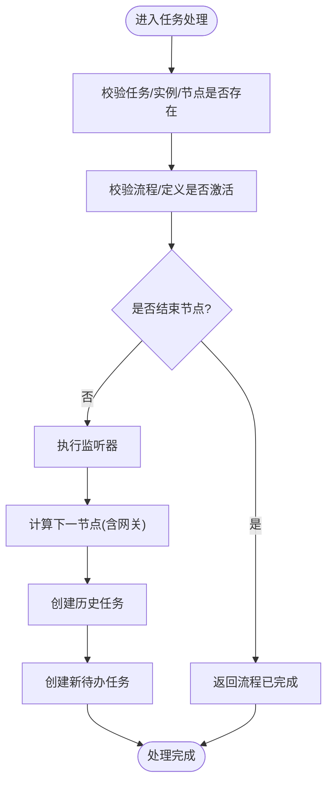
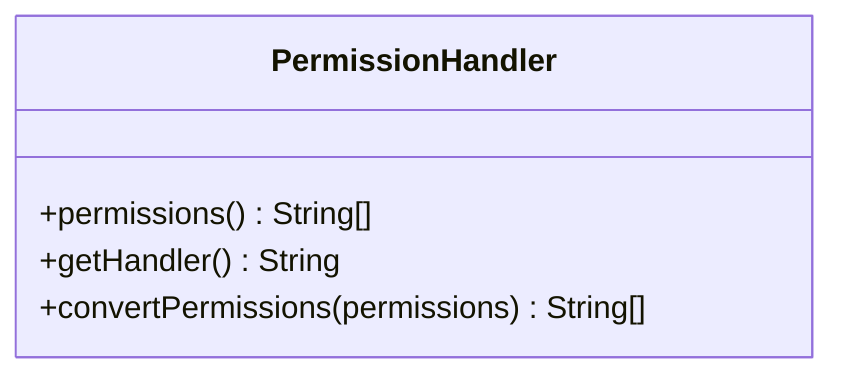
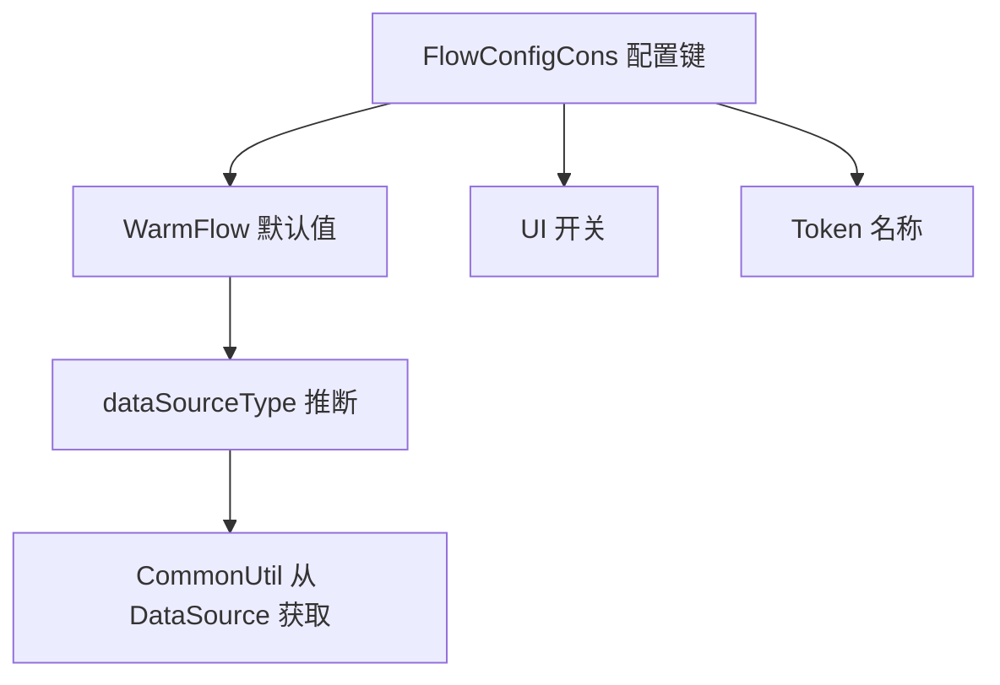

# 常见问题

<cite>
**本文引用的文件**
- [FlowException.java](file://warm-flow-core/src/main/java/org/dromara/warm/flow/core/exception/FlowException.java)
- [ExceptionCons.java](file://warm-flow-core/src/main/java/org/dromara/warm/flow/core/constant/ExceptionCons.java)
- [FlowConfigCons.java](file://warm-flow-core/src/main/java/org/dromara/warm/flow/core/constant/FlowConfigCons.java)
- [WarmFlow.java](file://warm-flow-core/src/main/java/org/dromara/warm/flow/core/config/WarmFlow.java)
- [FlowEngine.java](file://warm-flow-core/src/main/java/org/dromara/warm/flow/core/FlowEngine.java)
- [ExceptionUtil.java](file://warm-flow-core/src/main/java/org/dromara/warm/flow/core/utils/ExceptionUtil.java)
- [CommonUtil.java](file://warm-flow-orm/warm-flow-mybatis/warm-flow-mybatis-core/src/main/java/org/dromara/warm/flow/orm/utils/CommonUtil.java)
- [DefServiceImpl.java](file://warm-flow-core/src/main/java/org/dromara/warm/flow/core/service/impl/DefServiceImpl.java)
- [InsServiceImpl.java](file://warm-flow-core/src/main/java/org/dromara/warm/flow/core/service/impl/InsServiceImpl.java)
- [TaskServiceImpl.java](file://warm-flow-core/src/main/java/org/dromara/warm/flow/core/service/impl/TaskServiceImpl.java)
- [PermissionHandler.java](file://warm-flow-core/src/main/java/org/dromara/warm/flow/core/handler/PermissionHandler.java)
- [warm-flow_1.2.1.sql](file://sql/mysql/v1-upgrade/warm-flow_1.2.1.sql)
- [sqlserver.sql](file://sql/sqlserver/sqlserver.sql)
- [FlowNodeMapper.xml](file://warm-flow-orm/warm-flow-mybatis/warm-flow-mybatis-core/src/main/resources/warm/flow/FlowNodeMapper.xml)
- [SafeTypeLocator.java](file://warm-flow-plugin/warm-flow-plugin-modes/warm-flow-plugin-modes-sb/src/main/java/org/dromara/warm/plugin/modes/sb/helper/SafeTypeLocator.java)
</cite>

## 目录
1. [简介](#简介)
2. [项目结构](#项目结构)
3. [核心组件](#核心组件)
4. [架构总览](#架构总览)
5. [详细组件分析](#详细组件分析)
6. [依赖分析](#依赖分析)
7. [性能考虑](#性能考虑)
8. [故障排除指南](#故障排除指南)
9. [结论](#结论)
10. [附录](#附录)

## 简介
本指南面向使用 Warm-Flow 的开发者与运维人员，聚焦于“常见问题”的定位与解决。内容覆盖流程无法启动、任务无法创建、权限验证失败、数据库连接异常等典型场景；并提供配置错误、依赖冲突、版本兼容性的诊断方法，以及问题自检清单与快速修复建议，帮助快速恢复系统稳定运行。

## 项目结构
Warm-Flow 采用多模块分层设计：
- 核心引擎与通用能力：warm-flow-core
- ORM 扩展与多实现：warm-flow-orm（MyBatis、MyBatis-Plus、EasyQuery）
- 插件体系：warm-flow-plugin（UI、表达式模式、JSON 实现等）
- 前端 UI：warm-flow-ui
- SQL 脚本：sql（MySQL、Oracle、PostgreSQL、SQLServer）

**图表来源**
- [WarmFlow.java:34-173](file://warm-flow-core/src/main/java/org/dromara/warm/flow/core/config/WarmFlow.java#L34-L173)
- [DefServiceImpl.java:1-374](file://warm-flow-core/src/main/java/org/dromara/warm/flow/core/service/impl/DefServiceImpl.java#L1-L374)
- [InsServiceImpl.java:1-245](file://warm-flow-core/src/main/java/org/dromara/warm/flow/core/service/impl/InsServiceImpl.java#L1-L245)

**章节来源**
- [WarmFlow.java:34-173](file://warm-flow-core/src/main/java/org/dromara/warm/flow/core/config/WarmFlow.java#L34-L173)
- [DefServiceImpl.java:1-374](file://warm-flow-core/src/main/java/org/dromara/warm/flow/core/service/impl/DefServiceImpl.java#L1-L374)
- [InsServiceImpl.java:1-245](file://warm-flow-core/src/main/java/org/dromara/warm/flow/core/service/impl/InsServiceImpl.java#L1-L245)

## 核心组件
- 引擎与配置
  - FlowEngine：统一访问入口，负责服务获取、处理器初始化、SPI 加载 JSON 转换器、数据源类型推断等。
  - WarmFlow：全局配置项，包含开关、框架类型、逻辑删除、数据源类型、UI 开关、权限令牌名、状态颜色等。
- 服务层
  - DefServiceImpl：流程定义导入/导出/发布/复制/激活/挂起等。
  - InsServiceImpl：流程实例启动、任务派发、历史任务归档、实例激活/挂起。
  - TaskServiceImpl：任务查询、处理、跳转、加签/减签/转办/委托等。
- 异常与常量
  - FlowException：统一异常包装，支持 code/message/detailMessage。
  - ExceptionCons：集中定义各类业务异常提示。
- ORM 工具
  - CommonUtil：根据 DataSource 推断数据库类型，兜底为 MySQL。
- 安全与表达式
  - SafeTypeLocator：表达式安全白名单/黑名单控制。

**章节来源**
- [FlowEngine.java:39-269](file://warm-flow-core/src/main/java/org/dromara/warm/flow/core/FlowEngine.java#L39-L269)
- [WarmFlow.java:34-173](file://warm-flow-core/src/main/java/org/dromara/warm/flow/core/config/WarmFlow.java#L34-L173)
- [DefServiceImpl.java:54-374](file://warm-flow-core/src/main/java/org/dromara/warm/flow/core/service/impl/DefServiceImpl.java#L54-L374)
- [InsServiceImpl.java:46-245](file://warm-flow-core/src/main/java/org/dromara/warm/flow/core/service/impl/InsServiceImpl.java#L46-L245)
- [TaskServiceImpl.java:667-873](file://warm-flow-core/src/main/java/org/dromara/warm/flow/core/service/impl/TaskServiceImpl.java#L667-L873)
- [FlowException.java:25-80](file://warm-flow-core/src/main/java/org/dromara/warm/flow/core/exception/FlowException.java#L25-L80)
- [ExceptionCons.java:24-158](file://warm-flow-core/src/main/java/org/dromara/warm/flow/core/constant/ExceptionCons.java#L24-L158)
- [CommonUtil.java:29-61](file://warm-flow-orm/warm-flow-mybatis/warm-flow-mybatis-core/src/main/java/org/dromara/warm/flow/orm/utils/CommonUtil.java#L29-L61)
- [SafeTypeLocator.java:46-81](file://warm-flow-plugin/warm-flow-plugin-modes/warm-flow-plugin-modes-sb/src/main/java/org/dromara/warm/plugin/modes/sb/helper/SafeTypeLocator.java#L46-L81)

## 架构总览
Warm-Flow 通过 FlowEngine 统一调度各服务与处理器，结合 WarmFlow 配置与 SPI 机制加载 JSON 转换器；ORM 层通过 CommonUtil 推断数据库类型，确保分页与方言适配。

**图表来源**
- [WarmFlow.java:130-157](file://warm-flow-core/src/main/java/org/dromara/warm/flow/core/config/WarmFlow.java#L130-L157)
- [FlowEngine.java:172-267](file://warm-flow-core/src/main/java/org/dromara/warm/flow/core/FlowEngine.java#L172-L267)

**章节来源**
- [WarmFlow.java:130-157](file://warm-flow-core/src/main/java/org/dromara/warm/flow/core/config/WarmFlow.java#L130-L157)
- [FlowEngine.java:172-267](file://warm-flow-core/src/main/java/org/dromara/warm/flow/core/FlowEngine.java#L172-L267)

## 详细组件分析

### 流程启动与实例创建
流程启动的关键路径：InsServiceImpl.start → 获取已发布流程定义 → 校验开始节点 → 计算下一节点 → 创建实例/历史任务/待办任务 → 触发监听器。

**图表来源**
- [InsServiceImpl.java:55-111](file://warm-flow-core/src/main/java/org/dromara/warm/flow/core/service/impl/InsServiceImpl.java#L55-L111)
- [DefServiceImpl.java:306-310](file://warm-flow-core/src/main/java/org/dromara/warm/flow/core/service/impl/DefServiceImpl.java#L306-L310)

**章节来源**
- [InsServiceImpl.java:55-111](file://warm-flow-core/src/main/java/org/dromara/warm/flow/core/service/impl/InsServiceImpl.java#L55-L111)
- [DefServiceImpl.java:306-310](file://warm-flow-core/src/main/java/org/dromara/warm/flow/core/service/impl/DefServiceImpl.java#L306-L310)

### 任务处理与跳转
任务处理涉及权限校验、节点类型判断、监听器执行、历史归档与新任务生成等。

**图表来源**
- [TaskServiceImpl.java:670-685](file://warm-flow-core/src/main/java/org/dromara/warm/flow/core/service/impl/TaskServiceImpl.java#L670-L685)

**章节来源**
- [TaskServiceImpl.java:670-685](file://warm-flow-core/src/main/java/org/dromara/warm/flow/core/service/impl/TaskServiceImpl.java#L670-L685)

### 权限处理器与表达式安全
- PermissionHandler：定义权限标识与当前办理人获取接口，供流程参数注入与权限校验。
- 表达式安全：SafeTypeLocator 提供表达式可执行类型白名单/黑名单，限制危险类加载。

**图表来源**
- [PermissionHandler.java:30-55](file://warm-flow-core/src/main/java/org/dromara/warm/flow/core/handler/PermissionHandler.java#L30-L55)

**章节来源**
- [PermissionHandler.java:30-55](file://warm-flow-core/src/main/java/org/dromara/warm/flow/core/handler/PermissionHandler.java#L30-L55)
- [SafeTypeLocator.java:46-81](file://warm-flow-plugin/warm-flow-plugin-modes/warm-flow-plugin-modes-sb/src/main/java/org/dromara/warm/plugin/modes/sb/helper/SafeTypeLocator.java#L46-L81)

## 依赖分析
- 配置键与默认行为
  - 数据源类型：若未显式配置，FlowEngine 通过 WarmFlow.dataSourceType 推断；CommonUtil 从 DataSource 获取数据库产品名，兜底为 mysql。
  - UI 开关：warm-flow.ui 控制 UI 能力启用。
  - 令牌名：warm-flow.token-name 支持多令牌名，逗号分隔。
- 异常常量
  - 包含流程定义/实例/任务缺失、权限不足、网关/节点规则、表达式策略缺失、流程状态等大量提示。

**图表来源**
- [FlowConfigCons.java:23-75](file://warm-flow-core/src/main/java/org/dromara/warm/flow/core/constant/FlowConfigCons.java#L23-L75)
- [WarmFlow.java:94-108](file://warm-flow-core/src/main/java/org/dromara/warm/flow/core/config/WarmFlow.java#L94-L108)
- [CommonUtil.java:34-60](file://warm-flow-orm/warm-flow-mybatis/warm-flow-mybatis-core/src/main/java/org/dromara/warm/flow/orm/utils/CommonUtil.java#L34-L60)

**章节来源**
- [FlowConfigCons.java:23-75](file://warm-flow-core/src/main/java/org/dromara/warm/flow/core/constant/FlowConfigCons.java#L23-L75)
- [WarmFlow.java:94-108](file://warm-flow-core/src/main/java/org/dromara/warm/flow/core/config/WarmFlow.java#L94-L108)
- [CommonUtil.java:34-60](file://warm-flow-orm/warm-flow-mybatis/warm-flow-mybatis-core/src/main/java/org/dromara/warm/flow/orm/utils/CommonUtil.java#L34-L60)

## 性能考虑
- 逻辑删除与字段值：WarmFlow 支持逻辑删除及对应字段值配置，合理设置可减少物理删除成本。
- 分页与方言：CommonUtil 基于数据源类型选择分页方言，避免跨库差异导致的性能问题。
- 监听器与表达式：避免在监听器中执行重型操作；表达式尽量简洁，必要时使用缓存。

**章节来源**
- [WarmFlow.java:58-71](file://warm-flow-core/src/main/java/org/dromara/warm/flow/core/config/WarmFlow.java#L58-L71)
- [CommonUtil.java:34-60](file://warm-flow-orm/warm-flow-mybatis/warm-flow-mybatis-core/src/main/java/org/dromara/warm/flow/orm/utils/CommonUtil.java#L34-L60)

## 故障排除指南

### 一、流程无法启动
- 症状
  - 调用启动接口后无实例创建，或抛出“未找到流程定义”“缺少开始节点”等异常。
- 可能原因
  - 流程未发布或已失效；流程定义被使用中而无法变更。
  - 开始节点缺失或重复；节点间连线不合法。
  - 流程编码为空或非法。
- 快速检查
  - 确认流程定义已发布且未被使用（存在实例）。
  - 检查流程图是否绘制完整，开始节点仅有一个。
  - 校验流程编码与业务ID非空。
- 修复步骤
  - 在设计器中补全流程图并发布。
  - 若已有实例，先撤销相关实例再修改流程定义。
  - 清理重复/无效连线，确保开始节点唯一。
- 相关异常常量
  - “流程定义不存在”“未绘制流程图，不可发布”“开始节点不能超过1个”“流程缺少开始节点”。

**章节来源**
- [DefServiceImpl.java:220-253](file://warm-flow-core/src/main/java/org/dromara/warm/flow/core/service/impl/DefServiceImpl.java#L220-L253)
- [DefServiceImpl.java:345-371](file://warm-flow-core/src/main/java/org/dromara/warm/flow/core/service/impl/DefServiceImpl.java#L345-L371)
- [InsServiceImpl.java:55-70](file://warm-flow-core/src/main/java/org/dromara/warm/flow/core/service/impl/InsServiceImpl.java#L55-L70)
- [ExceptionCons.java:76-80](file://warm-flow-core/src/main/java/org/dromara/warm/flow/core/constant/ExceptionCons.java#L76-L80)
- [ExceptionCons.java:156-158](file://warm-flow-core/src/main/java/org/dromara/warm/flow/core/constant/ExceptionCons.java#L156-L158)

### 二、任务无法创建
- 症状
  - 启动后未生成待办任务；或处理任务时报“未找到待办任务”“流程已完成”。
- 可能原因
  - 当前节点为结束节点；流程已被挂起或定义被挂起。
  - 监听器或表达式阻断任务生成；网关分流条件未命中。
- 快速检查
  - 确认当前节点类型非结束节点。
  - 确认流程与定义均处于激活状态。
  - 检查监听器链路与表达式策略是否正确。
- 修复步骤
  - 将节点类型调整为中间节点，确保可继续流转。
  - 激活流程/定义后再试。
  - 校验监听器与表达式策略配置。
- 相关异常常量
  - “未找到待办任务”“流程已完成”“当前流程定义或者实例已经挂起，请先激活”。

**章节来源**
- [TaskServiceImpl.java:675-685](file://warm-flow-core/src/main/java/org/dromara/warm/flow/core/service/impl/TaskServiceImpl.java#L675-L685)
- [ExceptionCons.java:84-96](file://warm-flow-core/src/main/java/org/dromara/warm/flow/core/constant/ExceptionCons.java#L84-L96)

### 三、权限验证失败
- 症状
  - 抛出“请检查当前用户是否有权限”“无法跳转到该节点”等。
- 可能原因
  - 未正确实现 PermissionHandler 或未注入处理器。
  - 办理人标识为空或权限标识未正确转换。
- 快速检查
  - 确认 WarmFlow.permissionHandlerPath 已配置或 Spring 容器中存在实现。
  - 确认 FlowParams 中的 handler 与 permissionFlag 正确填充。
- 修复步骤
  - 实现 PermissionHandler 并在 WarmFlow 中注册。
  - 在流程参数中正确设置 handler 与 permissionFlag。
- 相关接口
  - PermissionHandler.permissions()/getHandler()

**章节来源**
- [WarmFlow.java:83-91](file://warm-flow-core/src/main/java/org/dromara/warm/flow/core/config/WarmFlow.java#L83-L91)
- [FlowEngine.java:188-190](file://warm-flow-core/src/main/java/org/dromara/warm/flow/core/FlowEngine.java#L188-L190)
- [PermissionHandler.java:30-55](file://warm-flow-core/src/main/java/org/dromara/warm/flow/core/handler/PermissionHandler.java#L30-L55)
- [ExceptionCons.java:96-100](file://warm-flow-core/src/main/java/org/dromara/warm/flow/core/constant/ExceptionCons.java#L96-L100)

### 四、数据库连接异常
- 症状
  - 启动时报数据源不可用；查询/分页报错。
- 可能原因
  - 数据源未正确配置；驱动缺失；方言识别失败。
- 快速检查
  - 确认 DataSource 可用，驱动版本与数据库匹配。
  - 若未配置数据源类型，确认数据库产品名可被识别。
- 修复步骤
  - 显式配置 warm-flow.data_source_type。
  - 确保数据库驱动与版本兼容。
- 相关工具
  - CommonUtil 从 DataSource 获取数据库产品名，兜底为 mysql。

**章节来源**
- [CommonUtil.java:34-60](file://warm-flow-orm/warm-flow-mybatis/warm-flow-mybatis-core/src/main/java/org/dromara/warm/flow/orm/utils/CommonUtil.java#L34-L60)
- [FlowConfigCons.java:60-64](file://warm-flow-core/src/main/java/org/dromara/warm/flow/core/constant/FlowConfigCons.java#L60-L64)

### 五、配置错误
- 症状
  - UI 无法访问；权限令牌名不生效；逻辑删除字段值不一致。
- 可能原因
  - 配置键拼写错误；未生效的配置项。
- 快速检查
  - 校验 warm-flow.ui、warm-flow.token-name、warm-flow.logic_delete* 等键。
- 修复步骤
  - 使用正确的配置键并确保加载顺序正确。
  - 如需共享业务系统权限，配置多个 token 名称并以逗号分隔。

**章节来源**
- [FlowConfigCons.java:28-75](file://warm-flow-core/src/main/java/org/dromara/warm/flow/core/constant/FlowConfigCons.java#L28-L75)
- [WarmFlow.java:106-108](file://warm-flow-core/src/main/java/org/dromara/warm/flow/core/config/WarmFlow.java#L106-L108)

### 六、依赖冲突与版本兼容性
- 症状
  - 启动时报找不到类；表达式解析失败；ORM 版本不兼容。
- 可能原因
  - 多版本 ORM/JSON 插件混用；表达式引擎策略缺失。
- 快速检查
  - 确认仅引入一种 ORM 实现与一种 JSON 插件。
  - 确认表达式策略实现存在。
- 修复步骤
  - 卸载冲突依赖，保留单一 ORM 与 JSON 实现。
  - 通过 SPI 注册合适的 JsonConvert 实现。
  - 确保表达式策略（SPeL/SnEL）与处理器匹配。

**章节来源**
- [WarmFlow.java:149-157](file://warm-flow-core/src/main/java/org/dromara/warm/flow/core/config/WarmFlow.java#L149-L157)
- [FlowEngine.java:248-267](file://warm-flow-core/src/main/java/org/dromara/warm/flow/core/FlowEngine.java#L248-L267)

### 七、表达式与安全
- 症状
  - 表达式执行报错或被拒绝。
- 可能原因
  - 使用了黑名单类或未授权类型。
- 快速检查
  - 检查表达式中使用的类型是否在白名单内。
- 修复步骤
  - 仅使用允许的类型与方法；避免反射与系统敏感类。

**章节来源**
- [SafeTypeLocator.java:46-81](file://warm-flow-plugin/warm-flow-plugin-modes/warm-flow-plugin-modes-sb/src/main/java/org/dromara/warm/plugin/modes/sb/helper/SafeTypeLocator.java#L46-L81)

### 八、历史任务字段不一致
- 症状
  - 历史任务表字段缺失或类型不一致。
- 可能原因
  - 数据库版本升级后字段未同步。
- 快速检查
  - 对照对应数据库脚本，确认字段存在。
- 修复步骤
  - 执行相应升级脚本，补齐字段。

**章节来源**
- [warm-flow_1.2.1.sql:1-5](file://sql/mysql/v1-upgrade/warm-flow_1.2.1.sql#L1-L5)
- [sqlserver.sql:814-867](file://sql/sqlserver/sqlserver.sql#L814-L867)

### 九、节点属性映射问题
- 症状
  - 节点属性更新不生效。
- 可能原因
  - Mapper 中未包含对应字段。
- 快速检查
  - 确认 FlowNodeMapper.xml 中包含目标字段。
- 修复步骤
  - 在 XML 中补充字段映射。

**章节来源**
- [FlowNodeMapper.xml:322-338](file://warm-flow-orm/warm-flow-mybatis/warm-flow-mybatis-core/src/main/resources/warm/flow/FlowNodeMapper.xml#L322-L338)

### 十、问题自检清单（快速核对）
- 启动与流程
  - [ ] 流程已发布且未被使用？
  - [ ] 开始节点唯一且连线合法？
  - [ ] 流程编码与业务ID非空？
- 权限与令牌
  - [ ] PermissionHandler 已实现并注入？
  - [ ] FlowParams 中 handler 与 permissionFlag 正确？
  - [ ] token 名称配置正确（允许多个）？
- 数据库与方言
  - [ ] DataSource 可用且驱动匹配？
  - [ ] 数据源类型已显式配置或可自动识别？
- 配置与插件
  - [ ] 仅引入一种 ORM 与一种 JSON 实现？
  - [ ] 表达式策略与处理器匹配？
- 历史任务与字段
  - [ ] 历史任务表字段与脚本一致？

## 结论
通过以上分类与流程图示，可将大多数 Warm-Flow 使用问题归因到“配置/权限/流程图/数据库/表达式”五个维度。建议优先使用“问题自检清单”逐项核对，结合“快速修复步骤”定位根因并闭环。对于复杂场景，可借助 FlowException 与 ExceptionCons 的异常提示，配合日志与断点定位具体环节。

## 附录

### 常见异常提示索引
- 流程定义/实例/任务缺失：NOT_FOUNT_DEF、NOT_FOUNT_INSTANCE、NOT_FOUNT_TASK
- 权限不足：NOT_AUTHORITY、NULL_ROLE_NODE
- 节点/网关规则：LOST_START_NODE、MUL_START_NODE、MUL_START_SKIP、TAR_NOT_GATEWAY
- 表达式策略：NULL_CONDITION_STRATEGY、NULL_VARIABLE_STRATEGY、NULL_LISTENER_STRATEGY、NULL_VOTESIGN_STRATEGY
- 流程状态：NOT_ACTIVITY、INSTANCE_ALREADY_ACTIVITY、DEFINITION_ALREADY_ACTIVITY

**章节来源**
- [ExceptionCons.java:76-158](file://warm-flow-core/src/main/java/org/dromara/warm/flow/core/constant/ExceptionCons.java#L76-L158)