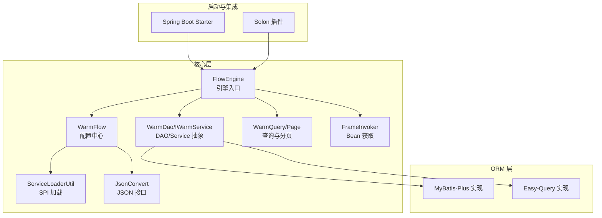
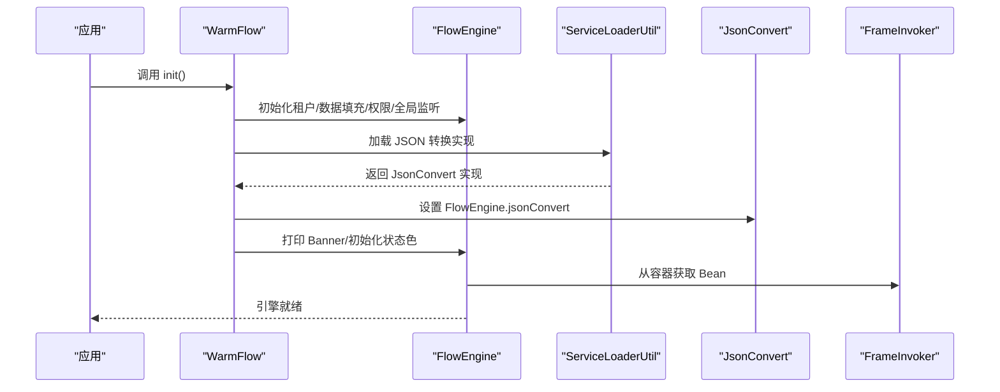
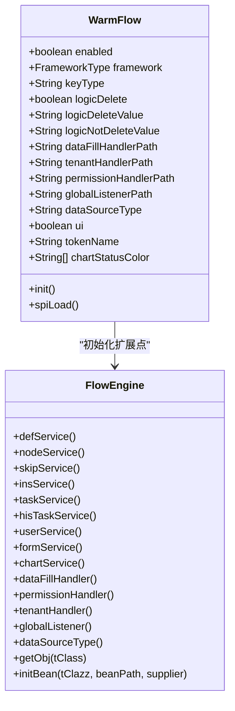
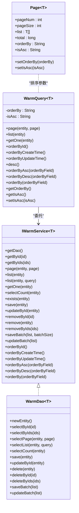
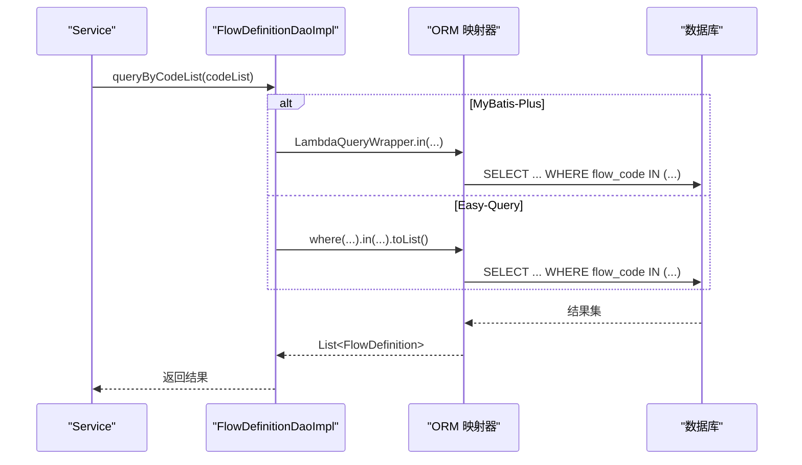
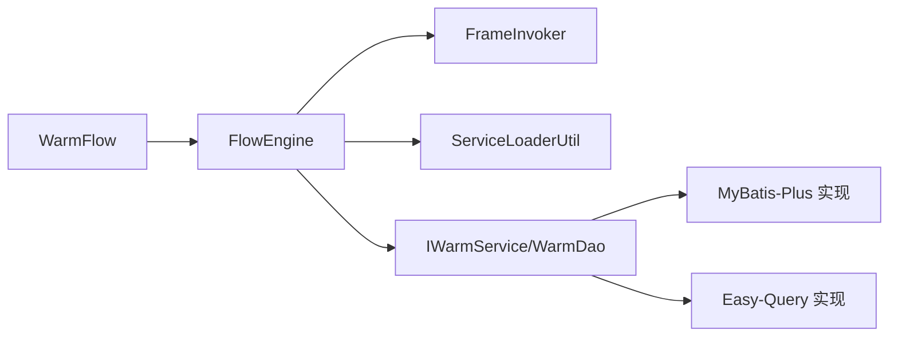
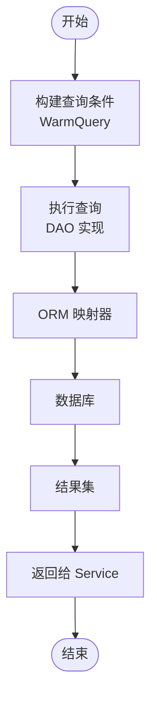

# 性能优化

<cite>
**本文引用的文件**
- [FlowEngine.java](file://warm-flow-core/src/main/java/org/dromara/warm/flow/core/FlowEngine.java)
- [WarmFlow.java](file://warm-flow-core/src/main/java/org/dromara/warm/flow/core/config/WarmFlow.java)
- [SqlHelper.java](file://warm-flow-core/src/main/java/org/dromara/warm/flow/core/utils/SqlHelper.java)
- [IWarmService.java](file://warm-flow-core/src/main/java/org/dromara/warm/flow/core/orm/service/IWarmService.java)
- [WarmDao.java](file://warm-flow-core/src/main/java/org/dromara/warm/flow/core/orm/dao/WarmDao.java)
- [WarmQuery.java](file://warm-flow-core/src/main/java/org/dromara/warm/flow/core/orm/agent/WarmQuery.java)
- [Page.java](file://warm-flow-core/src/main/java/org/dromara/warm/flow/core/utils/page/Page.java)
- [ServiceLoaderUtil.java](file://warm-flow-core/src/main/java/org/dromara/warm/flow/core/utils/ServiceLoaderUtil.java)
- [JsonConvert.java](file://warm-flow-core/src/main/java/org/dromara/warm/flow/core/json/JsonConvert.java)
- [FrameInvoker.java](file://warm-flow-core/src/main/java/org/dromara/warm/flow/core/invoker/FrameInvoker.java)
- [ClassUtil.java](file://warm-flow-core/src/main/java/org/dromara/warm/flow/core/utils/ClassUtil.java)
- [FrameworkType.java](file://warm-flow-core/src/main/java/org/dromara/warm/flow/core/enums/FrameworkType.java)
- [FlowDefinitionDaoImpl(MyBatis-Plus).java](file://warm-flow-orm/warm-flow-mybatis-plus/warm-flow-mybatis-plus-core/src/main/java/org/dromara/warm/flow/orm/dao/FlowDefinitionDaoImpl.java)
- [FlowDefinitionDaoImpl(Easy-Query).java](file://warm-flow-orm/warm-flow-easy-query/warm-flow-easy-query-core/src/main/java/org/dromara/warm/flow/orm/dao/FlowDefinitionDaoImpl.java)
- [FlowAutoConfig(SpringBoot Starter).java](file://warm-flow-orm/warm-flow-mybatis-plus/warm-flow-mybatis-plus-sb-starter/src/main/java/org/dromara/warm/flow/spring/boot/config/FlowAutoConfig.java)
- [FlowAutoConfig(Solon Plugin).java](file://warm-flow-orm/warm-flow-mybatis-plus/warm-flow-mybatis-plus-solon-plugin/src/main/java/org/dromara/warm/flow/solon/config/FlowAutoConfig.java)
- [warm-flow-all.sql](file://sql/mysql/warm-flow-all.sql)
</cite>

## 目录
1. [简介](#简介)
2. [项目结构](#项目结构)
3. [核心组件](#核心组件)
4. [架构总览](#架构总览)
5. [详细组件分析](#详细组件分析)
6. [依赖分析](#依赖分析)
7. [性能考虑](#性能考虑)
8. [故障排查指南](#故障排查指南)
9. [结论](#结论)
10. [附录](#附录)

## 简介
本技术指南聚焦于 Warm-Flow 工作流引擎在高并发与大数据量场景下的性能优化实践，围绕数据库查询优化、缓存策略、并发处理优化、监控指标与数据库调优等维度展开。文档基于仓库源码进行深入分析，提炼出可落地的优化策略与最佳实践，帮助读者在生产环境中稳定提升系统吞吐与稳定性。

## 项目结构
Warm-Flow 采用多模块分层设计：
- 核心模块（warm-flow-core）：定义引擎入口、配置、ORM 抽象、分页与查询代理、SPI 扩展点等。
- ORM 模块（warm-flow-orm）：提供 MyBatis、MyBatis-Plus、Easy-Query 三种实现，适配不同框架生态。
- 插件模块（warm-flow-plugin）：JSON 序列化插件、表达式与模式插件、UI 插件等。
- UI 模块（warm-flow-ui）：前端可视化设计器与表单设计能力。
- SQL 脚本（sql/mysql）：数据库初始化与版本升级脚本。

图表来源
- [FlowEngine.java:39-269](file://warm-flow-core/src/main/java/org/dromara/warm/flow/core/FlowEngine.java#L39-L269)
- [WarmFlow.java:36-173](file://warm-flow-core/src/main/java/org/dromara/warm/flow/core/config/WarmFlow.java#L36-L173)
- [IWarmService.java:33-209](file://warm-flow-core/src/main/java/org/dromara/warm/flow/core/orm/service/IWarmService.java#L33-L209)
- [WarmDao.java:31-129](file://warm-flow-core/src/main/java/org/dromara/warm/flow/core/orm/dao/WarmDao.java#L31-L129)
- [WarmQuery.java:34-178](file://warm-flow-core/src/main/java/org/dromara/warm/flow/core/orm/agent/WarmQuery.java#L34-L178)
- [Page.java:33-127](file://warm-flow-core/src/main/java/org/dromara/warm/flow/core/utils/page/Page.java#L33-L127)
- [ServiceLoaderUtil.java:27-149](file://warm-flow-core/src/main/java/org/dromara/warm/flow/core/utils/ServiceLoaderUtil.java#L27-L149)
- [JsonConvert.java:26-61](file://warm-flow-core/src/main/java/org/dromara/warm/flow/core/json/JsonConvert.java#L26-L61)
- [FrameInvoker.java:25-71](file://warm-flow-core/src/main/java/org/dromara/warm/flow/core/invoker/FrameInvoker.java#L25-L71)

章节来源
- [FlowEngine.java:39-269](file://warm-flow-core/src/main/java/org/dromara/warm/flow/core/FlowEngine.java#L39-L269)
- [WarmFlow.java:36-173](file://warm-flow-core/src/main/java/org/dromara/warm/flow/core/config/WarmFlow.java#L36-L173)

## 核心组件
- 引擎入口与配置
  - FlowEngine：集中管理 Service 与扩展点（数据填充、权限、租户、全局监听），提供 Bean 获取与 SPI 初始化。
  - WarmFlow：统一配置入口，支持框架类型、逻辑删除、数据源类型、UI 开关、颜色主题等；通过 SPI 加载 JSON 转换实现。
- ORM 抽象与查询
  - IWarmService/WarmDao：定义通用的增删改查、分页、批量操作与排序接口。
  - WarmQuery/Page：链式构建查询条件与排序，统一分页参数。
- 运行时集成
  - ServiceLoaderUtil：安全加载 SPI 实现，避免异常中断。
  - FrameInvoker：跨框架（Spring Boot/Solon）的 Bean 获取桥接。
  - JsonConvert：JSON 转换抽象，便于替换高性能实现。
- ORM 实现示例
  - MyBatis-Plus/Easy-Query：分别展示 Lambda/链式查询与 where 条件拼装，体现 ORM 层的查询构造效率。

章节来源
- [FlowEngine.java:72-267](file://warm-flow-core/src/main/java/org/dromara/warm/flow/core/FlowEngine.java#L72-L267)
- [WarmFlow.java:130-157](file://warm-flow-core/src/main/java/org/dromara/warm/flow/core/config/WarmFlow.java#L130-L157)
- [IWarmService.java:33-209](file://warm-flow-core/src/main/java/org/dromara/warm/flow/core/orm/service/IWarmService.java#L33-L209)
- [WarmDao.java:31-129](file://warm-flow-core/src/main/java/org/dromara/warm/flow/core/orm/dao/WarmDao.java#L31-L129)
- [WarmQuery.java:34-178](file://warm-flow-core/src/main/java/org/dromara/warm/flow/core/orm/agent/WarmQuery.java#L34-L178)
- [Page.java:33-127](file://warm-flow-core/src/main/java/org/dromara/warm/flow/core/utils/page/Page.java#L33-L127)
- [ServiceLoaderUtil.java:36-91](file://warm-flow-core/src/main/java/org/dromara/warm/flow/core/utils/ServiceLoaderUtil.java#L36-L91)
- [FrameInvoker.java:46-71](file://warm-flow-core/src/main/java/org/dromara/warm/flow/core/invoker/FrameInvoker.java#L46-L71)
- [JsonConvert.java:26-61](file://warm-flow-core/src/main/java/org/dromara/warm/flow/core/json/JsonConvert.java#L26-L61)

## 架构总览
Warm-Flow 的运行时由“配置中心 + 引擎入口 + ORM 抽象 + ORM 实现 + 启动集成”构成。WarmFlow 在启动时完成扩展点初始化与 SPI 加载，FlowEngine 作为门面协调各模块协作；ORM 层通过 DAO 实现具体数据库访问，支持多种 ORM 框架。

图表来源
- [WarmFlow.java:130-157](file://warm-flow-core/src/main/java/org/dromara/warm/flow/core/config/WarmFlow.java#L130-L157)
- [ServiceLoaderUtil.java:36-91](file://warm-flow-core/src/main/java/org/dromara/warm/flow/core/utils/ServiceLoaderUtil.java#L36-L91)
- [FlowEngine.java:180-222](file://warm-flow-core/src/main/java/org/dromara/warm/flow/core/FlowEngine.java#L180-L222)
- [FrameInvoker.java:46-71](file://warm-flow-core/src/main/java/org/dromara/warm/flow/core/invoker/FrameInvoker.java#L46-L71)

## 详细组件分析

### 引擎入口与配置（FlowEngine/WarmFlow）
- 设计要点
  - FlowEngine 以静态工厂与延迟注入结合的方式，屏蔽框架差异，提供统一的 Service 获取与扩展点初始化。
  - WarmFlow 通过 SPI 加载 JSON 转换实现，支持多实现并容错选择首个可用实现。
- 性能关联
  - 扩展点懒加载与 SPI 容错可降低启动时的失败风险与冷启动成本。
  - 通过 WarmFlow 配置数据源类型与逻辑删除策略，可减少 ORM 层分支判断与条件拼装开销。

图表来源
- [WarmFlow.java:36-173](file://warm-flow-core/src/main/java/org/dromara/warm/flow/core/config/WarmFlow.java#L36-L173)
- [FlowEngine.java:72-267](file://warm-flow-core/src/main/java/org/dromara/warm/flow/core/FlowEngine.java#L72-L267)

章节来源
- [WarmFlow.java:130-157](file://warm-flow-core/src/main/java/org/dromara/warm/flow/core/config/WarmFlow.java#L130-L157)
- [FlowEngine.java:180-222](file://warm-flow-core/src/main/java/org/dromara/warm/flow/core/FlowEngine.java#L180-L222)

### ORM 抽象与查询（IWarmService/WarmDao/WarmQuery/Page）
- 设计要点
  - IWarmService/WarmDao 定义统一 CRUD、分页、批量与排序接口，屏蔽不同 ORM 的差异。
  - WarmQuery 支持链式排序与分页参数传递，Page 统一分页与排序字段。
- 性能关联
  - 统一的分页与排序接口可减少重复代码与错误，避免 N+1 查询。
  - WarmQuery 的排序方向与字段在 Service 层集中控制，有利于 SQL 执行计划复用。

图表来源
- [IWarmService.java:33-209](file://warm-flow-core/src/main/java/org/dromara/warm/flow/core/orm/service/IWarmService.java#L33-L209)
- [WarmDao.java:31-129](file://warm-flow-core/src/main/java/org/dromara/warm/flow/core/orm/dao/WarmDao.java#L31-L129)
- [WarmQuery.java:34-178](file://warm-flow-core/src/main/java/org/dromara/warm/flow/core/orm/agent/WarmQuery.java#L34-L178)
- [Page.java:33-127](file://warm-flow-core/src/main/java/org/dromara/warm/flow/core/utils/page/Page.java#L33-L127)

章节来源
- [IWarmService.java:33-209](file://warm-flow-core/src/main/java/org/dromara/warm/flow/core/orm/service/IWarmService.java#L33-L209)
- [WarmDao.java:31-129](file://warm-flow-core/src/main/java/org/dromara/warm/flow/core/orm/dao/WarmDao.java#L31-L129)
- [WarmQuery.java:61-178](file://warm-flow-core/src/main/java/org/dromara/warm/flow/core/orm/agent/WarmQuery.java#L61-L178)
- [Page.java:75-127](file://warm-flow-core/src/main/java/org/dromara/warm/flow/core/utils/page/Page.java#L75-L127)

### ORM 实现对比（MyBatis-Plus vs Easy-Query）
- MyBatis-Plus 实现
  - 使用 LambdaQueryWrapper 构建查询条件，适合快速拼装 in、相等条件。
  - 通过 Mapper 接口执行，易于与分页插件配合。
- Easy-Query 实现
  - 使用链式 where/setColumns/executeRows，条件构建更显式，便于维护与调试。
  - 支持拦截器与代理，可统一处理租户、逻辑删除等横切需求。
- 性能关联
  - 两种实现均避免手写复杂 SQL，减少解析与编译成本。
  - 条件拼装集中在 DAO 层，利于统一优化与缓存命中。

图表来源
- [FlowDefinitionDaoImpl(MyBatis-Plus).java:45-56](file://warm-flow-orm/warm-flow-mybatis-plus/warm-flow-mybatis-plus-core/src/main/java/org/dromara/warm/flow/orm/dao/FlowDefinitionDaoImpl.java#L45-L56)
- [FlowDefinitionDaoImpl(Easy-Query).java:40-52](file://warm-flow-orm/warm-flow-easy-query/warm-flow-easy-query-core/src/main/java/org/dromara/warm/flow/orm/dao/FlowDefinitionDaoImpl.java#L40-L52)

章节来源
- [FlowDefinitionDaoImpl(MyBatis-Plus).java:45-56](file://warm-flow-orm/warm-flow-mybatis-plus/warm-flow-mybatis-plus-core/src/main/java/org/dromara/warm/flow/orm/dao/FlowDefinitionDaoImpl.java#L45-L56)
- [FlowDefinitionDaoImpl(Easy-Query).java:40-52](file://warm-flow-orm/warm-flow-easy-query/warm-flow-easy-query-core/src/main/java/org/dromara/warm/flow/orm/dao/FlowDefinitionDaoImpl.java#L40-L52)

### 启动与集成（Spring Boot/Solon）
- Spring Boot Starter 与 Solon 插件负责自动装配 Warm-Flow 组件，确保 FlowEngine 与 WarmFlow 在容器启动时完成初始化。
- 通过 FlowAutoConfig 注册必要 Bean，简化接入成本。

章节来源
- [FlowAutoConfig(SpringBoot Starter).java](file://warm-flow-orm/warm-flow-mybatis-plus/warm-flow-mybatis-plus-sb-starter/src/main/java/org/dromara/warm/flow/spring/boot/config/FlowAutoConfig.java)
- [FlowAutoConfig(Solon Plugin).java](file://warm-flow-orm/warm-flow-mybatis-plus/warm-flow-mybatis-plus-solon-plugin/src/main/java/org/dromara/warm/flow/solon/config/FlowAutoConfig.java)

## 依赖分析
- 组件耦合
  - FlowEngine 对 WarmFlow、FrameInvoker、ServiceLoaderUtil 存在直接依赖，用于初始化与运行时获取 Bean。
  - ORM 层通过 DAO 实现与具体映射器交互，解耦上层 Service。
- 外部依赖
  - Spring Boot/Solon 容器用于 Bean 生命周期管理。
  - ORM 框架（MyBatis/MyBatis-Plus/Easy-Query）提供 SQL 构造与执行能力。
- 循环依赖
  - 代码未见循环依赖迹象；WarmFlow 仅在初始化阶段被调用，不反向依赖 FlowEngine。

图表来源
- [WarmFlow.java:130-157](file://warm-flow-core/src/main/java/org/dromara/warm/flow/core/config/WarmFlow.java#L130-L157)
- [FlowEngine.java:180-222](file://warm-flow-core/src/main/java/org/dromara/warm/flow/core/FlowEngine.java#L180-L222)
- [ServiceLoaderUtil.java:36-91](file://warm-flow-core/src/main/java/org/dromara/warm/flow/core/utils/ServiceLoaderUtil.java#L36-L91)
- [FrameInvoker.java:46-71](file://warm-flow-core/src/main/java/org/dromara/warm/flow/core/invoker/FrameInvoker.java#L46-L71)

章节来源
- [FlowEngine.java:231-267](file://warm-flow-core/src/main/java/org/dromara/warm/flow/core/FlowEngine.java#L231-L267)
- [ServiceLoaderUtil.java:36-91](file://warm-flow-core/src/main/java/org/dromara/warm/flow/core/utils/ServiceLoaderUtil.java#L36-L91)

## 性能考虑

### 数据库查询优化
- 统一分页与排序
  - 使用 WarmQuery 与 Page 统一排序字段与方向，避免重复拼装 SQL。
  - 在高频查询场景下，优先使用覆盖索引列进行排序与过滤。
- 条件拼装与批量操作
  - DAO 层集中构建 where/in 条件，减少上层重复逻辑。
  - 批量新增/更新时合理设置批次大小，平衡内存占用与网络往返。
- 逻辑删除与租户隔离
  - WarmFlow 支持逻辑删除与租户处理，建议在 DAO 层统一注入条件，减少业务层负担。
- SQL 辅助
  - SqlHelper 提供布尔与计数返回值的标准化处理，减少空指针与类型转换开销。

章节来源
- [WarmQuery.java:61-178](file://warm-flow-core/src/main/java/org/dromara/warm/flow/core/orm/agent/WarmQuery.java#L61-L178)
- [Page.java:75-127](file://warm-flow-core/src/main/java/org/dromara/warm/flow/core/utils/page/Page.java#L75-L127)
- [SqlHelper.java:33-55](file://warm-flow-core/src/main/java/org/dromara/warm/flow/core/utils/SqlHelper.java#L33-L55)

### 缓存策略
- 读多写少场景
  - 对热点流程定义、节点配置、表单模板等进行二级缓存，结合失效策略与一致性保证。
- 分布式缓存
  - 使用本地缓存（如 Caffeine）与分布式缓存（Redis）双层缓存，降低数据库压力。
- 缓存穿透与击穿
  - 对空结果也做短时缓存；对热点 Key 做互斥更新，避免雪崩。

### 并发处理优化
- 线程模型
  - 控制并发度，避免过度并发导致上下文切换与锁竞争；对长事务进行拆分。
- 无锁化与原子操作
  - 对计数、版本号等使用 CAS 或原子变量，减少锁粒度。
- 异步化
  - 将非关键路径（日志、通知、统计）异步化，缩短请求链路。

### 性能监控指标
- 关键指标
  - 响应时间：P50/P90/P99 延迟，区分接口与数据库耗时。
  - 吞吐量：QPS、并发数、错误率。
  - 资源使用：CPU、内存、GC 次数与停顿时间、线程数峰值。
  - 数据库指标：慢查询数、连接池使用率、锁等待时间。
- 监控落盘
  - 通过埋点或 APM（如 SkyWalking/OpenTelemetry）采集链路数据，结合日志与告警联动。

### 数据库性能优化（索引、SQL、连接池）
- 索引优化
  - 为常用过滤与排序字段建立复合索引；定期分析执行计划，剔除冗余索引。
- SQL 优化
  - 避免 SELECT *；使用 LIMIT 限制结果集；拆分大查询为小批量。
- 连接池配置
  - 合理设置最大连接数、空闲超时、获取超时；根据 QPS 与并发度动态调整。
- 版本升级脚本参考
  - 可结合 warm-flow-all.sql 评估表结构与索引现状，按需补充缺失索引。

章节来源
- [warm-flow-all.sql](file://sql/mysql/warm-flow-all.sql)

### 内存使用优化与 GC 调优
- 对象复用
  - 复用 WarmQuery、Page 等对象，减少频繁分配。
- 字符串与集合
  - 避免在热路径频繁拼接字符串；使用 StringBuilder 或预分配容量。
- GC 调优
  - 观察 Full GC 次数与停顿；调整新生代/老年代比例与垃圾收集器；对大对象使用 G1/ ZGC。

### 高并发场景调优策略
- 限流与熔断
  - 对核心接口实施限流（令牌桶/漏桶），超过阈值快速失败并降级。
- 读写分离与分库分表
  - 将热点表拆分，结合分片键路由，降低单表压力。
- 任务队列
  - 将批处理任务放入消息队列，削峰填谷。

## 故障排查指南
- 扩展点初始化失败
  - 检查 WarmFlow 配置项与 SPI 实现类路径；确认实现类可实例化且无依赖缺失。
- Bean 获取为空
  - 核查 FrameInvoker 的 Bean 函数是否正确注册；确认容器已启动完成。
- JSON 转换异常
  - 确认 JsonConvert SPI 实现加载成功；必要时回退至默认实现。
- ORM 条件不生效
  - 检查 DAO 中 where/in 条件是否正确拼装；关注空集合与空字符串的边界处理。
- SQL 执行异常
  - 使用 SqlHelper 标准化返回值；核对逻辑删除与租户条件是否被注入。

章节来源
- [FlowEngine.java:180-222](file://warm-flow-core/src/main/java/org/dromara/warm/flow/core/FlowEngine.java#L180-L222)
- [ServiceLoaderUtil.java:36-91](file://warm-flow-core/src/main/java/org/dromara/warm/flow/core/utils/ServiceLoaderUtil.java#L36-L91)
- [FrameInvoker.java:46-71](file://warm-flow-core/src/main/java/org/dromara/warm/flow/core/invoker/FrameInvoker.java#L46-L71)
- [SqlHelper.java:33-55](file://warm-flow-core/src/main/java/org/dromara/warm/flow/core/utils/SqlHelper.java#L33-L55)

## 结论
Warm-Flow 通过清晰的分层与抽象（WarmDao/IWarmService/WarmQuery/Page）、可插拔的扩展点（WarmFlow/SPI）、以及多 ORM 实现（MyBatis-Plus/Easy-Query），为性能优化提供了坚实基础。结合本文提出的数据库优化、缓存策略、并发与 GC 调优、监控指标与高并发治理策略，可在生产环境中显著提升系统稳定性与吞吐能力。

## 附录
- 关键流程图（ORM 查询链路）

图表来源
- [WarmQuery.java:61-178](file://warm-flow-core/src/main/java/org/dromara/warm/flow/core/orm/agent/WarmQuery.java#L61-L178)
- [FlowDefinitionDaoImpl(MyBatis-Plus).java:45-56](file://warm-flow-orm/warm-flow-mybatis-plus/warm-flow-mybatis-plus-core/src/main/java/org/dromara/warm/flow/orm/dao/FlowDefinitionDaoImpl.java#L45-L56)
- [FlowDefinitionDaoImpl(Easy-Query).java:40-52](file://warm-flow-orm/warm-flow-easy-query/warm-flow-easy-query-core/src/main/java/org/dromara/warm/flow/orm/dao/FlowDefinitionDaoImpl.java#L40-L52)