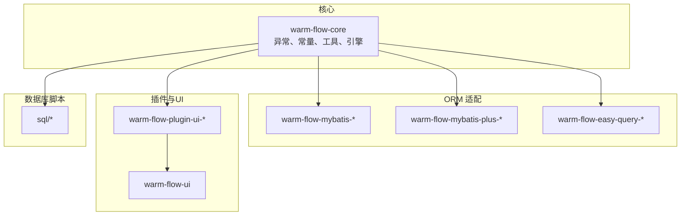
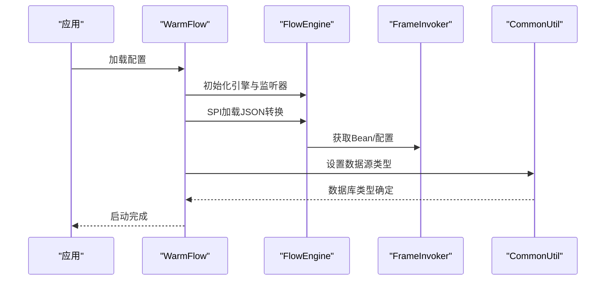
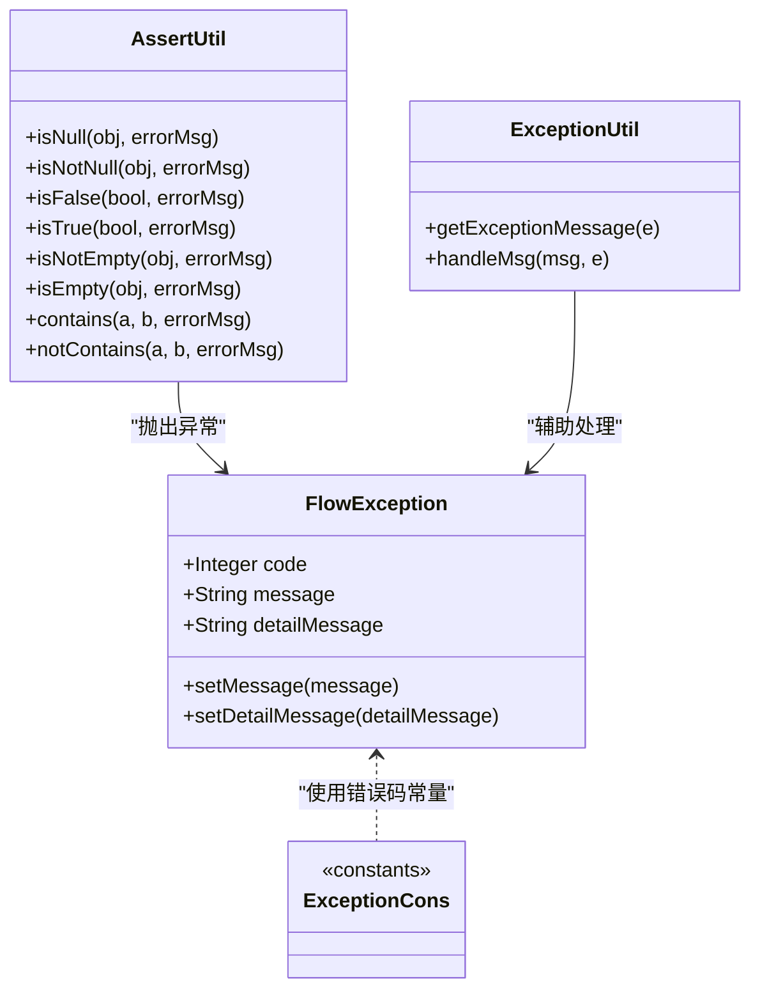
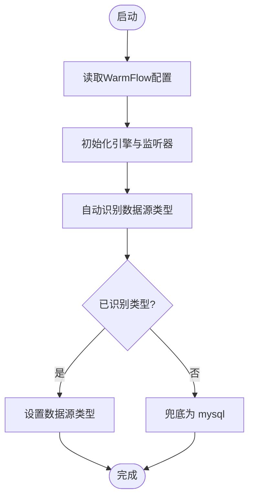
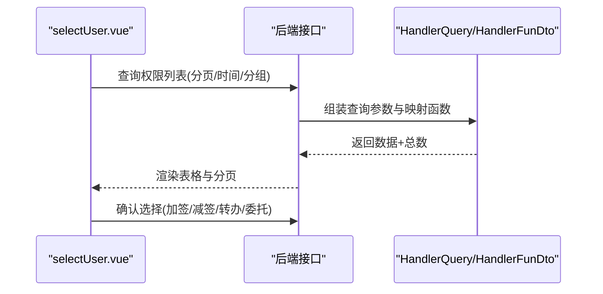
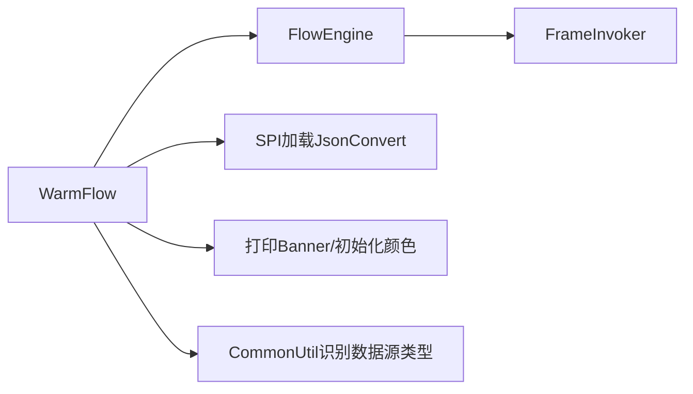

# 故障排除

<cite>
**本文引用的文件**   
- [FlowException.java](file://warm-flow-core/src/main/java/org/dromara/warm/flow/core/exception/FlowException.java)
- [ExceptionCons.java](file://warm-flow-core/src/main/java/org/dromara/warm/flow/core/constant/ExceptionCons.java)
- [ExceptionUtil.java](file://warm-flow-core/src/main/java/org/dromara/warm/flow/core/utils/ExceptionUtil.java)
- [AssertUtil.java](file://warm-flow-core/src/main/java/org/dromara/warm/flow/core/utils/AssertUtil.java)
- [SqlHelper.java](file://warm-flow-core/src/main/java/org/dromara/warm/flow/core/utils/SqlHelper.java)
- [FlowConfigCons.java](file://warm-flow-core/src/main/java/org/dromara/warm/flow/core/constant/FlowConfigCons.java)
- [FlowCons.java](file://warm-flow-core/src/main/java/org/dromara/warm/flow/core/constant/FlowCons.java)
- [WarmFlow.java](file://warm-flow-core/src/main/java/org/dromara/warm/flow/core/config/WarmFlow.java)
- [FrameInvoker.java](file://warm-flow-core/src/main/java/org/dromara/warm/flow/core/invoker/FrameInvoker.java)
- [FlowEngine.java](file://warm-flow-core/src/main/java/org/dromara/warm/flow/core/FlowEngine.java)
- [CommonUtil.java](file://warm-flow-orm/warm-flow-mybatis/warm-flow-mybatis-core/src/main/java/org/dromara/warm/flow/orm/utils/CommonUtil.java)
- [FlowNodeMapper.xml](file://warm-flow-orm/warm-flow-mybatis/warm-flow-mybatis-core/src/main/resources/warm/flow/FlowNodeMapper.xml)
- [README.md](file://README.md)
- [ie.html](file://warm-flow-ui/html/ie.html)
- [HandlerFunDto.java](file://warm-flow-plugin/warm-flow-plugin-ui/warm-flow-plugin-ui-core/src/main/java/org/dromara/warm/flow/ui/dto/HandlerFunDto.java)
- [HandlerQuery.java](file://warm-flow-plugin/warm-flow-plugin-ui/warm-flow-plugin-ui-core/src/main/java/org/dromara/warm/flow/ui/dto/HandlerQuery.java)
- [selectUser.vue](file://warm-flow-ui/src/components/design/common/vue/selectUser.vue)
- [postgresql-warm-flow-all.sql](file://sql/postgresql/postgresql-warm-flow-all.sql)
- [ISSUE_TEMPLATE.zh-CN.md](file://.gitee/ISSUE_TEMPLATE.zh-CN.md)
- [bug.yml](file://.gitee/ISSUE_TEMPLATE/bug.yml)
</cite>

## 目录
1. [简介](#简介)
2. [项目结构](#项目结构)
3. [核心组件](#核心组件)
4. [架构总览](#架构总览)
5. [详细组件分析](#详细组件分析)
6. [依赖分析](#依赖分析)
7. [性能考虑](#性能考虑)
8. [故障排除指南](#故障排除指南)
9. [结论](#结论)
10. [附录](#附录)

## 简介
本文件面向 Warm-Flow 的使用者与维护者，提供系统化的故障排除指南。内容覆盖配置错误、数据库连接与方言识别问题、权限异常、流程定义与实例异常、ORM 层常见问题、日志分析方法、性能排查与优化建议，以及预防性维护与监控告警设置建议。文档以仓库现有代码与资源为依据，结合实际可落地的诊断步骤与处理策略，帮助快速定位并解决问题。

## 项目结构
Warm-Flow 采用多模块分层组织，核心能力集中在 warm-flow-core，并通过 ORM 模块（MyBatis/MyBatis-Plus/EasyQuery）适配不同持久化方案；UI 插件与前端工程提供可视化设计与交互；SQL 脚本提供数据库初始化与版本升级支持。

**图表来源**
- [FlowEngine.java:39-270](file://warm-flow-core/src/main/java/org/dromara/warm/flow/core/FlowEngine.java#L39-L270)
- [CommonUtil.java:29-61](file://warm-flow-orm/warm-flow-mybatis/warm-flow-mybatis-core/src/main/java/org/dromara/warm/flow/orm/utils/CommonUtil.java#L29-L61)
- [README.md:67-68](file://README.md#L67-L68)

**章节来源**
- [README.md:67-68](file://README.md#L67-L68)

## 核心组件
- 异常体系：统一的 FlowException 用于承载业务异常与错误信息，配合 ExceptionCons 常量集中管理错误提示语。
- 断言工具：AssertUtil 提供丰富的断言方法，统一抛出 FlowException，便于在流程控制点快速暴露问题。
- ORM 工具：SqlHelper 提供数据库操作结果判断的通用方法，简化业务层判断逻辑。
- 配置常量：FlowConfigCons 定义 Warm-Flow 的关键配置项键名，如数据源类型、逻辑删除、UI 开关等。
- 引擎与注入：FlowEngine 负责服务获取与处理器初始化；FrameInvoker 提供 Bean 与配置的获取入口；WarmFlow 作为配置入口初始化引擎与 SPI。

**章节来源**
- [FlowException.java:25-80](file://warm-flow-core/src/main/java/org/dromara/warm/flow/core/exception/FlowException.java#L25-L80)
- [ExceptionCons.java:24-158](file://warm-flow-core/src/main/java/org/dromara/warm/flow/core/constant/ExceptionCons.java#L24-L158)
- [AssertUtil.java:29-111](file://warm-flow-core/src/main/java/org/dromara/warm/flow/core/utils/AssertUtil.java#L29-L111)
- [SqlHelper.java:24-57](file://warm-flow-core/src/main/java/org/dromara/warm/flow/core/utils/SqlHelper.java#L24-L57)
- [FlowConfigCons.java:23-75](file://warm-flow-core/src/main/java/org/dromara/warm/flow/core/constant/FlowConfigCons.java#L23-L75)
- [FlowEngine.java:39-270](file://warm-flow-core/src/main/java/org/dromara/warm/flow/core/FlowEngine.java#L39-L270)
- [FrameInvoker.java:46-69](file://warm-flow-core/src/main/java/org/dromara/warm/flow/core/invoker/FrameInvoker.java#L46-L69)
- [WarmFlow.java:139-173](file://warm-flow-core/src/main/java/org/dromara/warm/flow/core/config/WarmFlow.java#L139-L173)

## 架构总览
Warm-Flow 在运行期通过 WarmFlow 初始化配置，加载 JSON 转换策略与全局监听器，随后由 FlowEngine 统一调度各服务与处理器。ORM 层通过 CommonUtil 自动识别数据库类型，确保 SQL 方言正确。

**图表来源**
- [WarmFlow.java:139-173](file://warm-flow-core/src/main/java/org/dromara/warm/flow/core/config/WarmFlow.java#L139-L173)
- [FlowEngine.java:248-267](file://warm-flow-core/src/main/java/org/dromara/warm/flow/core/FlowEngine.java#L248-L267)
- [FrameInvoker.java:46-69](file://warm-flow-core/src/main/java/org/dromara/warm/flow/core/invoker/FrameInvoker.java#L46-L69)
- [CommonUtil.java:34-60](file://warm-flow-orm/warm-flow-mybatis/warm-flow-mybatis-core/src/main/java/org/dromara/warm/flow/orm/utils/CommonUtil.java#L34-L60)

## 详细组件分析

### 异常与错误码体系
- FlowException：统一异常载体，支持消息、错误码与细节信息设置。
- ExceptionCons：集中定义流程引擎常用错误提示语，涵盖流程定义、节点、任务、表单、权限等场景。
- AssertUtil：断言工具，统一抛出 FlowException，便于在参数校验、空值判断等处快速暴露问题。
- ExceptionUtil：辅助生成异常堆栈信息与消息拼接。

**图表来源**
- [FlowException.java:25-80](file://warm-flow-core/src/main/java/org/dromara/warm/flow/core/exception/FlowException.java#L25-L80)
- [ExceptionCons.java:24-158](file://warm-flow-core/src/main/java/org/dromara/warm/flow/core/constant/ExceptionCons.java#L24-L158)
- [AssertUtil.java:29-111](file://warm-flow-core/src/main/java/org/dromara/warm/flow/core/utils/AssertUtil.java#L29-L111)
- [ExceptionUtil.java:27-47](file://warm-flow-core/src/main/java/org/dromara/warm/flow/core/utils/ExceptionUtil.java#L27-L47)

**章节来源**
- [FlowException.java:25-80](file://warm-flow-core/src/main/java/org/dromara/warm/flow/core/exception/FlowException.java#L25-L80)
- [ExceptionCons.java:24-158](file://warm-flow-core/src/main/java/org/dromara/warm/flow/core/constant/ExceptionCons.java#L24-L158)
- [AssertUtil.java:29-111](file://warm-flow-core/src/main/java/org/dromara/warm/flow/core/utils/AssertUtil.java#L29-L111)
- [ExceptionUtil.java:27-47](file://warm-flow-core/src/main/java/org/dromara/warm/flow/core/utils/ExceptionUtil.java#L27-L47)

### 配置与数据源识别
- FlowConfigCons：定义配置键名，如数据源类型、逻辑删除、UI 开关、权限令牌名等。
- WarmFlow：初始化引擎、打印 Banner、加载 JSON 转换策略与全局监听器。
- CommonUtil：根据 MyBatis Configuration 与 DataSource 自动识别数据库类型，兜底为 mysql。

**图表来源**
- [FlowConfigCons.java:23-75](file://warm-flow-core/src/main/java/org/dromara/warm/flow/core/constant/FlowConfigCons.java#L23-L75)
- [WarmFlow.java:139-173](file://warm-flow-core/src/main/java/org/dromara/warm/flow/core/config/WarmFlow.java#L139-L173)
- [CommonUtil.java:34-60](file://warm-flow-orm/warm-flow-mybatis/warm-flow-mybatis-core/src/main/java/org/dromara/warm/flow/orm/utils/CommonUtil.java#L34-L60)

**章节来源**
- [FlowConfigCons.java:23-75](file://warm-flow-core/src/main/java/org/dromara/warm/flow/core/constant/FlowConfigCons.java#L23-L75)
- [WarmFlow.java:139-173](file://warm-flow-core/src/main/java/org/dromara/warm/flow/core/config/WarmFlow.java#L139-L173)
- [CommonUtil.java:34-60](file://warm-flow-orm/warm-flow-mybatis/warm-flow-mybatis-core/src/main/java/org/dromara/warm/flow/orm/utils/CommonUtil.java#L34-L60)

### 权限与UI交互
- HandlerFunDto/HandlerQuery：定义权限查询与映射函数，支撑 UI 侧权限选择与分页查询。
- selectUser.vue：提供权限人员选择弹窗，支持分组、时间范围筛选与分页。

**图表来源**
- [HandlerQuery.java:40-71](file://warm-flow-plugin/warm-flow-plugin-ui/warm-flow-plugin-ui-core/src/main/java/org/dromara/warm/flow/ui/dto/HandlerQuery.java#L40-L71)
- [HandlerFunDto.java:69-73](file://warm-flow-plugin/warm-flow-plugin-ui/warm-flow-plugin-ui-core/src/main/java/org/dromara/warm/flow/ui/dto/HandlerFunDto.java#L69-L73)
- [selectUser.vue:103-133](file://warm-flow-ui/src/components/design/common/vue/selectUser.vue#L103-L133)

**章节来源**
- [HandlerQuery.java:40-71](file://warm-flow-plugin/warm-flow-plugin-ui/warm-flow-plugin-ui-core/src/main/java/org/dromara/warm/flow/ui/dto/HandlerQuery.java#L40-L71)
- [HandlerFunDto.java:69-73](file://warm-flow-plugin/warm-flow-plugin-ui/warm-flow-plugin-ui-core/src/main/java/org/dromara/warm/flow/ui/dto/HandlerFunDto.java#L69-L73)
- [selectUser.vue:103-133](file://warm-flow-ui/src/components/design/common/vue/selectUser.vue#L103-L133)

## 依赖分析
- FlowEngine 通过 FrameInvoker 获取 Bean 与配置，避免强耦合。
- WarmFlow 通过 SPI 机制加载 JsonConvert 实现，保证扩展性。
- CommonUtil 对数据库类型识别采用容错策略，避免因元数据读取失败导致启动异常。

**图表来源**
- [FlowEngine.java:248-267](file://warm-flow-core/src/main/java/org/dromara/warm/flow/core/FlowEngine.java#L248-L267)
- [FrameInvoker.java:46-69](file://warm-flow-core/src/main/java/org/dromara/warm/flow/core/invoker/FrameInvoker.java#L46-L69)
- [WarmFlow.java:139-173](file://warm-flow-core/src/main/java/org/dromara/warm/flow/core/config/WarmFlow.java#L139-L173)
- [CommonUtil.java:34-60](file://warm-flow-orm/warm-flow-mybatis/warm-flow-mybatis-core/src/main/java/org/dromara/warm/flow/orm/utils/CommonUtil.java#L34-L60)

**章节来源**
- [FlowEngine.java:248-267](file://warm-flow-core/src/main/java/org/dromara/warm/flow/core/FlowEngine.java#L248-L267)
- [FrameInvoker.java:46-69](file://warm-flow-core/src/main/java/org/dromara/warm/flow/core/invoker/FrameInvoker.java#L46-L69)
- [WarmFlow.java:139-173](file://warm-flow-core/src/main/java/org/dromara/warm/flow/core/config/WarmFlow.java#L139-L173)
- [CommonUtil.java:34-60](file://warm-flow-orm/warm-flow-mybatis/warm-flow-mybatis-core/src/main/java/org/dromara/warm/flow/orm/utils/CommonUtil.java#L34-L60)

## 性能考虑
- 数据库操作结果判断：使用 SqlHelper 统一判断影响行数，减少分支判断开销。
- 数据源类型识别：CommonUtil 在配置缺失时自动探测并兜底，避免因类型错误导致的 SQL 性能问题。
- ORM 映射字段：FlowNodeMapper.xml 中的动态字段更新与查询条件，应确保索引与覆盖查询命中率，降低全表扫描风险。
- UI 权限查询：selectUser.vue 支持分页与时间范围筛选，建议后端实现分页与索引优化，避免大表全量扫描。

**章节来源**
- [SqlHelper.java:24-57](file://warm-flow-core/src/main/java/org/dromara/warm/flow/core/utils/SqlHelper.java#L24-L57)
- [CommonUtil.java:34-60](file://warm-flow-orm/warm-flow-mybatis/warm-flow-mybatis-core/src/main/java/org/dromara/warm/flow/orm/utils/CommonUtil.java#L34-L60)
- [FlowNodeMapper.xml:322-430](file://warm-flow-orm/warm-flow-mybatis/warm-flow-mybatis-core/src/main/resources/warm/flow/FlowNodeMapper.xml#L322-L430)
- [selectUser.vue:90-97](file://warm-flow-ui/src/components/design/common/vue/selectUser.vue#L90-L97)

## 故障排除指南

### 一、配置错误
- 现象
  - 启动阶段无 Banner 输出或颜色初始化异常。
  - 数据源类型识别失败导致 SQL 方言不匹配。
  - UI 开关未生效或权限令牌名不一致。
- 诊断步骤
  - 检查 WarmFlow 配置项键名是否正确（参考 FlowConfigCons）。
  - 确认 banner、ui、token-name 等键是否存在且值正确。
  - 观察启动日志中 Banner 输出与颜色初始化是否执行。
- 处理策略
  - 修正配置键名与值，确保与 FlowConfigCons 保持一致。
  - 若未设置数据源类型，确认 MyBatis Configuration 与 DataSource 可用，CommonUtil 将自动识别并兜底。

**章节来源**
- [FlowConfigCons.java:23-75](file://warm-flow-core/src/main/java/org/dromara/warm/flow/core/constant/FlowConfigCons.java#L23-L75)
- [WarmFlow.java:139-173](file://warm-flow-core/src/main/java/org/dromara/warm/flow/core/config/WarmFlow.java#L139-L173)
- [CommonUtil.java:34-60](file://warm-flow-orm/warm-flow-mybatis/warm-flow-mybatis-core/src/main/java/org/dromara/warm/flow/orm/utils/CommonUtil.java#L34-L60)

### 二、数据库连接与方言问题
- 现象
  - SQL 报错或执行异常，提示语法不支持。
  - 分页或排序在特定数据库上表现异常。
- 诊断步骤
  - 查看启动日志中数据源类型识别过程。
  - 确认数据库产品名与方言映射是否符合预期。
- 处理策略
  - 显式设置数据源类型键（参考 FlowConfigCons），避免自动识别失败。
  - 如需兼容旧版数据库，优先使用官方提供的 SQL 脚本与方言适配。

**章节来源**
- [FlowConfigCons.java:64-64](file://warm-flow-core/src/main/java/org/dromara/warm/flow/core/constant/FlowConfigCons.java#L64-L64)
- [CommonUtil.java:34-60](file://warm-flow-orm/warm-flow-mybatis/warm-flow-mybatis-core/src/main/java/org/dromara/warm/flow/orm/utils/CommonUtil.java#L34-L60)

### 三、权限异常
- 现象
  - “无法跳转到该节点，请检查当前用户是否有权限”、“请检查当前用户是否有权限”等提示。
  - 加签/减签/转办/委托时提示对象为空或重复。
- 诊断步骤
  - 校验当前用户是否具备目标节点的权限标识。
  - 检查 UI 侧权限选择是否正确传入后端（HandlerQuery/HandlerFunDto）。
  - 关注 selectUser.vue 的分页与筛选参数是否完整。
- 处理策略
  - 修正权限配置与用户角色映射。
  - 确保前端选择的权限对象非空且唯一，避免重复加签/减签。

**章节来源**
- [ExceptionCons.java:64-64](file://warm-flow-core/src/main/java/org/dromara/warm/flow/core/constant/ExceptionCons.java#L64-L64)
- [ExceptionCons.java:96-96](file://warm-flow-core/src/main/java/org/dromara/warm/flow/core/constant/ExceptionCons.java#L96-L96)
- [HandlerQuery.java:40-71](file://warm-flow-plugin/warm-flow-plugin-ui/warm-flow-plugin-ui-core/src/main/java/org/dromara/warm/flow/ui/dto/HandlerQuery.java#L40-L71)
- [HandlerFunDto.java:69-73](file://warm-flow-plugin/warm-flow-plugin-ui/warm-flow-plugin-ui-core/src/main/java/org/dromara/warm/flow/ui/dto/HandlerFunDto.java#L69-L73)
- [selectUser.vue:103-133](file://warm-flow-ui/src/components/design/common/vue/selectUser.vue#L103-L133)

### 四、流程定义与实例异常
- 常见错误提示与处理
  - “流程定义不存在”“流程实例获取失败”“流程实例id不能为空”“任务id不能为空”：检查流程编码、实例ID与任务ID是否正确传入。
  - “开始节点不能超过1个”“缺少开始节点”“节点编码缺失/重复”：检查流程图设计，确保仅有一个开始节点且节点编码唯一。
  - “当前流程节点丢失/目标节点为空/未找到跳转条件”：检查节点连线与条件配置，确保跳转链路完整。
  - “流程已完成/流程已挂起/流程已激活”：根据状态机流转规则，先激活再发起流程或完成后续处理。
- 诊断与处理
  - 使用 ExceptionCons 常量定位具体错误场景。
  - 通过 FlowEngine 与各 Service 层接口校验参数与状态。
  - 必要时查看数据库表结构与注释（如 PostgreSQL 脚本注释）确认字段含义。

**章节来源**
- [ExceptionCons.java:76-84](file://warm-flow-core/src/main/java/org/dromara/warm/flow/core/constant/ExceptionCons.java#L76-L84)
- [ExceptionCons.java:32-40](file://warm-flow-core/src/main/java/org/dromara/warm/flow/core/constant/ExceptionCons.java#L32-L40)
- [ExceptionCons.java:44-44](file://warm-flow-core/src/main/java/org/dromara/warm/flow/core/constant/ExceptionCons.java#L44-L44)
- [ExceptionCons.java:80-82](file://warm-flow-core/src/main/java/org/dromara/warm/flow/core/constant/ExceptionCons.java#L80-L82)
- [ExceptionCons.java:94-94](file://warm-flow-core/src/main/java/org/dromara/warm/flow/core/constant/ExceptionCons.java#L94-L94)
- [ExceptionCons.java:108-112](file://warm-flow-core/src/main/java/org/dromara/warm/flow/core/constant/ExceptionCons.java#L108-L112)
- [postgresql-warm-flow-all.sql:247-263](file://sql/postgresql/postgresql-warm-flow-all.sql#L247-L263)

### 五、ORM 层常见问题
- 现象
  - 更新/查询条件未生效或字段未更新。
  - 分页查询结果异常。
- 诊断步骤
  - 检查 Mapper XML 中动态字段更新与查询条件片段。
  - 使用 SqlHelper 判断影响行数是否符合预期。
- 处理策略
  - 确保传入实体的非空字段参与更新，避免遗漏。
  - 为高频查询字段建立索引，优化分页与过滤性能。

**章节来源**
- [FlowNodeMapper.xml:322-430](file://warm-flow-orm/warm-flow-mybatis/warm-flow-mybatis-core/src/main/resources/warm/flow/FlowNodeMapper.xml#L322-L430)
- [SqlHelper.java:24-57](file://warm-flow-core/src/main/java/org/dromara/warm/flow/core/utils/SqlHelper.java#L24-L57)

### 六、日志分析方法与工具
- 建议
  - 启用详细日志级别，关注 Warm-Flow 启动阶段的 Banner 输出与数据源类型识别。
  - 使用 ExceptionUtil 生成异常堆栈字符串，便于定位调用链。
  - 在关键业务点（流程发起、审批、跳转、加签/减签）记录上下文参数与状态。
- 工具
  - 结合项目 README 中的演示地址与文档链接，对照官方行为验证问题。

**章节来源**
- [ExceptionUtil.java:27-47](file://warm-flow-core/src/main/java/org/dromara/warm/flow/core/utils/ExceptionUtil.java#L27-L47)
- [WarmFlow.java:139-173](file://warm-flow-core/src/main/java/org/dromara/warm/flow/core/config/WarmFlow.java#L139-L173)
- [README.md:56-63](file://README.md#L56-L63)

### 七、性能问题排查与优化
- 数据库性能
  - 确认热点表与字段已建立索引，尤其是流程实例、任务、历史任务的查询与过滤字段。
  - 使用 FlowNodeMapper.xml 中的条件片段进行覆盖查询，减少不必要的全表扫描。
- 内存使用
  - 避免一次性加载大量流程实例或历史任务，采用分页与懒加载策略。
- 并发处理
  - 在高并发场景下，注意流程状态变更的幂等性与锁策略，避免重复审批或状态错乱。

**章节来源**
- [FlowNodeMapper.xml:322-430](file://warm-flow-orm/warm-flow-mybatis/warm-flow-mybatis-core/src/main/resources/warm/flow/FlowNodeMapper.xml#L322-L430)
- [selectUser.vue:90-97](file://warm-flow-ui/src/components/design/common/vue/selectUser.vue#L90-L97)

### 八、预防性维护与监控告警
- 预防性维护
  - 定期执行数据库脚本，确保表结构与字段注释与当前版本一致。
  - 对流程节点与表单进行版本化管理，避免误删或误改。
- 监控告警
  - 建议对流程关键节点（发起、审批、完成）埋点，统计成功率与耗时。
  - 对异常日志进行聚合与阈值告警，及时发现配置错误、权限异常与数据库异常。

**章节来源**
- [postgresql-warm-flow-all.sql:247-263](file://sql/postgresql/postgresql-warm-flow-all.sql#L247-L263)

### 九、常见浏览器兼容问题
- 现象
  - 使用过低版本 IE 或兼容内核导致页面无法访问。
- 处理策略
  - 引导用户升级浏览器，参考 ie.html 中的提示与建议。

**章节来源**
- [ie.html:28-37](file://warm-flow-ui/html/ie.html#L28-L37)

### 十、问题反馈与模板
- 使用 Gitee 的 Issue/Bug 模板提交问题，按要求填写版本、依赖、复现步骤与相关截图/代码，有助于快速定位与解决。

**章节来源**
- [ISSUE_TEMPLATE.zh-CN.md:1-49](file://.gitee/ISSUE_TEMPLATE.zh-CN.md#L1-L49)
- [bug.yml:1-44](file://.gitee/ISSUE_TEMPLATE/bug.yml#L1-L44)

## 结论
通过统一的异常与断言体系、清晰的配置常量、稳健的数据源识别与 ORM 映射，Warm-Flow 在大多数故障场景下具备明确的诊断路径。建议在日常运维中结合日志与监控，提前发现配置与权限问题，配合数据库索引与分页策略优化性能，并遵循问题反馈模板快速闭环。

## 附录
- 参考文档与演示地址：README.md 中提供了文档链接与演示地址，便于对照与验证。
- 数据库脚本：根据所选数据库执行初始化与升级脚本，确保表结构与注释一致。

**章节来源**
- [README.md:56-63](file://README.md#L56-L63)
- [postgresql-warm-flow-all.sql:247-263](file://sql/postgresql/postgresql-warm-flow-all.sql#L247-L263)