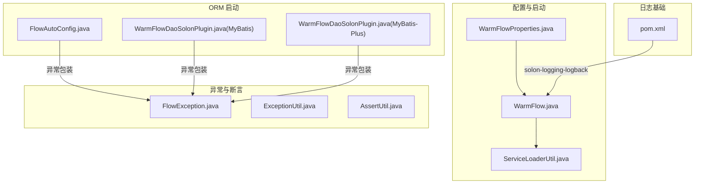
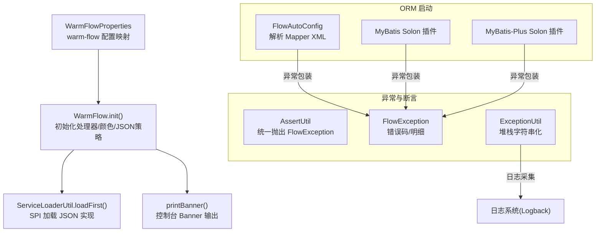
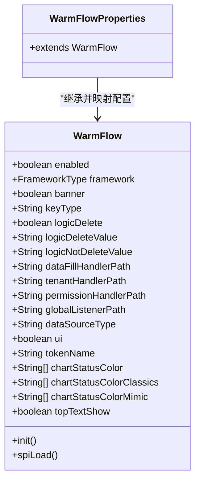
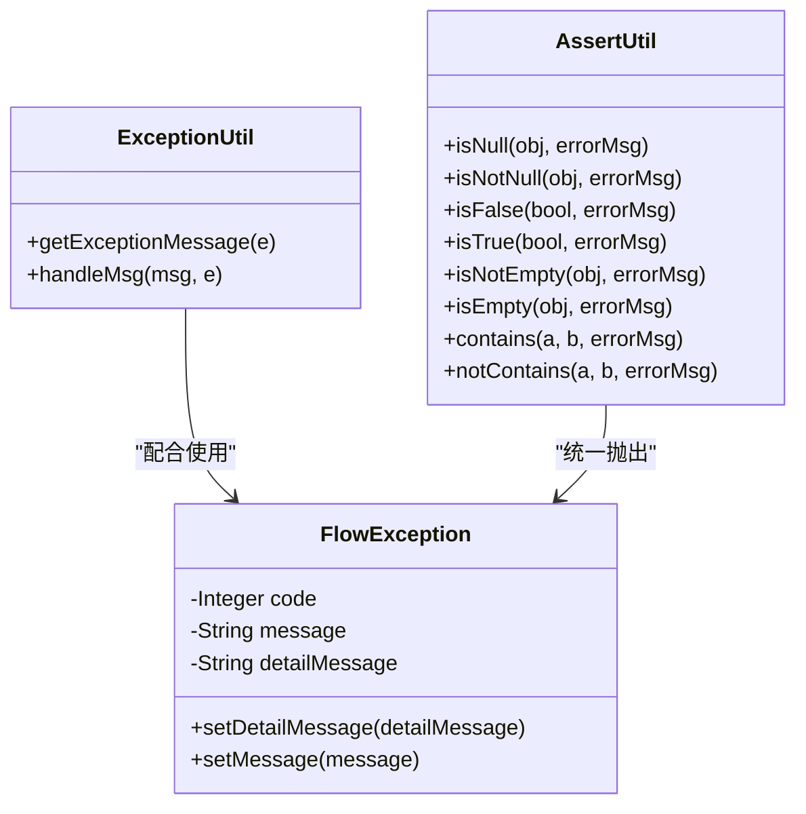
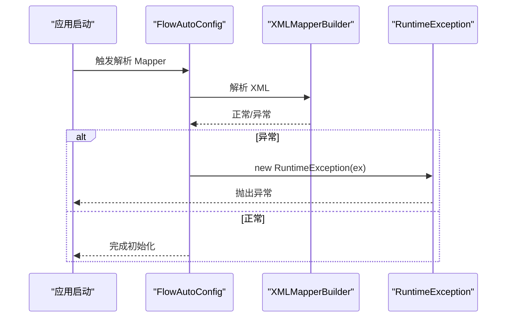
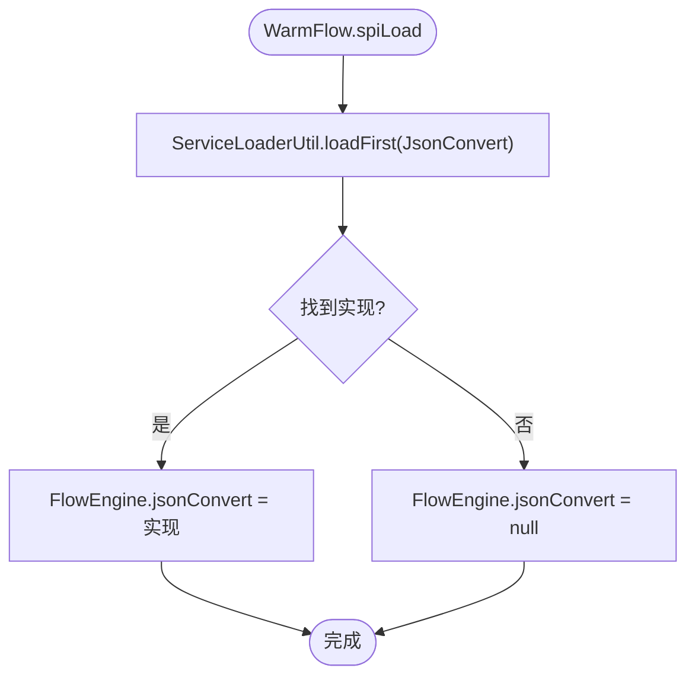
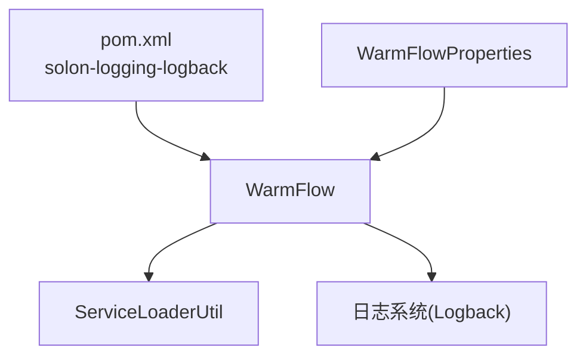

# 日志分析

<cite>
**本文引用的文件**   
- [pom.xml](file://pom.xml)
- [WarmFlow.java](file://warm-flow-core/src/main/java/org/dromara/warm/flow/core/config/WarmFlow.java)
- [WarmFlowProperties.java](file://warm-flow-plugin/warm-flow-plugin-modes/warm-flow-plugin-modes-sb/src/main/java/org/dromara/warm/plugin/modes/sb/config/WarmFlowProperties.java)
- [FlowException.java](file://warm-flow-core/src/main/java/org/dromara/warm/flow/core/exception/FlowException.java)
- [ExceptionUtil.java](file://warm-flow-core/src/main/java/org/dromara/warm/flow/core/utils/ExceptionUtil.java)
- [AssertUtil.java](file://warm-flow-core/src/main/java/org/dromara/warm/flow/core/utils/AssertUtil.java)
- [ServiceLoaderUtil.java](file://warm-flow-core/src/main/java/org/dromara/warm/flow/core/utils/ServiceLoaderUtil.java)
- [FlowAutoConfig.java](file://warm-flow-orm/warm-flow-mybatis/warm-flow-mybatis-sb-starter/src/main/java/org/dromara/warm/flow/spring/boot/config/FlowAutoConfig.java)
- [WarmFlowDaoSolonPlugin.java](file://warm-flow-orm/warm-flow-mybatis-plus/warm-flow-mybatis-plus-solon-plugin/src/main/java/org/dromara/warm/flow/solon/WarmFlowDaoSolonPlugin.java)
- [WarmFlowDaoSolonPlugin.java](file://warm-flow-orm/warm-flow-mybatis/warm-flow-mybatis-solon-plugin/src/main/java/org/dromara/warm/flow/solon/WarmFlowDaoSolonPlugin.java)
</cite>

## 目录
1. [简介](#简介)
2. [项目结构](#项目结构)
3. [核心组件](#核心组件)
4. [架构总览](#架构总览)
5. [详细组件分析](#详细组件分析)
6. [依赖分析](#依赖分析)
7. [性能考虑](#性能考虑)
8. [故障排查指南](#故障排查指南)
9. [结论](#结论)
10. [附录](#附录)

## 简介
本文件面向 Warm-Flow 的日志分析与运维实践，聚焦以下目标：
- 解释日志系统的配置与使用方式，覆盖不同日志级别与关键业务流程的记录点
- 提供日志格式规范与日志级别选择指南，帮助快速定位问题
- 说明异常堆栈信息的采集与分析要点
- 给出与 ELK Stack、Splunk 等工具的集成思路与配置建议
- 总结常见问题的日志特征与快速定位技巧

Warm-Flow 在 Spring Boot/Solon 生态下运行，日志能力由框架默认提供；同时通过配置类与异常工具类支撑统一的日志输出与异常处理。

## 项目结构
围绕日志分析的关键模块与文件如下：
- 配置层：WarmFlow 属性配置类及其 Spring Boot 扩展 WarmFlowProperties
- 异常与断言：FlowException、ExceptionUtil、AssertUtil
- SPI 与启动：ServiceLoaderUtil、WarmFlow.init() 中的 SPI 装载
- ORM 启动：FlowAutoConfig、MyBatis/MyBatis-Plus Solon 插件在解析 Mapper 时的异常处理
- 顶层依赖：根 pom.xml 中对 solon-logging-logback 的引入

**图表来源**
- [WarmFlow.java:130-157](file://warm-flow-core/src/main/java/org/dromara/warm/flow/core/config/WarmFlow.java#L130-L157)
- [WarmFlowProperties.java:24-26](file://warm-flow-plugin/warm-flow-plugin-modes/warm-flow-plugin-modes-sb/src/main/java/org/dromara/warm/plugin/modes/sb/config/WarmFlowProperties.java#L24-L26)
- [ServiceLoaderUtil.java:36-46](file://warm-flow-core/src/main/java/org/dromara/warm/flow/core/utils/ServiceLoaderUtil.java#L36-L46)
- [FlowAutoConfig.java:67-69](file://warm-flow-orm/warm-flow-mybatis/warm-flow-mybatis-sb-starter/src/main/java/org/dromara/warm/flow/spring/boot/config/FlowAutoConfig.java#L67-L69)
- [WarmFlowDaoSolonPlugin.java:50-58](file://warm-flow-orm/warm-flow-mybatis-plus/warm-flow-mybatis-plus-solon-plugin/src/main/java/org/dromara/warm/flow/solon/WarmFlowDaoSolonPlugin.java#L50-L58)
- [WarmFlowDaoSolonPlugin.java:50-58](file://warm-flow-orm/warm-flow-mybatis/warm-flow-mybatis-solon-plugin/src/main/java/org/dromara/warm/flow/solon/WarmFlowDaoSolonPlugin.java#L50-L58)
- [pom.xml:140-144](file://pom.xml#L140-L144)

**章节来源**
- [pom.xml:108-146](file://pom.xml#L108-L146)
- [WarmFlow.java:130-173](file://warm-flow-core/src/main/java/org/dromara/warm/flow/core/config/WarmFlow.java#L130-L173)
- [WarmFlowProperties.java:24-26](file://warm-flow-plugin/warm-flow-plugin-modes/warm-flow-plugin-modes-sb/src/main/java/org/dromara/warm/plugin/modes/sb/config/WarmFlowProperties.java#L24-L26)
- [ServiceLoaderUtil.java:36-46](file://warm-flow-core/src/main/java/org/dromara/warm/flow/core/utils/ServiceLoaderUtil.java#L36-L46)
- [FlowAutoConfig.java:67-69](file://warm-flow-orm/warm-flow-mybatis/warm-flow-mybatis-sb-starter/src/main/java/org/dromara/warm/flow/spring/boot/config/FlowAutoConfig.java#L67-L69)
- [WarmFlowDaoSolonPlugin.java:50-58](file://warm-flow-orm/warm-flow-mybatis-plus/warm-flow-mybatis-plus-solon-plugin/src/main/java/org/dromara/warm/flow/solon/WarmFlowDaoSolonPlugin.java#L50-L58)
- [WarmFlowDaoSolonPlugin.java:50-58](file://warm-flow-orm/warm-flow-mybatis/warm-flow-mybatis-solon-plugin/src/main/java/org/dromara/warm/flow/solon/WarmFlowDaoSolonPlugin.java#L50-L58)

## 核心组件
- 配置与启动
  - WarmFlow：集中管理 Warm-Flow 的初始化行为，包括租户/数据填充/权限/全局监听器等处理器的注入，以及通过 SPI 加载 JSON 转换策略
  - WarmFlowProperties：将 warm-flow 命名空间的配置映射到 WarmFlow 对象，便于外部配置驱动
- 异常与断言
  - FlowException：统一的流程异常类型，支持错误码与明细信息
  - ExceptionUtil：提供异常堆栈字符串化能力，便于日志采集与检索
  - AssertUtil：断言工具，统一抛出 FlowException，保证异常风格一致
- SPI 与启动
  - ServiceLoaderUtil：基于 SPI 机制加载服务实现，容错首个可用实现
- ORM 启动
  - FlowAutoConfig、MyBatis/MyBatis-Plus Solon 插件：在解析 Mapper XML 时若发生异常，会以 RuntimeException 包装并传播，便于日志捕获

**章节来源**
- [WarmFlow.java:130-157](file://warm-flow-core/src/main/java/org/dromara/warm/flow/core/config/WarmFlow.java#L130-L157)
- [WarmFlowProperties.java:24-26](file://warm-flow-plugin/warm-flow-plugin-modes/warm-flow-plugin-modes-sb/src/main/java/org/dromara/warm/plugin/modes/sb/config/WarmFlowProperties.java#L24-L26)
- [FlowException.java:25-80](file://warm-flow-core/src/main/java/org/dromara/warm/flow/core/exception/FlowException.java#L25-L80)
- [ExceptionUtil.java:31-35](file://warm-flow-core/src/main/java/org/dromara/warm/flow/core/utils/ExceptionUtil.java#L31-L35)
- [AssertUtil.java:34-111](file://warm-flow-core/src/main/java/org/dromara/warm/flow/core/utils/AssertUtil.java#L34-L111)
- [ServiceLoaderUtil.java:36-46](file://warm-flow-core/src/main/java/org/dromara/warm/flow/core/utils/ServiceLoaderUtil.java#L36-L46)
- [FlowAutoConfig.java:67-69](file://warm-flow-orm/warm-flow-mybatis/warm-flow-mybatis-sb-starter/src/main/java/org/dromara/warm/flow/spring/boot/config/FlowAutoConfig.java#L67-L69)
- [WarmFlowDaoSolonPlugin.java:50-58](file://warm-flow-orm/warm-flow-mybatis-plus/warm-flow-mybatis-plus-solon-plugin/src/main/java/org/dromara/warm/flow/solon/WarmFlowDaoSolonPlugin.java#L50-L58)
- [WarmFlowDaoSolonPlugin.java:50-58](file://warm-flow-orm/warm-flow-mybatis/warm-flow-mybatis-solon-plugin/src/main/java/org/dromara/warm/flow/solon/WarmFlowDaoSolonPlugin.java#L50-L58)

## 架构总览
Warm-Flow 的日志体系依托框架默认日志实现（Solon Logback），通过配置类与异常工具类形成统一的异常与断言输出，ORM 启动阶段的异常将以受控方式传播，便于集中采集与分析。

**图表来源**
- [WarmFlowProperties.java:24-26](file://warm-flow-plugin/warm-flow-plugin-modes/warm-flow-plugin-modes-sb/src/main/java/org/dromara/warm/plugin/modes/sb/config/WarmFlowProperties.java#L24-L26)
- [WarmFlow.java:130-173](file://warm-flow-core/src/main/java/org/dromara/warm/flow/core/config/WarmFlow.java#L130-L173)
- [ServiceLoaderUtil.java:36-46](file://warm-flow-core/src/main/java/org/dromara/warm/flow/core/utils/ServiceLoaderUtil.java#L36-L46)
- [AssertUtil.java:34-111](file://warm-flow-core/src/main/java/org/dromara/warm/flow/core/utils/AssertUtil.java#L34-L111)
- [FlowAutoConfig.java:67-69](file://warm-flow-orm/warm-flow-mybatis/warm-flow-mybatis-sb-starter/src/main/java/org/dromara/warm/flow/spring/boot/config/FlowAutoConfig.java#L67-L69)
- [WarmFlowDaoSolonPlugin.java:50-58](file://warm-flow-orm/warm-flow-mybatis-plus/warm-flow-mybatis-plus-solon-plugin/src/main/java/org/dromara/warm/flow/solon/WarmFlowDaoSolonPlugin.java#L50-L58)
- [WarmFlowDaoSolonPlugin.java:50-58](file://warm-flow-orm/warm-flow-mybatis/warm-flow-mybatis-solon-plugin/src/main/java/org/dromara/warm/flow/solon/WarmFlowDaoSolonPlugin.java#L50-L58)

## 详细组件分析

### 配置与启动组件
- WarmFlow：负责初始化各类处理器、打印 Banner、设置流程状态颜色、通过 SPI 加载 JSON 转换策略
- WarmFlowProperties：将外部配置映射到 WarmFlow，便于在不同运行环境（Spring Boot / Solon）下生效

**图表来源**
- [WarmFlow.java:34-173](file://warm-flow-core/src/main/java/org/dromara/warm/flow/core/config/WarmFlow.java#L34-L173)
- [WarmFlowProperties.java:24-26](file://warm-flow-plugin/warm-flow-plugin-modes/warm-flow-plugin-modes-sb/src/main/java/org/dromara/warm/plugin/modes/sb/config/WarmFlowProperties.java#L24-L26)

**章节来源**
- [WarmFlow.java:130-173](file://warm-flow-core/src/main/java/org/dromara/warm/flow/core/config/WarmFlow.java#L130-L173)
- [WarmFlowProperties.java:24-26](file://warm-flow-plugin/warm-flow-plugin-modes/warm-flow-plugin-modes-sb/src/main/java/org/dromara/warm/plugin/modes/sb/config/WarmFlowProperties.java#L24-L26)

### 异常与断言组件
- FlowException：统一异常类型，支持错误码与明细信息，便于日志结构化与检索
- ExceptionUtil：将异常堆栈转为字符串，便于日志采集
- AssertUtil：断言失败统一抛出 FlowException，确保异常风格一致

**图表来源**
- [FlowException.java:25-80](file://warm-flow-core/src/main/java/org/dromara/warm/flow/core/exception/FlowException.java#L25-L80)
- [ExceptionUtil.java:31-46](file://warm-flow-core/src/main/java/org/dromara/warm/flow/core/utils/ExceptionUtil.java#L31-L46)
- [AssertUtil.java:34-111](file://warm-flow-core/src/main/java/org/dromara/warm/flow/core/utils/AssertUtil.java#L34-L111)

**章节来源**
- [FlowException.java:25-80](file://warm-flow-core/src/main/java/org/dromara/warm/flow/core/exception/FlowException.java#L25-L80)
- [ExceptionUtil.java:31-46](file://warm-flow-core/src/main/java/org/dromara/warm/flow/core/utils/ExceptionUtil.java#L31-L46)
- [AssertUtil.java:34-111](file://warm-flow-core/src/main/java/org/dromara/warm/flow/core/utils/AssertUtil.java#L34-L111)

### ORM 启动与异常传播
- FlowAutoConfig：解析 Mapper XML 时若异常，以 RuntimeException 包装并抛出
- MyBatis/MyBatis-Plus Solon 插件：同理在解析 XML 时捕获异常并以 RuntimeException 包装

**图表来源**
- [FlowAutoConfig.java:63-69](file://warm-flow-orm/warm-flow-mybatis/warm-flow-mybatis-sb-starter/src/main/java/org/dromara/warm/flow/spring/boot/config/FlowAutoConfig.java#L63-L69)

**章节来源**
- [FlowAutoConfig.java:63-69](file://warm-flow-orm/warm-flow-mybatis/warm-flow-mybatis-sb-starter/src/main/java/org/dromara/warm/flow/spring/boot/config/FlowAutoConfig.java#L63-L69)
- [WarmFlowDaoSolonPlugin.java:50-58](file://warm-flow-orm/warm-flow-mybatis-plus/warm-flow-mybatis-plus-solon-plugin/src/main/java/org/dromara/warm/flow/solon/WarmFlowDaoSolonPlugin.java#L50-L58)
- [WarmFlowDaoSolonPlugin.java:50-58](file://warm-flow-orm/warm-flow-mybatis/warm-flow-mybatis-solon-plugin/src/main/java/org/dromara/warm/flow/solon/WarmFlowDaoSolonPlugin.java#L50-L58)

### SPI 与 JSON 转换策略
WarmFlow 通过 SPI 机制加载 JSON 转换策略实现，若存在多个实现，仅取首个可用实现，保证启动稳定性。

**图表来源**
- [WarmFlow.java:154-157](file://warm-flow-core/src/main/java/org/dromara/warm/flow/core/config/WarmFlow.java#L154-L157)
- [ServiceLoaderUtil.java:36-46](file://warm-flow-core/src/main/java/org/dromara/warm/flow/core/utils/ServiceLoaderUtil.java#L36-L46)

**章节来源**
- [WarmFlow.java:154-157](file://warm-flow-core/src/main/java/org/dromara/warm/flow/core/config/WarmFlow.java#L154-L157)
- [ServiceLoaderUtil.java:36-46](file://warm-flow-core/src/main/java/org/dromara/warm/flow/core/utils/ServiceLoaderUtil.java#L36-L46)

## 依赖分析
- 根 pom.xml 引入 solon-logging-logback，为 Warm-Flow 提供默认日志实现
- WarmFlowProperties 将外部配置映射到 WarmFlow，WarmFlow.init() 中调用 SPI 加载 JSON 转换策略
- ORM 启动阶段的异常均以 RuntimeException 包装，便于日志系统统一采集

**图表来源**
- [pom.xml:140-144](file://pom.xml#L140-L144)
- [WarmFlowProperties.java:24-26](file://warm-flow-plugin/warm-flow-plugin-modes/warm-flow-plugin-modes-sb/src/main/java/org/dromara/warm/plugin/modes/sb/config/WarmFlowProperties.java#L24-L26)
- [WarmFlow.java:130-157](file://warm-flow-core/src/main/java/org/dromara/warm/flow/core/config/WarmFlow.java#L130-L157)

**章节来源**
- [pom.xml:140-144](file://pom.xml#L140-L144)
- [WarmFlowProperties.java:24-26](file://warm-flow-plugin/warm-flow-plugin-modes/warm-flow-plugin-modes-sb/src/main/java/org/dromara/warm/plugin/modes/sb/config/WarmFlowProperties.java#L24-L26)
- [WarmFlow.java:130-157](file://warm-flow-core/src/main/java/org/dromara/warm/flow/core/config/WarmFlow.java#L130-L157)

## 性能考虑
- 异常堆栈字符串化成本较高，建议仅在 ERROR 级别或必要时启用，避免高频日志产生大量堆栈文本
- 断言与空值检查应尽量在边界处进行，减少运行期异常抛出频率
- ORM 启动阶段的 XML 解析异常应尽早暴露，避免运行期因 SQL 映射缺失导致的隐性失败

## 故障排查指南
- 启动期异常
  - 现象：应用启动失败，日志出现 RuntimeException 或 XML 解析异常
  - 排查：检查 Mapper XML 文件是否存在、路径是否正确、命名空间与 ID 是否冲突
  - 关联文件：[FlowAutoConfig.java:63-69](file://warm-flow-orm/warm-flow-mybatis/warm-flow-mybatis-sb-starter/src/main/java/org/dromara/warm/flow/spring/boot/config/FlowAutoConfig.java#L63-L69)、[WarmFlowDaoSolonPlugin.java:50-58](file://warm-flow-orm/warm-flow-mybatis-plus/warm-flow-mybatis-plus-solon-plugin/src/main/java/org/dromara/warm/flow/solon/WarmFlowDaoSolonPlugin.java#L50-L58)
- 运行期异常
  - 现象：业务流程中抛出 FlowException，携带错误码与明细信息
  - 排查：结合 FlowException 的错误码与 detailMessage 字段，定位具体处理器或监听器
  - 关联文件：[FlowException.java:25-80](file://warm-flow-core/src/main/java/org/dromara/warm/flow/core/exception/FlowException.java#L25-L80)
- 断言失败
  - 现象：断言失败抛出 FlowException，提示输入为空/非空/包含关系等
  - 排查：确认请求参数、集合与映射的合法性，修正断言条件
  - 关联文件：[AssertUtil.java:34-111](file://warm-flow-core/src/main/java/org/dromara/warm/flow/core/utils/AssertUtil.java#L34-L111)
- 异常堆栈采集
  - 现象：ERROR 级别日志包含完整堆栈
  - 排查：使用 ExceptionUtil.getExceptionMessage 获取堆栈字符串，便于日志平台检索
  - 关联文件：[ExceptionUtil.java:31-35](file://warm-flow-core/src/main/java/org/dromara/warm/flow/core/utils/ExceptionUtil.java#L31-L35)

**章节来源**
- [FlowAutoConfig.java:63-69](file://warm-flow-orm/warm-flow-mybatis/warm-flow-mybatis-sb-starter/src/main/java/org/dromara/warm/flow/spring/boot/config/FlowAutoConfig.java#L63-L69)
- [WarmFlowDaoSolonPlugin.java:50-58](file://warm-flow-orm/warm-flow-mybatis-plus/warm-flow-mybatis-plus-solon-plugin/src/main/java/org/dromara/warm/flow/solon/WarmFlowDaoSolonPlugin.java#L50-L58)
- [FlowException.java:25-80](file://warm-flow-core/src/main/java/org/dromara/warm/flow/core/exception/FlowException.java#L25-L80)
- [AssertUtil.java:34-111](file://warm-flow-core/src/main/java/org/dromara/warm/flow/core/utils/AssertUtil.java#L34-L111)
- [ExceptionUtil.java:31-35](file://warm-flow-core/src/main/java/org/dromara/warm/flow/core/utils/ExceptionUtil.java#L31-L35)

## 结论
Warm-Flow 的日志体系以框架默认日志实现为基础，通过配置类与异常工具类形成统一的异常与断言输出，ORM 启动阶段的异常以受控方式传播，便于集中采集与分析。建议在生产环境中：
- 使用 ERROR 级别记录异常堆栈，避免频繁字符串化堆栈
- 利用 FlowException 的错误码与明细信息提升日志可读性
- 在日志平台中建立基于错误码与堆栈关键字的告警规则

## 附录

### 日志级别与使用建议
- TRACE：开发调试，记录极细粒度流程
- DEBUG：开发调试，记录关键变量与分支
- INFO：常规业务流程记录，如启动完成、流程状态变更
- WARN：潜在问题但不影响功能，如配置项缺失或降级处理
- ERROR：异常与错误，必须包含异常堆栈字符串化后的文本

### 日志格式规范（建议）
- 时间戳：ISO 8601 标准时间
- 应用名：warm-flow
- 实例标识：容器/进程 ID
- 线程名：线程序列
- 日志级别：TRACE/DEBUG/INFO/WARN/ERROR
- 模块/类名：包名.类名
- 关键字：如流程实例 ID、节点 ID、操作人
- 消息体：简明描述 + 结构化字段（错误码、明细）
- 堆栈：ERROR 级别包含完整堆栈字符串

### 异常堆栈采集与分析
- 使用 ExceptionUtil.getExceptionMessage 获取堆栈字符串
- 在日志平台按关键字检索：FlowException、RuntimeException、Mapper 解析异常
- 建立告警规则：ERROR 级别日志数量阈值、特定异常类型占比

### 与 ELK Stack、Splunk 的集成建议
- ELK：将日志输出到 stdout/stderr，由 Logstash/Filebeat 收集，按日志格式解析字段，建立 Kibana 查询面板
- Splunk：配置 splunkd 输入监听 stdout，使用 props.conf 与 transforms.conf 解析字段，建立仪表盘与告警
- 关键字段映射：应用名、实例标识、线程名、日志级别、模块/类名、关键字、消息体、堆栈