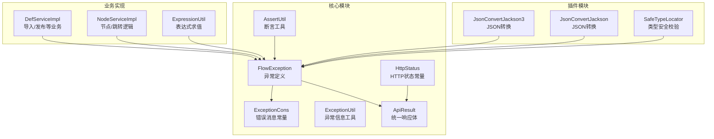
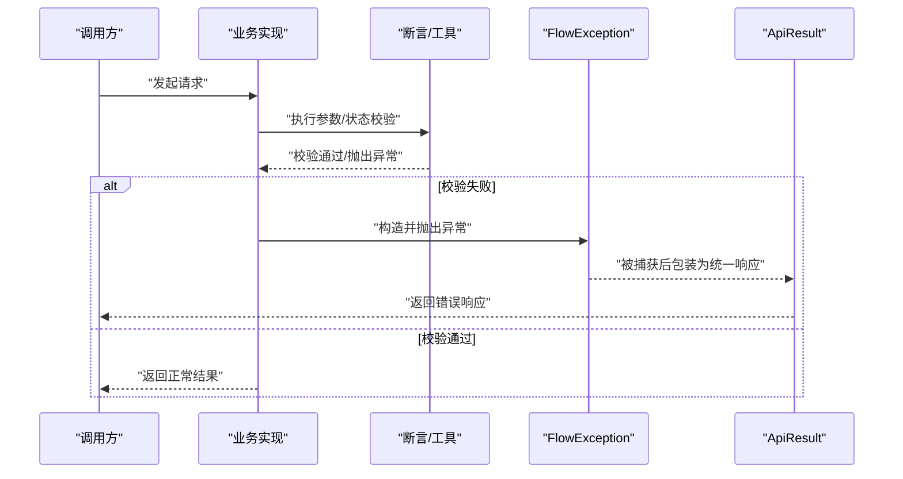
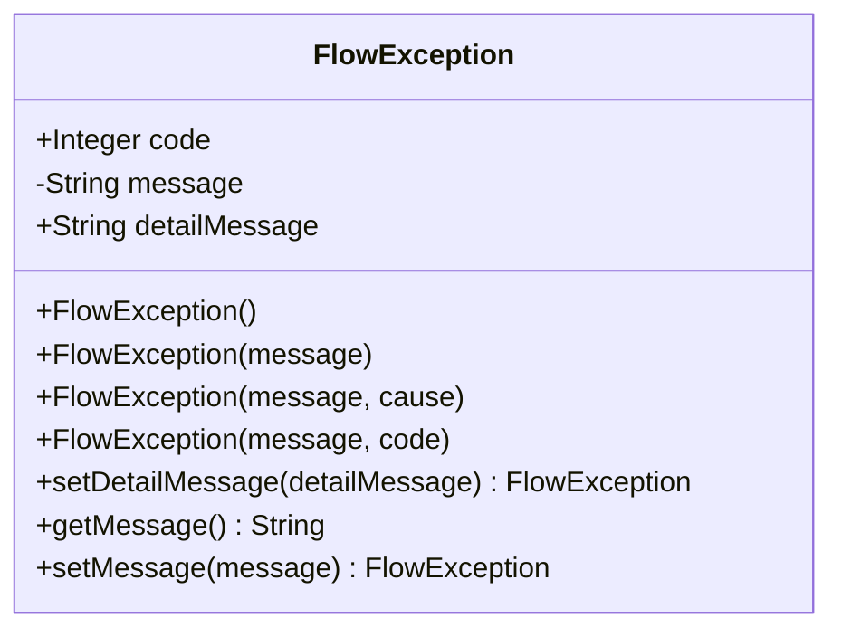
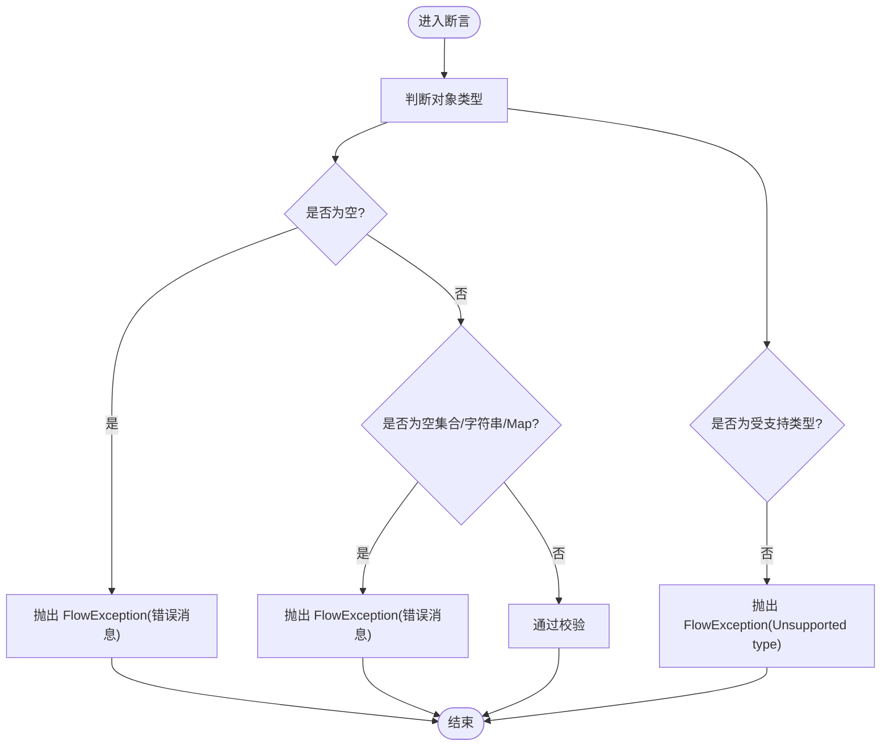
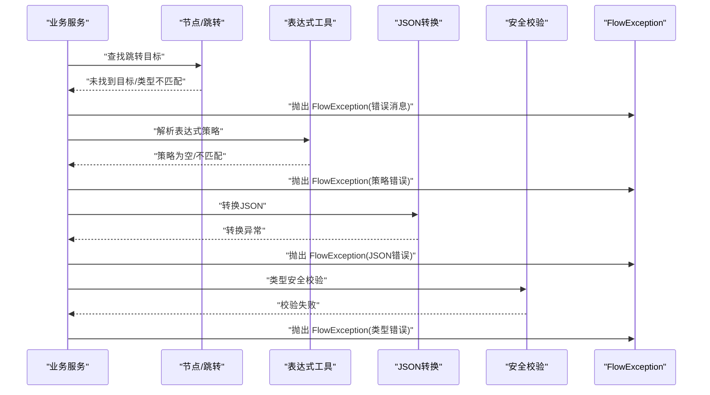
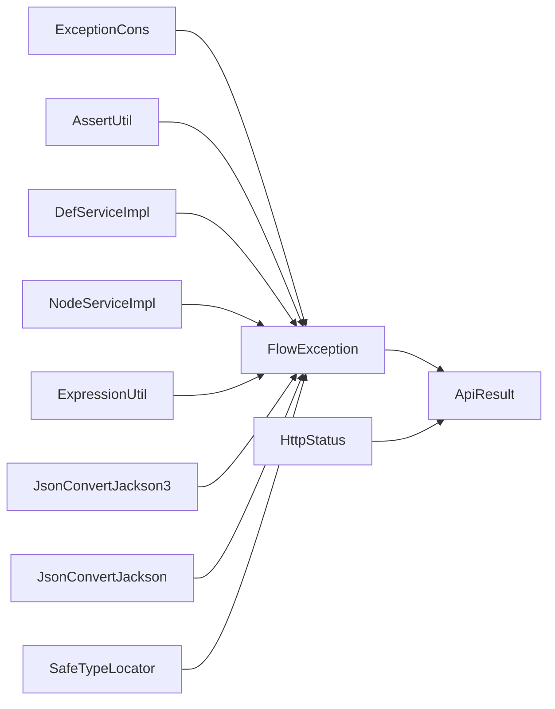

# 错误处理

<cite>
**本文引用的文件**
- [FlowException.java](file://warm-flow-core/src/main/java/org/dromara/warm/flow/core/exception/FlowException.java)
- [ExceptionCons.java](file://warm-flow-core/src/main/java/org/dromara/warm/flow/core/constant/ExceptionCons.java)
- [ExceptionUtil.java](file://warm-flow-core/src/main/java/org/dromara/warm/flow/core/utils/ExceptionUtil.java)
- [AssertUtil.java](file://warm-flow-core/src/main/java/org/dromara/warm/flow/core/utils/AssertUtil.java)
- [ApiResult.java](file://warm-flow-core/src/main/java/org/dromara/warm/flow/core/dto/ApiResult.java)
- [HttpStatus.java](file://warm-flow-core/src/main/java/org/dromara/warm/flow/core/utils/HttpStatus.java)
- [DefServiceImpl.java](file://warm-flow-core/src/main/java/org/dromara/warm/flow/core/service/impl/DefServiceImpl.java)
- [NodeServiceImpl.java](file://warm-flow-core/src/main/java/org/dromara/warm/flow/core/service/impl/NodeServiceImpl.java)
- [ExpressionUtil.java](file://warm-flow-core/src/main/java/org/dromara/warm/flow/core/utils/ExpressionUtil.java)
- [JsonConvertJackson3.java](file://warm-flow-plugin/warm-flow-plugin-json/warm-flow-plugin-json-jackson3/src/main/java/org/dromara/warm/plugin/json/JsonConvertJackson3.java)
- [JsonConvertJackson.java](file://warm-flow-plugin/warm-flow-plugin-json/warm-flow-plugin-json-v1/src/main/java/org/dromara/warm/plugin/json/JsonConvertJackson.java)
- [SafeTypeLocator.java](file://warm-flow-plugin/warm-flow-plugin-modes/warm-flow-plugin-modes-sb/src/main/java/org/dromara/warm/plugin/modes/sb/helper/SafeTypeLocator.java)
</cite>

## 目录
1. [简介](#简介)
2. [项目结构](#项目结构)
3. [核心组件](#核心组件)
4. [架构总览](#架构总览)
5. [详细组件分析](#详细组件分析)
6. [依赖分析](#依赖分析)
7. [性能考虑](#性能考虑)
8. [故障排查指南](#故障排查指南)
9. [结论](#结论)
10. [附录](#附录)

## 简介
本文件聚焦于 Warm-Flow 的错误处理机制，系统性解析 FlowException 异常类的设计与使用，涵盖错误码分类体系、异常消息的国际化现状与建议、详细错误信息的记录机制，并对业务异常、系统异常、参数异常等进行区分与处理策略说明。同时提供异常拦截与统一处理的最佳实践，包括全局异常处理器的配置思路与自定义异常的扩展方法。

## 项目结构
围绕错误处理的相关模块主要分布在以下位置：
- 异常定义与常量：exception、constant
- 断言与工具：utils（AssertUtil、ExceptionUtil、HttpStatus）
- 业务服务层：service.impl（在具体业务场景中抛出 FlowException）
- 插件层：json、modes 等插件在转换或安全校验时抛出 FlowException
- 统一响应体：dto.ApiResult（用于对外返回统一结构）

图表来源
- [FlowException.java:25-80](file://warm-flow-core/src/main/java/org/dromara/warm/flow/core/exception/FlowException.java#L25-L80)
- [ExceptionCons.java:24-158](file://warm-flow-core/src/main/java/org/dromara/warm/flow/core/constant/ExceptionCons.java#L24-L158)
- [AssertUtil.java:29-111](file://warm-flow-core/src/main/java/org/dromara/warm/flow/core/utils/AssertUtil.java#L29-L111)
- [ExceptionUtil.java:27-47](file://warm-flow-core/src/main/java/org/dromara/warm/flow/core/utils/ExceptionUtil.java#L27-L47)
- [ApiResult.java:30-96](file://warm-flow-core/src/main/java/org/dromara/warm/flow/core/dto/ApiResult.java#L30-L96)
- [HttpStatus.java:47-108](file://warm-flow-core/src/main/java/org/dromara/warm/flow/core/utils/HttpStatus.java#L47-L108)
- [DefServiceImpl.java:70-76](file://warm-flow-core/src/main/java/org/dromara/warm/flow/core/service/impl/DefServiceImpl.java#L70-L76)
- [NodeServiceImpl.java:360-368](file://warm-flow-core/src/main/java/org/dromara/warm/flow/core/service/impl/NodeServiceImpl.java#L360-L368)
- [ExpressionUtil.java:155-173](file://warm-flow-core/src/main/java/org/dromara/warm/flow/core/utils/ExpressionUtil.java#L155-L173)
- [JsonConvertJackson3.java:58-117](file://warm-flow-plugin/warm-flow-plugin-json/warm-flow-plugin-json-jackson3/src/main/java/org/dromara/warm/plugin/json/JsonConvertJackson3.java#L58-L117)
- [JsonConvertJackson.java:61-120](file://warm-flow-plugin/warm-flow-plugin-json/warm-flow-plugin-json-v1/src/main/java/org/dromara/warm/plugin/json/JsonConvertJackson.java#L61-L120)
- [SafeTypeLocator.java](file://warm-flow-plugin/warm-flow-plugin-modes/warm-flow-plugin-modes-sb/src/main/java/org/dromara/warm/plugin/modes/sb/helper/SafeTypeLocator.java#L85)

章节来源
- [FlowException.java:25-80](file://warm-flow-core/src/main/java/org/dromara/warm/flow/core/exception/FlowException.java#L25-L80)
- [ExceptionCons.java:24-158](file://warm-flow-core/src/main/java/org/dromara/warm/flow/core/constant/ExceptionCons.java#L24-L158)

## 核心组件
- FlowException：流程框架的统一运行时异常，具备错误码、消息与内部调试明细字段，支持多种构造方式与链路传递。
- ExceptionCons：集中存放流程相关错误消息常量，便于统一管理与复用。
- AssertUtil：断言工具，封装常用判空、判真/假、集合非空等校验，不符合条件时抛出 FlowException。
- ExceptionUtil：异常信息提取与消息拼接工具，提供堆栈详情与消息格式化能力。
- ApiResult：统一响应体，约定 code/msg/data 结构，配合 FlowException 可输出一致的错误响应。
- HttpStatus：HTTP 状态常量，便于在 Web 层映射标准状态码。

章节来源
- [FlowException.java:25-80](file://warm-flow-core/src/main/java/org/dromara/warm/flow/core/exception/FlowException.java#L25-L80)
- [ExceptionCons.java:24-158](file://warm-flow-core/src/main/java/org/dromara/warm/flow/core/constant/ExceptionCons.java#L24-L158)
- [AssertUtil.java:29-111](file://warm-flow-core/src/main/java/org/dromara/warm/flow/core/utils/AssertUtil.java#L29-L111)
- [ExceptionUtil.java:27-47](file://warm-flow-core/src/main/java/org/dromara/warm/flow/core/utils/ExceptionUtil.java#L27-L47)
- [ApiResult.java:30-96](file://warm-flow-core/src/main/java/org/dromara/warm/flow/core/dto/ApiResult.java#L30-L96)
- [HttpStatus.java:47-108](file://warm-flow-core/src/main/java/org/dromara/warm/flow/core/utils/HttpStatus.java#L47-L108)

## 架构总览
Warm-Flow 的错误处理采用“异常定义 + 常量 + 工具 + 业务实现”的分层设计：
- 异常定义层：FlowException 提供统一异常载体，支持错误码与消息分离。
- 常量层：ExceptionCons 集中管理错误消息，便于维护与扩展。
- 工具层：AssertUtil、ExceptionUtil 提供断言与异常信息处理能力。
- 业务层：各服务实现根据业务规则抛出 FlowException，保持语义清晰。
- 表达层：ApiResult 统一输出结构，结合 HttpStatus 实现 HTTP 层映射。

图表来源
- [AssertUtil.java:29-111](file://warm-flow-core/src/main/java/org/dromara/warm/flow/core/utils/AssertUtil.java#L29-L111)
- [FlowException.java:25-80](file://warm-flow-core/src/main/java/org/dromara/warm/flow/core/exception/FlowException.java#L25-L80)
- [ApiResult.java:30-96](file://warm-flow-core/src/main/java/org/dromara/warm/flow/core/dto/ApiResult.java#L30-L96)

## 详细组件分析

### FlowException 设计与使用
- 设计要点
  - 继承 RuntimeException，作为运行时异常便于在业务流程中快速暴露问题。
  - 字段分离：code（错误码）、message（对外消息）、detailMessage（内部调试信息），便于分级展示与审计。
  - 多构造函数：支持仅消息、带原因异常、带错误码等多种场景；提供 setter 支持链式设置。
- 使用模式
  - 在业务校验失败时抛出，由上层捕获并包装为统一响应。
  - 在 JSON 转换、表达式求值、反射扫描等环节抛出，确保异常语义明确。

图表来源
- [FlowException.java:25-80](file://warm-flow-core/src/main/java/org/dromara/warm/flow/core/exception/FlowException.java#L25-L80)

章节来源
- [FlowException.java:25-80](file://warm-flow-core/src/main/java/org/dromara/warm/flow/core/exception/FlowException.java#L25-L80)

### 错误码与消息分类体系
- 分类维度
  - 流程定义类：如开始节点、节点编码、流程发布状态等。
  - 流程实例与任务类：如实例状态、任务查询、权限校验等。
  - 表单与节点属性类：如表单状态、节点比例、监听器/表达式策略等。
  - 操作控制类：如加签/减签/转办/委托、撤销、挂起/激活等。
- 建议
  - 将错误码与消息解耦，错误码用于前端识别与路由，消息用于用户提示。
  - 对于需要国际化的场景，建议在上层统一做消息映射，而非在异常类内硬编码多语言。

章节来源
- [ExceptionCons.java:24-158](file://warm-flow-core/src/main/java/org/dromara/warm/flow/core/constant/ExceptionCons.java#L24-L158)

### 断言与参数校验（AssertUtil）
- 功能
  - 提供 isNull/isNotNull、isTrue/isFalse、isEmpty/isNotEmpty、contains/notContains 等常用断言。
  - 不满足条件时抛出 FlowException，保证参数与前置条件的强约束。
- 注意事项
  - 对于不支持的类型会抛出包含类名的异常，需在调用侧避免传入未知类型。

图表来源
- [AssertUtil.java:70-97](file://warm-flow-core/src/main/java/org/dromara/warm/flow/core/utils/AssertUtil.java#L70-L97)

章节来源
- [AssertUtil.java:29-111](file://warm-flow-core/src/main/java/org/dromara/warm/flow/core/utils/AssertUtil.java#L29-L111)

### 异常信息提取与消息拼接（ExceptionUtil）
- 功能
  - 提供 getExceptionMessage 获取完整堆栈信息，便于日志与审计。
  - 提供 handleMsg 将业务消息与异常消息拼接，增强可读性。
- 应用场景
  - 在全局异常处理器中记录 detailMessage，向用户返回友好消息。

章节来源
- [ExceptionUtil.java:27-47](file://warm-flow-core/src/main/java/org/dromara/warm/flow/core/utils/ExceptionUtil.java#L27-L47)

### 业务异常触发点与处理策略
- 导入/导出与发布
  - 导入读取失败：抛出 FlowException 并携带对应错误消息常量。
  - 发布前校验：若未绘制流程图则拒绝发布。
- 节点与跳转
  - 未找到跳转类型或目标节点：抛出 FlowException，阻止非法流转。
- 表达式与策略
  - 表达式策略为空或不匹配：抛出 FlowException，确保流程配置正确。
- JSON 转换
  - Jackson 转换异常：抛出 FlowException，定位数据结构问题。
- 类型安全
  - 安全类型定位失败：抛出 FlowException，防止危险类型注入。

图表来源
- [DefServiceImpl.java:70-76](file://warm-flow-core/src/main/java/org/dromara/warm/flow/core/service/impl/DefServiceImpl.java#L70-L76)
- [NodeServiceImpl.java:360-368](file://warm-flow-core/src/main/java/org/dromara/warm/flow/core/service/impl/NodeServiceImpl.java#L360-L368)
- [ExpressionUtil.java:155-173](file://warm-flow-core/src/main/java/org/dromara/warm/flow/core/utils/ExpressionUtil.java#L155-L173)
- [JsonConvertJackson3.java:58-117](file://warm-flow-plugin/warm-flow-plugin-json/warm-flow-plugin-json-jackson3/src/main/java/org/dromara/warm/plugin/json/JsonConvertJackson3.java#L58-L117)
- [JsonConvertJackson.java:61-120](file://warm-flow-plugin/warm-flow-plugin-json/warm-flow-plugin-json-v1/src/main/java/org/dromara/warm/plugin/json/JsonConvertJackson.java#L61-L120)
- [SafeTypeLocator.java](file://warm-flow-plugin/warm-flow-plugin-modes/warm-flow-plugin-modes-sb/src/main/java/org/dromara/warm/plugin/modes/sb/helper/SafeTypeLocator.java#L85)

章节来源
- [DefServiceImpl.java:70-76](file://warm-flow-core/src/main/java/org/dromara/warm/flow/core/service/impl/DefServiceImpl.java#L70-L76)
- [NodeServiceImpl.java:360-368](file://warm-flow-core/src/main/java/org/dromara/warm/flow/core/service/impl/NodeServiceImpl.java#L360-L368)
- [ExpressionUtil.java:155-173](file://warm-flow-core/src/main/java/org/dromara/warm/flow/core/utils/ExpressionUtil.java#L155-L173)
- [JsonConvertJackson3.java:58-117](file://warm-flow-plugin/warm-flow-plugin-json/warm-flow-plugin-json-jackson3/src/main/java/org/dromara/warm/plugin/json/JsonConvertJackson3.java#L58-L117)
- [JsonConvertJackson.java:61-120](file://warm-flow-plugin/warm-flow-plugin-json/warm-flow-plugin-json-v1/src/main/java/org/dromara/warm/plugin/json/JsonConvertJackson.java#L61-L120)
- [SafeTypeLocator.java](file://warm-flow-plugin/warm-flow-plugin-modes/warm-flow-plugin-modes-sb/src/main/java/org/dromara/warm/plugin/modes/sb/helper/SafeTypeLocator.java#L85)

### 统一响应与错误码映射
- ApiResult
  - 统一返回 code/msg/data 结构，FAIL 默认为 500，可按需覆盖。
- HttpStatus
  - 提供 HTTP 状态常量，便于 Web 层映射标准状态码。
- 建议
  - 将 FlowException 的 code 映射到 ApiResult.code，message 作为用户可见提示，detailMessage 用于日志与审计。

章节来源
- [ApiResult.java:30-96](file://warm-flow-core/src/main/java/org/dromara/warm/flow/core/dto/ApiResult.java#L30-L96)
- [HttpStatus.java:47-108](file://warm-flow-core/src/main/java/org/dromara/warm/flow/core/utils/HttpStatus.java#L47-L108)

## 依赖分析
- FlowException 依赖 ExceptionCons（通过消息常量）与 ApiResult（统一响应包装）。
- AssertUtil 直接依赖 FlowException，形成断言到异常的桥接。
- 各业务实现与插件在失败路径上依赖 FlowException，构成错误传播链。
- ExceptionUtil 为异常信息采集提供支撑，不直接依赖 FlowException，但常被全局处理器使用。

图表来源
- [ExceptionCons.java:24-158](file://warm-flow-core/src/main/java/org/dromara/warm/flow/core/constant/ExceptionCons.java#L24-L158)
- [FlowException.java:25-80](file://warm-flow-core/src/main/java/org/dromara/warm/flow/core/exception/FlowException.java#L25-L80)
- [AssertUtil.java:29-111](file://warm-flow-core/src/main/java/org/dromara/warm/flow/core/utils/AssertUtil.java#L29-L111)
- [DefServiceImpl.java:70-76](file://warm-flow-core/src/main/java/org/dromara/warm/flow/core/service/impl/DefServiceImpl.java#L70-L76)
- [NodeServiceImpl.java:360-368](file://warm-flow-core/src/main/java/org/dromara/warm/flow/core/service/impl/NodeServiceImpl.java#L360-L368)
- [ExpressionUtil.java:155-173](file://warm-flow-core/src/main/java/org/dromara/warm/flow/core/utils/ExpressionUtil.java#L155-L173)
- [JsonConvertJackson3.java:58-117](file://warm-flow-plugin/warm-flow-plugin-json/warm-flow-plugin-json-jackson3/src/main/java/org/dromara/warm/plugin/json/JsonConvertJackson3.java#L58-L117)
- [JsonConvertJackson.java:61-120](file://warm-flow-plugin/warm-flow-plugin-json/warm-flow-plugin-json-v1/src/main/java/org/dromara/warm/plugin/json/JsonConvertJackson.java#L61-L120)
- [SafeTypeLocator.java](file://warm-flow-plugin/warm-flow-plugin-modes/warm-flow-plugin-modes-sb/src/main/java/org/dromara/warm/plugin/modes/sb/helper/SafeTypeLocator.java#L85)
- [ApiResult.java:30-96](file://warm-flow-core/src/main/java/org/dromara/warm/flow/core/dto/ApiResult.java#L30-L96)
- [HttpStatus.java:47-108](file://warm-flow-core/src/main/java/org/dromara/warm/flow/core/utils/HttpStatus.java#L47-L108)

章节来源
- [FlowException.java:25-80](file://warm-flow-core/src/main/java/org/dromara/warm/flow/core/exception/FlowException.java#L25-L80)
- [AssertUtil.java:29-111](file://warm-flow-core/src/main/java/org/dromara/warm/flow/core/utils/AssertUtil.java#L29-L111)
- [ApiResult.java:30-96](file://warm-flow-core/src/main/java/org/dromara/warm/flow/core/dto/ApiResult.java#L30-L96)

## 性能考虑
- 异常开销：频繁抛出异常会影响性能，应在业务入口处通过断言与预检减少异常发生概率。
- 堆栈采集：ExceptionUtil 的堆栈采集适合审计与日志，不应在高频路径中频繁调用。
- 消息拼接：handleMsg 仅做简单拼接，成本较低，但应避免在热路径中重复构造大字符串。

## 故障排查指南
- 常见症状
  - 导入流程报错：检查导入读取与 JSON 结构，关注 FlowException 的 detailMessage。
  - 发布失败：确认流程图已绘制，避免未绘制即发布。
  - 跳转异常：核对节点跳转类型与目标节点配置，确保不为空。
  - 表达式错误：检查表达式策略注册与类型匹配。
  - JSON 转换失败：核对实体字段与 JSON 结构一致性。
  - 类型安全拦截：检查类型白名单与黑名单配置。
- 排查步骤
  - 在全局异常处理器中记录 ExceptionUtil.getExceptionMessage。
  - 对外返回 ApiResult.fail(code, msg)，其中 code 来源于 FlowException.code 或默认 500。
  - 对用户显示 message，对运维显示 detailMessage 与堆栈。

章节来源
- [ExceptionUtil.java:27-47](file://warm-flow-core/src/main/java/org/dromara/warm/flow/core/utils/ExceptionUtil.java#L27-L47)
- [ApiResult.java:77-87](file://warm-flow-core/src/main/java/org/dromara/warm/flow/core/dto/ApiResult.java#L77-L87)

## 结论
Warm-Flow 的错误处理以 FlowException 为核心，结合 ExceptionCons、AssertUtil、ExceptionUtil 与 ApiResult 形成从“断言校验—异常抛出—统一响应”的闭环。通过将错误码与消息分离、在关键路径使用断言与预检、在全局处理器中统一记录与返回，可有效提升系统的可观测性与可维护性。对于国际化需求，建议在上层统一做消息映射，避免在异常类内硬编码多语言。

## 附录
- 最佳实践清单
  - 在业务入口使用 AssertUtil 进行强约束校验，避免无效分支进入深层逻辑。
  - 对外错误响应统一使用 ApiResult，错误码与消息清晰分离。
  - 在全局异常处理器中记录 detailMessage 与堆栈，便于审计与定位。
  - 自定义异常扩展：继承 FlowException 并在构造时指定合适的 code 与 message，保持与现有体系一致。
  - 国际化：在上层统一做消息映射，异常类保留统一的消息键或模板。