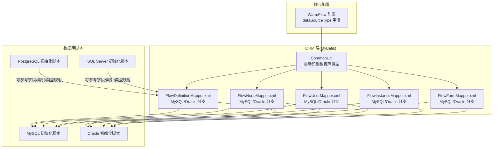
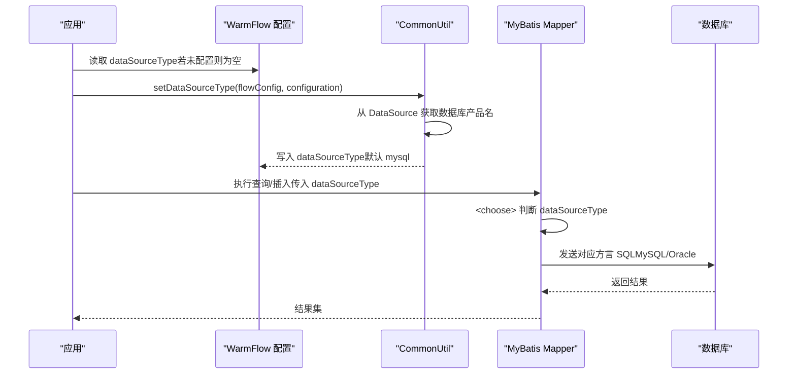
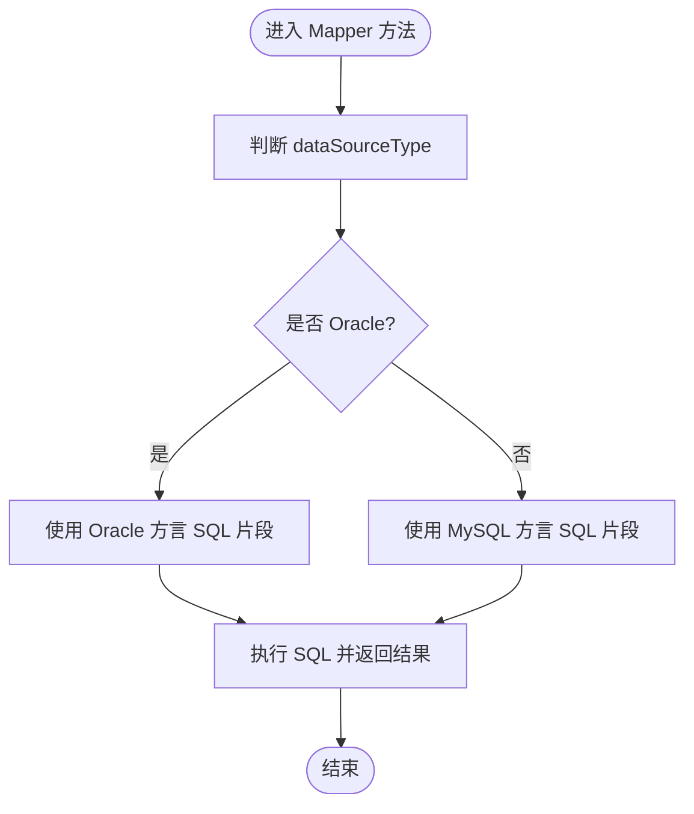
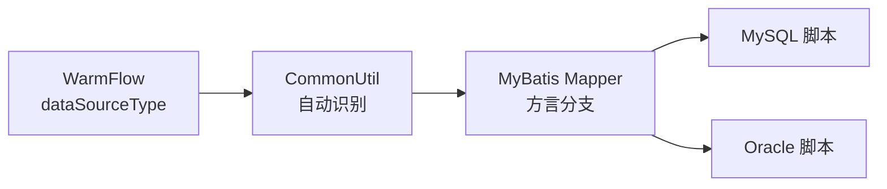

# 多数据库适配

<cite>
**本文引用的文件**
- [WarmFlow.java](file://warm-flow-core/src/main/java/org/dromara/warm/flow/core/config/WarmFlow.java)
- [CommonUtil.java](file://warm-flow-orm/warm-flow-mybatis/warm-flow-mybatis-core/src/main/java/org/dromara/warm/flow/orm/utils/CommonUtil.java)
- [SqlHelper.java](file://warm-flow-core/src/main/java/org/dromara/warm/flow/core/utils/SqlHelper.java)
- [FlowDefinitionMapper.xml](file://warm-flow-orm/warm-flow-mybatis/warm-flow-mybatis-core/src/main/resources/warm/flow/FlowDefinitionMapper.xml)
- [FlowNodeMapper.xml](file://warm-flow-orm/warm-flow-mybatis/warm-flow-mybatis-core/src/main/resources/warm/flow/FlowNodeMapper.xml)
- [FlowUserMapper.xml](file://warm-flow-orm/warm-flow-mybatis/warm-flow-mybatis-core/src/main/resources/warm/flow/FlowUserMapper.xml)
- [FlowInstanceMapper.xml](file://warm-flow-orm/warm-flow-mybatis/warm-flow-mybatis-core/src/main/resources/warm/flow/FlowInstanceMapper.xml)
- [FlowFormMapper.xml](file://warm-flow-orm/warm-flow-mybatis/warm-flow-mybatis-core/src/main/resources/warm/flow/FlowFormMapper.xml)
- [warm-flow-all.sql](file://sql/mysql/warm-flow-all.sql)
- [oracle-wram-flow-all.sql](file://sql/oracle/oracle-wram-flow-all.sql)
- [postgresql-warm-flow-all.sql](file://sql/postgresql/postgresql-warm-flow-all.sql)
- [sqlserver.sql](file://sql/sqlserver/sqlserver.sql)
- [pom.xml](file://pom.xml)
- [bug.yml](file://.gitee/ISSUE_TEMPLATE/bug.yml)
</cite>

## 目录
1. [简介](#简介)
2. [项目结构](#项目结构)
3. [核心组件](#核心组件)
4. [架构总览](#架构总览)
5. [详细组件分析](#详细组件分析)
6. [依赖关系分析](#依赖关系分析)
7. [性能考量](#性能考量)
8. [故障排除指南](#故障排除指南)
9. [结论](#结论)
10. [附录](#附录)

## 简介
本文件面向 Warm-Flow 的多数据库适配机制，系统性阐述项目对 MySQL、Oracle、PostgreSQL、SQL Server 四种主流数据库的支持策略与实现方式。重点包括：
- 语法与数据类型差异对比
- 通过统一 SQL 脚本与 MyBatis 映射实现跨数据库兼容
- 数据库方言配置与连接参数设置
- 安装部署步骤与注意事项
- 性能优化建议与最佳实践
- 常见问题排查与解决方案

## 项目结构
Warm-Flow 在 ORM 层采用 MyBatis 映射文件按数据库方言拆分 SQL，并在运行期根据数据源类型动态选择执行分支；同时提供标准 SQL 脚本以支持不同数据库的初始化与升级。

**图表来源**
- [WarmFlow.java:93-98](file://warm-flow-core/src/main/java/org/dromara/warm/flow/core/config/WarmFlow.java#L93-L98)
- [CommonUtil.java:34-60](file://warm-flow-orm/warm-flow-mybatis/warm-flow-mybatis-core/src/main/java/org/dromara/warm/flow/orm/utils/CommonUtil.java#L34-L60)
- [FlowDefinitionMapper.xml:180-197](file://warm-flow-orm/warm-flow-mybatis/warm-flow-mybatis-core/src/main/resources/warm/flow/FlowDefinitionMapper.xml#L180-L197)
- [FlowNodeMapper.xml:101-180](file://warm-flow-orm/warm-flow-mybatis/warm-flow-mybatis-core/src/main/resources/warm/flow/FlowNodeMapper.xml#L101-L180)
- [FlowUserMapper.xml:85-138](file://warm-flow-orm/warm-flow-mybatis/warm-flow-mybatis-core/src/main/resources/warm/flow/FlowUserMapper.xml#L85-L138)
- [FlowInstanceMapper.xml:113-198](file://warm-flow-orm/warm-flow-mybatis/warm-flow-mybatis-core/src/main/resources/warm/flow/FlowInstanceMapper.xml#L113-L198)
- [FlowFormMapper.xml:89-141](file://warm-flow-orm/warm-flow-mybatis/warm-flow-mybatis-core/src/main/resources/warm/flow/FlowFormMapper.xml#L89-L141)
- [warm-flow-all.sql:1-160](file://sql/mysql/warm-flow-all.sql#L1-L160)
- [oracle-wram-flow-all.sql:1-311](file://sql/oracle/oracle-wram-flow-all.sql#L1-L311)
- [postgresql-warm-flow-all.sql:1-296](file://sql/postgresql/postgresql-warm-flow-all.sql#L1-L296)
- [sqlserver.sql:1-26](file://sql/sqlserver/sqlserver.sql#L1-L26)

**章节来源**
- [WarmFlow.java:93-98](file://warm-flow-core/src/main/java/org/dromara/warm/flow/core/config/WarmFlow.java#L93-L98)
- [CommonUtil.java:34-60](file://warm-flow-orm/warm-flow-mybatis/warm-flow-mybatis-core/src/main/java/org/dromara/warm/flow/orm/utils/CommonUtil.java#L34-L60)
- [FlowDefinitionMapper.xml:180-197](file://warm-flow-orm/warm-flow-mybatis/warm-flow-mybatis-core/src/main/resources/warm/flow/FlowDefinitionMapper.xml#L180-L197)
- [FlowNodeMapper.xml:101-180](file://warm-flow-orm/warm-flow-mybatis/warm-flow-mybatis-core/src/main/resources/warm/flow/FlowNodeMapper.xml#L101-L180)
- [FlowUserMapper.xml:85-138](file://warm-flow-orm/warm-flow-mybatis/warm-flow-mybatis-core/src/main/resources/warm/flow/FlowUserMapper.xml#L85-L138)
- [FlowInstanceMapper.xml:113-198](file://warm-flow-orm/warm-flow-mybatis/warm-flow-mybatis-core/src/main/resources/warm/flow/FlowInstanceMapper.xml#L113-L198)
- [FlowFormMapper.xml:89-141](file://warm-flow-orm/warm-flow-mybatis/warm-flow-mybatis-core/src/main/resources/warm/flow/FlowFormMapper.xml#L89-L141)
- [warm-flow-all.sql:1-160](file://sql/mysql/warm-flow-all.sql#L1-L160)
- [oracle-wram-flow-all.sql:1-311](file://sql/oracle/oracle-wram-flow-all.sql#L1-L311)
- [postgresql-warm-flow-all.sql:1-296](file://sql/postgresql/postgresql-warm-flow-all.sql#L1-L296)
- [sqlserver.sql:1-26](file://sql/sqlserver/sqlserver.sql#L1-L26)

## 核心组件
- 数据库类型识别与兜底
  - WarmFlow 提供 dataSourceType 配置项，用于显式指定数据库类型。
  - 若未配置，CommonUtil 将从 DataSource 获取数据库产品名并转小写作为类型依据。
  - 若仍为空，则兜底为 mysql。
- MyBatis 映射中的方言分支
  - Mapper 中通过 <choose> 条件判断 dataSourceType，分别包含 MySQL 与 Oracle 的插入/分页等方言 SQL。
- SQL 脚本与实体字段映射
  - 提供 MySQL/Oracle/PostgreSQL/SQL Server 的初始化脚本，确保建表与索引一致。

**章节来源**
- [WarmFlow.java:93-98](file://warm-flow-core/src/main/java/org/dromara/warm/flow/core/config/WarmFlow.java#L93-L98)
- [CommonUtil.java:34-60](file://warm-flow-orm/warm-flow-mybatis/warm-flow-mybatis-core/src/main/java/org/dromara/warm/flow/orm/utils/CommonUtil.java#L34-L60)
- [FlowDefinitionMapper.xml:180-197](file://warm-flow-orm/warm-flow-mybatis/warm-flow-mybatis-core/src/main/resources/warm/flow/FlowDefinitionMapper.xml#L180-L197)

## 架构总览
下图展示运行期根据数据源类型选择 SQL 方言的整体流程：

**图表来源**
- [WarmFlow.java:93-98](file://warm-flow-core/src/main/java/org/dromara/warm/flow/core/config/WarmFlow.java#L93-L98)
- [CommonUtil.java:34-60](file://warm-flow-orm/warm-flow-mybatis/warm-flow-mybatis-core/src/main/java/org/dromara/warm/flow/orm/utils/CommonUtil.java#L34-L60)
- [FlowDefinitionMapper.xml:180-197](file://warm-flow-orm/warm-flow-mybatis/warm-flow-mybatis-core/src/main/resources/warm/flow/FlowDefinitionMapper.xml#L180-L197)

## 详细组件分析

### 数据库方言与脚本对比
- MySQL
  - 使用 InnoDB 引擎、B-tree 索引、tinyint/varchar/datetime 等类型。
  - 示例：主键、索引、注释等均采用 MySQL 语法。
- Oracle
  - 使用 NUMBER/VARCHAR2/DATE 类型，主键通过 ALTER TABLE ADD PRIMARY KEY 定义，索引通过 CREATE INDEX 定义。
  - 示例：CLOB/NCLOB 文本类型，ROWNUM 实现分页。
- PostgreSQL
  - 使用 int8/varchar/timestamp 等类型，主键通过 CONSTRAINT ... PRIMARY KEY 定义，索引使用 CREATE INDEX。
  - 示例：bpchar 默认值写法与 MySQL 不同。
- SQL Server
  - 使用 bigint/nvarchar/datetime2 等类型，主键通过 CONSTRAINT PK__... PRIMARY KEY CLUSTERED 定义，索引通过 CREATE INDEX 定义。
  - 示例：扩展属性注释通过存储过程添加。

**章节来源**
- [warm-flow-all.sql:1-160](file://sql/mysql/warm-flow-all.sql#L1-L160)
- [oracle-wram-flow-all.sql:1-311](file://sql/oracle/oracle-wram-flow-all.sql#L1-L311)
- [postgresql-warm-flow-all.sql:1-296](file://sql/postgresql/postgresql-warm-flow-all.sql#L1-L296)
- [sqlserver.sql:1-26](file://sql/sqlserver/sqlserver.sql#L1-L26)

### MyBatis 映射中的方言分支
- 插入批量（saveBatch）
  - MySQL：INSERT INTO ... VALUES (...), (...) ...
  - Oracle：INSERT INTO ... SELECT ... FROM dual UNION ALL SELECT ... FROM dual
- 分页
  - MySQL：LIMIT #{pageSize} OFFSET #{pageNum}
  - Oracle：ROWNUM 子查询包裹实现分页
- 其他映射文件（Node/User/Instance/Form）均包含相同结构的 MySQL/Oracle 方言 SQL 片段。

**图表来源**
- [FlowDefinitionMapper.xml:180-197](file://warm-flow-orm/warm-flow-mybatis/warm-flow-mybatis-core/src/main/resources/warm/flow/FlowDefinitionMapper.xml#L180-L197)
- [FlowDefinitionMapper.xml:417-426](file://warm-flow-orm/warm-flow-mybatis/warm-flow-mybatis-core/src/main/resources/warm/flow/FlowDefinitionMapper.xml#L417-L426)
- [FlowNodeMapper.xml:101-180](file://warm-flow-orm/warm-flow-mybatis/warm-flow-mybatis-core/src/main/resources/warm/flow/FlowNodeMapper.xml#L101-L180)
- [FlowUserMapper.xml:85-138](file://warm-flow-orm/warm-flow-mybatis/warm-flow-mybatis-core/src/main/resources/warm/flow/FlowUserMapper.xml#L85-L138)
- [FlowInstanceMapper.xml:113-198](file://warm-flow-orm/warm-flow-mybatis/warm-flow-mybatis-core/src/main/resources/warm/flow/FlowInstanceMapper.xml#L113-L198)
- [FlowFormMapper.xml:89-141](file://warm-flow-orm/warm-flow-mybatis/warm-flow-mybatis-core/src/main/resources/warm/flow/FlowFormMapper.xml#L89-L141)

**章节来源**
- [FlowDefinitionMapper.xml:180-197](file://warm-flow-orm/warm-flow-mybatis/warm-flow-mybatis-core/src/main/resources/warm/flow/FlowDefinitionMapper.xml#L180-L197)
- [FlowDefinitionMapper.xml:417-426](file://warm-flow-orm/warm-flow-mybatis/warm-flow-mybatis-core/src/main/resources/warm/flow/FlowDefinitionMapper.xml#L417-L426)
- [FlowNodeMapper.xml:101-180](file://warm-flow-orm/warm-flow-mybatis/warm-flow-mybatis-core/src/main/resources/warm/flow/FlowNodeMapper.xml#L101-L180)
- [FlowUserMapper.xml:85-138](file://warm-flow-orm/warm-flow-mybatis/warm-flow-mybatis-core/src/main/resources/warm/flow/FlowUserMapper.xml#L85-L138)
- [FlowInstanceMapper.xml:113-198](file://warm-flow-orm/warm-flow-mybatis/warm-flow-mybatis-core/src/main/resources/warm/flow/FlowInstanceMapper.xml#L113-L198)
- [FlowFormMapper.xml:89-141](file://warm-flow-orm/warm-flow-mybatis/warm-flow-mybatis-core/src/main/resources/warm/flow/FlowFormMapper.xml#L89-L141)

### 数据库安装与部署步骤

- MySQL
  - 准备：安装 MySQL 8.x，准备数据库与账号。
  - 初始化：执行 sql/mysql/warm-flow-all.sql。
  - 连接参数：驱动使用 mysql-connector-java 8.x；连接串示例 jdbc:mysql://host:port/db?useSSL=false&serverTimezone=UTC。
  - 注意事项：字符集建议 utf8mb4；InnoDB 引擎；时区与时钟同步。
- Oracle
  - 准备：安装 Oracle 11g/12c/19c，准备表空间与账号。
  - 初始化：执行 sql/oracle/oracle-wram-flow-all.sql。
  - 连接参数：驱动使用 ojdbc14/ojdbc8；连接串示例 jdbc:oracle:thin:@host:port:sid。
  - 注意事项：大字段使用 CLOB；分页使用 ROWNUM 包裹；保留关键字需双引号。
- PostgreSQL
  - 准备：安装 PostgreSQL 12+，准备数据库与账号。
  - 初始化：执行 sql/postgresql/postgresql-warm-flow-all.sql。
  - 连接参数：驱动使用 pgjdbc；连接串示例 jdbc:postgresql://host:port/db。
  - 注意事项：默认值写法与 MySQL 不同；索引使用 CREATE INDEX；大小写敏感。
- SQL Server
  - 准备：安装 SQL Server 2016+，准备数据库与账号。
  - 初始化：执行 sql/sqlserver/sqlserver.sql。
  - 连接参数：驱动使用 mssql-jdbc；连接串示例 jdbc:sqlserver://host:port;databaseName=db。
  - 注意事项：主键约束使用 CLUSTERED；扩展属性通过存储过程添加；nvarchar 类型广泛使用。

**章节来源**
- [warm-flow-all.sql:1-160](file://sql/mysql/warm-flow-all.sql#L1-L160)
- [oracle-wram-flow-all.sql:1-311](file://sql/oracle/oracle-wram-flow-all.sql#L1-L311)
- [postgresql-warm-flow-all.sql:1-296](file://sql/postgresql/postgresql-warm-flow-all.sql#L1-L296)
- [sqlserver.sql:1-26](file://sql/sqlserver/sqlserver.sql#L1-L26)
- [pom.xml:81-83](file://pom.xml#L81-L83)

### 数据库方言配置与连接参数
- 配置项
  - WarmFlow.dataSourceType：显式指定数据库类型（如 mysql、oracle），未配置时由 CommonUtil 自动识别。
- 连接参数
  - MySQL：驱动版本 8.0.33；推荐参数 useSSL=false、serverTimezone=UTC。
  - Oracle：驱动版本 11.2.0.4；Thin 连接。
  - PostgreSQL：使用官方 JDBC 驱动；注意默认值写法差异。
  - SQL Server：使用 mssql-jdbc 驱动；注意 nvarchar/datetime2 类型与扩展属性。

**章节来源**
- [WarmFlow.java:93-98](file://warm-flow-core/src/main/java/org/dromara/warm/flow/core/config/WarmFlow.java#L93-L98)
- [CommonUtil.java:34-60](file://warm-flow-orm/warm-flow-mybatis/warm-flow-mybatis-core/src/main/java/org/dromara/warm/flow/orm/utils/CommonUtil.java#L34-L60)
- [pom.xml:81-83](file://pom.xml#L81-L83)

## 依赖关系分析
- 组件耦合
  - WarmFlow 仅负责持有 dataSourceType；实际识别由 CommonUtil 在运行期注入。
  - MyBatis Mapper 通过 <choose> 与 dataSourceType 解耦具体方言。
- 外部依赖
  - 数据库驱动版本在 pom 中集中管理，确保与脚本类型匹配。

**图表来源**
- [WarmFlow.java:93-98](file://warm-flow-core/src/main/java/org/dromara/warm/flow/core/config/WarmFlow.java#L93-L98)
- [CommonUtil.java:34-60](file://warm-flow-orm/warm-flow-mybatis/warm-flow-mybatis-core/src/main/java/org/dromara/warm/flow/orm/utils/CommonUtil.java#L34-L60)
- [FlowDefinitionMapper.xml:180-197](file://warm-flow-orm/warm-flow-mybatis/warm-flow-mybatis-core/src/main/resources/warm/flow/FlowDefinitionMapper.xml#L180-L197)

**章节来源**
- [pom.xml:81-83](file://pom.xml#L81-L83)
- [FlowDefinitionMapper.xml:180-197](file://warm-flow-orm/warm-flow-mybatis/warm-flow-mybatis-core/src/main/resources/warm/flow/FlowDefinitionMapper.xml#L180-L197)

## 性能考量
- 分页策略
  - MySQL 使用 LIMIT/OFFSET；Oracle 使用 ROWNUM 子查询包裹。建议在大数据量场景下为分页字段建立合适索引。
- 批量插入
  - MySQL 使用 VALUES 多行；Oracle 使用 UNION ALL SELECT。Oracle 场景下注意 SQL 片段长度限制与绑定变量数量。
- 字段类型与默认值
  - PostgreSQL 的 bpchar 默认值写法与 MySQL 不同，避免因默认值不一致导致的隐式转换开销。
- 索引设计
  - 用户表存在复合索引与单列索引，建议结合查询条件评估覆盖索引与选择性。

**章节来源**
- [FlowDefinitionMapper.xml:180-197](file://warm-flow-orm/warm-flow-mybatis/warm-flow-mybatis-core/src/main/resources/warm/flow/FlowDefinitionMapper.xml#L180-L197)
- [FlowNodeMapper.xml:101-180](file://warm-flow-orm/warm-flow-mybatis/warm-flow-mybatis-core/src/main/resources/warm/flow/FlowNodeMapper.xml#L101-L180)
- [FlowUserMapper.xml:85-138](file://warm-flow-orm/warm-flow-mybatis/warm-flow-mybatis-core/src/main/resources/warm/flow/FlowUserMapper.xml#L85-L138)
- [FlowInstanceMapper.xml:113-198](file://warm-flow-orm/warm-flow-mybatis/warm-flow-mybatis-core/src/main/resources/warm/flow/FlowInstanceMapper.xml#L113-L198)
- [FlowFormMapper.xml:89-141](file://warm-flow-orm/warm-flow-mybatis/warm-flow-mybatis-core/src/main/resources/warm/flow/FlowFormMapper.xml#L89-L141)

## 故障排除指南
- 无法自动识别数据库类型
  - 现象：dataSourceType 为空，最终兜底为 mysql。
  - 排查：确认 DataSource 可连通；检查数据库产品名是否被正确解析；必要时手动设置 WarmFlow.dataSourceType。
- Oracle 批量插入失败
  - 现象：UNION ALL 片段过长或绑定变量过多。
  - 排查：拆分批次；确认字段顺序与类型一致；检查 dual 表可用性。
- PostgreSQL 默认值报错
  - 现象：bpchar 默认值写法导致类型不匹配。
  - 排查：核对脚本与驱动版本；确保默认值格式符合预期。
- SQL Server 扩展属性缺失
  - 现象：注释未生效。
  - 排查：确认执行了扩展属性脚本；检查权限与存储过程执行上下文。

**章节来源**
- [CommonUtil.java:34-60](file://warm-flow-orm/warm-flow-mybatis/warm-flow-mybatis-core/src/main/java/org/dromara/warm/flow/orm/utils/CommonUtil.java#L34-L60)
- [FlowDefinitionMapper.xml:133-178](file://warm-flow-orm/warm-flow-mybatis/warm-flow-mybatis-core/src/main/resources/warm/flow/FlowDefinitionMapper.xml#L133-L178)
- [FlowNodeMapper.xml:153-179](file://warm-flow-orm/warm-flow-mybatis/warm-flow-mybatis-core/src/main/resources/warm/flow/FlowNodeMapper.xml#L153-L179)
- [FlowUserMapper.xml:115-138](file://warm-flow-orm/warm-flow-mybatis/warm-flow-mybatis-core/src/main/resources/warm/flow/FlowUserMapper.xml#L115-L138)
- [FlowInstanceMapper.xml:157-198](file://warm-flow-orm/warm-flow-mybatis/warm-flow-mybatis-core/src/main/resources/warm/flow/FlowInstanceMapper.xml#L157-L198)
- [FlowFormMapper.xml:113-141](file://warm-flow-orm/warm-flow-mybatis/warm-flow-mybatis-core/src/main/resources/warm/flow/FlowFormMapper.xml#L113-L141)
- [bug.yml:1-34](file://.gitee/ISSUE_TEMPLATE/bug.yml#L1-L34)

## 结论
Warm-Flow 通过“运行期识别 + 映射层分支”的方式实现了对 MySQL、Oracle、PostgreSQL、SQL Server 的统一支持。其关键在于：
- 显式/自动识别数据库类型并注入配置
- 在 MyBatis 映射中针对 MySQL/Oracle 提供方言 SQL 片段
- 提供标准化的初始化脚本，确保各数据库一致性

在实际部署中，建议优先明确设置 WarmFlow.dataSourceType，并结合各数据库的脚本与驱动版本进行验证，以获得最佳兼容性与性能表现。

## 附录
- 关键工具类与方法
  - 数据库类型识别：CommonUtil.setDataSourceType(...)
  - SQL 辅助：SqlHelper.retBool(...) / retCount(...)
- 建议的最小化配置
  - 显式设置 WarmFlow.dataSourceType
  - 使用与脚本匹配的数据库驱动版本
  - 为高频查询字段建立索引，关注分页与批量插入的性能

**章节来源**
- [CommonUtil.java:34-60](file://warm-flow-orm/warm-flow-mybatis/warm-flow-mybatis-core/src/main/java/org/dromara/warm/flow/orm/utils/CommonUtil.java#L34-L60)
- [SqlHelper.java:27-56](file://warm-flow-core/src/main/java/org/dromara/warm/flow/core/utils/SqlHelper.java#L27-L56)
- [pom.xml:81-83](file://pom.xml#L81-L83)