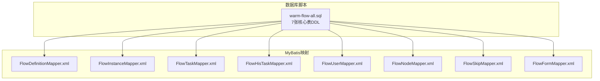
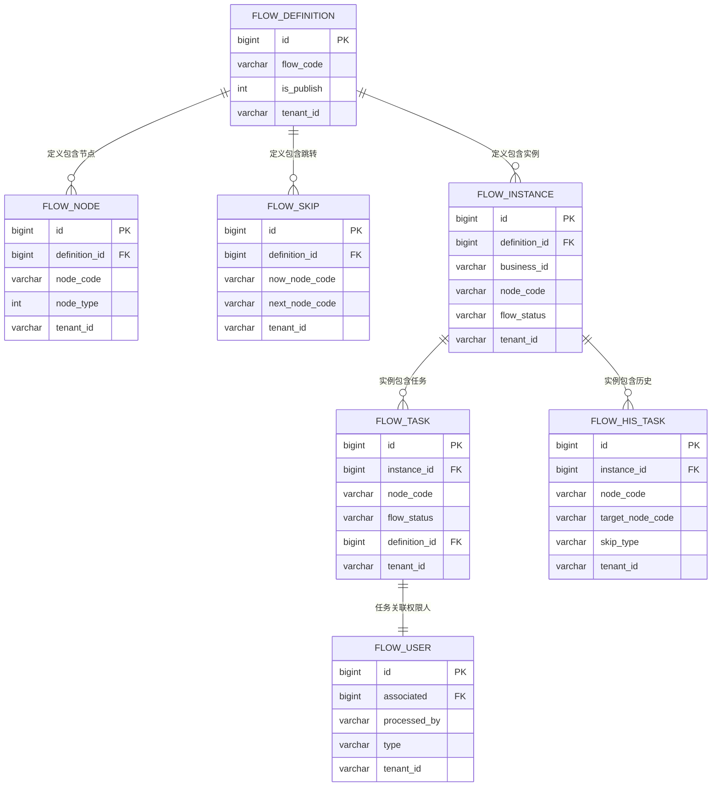

# 数据库性能优化

<cite>
**本文引用的文件**
- [warm-flow-all.sql](file://sql/mysql/warm-flow-all.sql)
- [FlowDefinitionMapper.xml](file://warm-flow-orm/warm-flow-mybatis/warm-flow-mybatis-core/src/main/resources/warm/flow/FlowDefinitionMapper.xml)
- [FlowInstanceMapper.xml](file://warm-flow-orm/warm-flow-mybatis/warm-flow-mybatis-core/src/main/resources/warm/flow/FlowInstanceMapper.xml)
- [FlowTaskMapper.xml](file://warm-flow-orm/warm-flow-mybatis/warm-flow-mybatis-core/src/main/resources/warm/flow/FlowTaskMapper.xml)
- [FlowHisTaskMapper.xml](file://warm-flow-orm/warm-flow-mybatis/warm-flow-mybatis-core/src/main/resources/warm/flow/FlowHisTaskMapper.xml)
- [FlowUserMapper.xml](file://warm-flow-orm/warm-flow-mybatis/warm-flow-mybatis-core/src/main/resources/warm/flow/FlowUserMapper.xml)
- [FlowNodeMapper.xml](file://warm-flow-orm/warm-flow-mybatis/warm-flow-mybatis-core/src/main/resources/warm/flow/FlowNodeMapper.xml)
- [FlowSkipMapper.xml](file://warm-flow-orm/warm-flow-mybatis/warm-flow-mybatis-core/src/main/resources/warm/flow/FlowSkipMapper.xml)
- [FlowFormMapper.xml](file://warm-flow-orm/warm-flow-mybatis/warm-flow-mybatis-core/src/main/resources/warm/flow/FlowFormMapper.xml)
</cite>

## 目录
1. [简介](#简介)
2. [项目结构](#项目结构)
3. [核心组件](#核心组件)
4. [架构总览](#架构总览)
5. [详细组件分析](#详细组件分析)
6. [依赖关系分析](#依赖关系分析)
7. [性能考量](#性能考量)
8. [故障排查指南](#故障排查指南)
9. [结论](#结论)
10. [附录](#附录)

## 简介
本文件面向 Warm-Flow 的数据库层，聚焦于 7 张核心表（流程定义、流程节点、节点跳转、流程实例、待办任务、历史任务、流程用户）的索引设计策略与查询优化方案，覆盖常用查询条件、复合索引设计原则、性能影响评估、表分区策略、慢查询分析与监控最佳实践、连接池与事务管理、并发控制、数据库参数调优与硬件资源建议，以及性能测试与基准分析方法。

## 项目结构
Warm-Flow 使用 MyBatis 进行数据访问，核心表结构在 MySQL 脚本中定义，SQL 映射文件集中于资源目录下，按实体命名空间组织，便于定位与优化。

图示来源
- [warm-flow-all.sql:1-160](file://sql/mysql/warm-flow-all.sql#L1-L160)
- [FlowDefinitionMapper.xml:1-428](file://warm-flow-orm/warm-flow-mybatis/warm-flow-mybatis-core/src/main/resources/warm/flow/FlowDefinitionMapper.xml#L1-L428)
- [FlowInstanceMapper.xml:1-386](file://warm-flow-orm/warm-flow-mybatis/warm-flow-mybatis-core/src/main/resources/warm/flow/FlowInstanceMapper.xml#L1-L386)
- [FlowTaskMapper.xml:1-379](file://warm-flow-orm/warm-flow-mybatis/warm-flow-mybatis-core/src/main/resources/warm/flow/FlowTaskMapper.xml#L1-L379)
- [FlowHisTaskMapper.xml:1-516](file://warm-flow-orm/warm-flow-mybatis/warm-flow-mybatis-core/src/main/resources/warm/flow/FlowHisTaskMapper.xml#L1-L516)
- [FlowUserMapper.xml:1-371](file://warm-flow-orm/warm-flow-mybatis/warm-flow-mybatis-core/src/main/resources/warm/flow/FlowUserMapper.xml#L1-L371)
- [FlowNodeMapper.xml:1-472](file://warm-flow-orm/warm-flow-mybatis/warm-flow-mybatis-core/src/main/resources/warm/flow/FlowNodeMapper.xml#L1-L472)
- [FlowSkipMapper.xml:1-390](file://warm-flow-orm/warm-flow-mybatis/warm-flow-mybatis-core/src/main/resources/warm/flow/FlowSkipMapper.xml#L1-L390)
- [FlowFormMapper.xml:1-366](file://warm-flow-orm/warm-flow-mybatis/warm-flow-mybatis-core/src/main/resources/warm/flow/FlowFormMapper.xml#L1-L366)

章节来源
- [warm-flow-all.sql:1-160](file://sql/mysql/warm-flow-all.sql#L1-L160)

## 核心组件
- 流程定义表：存储流程元数据、版本、发布状态、监听器等，常用于列表分页、按编码/名称检索、发布状态变更。
- 流程节点表：存储节点信息、权限标识、表单定制等，常用于按定义ID与节点编码集合查询。
- 节点跳转表：存储节点间流转规则，常用于按定义ID与节点编码范围查询。
- 流程实例表：存储流程运行实例、业务ID、节点状态、变量等，常用于按业务ID、定义ID、状态过滤。
- 待办任务表：存储当前可处理的任务、节点信息、状态、表单定制等，常用于按实例ID、节点编码集合查询。
- 历史任务表：存储审批历史、协作类型、流转类型、审批意见等，常用于按实例ID、节点编码集合、流转类型查询。
- 流程用户表：存储任务权限人、类型、关联任务ID等，常用于按关联ID与类型集合查询。

章节来源
- [warm-flow-all.sql:1-160](file://sql/mysql/warm-flow-all.sql#L1-L160)

## 架构总览
Warm-Flow 的数据库访问采用 MyBatis 映射，各实体对应的 Mapper 文件集中定义了查询条件片段与分页逻辑，便于统一优化与维护。

图示来源
- [FlowDefinitionMapper.xml:61-83](file://warm-flow-orm/warm-flow-mybatis/warm-flow-mybatis-core/src/main/resources/warm/flow/FlowDefinitionMapper.xml#L61-L83)
- [FlowInstanceMapper.xml:61-81](file://warm-flow-orm/warm-flow-mybatis/warm-flow-mybatis-core/src/main/resources/warm/flow/FlowInstanceMapper.xml#L61-L81)
- [FlowTaskMapper.xml:57-75](file://warm-flow-orm/warm-flow-mybatis/warm-flow-mybatis-core/src/main/resources/warm/flow/FlowTaskMapper.xml#L57-L75)
- [FlowHisTaskMapper.xml:72-103](file://warm-flow-orm/warm-flow-mybatis/warm-flow-mybatis-core/src/main/resources/warm/flow/FlowHisTaskMapper.xml#L72-L103)
- [FlowUserMapper.xml:44-59](file://warm-flow-orm/warm-flow-mybatis/warm-flow-mybatis-core/src/main/resources/warm/flow/FlowUserMapper.xml#L44-L59)
- [FlowNodeMapper.xml:66-99](file://warm-flow-orm/warm-flow-mybatis/warm-flow-mybatis-core/src/main/resources/warm/flow/FlowNodeMapper.xml#L66-L99)
- [FlowSkipMapper.xml:56-80](file://warm-flow-orm/warm-flow-mybatis/warm-flow-mybatis-core/src/main/resources/warm/flow/FlowSkipMapper.xml#L56-L80)
- [FlowFormMapper.xml:53-71](file://warm-flow-orm/warm-flow-mybatis/warm-flow-mybatis-core/src/main/resources/warm/flow/FlowFormMapper.xml#L53-L71)

## 详细组件分析

### 流程定义表（flow_definition）
- 主键：id（唯一）
- 常用查询条件：flow_code、flow_name、version、is_publish、activity_status、tenant_id、del_flag
- 推荐索引策略
  - 复合索引：(flow_code, del_flag, tenant_id) 或 (flow_code, tenant_id, del_flag)，满足按编码+租户+逻辑删除过滤的常见场景
  - 复合索引：(is_publish, del_flag, tenant_id) 用于发布状态筛选
  - 单列索引：tenant_id、del_flag（如存在高选择性且频繁过滤）
- 性能影响评估
  - 合理的复合索引可显著降低全表扫描概率，提升分页与筛选性能
  - 避免过多前缀选择性低的列作为联合前缀，防止索引效率下降
- 查询优化建议
  - 列表查询尽量带上 tenant_id 与 del_flag 过滤
  - 使用覆盖索引减少回表（若查询列包含在索引中）

章节来源
- [warm-flow-all.sql:1-23](file://sql/mysql/warm-flow-all.sql#L1-L23)
- [FlowDefinitionMapper.xml:61-83](file://warm-flow-orm/warm-flow-mybatis/warm-flow-mybatis-core/src/main/resources/warm/flow/FlowDefinitionMapper.xml#L61-L83)

### 流程节点表（flow_node）
- 主键：id（唯一）
- 常用查询条件：definition_id、node_code、node_type、permission_flag、tenant_id、del_flag
- 推荐索引策略
  - 复合索引：(definition_id, node_code, del_flag, tenant_id) 用于按定义与节点编码集合查询
  - 单列索引：definition_id（高频按定义ID查询）
  - 单列索引：node_code（按节点编码精确匹配）
- 性能影响评估
  - definition_id + node_code 组合可高效支持“按定义获取节点集合”场景
  - 避免在 node_code 上建立过多冗余索引
- 查询优化建议
  - 批量节点查询时优先使用 node_code in (...)，配合 definition_id 过滤
  - 注意 permission_flag 字段的字符长度与存储格式，避免隐式转换

章节来源
- [warm-flow-all.sql:25-49](file://sql/mysql/warm-flow-all.sql#L25-L49)
- [FlowNodeMapper.xml:252-263](file://warm-flow-orm/warm-flow-mybatis/warm-flow-mybatis-core/src/main/resources/warm/flow/FlowNodeMapper.xml#L252-L263)

### 节点跳转表（flow_skip）
- 主键：id（唯一）
- 常用查询条件：definition_id、now_node_code、next_node_code、skip_type、tenant_id、del_flag
- 推荐索引策略
  - 复合索引：(definition_id, now_node_code, next_node_code, del_flag, tenant_id) 支持按定义与节点对查询
  - 单列索引：definition_id、skip_type（按定义与跳转类型过滤）
- 性能影响评估
  - 跳转规则查询通常为点查或小集合扫描，合理索引可避免全表扫描
- 查询优化建议
  - 跳转查询常伴随定义维度，优先确保 definition_id 有良好索引

章节来源
- [warm-flow-all.sql:51-70](file://sql/mysql/warm-flow-all.sql#L51-L70)
- [FlowSkipMapper.xml:58-69](file://warm-flow-orm/warm-flow-mybatis/warm-flow-mybatis-core/src/main/resources/warm/flow/FlowSkipMapper.xml#L58-L69)

### 流程实例表（flow_instance）
- 主键：id（唯一）
- 常用查询条件：definition_id、business_id、node_code、flow_status、activity_status、tenant_id、del_flag
- 推荐索引策略
  - 复合索引：(business_id, del_flag, tenant_id) 用于业务主键快速定位
  - 复合索引：(definition_id, flow_status, del_flag, tenant_id) 用于按流程定义与状态筛选
  - 单列索引：definition_id、flow_status（高频过滤）
- 性能影响评估
  - business_id 作为业务主键应具备高选择性，建议单独索引
  - flow_status 常用于状态驱动的流程引擎逻辑，需保证索引有效
- 查询优化建议
  - 列表查询尽量带上 tenant_id 与 del_flag
  - 对大表进行分页时，确保排序列与过滤列在同一索引中，避免文件排序

章节来源
- [warm-flow-all.sql:72-92](file://sql/mysql/warm-flow-all.sql#L72-L92)
- [FlowInstanceMapper.xml:63-72](file://warm-flow-orm/warm-flow-mybatis/warm-flow-mybatis-core/src/main/resources/warm/flow/FlowInstanceMapper.xml#L63-L72)

### 待办任务表（flow_task）
- 主键：id（唯一）
- 常用查询条件：instance_id、node_code、flow_status、definition_id、tenant_id、del_flag
- 推荐索引策略
  - 复合索引：(instance_id, node_code, del_flag, tenant_id) 用于按实例与节点集合查询
  - 复合索引：(definition_id, flow_status, del_flag, tenant_id) 用于按定义与状态筛选
  - 单列索引：instance_id、node_code（高频点查）
- 性能影响评估
  - instance_id 是任务查询的关键过滤条件，需确保高选择性
  - node_code in (...) 批量查询场景下，索引选择性直接影响扫描范围
- 查询优化建议
  - 任务查询多为“按实例+节点集合”的组合，建议将 instance_id 作为联合索引首列
  - 注意 flow_status 的枚举值分布，避免索引选择性过低

章节来源
- [warm-flow-all.sql:94-112](file://sql/mysql/warm-flow-all.sql#L94-L112)
- [FlowTaskMapper.xml:59-66](file://warm-flow-orm/warm-flow-mybatis/warm-flow-mybatis-core/src/main/resources/warm/flow/FlowTaskMapper.xml#L59-L66)

### 历史任务表（flow_his_task）
- 主键：id（唯一）
- 常用查询条件：instance_id、node_code、target_node_code、skip_type、cooperate_type、tenant_id、del_flag
- 推荐索引策略
  - 复合索引：(instance_id, node_code, del_flag, tenant_id) 用于按实例与节点集合查询
  - 复合索引：(instance_id, skip_type, del_flag, tenant_id) 用于按实例与流转类型查询
  - 单列索引：instance_id、skip_type（高频过滤）
- 性能影响评估
  - 历史表通常体量较大，需结合分页与覆盖索引减少回表
  - cooperate_type 与 skip_type 的枚举值有限，适合联合索引优化
- 查询优化建议
  - 历史查询多为“按实例+节点/类型”组合，建议围绕 instance_id 设计联合索引
  - 对排序列（如 create_time）与过滤列同索引，避免额外排序

章节来源
- [warm-flow-all.sql:114-140](file://sql/mysql/warm-flow-all.sql#L114-L140)
- [FlowHisTaskMapper.xml:74-92](file://warm-flow-orm/warm-flow-mybatis/warm-flow-mybatis-core/src/main/resources/warm/flow/FlowHisTaskMapper.xml#L74-L92)

### 流程用户表（flow_user）
- 主键：id（唯一）
- 常用查询条件：processed_by、type、associated、tenant_id、del_flag
- 推荐索引策略
  - 复合索引：(processed_by, type, del_flag, tenant_id) 用于按权限人与类型查询
  - 复合索引：(associated, type, del_flag, tenant_id) 用于按任务ID与类型查询
  - 单列索引：processed_by、associated（高频点查）
- 性能影响评估
  - processed_by 与 associated 均为高频过滤字段，建议分别建立联合索引
  - type 为小枚举值，与其它列组合可提升选择性
- 查询优化建议
  - 用户权限查询多为“按权限人+类型”或“按任务ID+类型”，建议针对两类查询分别优化

章节来源
- [warm-flow-all.sql:143-158](file://sql/mysql/warm-flow-all.sql#L143-L158)
- [FlowUserMapper.xml:47-51](file://warm-flow-orm/warm-flow-mybatis/warm-flow-mybatis-core/src/main/resources/warm/flow/FlowUserMapper.xml#L47-L51)

### 流程表单表（flow_form）
- 主键：id（唯一）
- 常用查询条件：form_code、form_name、version、is_publish、tenant_id、del_flag
- 推荐索引策略
  - 复合索引：(form_code, del_flag, tenant_id) 用于按表单编码快速定位
  - 复合索引：(is_publish, del_flag, tenant_id) 用于发布状态筛选
  - 单列索引：tenant_id、del_flag（通用过滤）
- 性能影响评估
  - form_code 作为业务主键应具备高选择性，建议单独索引
  - is_publish 常用于表单发布状态管理，需保证索引有效
- 查询优化建议
  - 列表查询尽量带上 tenant_id 与 del_flag 过滤
  - 对大表进行分页时，确保排序列与过滤列在同一索引中

章节来源
- [FlowFormMapper.xml:55-69](file://warm-flow-orm/warm-flow-mybatis/warm-flow-mybatis-core/src/main/resources/warm/flow/FlowFormMapper.xml#L55-L69)

### 复合索引设计原则与性能影响评估
- 前缀选择性：联合索引的最左前缀应具有高选择性，优先放置区分度高的列
- 查询覆盖：尽量通过覆盖索引返回查询所需列，减少回表
- 写入成本：索引越多，INSERT/UPDATE/DELETE 的维护成本越高，需权衡读写比例
- 统计信息：定期更新表统计信息，帮助优化器选择最优执行计划

章节来源
- [FlowDefinitionMapper.xml:61-83](file://warm-flow-orm/warm-flow-mybatis/warm-flow-mybatis-core/src/main/resources/warm/flow/FlowDefinitionMapper.xml#L61-L83)
- [FlowInstanceMapper.xml:63-72](file://warm-flow-orm/warm-flow-mybatis/warm-flow-mybatis-core/src/main/resources/warm/flow/FlowInstanceMapper.xml#L63-L72)
- [FlowTaskMapper.xml:59-66](file://warm-flow-orm/warm-flow-mybatis/warm-flow-mybatis-core/src/main/resources/warm/flow/FlowTaskMapper.xml#L59-L66)
- [FlowHisTaskMapper.xml:74-92](file://warm-flow-orm/warm-flow-mybatis/warm-flow-mybatis-core/src/main/resources/warm/flow/FlowHisTaskMapper.xml#L74-L92)
- [FlowUserMapper.xml:47-51](file://warm-flow-orm/warm-flow-mybatis/warm-flow-mybatis-core/src/main/resources/warm/flow/FlowUserMapper.xml#L47-L51)
- [FlowNodeMapper.xml:252-263](file://warm-flow-orm/warm-flow-mybatis/warm-flow-mybatis-core/src/main/resources/warm/flow/FlowNodeMapper.xml#L252-L263)
- [FlowSkipMapper.xml:58-69](file://warm-flow-orm/warm-flow-mybatis/warm-flow-mybatis-core/src/main/resources/warm/flow/FlowSkipMapper.xml#L58-L69)
- [FlowFormMapper.xml:55-69](file://warm-flow-orm/warm-flow-mybatis/warm-flow-mybatis-core/src/main/resources/warm/flow/FlowFormMapper.xml#L55-L69)

### 表分区策略（大数据量场景）
- 建议按时间维度分区（如 create_time），典型场景：
  - 流程实例与历史任务表：按月/季度分区，归档旧数据，缩短扫描范围
  - 待办任务表：按业务周期或租户维度分区，隔离热点数据
- 分区键选择
  - 优先选择高频过滤列（如 instance_id、business_id、create_time）
  - 避免分区键选择性过低导致分区倾斜
- 维护策略
  - 新增分区与旧分区归档自动化
  - 分区裁剪（Partition Pruning）需确保 WHERE 条件能命中分区键

章节来源
- [FlowInstanceMapper.xml:63-72](file://warm-flow-orm/warm-flow-mybatis/warm-flow-mybatis-core/src/main/resources/warm/flow/FlowInstanceMapper.xml#L63-L72)
- [FlowHisTaskMapper.xml:74-92](file://warm-flow-orm/warm-flow-mybatis/warm-flow-mybatis-core/src/main/resources/warm/flow/FlowHisTaskMapper.xml#L74-L92)
- [FlowTaskMapper.xml:59-66](file://warm-flow-orm/warm-flow-mybatis/warm-flow-mybatis-core/src/main/resources/warm/flow/FlowTaskMapper.xml#L59-L66)

### 慢查询分析与性能监控最佳实践
- EXPLAIN 分析
  - 使用 EXPLAIN/EXPLAIN ANALYZE 查看执行计划，关注：
    - 是否使用到预期索引（key、possible_keys、key_len）
    - rows 估算与实际扫描行数差异
    - 是否发生 filesort 或临时表
- 执行计划优化
  - 将高选择性的过滤条件放在 WHERE 前部
  - 避免在索引列上使用函数或隐式转换
  - 使用覆盖索引减少回表
- 查询重写建议
  - 将 OR 改写为 IN 或 UNION（视场景而定）
  - 将子查询改写为 JOIN，利用索引
  - 分页查询使用“延迟关联”减少回表

章节来源
- [FlowDefinitionMapper.xml:180-203](file://warm-flow-orm/warm-flow-mybatis/warm-flow-mybatis-core/src/main/resources/warm/flow/FlowDefinitionMapper.xml#L180-L203)
- [FlowInstanceMapper.xml:88-105](file://warm-flow-orm/warm-flow-mybatis/warm-flow-mybatis-core/src/main/resources/warm/flow/FlowInstanceMapper.xml#L88-L105)
- [FlowTaskMapper.xml:161-177](file://warm-flow-orm/warm-flow-mybatis/warm-flow-mybatis-core/src/main/resources/warm/flow/FlowTaskMapper.xml#L161-L177)
- [FlowHisTaskMapper.xml:110-126](file://warm-flow-orm/warm-flow-mybatis/warm-flow-mybatis-core/src/main/resources/warm/flow/FlowHisTaskMapper.xml#L110-L126)
- [FlowUserMapper.xml:61-77](file://warm-flow-orm/warm-flow-mybatis/warm-flow-mybatis-core/src/main/resources/warm/flow/FlowUserMapper.xml#L61-L77)
- [FlowNodeMapper.xml:211-227](file://warm-flow-orm/warm-flow-mybatis/warm-flow-mybatis-core/src/main/resources/warm/flow/FlowNodeMapper.xml#L211-L227)
- [FlowSkipMapper.xml:87-103](file://warm-flow-orm/warm-flow-mybatis/warm-flow-mybatis-core/src/main/resources/warm/flow/FlowSkipMapper.xml#L87-L103)
- [FlowFormMapper.xml:152-169](file://warm-flow-orm/warm-flow-mybatis/warm-flow-mybatis-core/src/main/resources/warm/flow/FlowFormMapper.xml#L152-L169)

### 连接池配置、事务管理与并发控制
- 连接池
  - 建议根据 QPS 与并发事务数设置最大连接数，避免连接池耗尽
  - 开启连接健康检查与空闲回收，减少无效连接
- 事务管理
  - 读多写少场景开启只读事务，降低锁竞争
  - 批量写入使用批量插入与事务合并，减少往返
- 并发控制
  - 对热点表（如 flow_task）采用乐观锁或行级锁策略
  - 控制长事务，避免阻塞与死锁

[本节为通用实践建议，不直接分析具体文件]

### 数据库参数调优与硬件资源配置
- 参数调优
  - innodb_buffer_pool_size：建议占物理内存 60%-70%
  - innodb_log_file_size：增大日志文件以提升写入吞吐
  - innodb_flush_log_at_trx_commit：生产环境可设为 1 或 2 平衡安全与性能
  - max_connections：根据连接池大小与峰值并发设置
- 硬件建议
  - SSD 存储，降低 IO 延迟
  - CPU 核数与内存按并发与数据量平衡配置
  - 网络带宽满足高并发请求

[本节为通用实践建议，不直接分析具体文件]

### 性能测试方法与基准分析
- 压力测试
  - 使用 MySQL 自带 sysbench 或自研压测工具模拟真实业务场景
  - 关注关键指标：TPS、P95/P99 延迟、连接池利用率、锁等待
- 基准对比
  - 不同索引策略对比（单列 vs 复合索引）
  - 分区前后对比（扫描行数、响应时间）
- 结果分析
  - 结合 EXPLAIN 与慢查询日志，定位瓶颈
  - 输出优化前后的性能对比报告

[本节为通用实践建议，不直接分析具体文件]

## 依赖关系分析
- 表间关系
  - flow_node 与 flow_skip 均依赖 flow_definition 的主键
  - flow_task 与 flow_his_task 均依赖 flow_instance 的主键
  - flow_user 通过 associated 关联 flow_task
- 查询依赖
  - 多表查询常围绕实例 ID 与节点编码展开，建议在相关表建立联合索引以支撑跨表过滤

图示来源
- [warm-flow-all.sql:1-160](file://sql/mysql/warm-flow-all.sql#L1-L160)

章节来源
- [warm-flow-all.sql:1-160](file://sql/mysql/warm-flow-all.sql#L1-L160)

## 性能考量
- 索引设计
  - 针对高频过滤列与业务主键建立复合索引，优先考虑最左前缀选择性
  - 对大表采用覆盖索引，减少回表
- 查询模式
  - 列表分页与条件过滤需与索引设计匹配，避免全表扫描
  - 批量查询使用 in (...)，并确保 in 列表大小可控
- 统计与维护
  - 定期更新表统计信息，保持执行计划稳定
  - 监控索引使用率与碎片率，适时重建或重组

[本节为通用性能建议，不直接分析具体文件]

## 故障排查指南
- 常见问题
  - 查询慢：检查是否使用到索引、是否存在隐式转换、是否发生文件排序
  - 死锁与锁等待：检查事务粒度与锁顺序，避免跨表长事务
  - 连接池耗尽：检查最大连接数与超时配置，优化慢查询
- 工具与手段
  - EXPLAIN 分析执行计划
  - 慢查询日志定位热点 SQL
  - show processlist 与 show engine innodb status 分析锁与事务

章节来源
- [FlowDefinitionMapper.xml:180-203](file://warm-flow-orm/warm-flow-mybatis/warm-flow-mybatis-core/src/main/resources/warm/flow/FlowDefinitionMapper.xml#L180-L203)
- [FlowInstanceMapper.xml:88-105](file://warm-flow-orm/warm-flow-mybatis/warm-flow-mybatis-core/src/main/resources/warm/flow/FlowInstanceMapper.xml#L88-L105)
- [FlowTaskMapper.xml:161-177](file://warm-flow-orm/warm-flow-mybatis/warm-flow-mybatis-core/src/main/resources/warm/flow/FlowTaskMapper.xml#L161-L177)
- [FlowHisTaskMapper.xml:110-126](file://warm-flow-orm/warm-flow-mybatis/warm-flow-mybatis-core/src/main/resources/warm/flow/FlowHisTaskMapper.xml#L110-L126)
- [FlowUserMapper.xml:61-77](file://warm-flow-orm/warm-flow-mybatis/warm-flow-mybatis-core/src/main/resources/warm/flow/FlowUserMapper.xml#L61-L77)
- [FlowNodeMapper.xml:211-227](file://warm-flow-orm/warm-flow-mybatis/warm-flow-mybatis-core/src/main/resources/warm/flow/FlowNodeMapper.xml#L211-L227)
- [FlowSkipMapper.xml:87-103](file://warm-flow-orm/warm-flow-mybatis/warm-flow-mybatis-core/src/main/resources/warm/flow/FlowSkipMapper.xml#L87-L103)
- [FlowFormMapper.xml:152-169](file://warm-flow-orm/warm-flow-mybatis/warm-flow-mybatis-core/src/main/resources/warm/flow/FlowFormMapper.xml#L152-L169)

## 结论
通过对 7 张核心表的索引设计策略、复合索引原则、查询优化与性能影响评估，结合表分区、慢查询分析与监控、连接池与事务管理、并发控制、参数调优与硬件建议，以及性能测试方法，可系统性提升 Warm-Flow 在高并发与大数据量场景下的数据库性能与稳定性。建议在生产环境中持续监控与迭代优化，确保索引与查询模式与业务增长同步演进。

## 附录
- 参考文件清单
  - [warm-flow-all.sql](file://sql/mysql/warm-flow-all.sql)
  - [FlowDefinitionMapper.xml](file://warm-flow-orm/warm-flow-mybatis/warm-flow-mybatis-core/src/main/resources/warm/flow/FlowDefinitionMapper.xml)
  - [FlowInstanceMapper.xml](file://warm-flow-orm/warm-flow-mybatis/warm-flow-mybatis-core/src/main/resources/warm/flow/FlowInstanceMapper.xml)
  - [FlowTaskMapper.xml](file://warm-flow-orm/warm-flow-mybatis/warm-flow-mybatis-core/src/main/resources/warm/flow/FlowTaskMapper.xml)
  - [FlowHisTaskMapper.xml](file://warm-flow-orm/warm-flow-mybatis/warm-flow-mybatis-core/src/main/resources/warm/flow/FlowHisTaskMapper.xml)
  - [FlowUserMapper.xml](file://warm-flow-orm/warm-flow-mybatis/warm-flow-mybatis-core/src/main/resources/warm/flow/FlowUserMapper.xml)
  - [FlowNodeMapper.xml](file://warm-flow-orm/warm-flow-mybatis/warm-flow-mybatis-core/src/main/resources/warm/flow/FlowNodeMapper.xml)
  - [FlowSkipMapper.xml](file://warm-flow-orm/warm-flow-mybatis/warm-flow-mybatis-core/src/main/resources/warm/flow/FlowSkipMapper.xml)
  - [FlowFormMapper.xml](file://warm-flow-orm/warm-flow-mybatis/warm-flow-mybatis-core/src/main/resources/warm/flow/FlowFormMapper.xml)