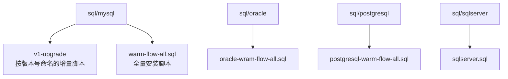
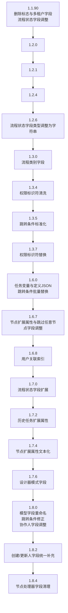
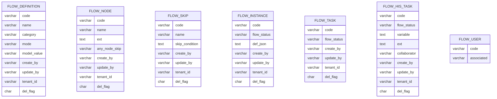

# 数据库版本管理

<cite>
**本文引用的文件**
- [warm-flow_1.1.90.sql](file://sql/mysql/v1-upgrade/warm-flow_1.1.90.sql)
- [warm-flow_1.2.0.sql](file://sql/mysql/v1-upgrade/warm-flow_1.2.0.sql)
- [warm-flow_1.2.1.sql](file://sql/mysql/v1-upgrade/warm-flow_1.2.1.sql)
- [warm-flow_1.2.4.sql](file://sql/mysql/v1-upgrade/warm-flow_1.2.4.sql)
- [warm-flow_1.2.6.sql](file://sql/mysql/v1-upgrade/warm-flow_1.2.6.sql)
- [warm-flow_1.3.0.sql](file://sql/mysql/v1-upgrade/warm-flow_1.3.0.sql)
- [warm-flow_1.3.4.sql](file://sql/mysql/v1-upgrade/warm-flow_1.3.4.sql)
- [warm-flow_1.3.5.sql](file://sql/mysql/v1-upgrade/warm-flow_1.3.5.sql)
- [warm-flow_1.3.7.sql](file://sql/mysql/v1-upgrade/warm-flow_1.3.7.sql)
- [warm-flow_1.6.0.sql](file://sql/mysql/v1-upgrade/warm-flow_1.6.0.sql)
- [warm-flow_1.6.7.sql](file://sql/mysql/v1-upgrade/warm-flow_1.6.7.sql)
- [warm-flow_1.6.8.sql](file://sql/mysql/v1-upgrade/warm-flow_1.6.8.sql)
- [warm-flow_1.7.0.sql](file://sql/mysql/v1-upgrade/warm-flow_1.7.0.sql)
- [warm-flow_1.7.2.sql](file://sql/mysql/v1-upgrade/warm-flow_1.7.2.sql)
- [warm-flow_1.7.4.sql](file://sql/mysql/v1-upgrade/warm-flow_1.7.4.sql)
- [warm-flow_1.7.6.sql](file://sql/mysql/v1-upgrade/warm-flow_1.7.6.sql)
- [warm-flow_1.8.0.sql](file://sql/mysql/v1-upgrade/warm-flow_1.8.0.sql)
- [warm-flow_1.8.2.sql](file://sql/mysql/v1-upgrade/warm-flow_1.8.2.sql)
- [warm-flow_1.8.4.sql](file://sql/mysql/v1-upgrade/warm-flow_1.8.4.sql)
- [warm-flow_form.sql](file://sql/mysql/v1-upgrade/warm-flow_form.sql)
- [warm-flow-all.sql](file://sql/mysql/warm-flow-all.sql)
</cite>

## 目录
1. [简介](#简介)
2. [项目结构](#项目结构)
3. [核心组件](#核心组件)
4. [架构总览](#架构总览)
5. [详细组件分析](#详细组件分析)
6. [依赖分析](#依赖分析)
7. [性能考虑](#性能考虑)
8. [故障排查指南](#故障排查指南)
9. [结论](#结论)
10. [附录](#附录)

## 简介
本文件系统化梳理 Warm-Flow 从 1.1.90 到 1.8.4 的数据库版本管理与增量升级策略，覆盖 MySQL、Oracle、PostgreSQL、SQLServer 多数据库适配。重点说明各版本升级脚本的变更要点（新增表、字段、索引、数据修复与迁移），版本升级顺序与依赖关系，以及在生产环境中的安全升级与回滚策略。

## 项目结构
Warm-Flow 的数据库版本管理位于 sql 目录，按数据库类型分目录存放，v1-upgrade 子目录按版本号命名的 SQL 文件构成完整的增量升级序列；另有全量安装脚本用于首次部署或重置环境。

图示来源
- [warm-flow-all.sql](file://sql/mysql/warm-flow-all.sql)
- [warm-flow_1.1.90.sql](file://sql/mysql/v1-upgrade/warm-flow_1.1.90.sql)

章节来源
- [warm-flow-all.sql](file://sql/mysql/warm-flow-all.sql)
- [warm-flow_1.1.90.sql](file://sql/mysql/v1-upgrade/warm-flow_1.1.90.sql)

## 核心组件
- 增量升级脚本：以版本号命名的 SQL 文件，按顺序执行，确保数据库结构与数据逐步演进。
- 全量安装脚本：包含所有建表、索引、初始数据，适合全新环境或灾难恢复后的重建。
- 多数据库适配：提供 MySQL、Oracle、PostgreSQL、SQLServer 的脚本，满足不同运行环境需求。
- 版本演进：从 1.1.90 开始引入删除标志与多租户字段，逐步完善流程状态、节点扩展、设计器模式、人员协作等能力，并在 1.8.x 引入创建/更新人字段与节点处理器字段清理。

章节来源
- [warm-flow_1.1.90.sql](file://sql/mysql/v1-upgrade/warm-flow_1.1.90.sql)
- [warm-flow_1.8.4.sql](file://sql/mysql/v1-upgrade/warm-flow_1.8.4.sql)
- [warm-flow_1.8.2.sql](file://sql/mysql/v1-upgrade/warm-flow_1.8.2.sql)
- [warm-flow_1.8.0.sql](file://sql/mysql/v1-upgrade/warm-flow_1.8.0.sql)
- [warm-flow_1.7.6.sql](file://sql/mysql/v1-upgrade/warm-flow_1.7.6.sql)
- [warm-flow_1.7.4.sql](file://sql/mysql/v1-upgrade/warm-flow_1.7.4.sql)
- [warm-flow_1.7.2.sql](file://sql/mysql/v1-upgrade/warm-flow_1.7.2.sql)
- [warm-flow_1.7.0.sql](file://sql/mysql/v1-upgrade/warm-flow_1.7.0.sql)
- [warm-flow_1.6.8.sql](file://sql/mysql/v1-upgrade/warm-flow_1.6.8.sql)
- [warm-flow_1.6.7.sql](file://sql/mysql/v1-upgrade/warm-flow_1.6.7.sql)
- [warm-flow_1.6.0.sql](file://sql/mysql/v1-upgrade/warm-flow_1.6.0.sql)
- [warm-flow_1.3.7.sql](file://sql/mysql/v1-upgrade/warm-flow_1.3.7.sql)
- [warm-flow_1.3.5.sql](file://sql/mysql/v1-upgrade/warm-flow_1.3.5.sql)
- [warm-flow_1.3.4.sql](file://sql/mysql/v1-upgrade/warm-flow_1.3.4.sql)
- [warm-flow_1.3.0.sql](file://sql/mysql/v1-upgrade/warm-flow_1.3.0.sql)
- [warm-flow_1.2.6.sql](file://sql/mysql/v1-upgrade/warm-flow_1.2.6.sql)
- [warm-flow_form.sql](file://sql/mysql/v1-upgrade/warm-flow_form.sql)

## 架构总览
下图展示从 1.1.90 到 1.8.4 的版本演进与关键变更点，帮助理解升级顺序与依赖关系。

图示来源
- [warm-flow_1.1.90.sql](file://sql/mysql/v1-upgrade/warm-flow_1.1.90.sql)
- [warm-flow_1.2.6.sql](file://sql/mysql/v1-upgrade/warm-flow_1.2.6.sql)
- [warm-flow_1.3.0.sql](file://sql/mysql/v1-upgrade/warm-flow_1.3.0.sql)
- [warm-flow_1.3.4.sql](file://sql/mysql/v1-upgrade/warm-flow_1.3.4.sql)
- [warm-flow_1.3.5.sql](file://sql/mysql/v1-upgrade/warm-flow_1.3.5.sql)
- [warm-flow_1.3.7.sql](file://sql/mysql/v1-upgrade/warm-flow_1.3.7.sql)
- [warm-flow_1.6.0.sql](file://sql/mysql/v1-upgrade/warm-flow_1.6.0.sql)
- [warm-flow_1.6.7.sql](file://sql/mysql/v1-upgrade/warm-flow_1.6.7.sql)
- [warm-flow_1.6.8.sql](file://sql/mysql/v1-upgrade/warm-flow_1.6.8.sql)
- [warm-flow_1.7.0.sql](file://sql/mysql/v1-upgrade/warm-flow_1.7.0.sql)
- [warm-flow_1.7.2.sql](file://sql/mysql/v1-upgrade/warm-flow_1.7.2.sql)
- [warm-flow_1.7.4.sql](file://sql/mysql/v1-upgrade/warm-flow_1.7.4.sql)
- [warm-flow_1.7.6.sql](file://sql/mysql/v1-upgrade/warm-flow_1.7.6.sql)
- [warm-flow_1.8.0.sql](file://sql/mysql/v1-upgrade/warm-flow_1.8.0.sql)
- [warm-flow_1.8.2.sql](file://sql/mysql/v1-upgrade/warm-flow_1.8.2.sql)
- [warm-flow_1.8.4.sql](file://sql/mysql/v1-upgrade/warm-flow_1.8.4.sql)

## 详细组件分析

### 1.1.90 → 1.2.0 → 1.2.1 → 1.2.4 → 1.2.6：流程状态与基础字段演进
- 1.1.90：为流程相关表增加删除标志字段，统一多租户字段布局；调整流程状态字段注释与位置；移除唯一索引；对部分表进行租户字段的补充与调整。
- 1.2.6：将流程状态字段类型由整型改为字符串，增强状态表达能力；同步调整历史任务表的状态字段。

章节来源
- [warm-flow_1.1.90.sql](file://sql/mysql/v1-upgrade/warm-flow_1.1.90.sql)
- [warm-flow_1.2.6.sql](file://sql/mysql/v1-upgrade/warm-flow_1.2.6.sql)

### 1.3.0 → 1.3.4 → 1.3.5 → 1.3.7：权限与跳转条件标准化
- 1.3.0：为流程定义增加类别字段，便于分类管理。
- 1.3.4：清洗节点权限标识符中的占位符，保证后续解析一致性。
- 1.3.5：对跳转条件进行标准化替换，统一运算符分隔符，提升规则解析稳定性。
- 1.3.7：对权限标识符进行替换，消除旧格式残留。

章节来源
- [warm-flow_1.3.0.sql](file://sql/mysql/v1-upgrade/warm-flow_1.3.0.sql)
- [warm-flow_1.3.4.sql](file://sql/mysql/v1-upgrade/warm-flow_1.3.4.sql)
- [warm-flow_1.3.5.sql](file://sql/mysql/v1-upgrade/warm-flow_1.3.5.sql)
- [warm-flow_1.3.7.sql](file://sql/mysql/v1-upgrade/warm-flow_1.3.7.sql)

### 1.6.0 → 1.6.7 → 1.6.8：任务变量、定义 JSON 与索引优化
- 1.6.0：为历史任务增加任务变量字段；为流程实例增加定义 JSON 字段；调整目标节点字段长度；对跳转条件进行批量替换，统一语法。
- 1.6.7：移除“跳过任意节点”字段，新增“任意节点跳转”字段；为节点增加扩展属性字段。
- 1.6.8：为用户表增加关联索引，优化查询性能。

章节来源
- [warm-flow_1.6.0.sql](file://sql/mysql/v1-upgrade/warm-flow_1.6.0.sql)
- [warm-flow_1.6.7.sql](file://sql/mysql/v1-upgrade/warm-flow_1.6.7.sql)
- [warm-flow_1.6.8.sql](file://sql/mysql/v1-upgrade/warm-flow_1.6.8.sql)

### 1.7.0 → 1.7.2 → 1.7.4 → 1.7.6：流程状态扩展与节点扩展
- 1.7.0：为任务表增加更丰富的流程状态字段；同步调整实例与历史任务的状态字段。
- 1.7.2：为历史任务扩展属性字段增加描述，承载业务详情 JSON。
- 1.7.4：将节点扩展属性字段改为文本类型，支持更复杂的扩展配置。
- 1.7.6：为流程定义增加设计器模式字段，区分经典与仿钉钉模式。

章节来源
- [warm-flow_1.7.0.sql](file://sql/mysql/v1-upgrade/warm-flow_1.7.0.sql)
- [warm-flow_1.7.2.sql](file://sql/mysql/v1-upgrade/warm-flow_1.7.2.sql)
- [warm-flow_1.7.4.sql](file://sql/mysql/v1-upgrade/warm-flow_1.7.4.sql)
- [warm-flow_1.7.6.sql](file://sql/mysql/v1-upgrade/warm-flow_1.7.6.sql)

### 1.8.0 → 1.8.2 → 1.8.4：模型字段、创建/更新人与处理器清理
- 1.8.0：将流程定义的模型字段重命名为更具语义的 model_value；对跳转条件中的拼写错误进行修正；调整历史任务协作人字段长度。
- 1.8.2：为流程定义、节点、跳转、任务、用户等表补充创建人与更新人字段，统一审计信息。
- 1.8.4：清理节点处理器类型与路径字段，简化节点配置。

章节来源
- [warm-flow_1.8.0.sql](file://sql/mysql/v1-upgrade/warm-flow_1.8.0.sql)
- [warm-flow_1.8.2.sql](file://sql/mysql/v1-upgrade/warm-flow_1.8.2.sql)
- [warm-flow_1.8.4.sql](file://sql/mysql/v1-upgrade/warm-flow_1.8.4.sql)

### 表结构与字段演进概览
以下 ER 图展示核心表在关键版本的字段变化趋势，便于理解版本演进与兼容性要求。

图示来源
- [warm-flow_1.3.0.sql](file://sql/mysql/v1-upgrade/warm-flow_1.3.0.sql)
- [warm-flow_1.7.6.sql](file://sql/mysql/v1-upgrade/warm-flow_1.7.6.sql)
- [warm-flow_1.8.0.sql](file://sql/mysql/v1-upgrade/warm-flow_1.8.0.sql)
- [warm-flow_1.8.2.sql](file://sql/mysql/v1-upgrade/warm-flow_1.8.2.sql)
- [warm-flow_1.8.4.sql](file://sql/mysql/v1-upgrade/warm-flow_1.8.4.sql)
- [warm-flow_1.6.0.sql](file://sql/mysql/v1-upgrade/warm-flow_1.6.0.sql)
- [warm-flow_1.6.7.sql](file://sql/mysql/v1-upgrade/warm-flow_1.6.7.sql)
- [warm-flow_1.6.8.sql](file://sql/mysql/v1-upgrade/warm-flow_1.6.8.sql)
- [warm-flow_1.7.0.sql](file://sql/mysql/v1-upgrade/warm-flow_1.7.0.sql)
- [warm-flow_1.7.2.sql](file://sql/mysql/v1-upgrade/warm-flow_1.7.2.sql)
- [warm-flow_1.7.4.sql](file://sql/mysql/v1-upgrade/warm-flow_1.7.4.sql)

## 依赖分析
- 版本顺序严格依赖：必须按 1.1.90 → 1.2.6 → 1.3.0 → 1.3.4 → 1.3.5 → 1.3.7 → 1.6.0 → 1.6.7 → 1.6.8 → 1.7.0 → 1.7.2 → 1.7.4 → 1.7.6 → 1.8.0 → 1.8.2 → 1.8.4 的顺序执行，否则会出现字段不存在或数据不一致。
- 数据依赖：1.6.0 中对跳转条件的批量替换依赖于 1.3.5/1.3.7 的标准化结果；1.8.0 中对 skip_condition 的修正依赖 1.6.0 的替换结果。
- 索引依赖：1.6.8 为用户表增加索引，需在用户数据量增长后评估其收益与维护成本。

图示来源
- [warm-flow_1.1.90.sql](file://sql/mysql/v1-upgrade/warm-flow_1.1.90.sql)
- [warm-flow_1.2.6.sql](file://sql/mysql/v1-upgrade/warm-flow_1.2.6.sql)
- [warm-flow_1.3.0.sql](file://sql/mysql/v1-upgrade/warm-flow_1.3.0.sql)
- [warm-flow_1.3.4.sql](file://sql/mysql/v1-upgrade/warm-flow_1.3.4.sql)
- [warm-flow_1.3.5.sql](file://sql/mysql/v1-upgrade/warm-flow_1.3.5.sql)
- [warm-flow_1.3.7.sql](file://sql/mysql/v1-upgrade/warm-flow_1.3.7.sql)
- [warm-flow_1.6.0.sql](file://sql/mysql/v1-upgrade/warm-flow_1.6.0.sql)
- [warm-flow_1.6.7.sql](file://sql/mysql/v1-upgrade/warm-flow_1.6.7.sql)
- [warm-flow_1.6.8.sql](file://sql/mysql/v1-upgrade/warm-flow_1.6.8.sql)
- [warm-flow_1.7.0.sql](file://sql/mysql/v1-upgrade/warm-flow_1.7.0.sql)
- [warm-flow_1.7.2.sql](file://sql/mysql/v1-upgrade/warm-flow_1.7.2.sql)
- [warm-flow_1.7.4.sql](file://sql/mysql/v1-upgrade/warm-flow_1.7.4.sql)
- [warm-flow_1.7.6.sql](file://sql/mysql/v1-upgrade/warm-flow_1.7.6.sql)
- [warm-flow_1.8.0.sql](file://sql/mysql/v1-upgrade/warm-flow_1.8.0.sql)
- [warm-flow_1.8.2.sql](file://sql/mysql/v1-upgrade/warm-flow_1.8.2.sql)
- [warm-flow_1.8.4.sql](file://sql/mysql/v1-upgrade/warm-flow_1.8.4.sql)

## 性能考虑
- 索引优化：1.6.8 为用户表增加关联索引，建议在用户规模较大时评估该索引对查询与写入的影响。
- 字段类型调整：1.7.4 将节点扩展属性改为文本类型，有利于存储复杂配置，但需关注存储与查询性能。
- 批量数据替换：1.6.0 对跳转条件进行批量替换，建议在低峰期执行，避免长事务锁表。
- 多租户与删除标志：1.1.90 引入的多租户与删除标志字段便于隔离与归档，但需配合应用层逻辑使用，避免误删或跨租户访问。

## 故障排查指南
- 升级失败定位
  - 检查字段是否存在：若提示字段不存在，确认是否遗漏中间版本（如 1.3.5/1.6.0）。
  - 检查索引与约束：若索引冲突，确认是否重复执行或版本顺序错误。
  - 检查数据类型：若类型转换失败，确认历史数据是否符合新类型要求。
- 回滚策略
  - 使用对应版本的回滚脚本（若存在）或基于备份回退到上一稳定版本。
  - 对关键变更（如字段类型、索引）采用“先新增后删除”的双阶段策略，降低回滚难度。
- 生产环境注意事项
  - 预热验证：在测试环境完整跑通升级流程后再进入生产。
  - 备份策略：升级前对数据库进行全量备份，保留二进制日志以便时间点恢复。
  - 停机窗口：尽量选择业务低谷时段执行升级，缩短停机时间。
  - 风险控制：分批升级（先核心表，再扩展表），并设置人工校验点。

## 结论
Warm-Flow 的数据库版本管理遵循严格的增量升级策略，从 1.1.90 到 1.8.4 的演进体现了对流程状态、节点扩展、设计器模式、审计字段与处理器配置的持续优化。生产环境应严格遵循版本顺序与回滚策略，结合备份与停机窗口规划，确保升级安全与可追溯。

## 附录
- 全量安装脚本：用于全新环境或灾难恢复场景，包含所有建表、索引与初始数据。
- 表单脚本：独立的表单相关初始化脚本，可在需要时单独执行。

章节来源
- [warm-flow_all.sql](file://sql/mysql/warm-flow-all.sql)
- [warm-flow_form.sql](file://sql/mysql/v1-upgrade/warm-flow_form.sql)