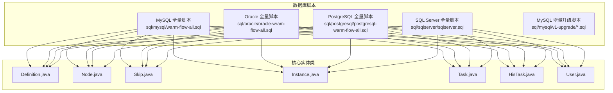
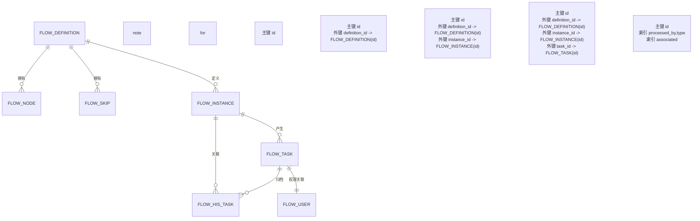
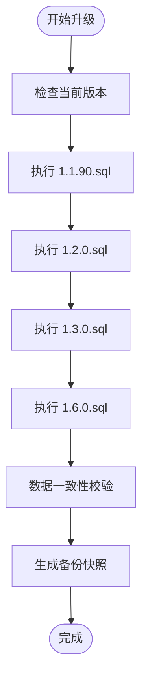
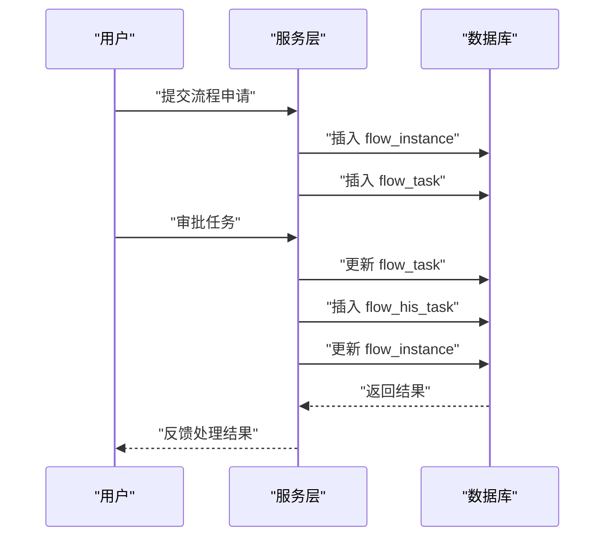
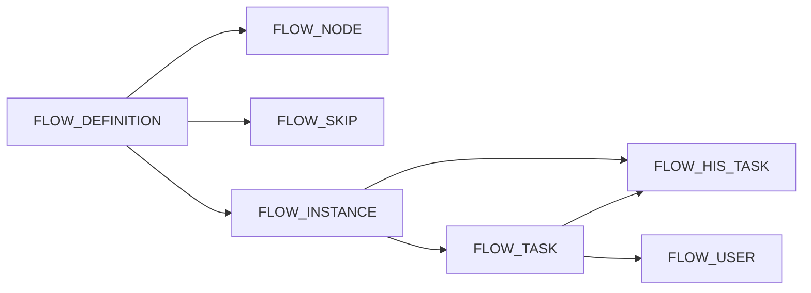

# 数据库设计

<cite>
**本文引用的文件**
- [warm-flow-all.sql](file://sql/mysql/warm-flow-all.sql)
- [oracle-wram-flow-all.sql](file://sql/oracle/oracle-wram-flow-all.sql)
- [postgresql-warm-flow-all.sql](file://sql/postgresql/postgresql-warm-flow-all.sql)
- [sqlserver.sql](file://sql/sqlserver/sqlserver.sql)
- [warm-flow_1.1.90.sql](file://sql/mysql/v1-upgrade/warm-flow_1.1.90.sql)
- [warm-flow_1.2.0.sql](file://sql/mysql/v1-upgrade/warm-flow_1.2.0.sql)
- [warm-flow_1.3.0.sql](file://sql/mysql/v1-upgrade/warm-flow_1.3.0.sql)
- [warm-flow_1.6.0.sql](file://sql/mysql/v1-upgrade/warm-flow_1.6.0.sql)
- [Definition.java](file://warm-flow-core/src/main/java/org/dromara/warm/flow/core/entity/Definition.java)
- [Node.java](file://warm-flow-core/src/main/java/org/dromara/warm/flow/core/entity/Node.java)
- [Skip.java](file://warm-flow-core/src/main/java/org/dromara/warm/flow/core/entity/Skip.java)
- [Instance.java](file://warm-flow-core/src/main/java/org/dromara/warm/flow/core/entity/Instance.java)
- [Task.java](file://warm-flow-core/src/main/java/org/dromara/warm/flow/core/entity/Task.java)
- [HisTask.java](file://warm-flow-core/src/main/java/org/dromara/warm/flow/core/entity/HisTask.java)
- [User.java](file://warm-flow-core/src/main/java/org/dromara/warm/flow/core/entity/User.java)
</cite>

## 目录
1. [简介](#简介)
2. [项目结构](#项目结构)
3. [核心组件](#核心组件)
4. [架构总览](#架构总览)
5. [详细组件分析](#详细组件分析)
6. [依赖分析](#依赖分析)
7. [性能考虑](#性能考虑)
8. [故障排查指南](#故障排查指南)
9. [结论](#结论)
10. [附录](#附录)

## 简介
本文件面向 Warm-Flow 的数据库层，系统化梳理七张核心表的设计理念与业务含义，阐明表间关联与外键约束，解释数据完整性保障机制；同时覆盖 MySQL、Oracle、PostgreSQL、SQL Server 四大数据库的适配差异与兼容性处理；最后给出版本升级策略与索引设计原则，帮助读者在多数据库环境下稳定、高效地运行流程引擎。

## 项目结构
数据库脚本按数据库类型分目录存放，统一入口为各数据库的全量建表脚本，配套 MySQL 的增量升级脚本用于版本演进。核心实体类位于 warm-flow-core 模块，映射上述七张表。

图表来源
- [warm-flow-all.sql:1-160](file://sql/mysql/warm-flow-all.sql#L1-L160)
- [oracle-wram-flow-all.sql:1-311](file://sql/oracle/oracle-wram-flow-all.sql#L1-L311)
- [postgresql-warm-flow-all.sql:1-296](file://sql/postgresql/postgresql-warm-flow-all.sql#L1-L296)
- [sqlserver.sql:1-1087](file://sql/sqlserver/sqlserver.sql#L1-L1087)
- [Definition.java:24-196](file://warm-flow-core/src/main/java/org/dromara/warm/flow/core/entity/Definition.java#L24-L196)
- [Node.java:25-162](file://warm-flow-core/src/main/java/org/dromara/warm/flow/core/entity/Node.java#L25-L162)
- [Skip.java:23-128](file://warm-flow-core/src/main/java/org/dromara/warm/flow/core/entity/Skip.java#L23-L128)
- [Instance.java:24-166](file://warm-flow-core/src/main/java/org/dromara/warm/flow/core/entity/Instance.java#L24-L166)
- [Task.java:22-136](file://warm-flow-core/src/main/java/org/dromara/warm/flow/core/entity/Task.java#L22-L136)
- [HisTask.java:24-164](file://warm-flow-core/src/main/java/org/dromara/warm/flow/core/entity/HisTask.java#L24-L164)
- [User.java:21-95](file://warm-flow-core/src/main/java/org/dromara/warm/flow/core/entity/User.java#L21-L95)

章节来源
- [warm-flow-all.sql:1-160](file://sql/mysql/warm-flow-all.sql#L1-L160)
- [oracle-wram-flow-all.sql:1-311](file://sql/oracle/oracle-wram-flow-all.sql#L1-L311)
- [postgresql-warm-flow-all.sql:1-296](file://sql/postgresql/postgresql-warm-flow-all.sql#L1-L296)
- [sqlserver.sql:1-1087](file://sql/sqlserver/sqlserver.sql#L1-L1087)

## 核心组件
本节从“表设计”“业务含义”“字段要点”“完整性保障”四个维度，逐表解析七张核心表。

- 流程定义表 flow_definition
  - 业务含义：保存流程模板元信息，含编码、名称、模型、版本、发布状态、表单配置、监听器等。
  - 关键字段：主键 id、流程编码 flow_code、流程名称 flow_name、版本 version、发布状态 is_publish、表单定制 form_custom/form_path、监听器 listener_type/listener_path、扩展 ext、租户 tenant_id、软删 del_flag。
  - 完整性：主键约束；多数据库均提供注释与默认值；Oracle 使用 NUMBER(20)/VARCHAR2，PostgreSQL 使用 int8/varchar，SQL Server 使用 bigint/nvarchar，MySQL 使用 bigint/varchar。

- 流程节点表 flow_node
  - 业务含义：保存流程图节点信息，含节点类型、坐标、权限标识、表单配置、监听器、扩展属性等。
  - 关键字段：definition_id 外键指向 flow_definition；节点类型 node_type、节点编码 node_code、节点名称 node_name、权限标识 permission_flag、签署比例 node_ratio、坐标 coordinate、监听器 listener_type/listener_path、表单 form_custom/form_path、扩展 ext、租户 tenant_id、软删 del_flag。
  - 完整性：主键约束；外键约束（见下节）；多数据库类型映射一致。

- 节点跳转表 flow_skip
  - 业务含义：保存节点间的流转关系，含当前节点、下一节点、跳转类型、条件、坐标等。
  - 关键字段：definition_id 外键；now_node_code/next_node_code、now_node_type/next_node_type、跳转类型 skip_type、跳转条件 skip_condition、坐标 coordinate、租户 tenant_id、软删 del_flag。
  - 完整性：主键约束；外键约束（见下节）。

- 流程实例表 flow_instance
  - 业务含义：保存一次流程运行的实例状态，含业务标识、当前节点、流程状态、变量、表单配置、定义 JSON 等。
  - 关键字段：definition_id 外键；business_id、node_type/node_code/node_name、流程状态 flow_status、变量 variable、激活状态 activity_status、定义 JSON def_json、表单 form_custom/form_path、扩展 ext、租户 tenant_id、软删 del_flag。
  - 完整性：主键约束；外键约束（见下节）。

- 待办任务表 flow_task
  - 业务含义：保存当前可处理的任务，含任务所属实例、节点、状态、表单配置等。
  - 关键字段：definition_id、instance_id 外键；node_code/node_name/node_type、流程状态 flow_status、表单 form_custom/form_path、租户 tenant_id、软删 del_flag。
  - 完整性：主键约束；外键约束（见下节）。

- 历史任务表 flow_his_task
  - 业务含义：保存已完成或已归档的任务轨迹，含审批人、协作方式、流转类型、意见、变量、扩展等。
  - 关键字段：definition_id、instance_id、task_id 外键；node_code/node_name/node_type、目标节点 target_node_code/target_node_name、审批人 approver、协作方式 cooperate_type、协作人 collaborator、流转类型 skip_type、流程状态 flow_status、表单 form_custom/form_path、意见 message、变量 variable、扩展 ext、租户 tenant_id、软删 del_flag。
  - 完整性：主键约束；外键约束（见下节）。

- 流程用户表 flow_user
  - 业务含义：保存任务权限人与关联关系，替代历史任务表中的权限字段拆分。
  - 关键字段：type（人员类型）、processed_by（权限人）、associated（任务表 id）、租户 tenant_id、软删 del_flag。
  - 完整性：主键约束；索引 user_processed_type、user_associated（MySQL）；Oracle/PG/SQL Server 对应索引见各自脚本。

章节来源
- [warm-flow-all.sql:1-160](file://sql/mysql/warm-flow-all.sql#L1-L160)
- [oracle-wram-flow-all.sql:1-311](file://sql/oracle/oracle-wram-flow-all.sql#L1-L311)
- [postgresql-warm-flow-all.sql:1-296](file://sql/postgresql/postgresql-warm-flow-all.sql#L1-L296)
- [sqlserver.sql:1-1087](file://sql/sqlserver/sqlserver.sql#L1-L1087)

## 架构总览
下图展示七张核心表之间的逻辑关系与外键约束，体现“定义—节点—跳转—实例—任务—历史任务—用户”的完整生命周期。

图表来源
- [warm-flow-all.sql:1-160](file://sql/mysql/warm-flow-all.sql#L1-L160)
- [oracle-wram-flow-all.sql:1-311](file://sql/oracle/oracle-wram-flow-all.sql#L1-L311)
- [postgresql-warm-flow-all.sql:1-296](file://sql/postgresql/postgresql-warm-flow-all.sql#L1-L296)
- [sqlserver.sql:1-1087](file://sql/sqlserver/sqlserver.sql#L1-L1087)

## 详细组件分析

### 表结构与字段映射
- 字段类型与默认值
  - MySQL：tinyint/varchar/binary/text/datetime，默认字符集/排序规则，注释 COMMENT。
  - Oracle：NUMBER/VARCHAR2/DATE/CLOB，注释 COMMENT ON COLUMN。
  - PostgreSQL：int8/varchar/timestamp/text，bpchar 默认值需显式类型转换，注释 COMMENT ON。
  - SQL Server：bigint/nvarchar/datetime2(max)，扩展属性 EXEC sp_addextendedproperty。
- 关键字段一致性
  - 主键 id、definition_id、instance_id、task_id、tenant_id、del_flag、create/update 时间戳与操作人字段在各数据库脚本中保持一致命名与语义。
- 可空性与默认值
  - 多数业务字段允许为空，软删 del_flag 统一默认 '0'，时间戳默认 NULL，便于后续审计与归档。

章节来源
- [warm-flow-all.sql:1-160](file://sql/mysql/warm-flow-all.sql#L1-L160)
- [oracle-wram-flow-all.sql:1-311](file://sql/oracle/oracle-wram-flow-all.sql#L1-L311)
- [postgresql-warm-flow-all.sql:1-296](file://sql/postgresql/postgresql-warm-flow-all.sql#L1-L296)
- [sqlserver.sql:1-1087](file://sql/sqlserver/sqlserver.sql#L1-L1087)

### 外键约束与数据完整性
- 外键关系
  - flow_node.definition_id → flow_definition.id
  - flow_skip.definition_id → flow_definition.id
  - flow_instance.definition_id → flow_definition.id
  - flow_task.definition_id → flow_definition.id；flow_task.instance_id → flow_instance.id
  - flow_his_task.definition_id → flow_definition.id；flow_his_task.instance_id → flow_instance.id；flow_his_task.task_id → flow_task.id
  - flow_user.associated → flow_task.id
- 完整性保障
  - 主键约束确保唯一性；
  - 外键约束确保引用一致性；
  - 软删 del_flag 支持逻辑删除；
  - 租户 tenant_id 支持多租户隔离；
  - 各数据库均提供注释，提升可维护性。

章节来源
- [warm-flow-all.sql:1-160](file://sql/mysql/warm-flow-all.sql#L1-L160)
- [oracle-wram-flow-all.sql:1-311](file://sql/oracle/oracle-wram-flow-all.sql#L1-L311)
- [postgresql-warm-flow-all.sql:1-296](file://sql/postgresql/postgresql-warm-flow-all.sql#L1-L296)
- [sqlserver.sql:1-1087](file://sql/sqlserver/sqlserver.sql#L1-L1087)

### 实体类与表字段映射验证
- Definition ↔ flow_definition
  - 字段对齐：flow_code、flow_name、model_value、category、version、is_publish、form_custom、form_path、activity_status、listener_type、listener_path、ext、tenant_id、del_flag。
- Node ↔ flow_node
  - 字段对齐：node_type、definition_id、node_code、node_name、permission_flag、node_ratio、coordinate、any_node_skip、listener_type、listener_path、form_custom、form_path、version、ext、tenant_id、del_flag。
- Skip ↔ flow_skip
  - 字段对齐：definition_id、now_node_code、now_node_type、next_node_code、next_node_type、skip_name、skip_type、skip_condition、coordinate、tenant_id、del_flag。
- Instance ↔ flow_instance
  - 字段对齐：definition_id、business_id、node_type、node_code、node_name、variable、flow_status、activity_status、def_json、form_custom、form_path、ext、tenant_id、del_flag。
- Task ↔ flow_task
  - 字段对齐：definition_id、instance_id、node_code、node_name、node_type、flow_status、form_custom、form_path、tenant_id、del_flag。
- HisTask ↔ flow_his_task
  - 字段对齐：definition_id、instance_id、task_id、node_code、node_name、node_type、target_node_code、target_node_name、approver、cooperate_type、collaborator、skip_type、flow_status、form_custom、form_path、message、variable、ext、tenant_id、del_flag。
- User ↔ flow_user
  - 字段对齐：type、processed_by、associated、tenant_id、del_flag。

章节来源
- [Definition.java:24-196](file://warm-flow-core/src/main/java/org/dromara/warm/flow/core/entity/Definition.java#L24-L196)
- [Node.java:25-162](file://warm-flow-core/src/main/java/org/dromara/warm/flow/core/entity/Node.java#L25-L162)
- [Skip.java:23-128](file://warm-flow-core/src/main/java/org/dromara/warm/flow/core/entity/Skip.java#L23-L128)
- [Instance.java:24-166](file://warm-flow-core/src/main/java/org/dromara/warm/flow/core/entity/Instance.java#L24-L166)
- [Task.java:22-136](file://warm-flow-core/src/main/java/org/dromara/warm/flow/core/entity/Task.java#L22-L136)
- [HisTask.java:24-164](file://warm-flow-core/src/main/java/org/dromara/warm/flow/core/entity/HisTask.java#L24-L164)
- [User.java:21-95](file://warm-flow-core/src/main/java/org/dromara/warm/flow/core/entity/User.java#L21-L95)

### 不同数据库适配与兼容性
- 类型映射
  - 主键 id：MySQL bigint、Oracle NUMBER(20)、PostgreSQL int8、SQL Server bigint。
  - 文本字段：MySQL varchar/text、Oracle VARCHAR2/CLOB、PostgreSQL varchar/text、SQL Server nvarchar/max。
  - 时间字段：MySQL datetime、Oracle DATE、PostgreSQL timestamp、SQL Server datetime2(7)。
  - 枚举/布尔：MySQL tinyint/char、Oracle NUMBER/CHAR、PostgreSQL int2/bpchar、SQL Server tinyint/nchar。
- 索引与注释
  - MySQL：KEY 索引、COMMENT 注释。
  - Oracle：CREATE INDEX、COMMENT ON COLUMN/COMMENT ON TABLE。
  - PostgreSQL：CREATE INDEX、COMMENT ON COLUMN/COMMENT ON TABLE。
  - SQL Server：扩展属性 sp_addextendedproperty。
- 兼容性建议
  - 在应用层统一使用字符串/数值枚举值，避免直接依赖数据库布尔/tinyint 映射差异；
  - 长文本字段优先使用 CLOB/TEXT/MAX，确保跨库一致性；
  - 日期时间统一使用 timestamp/datetime2(7)，避免时区与精度差异。

章节来源
- [warm-flow-all.sql:1-160](file://sql/mysql/warm-flow-all.sql#L1-L160)
- [oracle-wram-flow-all.sql:1-311](file://sql/oracle/oracle-wram-flow-all.sql#L1-L311)
- [postgresql-warm-flow-all.sql:1-296](file://sql/postgresql/postgresql-warm-flow-all.sql#L1-L296)
- [sqlserver.sql:1-1087](file://sql/sqlserver/sqlserver.sql#L1-L1087)

### 版本升级策略与执行机制
- 升级脚本组织
  - MySQL 增量脚本按版本号命名，如 1.1.90、1.2.0、1.3.0、1.6.0 等，逐步演进。
- 典型升级步骤
  - 1.1.90：调整 flow_his_task/flow_instance/flow_task 的 flow_status 字段类型与注释；新增 del_flag；新增 tenant_id；删除旧索引；修正部分列默认值。
  - 1.2.0：新增 flow_user 表并迁移 flow_task.permission_flag 权限数据；移除 flow_task 中废弃字段；为 flow_node 增加处理器字段；为 flow_his_task 增加 task_id 与协作字段；删除重复索引。
  - 1.3.0：为 flow_definition 增加 category 字段。
  - 1.6.0：为 flow_his_task 增加 variable；为 flow_instance 增加 def_json；调整 flow_his_task 目标节点字段长度；规范化 flow_skip 跳转条件分隔符。
- 执行机制建议
  - 升级前备份数据库；
  - 按版本顺序执行增量脚本，先执行 1.1.90，再 1.2.0，依此类推；
  - 在生产环境执行前进行灰度验证与回归测试；
  - 记录每次升级的执行时间、影响行数与异常日志。

图表来源
- [warm-flow_1.1.90.sql:1-28](file://sql/mysql/v1-upgrade/warm-flow_1.1.90.sql#L1-L28)
- [warm-flow_1.2.0.sql:1-51](file://sql/mysql/v1-upgrade/warm-flow_1.2.0.sql#L1-L51)
- [warm-flow_1.3.0.sql:1-3](file://sql/mysql/v1-upgrade/warm-flow_1.3.0.sql#L1-L3)
- [warm-flow_1.6.0.sql:1-30](file://sql/mysql/v1-upgrade/warm-flow_1.6.0.sql#L1-L30)

章节来源
- [warm-flow_1.1.90.sql:1-28](file://sql/mysql/v1-upgrade/warm-flow_1.1.90.sql#L1-L28)
- [warm-flow_1.2.0.sql:1-51](file://sql/mysql/v1-upgrade/warm-flow_1.2.0.sql#L1-L51)
- [warm-flow_1.3.0.sql:1-3](file://sql/mysql/v1-upgrade/warm-flow_1.3.0.sql#L1-L3)
- [warm-flow_1.6.0.sql:1-30](file://sql/mysql/v1-upgrade/warm-flow_1.6.0.sql#L1-L30)

### 数据流与关键流程序列
以下序列图展示“发起流程—实例化—生成任务—审批—归档”的关键数据流转过程。

图表来源
- [Instance.java:73-166](file://warm-flow-core/src/main/java/org/dromara/warm/flow/core/entity/Instance.java#L73-L166)
- [Task.java:71-136](file://warm-flow-core/src/main/java/org/dromara/warm/flow/core/entity/Task.java#L71-L136)
- [HisTask.java:62-164](file://warm-flow-core/src/main/java/org/dromara/warm/flow/core/entity/HisTask.java#L62-L164)

## 依赖分析
- 组件耦合
  - flow_task 与 flow_instance 强耦合（一对多），flow_his_task 与 flow_task/flow_instance/flow_definition 强耦合（三对外键）。
- 外部依赖
  - 应用层实体类与数据库表字段一一对应，确保 ORM 层映射稳定。
- 潜在风险
  - 大批量历史归档可能引发 flow_his_task 写入压力；
  - flow_user 与 flow_task 的权限解耦提升了灵活性，但需保证迁移与一致性。

图表来源
- [warm-flow-all.sql:1-160](file://sql/mysql/warm-flow-all.sql#L1-L160)
- [oracle-wram-flow-all.sql:1-311](file://sql/oracle/oracle-wram-flow-all.sql#L1-L311)
- [postgresql-warm-flow-all.sql:1-296](file://sql/postgresql/postgresql-warm-flow-all.sql#L1-L296)
- [sqlserver.sql:1-1087](file://sql/sqlserver/sqlserver.sql#L1-L1087)

## 性能考虑
- 索引设计原则
  - 唯一/主键索引：主键 id（默认聚簇/主键约束）。
  - 查询热点索引：
    - flow_instance(business_id)：业务单据查询；
    - flow_task(instance_id)：按实例查询待办；
    - flow_his_task(instance_id, task_id)：历史查询与归档；
    - flow_user(processed_by, type)：权限人检索；
    - flow_user(associated)：按任务查询权限人。
  - 复合索引：按最常组合过滤条件建立，避免过多二级索引导致写入放大。
- 字段选择与存储
  - 长文本字段（variable/ext/def_json）使用 CLOB/TEXT/MAX，避免过长 varchar 导致页分裂；
  - 时间字段统一使用 timestamp/datetime2(7)，减少时区与精度问题。
- 分库分表建议
  - 按 tenant_id 或 business_id 进行水平切分；
  - 历史表独立分区或冷热分离，降低热数据 IO 压力。

## 故障排查指南
- 常见问题定位
  - 外键冲突：检查 definition_id/instance_id/task_id 是否存在或已被删除；
  - 权限缺失：确认 flow_user 中 processed_by/type/associated 是否正确；
  - 数据不一致：核对 flow_his_task 与 flow_task 的 task_id 是否匹配。
- 升级异常处理
  - 若升级失败，回滚到上一个备份版本，重新执行失败脚本；
  - 核查每步脚本的 ALTER/DROP/ADD 列是否成功，必要时手动修复。
- 监控建议
  - 关注 flow_his_task 写入延迟与锁等待；
  - 观察 flow_user 索引命中率与扫描次数。

章节来源
- [warm-flow_1.1.90.sql:1-28](file://sql/mysql/v1-upgrade/warm-flow_1.1.90.sql#L1-L28)
- [warm-flow_1.2.0.sql:1-51](file://sql/mysql/v1-upgrade/warm-flow_1.2.0.sql#L1-L51)
- [warm-flow_1.6.0.sql:1-30](file://sql/mysql/v1-upgrade/warm-flow_1.6.0.sql#L1-L30)

## 结论
Warm-Flow 数据库层以“流程定义—节点—跳转—实例—任务—历史—用户”为主线，通过清晰的外键关系与软删/租户机制保障数据完整性与多租户隔离。四数据库脚本在类型、索引与注释方面各有差异，但核心字段与关系保持一致。配合增量升级脚本与索引设计原则，可在多数据库环境下实现稳定、可演进、高性能的流程引擎数据支撑。

## 附录
- 快速对照表（核心字段）
  - flow_definition：id、flow_code、flow_name、version、is_publish、form_custom、form_path、activity_status、listener_type、listener_path、ext、tenant_id、del_flag。
  - flow_node：id、definition_id、node_type、node_code、node_name、permission_flag、node_ratio、coordinate、any_node_skip、listener_type、listener_path、form_custom、form_path、version、ext、tenant_id、del_flag。
  - flow_skip：id、definition_id、now_node_code、now_node_type、next_node_code、next_node_type、skip_name、skip_type、skip_condition、coordinate、tenant_id、del_flag。
  - flow_instance：id、definition_id、business_id、node_type、node_code、node_name、variable、flow_status、activity_status、def_json、form_custom、form_path、ext、tenant_id、del_flag。
  - flow_task：id、definition_id、instance_id、node_code、node_name、node_type、flow_status、form_custom、form_path、tenant_id、del_flag。
  - flow_his_task：id、definition_id、instance_id、task_id、node_code、node_name、node_type、target_node_code、target_node_name、approver、cooperate_type、collaborator、skip_type、flow_status、form_custom、form_path、message、variable、ext、tenant_id、del_flag。
  - flow_user：id、type、processed_by、associated、tenant_id、del_flag。