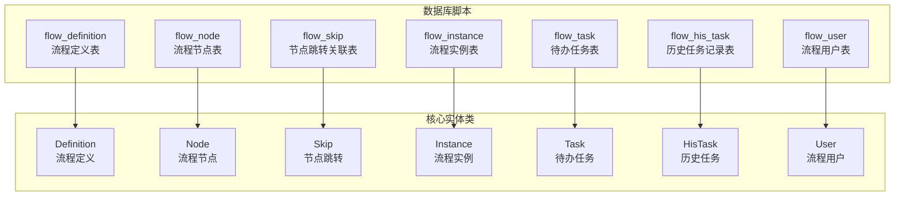
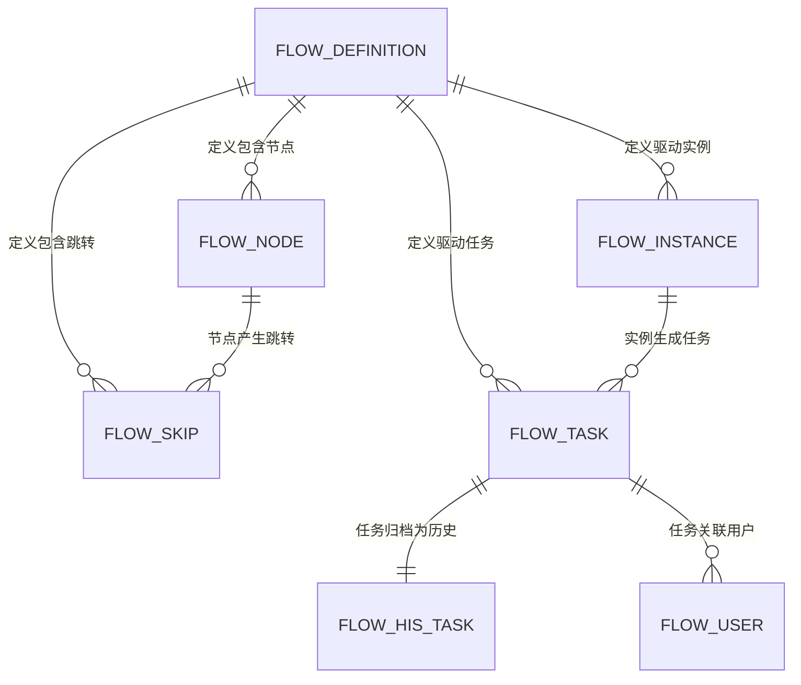
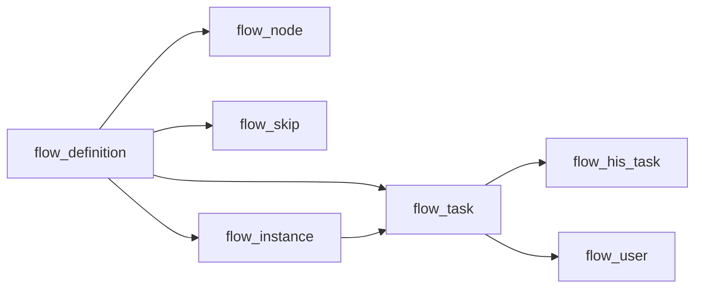

# 核心表结构设计

<cite>
**本文引用的文件**
- [warm-flow-all.sql](file://sql/mysql/warm-flow-all.sql)
- [Definition.java](file://warm-flow-core/src/main/java/org/dromara/warm/flow/core/entity/Definition.java)
- [Node.java](file://warm-flow-core/src/main/java/org/dromara/warm/flow/core/entity/Node.java)
- [Skip.java](file://warm-flow-core/src/main/java/org/dromara/warm/flow/core/entity/Skip.java)
- [Instance.java](file://warm-flow-core/src/main/java/org/dromara/warm/flow/core/entity/Instance.java)
- [Task.java](file://warm-flow-core/src/main/java/org/dromara/warm/flow/core/entity/Task.java)
- [HisTask.java](file://warm-flow-core/src/main/java/org/dromara/warm/flow/core/entity/HisTask.java)
- [User.java](file://warm-flow-core/src/main/java/org/dromara/warm/flow/core/entity/User.java)
</cite>

## 目录
1. [引言](#引言)
2. [项目结构](#项目结构)
3. [核心组件](#核心组件)
4. [架构总览](#架构总览)
5. [详细组件分析](#详细组件分析)
6. [依赖分析](#依赖分析)
7. [性能考虑](#性能考虑)
8. [故障排查指南](#故障排查指南)
9. [结论](#结论)
10. [附录](#附录)

## 引言
本技术文档围绕 Warm-Flow 的核心表结构进行系统化梳理，覆盖以下 7 张核心表：flow_definition（流程定义表）、flow_node（流程节点表）、flow_skip（节点跳转关联表）、flow_instance（流程实例表）、flow_task（待办任务表）、flow_his_task（历史任务记录表）、flow_user（流程用户表）。文档从字段设计原理、业务含义、数据类型与约束、默认值、表间关联与外键设计、数据完整性保障机制、实体类映射关系、字段命名规范与数据验证规则等方面展开，帮助开发者与运维人员快速理解并高效使用该核心数据层。

## 项目结构
Warm-Flow 的核心表结构由统一的 SQL 初始化脚本定义，并在多套 ORM 实现中保持一致映射。核心表分布于初始化脚本中，实体类位于 core 模块的 entity 包下，用于定义各表的 Java 字段与方法签名，确保业务层与数据层的一致性。

图表来源
- [warm-flow-all.sql:1-160](file://sql/mysql/warm-flow-all.sql#L1-L160)
- [Definition.java:24-196](file://warm-flow-core/src/main/java/org/dromara/warm/flow/core/entity/Definition.java#L24-L196)
- [Node.java:25-162](file://warm-flow-core/src/main/java/org/dromara/warm/flow/core/entity/Node.java#L25-L162)
- [Skip.java:23-128](file://warm-flow-core/src/main/java/org/dromara/warm/flow/core/entity/Skip.java#L23-L128)
- [Instance.java:24-166](file://warm-flow-core/src/main/java/org/dromara/warm/flow/core/entity/Instance.java#L24-L166)
- [Task.java:22-136](file://warm-flow-core/src/main/java/org/dromara/warm/flow/core/entity/Task.java#L22-L136)
- [HisTask.java:25-164](file://warm-flow-core/src/main/java/org/dromara/warm/flow/core/entity/HisTask.java#L25-L164)
- [User.java:21-95](file://warm-flow-core/src/main/java/org/dromara/warm/flow/core/entity/User.java#L21-L95)

章节来源
- [warm-flow-all.sql:1-160](file://sql/mysql/warm-flow-all.sql#L1-L160)

## 核心组件
本节对 7 张核心表进行逐项解析，涵盖字段设计原理、业务含义、数据类型与约束、默认值、索引与唯一性约束等。

- flow_definition（流程定义表）
  - 主键：id（bigint，NOT NULL）
  - 关键字段：
    - flow_code（varchar(40)，NOT NULL，流程编码）
    - flow_name（varchar(100)，NOT NULL，流程名称）
    - model_value（varchar(40)，NOT NULL，默认 CLASSICS，设计器模型）
    - category（varchar(100)，可空，流程类别）
    - version（varchar(20)，NOT NULL，流程版本）
    - is_publish（tinyint(1)，NOT NULL，默认 0，是否发布）
    - form_custom（char(1)，默认 'N'，是否自定义表单）
    - form_path（varchar(100)，可空，表单路径）
    - activity_status（tinyint(1)，NOT NULL，默认 1，激活状态）
    - listener_type/listener_path（可空，监听器配置）
    - ext（varchar(500)，可空，业务详情 JSON 扩展）
    - 租户与审计：tenant_id、create_time、create_by、update_time、update_by、del_flag
  - 约束与索引：主键 id；无显式外键约束（通过业务逻辑与实体类约定关联）

- flow_node（流程节点表）
  - 主键：id（bigint，NOT NULL）
  - 关键字段：
    - node_type（tinyint(1)，NOT NULL，节点类型）
    - definition_id（bigint，NOT NULL，关联流程定义）
    - node_code（varchar(100)，NOT NULL，节点编码）
    - node_name（varchar(100)，可空，节点名称）
    - permission_flag（varchar(200)，可空，权限标识串）
    - node_ratio（varchar(200)，可空，签署比例）
    - coordinate（varchar(100)，可空，坐标）
    - any_node_skip（varchar(100)，可空，任意节点跳转）
    - listener_type/listener_path（可空，监听器配置）
    - form_custom/form_path（可空，节点级表单）
    - version（varchar(20)，NOT NULL，版本）
    - ext（text，节点扩展属性）
    - 租户与审计：tenant_id、create_time、create_by、update_time、update_by、del_flag

- flow_skip（节点跳转关联表）
  - 主键：id（bigint，NOT NULL）
  - 关键字段：
    - definition_id（bigint，NOT NULL，关联流程定义）
    - now_node_code（varchar(100)，NOT NULL，当前节点编码）
    - now_node_type（tinyint(1)，可空，当前节点类型）
    - next_node_code（varchar(100)，NOT NULL，下一节点编码）
    - next_node_type（tinyint(1)，可空，下一节点类型）
    - skip_name（varchar(100)，可空，跳转名称）
    - skip_type（varchar(40)，可空，跳转类型）
    - skip_condition（varchar(200)，可空，跳转条件）
    - coordinate（varchar(100)，可空，坐标）
    - 审计：create_time、create_by、update_time、update_by、del_flag、tenant_id

- flow_instance（流程实例表）
  - 主键：id（bigint，NOT NULL）
  - 关键字段：
    - definition_id（bigint，NOT NULL，关联流程定义）
    - business_id（varchar(40)，NOT NULL，业务 ID）
    - node_type/node_code/node_name（节点信息）
    - variable（text，流程变量）
    - flow_status（varchar(20)，NOT NULL，流程状态）
    - activity_status（tinyint(1)，NOT NULL，默认 1，激活状态）
    - def_json（text，流程定义 JSON）
    - ext（varchar(500)，可空，扩展字段）
    - 审计：create_time、create_by、update_time、update_by、del_flag、tenant_id

- flow_task（待办任务表）
  - 主键：id（bigint，NOT NULL）
  - 关键字段：
    - definition_id（bigint，NOT NULL，关联流程定义）
    - instance_id（bigint，NOT NULL，关联流程实例）
    - node_code/node_name/node_type（节点信息）
    - flow_status（varchar(20)，NOT NULL，流程状态）
    - form_custom/form_path（可空，表单）
    - 审计：create_time、create_by、update_time、update_by、del_flag、tenant_id

- flow_his_task（历史任务记录表）
  - 主键：id（bigint(20)，NOT NULL）
  - 关键字段：
    - definition_id（bigint(20)，NOT NULL，关联流程定义）
    - instance_id（bigint(20)，NOT NULL，关联流程实例）
    - task_id（bigint(20)，NOT NULL，关联待办任务）
    - node_code/node_name/node_type（起点节点）
    - target_node_code/target_node_name（目标节点）
    - approver（varchar(40)，可空，审批人）
    - cooperate_type（tinyint(1)，NOT NULL，默认 0，协作方式）
    - collaborator（varchar(500)，可空，协作人）
    - skip_type（varchar(10)，NOT NULL，流转类型）
    - flow_status（varchar(20)，NOT NULL，流程状态）
    - form_custom/form_path（可空，表单）
    - message（varchar(500)，可空，审批意见）
    - variable/ext（text，任务变量与业务详情）
    - 时间：create_time（任务开始时间）、update_time（审批完成时间）
    - 审计：del_flag、tenant_id

- flow_user（流程用户表）
  - 主键：id（bigint，NOT NULL）
  - 关键字段：
    - type（char(1)，NOT NULL，人员类型）
    - processed_by（varchar(80)，可空，权限人）
    - associated（bigint，NOT NULL，任务表 id）
    - 审计：create_time、create_by、update_time、update_by、del_flag、tenant_id
  - 索引：user_processed_type(processed_by, type)、user_associated(associated)

章节来源
- [warm-flow-all.sql:1-160](file://sql/mysql/warm-flow-all.sql#L1-L160)

## 架构总览
下图展示核心表之间的关联关系与外键设计思路。注意：脚本中未声明显式外键约束，实际约束通过业务层与实体类约定实现。

图表来源
- [warm-flow-all.sql:1-160](file://sql/mysql/warm-flow-all.sql#L1-L160)

## 详细组件分析

### 表 flow_definition（流程定义表）
- 字段设计要点
  - 编码与名称：flow_code、flow_name，唯一性由业务控制，便于检索与展示
  - 模型与版本：model_value、version，支持多模型与版本演进
  - 发布与激活：is_publish、activity_status，控制流程可用性与运行状态
  - 表单与扩展：form_custom、form_path、ext，支持灵活的表单与业务扩展
  - 审计与租户：create/update/tenant/del_flag，统一治理
- 业务含义
  - 描述一个流程模板的元信息，决定节点布局、跳转规则与运行策略
- 数据完整性
  - 通过业务层校验与实体类约束保证字段一致性
- 实体类映射
  - 对应 Definition 接口，提供 getter/setter 与复制方法

章节来源
- [warm-flow-all.sql:1-23](file://sql/mysql/warm-flow-all.sql#L1-L23)
- [Definition.java:24-196](file://warm-flow-core/src/main/java/org/dromara/warm/flow/core/entity/Definition.java#L24-L196)

### 表 flow_node（流程节点表）
- 字段设计要点
  - 节点类型：node_type，区分开始/中间/结束/网关
  - 关联定义：definition_id，建立节点与定义的归属关系
  - 节点标识：node_code/name，唯一性由业务控制
  - 权限与表单：permission_flag、node_ratio、form_custom/form_path
  - 扩展属性：ext，支持复杂节点行为
- 业务含义
  - 描述流程图中的具体节点及其行为配置
- 数据完整性
  - 通过实体类与业务层约束保证 definition_id 与 node_code 的一致性

章节来源
- [warm-flow-all.sql:25-49](file://sql/mysql/warm-flow-all.sql#L25-L49)
- [Node.java:25-162](file://warm-flow-core/src/main/java/org/dromara/warm/flow/core/entity/Node.java#L25-L162)

### 表 flow_skip（节点跳转关联表）
- 字段设计要点
  - 当前与下一节点：now_node_code/next_node_code，配合类型字段描述跳转关系
  - 跳转条件：skip_condition，支持动态决策
  - 跳转类型：skip_type，如通过/退回等
  - 坐标与审计：coordinate、create/update/tenant/del_flag
- 业务含义
  - 描述节点间的流转关系与条件，支撑流程路由决策
- 数据完整性
  - 通过实体类与业务层约束保证编码与类型的匹配

章节来源
- [warm-flow-all.sql:51-70](file://sql/mysql/warm-flow-all.sql#L51-L70)
- [Skip.java:23-128](file://warm-flow-core/src/main/java/org/dromara/warm/flow/core/entity/Skip.java#L23-L128)

### 表 flow_instance（流程实例表）
- 字段设计要点
  - 关联定义与业务：definition_id、business_id，绑定业务上下文
  - 节点定位：node_code/name/type，指示当前节点
  - 流程状态：flow_status，统一的状态机管理
  - 变量与定义：variable、def_json，支持动态参数与可视化定义
  - 激活状态：activity_status，支持暂停/恢复
- 业务含义
  - 记录一次业务流程的实际执行过程
- 数据完整性
  - 通过实体类与业务层约束保证状态与节点信息一致性

章节来源
- [warm-flow-all.sql:72-92](file://sql/mysql/warm-flow-all.sql#L72-L92)
- [Instance.java:24-166](file://warm-flow-core/src/main/java/org/dromara/warm/flow/core/entity/Instance.java#L24-L166)

### 表 flow_task（待办任务表）
- 字段设计要点
  - 关联实例与定义：instance_id、definition_id
  - 节点信息：node_code/name/type，定位任务来源
  - 流程状态：flow_status，与实例状态保持一致
  - 表单与审计：form_custom/form_path、create/update/tenant/del_flag
- 业务含义
  - 记录当前仍需处理的待办事项
- 数据完整性
  - 通过实体类与业务层约束保证关联关系正确

章节来源
- [warm-flow-all.sql:94-112](file://sql/mysql/warm-flow-all.sql#L94-L112)
- [Task.java:22-136](file://warm-flow-core/src/main/java/org/dromara/warm/flow/core/entity/Task.java#L22-L136)

### 表 flow_his_task（历史任务记录表）
- 字段设计要点
  - 关联关系：definition_id、instance_id、task_id，完整追溯任务生命周期
  - 起止节点：node_code/name/type、target_node_code/name，记录流转轨迹
  - 协作与审批：cooperate_type/approver/collaborator/skip_type/message
  - 变量与扩展：variable、ext，保留审批时态数据
  - 时间戳：create_time（开始）、update_time（完成）
- 业务含义
  - 归档与审计，支撑合规与报表需求
- 数据完整性
  - 通过实体类与业务层约束保证字段一致性

章节来源
- [warm-flow-all.sql:114-140](file://sql/mysql/warm-flow-all.sql#L114-L140)
- [HisTask.java:25-164](file://warm-flow-core/src/main/java/org/dromara/warm/flow/core/entity/HisTask.java#L25-L164)

### 表 flow_user（流程用户表）
- 字段设计要点
  - 人员类型：type，区分审批人、转办人、委托人等
  - 权限人：processed_by，承载权限主体
  - 关联任务：associated，指向 flow_task.id
  - 审计与租户：create/update/tenant/del_flag
  - 索引：user_processed_type、user_associated，优化查询
- 业务含义
  - 细粒度权限与协作关系的载体
- 数据完整性
  - 通过索引与实体类约束提升查询效率与一致性

章节来源
- [warm-flow-all.sql:143-158](file://sql/mysql/warm-flow-all.sql#L143-L158)
- [User.java:21-95](file://warm-flow-core/src/main/java/org/dromara/warm/flow/core/entity/User.java#L21-L95)

## 依赖分析
- 表间依赖关系
  - flow_node 依赖 flow_definition（definition_id）
  - flow_skip 依赖 flow_definition（definition_id），并以节点编码描述跳转
  - flow_instance 依赖 flow_definition（definition_id）
  - flow_task 依赖 flow_definition（definition_id）与 flow_instance（instance_id）
  - flow_his_task 依赖 flow_definition、flow_instance、flow_task
  - flow_user 依赖 flow_task（associated）
- 外键设计
  - 脚本中未声明显式外键约束，实际约束通过业务层与实体类约定实现
- 索引与性能
  - flow_user 建有复合索引与单列索引，有利于按权限人与任务关联查询

图表来源
- [warm-flow-all.sql:1-160](file://sql/mysql/warm-flow-all.sql#L1-L160)

章节来源
- [warm-flow-all.sql:1-160](file://sql/mysql/warm-flow-all.sql#L1-L160)

## 性能考虑
- 索引策略
  - flow_user 的 user_processed_type 与 user_associated 索引有助于权限查询与任务关联查询
- 查询模式
  - 建议围绕 definition_id、business_id、instance_id、task_id 等关键字段构建查询计划
- 数据分区与归档
  - 历史表（flow_his_task）建议按时间或业务维度进行归档，降低热数据压力
- 并发与事务
  - 在高并发场景下，建议对状态字段（flow_status、activity_status）采用乐观锁或状态机控制，避免竞态

## 故障排查指南
- 常见问题
  - 关联缺失：当 definition_id 或 instance_id 为空时，可能导致任务无法定位到实例
  - 状态不一致：flow_status 与节点类型不匹配可能引发流程异常
  - 权限错误：flow_user 中 processed_by 与 associated 不匹配会导致权限失效
- 排查步骤
  - 核对 flow_definition 与 flow_node 的版本与编码一致性
  - 校验 flow_skip 的跳转条件与节点类型
  - 检查 flow_task 与 flow_his_task 的 task_id 关联是否正确
  - 验证 flow_user 的 type 与 associated 是否符合预期
- 建议的日志与监控
  - 记录关键状态变更（flow_status、activity_status）
  - 监控 flow_user 的权限命中率与查询延迟

## 结论
Warm-Flow 的核心表结构以“流程定义—节点—跳转—实例—任务—历史—用户”为主线，通过清晰的字段设计与严格的业务约束，实现了流程的可视化建模、动态流转与可审计的执行闭环。尽管脚本未声明显式外键，但通过实体类与业务层的强约束，同样能够保障数据完整性。建议在生产环境中结合索引策略、状态机与归档机制，持续优化性能与稳定性。

## 附录
- 字段命名规范
  - 采用小写下划线风格（如 flow_code、node_type），与 Java 字段映射保持一致
- 数据验证规则
  - 必填字段（NOT NULL）：流程编码、流程名称、版本、节点类型、业务 ID、流程状态等
  - 默认值：布尔/枚举类字段（如 is_publish、activity_status、form_custom）均设置合理默认值
  - 枚举与状态：通过业务枚举（如 NodeType、FlowStatus、UserType）统一管理取值范围
- 实体类映射关系
  - 各表与实体类一一对应，接口提供统一的审计与租户字段能力，便于跨模块复用