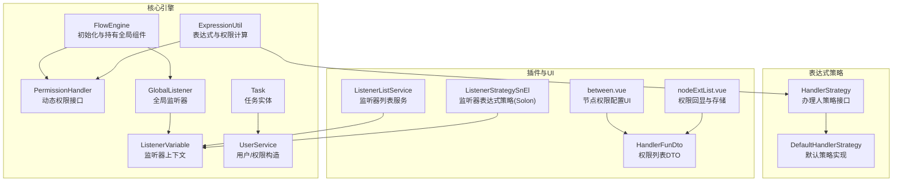
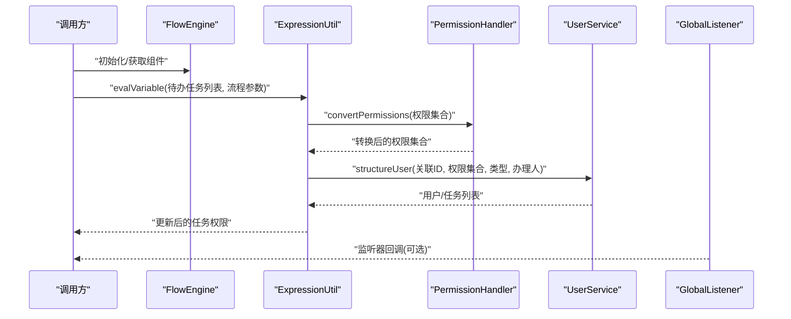
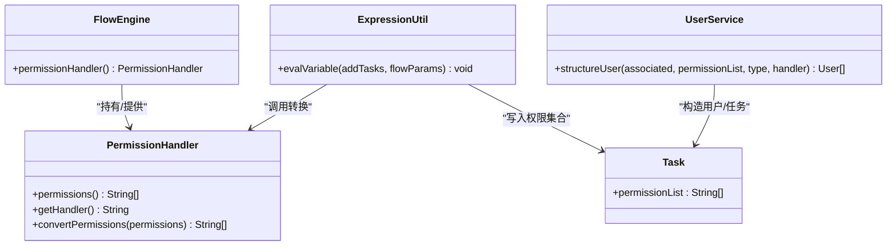
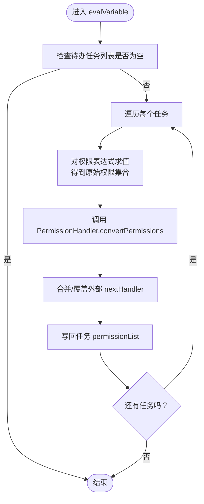
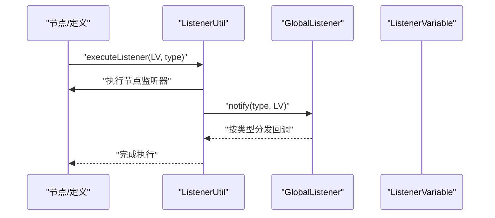
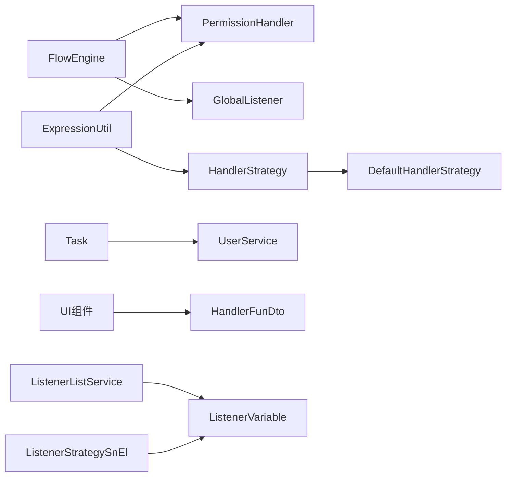

# 动态权限分配

<cite>
**本文引用的文件**
- [PermissionHandler.java](file://warm-flow-core/src/main/java/org/dromara/warm/flow/core/handler/PermissionHandler.java)
- [FlowEngine.java](file://warm-flow-core/src/main/java/org/dromara/warm/flow/core/FlowEngine.java)
- [ExpressionUtil.java](file://warm-flow-core/src/main/java/org/dromara/warm/flow/core/utils/ExpressionUtil.java)
- [GlobalListener.java](file://warm-flow-core/src/main/java/org/dromara/warm/flow/core/listener/GlobalListener.java)
- [Listener.java](file://warm-flow-core/src/main/java/org/dromara/warm/flow/core/listener/Listener.java)
- [ListenerVariable.java](file://warm-flow-core/src/main/java/org/dromara/warm/flow/core/listener/ListenerVariable.java)
- [Task.java](file://warm-flow-core/src/main/java/org/dromara/warm/flow/core/entity/Task.java)
- [UserService.java](file://warm-flow-core/src/main/java/org/dromara/warm/flow/core/service/UserService.java)
- [TaskServiceImpl.java](file://warm-flow-core/src/main/java/org/dromara/warm/flow/core/service/impl/TaskServiceImpl.java)
- [HandlerStrategy.java](file://warm-flow-core/src/main/java/org/dromara/warm/flow/core/strategy/HandlerStrategy.java)
- [DefaultHandlerStrategy.java](file://warm-flow-core/src/main/java/org/dromara/warm/flow/core/handler/DefaultHandlerStrategy.java)
- [ListenerUtil.java](file://warm-flow-core/src/main/java/org/dromara/warm/flow/core/utils/ListenerUtil.java)
- [warm-flow_1.3.4.sql](file://sql/mysql/v1-upgrade/warm-flow_1.3.4.sql)
- [warm-flow_1.3.7.sql](file://sql/mysql/v1-upgrade/warm-flow_1.3.7.sql)
- [warm-flow_1.8.4.sql](file://sql/mysql/v1-upgrade/warm-flow_1.8.4.sql)
- [between.vue](file://warm-flow-ui/src/components/design/common/vue/between.vue)
- [nodeExtList.vue](file://warm-flow-ui/src/components/design/common/vue/nodeExtList.vue)
- [HandlerFunDto.java](file://warm-flow-plugin/warm-flow-plugin-ui/warm-flow-plugin-ui-core/src/main/java/org/dromara/warm/flow/ui/dto/HandlerFunDto.java)
- [ListenerListService.java](file://warm-flow-plugin/warm-flow-plugin-ui/warm-flow-plugin-ui-core/src/main/java/org/dromara/warm/flow/ui/service/ListenerListService.java)
- [ListenerStrategySnEl.java](file://warm-flow-plugin/warm-flow-plugin-modes/warm-flow-plugin-modes-solon/src/main/java/org/dromara/warm/plugin/modes/solon/expression/ListenerStrategySnEl.java)
</cite>

## 目录
1. [简介](#简介)
2. [项目结构](#项目结构)
3. [核心组件](#核心组件)
4. [架构总览](#架构总览)
5. [详细组件分析](#详细组件分析)
6. [依赖分析](#依赖分析)
7. [性能考虑](#性能考虑)
8. [故障排查指南](#故障排查指南)
9. [结论](#结论)
10. [附录](#附录)

## 简介
本技术文档围绕 Warm-Flow 的动态权限分配能力展开，系统性阐述运行时权限计算、权限变更响应与实时更新机制。重点解析 PermissionHandler 接口在动态权限中的职责边界与实现要点，包括权限集合的动态生成、权限转换策略、与监听器系统的集成方式。同时覆盖全局监听器与节点监听器在权限控制中的应用，包括权限验证时机、权限变更通知、权限缓存管理等主题。文档还提供组织架构变化、角色调整、特殊业务场景等实际配置案例与实践建议，并给出性能优化与故障排查指引。

## 项目结构
Warm-Flow 的动态权限相关代码主要分布在以下模块：
- 核心引擎与工具：FlowEngine、ExpressionUtil、PermissionHandler、Listener 系列、Task、UserService
- 表达式策略：HandlerStrategy、DefaultHandlerStrategy
- 插件与UI：UI 组件与 DTO、监听器策略扩展（Solon 模式）

图表来源
- [FlowEngine.java:188-222](file://warm-flow-core/src/main/java/org/dromara/warm/flow/core/FlowEngine.java#L188-L222)
- [PermissionHandler.java:30-55](file://warm-flow-core/src/main/java/org/dromara/warm/flow/core/handler/PermissionHandler.java#L30-L55)
- [ExpressionUtil.java:81-106](file://warm-flow-core/src/main/java/org/dromara/warm/flow/core/utils/ExpressionUtil.java#L81-L106)
- [GlobalListener.java:26-80](file://warm-flow-core/src/main/java/org/dromara/warm/flow/core/listener/GlobalListener.java#L26-L80)
- [ListenerVariable.java:32-213](file://warm-flow-core/src/main/java/org/dromara/warm/flow/core/listener/ListenerVariable.java#L32-L213)
- [Task.java:27-135](file://warm-flow-core/src/main/java/org/dromara/warm/flow/core/entity/Task.java#L27-L135)
- [UserService.java:122-165](file://warm-flow-core/src/main/java/org/dromara/warm/flow/core/service/UserService.java#L122-L165)
- [HandlerStrategy.java:29-60](file://warm-flow-core/src/main/java/org/dromara/warm/flow/core/strategy/HandlerStrategy.java#L29-L60)
- [DefaultHandlerStrategy.java](file://warm-flow-core/src/main/java/org/dromara/warm/flow/core/handler/DefaultHandlerStrategy.java)
- [between.vue:121-138](file://warm-flow-ui/src/components/design/common/vue/between.vue#L121-L138)
- [nodeExtList.vue:149-175](file://warm-flow-ui/src/components/design/common/vue/nodeExtList.vue#L149-L175)
- [HandlerFunDto.java:30-54](file://warm-flow-plugin/warm-flow-plugin-ui/warm-flow-plugin-ui-core/src/main/java/org/dromara/warm/flow/ui/dto/HandlerFunDto.java#L30-L54)
- [ListenerListService.java:27-35](file://warm-flow-plugin/warm-flow-plugin-ui/warm-flow-plugin-ui-core/src/main/java/org/dromara/warm/flow/ui/service/ListenerListService.java#L27-L35)
- [ListenerStrategySnEl.java:28-41](file://warm-flow-plugin/warm-flow-plugin-modes/warm-flow-plugin-modes-solon/src/main/java/org/dromara/warm/plugin/modes/solon/expression/ListenerStrategySnEl.java#L28-L41)

章节来源
- [FlowEngine.java:188-222](file://warm-flow-core/src/main/java/org/dromara/warm/flow/core/FlowEngine.java#L188-L222)
- [ExpressionUtil.java:81-106](file://warm-flow-core/src/main/java/org/dromara/warm/flow/core/utils/ExpressionUtil.java#L81-L106)

## 核心组件
- PermissionHandler：定义动态权限的两个关键输出——权限集合与当前办理人，并提供权限转换钩子，供运行时将角色/部门等抽象权限映射为具体用户ID。
- FlowEngine：负责初始化与持有 PermissionHandler、GlobalListener 等全局组件，提供统一访问入口。
- ExpressionUtil：在任务生成与流转过程中，对表达式进行求值，聚合权限集合，并调用 PermissionHandler.convertPermissions 进行转换。
- GlobalListener 与 Listener：提供任务生命周期内的监听扩展点，支持在开始、分派、完成、创建等阶段对权限相关行为进行干预。
- Task 与 UserService：Task 持有 permissionList，UserService 提供基于权限集合构造用户/任务的能力。
- HandlerStrategy 与 DefaultHandlerStrategy：表达式策略体系的一部分，为权限表达式的解析与求值提供扩展点。

章节来源
- [PermissionHandler.java:30-55](file://warm-flow-core/src/main/java/org/dromara/warm/flow/core/handler/PermissionHandler.java#L30-L55)
- [FlowEngine.java:188-222](file://warm-flow-core/src/main/java/org/dromara/warm/flow/core/FlowEngine.java#L188-L222)
- [ExpressionUtil.java:81-106](file://warm-flow-core/src/main/java/org/dromara/warm/flow/core/utils/ExpressionUtil.java#L81-L106)
- [GlobalListener.java:26-80](file://warm-flow-core/src/main/java/org/dromara/warm/flow/core/listener/GlobalListener.java#L26-L80)
- [Task.java:120-122](file://warm-flow-core/src/main/java/org/dromara/warm/flow/core/entity/Task.java#L120-L122)
- [UserService.java:122-165](file://warm-flow-core/src/main/java/org/dromara/warm/flow/core/service/UserService.java#L122-L165)
- [HandlerStrategy.java:29-60](file://warm-flow-core/src/main/java/org/dromara/warm/flow/core/strategy/HandlerStrategy.java#L29-L60)

## 架构总览
动态权限分配贯穿“表达式解析—权限聚合—权限转换—任务构造—监听器通知”的完整链路。FlowEngine 在启动阶段注入 PermissionHandler 与 GlobalListener；在任务生成与流转时，ExpressionUtil 对节点配置的权限表达式进行求值，得到权限集合后交由 PermissionHandler.convertPermissions 完成最终映射；随后通过 UserService 构造用户与任务，结合监听器在关键节点进行通知与二次处理。

图表来源
- [FlowEngine.java:188-222](file://warm-flow-core/src/main/java/org/dromara/warm/flow/core/FlowEngine.java#L188-L222)
- [ExpressionUtil.java:81-106](file://warm-flow-core/src/main/java/org/dromara/warm/flow/core/utils/ExpressionUtil.java#L81-L106)
- [PermissionHandler.java:51-53](file://warm-flow-core/src/main/java/org/dromara/warm/flow/core/handler/PermissionHandler.java#L51-L53)
- [UserService.java:122-165](file://warm-flow-core/src/main/java/org/dromara/warm/flow/core/service/UserService.java#L122-L165)
- [GlobalListener.java:64-79](file://warm-flow-core/src/main/java/org/dromara/warm/flow/core/listener/GlobalListener.java#L64-L79)

## 详细组件分析

### PermissionHandler 接口与动态权限生成
- 权限集合动态生成：节点配置的权限表达式在运行时由 ExpressionUtil.evalVariable 求值，得到原始权限集合。
- 权限转换：PermissionHandler.convertPermissions 提供默认不转换的兜底实现，可在业务侧将其扩展为“角色→用户ID”、“部门→成员ID”等映射策略。
- 办理人标识：getHandler 返回当前任务的唯一办理人标识，用于入库与后续审计。

图表来源
- [PermissionHandler.java:30-55](file://warm-flow-core/src/main/java/org/dromara/warm/flow/core/handler/PermissionHandler.java#L30-L55)
- [FlowEngine.java:206-208](file://warm-flow-core/src/main/java/org/dromara/warm/flow/core/FlowEngine.java#L206-L208)
- [ExpressionUtil.java:81-106](file://warm-flow-core/src/main/java/org/dromara/warm/flow/core/utils/ExpressionUtil.java#L81-L106)
- [Task.java:120-122](file://warm-flow-core/src/main/java/org/dromara/warm/flow/core/entity/Task.java#L120-L122)
- [UserService.java:122-165](file://warm-flow-core/src/main/java/org/dromara/warm/flow/core/service/UserService.java#L122-L165)

章节来源
- [PermissionHandler.java:30-55](file://warm-flow-core/src/main/java/org/dromara/warm/flow/core/handler/PermissionHandler.java#L30-L55)
- [ExpressionUtil.java:81-106](file://warm-flow-core/src/main/java/org/dromara/warm/flow/core/utils/ExpressionUtil.java#L81-L106)

### 运行时权限计算与实时更新
- 表达式解析：ExpressionUtil.evalVariable 遍历待办任务，对每个任务的权限表达式进行求值，合并去重后得到权限集合。
- 权限转换：若存在 PermissionHandler 实例，则调用其 convertPermissions 对权限集合进行转换，保证最终入库的是用户级标识。
- 下一节点处理人追加：支持将外部传入的 nextHandler 与节点配置的权限集合进行追加或覆盖，满足灵活的下一节点指派需求。
- 任务构造：通过 UserService.structureUser 将权限集合转换为具体的用户/任务实体，供后续流程推进。

图表来源
- [ExpressionUtil.java:81-106](file://warm-flow-core/src/main/java/org/dromara/warm/flow/core/utils/ExpressionUtil.java#L81-L106)
- [ExpressionUtil.java:184-194](file://warm-flow-core/src/main/java/org/dromara/warm/flow/core/utils/ExpressionUtil.java#L184-L194)
- [PermissionHandler.java:51-53](file://warm-flow-core/src/main/java/org/dromara/warm/flow/core/handler/PermissionHandler.java#L51-L53)

章节来源
- [ExpressionUtil.java:81-106](file://warm-flow-core/src/main/java/org/dromara/warm/flow/core/utils/ExpressionUtil.java#L81-L106)
- [ExpressionUtil.java:184-194](file://warm-flow-core/src/main/java/org/dromara/warm/flow/core/utils/ExpressionUtil.java#L184-L194)

### 监听器系统与权限变更通知
- 监听器类型：Listener 定义了 start、assignment、finish、create 等事件类型；GlobalListener 提供全局通知入口。
- 执行顺序：ListenerUtil.execute 在节点/定义层分别执行监听器，并最终调用 GlobalListener.notify 进行全局通知。
- 权限变更时机：在任务创建（create）与分派（assignment）阶段，监听器可读取 ListenerVariable 上下文，对权限相关属性进行二次处理或记录。

图表来源
- [Listener.java:25-58](file://warm-flow-core/src/main/java/org/dromara/warm/flow/core/listener/Listener.java#L25-L58)
- [GlobalListener.java:64-79](file://warm-flow-core/src/main/java/org/dromara/warm/flow/core/listener/GlobalListener.java#L64-L79)
- [ListenerUtil.java:83-94](file://warm-flow-core/src/main/java/org/dromara/warm/flow/core/utils/ListenerUtil.java#L83-L94)
- [ListenerVariable.java:32-213](file://warm-flow-core/src/main/java/org/dromara/warm/flow/core/listener/ListenerVariable.java#L32-L213)

章节来源
- [ListenerUtil.java:83-94](file://warm-flow-core/src/main/java/org/dromara/warm/flow/core/utils/ListenerUtil.java#L83-L94)
- [GlobalListener.java:26-80](file://warm-flow-core/src/main/java/org/dromara/warm/flow/core/listener/GlobalListener.java#L26-L80)

### 表达式策略与默认实现
- HandlerStrategy：定义了表达式策略的注册与求值框架，afterEval 统一将求值结果转换为 List<String>。
- DefaultHandlerStrategy：作为默认策略实现，配合 ExpressionUtil.evalVariable 使用，确保表达式可被解析为权限集合。

章节来源
- [HandlerStrategy.java:29-60](file://warm-flow-core/src/main/java/org/dromara/warm/flow/core/strategy/HandlerStrategy.java#L29-L60)
- [DefaultHandlerStrategy.java](file://warm-flow-core/src/main/java/org/dromara/warm/flow/core/handler/DefaultHandlerStrategy.java)

### UI 配置与权限回显
- between.vue：提供“办理人设置”标签页，支持权限标识的增删改与入库主键输入，失焦时可触发权限名称回显。
- nodeExtList.vue：将表单中类型为5的字段（权限字段）转换为存储ID数组，并回显权限名称。
- HandlerFunDto：封装权限列表、总数以及存储ID与权限编码的提取函数，便于 UI 与后端交互。

章节来源
- [between.vue:121-138](file://warm-flow-ui/src/components/design/common/vue/between.vue#L121-L138)
- [between.vue:405-418](file://warm-flow-ui/src/components/design/common/vue/between.vue#L405-L418)
- [nodeExtList.vue:149-175](file://warm-flow-ui/src/components/design/common/vue/nodeExtList.vue#L149-L175)
- [HandlerFunDto.java:30-54](file://warm-flow-plugin/warm-flow-plugin-ui/warm-flow-plugin-ui-core/src/main/java/org/dromara/warm/flow/ui/dto/HandlerFunDto.java#L30-L54)

### 数据库迁移与历史兼容
- 1.3.4 版本：清理旧版表达式前缀，确保权限标识存储规范。
- 1.3.7 版本：将逗号分隔的权限标识统一为 @@ 分隔符，提升解析一致性。
- 1.8.4 版本：调整 node_ratio 字段长度与移除 handler_type/handler_path 字段，简化节点配置。

章节来源
- [warm-flow_1.3.4.sql:1-2](file://sql/mysql/v1-upgrade/warm-flow_1.3.4.sql#L1-L2)
- [warm-flow_1.3.7.sql:1](file://sql/mysql/v1-upgrade/warm-flow_1.3.7.sql#L1)
- [warm-flow_1.8.4.sql:1-3](file://sql/mysql/v1-upgrade/warm-flow_1.8.4.sql#L1-L3)

## 依赖分析
- 组件耦合与内聚
  - FlowEngine 作为门面，集中持有 PermissionHandler 与 GlobalListener，降低上层耦合度。
  - ExpressionUtil 与 HandlerStrategy 解耦表达式解析与权限转换，便于扩展新策略。
  - Task 与 UserService 通过 permissionList 与 structureUser 形成清晰的数据通道。
- 外部依赖与集成点
  - 监听器策略扩展（如 Solon 的 ListenerStrategySnEl）通过 SPI 或配置注入，增强表达式能力。
  - UI 层通过 DTO 与服务接口对接，形成前后端一致的权限数据契约。

图表来源
- [FlowEngine.java:188-222](file://warm-flow-core/src/main/java/org/dromara/warm/flow/core/FlowEngine.java#L188-L222)
- [ExpressionUtil.java:81-106](file://warm-flow-core/src/main/java/org/dromara/warm/flow/core/utils/ExpressionUtil.java#L81-L106)
- [HandlerStrategy.java:34-39](file://warm-flow-core/src/main/java/org/dromara/warm/flow/core/strategy/HandlerStrategy.java#L34-L39)
- [between.vue:121-138](file://warm-flow-ui/src/components/design/common/vue/between.vue#L121-L138)
- [nodeExtList.vue:149-175](file://warm-flow-ui/src/components/design/common/vue/nodeExtList.vue#L149-L175)
- [HandlerFunDto.java:30-54](file://warm-flow-plugin/warm-flow-plugin-ui/warm-flow-plugin-ui-core/src/main/java/org/dromara/warm/flow/ui/dto/HandlerFunDto.java#L30-L54)
- [ListenerListService.java:27-35](file://warm-flow-plugin/warm-flow-plugin-ui/warm-flow-plugin-ui-core/src/main/java/org/dromara/warm/flow/ui/service/ListenerListService.java#L27-L35)
- [ListenerStrategySnEl.java:28-41](file://warm-flow-plugin/warm-flow-plugin-modes/warm-flow-plugin-modes-solon/src/main/java/org/dromara/warm/plugin/modes/solon/expression/ListenerStrategySnEl.java#L28-L41)

## 性能考虑
- 表达式求值批量化：ExpressionUtil.evalVariable 对任务列表进行批量处理，避免重复解析相同表达式。
- 权限集合去重与合并：在聚合阶段使用去重与合并策略，减少冗余用户条目。
- 监听器执行成本控制：仅在必要阶段（create/assignment）触发监听器，避免过度干预。
- 缓存策略建议：对频繁查询的角色/部门映射结果进行本地缓存，降低 convertPermissions 的重复计算成本。
- 数据库层面：遵循迁移脚本规范，确保权限标识存储格式统一，减少解析与转换开销。

## 故障排查指南
- 权限未生效
  - 检查节点权限表达式是否正确，确认 ExpressionUtil.evalVariable 是否被调用。
  - 确认 PermissionHandler 是否已初始化且 convertPermissions 返回有效结果。
  - 核对 UI 配置中权限标识是否正确保存为 @@ 分隔格式。
- 办理人缺失
  - 核查 FlowParams 中的 handler 是否为空，TaskServiceImpl 在协作/会签场景会校验 handler。
- 监听器未触发
  - 检查 ListenerUtil.execute 的调用路径与 GlobalListener.notify 的实现。
  - 确认监听器类型与表达式策略（如 Solon 的 ListenerStrategySnEl）是否正确注册。
- 数据不一致
  - 检查数据库迁移脚本是否执行，特别是 1.3.7 与 1.8.4 版本的字段调整。

章节来源
- [ExpressionUtil.java:81-106](file://warm-flow-core/src/main/java/org/dromara/warm/flow/core/utils/ExpressionUtil.java#L81-L106)
- [TaskServiceImpl.java:751-753](file://warm-flow-core/src/main/java/org/dromara/warm/flow/core/service/impl/TaskServiceImpl.java#L751-L753)
- [ListenerUtil.java:83-94](file://warm-flow-core/src/main/java/org/dromara/warm/flow/core/utils/ListenerUtil.java#L83-L94)
- [warm-flow_1.3.7.sql:1](file://sql/mysql/v1-upgrade/warm-flow_1.3.7.sql#L1)
- [warm-flow_1.8.4.sql:1-3](file://sql/mysql/v1-upgrade/warm-flow_1.8.4.sql#L1-L3)

## 结论
Warm-Flow 的动态权限分配以 PermissionHandler 为核心，结合 ExpressionUtil 的表达式解析与转换、UserService 的用户构造、以及监听器系统的通知机制，形成了完整的运行时权限闭环。通过合理的策略扩展与 UI 配置，能够灵活应对组织架构变化、角色调整与特殊业务场景。建议在生产环境中强化缓存与监控，确保权限计算的准确性与时效性。

## 附录
- 实际配置案例（概念性说明）
  - 组织架构变化：当某部门被拆分或合并时，通过 PermissionHandler.convertPermissions 将部门ID映射为新的用户集合，ExpressionUtil.evalVariable 在任务生成时自动刷新。
  - 角色调整：角色权限发生变更时，在监听器（assignment/create）中读取 ListenerVariable，对任务权限进行二次校验或修正。
  - 特殊业务场景：在审批节点增加“或签/会签/票签”策略，结合 ExpressionUtil.nextHandle 控制下一节点处理人集合，满足复杂流程需求。