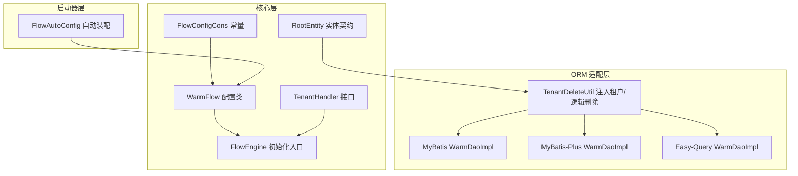
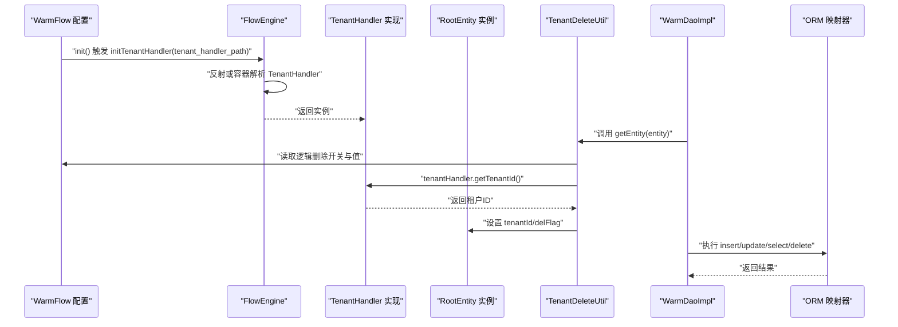
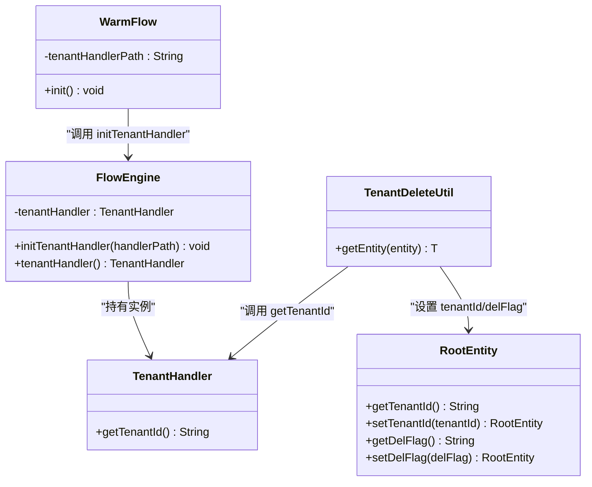
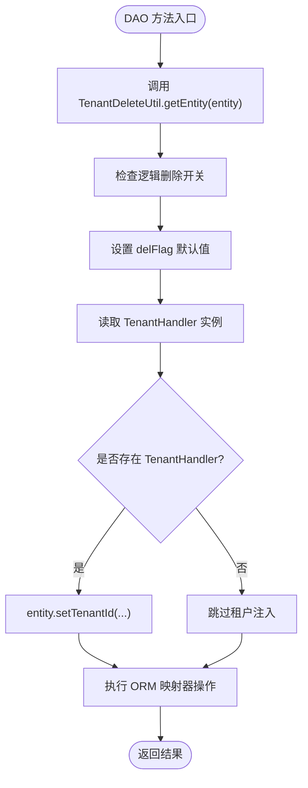
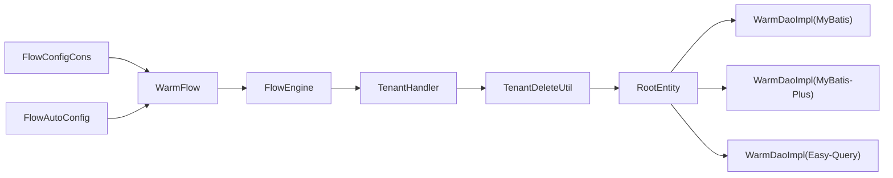

# 多租户支持

<cite>
**本文引用的文件**
- [warm-flow-core/src/main/java/org/dromara/warm/flow/core/handler/TenantHandler.java](file://warm-flow-core/src/main/java/org/dromara/warm/flow/core/handler/TenantHandler.java)
- [warm-flow-core/src/main/java/org/dromara/warm/flow/core/FlowEngine.java](file://warm-flow-core/src/main/java/org/dromara/warm/flow/core/FlowEngine.java)
- [warm-flow-core/src/main/java/org/dromara/warm/flow/core/config/WarmFlow.java](file://warm-flow-core/src/main/java/org/dromara/warm/flow/core/config/WarmFlow.java)
- [warm-flow-core/src/main/java/org/dromara/warm/flow/core/constant/FlowConfigCons.java](file://warm-flow-core/src/main/java/org/dromara/warm/flow/core/constant/FlowConfigCons.java)
- [warm-flow-core/src/main/java/org/dromara/warm/flow/core/entity/RootEntity.java](file://warm-flow-core/src/main/java/org/dromara/warm/flow/core/entity/RootEntity.java)
- [warm-flow-core/src/main/java/org/dromara/warm/flow/core/entity/Definition.java](file://warm-flow-core/src/main/java/org/dromara/warm/flow/core/entity/Definition.java)
- [warm-flow-core/src/main/java/org/dromara/warm/flow/core/entity/Instance.java](file://warm-flow-core/src/main/java/org/dromara/warm/flow/core/entity/Instance.java)
- [warm-flow-orm/warm-flow-mybatis/warm-flow-mybatis-core/src/main/java/org/dromara/warm/flow/orm/utils/TenantDeleteUtil.java](file://warm-flow-orm/warm-flow-mybatis/warm-flow-mybatis-core/src/main/java/org/dromara/warm/flow/orm/utils/TenantDeleteUtil.java)
- [warm-flow-orm/warm-flow-mybatis/warm-flow-mybatis-core/src/main/java/org/dromara/warm/flow/orm/dao/WarmDaoImpl.java](file://warm-flow-orm/warm-flow-mybatis/warm-flow-mybatis-core/src/main/java/org/dromara/warm/flow/orm/dao/WarmDaoImpl.java)
- [warm-flow-orm/warm-flow-mybatis-plus/warm-flow-mybatis-plus-core/src/main/java/org/dromara/warm/flow/orm/dao/WarmDaoImpl.java](file://warm-flow-orm/warm-flow-mybatis-plus/warm-flow-mybatis-plus-core/src/main/java/org/dromara/warm/flow/orm/dao/WarmDaoImpl.java)
- [warm-flow-orm/warm-flow-easy-query/warm-flow-easy-query-core/src/main/java/org/dromara/warm/flow/orm/dao/WarmDaoImpl.java](file://warm-flow-orm/warm-flow-easy-query/warm-flow-easy-query-core/src/main/java/org/dromara/warm/flow/orm/dao/WarmDaoImpl.java)
- [warm-flow-orm/warm-flow-mybatis-plus/warm-flow-mybatis-plus-core/src/main/java/org/dromara/warm/flow/orm/dao/FlowDefinitionDaoImpl.java](file://warm-flow-orm/warm-flow-mybatis-plus/warm-flow-mybatis-plus-core/src/main/java/org/dromara/warm/flow/orm/dao/FlowDefinitionDaoImpl.java)
- [warm-flow-orm/warm-flow-mybatis-plus/warm-flow-mybatis-plus-sb-starter/src/main/java/org/dromara/warm/flow/spring/boot/config/FlowAutoConfig.java](file://warm-flow-orm/warm-flow-mybatis-plus/warm-flow-mybatis-plus-sb-starter/src/main/java/org/dromara/warm/flow/spring/boot/config/FlowAutoConfig.java)
</cite>

## 目录
1. [引言](#引言)
2. [项目结构](#项目结构)
3. [核心组件](#核心组件)
4. [架构总览](#架构总览)
5. [详细组件分析](#详细组件分析)
6. [依赖分析](#依赖分析)
7. [性能考虑](#性能考虑)
8. [故障排查指南](#故障排查指南)
9. [结论](#结论)
10. [附录](#附录)

## 引言
本文件面向 Warm-Flow 的多租户支持能力，系统性阐述其架构设计与实现机制，覆盖租户隔离策略、数据安全保护、资源管理等关键方面；详解 TenantHandler 接口的职责、初始化与应用流程；对比 MyBatis、MyBatis-Plus、Easy-Query 三种 ORM 适配的实现差异；并提供数据库设计、权限控制、性能优化等最佳实践与配置模板，帮助开发者快速集成与落地。

## 项目结构
Warm-Flow 将“多租户”能力拆分为三层：
- 核心层：定义租户接口、统一初始化入口、配置常量与实体契约
- ORM 适配层：在不同 ORM 中注入租户与逻辑删除条件
- 启动器层：在 Spring Boot/Solon 环境下完成自动装配与默认策略设置

图表来源
- [warm-flow-core/src/main/java/org/dromara/warm/flow/core/handler/TenantHandler.java:23-32](file://warm-flow-core/src/main/java/org/dromara/warm/flow/core/handler/TenantHandler.java#L23-L32)
- [warm-flow-core/src/main/java/org/dromara/warm/flow/core/FlowEngine.java:184-215](file://warm-flow-core/src/main/java/org/dromara/warm/flow/core/FlowEngine.java#L184-L215)
- [warm-flow-core/src/main/java/org/dromara/warm/flow/core/config/WarmFlow.java:78-81](file://warm-flow-core/src/main/java/org/dromara/warm/flow/core/config/WarmFlow.java#L78-L81)
- [warm-flow-core/src/main/java/org/dromara/warm/flow/core/constant/FlowConfigCons.java:56-58](file://warm-flow-core/src/main/java/org/dromara/warm/flow/core/constant/FlowConfigCons.java#L56-L58)
- [warm-flow-core/src/main/java/org/dromara/warm/flow/core/entity/RootEntity.java:56-59](file://warm-flow-core/src/main/java/org/dromara/warm/flow/core/entity/RootEntity.java#L56-L59)
- [warm-flow-orm/warm-flow-mybatis/warm-flow-mybatis-core/src/main/java/org/dromara/warm/flow/orm/utils/TenantDeleteUtil.java:39-50](file://warm-flow-orm/warm-flow-mybatis/warm-flow-mybatis-core/src/main/java/org/dromara/warm/flow/orm/utils/TenantDeleteUtil.java#L39-L50)
- [warm-flow-orm/warm-flow-mybatis/warm-flow-mybatis-core/src/main/java/org/dromara/warm/flow/orm/dao/WarmDaoImpl.java:48-114](file://warm-flow-orm/warm-flow-mybatis/warm-flow-mybatis-core/src/main/java/org/dromara/warm/flow/orm/dao/WarmDaoImpl.java#L48-L114)
- [warm-flow-orm/warm-flow-mybatis-plus/warm-flow-mybatis-plus-core/src/main/java/org/dromara/warm/flow/orm/dao/WarmDaoImpl.java:73-109](file://warm-flow-orm/warm-flow-mybatis-plus/warm-flow-mybatis-plus-core/src/main/java/org/dromara/warm/flow/orm/dao/WarmDaoImpl.java#L73-L109)
- [warm-flow-orm/warm-flow-easy-query/warm-flow-easy-query-core/src/main/java/org/dromara/warm/flow/orm/dao/WarmDaoImpl.java:77-97](file://warm-flow-orm/warm-flow-easy-query/warm-flow-easy-query-core/src/main/java/org/dromara/warm/flow/orm/dao/WarmDaoImpl.java#L77-L97)
- [warm-flow-orm/warm-flow-mybatis-plus/warm-flow-mybatis-plus-sb-starter/src/main/java/org/dromara/warm/flow/spring/boot/config/FlowAutoConfig.java:32-42](file://warm-flow-orm/warm-flow-mybatis-plus/warm-flow-mybatis-plus-sb-starter/src/main/java/org/dromara/warm/flow/spring/boot/config/FlowAutoConfig.java#L32-L42)

章节来源
- [warm-flow-core/src/main/java/org/dromara/warm/flow/core/handler/TenantHandler.java:23-32](file://warm-flow-core/src/main/java/org/dromara/warm/flow/core/handler/TenantHandler.java#L23-L32)
- [warm-flow-core/src/main/java/org/dromara/warm/flow/core/FlowEngine.java:184-215](file://warm-flow-core/src/main/java/org/dromara/warm/flow/core/FlowEngine.java#L184-L215)
- [warm-flow-core/src/main/java/org/dromara/warm/flow/core/config/WarmFlow.java:78-81](file://warm-flow-core/src/main/java/org/dromara/warm/flow/core/config/WarmFlow.java#L78-L81)
- [warm-flow-core/src/main/java/org/dromara/warm/flow/core/constant/FlowConfigCons.java:56-58](file://warm-flow-core/src/main/java/org/dromara/warm/flow/core/constant/FlowConfigCons.java#L56-L58)
- [warm-flow-core/src/main/java/org/dromara/warm/flow/core/entity/RootEntity.java:56-59](file://warm-flow-core/src/main/java/org/dromara/warm/flow/core/entity/RootEntity.java#L56-L59)
- [warm-flow-orm/warm-flow-mybatis/warm-flow-mybatis-core/src/main/java/org/dromara/warm/flow/orm/utils/TenantDeleteUtil.java:39-50](file://warm-flow-orm/warm-flow-mybatis/warm-flow-mybatis-core/src/main/java/org/dromara/warm/flow/orm/utils/TenantDeleteUtil.java#L39-L50)
- [warm-flow-orm/warm-flow-mybatis/warm-flow-mybatis-core/src/main/java/org/dromara/warm/flow/orm/dao/WarmDaoImpl.java:48-114](file://warm-flow-orm/warm-flow-mybatis/warm-flow-mybatis-core/src/main/java/org/dromara/warm/flow/orm/dao/WarmDaoImpl.java#L48-L114)
- [warm-flow-orm/warm-flow-mybatis-plus/warm-flow-mybatis-plus-core/src/main/java/org/dromara/warm/flow/orm/dao/WarmDaoImpl.java:73-109](file://warm-flow-orm/warm-flow-mybatis-plus/warm-flow-mybatis-plus-core/src/main/java/org/dromara/warm/flow/orm/dao/WarmDaoImpl.java#L73-L109)
- [warm-flow-orm/warm-flow-easy-query/warm-flow-easy-query-core/src/main/java/org/dromara/warm/flow/orm/dao/WarmDaoImpl.java:77-97](file://warm-flow-orm/warm-flow-easy-query/warm-flow-easy-query-core/src/main/java/org/dromara/warm/flow/orm/dao/WarmDaoImpl.java#L77-L97)
- [warm-flow-orm/warm-flow-mybatis-plus/warm-flow-mybatis-plus-sb-starter/src/main/java/org/dromara/warm/flow/spring/boot/config/FlowAutoConfig.java:32-42](file://warm-flow-orm/warm-flow-mybatis-plus/warm-flow-mybatis-plus-sb-starter/src/main/java/org/dromara/warm/flow/spring/boot/config/FlowAutoConfig.java#L32-L42)

## 核心组件
- TenantHandler 接口：定义租户标识获取方法，作为多租户能力的唯一入口
- FlowEngine：负责初始化并持有 TenantHandler 实例，提供全局访问
- WarmFlow：承载配置项，含 tenant_handler_path，并在 init() 中触发初始化
- FlowConfigCons：提供配置键常量，便于外部读取
- RootEntity：所有流程实体的共同契约，包含 getTenantId/setTenantId/delFlag 等字段
- TenantDeleteUtil：在 MyBatis/MyBatis-Plus 侧注入租户ID与逻辑删除标志
- WarmDaoImpl（各 ORM）：在 DAO 层统一拦截 save/select/update/delete 等操作，注入租户与逻辑删除条件

章节来源
- [warm-flow-core/src/main/java/org/dromara/warm/flow/core/handler/TenantHandler.java:23-32](file://warm-flow-core/src/main/java/org/dromara/warm/flow/core/handler/TenantHandler.java#L23-L32)
- [warm-flow-core/src/main/java/org/dromara/warm/flow/core/FlowEngine.java:184-215](file://warm-flow-core/src/main/java/org/dromara/warm/flow/core/FlowEngine.java#L184-L215)
- [warm-flow-core/src/main/java/org/dromara/warm/flow/core/config/WarmFlow.java:78-81](file://warm-flow-core/src/main/java/org/dromara/warm/flow/core/config/WarmFlow.java#L78-L81)
- [warm-flow-core/src/main/java/org/dromara/warm/flow/core/constant/FlowConfigCons.java:56-58](file://warm-flow-core/src/main/java/org/dromara/warm/flow/core/constant/FlowConfigCons.java#L56-L58)
- [warm-flow-core/src/main/java/org/dromara/warm/flow/core/entity/RootEntity.java:56-59](file://warm-flow-core/src/main/java/org/dromara/warm/flow/core/entity/RootEntity.java#L56-L59)
- [warm-flow-orm/warm-flow-mybatis/warm-flow-mybatis-core/src/main/java/org/dromara/warm/flow/orm/utils/TenantDeleteUtil.java:39-50](file://warm-flow-orm/warm-flow-mybatis/warm-flow-mybatis-core/src/main/java/org/dromara/warm/flow/orm/utils/TenantDeleteUtil.java#L39-L50)

## 架构总览
多租户贯穿“配置—初始化—实体契约—DAO 注入—ORM 执行”的完整链路，确保每次持久化均携带租户上下文，查询/分页/统计均自动附加租户过滤条件。

图表来源
- [warm-flow-core/src/main/java/org/dromara/warm/flow/core/config/WarmFlow.java:130-132](file://warm-flow-core/src/main/java/org/dromara/warm/flow/core/config/WarmFlow.java#L130-L132)
- [warm-flow-core/src/main/java/org/dromara/warm/flow/core/FlowEngine.java:184-215](file://warm-flow-core/src/main/java/org/dromara/warm/flow/core/FlowEngine.java#L184-L215)
- [warm-flow-core/src/main/java/org/dromara/warm/flow/core/handler/TenantHandler.java:23-32](file://warm-flow-core/src/main/java/org/dromara/warm/flow/core/handler/TenantHandler.java#L23-L32)
- [warm-flow-orm/warm-flow-mybatis/warm-flow-mybatis-core/src/main/java/org/dromara/warm/flow/orm/utils/TenantDeleteUtil.java:39-50](file://warm-flow-orm/warm-flow-mybatis/warm-flow-mybatis-core/src/main/java/org/dromara/warm/flow/orm/utils/TenantDeleteUtil.java#L39-L50)
- [warm-flow-orm/warm-flow-mybatis/warm-flow-mybatis-core/src/main/java/org/dromara/warm/flow/orm/dao/WarmDaoImpl.java:48-114](file://warm-flow-orm/warm-flow-mybatis/warm-flow-mybatis-core/src/main/java/org/dromara/warm/flow/orm/dao/WarmDaoImpl.java#L48-L114)

## 详细组件分析

### TenantHandler 接口与实现
- 职责：对外暴露 getTenantId()，由具体业务实现从当前请求上下文提取租户标识
- 初始化：WarmFlow.init() 读取 tenant_handler_path，FlowEngine.initTenantHandler() 优先通过类路径反射构造，其次从容器获取，最后回退到空实现
- 应用：TenantDeleteUtil 在实体构建阶段调用 getTenantId() 并写入 RootEntity

图表来源
- [warm-flow-core/src/main/java/org/dromara/warm/flow/core/handler/TenantHandler.java:23-32](file://warm-flow-core/src/main/java/org/dromara/warm/flow/core/handler/TenantHandler.java#L23-L32)
- [warm-flow-core/src/main/java/org/dromara/warm/flow/core/FlowEngine.java:184-215](file://warm-flow-core/src/main/java/org/dromara/warm/flow/core/FlowEngine.java#L184-L215)
- [warm-flow-core/src/main/java/org/dromara/warm/flow/core/config/WarmFlow.java:130-132](file://warm-flow-core/src/main/java/org/dromara/warm/flow/core/config/WarmFlow.java#L130-L132)
- [warm-flow-core/src/main/java/org/dromara/warm/flow/core/entity/RootEntity.java:56-59](file://warm-flow-core/src/main/java/org/dromara/warm/flow/core/entity/RootEntity.java#L56-L59)
- [warm-flow-orm/warm-flow-mybatis/warm-flow-mybatis-core/src/main/java/org/dromara/warm/flow/orm/utils/TenantDeleteUtil.java:39-50](file://warm-flow-orm/warm-flow-mybatis/warm-flow-mybatis-core/src/main/java/org/dromara/warm/flow/orm/utils/TenantDeleteUtil.java#L39-L50)

章节来源
- [warm-flow-core/src/main/java/org/dromara/warm/flow/core/handler/TenantHandler.java:23-32](file://warm-flow-core/src/main/java/org/dromara/warm/flow/core/handler/TenantHandler.java#L23-L32)
- [warm-flow-core/src/main/java/org/dromara/warm/flow/core/FlowEngine.java:184-215](file://warm-flow-core/src/main/java/org/dromara/warm/flow/core/FlowEngine.java#L184-L215)
- [warm-flow-core/src/main/java/org/dromara/warm/flow/core/config/WarmFlow.java:130-132](file://warm-flow-core/src/main/java/org/dromara/warm/flow/core/config/WarmFlow.java#L130-L132)
- [warm-flow-core/src/main/java/org/dromara/warm/flow/core/constant/FlowConfigCons.java:56-58](file://warm-flow-core/src/main/java/org/dromara/warm/flow/core/constant/FlowConfigCons.java#L56-L58)
- [warm-flow-core/src/main/java/org/dromara/warm/flow/core/entity/RootEntity.java:56-59](file://warm-flow-core/src/main/java/org/dromara/warm/flow/core/entity/RootEntity.java#L56-L59)
- [warm-flow-orm/warm-flow-mybatis/warm-flow-mybatis-core/src/main/java/org/dromara/warm/flow/orm/utils/TenantDeleteUtil.java:39-50](file://warm-flow-orm/warm-flow-mybatis/warm-flow-mybatis-core/src/main/java/org/dromara/warm/flow/orm/utils/TenantDeleteUtil.java#L39-L50)

### 实体契约与复制行为
- RootEntity 统一声明 tenantId 与 delFlag 字段，确保所有实体具备一致的多租户与逻辑删除能力
- Definition/Instance 等实体在 copy()/setTenantId() 等方法中复用 tenantId，保证复制/迁移场景的数据一致性

章节来源
- [warm-flow-core/src/main/java/org/dromara/warm/flow/core/entity/RootEntity.java:56-59](file://warm-flow-core/src/main/java/org/dromara/warm/flow/core/entity/RootEntity.java#L56-L59)
- [warm-flow-core/src/main/java/org/dromara/warm/flow/core/entity/Definition.java:177-194](file://warm-flow-core/src/main/java/org/dromara/warm/flow/core/entity/Definition.java#L177-L194)
- [warm-flow-core/src/main/java/org/dromara/warm/flow/core/entity/Instance.java:125-166](file://warm-flow-core/src/main/java/org/dromara/warm/flow/core/entity/Instance.java#L125-L166)

### ORM 适配与租户注入流程
- MyBatis 适配：WarmDaoImpl 在 select/save/update/delete 前后调用 TenantDeleteUtil.getEntity(entity)，自动注入 tenantId 与 delFlag
- MyBatis-Plus 适配：WarmDaoImpl 同样在 DAO 层统一注入；FlowAutoConfig 提供默认主键生成器与 MapperScan
- Easy-Query 适配：WarmDaoImpl 提供 queryable/deletable/updatable 等便捷入口，租户注入通过通用实体层完成

图表来源
- [warm-flow-orm/warm-flow-mybatis/warm-flow-mybatis-core/src/main/java/org/dromara/warm/flow/orm/dao/WarmDaoImpl.java:48-114](file://warm-flow-orm/warm-flow-mybatis/warm-flow-mybatis-core/src/main/java/org/dromara/warm/flow/orm/dao/WarmDaoImpl.java#L48-L114)
- [warm-flow-orm/warm-flow-mybatis-plus/warm-flow-mybatis-plus-core/src/main/java/org/dromara/warm/flow/orm/dao/WarmDaoImpl.java:73-109](file://warm-flow-orm/warm-flow-mybatis-plus/warm-flow-mybatis-plus-core/src/main/java/org/dromara/warm/flow/orm/dao/WarmDaoImpl.java#L73-L109)
- [warm-flow-orm/warm-flow-easy-query/warm-flow-easy-query-core/src/main/java/org/dromara/warm/flow/orm/dao/WarmDaoImpl.java:77-97](file://warm-flow-orm/warm-flow-easy-query/warm-flow-easy-query-core/src/main/java/org/dromara/warm/flow/orm/dao/WarmDaoImpl.java#L77-L97)
- [warm-flow-orm/warm-flow-mybatis/warm-flow-mybatis-core/src/main/java/org/dromara/warm/flow/orm/utils/TenantDeleteUtil.java:39-50](file://warm-flow-orm/warm-flow-mybatis/warm-flow-mybatis-core/src/main/java/org/dromara/warm/flow/orm/utils/TenantDeleteUtil.java#L39-L50)

章节来源
- [warm-flow-orm/warm-flow-mybatis/warm-flow-mybatis-core/src/main/java/org/dromara/warm/flow/orm/dao/WarmDaoImpl.java:48-114](file://warm-flow-orm/warm-flow-mybatis/warm-flow-mybatis-core/src/main/java/org/dromara/warm/flow/orm/dao/WarmDaoImpl.java#L48-L114)
- [warm-flow-orm/warm-flow-mybatis-plus/warm-flow-mybatis-plus-core/src/main/java/org/dromara/warm/flow/orm/dao/WarmDaoImpl.java:73-109](file://warm-flow-orm/warm-flow-mybatis-plus/warm-flow-mybatis-plus-core/src/main/java/org/dromara/warm/flow/orm/dao/WarmDaoImpl.java#L73-L109)
- [warm-flow-orm/warm-flow-easy-query/warm-flow-easy-query-core/src/main/java/org/dromara/warm/flow/orm/dao/WarmDaoImpl.java:77-97](file://warm-flow-orm/warm-flow-easy-query/warm-flow-easy-query-core/src/main/java/org/dromara/warm/flow/orm/dao/WarmDaoImpl.java#L77-L97)
- [warm-flow-orm/warm-flow-mybatis-plus/warm-flow-mybatis-plus-sb-starter/src/main/java/org/dromara/warm/flow/spring/boot/config/FlowAutoConfig.java:32-42](file://warm-flow-orm/warm-flow-mybatis-plus/warm-flow-mybatis-plus-sb-starter/src/main/java/org/dromara/warm/flow/spring/boot/config/FlowAutoConfig.java#L32-L42)

### 示例：流程定义 DAO 的租户注入
- FlowDefinitionDaoImpl 继承 WarmDaoImpl，使用 LambdaQueryWrapper 进行查询与更新，租户注入由父类统一完成

章节来源
- [warm-flow-orm/warm-flow-mybatis-plus/warm-flow-mybatis-plus-core/src/main/java/org/dromara/warm/flow/orm/dao/FlowDefinitionDaoImpl.java:44-56](file://warm-flow-orm/warm-flow-mybatis-plus/warm-flow-mybatis-plus-core/src/main/java/org/dromara/warm/flow/orm/dao/FlowDefinitionDaoImpl.java#L44-L56)

## 依赖分析
- 配置到初始化：WarmFlow.init() 依赖 FlowConfigCons 的配置键，调用 FlowEngine.initTenantHandler()
- 初始化到运行：FlowEngine.tenantHandler() 为全局提供 TenantHandler 实例
- 实体到注入：RootEntity 作为契约，TenantDeleteUtil 在 DAO 层注入 tenantId/delFlag
- 启动器到 ORM：FlowAutoConfig 在 Spring Boot 环境下完成 MapperScan 与默认 ID 生成器设置

图表来源
- [warm-flow-core/src/main/java/org/dromara/warm/flow/core/constant/FlowConfigCons.java:56-58](file://warm-flow-core/src/main/java/org/dromara/warm/flow/core/constant/FlowConfigCons.java#L56-L58)
- [warm-flow-core/src/main/java/org/dromara/warm/flow/core/config/WarmFlow.java:130-132](file://warm-flow-core/src/main/java/org/dromara/warm/flow/core/config/WarmFlow.java#L130-L132)
- [warm-flow-core/src/main/java/org/dromara/warm/flow/core/FlowEngine.java:184-215](file://warm-flow-core/src/main/java/org/dromara/warm/flow/core/FlowEngine.java#L184-L215)
- [warm-flow-orm/warm-flow-mybatis/warm-flow-mybatis-core/src/main/java/org/dromara/warm/flow/orm/utils/TenantDeleteUtil.java:39-50](file://warm-flow-orm/warm-flow-mybatis/warm-flow-mybatis-core/src/main/java/org/dromara/warm/flow/orm/utils/TenantDeleteUtil.java#L39-L50)
- [warm-flow-orm/warm-flow-mybatis-plus/warm-flow-mybatis-plus-sb-starter/src/main/java/org/dromara/warm/flow/spring/boot/config/FlowAutoConfig.java:32-42](file://warm-flow-orm/warm-flow-mybatis-plus/warm-flow-mybatis-plus-sb-starter/src/main/java/org/dromara/warm/flow/spring/boot/config/FlowAutoConfig.java#L32-L42)

章节来源
- [warm-flow-core/src/main/java/org/dromara/warm/flow/core/constant/FlowConfigCons.java:56-58](file://warm-flow-core/src/main/java/org/dromara/warm/flow/core/constant/FlowConfigCons.java#L56-L58)
- [warm-flow-core/src/main/java/org/dromara/warm/flow/core/config/WarmFlow.java:130-132](file://warm-flow-core/src/main/java/org/dromara/warm/flow/core/config/WarmFlow.java#L130-L132)
- [warm-flow-core/src/main/java/org/dromara/warm/flow/core/FlowEngine.java:184-215](file://warm-flow-core/src/main/java/org/dromara/warm/flow/core/FlowEngine.java#L184-L215)
- [warm-flow-orm/warm-flow-mybatis/warm-flow-mybatis-core/src/main/java/org/dromara/warm/flow/orm/utils/TenantDeleteUtil.java:39-50](file://warm-flow-orm/warm-flow-mybatis/warm-flow-mybatis-core/src/main/java/org/dromara/warm/flow/orm/utils/TenantDeleteUtil.java#L39-L50)
- [warm-flow-orm/warm-flow-mybatis-plus/warm-flow-mybatis-plus-sb-starter/src/main/java/org/dromara/warm/flow/spring/boot/config/FlowAutoConfig.java:32-42](file://warm-flow-orm/warm-flow-mybatis-plus/warm-flow-mybatis-plus-sb-starter/src/main/java/org/dromara/warm/flow/spring/boot/config/FlowAutoConfig.java#L32-L42)

## 性能考虑
- 注入成本：租户与逻辑删除注入发生在 DAO 层，属于轻量级 setter 操作，对整体性能影响可忽略
- 条件拼接：MyBatis/MyBatis-Plus 侧仅追加 where 条件，不引入复杂子查询
- 分页与排序：DAO 层在 selectPage/selectList 前后注入条件，不影响分页统计与排序逻辑
- 缓存策略：建议在业务层对热点租户数据进行缓存，避免重复注入与查询开销
- 并发一致性：租户注入为单次请求内的线程局部操作，无需额外锁机制

## 故障排查指南
- 未设置租户处理器
  - 现象：实体未写入 tenantId
  - 排查：确认 warm-flow.tenant_handler_path 配置项是否正确；检查 FlowEngine.tenantHandler() 是否为空
  - 参考
    - [warm-flow-core/src/main/java/org/dromara/warm/flow/core/config/WarmFlow.java:130-132](file://warm-flow-core/src/main/java/org/dromara/warm/flow/core/config/WarmFlow.java#L130-L132)
    - [warm-flow-core/src/main/java/org/dromara/warm/flow/core/FlowEngine.java:184-215](file://warm-flow-core/src/main/java/org/dromara/warm/flow/core/FlowEngine.java#L184-L215)
- 逻辑删除未生效
  - 现象：删除操作未走逻辑删除
  - 排查：确认 warm-flow.logic_delete 与相关值配置；检查 TenantDeleteUtil 是否在 DAO 层被调用
  - 参考
    - [warm-flow-core/src/main/java/org/dromara/warm/flow/core/config/WarmFlow.java:58-71](file://warm-flow-core/src/main/java/org/dromara/warm/flow/core/config/WarmFlow.java#L58-L71)
    - [warm-flow-orm/warm-flow-mybatis/warm-flow-mybatis-core/src/main/java/org/dromara/warm/flow/orm/dao/WarmDaoImpl.java:105-112](file://warm-flow-orm/warm-flow-mybatis/warm-flow-mybatis-core/src/main/java/org/dromara/warm/flow/orm/dao/WarmDaoImpl.java#L105-L112)
- 查询结果跨租户泄露
  - 现象：查询返回其他租户数据
  - 排查：确认 DAO 层是否调用 TenantDeleteUtil.getEntity(entity)；确认租户处理器返回合法 tenantId
  - 参考
    - [warm-flow-orm/warm-flow-mybatis/warm-flow-mybatis-core/src/main/java/org/dromara/warm/flow/orm/dao/WarmDaoImpl.java:65-75](file://warm-flow-orm/warm-flow-mybatis/warm-flow-mybatis-core/src/main/java/org/dromara/warm/flow/orm/dao/WarmDaoImpl.java#L65-L75)
    - [warm-flow-orm/warm-flow-mybatis/warm-flow-mybatis-core/src/main/java/org/dromara/warm/flow/orm/utils/TenantDeleteUtil.java:39-50](file://warm-flow-orm/warm-flow-mybatis/warm-flow-mybatis-core/src/main/java/org/dromara/warm/flow/orm/utils/TenantDeleteUtil.java#L39-L50)

章节来源
- [warm-flow-core/src/main/java/org/dromara/warm/flow/core/config/WarmFlow.java:58-71](file://warm-flow-core/src/main/java/org/dromara/warm/flow/core/config/WarmFlow.java#L58-L71)
- [warm-flow-core/src/main/java/org/dromara/warm/flow/core/FlowEngine.java:184-215](file://warm-flow-core/src/main/java/org/dromara/warm/flow/core/FlowEngine.java#L184-L215)
- [warm-flow-orm/warm-flow-mybatis/warm-flow-mybatis-core/src/main/java/org/dromara/warm/flow/orm/dao/WarmDaoImpl.java:65-112](file://warm-flow-orm/warm-flow-mybatis/warm-flow-mybatis-core/src/main/java/org/dromara/warm/flow/orm/dao/WarmDaoImpl.java#L65-L112)
- [warm-flow-orm/warm-flow-mybatis/warm-flow-mybatis-core/src/main/java/org/dromara/warm/flow/orm/utils/TenantDeleteUtil.java:39-50](file://warm-flow-orm/warm-flow-mybatis/warm-flow-mybatis-core/src/main/java/org/dromara/warm/flow/orm/utils/TenantDeleteUtil.java#L39-L50)

## 结论
Warm-Flow 的多租户方案以“接口抽象 + 统一注入 + ORM 适配”为核心，既保证了租户隔离与数据安全，又保持了良好的扩展性与性能表现。通过 TenantHandler 的灵活实现与 DAO 层的无侵入注入，开发者可在不同框架与环境下快速落地多租户能力。

## 附录

### 最佳实践清单
- 数据库设计
  - 为所有流程相关表增加 tenant_id 字段，建立复合索引 (tenant_id, create_time/del_flag)
  - 保留 del_flag 字段用于逻辑删除，统一使用约定值
- 权限控制
  - 在租户处理器中校验当前用户是否具备目标租户的操作权限
  - 对跨租户查询/迁移操作进行严格审计与白名单控制
- 性能优化
  - 对热点租户数据进行缓存，减少重复注入与查询
  - 使用批量操作时确保每条记录都携带正确的 tenant_id
- 配置模板
  - application.yml 关键项
    - warm-flow.enabled=true
    - warm-flow.tenant_handler_path=your.package.TenantHandlerImpl
    - warm-flow.logic_delete=true
    - warm-flow.logic_delete_value=2
    - warm-flow.logic_not_delete_value=0
    - warm-flow.data_source_type=mysql
  - Spring Boot 自动装配
    - 确保 MapperScan 扫描到 ORM 映射器包
    - 如使用 MyBatis-Plus，可启用默认主键生成器