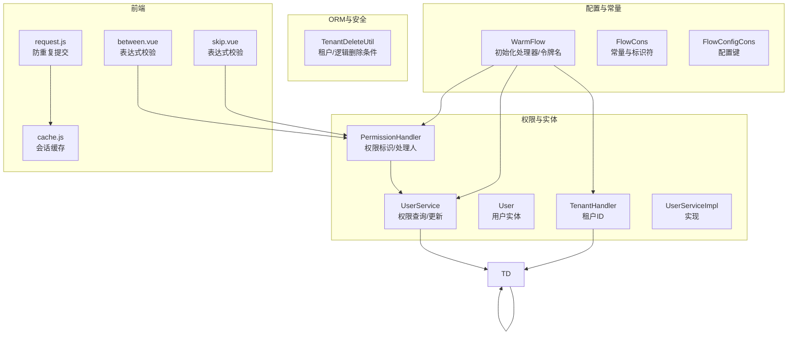
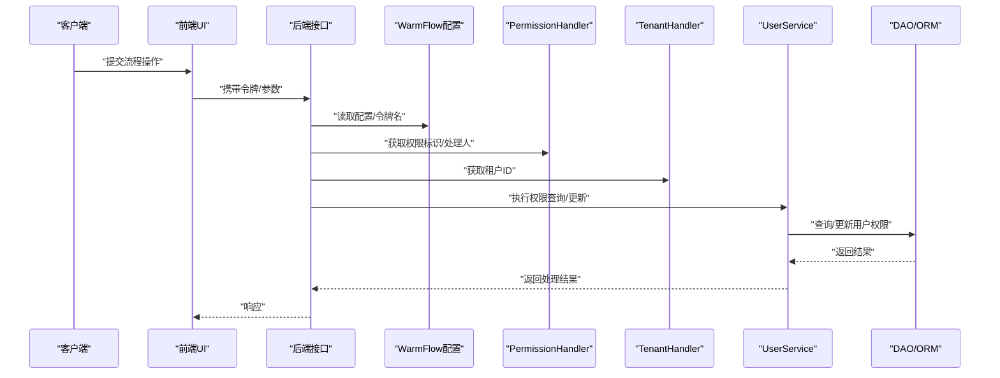
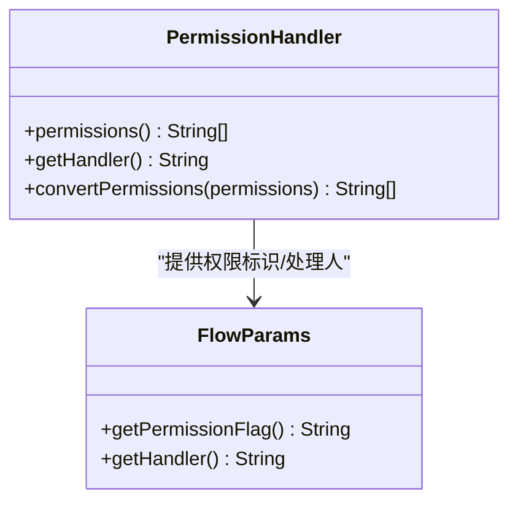
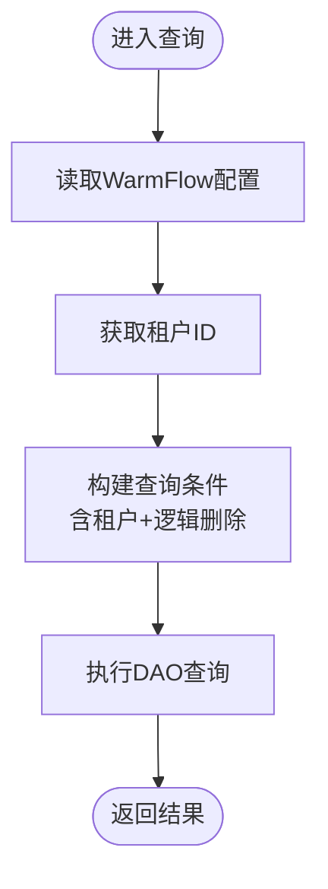
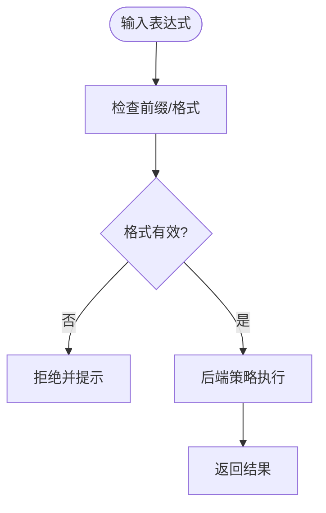
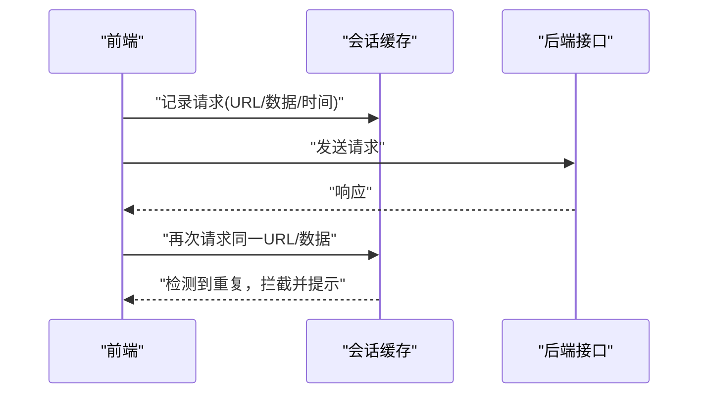
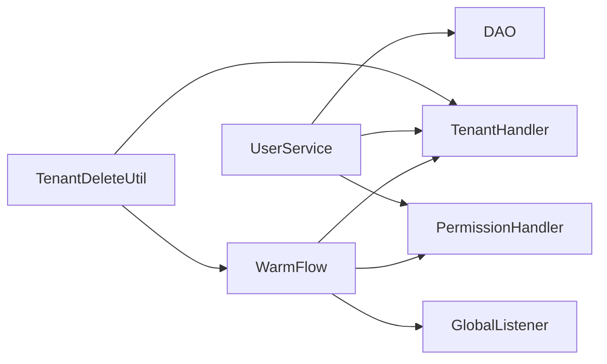

# 安全最佳实践

<cite>
**本文引用的文件**
- [WarmFlow.java](file://warm-flow-core/src/main/java/org/dromara/warm/flow/core/config/WarmFlow.java)
- [FlowConfigCons.java](file://warm-flow-core/src/main/java/org/dromara/warm/flow/core/constant/FlowConfigCons.java)
- [FlowCons.java](file://warm-flow-core/src/main/java/org/dromara/warm/flow/core/constant/FlowCons.java)
- [TenantHandler.java](file://warm-flow-core/src/main/java/org/dromara/warm/flow/core/handler/TenantHandler.java)
- [PermissionHandler.java](file://warm-flow-core/src/main/java/org/dromara/warm/flow/core/handler/PermissionHandler.java)
- [User.java](file://warm-flow-core/src/main/java/org/dromara/warm/flow/core/entity/User.java)
- [UserService.java](file://warm-flow-core/src/main/java/org/dromara/warm/flow/core/service/UserService.java)
- [UserServiceImpl.java](file://warm-flow-core/src/main/java/org/dromara/warm/flow/core/service/impl/UserServiceImpl.java)
- [FlowException.java](file://warm-flow-core/src/main/java/org/dromara/warm/flow/core/exception/FlowException.java)
- [AssertUtil.java](file://warm-flow-core/src/main/java/org/dromara/warm/flow/core/utils/AssertUtil.java)
- [StringUtils.java](file://warm-flow-core/src/main/java/org/dromara/warm/flow/core/utils/StringUtils.java)
- [TenantDeleteUtil.java](file://warm-flow-orm/warm-flow-mybatis/warm-flow-mybatis-core/src/main/java/org/dromara/warm/flow/orm/utils/TenantDeleteUtil.java)
- [FlowParams.java](file://warm-flow-core/src/main/java/org/dromara/warm/flow/core/dto/FlowParams.java)
- [request.js](file://warm-flow-ui/src/utils/request.js)
- [cache.js](file://warm-flow-ui/src/plugins/cache.js)
- [skip.vue](file://warm-flow-ui/src/components/design/common/vue/skip.vue)
- [between.vue](file://warm-flow-ui/src/components/design/common/vue/between.vue)
</cite>

## 目录
1. [引言](#引言)
2. [项目结构](#项目结构)
3. [核心组件](#核心组件)
4. [架构总览](#架构总览)
5. [详细组件分析](#详细组件分析)
6. [依赖分析](#依赖分析)
7. [性能考量](#性能考量)
8. [故障排查指南](#故障排查指南)
9. [结论](#结论)
10. [附录](#附录)

## 引言
本文件面向 Warm-Flow 权限控制系统的安全最佳实践，围绕最小权限、权限分离、权限审计等核心理念，结合多租户场景下的数据隔离、访问控制与敏感信息保护，系统阐述权限验证过程中的输入验证、权限缓存、会话管理、防重放攻击等关键技术点，并提供安全配置指南、常见漏洞与防范、安全审计与合规建议，以及安全测试方法与工具推荐。

## 项目结构
Warm-Flow 的权限与安全能力主要分布在以下层次：
- 配置与常量层：负责初始化权限处理器、租户处理器、令牌名等全局配置项
- 实体与服务层：定义用户实体、权限标识、处理人标识及权限查询与更新逻辑
- ORM 工具层：提供租户与逻辑删除的查询条件注入
- UI 层：前端对表达式输入进行基础校验，配合后端策略执行
- 异常与断言工具：统一异常与断言处理，保障安全边界

图表来源
- [WarmFlow.java:130-151](file://warm-flow-core/src/main/java/org/dromara/warm/flow/core/config/WarmFlow.java#L130-L151)
- [FlowCons.java:38-46](file://warm-flow-core/src/main/java/org/dromara/warm/flow/core/constant/FlowCons.java#L38-L46)
- [FlowConfigCons.java:55-74](file://warm-flow-core/src/main/java/org/dromara/warm/flow/core/constant/FlowConfigCons.java#L55-L74)
- [PermissionHandler.java:30-53](file://warm-flow-core/src/main/java/org/dromara/warm/flow/core/handler/PermissionHandler.java#L30-L53)
- [TenantHandler.java:23-32](file://warm-flow-core/src/main/java/org/dromara/warm/flow/core/handler/TenantHandler.java#L23-L32)
- [User.java:26-94](file://warm-flow-core/src/main/java/org/dromara/warm/flow/core/entity/User.java#L26-L94)
- [UserService.java:30-165](file://warm-flow-core/src/main/java/org/dromara/warm/flow/core/service/UserService.java#L30-L165)
- [UserServiceImpl.java:40-162](file://warm-flow-core/src/main/java/org/dromara/warm/flow/core/service/impl/UserServiceImpl.java#L40-L162)
- [TenantDeleteUtil.java:29-40](file://warm-flow-orm/warm-flow-mybatis/warm-flow-mybatis-core/src/main/java/org/dromara/warm/flow/orm/utils/TenantDeleteUtil.java#L29-L40)
- [request.js:36-61](file://warm-flow-ui/src/utils/request.js#L36-L61)
- [cache.js:1-37](file://warm-flow-ui/src/plugins/cache.js#L1-L37)
- [skip.vue:62-171](file://warm-flow-ui/src/components/design/common/vue/skip.vue#L62-L171)
- [between.vue:273-378](file://warm-flow-ui/src/components/design/common/vue/between.vue#L273-L378)

章节来源
- [WarmFlow.java:130-151](file://warm-flow-core/src/main/java/org/dromara/warm/flow/core/config/WarmFlow.java#L130-L151)
- [FlowConfigCons.java:55-74](file://warm-flow-core/src/main/java/org/dromara/warm/flow/core/constant/FlowConfigCons.java#L55-L74)
- [FlowCons.java:38-46](file://warm-flow-core/src/main/java/org/dromara/warm/flow/core/constant/FlowCons.java#L38-L46)

## 核心组件
- 权限处理器接口：定义权限标识集合与当前办理人标识，支持权限转换，便于在设计器中预设角色/部门等标识并转换为用户 ID
- 租户处理器接口：提供全局租户 ID，确保跨模块查询自动带入租户过滤
- 用户实体与服务：抽象用户实体，提供按关联 ID 查询权限人、按处理人查询、批量更新权限等能力
- 配置与常量：集中管理 Warm-Flow 的开关、令牌名、颜色配置等；常量中包含权限标识中的“发起人”占位符等
- ORM 安全工具：根据配置与上下文生成租户与逻辑删除的查询条件，避免越权与误删
- 异常与断言：统一异常模型与断言工具，保障输入合法性与边界安全

章节来源
- [PermissionHandler.java:30-53](file://warm-flow-core/src/main/java/org/dromara/warm/flow/core/handler/PermissionHandler.java#L30-L53)
- [TenantHandler.java:23-32](file://warm-flow-core/src/main/java/org/dromara/warm/flow/core/handler/TenantHandler.java#L23-L32)
- [User.java:26-94](file://warm-flow-core/src/main/java/org/dromara/warm/flow/core/entity/User.java#L26-L94)
- [UserService.java:30-165](file://warm-flow-core/src/main/java/org/dromara/warm/flow/core/service/UserService.java#L30-L165)
- [UserServiceImpl.java:40-162](file://warm-flow-core/src/main/java/org/dromara/warm/flow/core/service/impl/UserServiceImpl.java#L40-L162)
- [WarmFlow.java:130-151](file://warm-flow-core/src/main/java/org/dromara/warm/flow/core/config/WarmFlow.java#L130-L151)
- [FlowCons.java:38-46](file://warm-flow-core/src/main/java/org/dromara/warm/flow/core/constant/FlowCons.java#L38-L46)
- [TenantDeleteUtil.java:29-40](file://warm-flow-orm/warm-flow-mybatis/warm-flow-mybatis-core/src/main/java/org/dromara/warm/flow/orm/utils/TenantDeleteUtil.java#L29-L40)
- [FlowException.java:25-80](file://warm-flow-core/src/main/java/org/dromara/warm/flow/core/exception/FlowException.java#L25-L80)
- [AssertUtil.java:29-111](file://warm-flow-core/src/main/java/org/dromara/warm/flow/core/utils/AssertUtil.java#L29-L111)

## 架构总览
Warm-Flow 的权限安全架构围绕“配置驱动 + 接口扩展 + ORM 注入”的模式构建：
- 配置层：WarmFlow 在启动时初始化租户处理器、权限处理器、全局监听器等
- 执行层：业务调用通过 FlowParams 等参数携带权限标识与处理人，结合 PermissionHandler 与 TenantHandler
- 安全层：ORM 工具根据上下文自动注入租户与逻辑删除条件，防止越权与误删
- 前端层：UI 组件对表达式输入进行基础校验，结合后端策略执行

图表来源
- [WarmFlow.java:130-151](file://warm-flow-core/src/main/java/org/dromara/warm/flow/core/config/WarmFlow.java#L130-L151)
- [PermissionHandler.java:30-53](file://warm-flow-core/src/main/java/org/dromara/warm/flow/core/handler/PermissionHandler.java#L30-L53)
- [TenantHandler.java:23-32](file://warm-flow-core/src/main/java/org/dromara/warm/flow/core/handler/TenantHandler.java#L23-L32)
- [UserService.java:30-165](file://warm-flow-core/src/main/java/org/dromara/warm/flow/core/service/UserService.java#L30-L165)
- [UserServiceImpl.java:40-162](file://warm-flow-core/src/main/java/org/dromara/warm/flow/core/service/impl/UserServiceImpl.java#L40-L162)

## 详细组件分析

### 权限处理器与最小权限原则
- 设计要点
  - 权限标识集合用于判定用户是否具备“办理任务”的资格
  - 办理人标识用于唯一确定当前处理人，便于审计与归档
  - 支持权限转换，可在设计器中使用角色/部门等标识，运行时转换为具体用户 ID
- 安全意义
  - 最小权限：仅授予完成任务所需的最小权限集合
  - 权限分离：权限标识与处理人标识分离，便于审计与追踪
- 实现参考
  - 权限标识与处理人获取：[PermissionHandler.java:30-53](file://warm-flow-core/src/main/java/org/dromara/warm/flow/core/handler/PermissionHandler.java#L30-L53)
  - 发起人占位符常量：[FlowCons.java:38-46](file://warm-flow-core/src/main/java/org/dromara/warm/flow/core/constant/FlowCons.java#L38-L46)

图表来源
- [PermissionHandler.java:30-53](file://warm-flow-core/src/main/java/org/dromara/warm/flow/core/handler/PermissionHandler.java#L30-L53)
- [FlowParams.java:313-335](file://warm-flow-core/src/main/java/org/dromara/warm/flow/core/dto/FlowParams.java#L313-L335)

章节来源
- [PermissionHandler.java:30-53](file://warm-flow-core/src/main/java/org/dromara/warm/flow/core/handler/PermissionHandler.java#L30-L53)
- [FlowCons.java:38-46](file://warm-flow-core/src/main/java/org/dromara/warm/flow/core/constant/FlowCons.java#L38-L46)
- [FlowParams.java:313-335](file://warm-flow-core/src/main/java/org/dromara/warm/flow/core/dto/FlowParams.java#L313-L335)

### 多租户与数据隔离
- 设计要点
  - 全局租户处理器提供租户 ID，ORM 层自动注入租户过滤条件
  - 支持逻辑删除字段配置，结合租户条件避免误删与越权
- 安全意义
  - 多租户隔离：不同租户数据物理或逻辑隔离
  - 访问控制：所有查询/更新均受租户约束
- 实现参考
  - 租户处理器接口：[TenantHandler.java:23-32](file://warm-flow-core/src/main/java/org/dromara/warm/flow/core/handler/TenantHandler.java#L23-L32)
  - ORM 注入租户与逻辑删除条件：[TenantDeleteUtil.java:29-40](file://warm-flow-orm/warm-flow-mybatis/warm-flow-mybatis-core/src/main/java/org/dromara/warm/flow/orm/utils/TenantDeleteUtil.java#L29-L40)
  - 配置键：[FlowConfigCons.java:55-58](file://warm-flow-core/src/main/java/org/dromara/warm/flow/core/constant/FlowConfigCons.java#L55-L58)

图表来源
- [WarmFlow.java:130-151](file://warm-flow-core/src/main/java/org/dromara/warm/flow/core/config/WarmFlow.java#L130-L151)
- [TenantDeleteUtil.java:29-40](file://warm-flow-orm/warm-flow-mybatis/warm-flow-mybatis-core/src/main/java/org/dromara/warm/flow/orm/utils/TenantDeleteUtil.java#L29-L40)

章节来源
- [TenantHandler.java:23-32](file://warm-flow-core/src/main/java/org/dromara/warm/flow/core/handler/TenantHandler.java#L23-L32)
- [TenantDeleteUtil.java:29-40](file://warm-flow-orm/warm-flow-mybatis/warm-flow-mybatis-core/src/main/java/org/dromara/warm/flow/orm/utils/TenantDeleteUtil.java#L29-L40)
- [FlowConfigCons.java:55-58](file://warm-flow-core/src/main/java/org/dromara/warm/flow/core/constant/FlowConfigCons.java#L55-L58)

### 权限验证与输入校验
- 设计要点
  - 前端对表达式输入进行基础校验（如以特定前缀与括号包裹），降低恶意表达式进入后端的风险
  - 后端通过策略（如 spel/snel/default）执行表达式，前端校验作为第一道防线
- 安全意义
  - 输入验证：减少非法表达式带来的执行风险
  - 权限分离：表达式校验与策略执行分离，便于审计与升级
- 实现参考
  - skip 节点表达式校验：[skip.vue:62-171](file://warm-flow-ui/src/components/design/common/vue/skip.vue#L62-L171)
  - between 节点表达式校验：[between.vue:273-378](file://warm-flow-ui/src/components/design/common/vue/between.vue#L273-L378)

图表来源
- [skip.vue:62-171](file://warm-flow-ui/src/components/design/common/vue/skip.vue#L62-L171)
- [between.vue:273-378](file://warm-flow-ui/src/components/design/common/vue/between.vue#L273-L378)

章节来源
- [skip.vue:62-171](file://warm-flow-ui/src/components/design/common/vue/skip.vue#L62-L171)
- [between.vue:273-378](file://warm-flow-ui/src/components/design/common/vue/between.vue#L273-L378)

### 会话管理与防重放/防重复提交
- 设计要点
  - 前端使用会话缓存记录最近一次请求的 URL、数据与时间戳，若在极短时间内重复相同请求则拦截
  - 对超大数据量请求进行限制，避免缓存占用过高
- 安全意义
  - 防重复提交：降低用户误操作或脚本重复提交导致的数据不一致
  - 防重放：通过时间窗口与请求内容匹配，降低重放攻击风险
- 实现参考
  - 防重复提交与缓存：[request.js:36-61](file://warm-flow-ui/src/utils/request.js#L36-L61)、[cache.js:1-37](file://warm-flow-ui/src/plugins/cache.js#L1-L37)

图表来源
- [request.js:36-61](file://warm-flow-ui/src/utils/request.js#L36-L61)
- [cache.js:1-37](file://warm-flow-ui/src/plugins/cache.js#L1-L37)

章节来源
- [request.js:36-61](file://warm-flow-ui/src/utils/request.js#L36-L61)
- [cache.js:1-37](file://warm-flow-ui/src/plugins/cache.js#L1-L37)

### 权限审计与异常处理
- 设计要点
  - 统一异常模型与断言工具，确保错误信息可控且不泄露敏感细节
  - 用户实体与服务提供权限查询与更新能力，便于审计“谁在何时对何进行了何种操作”
- 安全意义
  - 审计留痕：通过处理人与权限标识追踪操作来源
  - 安全边界：异常与断言统一处理，避免信息泄露
- 实现参考
  - 异常模型：[FlowException.java:25-80](file://warm-flow-core/src/main/java/org/dromara/warm/flow/core/exception/FlowException.java#L25-L80)
  - 断言工具：[AssertUtil.java:29-111](file://warm-flow-core/src/main/java/org/dromara/warm/flow/core/utils/AssertUtil.java#L29-L111)
  - 用户实体与服务：[User.java:26-94](file://warm-flow-core/src/main/java/org/dromara/warm/flow/core/entity/User.java#L26-L94)、[UserService.java:30-165](file://warm-flow-core/src/main/java/org/dromara/warm/flow/core/service/UserService.java#L30-L165)

章节来源
- [FlowException.java:25-80](file://warm-flow-core/src/main/java/org/dromara/warm/flow/core/exception/FlowException.java#L25-L80)
- [AssertUtil.java:29-111](file://warm-flow-core/src/main/java/org/dromara/warm/flow/core/utils/AssertUtil.java#L29-L111)
- [User.java:26-94](file://warm-flow-core/src/main/java/org/dromara/warm/flow/core/entity/User.java#L26-L94)
- [UserService.java:30-165](file://warm-flow-core/src/main/java/org/dromara/warm/flow/core/service/UserService.java#L30-L165)

## 依赖分析
- 组件耦合
  - WarmFlow 作为入口，依赖 SPI 加载 JSON 转换策略，并初始化处理器
  - UserService 依赖 DAO 与 FlowEngine 的工厂方法，实现权限查询与更新
  - TenantDeleteUtil 依赖 WarmFlow 配置与 TenantHandler，注入租户与逻辑删除条件
- 外部集成
  - 令牌名可通过配置键覆盖默认值，便于与业务系统共享权限体系
- 潜在风险
  - 若租户处理器未正确实现或返回空值，可能导致越权
  - 权限标识转换逻辑需严格校验，避免角色/部门等标识被滥用

图表来源
- [WarmFlow.java:130-151](file://warm-flow-core/src/main/java/org/dromara/warm/flow/core/config/WarmFlow.java#L130-L151)
- [UserService.java:30-165](file://warm-flow-core/src/main/java/org/dromara/warm/flow/core/service/UserService.java#L30-L165)
- [TenantDeleteUtil.java:29-40](file://warm-flow-orm/warm-flow-mybatis/warm-flow-mybatis-core/src/main/java/org/dromara/warm/flow/orm/utils/TenantDeleteUtil.java#L29-L40)

章节来源
- [WarmFlow.java:130-151](file://warm-flow-core/src/main/java/org/dromara/warm/flow/core/config/WarmFlow.java#L130-L151)
- [UserService.java:30-165](file://warm-flow-core/src/main/java/org/dromara/warm/flow/core/service/UserService.java#L30-L165)
- [TenantDeleteUtil.java:29-40](file://warm-flow-orm/warm-flow-mybatis/warm-flow-mybatis-core/src/main/java/org/dromara/warm/flow/orm/utils/TenantDeleteUtil.java#L29-L40)

## 性能考量
- 权限查询优化
  - 使用批量化查询与缓存策略，减少重复查询
  - 对权限标识进行索引与分组，提升匹配效率
- ORM 条件注入
  - 租户与逻辑删除条件应建立合适索引，避免全表扫描
- 前端交互
  - 表达式校验尽量在前端完成，减少无效请求
  - 防重复提交的阈值与缓存大小需平衡用户体验与资源占用

## 故障排查指南
- 常见问题
  - 权限不足：检查 PermissionHandler 返回的权限标识是否包含当前用户
  - 越权访问：确认 TenantHandler 返回的租户 ID 是否正确，ORM 条件是否生效
  - 表达式错误：核对前端表达式格式与后端策略是否匹配
  - 重复提交：查看前端缓存记录与拦截日志
- 定位手段
  - 查看 WarmFlow 配置与初始化日志
  - 检查 UserService 的权限查询与更新调用链
  - 核对异常模型与断言工具的错误信息

章节来源
- [WarmFlow.java:130-151](file://warm-flow-core/src/main/java/org/dromara/warm/flow/core/config/WarmFlow.java#L130-L151)
- [UserService.java:30-165](file://warm-flow-core/src/main/java/org/dromara/warm/flow/core/service/UserService.java#L30-L165)
- [FlowException.java:25-80](file://warm-flow-core/src/main/java/org/dromara/warm/flow/core/exception/FlowException.java#L25-L80)
- [AssertUtil.java:29-111](file://warm-flow-core/src/main/java/org/dromara/warm/flow/core/utils/AssertUtil.java#L29-L111)

## 结论
Warm-Flow 通过“配置驱动 + 接口扩展 + ORM 注入 + 前端校验”的组合，在多租户环境下实现了数据隔离与访问控制，并以最小权限、权限分离与权限审计为核心理念，辅以统一异常与断言、防重复提交等安全措施。遵循本文的最佳实践，可显著提升系统的安全性与合规性。

## 附录
- 安全配置清单
  - 令牌名：通过配置键覆盖默认值，确保与业务系统一致
  - 租户处理器：确保返回合法且唯一的租户 ID
  - 权限处理器：权限标识与处理人清晰分离，支持权限转换
  - 逻辑删除：合理配置逻辑删除字段与值，配合租户条件
- 安全测试建议
  - 单元测试：覆盖权限标识转换、租户条件注入、表达式校验
  - 集成测试：模拟多租户场景下的越权与误删
  - 渗透测试：重点验证令牌解析、重复提交拦截、表达式注入
- 合规与审计
  - 审计日志：记录权限变更、处理人变更、关键操作
  - 异常脱敏：确保异常信息不泄露敏感细节
  - 数据最小化：仅采集必要的审计字段