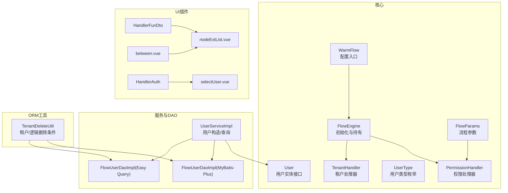
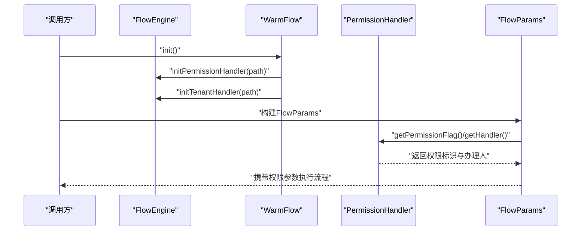
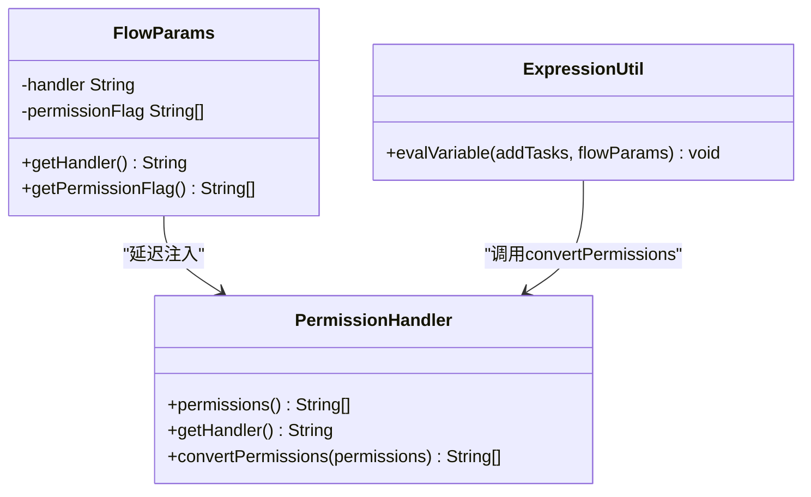
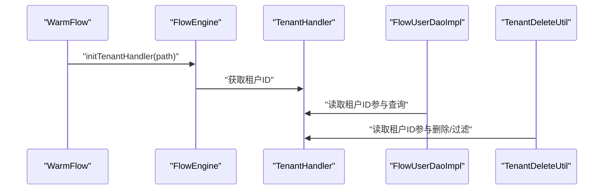
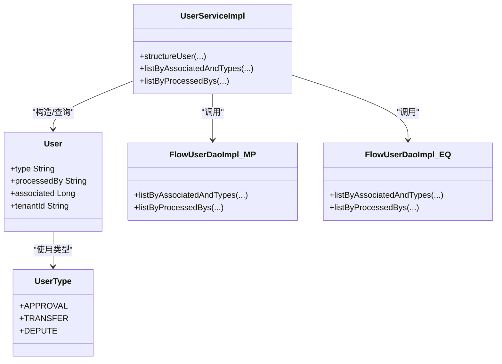
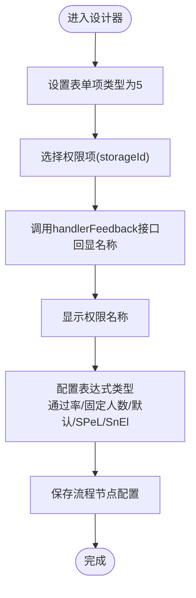
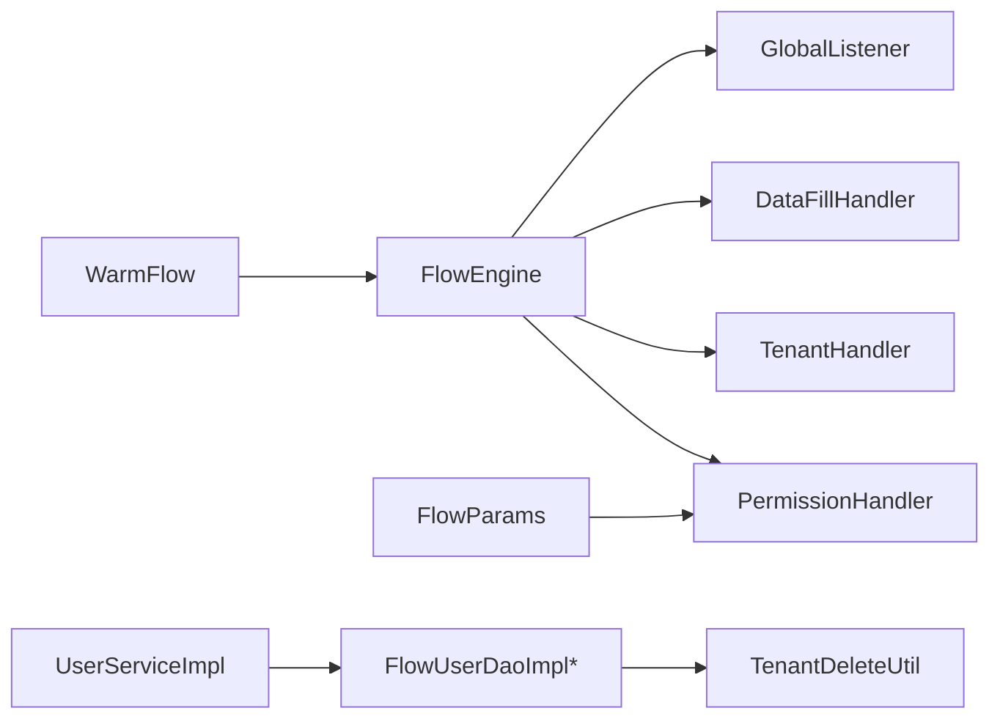

# 权限控制系统

<cite>
**本文引用的文件**
- [PermissionHandler.java](file://warm-flow-core/src/main/java/org/dromara/warm/flow/core/handler/PermissionHandler.java)
- [TenantHandler.java](file://warm-flow-core/src/main/java/org/dromara/warm/flow/core/handler/TenantHandler.java)
- [FlowParams.java](file://warm-flow-core/src/main/java/org/dromara/warm/flow/core/dto/FlowParams.java)
- [WarmFlow.java](file://warm-flow-core/src/main/java/org/dromara/warm/flow/core/config/WarmFlow.java)
- [FlowEngine.java](file://warm-flow-core/src/main/java/org/dromara/warm/flow/core/FlowEngine.java)
- [UserType.java](file://warm-flow-core/src/main/java/org/dromara/warm/flow/core/enums/UserType.java)
- [User.java](file://warm-flow-core/src/main/java/org/dromara/warm/flow/core/entity/User.java)
- [UserServiceImpl.java](file://warm-flow-core/src/main/java/org/dromara/warm/flow/core/service/impl/UserServiceImpl.java)
- [FlowUserDaoImpl.java（MyBatis-Plus）](file://warm-flow-orm/warm-flow-mybatis-plus/warm-flow-mybatis-plus-core/src/main/java/org/dromara/warm/flow/orm/dao/FlowUserDaoImpl.java)
- [FlowUserDaoImpl.java（Easy Query）](file://warm-flow-orm/warm-flow-easy-query/warm-flow-easy-query-core/src/main/java/org/dromara/warm/flow/orm/dao/FlowUserDaoImpl.java)
- [TenantDeleteUtil.java](file://warm-flow-orm/warm-flow-mybatis/warm-flow-mybatis-core/src/main/java/org/dromara/warm/flow/orm/utils/TenantDeleteUtil.java)
- [ExpressionUtil.java](file://warm-flow-core/src/main/java/org/dromara/warm/flow/core/utils/ExpressionUtil.java)
- [FrameworkType.java](file://warm-flow-core/src/main/java/org/dromara/warm/flow/core/enums/FrameworkType.java)
- [HandlerFunDto.java](file://warm-flow-plugin/warm-flow-plugin-ui/warm-flow-plugin-ui-core/src/main/java/org/dromara/warm/flow/ui/dto/HandlerFunDto.java)
- [HandlerAuth.java](file://warm-flow-plugin/warm-flow-plugin-ui/warm-flow-plugin-ui-core/src/main/java/org/dromara/warm/flow/ui/vo/HandlerAuth.java)
- [nodeExtList.vue](file://warm-flow-ui/src/components/design/common/vue/nodeExtList.vue)
- [selectUser.vue](file://warm-flow-ui/src/components/design/common/vue/selectUser.vue)
- [between.vue](file://warm-flow-ui/src/components/design/common/vue/between.vue)
</cite>

## 目录
1. [简介](#简介)
2. [项目结构](#项目结构)
3. [核心组件](#核心组件)
4. [架构总览](#架构总览)
5. [详细组件分析](#详细组件分析)
6. [依赖分析](#依赖分析)
7. [性能考虑](#性能考虑)
8. [故障排查指南](#故障排查指南)
9. [结论](#结论)
10. [附录](#附录)

## 简介
本技术文档围绕 Warm-Flow 的权限控制系统展开，重点阐述多租户支持的实现机制、权限验证与动态分配、权限处理器与租户处理器的设计与集成方式，以及用户类型与框架类型对权限控制策略的影响。文档同时提供最佳实践与安全建议，帮助开发者构建安全可靠的流程应用。

## 项目结构
权限控制相关代码主要分布在以下模块：
- 核心接口与配置：handler、dto、config、enums、entity、FlowEngine
- ORM 层：MyBatis、MyBatis-Plus、Easy Query 对用户表与租户/逻辑删除的适配
- UI 插件与前端组件：设计器中的权限设置、用户选择与回显

图表来源
- [FlowEngine.java:180-222](file://warm-flow-core/src/main/java/org/dromara/warm/flow/core/FlowEngine.java#L180-L222)
- [WarmFlow.java:130-151](file://warm-flow-core/src/main/java/org/dromara/warm/flow/core/config/WarmFlow.java#L130-L151)
- [PermissionHandler.java:30-53](file://warm-flow-core/src/main/java/org/dromara/warm/flow/core/handler/PermissionHandler.java#L30-L53)
- [TenantHandler.java:23-31](file://warm-flow-core/src/main/java/org/dromara/warm/flow/core/handler/TenantHandler.java#L23-L31)
- [FlowParams.java:266-290](file://warm-flow-core/src/main/java/org/dromara/warm/flow/core/dto/FlowParams.java#L266-L290)
- [UserType.java:29-41](file://warm-flow-core/src/main/java/org/dromara/warm/flow/core/enums/UserType.java#L29-L41)
- [User.java:26-94](file://warm-flow-core/src/main/java/org/dromara/warm/flow/core/entity/User.java#L26-L94)
- [UserServiceImpl.java:136-160](file://warm-flow-core/src/main/java/org/dromara/warm/flow/core/service/impl/UserServiceImpl.java#L136-L160)
- [FlowUserDaoImpl.java（MyBatis-Plus）:54-80](file://warm-flow-orm/warm-flow-mybatis-plus/warm-flow-mybatis-plus-core/src/main/java/org/dromara/warm/flow/orm/dao/FlowUserDaoImpl.java#L54-L80)
- [FlowUserDaoImpl.java（Easy Query）:51-70](file://warm-flow-orm/warm-flow-easy-query/warm-flow-easy-query-core/src/main/java/org/dromara/warm/flow/orm/dao/FlowUserDaoImpl.java#L51-L70)
- [TenantDeleteUtil.java:39-40](file://warm-flow-orm/warm-flow-mybatis/warm-flow-mybatis-core/src/main/java/org/dromara/warm/flow/orm/utils/TenantDeleteUtil.java#L39-L40)
- [HandlerFunDto.java:33-54](file://warm-flow-plugin/warm-flow-plugin-ui/warm-flow-plugin-ui-core/src/main/java/org/dromara/warm/flow/ui/dto/HandlerFunDto.java#L33-L54)
- [HandlerAuth.java:31-58](file://warm-flow-plugin/warm-flow-plugin-ui/warm-flow-plugin-ui-core/src/main/java/org/dromara/warm/flow/ui/vo/HandlerAuth.java#L31-L58)
- [nodeExtList.vue:149-195](file://warm-flow-ui/src/components/design/common/vue/nodeExtList.vue#L149-L195)
- [selectUser.vue:180-213](file://warm-flow-ui/src/components/design/common/vue/selectUser.vue#L180-L213)
- [between.vue:373-416](file://warm-flow-ui/src/components/design/common/vue/between.vue#L373-L416)

章节来源
- [WarmFlow.java:130-151](file://warm-flow-core/src/main/java/org/dromara/warm/flow/core/config/WarmFlow.java#L130-L151)
- [FlowEngine.java:180-222](file://warm-flow-core/src/main/java/org/dromara/warm/flow/core/FlowEngine.java#L180-L222)

## 核心组件
- 权限处理器 PermissionHandler：负责提供当前“办理人”与“权限标识集合”，并支持权限转换（如角色/部门转用户ID）。
- 租户处理器 TenantHandler：提供全局租户ID，贯穿数据隔离与查询过滤。
- 流程参数 FlowParams：统一承载流程执行所需的 handler、permissionFlag、变量、状态等，支持从 PermissionHandler 延迟注入。
- 用户类型 UserType：定义审批、转办、委托等用户角色类型，用于区分不同权限控制策略。
- 用户实体 User：抽象用户比对表结构，包含类型、权限人、关联任务ID、租户ID等字段。
- 用户服务 UserServiceImpl：负责根据权限标识构造用户比对记录，支持按类型与关联ID查询。
- ORM DAO：MyBatis-Plus/Easy Query 提供基于 associated、type、processedBy 的查询能力；TenantDeleteUtil 提供租户/逻辑删除条件构建。
- UI 插件与前端组件：设计器中权限设置、用户选择、权限回显与表达式配置。

章节来源
- [PermissionHandler.java:30-53](file://warm-flow-core/src/main/java/org/dromara/warm/flow/core/handler/PermissionHandler.java#L30-L53)
- [TenantHandler.java:23-31](file://warm-flow-core/src/main/java/org/dromara/warm/flow/core/handler/TenantHandler.java#L23-L31)
- [FlowParams.java:266-290](file://warm-flow-core/src/main/java/org/dromara/warm/flow/core/dto/FlowParams.java#L266-L290)
- [UserType.java:29-41](file://warm-flow-core/src/main/java/org/dromara/warm/flow/core/enums/UserType.java#L29-L41)
- [User.java:26-94](file://warm-flow-core/src/main/java/org/dromara/warm/flow/core/entity/User.java#L26-L94)
- [UserServiceImpl.java:136-160](file://warm-flow-core/src/main/java/org/dromara/warm/flow/core/service/impl/UserServiceImpl.java#L136-L160)
- [FlowUserDaoImpl.java（MyBatis-Plus）:54-80](file://warm-flow-orm/warm-flow-mybatis-plus/warm-flow-mybatis-plus-core/src/main/java/org/dromara/warm/flow/orm/dao/FlowUserDaoImpl.java#L54-L80)
- [FlowUserDaoImpl.java（Easy Query）:51-70](file://warm-flow-orm/warm-flow-easy-query/warm-flow-easy-query-core/src/main/java/org/dromara/warm/flow/orm/dao/FlowUserDaoImpl.java#L51-L70)
- [TenantDeleteUtil.java:39-40](file://warm-flow-orm/warm-flow-mybatis/warm-flow-mybatis-core/src/main/java/org/dromara/warm/flow/orm/utils/TenantDeleteUtil.java#L39-L40)
- [HandlerFunDto.java:33-54](file://warm-flow-plugin/warm-flow-plugin-ui/warm-flow-plugin-ui-core/src/main/java/org/dromara/warm/flow/ui/dto/HandlerFunDto.java#L33-L54)
- [HandlerAuth.java:31-58](file://warm-flow-plugin/warm-flow-plugin-ui/warm-flow-plugin-ui-core/src/main/java/org/dromara/warm/flow/ui/vo/HandlerAuth.java#L31-L58)
- [nodeExtList.vue:149-195](file://warm-flow-ui/src/components/design/common/vue/nodeExtList.vue#L149-L195)
- [selectUser.vue:180-213](file://warm-flow-ui/src/components/design/common/vue/selectUser.vue#L180-L213)
- [between.vue:373-416](file://warm-flow-ui/src/components/design/common/vue/between.vue#L373-L416)

## 架构总览
Warm-Flow 的权限控制以 FlowEngine 为中心，通过 WarmFlow 配置加载 PermissionHandler 与 TenantHandler，并在 FlowParams 中统一注入权限标识与办理人。用户类型通过 UserType 控制不同角色的权限策略，用户比对记录由 UserServiceImpl 构造并持久化至 FlowUser 表，DAO 层按 associated/type/processedBy 进行查询。多租户通过 TenantHandler 提供的租户ID在 DAO 查询与逻辑删除中生效。

图表来源
- [WarmFlow.java:130-151](file://warm-flow-core/src/main/java/org/dromara/warm/flow/core/config/WarmFlow.java#L130-L151)
- [FlowEngine.java:188-190](file://warm-flow-core/src/main/java/org/dromara/warm/flow/core/FlowEngine.java#L188-L190)
- [FlowParams.java:266-290](file://warm-flow-core/src/main/java/org/dromara/warm/flow/core/dto/FlowParams.java#L266-L290)

## 详细组件分析

### 权限处理器 PermissionHandler
- 职责
  - 提供当前“办理人”唯一标识（用于入库记录流程经办人）
  - 提供“权限标识集合”（用于校验是否有权办理任务）
  - 支持权限转换（如将角色/部门ID转换为用户ID）
- 与 FlowParams 的协作
  - FlowParams 在 handler 或 permissionFlag 为空时，自动从 FlowEngine.permissionHandler() 注入
- 与表达式的结合
  - ExpressionUtil 在生成待办任务时，对权限表达式进行变量替换，并调用 convertPermissions 进行最终转换

图表来源
- [PermissionHandler.java:30-53](file://warm-flow-core/src/main/java/org/dromara/warm/flow/core/handler/PermissionHandler.java#L30-L53)
- [FlowParams.java:266-290](file://warm-flow-core/src/main/java/org/dromara/warm/flow/core/dto/FlowParams.java#L266-L290)
- [ExpressionUtil.java:81-100](file://warm-flow-core/src/main/java/org/dromara/warm/flow/core/utils/ExpressionUtil.java#L81-L100)

章节来源
- [PermissionHandler.java:30-53](file://warm-flow-core/src/main/java/org/dromara/warm/flow/core/handler/PermissionHandler.java#L30-L53)
- [FlowParams.java:266-290](file://warm-flow-core/src/main/java/org/dromara/warm/flow/core/dto/FlowParams.java#L266-L290)
- [ExpressionUtil.java:81-100](file://warm-flow-core/src/main/java/org/dromara/warm/flow/core/utils/ExpressionUtil.java#L81-L100)

### 租户处理器 TenantHandler 与多租户隔离
- 职责：提供全局租户ID，用于数据隔离与查询过滤
- 集成方式：WarmFlow.initTenantHandler 在启动时注册；FlowEngine.tenantHandler() 提供访问
- ORM 适配：DAO 层在查询条件中加入租户ID；TenantDeleteUtil 提供租户/逻辑删除条件构建

图表来源
- [WarmFlow.java:130-151](file://warm-flow-core/src/main/java/org/dromara/warm/flow/core/config/WarmFlow.java#L130-L151)
- [FlowEngine.java:213-215](file://warm-flow-core/src/main/java/org/dromara/warm/flow/core/FlowEngine.java#L213-L215)
- [TenantHandler.java:23-31](file://warm-flow-core/src/main/java/org/dromara/warm/flow/core/handler/TenantHandler.java#L23-L31)
- [FlowUserDaoImpl.java（MyBatis-Plus）:54-80](file://warm-flow-orm/warm-flow-mybatis-plus/warm-flow-mybatis-plus-core/src/main/java/org/dromara/warm/flow/orm/dao/FlowUserDaoImpl.java#L54-L80)
- [FlowUserDaoImpl.java（Easy Query）:51-70](file://warm-flow-orm/warm-flow-easy-query/warm-flow-easy-query-core/src/main/java/org/dromara/warm/flow/orm/dao/FlowUserDaoImpl.java#L51-L70)
- [TenantDeleteUtil.java:39-40](file://warm-flow-orm/warm-flow-mybatis/warm-flow-mybatis-core/src/main/java/org/dromara/warm/flow/orm/utils/TenantDeleteUtil.java#L39-L40)

章节来源
- [WarmFlow.java:130-151](file://warm-flow-core/src/main/java/org/dromara/warm/flow/core/config/WarmFlow.java#L130-L151)
- [FlowEngine.java:213-215](file://warm-flow-core/src/main/java/org/dromara/warm/flow/core/FlowEngine.java#L213-L215)
- [TenantHandler.java:23-31](file://warm-flow-core/src/main/java/org/dromara/warm/flow/core/handler/TenantHandler.java#L23-L31)
- [FlowUserDaoImpl.java（MyBatis-Plus）:54-80](file://warm-flow-orm/warm-flow-mybatis-plus/warm-flow-mybatis-plus-core/src/main/java/org/dromara/warm/flow/orm/dao/FlowUserDaoImpl.java#L54-L80)
- [FlowUserDaoImpl.java（Easy Query）:51-70](file://warm-flow-orm/warm-flow-easy-query/warm-flow-easy-query-core/src/main/java/org/dromara/warm/flow/orm/dao/FlowUserDaoImpl.java#L51-L70)
- [TenantDeleteUtil.java:39-40](file://warm-flow-orm/warm-flow-mybatis/warm-flow-mybatis-core/src/main/java/org/dromara/warm/flow/orm/utils/TenantDeleteUtil.java#L39-L40)

### 用户类型与权限控制策略
- UserType 定义三种用户角色类型：审批人、转办人、委托人
- UserServiceImpl 根据类型构造用户比对记录，支持按 associated/type/processedBy 查询
- DAO 层提供多条件组合查询，保证权限匹配的准确性

图表来源
- [UserType.java:29-41](file://warm-flow-core/src/main/java/org/dromara/warm/flow/core/enums/UserType.java#L29-L41)
- [User.java:26-94](file://warm-flow-core/src/main/java/org/dromara/warm/flow/core/entity/User.java#L26-L94)
- [UserServiceImpl.java:136-160](file://warm-flow-core/src/main/java/org/dromara/warm/flow/core/service/impl/UserServiceImpl.java#L136-L160)
- [FlowUserDaoImpl.java（MyBatis-Plus）:54-80](file://warm-flow-orm/warm-flow-mybatis-plus/warm-flow-mybatis-plus-core/src/main/java/org/dromara/warm/flow/orm/dao/FlowUserDaoImpl.java#L54-L80)
- [FlowUserDaoImpl.java（Easy Query）:51-70](file://warm-flow-orm/warm-flow-easy-query/warm-flow-easy-query-core/src/main/java/org/dromara/warm/flow/orm/dao/FlowUserDaoImpl.java#L51-L70)

章节来源
- [UserType.java:29-41](file://warm-flow-core/src/main/java/org/dromara/warm/flow/core/enums/UserType.java#L29-L41)
- [User.java:26-94](file://warm-flow-core/src/main/java/org/dromara/warm/flow/core/entity/User.java#L26-L94)
- [UserServiceImpl.java:136-160](file://warm-flow-core/src/main/java/org/dromara/warm/flow/core/service/impl/UserServiceImpl.java#L136-L160)
- [FlowUserDaoImpl.java（MyBatis-Plus）:54-80](file://warm-flow-orm/warm-flow-mybatis-plus/warm-flow-mybatis-plus-core/src/main/java/org/dromara/warm/flow/orm/dao/FlowUserDaoImpl.java#L54-L80)
- [FlowUserDaoImpl.java（Easy Query）:51-70](file://warm-flow-orm/warm-flow-easy-query/warm-flow-easy-query-core/src/main/java/org/dromara/warm/flow/orm/dao/FlowUserDaoImpl.java#L51-L70)

### 权限配置与动态分配（设计器与前端）
- 设计器权限设置
  - nodeExtList.vue：当表单项类型为5时，将选中的权限编码回显为名称
  - between.vue：提供多种表达式类型（通过率、固定人数、默认表达式、SPeL/SnEl），用于动态计算权限
- UI 插件数据结构
  - HandlerFunDto：封装权限列表、总数与函数式提取 storageId/handlerCode
  - HandlerAuth：存储权限编码、名称、分组、创建时间等
- 用户选择组件
  - selectUser.vue：拉取权限类型、分页查询、树形筛选、勾选回写

图表来源
- [nodeExtList.vue:149-195](file://warm-flow-ui/src/components/design/common/vue/nodeExtList.vue#L149-L195)
- [between.vue:373-416](file://warm-flow-ui/src/components/design/common/vue/between.vue#L373-L416)
- [HandlerFunDto.java:33-54](file://warm-flow-plugin/warm-flow-plugin-ui/warm-flow-plugin-ui-core/src/main/java/org/dromara/warm/flow/ui/dto/HandlerFunDto.java#L33-L54)
- [HandlerAuth.java:31-58](file://warm-flow-plugin/warm-flow-plugin-ui/warm-flow-plugin-ui-core/src/main/java/org/dromara/warm/flow/ui/vo/HandlerAuth.java#L31-L58)
- [selectUser.vue:180-213](file://warm-flow-ui/src/components/design/common/vue/selectUser.vue#L180-L213)

章节来源
- [nodeExtList.vue:149-195](file://warm-flow-ui/src/components/design/common/vue/nodeExtList.vue#L149-L195)
- [between.vue:373-416](file://warm-flow-ui/src/components/design/common/vue/between.vue#L373-L416)
- [HandlerFunDto.java:33-54](file://warm-flow-plugin/warm-flow-plugin-ui/warm-flow-plugin-ui-core/src/main/java/org/dromara/warm/flow/ui/dto/HandlerFunDto.java#L33-L54)
- [HandlerAuth.java:31-58](file://warm-flow-plugin/warm-flow-plugin-ui/warm-flow-plugin-ui-core/src/main/java/org/dromara/warm/flow/ui/vo/HandlerAuth.java#L31-L58)
- [selectUser.vue:180-213](file://warm-flow-ui/src/components/design/common/vue/selectUser.vue#L180-L213)

## 依赖分析
- FlowEngine 作为中心枢纽，持有并初始化 PermissionHandler、TenantHandler、DataFillHandler、GlobalListener
- WarmFlow 通过 SPI 与配置加载处理器与监听器
- FlowParams 依赖 PermissionHandler 注入 handler 与 permissionFlag
- UserServiceImpl 依赖 DAO 层进行用户比对记录的增删查改
- DAO 层在查询时受租户ID影响，确保跨租户数据隔离

图表来源
- [WarmFlow.java:130-151](file://warm-flow-core/src/main/java/org/dromara/warm/flow/core/config/WarmFlow.java#L130-L151)
- [FlowEngine.java:180-222](file://warm-flow-core/src/main/java/org/dromara/warm/flow/core/FlowEngine.java#L180-L222)
- [FlowParams.java:266-290](file://warm-flow-core/src/main/java/org/dromara/warm/flow/core/dto/FlowParams.java#L266-L290)
- [UserServiceImpl.java:136-160](file://warm-flow-core/src/main/java/org/dromara/warm/flow/core/service/impl/UserServiceImpl.java#L136-L160)
- [FlowUserDaoImpl.java（MyBatis-Plus）:54-80](file://warm-flow-orm/warm-flow-mybatis-plus/warm-flow-mybatis-plus-core/src/main/java/org/dromara/warm/flow/orm/dao/FlowUserDaoImpl.java#L54-L80)
- [TenantDeleteUtil.java:39-40](file://warm-flow-orm/warm-flow-mybatis/warm-flow-mybatis-core/src/main/java/org/dromara/warm/flow/orm/utils/TenantDeleteUtil.java#L39-L40)

章节来源
- [FlowEngine.java:180-222](file://warm-flow-core/src/main/java/org/dromara/warm/flow/core/FlowEngine.java#L180-L222)
- [WarmFlow.java:130-151](file://warm-flow-core/src/main/java/org/dromara/warm/flow/core/config/WarmFlow.java#L130-L151)

## 性能考虑
- 权限注入延迟：FlowParams 在 handler/permissionFlag 为空时才从 PermissionHandler 注入，避免不必要的反射与IO
- 批量构造用户比对：UserServiceImpl 使用流式工具批量构造与保存，减少循环开销
- DAO 查询优化：MyBatis-Plus/Easy Query 采用 in/eq 组合查询，配合 associated/type/processedBy 字段，提升命中率
- 表达式求值：ExpressionUtil 在生成待办任务时进行权限表达式替换与去重，降低后续校验成本

## 故障排查指南
- 权限标识为空
  - 检查 WarmFlow 配置中的 permissionHandlerPath 是否正确
  - 确认 FlowEngine.initPermissionHandler 已被调用
  - 核对 FlowParams.getPermissionFlag 是否抛出异常被吞掉
- 办理人为空
  - 检查 PermissionHandler.getHandler 实现是否返回有效值
  - 确认 FlowParams.getHandler 的异常捕获逻辑
- 多租户数据隔离问题
  - 检查 TenantHandler.getTenantId 是否返回预期值
  - 确认 DAO 查询条件是否包含租户ID
  - 核查 TenantDeleteUtil 是否正确构建租户/逻辑删除条件
- 表达式解析失败
  - 检查 ExpressionUtil.evalVariable 的变量上下文与 convertPermissions 调用链
  - 确认设计器表达式类型与格式（通过率/固定人数/默认/SPeL/SnEl）

章节来源
- [WarmFlow.java:130-151](file://warm-flow-core/src/main/java/org/dromara/warm/flow/core/config/WarmFlow.java#L130-L151)
- [FlowEngine.java:188-190](file://warm-flow-core/src/main/java/org/dromara/warm/flow/core/FlowEngine.java#L188-L190)
- [FlowParams.java:266-290](file://warm-flow-core/src/main/java/org/dromara/warm/flow/core/dto/FlowParams.java#L266-L290)
- [ExpressionUtil.java:81-100](file://warm-flow-core/src/main/java/org/dromara/warm/flow/core/utils/ExpressionUtil.java#L81-L100)
- [TenantDeleteUtil.java:39-40](file://warm-flow-orm/warm-flow-mybatis/warm-flow-mybatis-core/src/main/java/org/dromara/warm/flow/orm/utils/TenantDeleteUtil.java#L39-L40)

## 结论
Warm-Flow 的权限控制系统通过 PermissionHandler 与 TenantHandler 实现“动态权限+多租户隔离”的双轮驱动。FlowParams 统一承载权限参数，UserType 明确角色边界，UserServiceImpl 与 DAO 层协同完成权限记录的构造与查询。设计器与 UI 插件提供了灵活的权限配置与回显能力。遵循本文的最佳实践与安全建议，可有效提升系统的安全性与可维护性。

## 附录
- 最佳实践
  - 明确区分“权限标识集合”与“实际办理人”，前者用于校验，后者用于入库
  - 在 PermissionHandler.convertPermissions 中实现角色/部门到用户的映射
  - 为每个租户配置独立 TenantHandler，确保查询与删除均带租户ID
  - 使用表达式类型时，明确变量作用域与返回值类型，避免运行期异常
- 安全建议
  - 严格限制设计器中表达式的可执行范围，避免任意代码注入
  - 对外暴露的 API 应强制校验 FlowParams.ignore/ignoreDepute/ignoreCooperate 等开关
  - 定期审计用户比对记录 associated/type/processedBy 的一致性
  - 对敏感字段（如审批意见、流程变量）进行脱敏与最小化采集