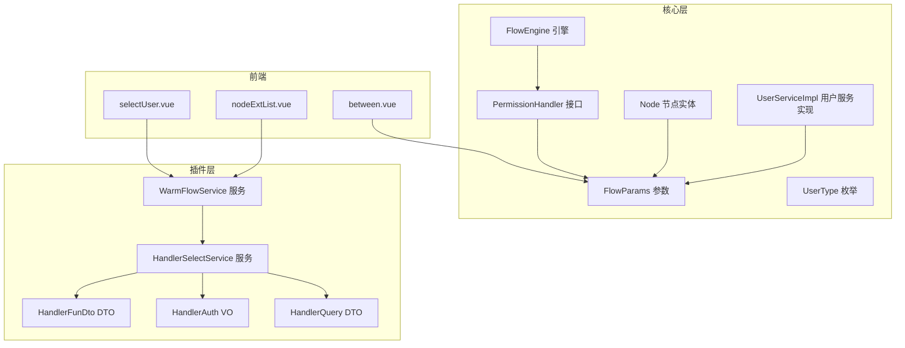
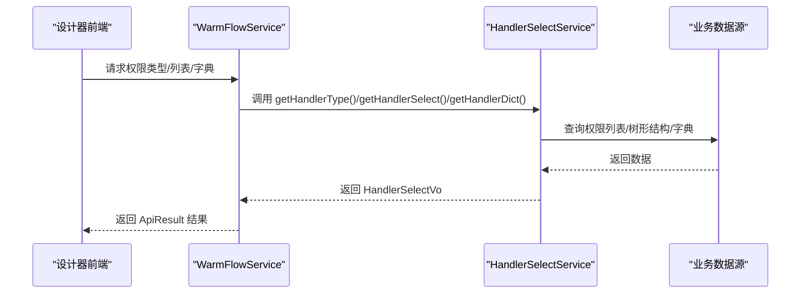
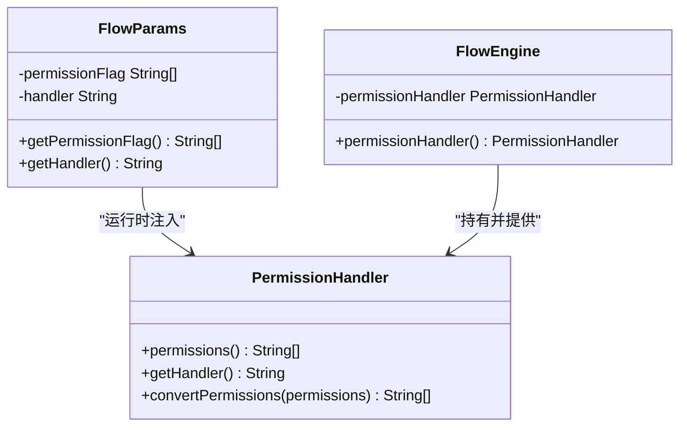
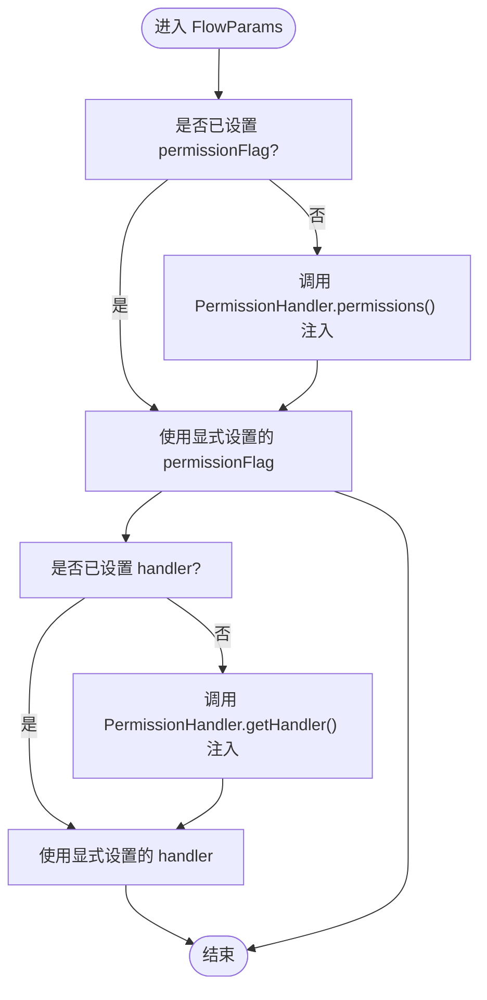
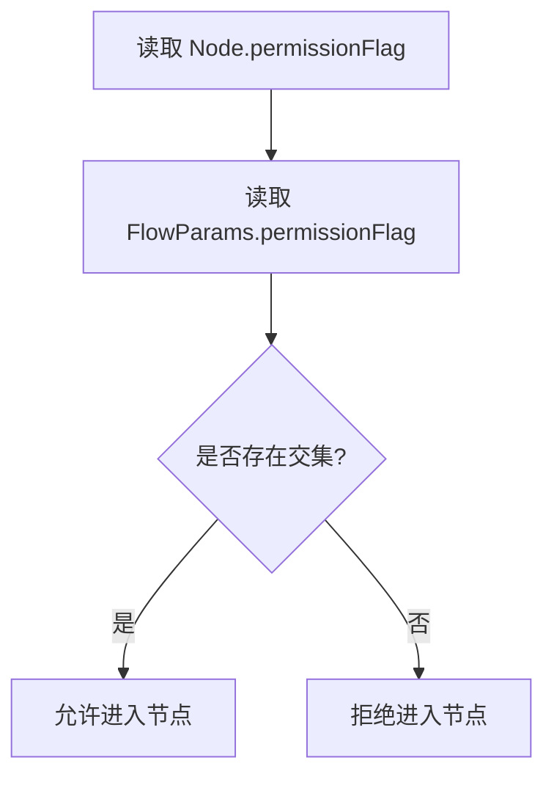
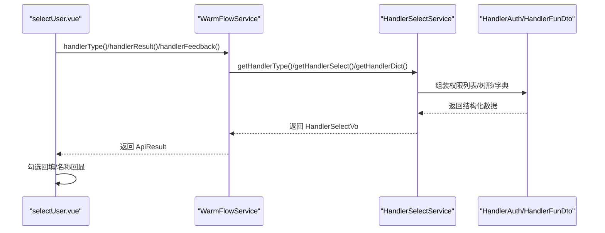
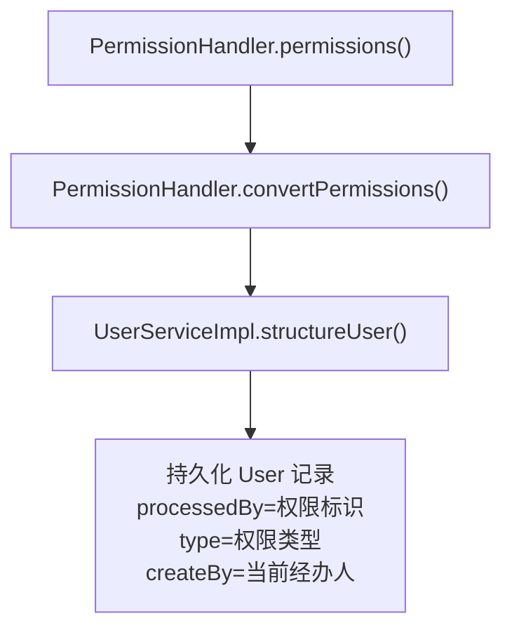
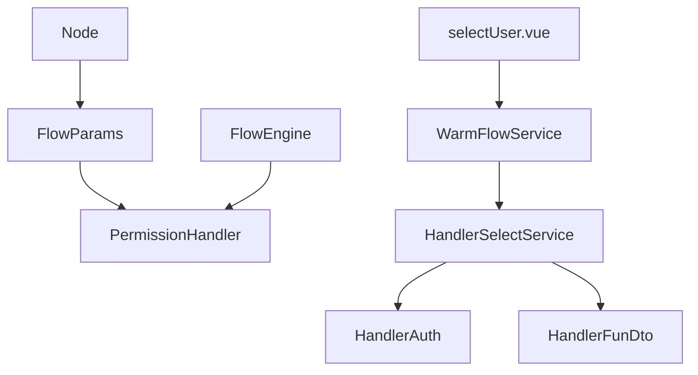

# 权限验证机制

<cite>
**本文引用的文件**
- [PermissionHandler.java](file://warm-flow-core/src/main/java/org/dromara/warm/flow/core/handler/PermissionHandler.java)
- [FlowParams.java](file://warm-flow-core/src/main/java/org/dromara/warm/flow/core/dto/FlowParams.java)
- [UserType.java](file://warm-flow-core/src/main/java/org/dromara/warm/flow/core/enums/UserType.java)
- [FlowEngine.java](file://warm-flow-core/src/main/java/org/dromara/warm/flow/core/FlowEngine.java)
- [Node.java](file://warm-flow-core/src/main/java/org/dromara/warm/flow/core/entity/Node.java)
- [UserServiceImpl.java](file://warm-flow-core/src/main/java/org/dromara/warm/flow/core/service/impl/UserServiceImpl.java)
- [HandlerAuth.java](file://warm-flow-plugin/warm-flow-plugin-ui/warm-flow-plugin-ui-core/src/main/java/org/dromara/warm/flow/ui/vo/HandlerAuth.java)
- [HandlerFunDto.java](file://warm-flow-plugin/warm-flow-plugin-ui/warm-flow-plugin-ui-core/src/main/java/org/dromara/warm/flow/ui/dto/HandlerFunDto.java)
- [HandlerSelectService.java](file://warm-flow-plugin/warm-flow-plugin-ui/warm-flow-plugin-ui-core/src/main/java/org/dromara/warm/flow/ui/service/HandlerSelectService.java)
- [WarmFlowService.java](file://warm-flow-plugin/warm-flow-plugin-ui/warm-flow-plugin-ui-core/src/main/java/org/dromara/warm/flow/ui/service/WarmFlowService.java)
- [HandlerQuery.java](file://warm-flow-plugin/warm-flow-plugin-ui/warm-flow-plugin-ui-core/src/main/java/org/dromara/warm/flow/ui/dto/HandlerQuery.java)
- [warm-flow_1.3.4.sql](file://sql/mysql/v1-upgrade/warm-flow_1.3.4.sql)
- [warm-flow_1.3.7.sql](file://sql/mysql/v1-upgrade/warm-flow_1.3.7.sql)
- [selectUser.vue](file://warm-flow-ui/src/components/design/common/vue/selectUser.vue)
- [nodeExtList.vue](file://warm-flow-ui/src/components/design/common/vue/nodeExtList.vue)
- [between.vue](file://warm-flow-ui/src/components/design/common/vue/between.vue)
</cite>

## 目录
1. [简介](#简介)
2. [项目结构](#项目结构)
3. [核心组件](#核心组件)
4. [架构总览](#架构总览)
5. [详细组件分析](#详细组件分析)
6. [依赖分析](#依赖分析)
7. [性能考虑](#性能考虑)
8. [故障排查指南](#故障排查指南)
9. [结论](#结论)
10. [附录](#附录)

## 简介
本文件面向 Warm-Flow 的权限验证机制，系统性阐述权限验证的整体架构与工作流程，涵盖用户认证、角色授权、权限检查等关键环节。重点解析 PermissionHandler 接口的设计理念与实现方式，说明 FlowParams 参数中的权限相关字段（permissionFlag 与 handler）的作用与使用方法；并结合 UserType 枚举与设计器侧的权限配置能力，给出可落地的配置示例与最佳实践，帮助开发者构建灵活且可靠的权限控制系统。

## 项目结构
围绕权限验证的关键模块分布如下：
- 核心层（warm-flow-core）
  - handler：权限处理器接口定义
  - dto：工作流参数封装（含权限字段）
  - enums：用户类型枚举
  - FlowEngine：引擎入口，负责初始化与注入权限处理器
  - entity：节点实体（包含节点级权限标识字段）
  - service.impl：用户权限持久化结构化工具
- 插件层（warm-flow-plugin-ui）
  - ui.vo / ui.dto / ui.service：设计器侧权限选择与回显的数据模型与服务
- 前端（warm-flow-ui）
  - selectUser.vue、nodeExtList.vue、between.vue：设计器界面中权限选择与交互
- SQL 升级脚本
  - warm-flow_1.3.4.sql、warm-flow_1.3.7.sql：节点权限标识字段的兼容性迁移

**图表来源**
- [PermissionHandler.java:30-56](file://warm-flow-core/src/main/java/org/dromara/warm/flow/core/handler/PermissionHandler.java#L30-L56)
- [FlowParams.java:33-336](file://warm-flow-core/src/main/java/org/dromara/warm/flow/core/dto/FlowParams.java#L33-L336)
- [UserType.java:29-70](file://warm-flow-core/src/main/java/org/dromara/warm/flow/core/enums/UserType.java#L29-L70)
- [FlowEngine.java:66-208](file://warm-flow-core/src/main/java/org/dromara/warm/flow/core/FlowEngine.java#L66-L208)
- [Node.java:94-96](file://warm-flow-core/src/main/java/org/dromara/warm/flow/core/entity/Node.java#L94-L96)
- [UserServiceImpl.java:145-160](file://warm-flow-core/src/main/java/org/dromara/warm/flow/core/service/impl/UserServiceImpl.java#L145-L160)
- [HandlerAuth.java:31-58](file://warm-flow-plugin/warm-flow-plugin-ui/warm-flow-plugin-ui-core/src/main/java/org/dromara/warm/flow/ui/vo/HandlerAuth.java#L31-L58)
- [HandlerFunDto.java:33-54](file://warm-flow-plugin/warm-flow-plugin-ui/warm-flow-plugin-ui-core/src/main/java/org/dromara/warm/flow/ui/dto/HandlerFunDto.java#L33-L54)
- [HandlerSelectService.java:96-115](file://warm-flow-plugin/warm-flow-plugin-ui/warm-flow-plugin-ui-core/src/main/java/org/dromara/warm/flow/ui/service/HandlerSelectService.java#L96-L115)
- [WarmFlowService.java:178-191](file://warm-flow-plugin/warm-flow-plugin-ui/warm-flow-plugin-ui-core/src/main/java/org/dromara/warm/flow/ui/service/WarmFlowService.java#L178-L191)
- [HandlerQuery.java:29-46](file://warm-flow-plugin/warm-flow-plugin-ui/warm-flow-plugin-ui-core/src/main/java/org/dromara/warm/flow/ui/dto/HandlerQuery.java#L29-L46)
- [selectUser.vue:180-213](file://warm-flow-ui/src/components/design/common/vue/selectUser.vue#L180-L213)
- [nodeExtList.vue:149-175](file://warm-flow-ui/src/components/design/common/vue/nodeExtList.vue#L149-L175)
- [between.vue:373-416](file://warm-flow-ui/src/components/design/common/vue/between.vue#L373-L416)

**章节来源**
- [PermissionHandler.java:30-56](file://warm-flow-core/src/main/java/org/dromara/warm/flow/core/handler/PermissionHandler.java#L30-L56)
- [FlowParams.java:33-336](file://warm-flow-core/src/main/java/org/dromara/warm/flow/core/dto/FlowParams.java#L33-L336)
- [UserType.java:29-70](file://warm-flow-core/src/main/java/org/dromara/warm/flow/core/enums/UserType.java#L29-L70)
- [FlowEngine.java:66-208](file://warm-flow-core/src/main/java/org/dromara/warm/flow/core/FlowEngine.java#L66-L208)
- [Node.java:94-96](file://warm-flow-core/src/main/java/org/dromara/warm/flow/core/entity/Node.java#L94-L96)
- [UserServiceImpl.java:145-160](file://warm-flow-core/src/main/java/org/dromara/warm/flow/core/service/impl/UserServiceImpl.java#L145-L160)
- [HandlerAuth.java:31-58](file://warm-flow-plugin/warm-flow-plugin-ui/warm-flow-plugin-ui-core/src/main/java/org/dromara/warm/flow/ui/vo/HandlerAuth.java#L31-L58)
- [HandlerFunDto.java:33-54](file://warm-flow-plugin/warm-flow-plugin-ui/warm-flow-plugin-ui-core/src/main/java/org/dromara/warm/flow/ui/dto/HandlerFunDto.java#L33-L54)
- [HandlerSelectService.java:96-115](file://warm-flow-plugin/warm-flow-plugin-ui/warm-flow-plugin-ui-core/src/main/java/org/dromara/warm/flow/ui/service/HandlerSelectService.java#L96-L115)
- [WarmFlowService.java:178-191](file://warm-flow-plugin/warm-flow-plugin-ui/warm-flow-plugin-ui-core/src/main/java/org/dromara/warm/flow/ui/service/WarmFlowService.java#L178-L191)
- [HandlerQuery.java:29-46](file://warm-flow-plugin/warm-flow-plugin-ui/warm-flow-plugin-ui-core/src/main/java/org/dromara/warm/flow/ui/dto/HandlerQuery.java#L29-L46)
- [selectUser.vue:180-213](file://warm-flow-ui/src/components/design/common/vue/selectUser.vue#L180-L213)
- [nodeExtList.vue:149-175](file://warm-flow-ui/src/components/design/common/vue/nodeExtList.vue#L149-L175)
- [between.vue:373-416](file://warm-flow-ui/src/components/design/common/vue/between.vue#L373-L416)

## 核心组件
- PermissionHandler 接口：定义权限标识集合与当前办理人标识的获取与转换能力，作为权限校验的统一入口。
- FlowParams 参数：承载流程执行时的权限相关字段（permissionFlag、handler），并在缺失时自动从 PermissionHandler 注入。
- FlowEngine 引擎：负责初始化并持有 PermissionHandler 实例，供 FlowParams 在运行时按需取值。
- UserType 枚举：定义流程用户类型（审批人、转办人、委托人），用于区分不同阶段的权限控制策略。
- Node 节点实体：包含节点级权限标识字段，用于在节点层面约束可办理人集合。
- 用户服务实现：提供将权限标识结构化为用户记录的能力，便于持久化与后续校验。
- 设计器侧 UI 模型与服务：提供权限选择、分组、回显与字典配置能力，支撑节点权限标识的可视化配置。

**章节来源**
- [PermissionHandler.java:30-56](file://warm-flow-core/src/main/java/org/dromara/warm/flow/core/handler/PermissionHandler.java#L30-L56)
- [FlowParams.java:33-336](file://warm-flow-core/src/main/java/org/dromara/warm/flow/core/dto/FlowParams.java#L33-L336)
- [FlowEngine.java:66-208](file://warm-flow-core/src/main/java/org/dromara/warm/flow/core/FlowEngine.java#L66-L208)
- [UserType.java:29-70](file://warm-flow-core/src/main/java/org/dromara/warm/flow/core/enums/UserType.java#L29-L70)
- [Node.java:94-96](file://warm-flow-core/src/main/java/org/dromara/warm/flow/core/entity/Node.java#L94-L96)
- [UserServiceImpl.java:145-160](file://warm-flow-core/src/main/java/org/dromara/warm/flow/core/service/impl/UserServiceImpl.java#L145-L160)

## 架构总览
权限验证的整体架构围绕“运行时注入 + 节点约束 + 设计器配置”展开：
- 运行时注入：FlowParams 在未显式设置时，自动从 FlowEngine 注入的 PermissionHandler 获取当前用户权限标识与办理人标识。
- 节点约束：Node 的 permissionFlag 字段存储节点级权限标识集合，流程推进时与 FlowParams 的 permissionFlag 做交集校验。
- 设计器配置：通过 HandlerSelectService 与 HandlerAuth/HandlerFunDto 等模型，支持多类型（用户/角色/部门等）权限选择与分组展示，并提供权限名称回显与字典表达式配置。

**图表来源**
- [WarmFlowService.java:178-191](file://warm-flow-plugin/warm-flow-plugin-ui/warm-flow-plugin-ui-core/src/main/java/org/dromara/warm/flow/ui/service/WarmFlowService.java#L178-L191)
- [HandlerSelectService.java:96-115](file://warm-flow-plugin/warm-flow-plugin-ui/warm-flow-plugin-ui-core/src/main/java/org/dromara/warm/flow/ui/service/HandlerSelectService.java#L96-L115)
- [HandlerAuth.java:31-58](file://warm-flow-plugin/warm-flow-plugin-ui/warm-flow-plugin-ui-core/src/main/java/org/dromara/warm/flow/ui/vo/HandlerAuth.java#L31-L58)
- [HandlerFunDto.java:33-54](file://warm-flow-plugin/warm-flow-plugin-ui/warm-flow-plugin-ui-core/src/main/java/org/dromara/warm/flow/ui/dto/HandlerFunDto.java#L33-L54)

## 详细组件分析

### PermissionHandler 接口设计与实现
- 设计理念
  - 将“谁可以办”和“当前是谁办”的决策权下沉至业务系统，通过统一接口抽象，保证 Warm-Flow 核心对权限细节无侵入。
  - 提供默认转换方法 convertPermissions，允许在设计器中预设的角色/部门等标识转换为最终用户标识集合。
- 关键方法
  - permissions()：返回当前用户的权限标识集合（permissionFlag），用于与节点级 permissionFlag 做交集校验。
  - getHandler()：返回当前办理人标识（handler），用于记录流程实例的经办人。
  - convertPermissions(List<String>)：默认直接返回原集合，可在实现中完成角色/部门到用户ID的转换。
- 实现建议
  - 在应用启动时通过 FlowEngine.initPermissionHandler 注册自定义实现。
  - 在 permissions() 中结合当前登录上下文与业务规则（如岗位、角色、部门）计算集合。
  - 在 convertPermissions() 中将角色/部门等标识映射为具体用户ID，确保最终入库与校验均基于用户维度。

**图表来源**
- [PermissionHandler.java:30-56](file://warm-flow-core/src/main/java/org/dromara/warm/flow/core/handler/PermissionHandler.java#L30-L56)
- [FlowParams.java:266-290](file://warm-flow-core/src/main/java/org/dromara/warm/flow/core/dto/FlowParams.java#L266-L290)
- [FlowEngine.java:206-208](file://warm-flow-core/src/main/java/org/dromara/warm/flow/core/FlowEngine.java#L206-L208)

**章节来源**
- [PermissionHandler.java:30-56](file://warm-flow-core/src/main/java/org/dromara/warm/flow/core/handler/PermissionHandler.java#L30-L56)
- [FlowParams.java:266-290](file://warm-flow-core/src/main/java/org/dromara/warm/flow/core/dto/FlowParams.java#L266-L290)
- [FlowEngine.java:188-208](file://warm-flow-core/src/main/java/org/dromara/warm/flow/core/FlowEngine.java#L188-L208)

### FlowParams 参数中的权限字段
- permissionFlag
  - 作用：与节点级 permissionFlag 做交集，决定是否允许当前用户在该节点发起或审批。
  - 获取策略：若未显式设置，FlowParams 会在运行时调用 FlowEngine.permissionHandler().permissions() 注入。
- handler
  - 作用：当前办理人唯一标识，通常为用户ID，用于记录流程实例的经办人。
  - 获取策略：若未显式设置，FlowParams 会在运行时调用 FlowEngine.permissionHandler().getHandler() 注入。
- 其他相关字段
  - ignore、ignoreDepute、ignoreCooperate：用于在特定场景下忽略权限校验或特殊处理（如委派、会签等）。
  - nextHandler、nextHandlerAppend：用于配置下一节点的办理人及追加/覆盖策略。

**图表来源**
- [FlowParams.java:266-290](file://warm-flow-core/src/main/java/org/dromara/warm/flow/core/dto/FlowParams.java#L266-L290)

**章节来源**
- [FlowParams.java:33-336](file://warm-flow-core/src/main/java/org/dromara/warm/flow/core/dto/FlowParams.java#L33-L336)

### 节点级权限标识与校验
- Node.permissionFlag
  - 存储节点级权限标识集合，通常由设计器配置，支持多种权限类型（用户/角色/部门等）。
  - 在流程推进时，与 FlowParams.permissionFlag 做交集，仅当存在交集时才允许进入该节点。
- SQL 升级脚本
  - 1.3.4.sql：清理历史占位符前缀，确保 permissionFlag 清晰可用。
  - 1.3.7.sql：将逗号分隔的标识替换为特定分隔符，提升解析稳定性。

**图表来源**
- [Node.java:94-96](file://warm-flow-core/src/main/java/org/dromara/warm/flow/core/entity/Node.java#L94-L96)
- [warm-flow_1.3.4.sql:1-2](file://sql/mysql/v1-upgrade/warm-flow_1.3.4.sql#L1-L2)
- [warm-flow_1.3.7.sql:1-1](file://sql/mysql/v1-upgrade/warm-flow_1.3.7.sql#L1-L1)

**章节来源**
- [Node.java:94-96](file://warm-flow-core/src/main/java/org/dromara/warm/flow/core/entity/Node.java#L94-L96)
- [warm-flow_1.3.4.sql:1-2](file://sql/mysql/v1-upgrade/warm-flow_1.3.4.sql#L1-L2)
- [warm-flow_1.3.7.sql:1-1](file://sql/mysql/v1-upgrade/warm-flow_1.3.7.sql#L1-L1)

### 不同用户类型的权限控制策略
- UserType 枚举
  - APPROVAL（审批人权限）：节点审批阶段的权限主体。
  - TRANSFER（转办人权限）：允许将任务转交给他人处理。
  - DEPUTE（委托人权限）：代表他人代为审批。
- 使用建议
  - 在流程推进时，根据当前阶段类型（审批/转办/委托）选择对应的权限策略。
  - 结合 FlowParams 的 ignoreDepute、ignoreCooperate 等开关，灵活控制特殊协作模式下的权限行为。

**章节来源**
- [UserType.java:29-70](file://warm-flow-core/src/main/java/org/dromara/warm/flow/core/enums/UserType.java#L29-L70)

### 设计器侧权限配置与回显
- HandlerSelectService
  - 通过 HandlerFunDto/HandlerAuth 等模型，将业务系统的权限数据转换为设计器可选的列表与树形结构。
  - 支持权限类型（handlerType）、名称（handlerName）、编码（handlerCode）等字段映射。
- WarmFlowService
  - 对外提供接口：获取权限类型列表、获取权限结果、权限名称回显、表达式字典等。
- 前端组件
  - selectUser.vue：权限选择面板，支持多标签页切换、搜索过滤、勾选回填。
  - nodeExtList.vue：节点扩展属性中权限字段的回显与联动。
  - between.vue：节点比例/条件配置描述与交互。

**图表来源**
- [selectUser.vue:180-213](file://warm-flow-ui/src/components/design/common/vue/selectUser.vue#L180-L213)
- [nodeExtList.vue:149-175](file://warm-flow-ui/src/components/design/common/vue/nodeExtList.vue#L149-L175)
- [between.vue:373-416](file://warm-flow-ui/src/components/design/common/vue/between.vue#L373-L416)
- [WarmFlowService.java:178-191](file://warm-flow-plugin/warm-flow-plugin-ui/warm-flow-plugin-ui-core/src/main/java/org/dromara/warm/flow/ui/service/WarmFlowService.java#L178-L191)
- [HandlerSelectService.java:96-115](file://warm-flow-plugin/warm-flow-plugin-ui/warm-flow-plugin-ui-core/src/main/java/org/dromara/warm/flow/ui/service/HandlerSelectService.java#L96-L115)
- [HandlerAuth.java:31-58](file://warm-flow-plugin/warm-flow-plugin-ui/warm-flow-plugin-ui-core/src/main/java/org/dromara/warm/flow/ui/vo/HandlerAuth.java#L31-L58)
- [HandlerFunDto.java:33-54](file://warm-flow-plugin/warm-flow-plugin-ui/warm-flow-plugin-ui-core/src/main/java/org/dromara/warm/flow/ui/dto/HandlerFunDto.java#L33-L54)

**章节来源**
- [selectUser.vue:180-213](file://warm-flow-ui/src/components/design/common/vue/selectUser.vue#L180-L213)
- [nodeExtList.vue:149-175](file://warm-flow-ui/src/components/design/common/vue/nodeExtList.vue#L149-L175)
- [between.vue:373-416](file://warm-flow-ui/src/components/design/common/vue/between.vue#L373-L416)
- [WarmFlowService.java:178-191](file://warm-flow-plugin/warm-flow-plugin-ui/warm-flow-plugin-ui-core/src/main/java/org/dromara/warm/flow/ui/service/WarmFlowService.java#L178-L191)
- [HandlerSelectService.java:96-115](file://warm-flow-plugin/warm-flow-plugin-ui/warm-flow-plugin-ui-core/src/main/java/org/dromara/warm/flow/ui/service/HandlerSelectService.java#L96-L115)
- [HandlerAuth.java:31-58](file://warm-flow-plugin/warm-flow-plugin-ui/warm-flow-plugin-ui-core/src/main/java/org/dromara/warm/flow/ui/vo/HandlerAuth.java#L31-L58)
- [HandlerFunDto.java:33-54](file://warm-flow-plugin/warm-flow-plugin-ui/warm-flow-plugin-ui-core/src/main/java/org/dromara/warm/flow/ui/dto/HandlerFunDto.java#L33-L54)

### 权限标识的生成与持久化
- 权限标识生成
  - 在 PermissionHandler.permissions() 中生成当前用户的权限标识集合。
  - 在 convertPermissions() 中将角色/部门等标识转换为用户ID。
- 持久化结构
  - 通过 UserServiceImpl.structureUser 将权限标识结构化为用户记录，便于后续查询与校验。
  - handler 字段通常用于记录创建人或经办人，processedBy 记录权限标识，type 记录权限类型（如用户/角色/部门）。

**图表来源**
- [PermissionHandler.java:30-56](file://warm-flow-core/src/main/java/org/dromara/warm/flow/core/handler/PermissionHandler.java#L30-L56)
- [UserServiceImpl.java:145-160](file://warm-flow-core/src/main/java/org/dromara/warm/flow/core/service/impl/UserServiceImpl.java#L145-L160)

**章节来源**
- [PermissionHandler.java:30-56](file://warm-flow-core/src/main/java/org/dromara/warm/flow/core/handler/PermissionHandler.java#L30-L56)
- [UserServiceImpl.java:145-160](file://warm-flow-core/src/main/java/org/dromara/warm/flow/core/service/impl/UserServiceImpl.java#L145-L160)

## 依赖分析
- 组件耦合
  - FlowParams 依赖 PermissionHandler（运行时注入）。
  - FlowEngine 持有 PermissionHandler 并对外提供访问。
  - Node 与 FlowParams 通过 permissionFlag 建立运行时校验关系。
  - 设计器服务与 UI 组件通过 HandlerSelectService/HandlerAuth/HandlerFunDto 串联权限数据。
- 外部依赖
  - 前端 Vue 组件依赖后端 WarmFlowService 提供的接口。
  - SQL 升级脚本影响节点权限标识字段的存储格式与兼容性。

**图表来源**
- [FlowParams.java:266-290](file://warm-flow-core/src/main/java/org/dromara/warm/flow/core/dto/FlowParams.java#L266-L290)
- [FlowEngine.java:206-208](file://warm-flow-core/src/main/java/org/dromara/warm/flow/core/FlowEngine.java#L206-L208)
- [Node.java:94-96](file://warm-flow-core/src/main/java/org/dromara/warm/flow/core/entity/Node.java#L94-L96)
- [WarmFlowService.java:178-191](file://warm-flow-plugin/warm-flow-plugin-ui/warm-flow-plugin-ui-core/src/main/java/org/dromara/warm/flow/ui/service/WarmFlowService.java#L178-L191)
- [HandlerSelectService.java:96-115](file://warm-flow-plugin/warm-flow-plugin-ui/warm-flow-plugin-ui-core/src/main/java/org/dromara/warm/flow/ui/service/HandlerSelectService.java#L96-L115)
- [HandlerAuth.java:31-58](file://warm-flow-plugin/warm-flow-plugin-ui/warm-flow-plugin-ui-core/src/main/java/org/dromara/warm/flow/ui/vo/HandlerAuth.java#L31-L58)
- [HandlerFunDto.java:33-54](file://warm-flow-plugin/warm-flow-plugin-ui/warm-flow-plugin-ui-core/src/main/java/org/dromara/warm/flow/ui/dto/HandlerFunDto.java#L33-L54)
- [selectUser.vue:180-213](file://warm-flow-ui/src/components/design/common/vue/selectUser.vue#L180-L213)

**章节来源**
- [FlowParams.java:266-290](file://warm-flow-core/src/main/java/org/dromara/warm/flow/core/dto/FlowParams.java#L266-L290)
- [FlowEngine.java:206-208](file://warm-flow-core/src/main/java/org/dromara/warm/flow/core/FlowEngine.java#L206-L208)
- [Node.java:94-96](file://warm-flow-core/src/main/java/org/dromara/warm/flow/core/entity/Node.java#L94-L96)
- [WarmFlowService.java:178-191](file://warm-flow-plugin/warm-flow-plugin-ui/warm-flow-plugin-ui-core/src/main/java/org/dromara/warm/flow/ui/service/WarmFlowService.java#L178-L191)
- [HandlerSelectService.java:96-115](file://warm-flow-plugin/warm-flow-plugin-ui/warm-flow-plugin-ui-core/src/main/java/org/dromara/warm/flow/ui/service/HandlerSelectService.java#L96-L115)
- [HandlerAuth.java:31-58](file://warm-flow-plugin/warm-flow-plugin-ui/warm-flow-plugin-ui-core/src/main/java/org/dromara/warm/flow/ui/vo/HandlerAuth.java#L31-L58)
- [HandlerFunDto.java:33-54](file://warm-flow-plugin/warm-flow-plugin-ui/warm-flow-plugin-ui-core/src/main/java/org/dromara/warm/flow/ui/dto/HandlerFunDto.java#L33-L54)
- [selectUser.vue:180-213](file://warm-flow-ui/src/components/design/common/vue/selectUser.vue#L180-L213)

## 性能考虑
- 权限注入懒加载：FlowParams 在首次访问 permissionFlag/handler 时才触发 PermissionHandler 注入，避免不必要的开销。
- 缓存友好：建议在 PermissionHandler 实现中对用户权限集合进行缓存，减少频繁查询。
- SQL 解析优化：升级脚本已规范化 permissionFlag 分隔符，有利于后续解析与索引优化。
- 前端回显：权限名称回显与字典配置应尽量批量请求与本地缓存，降低网络与渲染压力。

## 故障排查指南
- 权限标识为空
  - 检查 FlowEngine 是否正确初始化 PermissionHandler。
  - 确认 FlowParams 未被显式覆盖导致注入失效。
- 节点无法进入
  - 核对 Node.permissionFlag 与 FlowParams.permissionFlag 是否存在交集。
  - 检查 SQL 升级脚本是否执行，确认字段格式正确。
- 设计器权限列表为空
  - 检查 WarmFlowService 的 HandlerSelectService 实现是否正确返回数据。
  - 确认 HandlerFunDto 的字段映射函数（storageId/handlerCode）是否正确。
- 表达式字典无效
  - 检查 WarmFlowService 的 handlerDict 接口返回值，确保默认表达式与业务表达式配置正确。

**章节来源**
- [FlowEngine.java:188-208](file://warm-flow-core/src/main/java/org/dromara/warm/flow/core/FlowEngine.java#L188-L208)
- [FlowParams.java:266-290](file://warm-flow-core/src/main/java/org/dromara/warm/flow/core/dto/FlowParams.java#L266-L290)
- [Node.java:94-96](file://warm-flow-core/src/main/java/org/dromara/warm/flow/core/entity/Node.java#L94-L96)
- [WarmFlowService.java:222-245](file://warm-flow-plugin/warm-flow-plugin-ui/warm-flow-plugin-ui-core/src/main/java/org/dromara/warm/flow/ui/service/WarmFlowService.java#L222-L245)
- [HandlerSelectService.java:96-115](file://warm-flow-plugin/warm-flow-plugin-ui/warm-flow-plugin-ui-core/src/main/java/org/dromara/warm/flow/ui/service/HandlerSelectService.java#L96-L115)

## 结论
Warm-Flow 的权限验证机制以 PermissionHandler 为核心，通过 FlowParams 的懒加载注入与 Node 的节点级权限标识，形成“运行时注入 + 节点约束”的双层保障。配合设计器侧的权限选择、分组与回显能力，实现了从配置到执行的完整闭环。遵循本文的最佳实践与排障建议，可帮助团队快速搭建稳定、可维护的权限控制系统。

## 附录
- 配置示例（步骤说明）
  - 启动时注册 PermissionHandler：调用 FlowEngine.initPermissionHandler，传入实现类全限定名或通过容器注入。
  - 在业务系统中实现 PermissionHandler.permissions() 与 getHandler()，确保返回值与业务上下文一致。
  - 在设计器中配置节点的 permissionFlag，选择用户/角色/部门等类型，并通过 HandlerSelectService 回显名称。
  - 如需角色/部门转用户，实现 convertPermissions() 完成映射。
  - 执行流程时，若未显式设置 FlowParams.permissionFlag/handler，将自动从 PermissionHandler 注入。
- 最佳实践
  - 将权限标识与用户ID解耦，优先使用用户维度进行校验与持久化。
  - 对权限集合进行缓存，减少重复查询。
  - 在节点配置中尽量使用清晰的权限类型与分组，便于维护与审计。
  - 利用 ignoreDepute/ignoreCooperate 等开关，合理控制协作场景下的权限策略。