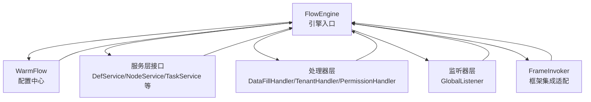
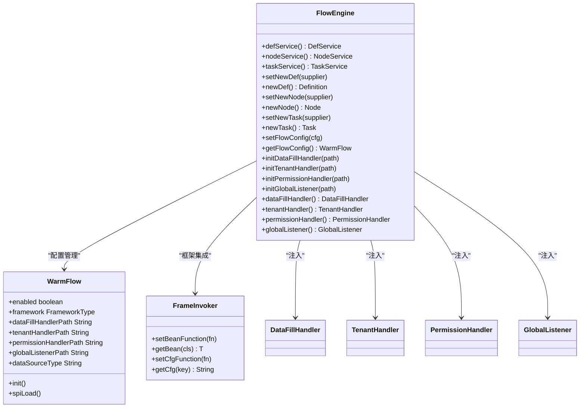
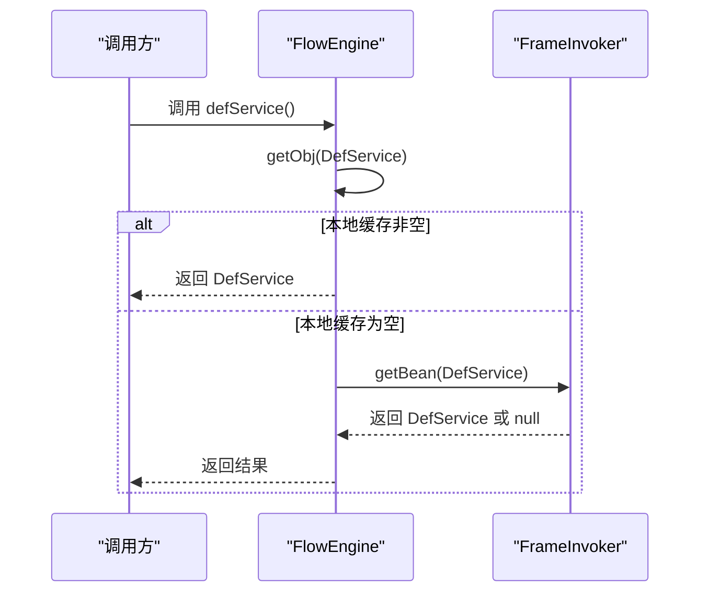
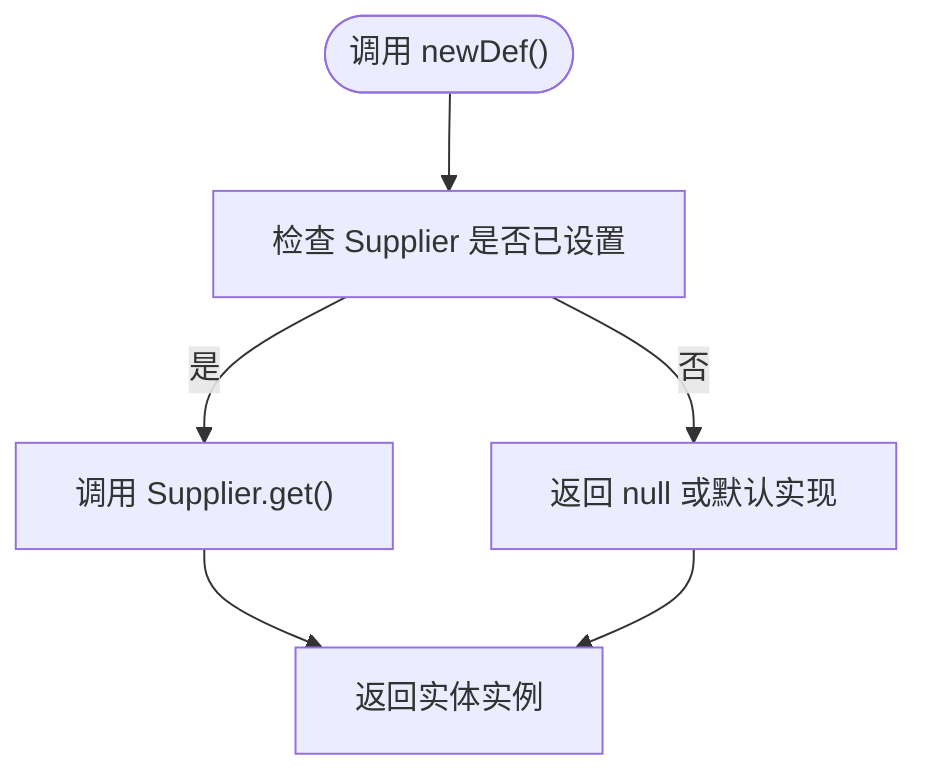
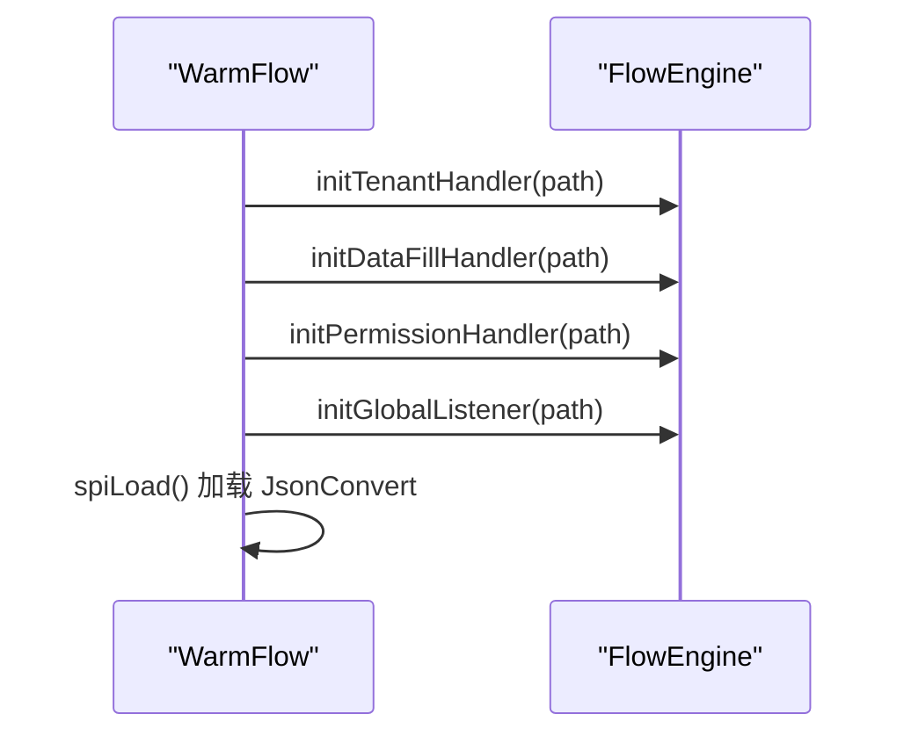
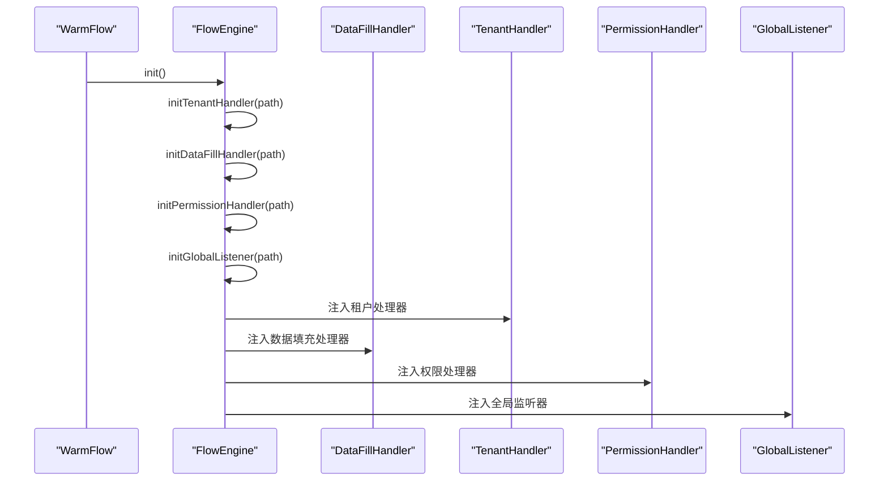
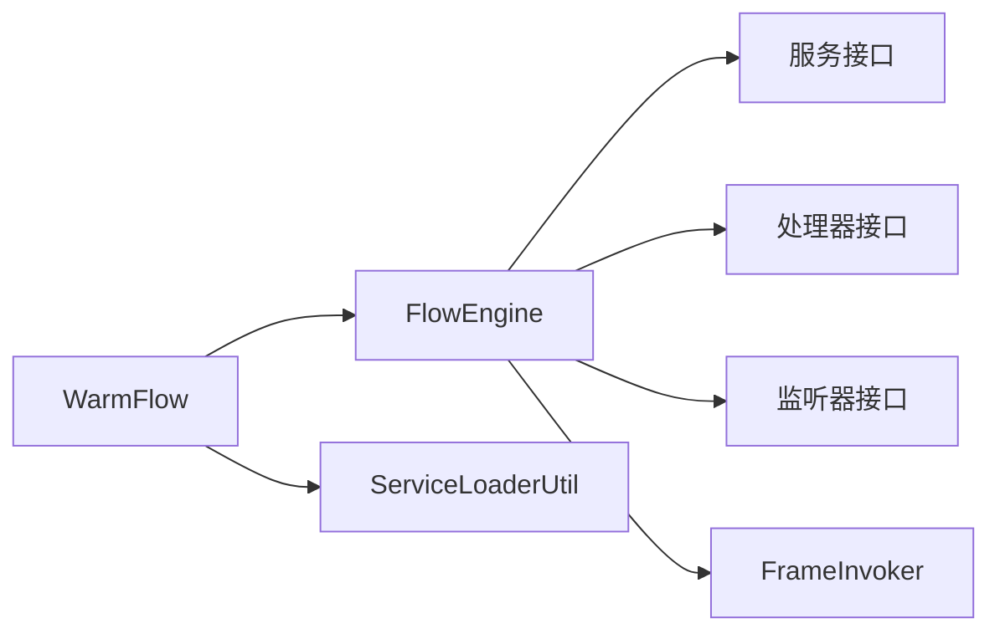

# FlowEngine 设计与实现

<cite>
**本文档引用的文件**
- [FlowEngine.java](file://warm-flow-core/src/main/java/org/dromara/warm/flow/core/FlowEngine.java)
- [WarmFlow.java](file://warm-flow-core/src/main/java/org/dromara/warm/flow/core/config/WarmFlow.java)
- [DefService.java](file://warm-flow-core/src/main/java/org/dromara/warm/flow/core/service/DefService.java)
- [NodeService.java](file://warm-flow-core/src/main/java/org/dromara/warm/flow/core/service/NodeService.java)
- [TaskService.java](file://warm-flow-core/src/main/java/org/dromara/warm/flow/core/service/TaskService.java)
- [DataFillHandler.java](file://warm-flow-core/src/main/java/org/dromara/warm/flow/core/handler/DataFillHandler.java)
- [TenantHandler.java](file://warm-flow-core/src/main/java/org/dromara/warm/flow/core/handler/TenantHandler.java)
- [PermissionHandler.java](file://warm-flow-core/src/main/java/org/dromara/warm/flow/core/handler/PermissionHandler.java)
- [GlobalListener.java](file://warm-flow-core/src/main/java/org/dromara/warm/flow/core/listener/GlobalListener.java)
- [FrameInvoker.java](file://warm-flow-core/src/main/java/org/dromara/warm/flow/core/invoker/FrameInvoker.java)
- [ServiceLoaderUtil.java](file://warm-flow-core/src/main/java/org/dromara/warm/flow/core/utils/ServiceLoaderUtil.java)
- [Definition.java](file://warm-flow-core/src/main/java/org/dromara/warm/flow/core/entity/Definition.java)
</cite>

## 目录
1. [简介](#简介)
2. [项目结构](#项目结构)
3. [核心组件](#核心组件)
4. [架构总览](#架构总览)
5. [详细组件分析](#详细组件分析)
6. [依赖分析](#依赖分析)
7. [性能考虑](#性能考虑)
8. [故障排查指南](#故障排查指南)
9. [结论](#结论)
10. [附录](#附录)

## 简介
本文件围绕 FlowEngine 类展开，系统化阐述其作为工作流引擎入口的设计思想与实现原理。重点包括：
- 静态工厂方法的设计模式与服务获取机制
- 实体供应器（Supplier）模式的应用与扩展性
- 配置管理机制（WarmFlow 的设置与获取）
- 处理器初始化流程（DataFillHandler、TenantHandler、PermissionHandler、GlobalListener 的注入）
- 使用示例与最佳实践

## 项目结构
FlowEngine 位于核心模块 warm-flow-core 中，围绕它形成的服务层、处理器层、监听器层与配置层共同构成引擎入口的完整生态。

图表来源
- [FlowEngine.java:1-270](file://warm-flow-core/src/main/java/org/dromara/warm/flow/core/FlowEngine.java#L1-L270)
- [WarmFlow.java:1-174](file://warm-flow-core/src/main/java/org/dromara/warm/flow/core/config/WarmFlow.java#L1-L174)

章节来源
- [FlowEngine.java:1-270](file://warm-flow-core/src/main/java/org/dromara/warm/flow/core/FlowEngine.java#L1-L270)
- [WarmFlow.java:1-174](file://warm-flow-core/src/main/java/org/dromara/warm/flow/core/config/WarmFlow.java#L1-L174)

## 核心组件
- 静态服务工厂方法：defService()、nodeService()、taskService() 等，统一从框架或本地缓存获取服务实例。
- 实体供应器（Supplier）模式：setNewXxx() 与 newXxx() 方法族，支持按需替换实体构造策略。
- 配置中心：WarmFlow 提供引擎运行期配置项，包括数据源类型、处理器与监听器路径、UI 开关等。
- 处理器初始化：initXxxHandler() 系列方法负责注入数据填充、租户、权限与全局监听器。
- 框架集成适配：FrameInvoker 提供统一的 Bean 获取与配置读取能力，支持 Spring Boot/Solon 等环境。

章节来源
- [FlowEngine.java:72-106](file://warm-flow-core/src/main/java/org/dromara/warm/flow/core/FlowEngine.java#L72-L106)
- [FlowEngine.java:108-170](file://warm-flow-core/src/main/java/org/dromara/warm/flow/core/FlowEngine.java#L108-L170)
- [FlowEngine.java:172-194](file://warm-flow-core/src/main/java/org/dromara/warm/flow/core/FlowEngine.java#L172-L194)
- [WarmFlow.java:130-157](file://warm-flow-core/src/main/java/org/dromara/warm/flow/core/config/WarmFlow.java#L130-L157)

## 架构总览
FlowEngine 采用“静态入口 + 框架适配 + SPI 注入”的架构设计，既保证调用简洁，又兼顾扩展与多框架兼容。

图表来源
- [FlowEngine.java:1-270](file://warm-flow-core/src/main/java/org/dromara/warm/flow/core/FlowEngine.java#L1-L270)
- [WarmFlow.java:1-174](file://warm-flow-core/src/main/java/org/dromara/warm/flow/core/config/WarmFlow.java#L1-L174)
- [FrameInvoker.java:1-72](file://warm-flow-core/src/main/java/org/dromara/warm/flow/core/invoker/FrameInvoker.java#L1-L72)

## 详细组件分析

### 静态工厂方法与服务获取
- 设计思想：通过静态方法暴露服务实例，避免外部直接依赖具体实现，降低耦合度。
- 实现机制：getObj() 在本地缓存为空时，委托 FrameInvoker.getBean() 从框架容器中获取；若仍未获取到，则返回 null，调用方需确保框架已正确装配。
- 适用范围：defService()、nodeService()、skipService()、insService()、taskService()、hisTaskService()、userService()、formService()、chartService()。

图表来源
- [FlowEngine.java:231-237](file://warm-flow-core/src/main/java/org/dromara/warm/flow/core/FlowEngine.java#L231-L237)
- [FrameInvoker.java:46-52](file://warm-flow-core/src/main/java/org/dromara/warm/flow/core/invoker/FrameInvoker.java#L46-L52)

章节来源
- [FlowEngine.java:72-106](file://warm-flow-core/src/main/java/org/dromara/warm/flow/core/FlowEngine.java#L72-L106)
- [FlowEngine.java:231-237](file://warm-flow-core/src/main/java/org/dromara/warm/flow/core/FlowEngine.java#L231-L237)
- [FrameInvoker.java:25-52](file://warm-flow-core/src/main/java/org/dromara/warm/flow/core/invoker/FrameInvoker.java#L25-L52)

### 实体供应器（Supplier）模式
- 设计思想：通过 setNewXxx() 注入 Supplier，newXxx() 统一创建实体实例，便于替换实现或扩展行为。
- 应用范围：newDef()、newNode()、newSkip()、newIns()、newTask()、newHisTask()、newUser()、newForm()。
- 扩展性：可在启动阶段替换默认实体构造策略，例如引入自定义 ID 生成、扩展字段填充等。

图表来源
- [FlowEngine.java:108-114](file://warm-flow-core/src/main/java/org/dromara/warm/flow/core/FlowEngine.java#L108-L114)
- [Definition.java:177-194](file://warm-flow-core/src/main/java/org/dromara/warm/flow/core/entity/Definition.java#L177-L194)

章节来源
- [FlowEngine.java:108-170](file://warm-flow-core/src/main/java/org/dromara/warm/flow/core/FlowEngine.java#L108-L170)
- [Definition.java:177-194](file://warm-flow-core/src/main/java/org/dromara/warm/flow/core/entity/Definition.java#L177-L194)

### 配置管理机制（WarmFlow）
- WarmFlow 提供丰富的运行期配置项，如 enabled、framework、keyType、logicDelete、tokenName、ui、dataSourceType 等。
- 初始化流程：WarmFlow.init() 自动调用 FlowEngine 的处理器初始化方法，并通过 SPI 机制加载 JsonConvert 实现。
- 数据源类型：dataSourceType 可强制覆盖数据源类型，便于不同 ORM 层的差异化适配。

图表来源
- [WarmFlow.java:130-157](file://warm-flow-core/src/main/java/org/dromara/warm/flow/core/config/WarmFlow.java#L130-L157)
- [FlowEngine.java:180-194](file://warm-flow-core/src/main/java/org/dromara/warm/flow/core/FlowEngine.java#L180-L194)

章节来源
- [WarmFlow.java:36-157](file://warm-flow-core/src/main/java/org/dromara/warm/flow/core/config/WarmFlow.java#L36-L157)
- [FlowEngine.java:172-194](file://warm-flow-core/src/main/java/org/dromara/warm/flow/core/FlowEngine.java#L172-L194)

### 处理器初始化流程
- DataFillHandler：负责 ID 填充、插入/更新时间与操作人填充，必要时通过 PermissionHandler 获取当前处理人。
- TenantHandler：提供租户 ID，贯穿实体持久化与查询过滤。
- PermissionHandler：提供权限标识与当前处理人标识，用于权限校验与任务归属。
- GlobalListener：全局监听器，支持任务生命周期事件回调（开始、分派、完成、创建）。

图表来源
- [WarmFlow.java:130-157](file://warm-flow-core/src/main/java/org/dromara/warm/flow/core/config/WarmFlow.java#L130-L157)
- [FlowEngine.java:180-222](file://warm-flow-core/src/main/java/org/dromara/warm/flow/core/FlowEngine.java#L180-L222)
- [DataFillHandler.java:35-104](file://warm-flow-core/src/main/java/org/dromara/warm/flow/core/handler/DataFillHandler.java#L35-L104)
- [TenantHandler.java:23-32](file://warm-flow-core/src/main/java/org/dromara/warm/flow/core/handler/TenantHandler.java#L23-L32)
- [PermissionHandler.java:30-55](file://warm-flow-core/src/main/java/org/dromara/warm/flow/core/handler/PermissionHandler.java#L30-L55)
- [GlobalListener.java:26-80](file://warm-flow-core/src/main/java/org/dromara/warm/flow/core/listener/GlobalListener.java#L26-L80)

章节来源
- [DataFillHandler.java:35-104](file://warm-flow-core/src/main/java/org/dromara/warm/flow/core/handler/DataFillHandler.java#L35-L104)
- [TenantHandler.java:23-32](file://warm-flow-core/src/main/java/org/dromara/warm/flow/core/handler/TenantHandler.java#L23-L32)
- [PermissionHandler.java:30-55](file://warm-flow-core/src/main/java/org/dromara/warm/flow/core/handler/PermissionHandler.java#L30-L55)
- [GlobalListener.java:26-80](file://warm-flow-core/src/main/java/org/dromara/warm/flow/core/listener/GlobalListener.java#L26-L80)

### 框架集成与 SPI 注入
- FrameInvoker：提供 setBeanFunction()/getBean() 与 setCfgFunction()/getCfg()，用于桥接不同框架（Spring Boot/Solon）的 Bean 获取与配置读取。
- ServiceLoaderUtil：通过 SPI 机制加载 JsonConvert 实现，提升插件化能力。

章节来源
- [FrameInvoker.java:25-71](file://warm-flow-core/src/main/java/org/dromara/warm/flow/core/invoker/FrameInvoker.java#L25-L71)
- [ServiceLoaderUtil.java:36-91](file://warm-flow-core/src/main/java/org/dromara/warm/flow/core/utils/ServiceLoaderUtil.java#L36-L91)
- [WarmFlow.java:154-157](file://warm-flow-core/src/main/java/org/dromara/warm/flow/core/config/WarmFlow.java#L154-L157)

## 依赖分析
- FlowEngine 对服务接口（DefService/NodeService/TaskService 等）采用静态工厂方法访问，实际实现由框架容器提供。
- 处理器与监听器通过 WarmFlow 配置路径注入，支持运行期替换。
- SPI 机制用于加载 JSON 转换策略，增强扩展性。

图表来源
- [FlowEngine.java:1-270](file://warm-flow-core/src/main/java/org/dromara/warm/flow/core/FlowEngine.java#L1-L270)
- [WarmFlow.java:1-174](file://warm-flow-core/src/main/java/org/dromara/warm/flow/core/config/WarmFlow.java#L1-L174)
- [ServiceLoaderUtil.java:1-150](file://warm-flow-core/src/main/java/org/dromara/warm/flow/core/utils/ServiceLoaderUtil.java#L1-L150)

章节来源
- [FlowEngine.java:1-270](file://warm-flow-core/src/main/java/org/dromara/warm/flow/core/FlowEngine.java#L1-L270)
- [WarmFlow.java:1-174](file://warm-flow-core/src/main/java/org/dromara/warm/flow/core/config/WarmFlow.java#L1-L174)

## 性能考虑
- 服务获取：getObj() 优先使用本地缓存，减少框架查找开销；建议在应用启动阶段完成服务注册，避免运行期频繁反射。
- 实体构造：Supplier 模式允许延迟初始化与复用，建议结合对象池或轻量级工厂优化高频创建场景。
- 处理器链路：DataFillHandler/PermissionHandler/GlobalListener 的调用应尽量保持无阻塞与幂等，避免影响流程吞吐。
- SPI 加载：仅在 WarmFlow.init() 中触发一次，避免重复加载带来的额外成本。

## 故障排查指南
- 服务为空：确认框架容器已注册对应服务 Bean，或在 FlowEngine.getObj() 前设置本地缓存。
- 处理器未生效：检查 WarmFlow 配置中的处理器路径是否正确，或在启动阶段显式调用 initXxxHandler()。
- 数据源类型异常：核对 WarmFlow.dataSourceType 配置，确保与实际数据源一致。
- JSON 转换异常：确认 SPI 配置文件已正确放置于 META-INF/services 下，或通过 WarmFlow.spiLoad() 成功加载实现。

章节来源
- [FlowEngine.java:231-237](file://warm-flow-core/src/main/java/org/dromara/warm/flow/core/FlowEngine.java#L231-L237)
- [WarmFlow.java:130-157](file://warm-flow-core/src/main/java/org/dromara/warm/flow/core/config/WarmFlow.java#L130-L157)

## 结论
FlowEngine 通过静态工厂方法、实体供应器模式与配置驱动的处理器注入，构建了简洁而强大的引擎入口。配合 FrameInvoker 与 SPI 机制，既能满足多框架集成需求，又能灵活扩展业务能力。建议在项目启动阶段完成 WarmFlow 初始化与处理器注入，确保运行期稳定与高效。

## 附录

### 使用示例与最佳实践
- 启动阶段初始化
  - 设置 WarmFlow 配置并调用 init()，自动注入处理器与监听器。
  - 如需自定义实体构造，使用 setNewXxx() 注入 Supplier。
- 运行期调用
  - 通过静态工厂方法获取服务实例，避免直接依赖框架容器。
  - 在业务流程中优先使用 FlowEngine 的工具方法（如 dataFillHandler()/permissionHandler()）。
- 最佳实践
  - 将处理器实现类置于可扫描包内，或通过 WarmFlow 配置路径显式指定。
  - 对高频创建的实体使用 Supplier 模式，结合对象池降低 GC 压力。
  - 严格区分租户数据与公共数据，确保 TenantHandler 正确返回租户 ID。

章节来源
- [WarmFlow.java:130-157](file://warm-flow-core/src/main/java/org/dromara/warm/flow/core/config/WarmFlow.java#L130-L157)
- [FlowEngine.java:108-170](file://warm-flow-core/src/main/java/org/dromara/warm/flow/core/FlowEngine.java#L108-L170)
- [DataFillHandler.java:35-104](file://warm-flow-core/src/main/java/org/dromara/warm/flow/core/handler/DataFillHandler.java#L35-L104)
- [TenantHandler.java:23-32](file://warm-flow-core/src/main/java/org/dromara/warm/flow/core/handler/TenantHandler.java#L23-L32)
- [PermissionHandler.java:30-55](file://warm-flow-core/src/main/java/org/dromara/warm/flow/core/handler/PermissionHandler.java#L30-L55)
- [GlobalListener.java:26-80](file://warm-flow-core/src/main/java/org/dromara/warm/flow/core/listener/GlobalListener.java#L26-L80)