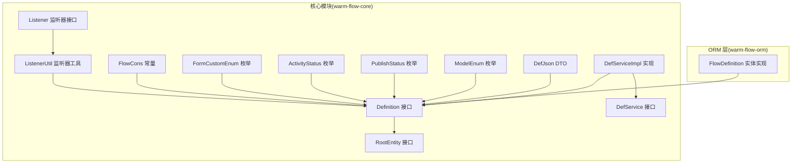
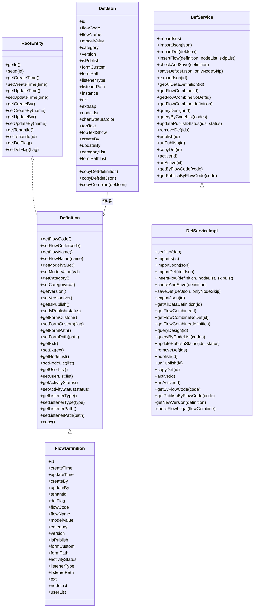
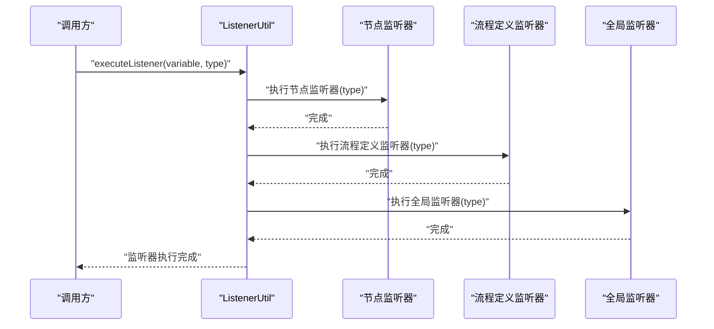
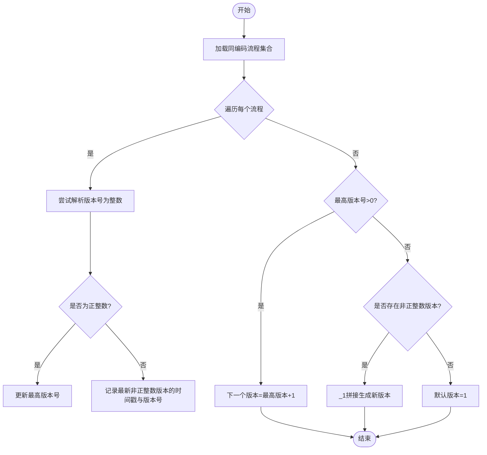
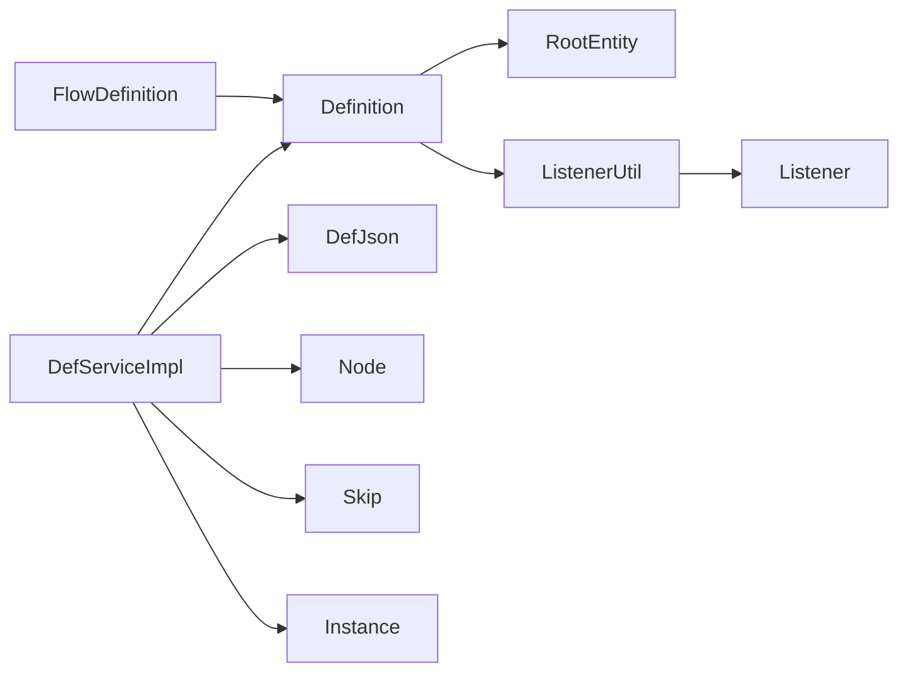

# Definition（流程定义）实体

<cite>
**本文引用的文件**
- [Definition.java](file://warm-flow-core/src/main/java/org/dromara/warm/flow/core/entity/Definition.java)
- [RootEntity.java](file://warm-flow-core/src/main/java/org/dromara/warm/flow/core/entity/RootEntity.java)
- [FlowDefinition.java](file://warm-flow-orm/warm-flow-mybatis-plus/warm-flow-mybatis-plus-core/src/main/java/org/dromara/warm/flow/orm/entity/FlowDefinition.java)
- [DefService.java](file://warm-flow-core/src/main/java/org/dromara/warm/flow/core/service/DefService.java)
- [DefServiceImpl.java](file://warm-flow-core/src/main/java/org/dromara/warm/flow/core/service/impl/DefServiceImpl.java)
- [DefJson.java](file://warm-flow-core/src/main/java/org/dromara/warm/flow/core/dto/DefJson.java)
- [ModelEnum.java](file://warm-flow-core/src/main/java/org/dromara/warm/flow/core/enums/ModelEnum.java)
- [PublishStatus.java](file://warm-flow-core/src/main/java/org/dromara/warm/flow/core/enums/PublishStatus.java)
- [ActivityStatus.java](file://warm-flow-core/src/main/java/org/dromara/warm/flow/core/enums/ActivityStatus.java)
- [FormCustomEnum.java](file://warm-flow-core/src/main/java/org/dromara/warm/flow/core/enums/FormCustomEnum.java)
- [FlowCons.java](file://warm-flow-core/src/main/java/org/dromara/warm/flow/core/constant/FlowCons.java)
- [Listener.java](file://warm-flow-core/src/main/java/org/dromara/warm/flow/core/listener/Listener.java)
- [ListenerUtil.java](file://warm-flow-core/src/main/java/org/dromara/warm/flow/core/utils/ListenerUtil.java)
</cite>

## 目录
1. [简介](#简介)
2. [项目结构](#项目结构)
3. [核心组件](#核心组件)
4. [架构总览](#架构总览)
5. [详细组件分析](#详细组件分析)
6. [依赖分析](#依赖分析)
7. [性能考虑](#性能考虑)
8. [故障排查指南](#故障排查指南)
9. [结论](#结论)
10. [附录](#附录)

## 简介
Definition（流程定义）实体是工作流引擎的核心数据模型之一，用于描述一个可运行流程的“蓝图”。它不仅承载流程的基本元数据（编码、名称、分类、版本号），还包含设计器模型、发布状态、表单定制策略、表单路径、扩展信息、监听器配置以及流程激活状态等关键属性。通过 Definition，系统可以实现流程的创建、复制、发布与状态管理，并驱动流程实例在运行期按定义的节点与连线进行流转。

## 项目结构
Definition 属于核心领域模型，位于 warm-flow-core 模块中，同时在 ORM 层提供了具体实现类 FlowDefinition。服务层通过 DefService/DefServiceImpl 提供对 Definition 的增删改查、导入导出、发布/取消发布、激活/挂起、复制等功能。

图表来源
- [Definition.java:29-196](file://warm-flow-core/src/main/java/org/dromara/warm/flow/core/entity/Definition.java#L29-L196)
- [RootEntity.java:27-66](file://warm-flow-core/src/main/java/org/dromara/warm/flow/core/entity/RootEntity.java#L27-L66)
- [DefService.java:34-210](file://warm-flow-core/src/main/java/org/dromara/warm/flow/core/service/DefService.java#L34-L210)
- [DefServiceImpl.java:54-374](file://warm-flow-core/src/main/java/org/dromara/warm/flow/core/service/impl/DefServiceImpl.java#L54-L374)
- [DefJson.java:44-292](file://warm-flow-core/src/main/java/org/dromara/warm/flow/core/dto/DefJson.java#L44-L292)
- [ModelEnum.java:29-41](file://warm-flow-core/src/main/java/org/dromara/warm/flow/core/enums/ModelEnum.java#L29-L41)
- [PublishStatus.java:29-71](file://warm-flow-core/src/main/java/org/dromara/warm/flow/core/enums/PublishStatus.java#L29-L71)
- [ActivityStatus.java:30-56](file://warm-flow-core/src/main/java/org/dromara/warm/flow/core/enums/ActivityStatus.java#L30-L56)
- [FormCustomEnum.java:29-41](file://warm-flow-core/src/main/java/org/dromara/warm/flow/core/enums/FormCustomEnum.java#L29-L41)
- [FlowCons.java:25-85](file://warm-flow-core/src/main/java/org/dromara/warm/flow/core/constant/FlowCons.java#L25-L85)
- [Listener.java:25-59](file://warm-flow-core/src/main/java/org/dromara/warm/flow/core/listener/Listener.java#L25-L59)
- [ListenerUtil.java:39-159](file://warm-flow-core/src/main/java/org/dromara/warm/flow/core/utils/ListenerUtil.java#L39-L159)
- [FlowDefinition.java:38-146](file://warm-flow-orm/warm-flow-mybatis-plus/warm-flow-mybatis-plus-core/src/main/java/org/dromara/warm/flow/orm/entity/FlowDefinition.java#L38-L146)

章节来源
- [Definition.java:29-196](file://warm-flow-core/src/main/java/org/dromara/warm/flow/core/entity/Definition.java#L29-L196)
- [FlowDefinition.java:38-146](file://warm-flow-orm/warm-flow-mybatis-plus/warm-flow-mybatis-plus-core/src/main/java/org/dromara/warm/flow/orm/entity/FlowDefinition.java#L38-L146)

## 核心组件
- Definition 接口：定义流程定义的属性与行为，继承 RootEntity，提供流程编码、名称、模型、分类、版本、发布状态、表单定制策略、表单路径、扩展信息、节点/用户集合、激活状态、监听器类型与路径等。
- FlowDefinition 实体：MyBatis-Plus 实体实现，映射数据库表 flow_definition，包含所有 Definition 字段及逻辑删除、自动填充等注解。
- RootEntity 接口：统一的实体基类接口，提供 id、创建/更新时间、创建人/更新人、租户ID、删除标记等通用属性。
- DefService/DefServiceImpl：流程定义的服务层接口与实现，提供导入/导出、保存、发布/取消发布、激活/挂起、复制、版本生成等能力。
- DefJson：流程定义的 JSON 序列化/反序列化载体，支持从 Definition 转换为 JSON，或从 JSON 转换为 Definition。
- 枚举与常量：
  - ModelEnum：设计器模型（CLASSICS 经典模型、MIMIC 仿钉钉模型）
  - PublishStatus：发布状态（未发布、已发布、已失效）
  - ActivityStatus：激活状态（挂起、激活）
  - FormCustomEnum：表单定制开关（Y/N）
  - FlowCons：监听器正则、表单自定义常量等
- 监听器体系：Listener 接口与 ListenerUtil 工具，支持 start/assignment/finish/create/formLoad 等监听器类型，支持表达式与类路径两种执行方式。

章节来源
- [Definition.java:73-196](file://warm-flow-core/src/main/java/org/dromara/warm/flow/core/entity/Definition.java#L73-L196)
- [FlowDefinition.java:38-146](file://warm-flow-orm/warm-flow-mybatis-plus/warm-flow-mybatis-plus-core/src/main/java/org/dromara/warm/flow/orm/entity/FlowDefinition.java#L38-L146)
- [RootEntity.java:27-66](file://warm-flow-core/src/main/java/org/dromara/warm/flow/core/entity/RootEntity.java#L27-L66)
- [DefService.java:34-210](file://warm-flow-core/src/main/java/org/dromara/warm/flow/core/service/DefService.java#L34-L210)
- [DefServiceImpl.java:54-374](file://warm-flow-core/src/main/java/org/dromara/warm/flow/core/service/impl/DefServiceImpl.java#L54-L374)
- [DefJson.java:44-292](file://warm-flow-core/src/main/java/org/dromara/warm/flow/core/dto/DefJson.java#L44-L292)
- [ModelEnum.java:29-41](file://warm-flow-core/src/main/java/org/dromara/warm/flow/core/enums/ModelEnum.java#L29-L41)
- [PublishStatus.java:29-71](file://warm-flow-core/src/main/java/org/dromara/warm/flow/core/enums/PublishStatus.java#L29-L71)
- [ActivityStatus.java:30-56](file://warm-flow-core/src/main/java/org/dromara/warm/flow/core/enums/ActivityStatus.java#L30-L56)
- [FormCustomEnum.java:29-41](file://warm-flow-core/src/main/java/org/dromara/warm/flow/core/enums/FormCustomEnum.java#L29-L41)
- [FlowCons.java:25-85](file://warm-flow-core/src/main/java/org/dromara/warm/flow/core/constant/FlowCons.java#L25-L85)
- [Listener.java:25-59](file://warm-flow-core/src/main/java/org/dromara/warm/flow/core/listener/Listener.java#L25-L59)
- [ListenerUtil.java:39-159](file://warm-flow-core/src/main/java/org/dromara/warm/flow/core/utils/ListenerUtil.java#L39-L159)

## 架构总览
Definition 在系统中的角色定位如下：
- 数据模型层：Definition 接口定义属性契约，FlowDefinition 实体实现持久化映射。
- 服务层：DefService/DefServiceImpl 提供业务操作，包括导入导出、版本控制、发布状态管理、激活状态管理、复制等。
- DTO 层：DefJson 支持流程定义的 JSON 化传输与转换。
- 监听器层：通过 ListenerUtil 统一执行流程/节点监听器，支持表达式与类路径两种模式。

图表来源
- [Definition.java:29-196](file://warm-flow-core/src/main/java/org/dromara/warm/flow/core/entity/Definition.java#L29-L196)
- [RootEntity.java:27-66](file://warm-flow-core/src/main/java/org/dromara/warm/flow/core/entity/RootEntity.java#L27-L66)
- [FlowDefinition.java:38-146](file://warm-flow-orm/warm-flow-mybatis-plus/warm-flow-mybatis-plus-core/src/main/java/org/dromara/warm/flow/orm/entity/FlowDefinition.java#L38-L146)
- [DefService.java:34-210](file://warm-flow-core/src/main/java/org/dromara/warm/flow/core/service/DefService.java#L34-L210)
- [DefServiceImpl.java:54-374](file://warm-flow-core/src/main/java/org/dromara/warm/flow/core/service/impl/DefServiceImpl.java#L54-L374)
- [DefJson.java:44-292](file://warm-flow-core/src/main/java/org/dromara/warm/flow/core/dto/DefJson.java#L44-L292)

## 详细组件分析

### Definition 接口与 FlowDefinition 实体
- 继承关系：Definition 接口继承 RootEntity，统一了主键、时间戳、创建/更新人、租户ID、删除标记等通用属性。
- 关键属性：
  - 流程编码/名称/分类/版本：用于唯一标识与版本演进。
  - 设计器模型：CLASSICS 经典模型、MIMIC 仿钉钉模型，影响流程图渲染与节点扩展。
  - 发布状态：未发布、已发布、已失效，配合 DefServiceImpl 的发布/取消发布逻辑。
  - 表单定制策略与表单路径：支持内置表单与外挂表单路径两种模式。
  - 扩展信息：预留业务系统扩展字段。
  - 激活状态：挂起/激活，影响流程实例能否继续流转。
  - 监听器类型与路径：支持表达式与类路径两种执行方式。
  - 节点/用户集合：用于流程设计与权限配置。
- FlowDefinition 实体：
  - 使用 MyBatis-Plus 注解映射数据库字段与逻辑删除。
  - 提供链式 setter，便于构建与赋值。
  - 与 Definition 完全一致的字段与语义，确保 ORM 与领域模型一致。

章节来源
- [Definition.java:29-196](file://warm-flow-core/src/main/java/org/dromara/warm/flow/core/entity/Definition.java#L29-L196)
- [FlowDefinition.java:38-146](file://warm-flow-orm/warm-flow-mybatis-plus/warm-flow-mybatis-plus-core/src/main/java/org/dromara/warm/flow/orm/entity/FlowDefinition.java#L38-L146)
- [RootEntity.java:27-66](file://warm-flow-core/src/main/java/org/dromara/warm/flow/core/entity/RootEntity.java#L27-L66)

### RootEntity 通用属性设计
- 统一的实体基类接口，提供 id、创建/更新时间、创建人/更新人、租户ID、删除标记等。
- 该设计保证了多实体的一致性与可维护性，便于统一审计、权限与多租户处理。

章节来源
- [RootEntity.java:27-66](file://warm-flow-core/src/main/java/org/dromara/warm/flow/core/entity/RootEntity.java#L27-L66)

### 设计器模型（ModelEnum）
- CLASSICS：经典模型，适合传统流程图绘制。
- MIMIC：仿钉钉模型，适配特定 UI/交互风格。
- Definition 的 modelValue 字段与枚举绑定，用于前端渲染与节点扩展。

章节来源
- [ModelEnum.java:29-41](file://warm-flow-core/src/main/java/org/dromara/warm/flow/core/enums/ModelEnum.java#L29-L41)
- [Definition.java:100-106](file://warm-flow-core/src/main/java/org/dromara/warm/flow/core/entity/Definition.java#L100-L106)

### 发布状态（PublishStatus）
- 未发布（0）、已发布（1）、已失效（9）。
- DefServiceImpl.publish/unPublish 会根据流程是否已有实例、是否被使用等条件，自动调整其他同编码流程的状态。

章节来源
- [PublishStatus.java:29-71](file://warm-flow-core/src/main/java/org/dromara/warm/flow/core/enums/PublishStatus.java#L29-L71)
- [DefServiceImpl.java:219-262](file://warm-flow-core/src/main/java/org/dromara/warm/flow/core/service/impl/DefServiceImpl.java#L219-L262)

### 表单定制策略（FormCustomEnum 与 FlowCons 常量）
- Y/N 两态：Y 表示自定义表单（外挂表单路径），N 表示内置表单。
- FlowCons 中定义了表单自定义常量（FORM_CUSTOM_Y/N）与表单数据键名（FORM_DATA）等。

章节来源
- [FormCustomEnum.java:29-41](file://warm-flow-core/src/main/java/org/dromara/warm/flow/core/enums/FormCustomEnum.java#L29-L41)
- [FlowCons.java:65-78](file://warm-flow-core/src/main/java/org/dromara/warm/flow/core/constant/FlowCons.java#L65-L78)

### 流程激活状态（ActivityStatus）
- 挂起（0）与激活（1），通过工具方法 isActivity/isSuspended 判断。
- DefServiceImpl.active/unActive 提供状态变更入口，并进行前置校验。

章节来源
- [ActivityStatus.java:30-56](file://warm-flow-core/src/main/java/org/dromara/warm/flow/core/enums/ActivityStatus.java#L30-L56)
- [DefServiceImpl.java:282-298](file://warm-flow-core/src/main/java/org/dromara/warm/flow/core/service/impl/DefServiceImpl.java#L282-L298)

### 监听器类型与路径配置（Listener 与 ListenerUtil）
- 监听器类型：start、assignment、finish、create、formLoad。
- 配置方式：Definition/node 的 listenerType 与 listenerPath 字段，支持多个监听器以逗号分隔。
- 执行顺序：先执行节点监听器，再执行流程定义监听器，最后执行全局监听器。
- 执行模式：支持表达式监听器与类路径监听器，类路径需实现 Listener 接口并通过 Spring 容器注入。

图表来源
- [ListenerUtil.java:83-94](file://warm-flow-core/src/main/java/org/dromara/warm/flow/core/utils/ListenerUtil.java#L83-L94)
- [Listener.java:25-59](file://warm-flow-core/src/main/java/org/dromara/warm/flow/core/listener/Listener.java#L25-L59)
- [Definition.java:160-175](file://warm-flow-core/src/main/java/org/dromara/warm/flow/core/entity/Definition.java#L160-L175)

章节来源
- [Listener.java:25-59](file://warm-flow-core/src/main/java/org/dromara/warm/flow/core/listener/Listener.java#L25-L59)
- [ListenerUtil.java:39-159](file://warm-flow-core/src/main/java/org/dromara/warm/flow/core/utils/ListenerUtil.java#L39-L159)
- [Definition.java:160-175](file://warm-flow-core/src/main/java/org/dromara/warm/flow/core/entity/Definition.java#L160-L175)

### 版本号生成算法
- 规则：基于同编码流程的历史版本，优先选择数值型版本号并递增；若历史版本非数值型，则以时间戳排序并生成带后缀的版本号。
- 作用：保障流程版本的唯一性与可追溯性，避免并发场景下的冲突。

图表来源
- [DefServiceImpl.java:311-343](file://warm-flow-core/src/main/java/org/dromara/warm/flow/core/service/impl/DefServiceImpl.java#L311-L343)

章节来源
- [DefServiceImpl.java:311-343](file://warm-flow-core/src/main/java/org/dromara/warm/flow/core/service/impl/DefServiceImpl.java#L311-L343)

### 流程定义的创建、复制、状态管理
- 创建：通过 DefService.insertFlow 或 DefServiceImpl.saveDef 保存流程定义、节点与连线，并生成版本号。
- 复制：DefServiceImpl.copyDef 基于 Definition.copy() 生成新定义，复制节点与连线，重新生成版本号并保存。
- 发布/取消发布：publish/unPublish 根据是否已有实例与使用情况，自动调整其他同编码流程的发布状态。
- 激活/挂起：active/unActive 修改流程定义的激活状态，防止实例继续流转。

章节来源
- [DefService.java:64-210](file://warm-flow-core/src/main/java/org/dromara/warm/flow/core/service/DefService.java#L64-L210)
- [DefServiceImpl.java:90-298](file://warm-flow-core/src/main/java/org/dromara/warm/flow/core/service/impl/DefServiceImpl.java#L90-L298)
- [Definition.java:177-194](file://warm-flow-core/src/main/java/org/dromara/warm/flow/core/entity/Definition.java#L177-L194)

## 依赖分析
- Definition 依赖 RootEntity 提供通用属性。
- FlowDefinition 实现 Definition，承担 ORM 映射职责。
- DefServiceImpl 依赖 FlowDefinitionDao、Node/Skip/Instance 等服务，完成流程定义的导入/导出、发布/取消发布、激活/挂起、复制等。
- DefJson 作为 DTO，负责 Definition 与 JSON 的相互转换。
- 监听器执行依赖 ListenerUtil，支持表达式与类路径两种模式。

图表来源
- [Definition.java:29-196](file://warm-flow-core/src/main/java/org/dromara/warm/flow/core/entity/Definition.java#L29-L196)
- [RootEntity.java:27-66](file://warm-flow-core/src/main/java/org/dromara/warm/flow/core/entity/RootEntity.java#L27-L66)
- [FlowDefinition.java:38-146](file://warm-flow-orm/warm-flow-mybatis-plus/warm-flow-mybatis-plus-core/src/main/java/org/dromara/warm/flow/orm/entity/FlowDefinition.java#L38-L146)
- [DefServiceImpl.java:54-374](file://warm-flow-core/src/main/java/org/dromara/warm/flow/core/service/impl/DefServiceImpl.java#L54-L374)
- [DefJson.java:44-292](file://warm-flow-core/src/main/java/org/dromara/warm/flow/core/dto/DefJson.java#L44-L292)
- [ListenerUtil.java:39-159](file://warm-flow-core/src/main/java/org/dromara/warm/flow/core/utils/ListenerUtil.java#L39-L159)
- [Listener.java:25-59](file://warm-flow-core/src/main/java/org/dromara/warm/flow/core/listener/Listener.java#L25-L59)

章节来源
- [DefServiceImpl.java:54-374](file://warm-flow-core/src/main/java/org/dromara/warm/flow/core/service/impl/DefServiceImpl.java#L54-L374)

## 性能考虑
- 版本号生成：在高并发下建议对同编码流程的版本生成进行分布式锁或数据库层面的原子性控制，避免重复版本号。
- 监听器执行：表达式监听器优先执行，减少不必要的类加载与反射调用；类路径监听器应尽量复用 Bean，避免频繁创建。
- 导入/导出：DefServiceImpl.importDef/saveDef 会批量保存节点与连线，注意控制批量大小，避免内存压力过大。
- 发布状态切换：publish/unPublish 会扫描同编码流程与实例，建议在业务层做必要的缓存与异步处理。

## 故障排查指南
- 发布失败：检查流程是否已绘制节点、是否存在正在运行的实例；publish 会根据使用情况自动调整其他流程状态。
- 激活/挂起异常：确认流程定义是否存在、当前状态是否符合预期；工具方法 isActivity/isSuspended 可辅助判断。
- 监听器不生效：确认 listenerType 与 listenerPath 配置正确，表达式监听器与类路径监听器的语法与路径是否正确。
- 复制流程失败：检查 Definition.copy() 生成的新定义是否成功保存，节点/连线是否正确复制并关联到新定义。

章节来源
- [DefServiceImpl.java:219-262](file://warm-flow-core/src/main/java/org/dromara/warm/flow/core/service/impl/DefServiceImpl.java#L219-L262)
- [DefServiceImpl.java:282-298](file://warm-flow-core/src/main/java/org/dromara/warm/flow/core/service/impl/DefServiceImpl.java#L282-L298)
- [ListenerUtil.java:96-137](file://warm-flow-core/src/main/java/org/dromara/warm/flow/core/utils/ListenerUtil.java#L96-L137)

## 结论
Definition（流程定义）实体通过清晰的属性划分与完善的生命周期管理，为工作流引擎提供了稳定可靠的基础。结合 DefService/DefServiceImpl 的丰富能力与监听器机制，开发者可以高效地完成流程的创建、复制、发布与状态管理，并在运行期通过监听器实现灵活的扩展。建议在生产环境中关注版本号生成的并发安全、监听器执行的性能与可靠性，以及发布状态切换的业务一致性。

## 附录
- 实际使用示例（步骤说明，非代码片段）：
  - 创建流程：准备 Definition、节点列表与连线列表，调用 DefService.insertFlow 或 DefServiceImpl.saveDef。
  - 复制流程：调用 DefServiceImpl.copyDef，系统会复制定义、节点与连线并生成新版本。
  - 发布流程：调用 DefServiceImpl.publish，系统会自动处理同编码流程的发布状态。
  - 激活/挂起：调用 DefServiceImpl.active/unActive，系统会进行状态校验并更新。
  - 监听器配置：在 Definition/node 上配置 listenerType 与 listenerPath，支持表达式与类路径两种模式。