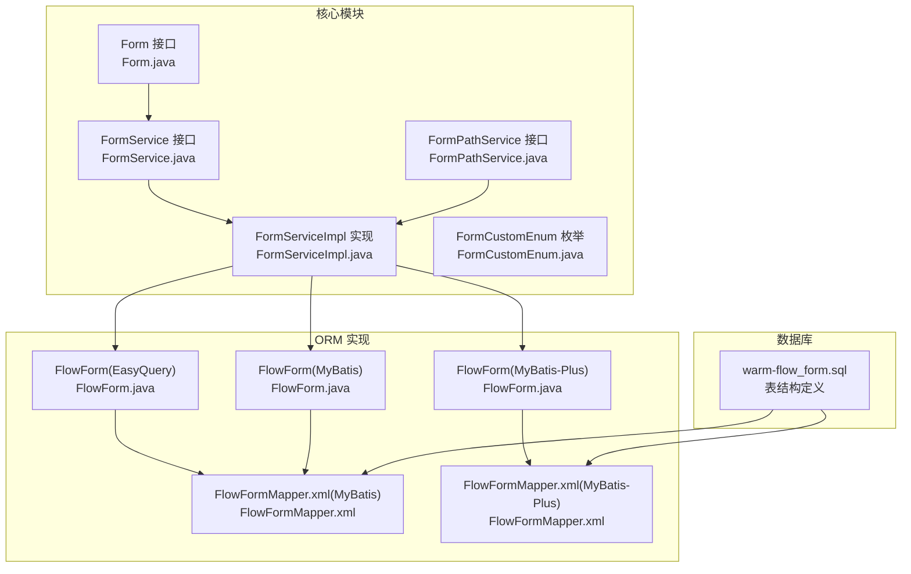
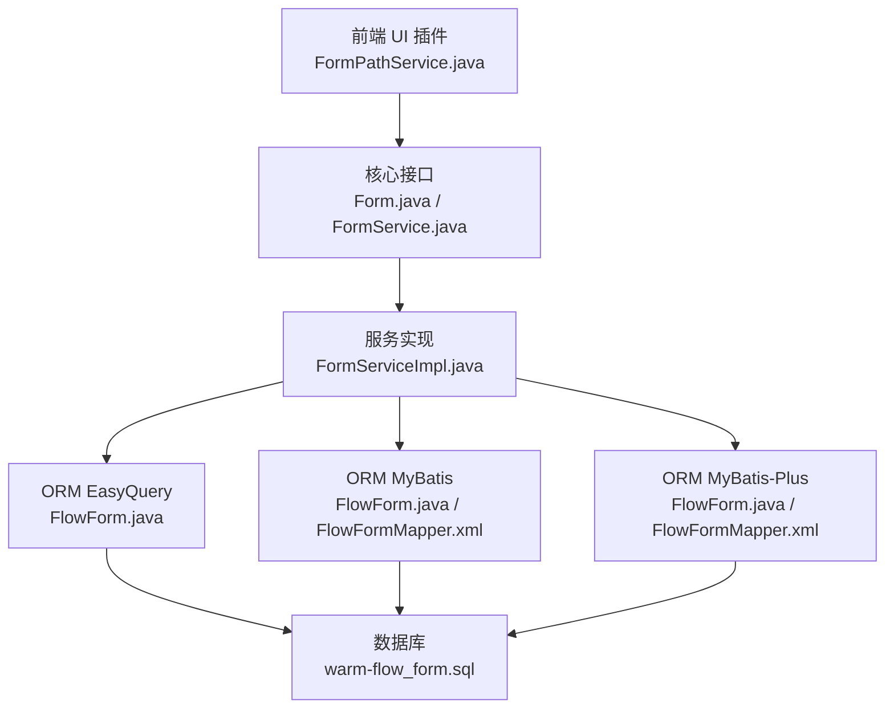
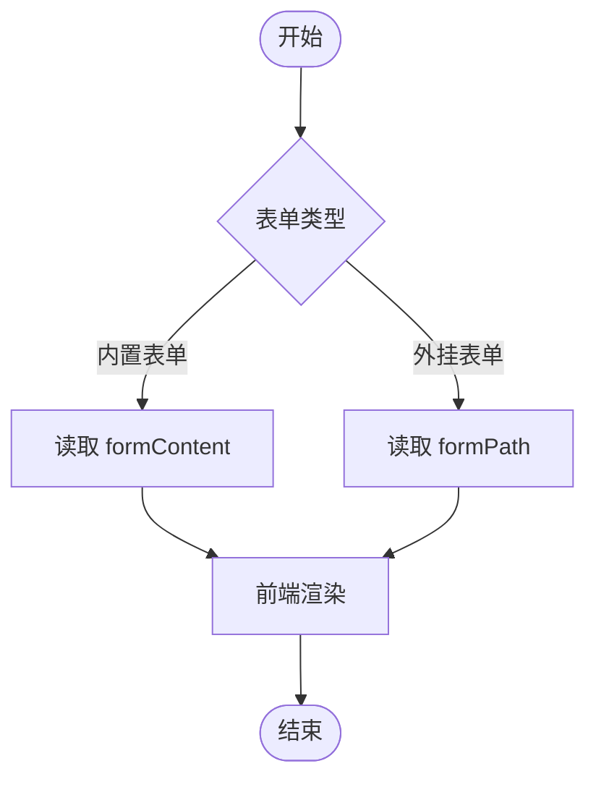
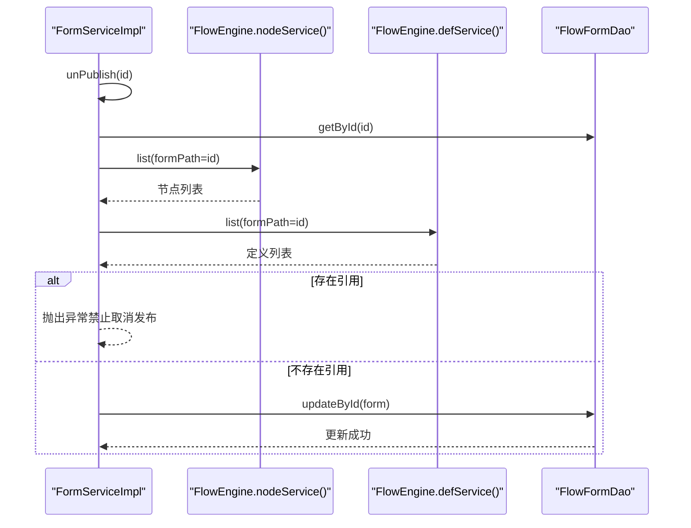
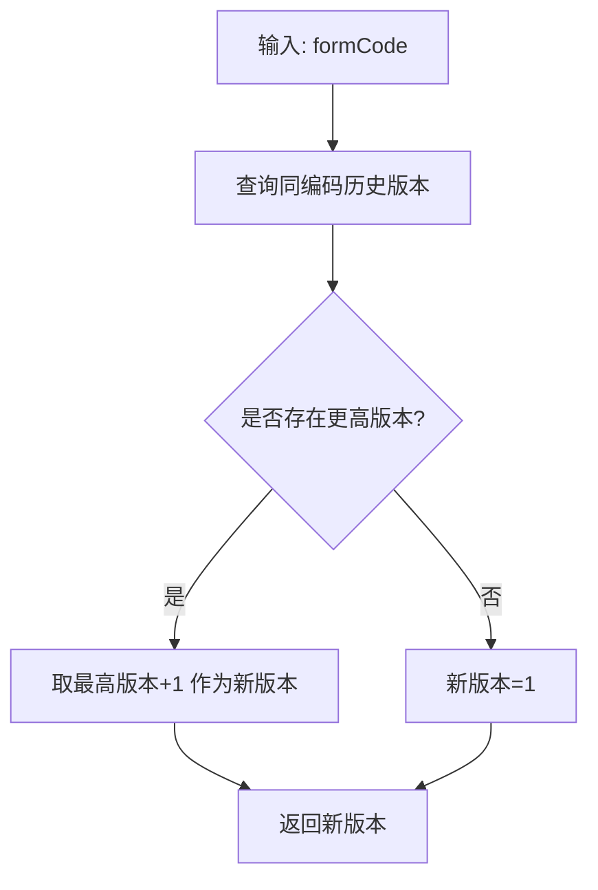
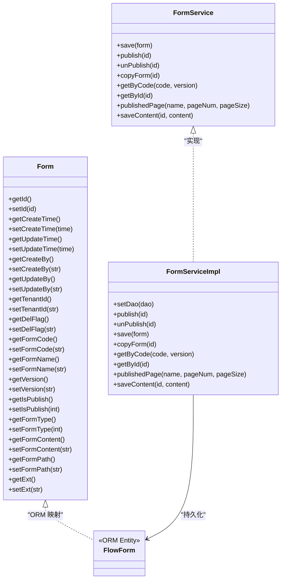
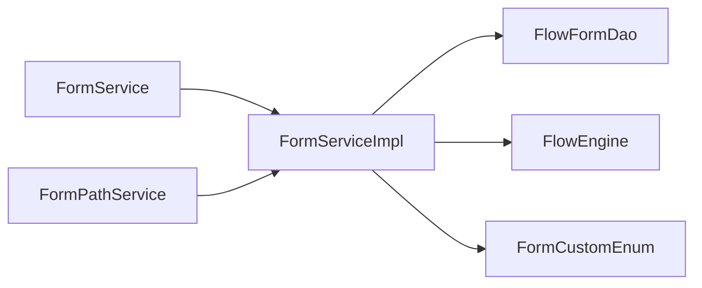

# Form（表单）实体

<cite>
**本文引用的文件**
- [Form.java](file://warm-flow-core/src/main/java/org/dromara/warm/flow/core/entity/Form.java)
- [FormService.java](file://warm-flow-core/src/main/java/org/dromara/warm/flow/core/service/FormService.java)
- [FormServiceImpl.java](file://warm-flow-core/src/main/java/org/dromara/warm/flow/core/service/impl/FormServiceImpl.java)
- [FormCustomEnum.java](file://warm-flow-core/src/main/java/org/dromara/warm/flow/core/enums/FormCustomEnum.java)
- [FormPathService.java](file://warm-flow-plugin/warm-flow-plugin-ui/warm-flow-plugin-ui-core/src/main/java/org/dromara/warm/flow/ui/service/FormPathService.java)
- [FlowForm.java（EasyQuery 实现）](file://warm-flow-orm/warm-flow-easy-query/warm-flow-easy-query-core/src/main/java/org/dromara/warm/flow/orm/entity/FlowForm.java)
- [FlowForm.java（MyBatis 实现）](file://warm-flow-orm/warm-flow-mybatis/warm-flow-mybatis-core/src/main/java/org/dromara/warm/flow/orm/entity/FlowForm.java)
- [FlowForm.java（MyBatis-Plus 实现）](file://warm-flow-orm/warm-flow-mybatis-plus/warm-flow-mybatis-plus-core/src/main/java/org/dromara/warm/flow/orm/entity/FlowForm.java)
- [FlowFormMapper.xml（MyBatis 实现）](file://warm-flow-orm/warm-flow-mybatis/warm-flow-mybatis-core/src/main/resources/warm/flow/FlowFormMapper.xml)
- [FlowFormMapper.xml（MyBatis-Plus 实现）](file://warm-flow-orm/warm-flow-mybatis-plus/warm-flow-mybatis-plus-core/src/main/resources/warm/flow/FlowFormMapper.xml)
- [warm-flow_form.sql（MySQL 升级脚本）](file://sql/mysql/v1-upgrade/warm-flow_form.sql)
- [FlowEngine.java](file://warm-flow-core/src/main/java/org/dromara/warm/flow/core/FlowEngine.java)
</cite>

## 目录
1. [简介](#简介)
2. [项目结构](#项目结构)
3. [核心组件](#核心组件)
4. [架构总览](#架构总览)
5. [详细组件分析](#详细组件分析)
6. [依赖关系分析](#依赖关系分析)
7. [性能考虑](#性能考虑)
8. [故障排查指南](#故障排查指南)
9. [结论](#结论)
10. [附录](#附录)

## 简介
本文件围绕 Form（表单）实体展开，系统性阐述其设计理念、字段含义、表单类型枚举、内容存储与解析机制、模板渲染与展示逻辑、与流程定义的关联关系、数据持久化与查询方式，并提供创建、模板配置、数据绑定与表单验证的实际使用示例，帮助开发者在工作流引擎中正确集成与使用表单实体。

## 项目结构
Form 相关代码分布在核心模块、ORM 实现与前端 UI 插件中：
- 核心接口与服务：Form 接口、FormService 接口及其实现类
- ORM 映射：多套 ORM 实现（EasyQuery、MyBatis、MyBatis-Plus）对应的实体与 Mapper
- 枚举：表单类型枚举
- UI 插件：表单路径查询接口
- 数据库脚本：表单相关表结构定义

**图表来源**
- [Form.java:1-112](file://warm-flow-core/src/main/java/org/dromara/warm/flow/core/entity/Form.java#L1-L112)
- [FormService.java:1-99](file://warm-flow-core/src/main/java/org/dromara/warm/flow/core/service/FormService.java#L1-L99)
- [FormServiceImpl.java:1-147](file://warm-flow-core/src/main/java/org/dromara/warm/flow/core/service/impl/FormServiceImpl.java#L1-L147)
- [FormCustomEnum.java:1-41](file://warm-flow-core/src/main/java/org/dromara/warm/flow/core/enums/FormCustomEnum.java#L1-L41)
- [FormPathService.java:1-37](file://warm-flow-plugin/warm-flow-plugin-ui/warm-flow-plugin-ui-core/src/main/java/org/dromara/warm/flow/ui/service/FormPathService.java#L1-L37)
- [FlowForm.java（EasyQuery 实现）](file://warm-flow-orm/warm-flow-easy-query/warm-flow-easy-query-core/src/main/java/org/dromara/warm/flow/orm/entity/FlowForm.java)
- [FlowForm.java（MyBatis 实现）](file://warm-flow-orm/warm-flow-mybatis/warm-flow-mybatis-core/src/main/java/org/dromara/warm/flow/orm/entity/FlowForm.java)
- [FlowForm.java（MyBatis-Plus 实现）](file://warm-flow-orm/warm-flow-mybatis-plus/warm-flow-mybatis-plus-core/src/main/java/org/dromara/warm/flow/orm/entity/FlowForm.java)
- [FlowFormMapper.xml（MyBatis 实现）](file://warm-flow-orm/warm-flow-mybatis/warm-flow-mybatis-core/src/main/resources/warm/flow/FlowFormMapper.xml)
- [FlowFormMapper.xml（MyBatis-Plus 实现）](file://warm-flow-orm/warm-flow-mybatis-plus/warm-flow-mybatis-plus-core/src/main/resources/warm/flow/FlowFormMapper.xml)
- [warm-flow_form.sql](file://sql/mysql/v1-upgrade/warm-flow_form.sql)

**章节来源**
- [Form.java:1-112](file://warm-flow-core/src/main/java/org/dromara/warm/flow/core/entity/Form.java#L1-L112)
- [FormService.java:1-99](file://warm-flow-core/src/main/java/org/dromara/warm/flow/core/service/FormService.java#L1-L99)
- [FormServiceImpl.java:1-147](file://warm-flow-core/src/main/java/org/dromara/warm/flow/core/service/impl/FormServiceImpl.java#L1-L147)
- [FormCustomEnum.java:1-41](file://warm-flow-core/src/main/java/org/dromara/warm/flow/core/enums/FormCustomEnum.java#L1-L41)
- [FormPathService.java:1-37](file://warm-flow-plugin/warm-flow-plugin-ui/warm-flow-plugin-ui-core/src/main/java/org/dromara/warm/flow/ui/service/FormPathService.java#L1-L37)

## 核心组件
- Form 接口：定义表单实体的标准字段与访问器，包含基础审计字段（创建时间、更新时间、创建人、更新人、租户标识、删除标记）以及表单核心字段（编码、名称、版本、发布状态、表单类型、内容、路径、扩展信息等）
- FormService 接口：定义表单的业务操作契约，如保存、发布/取消发布、复制、按编码+版本查询、分页查询已发布表单、保存表单内容
- FormServiceImpl：具体业务实现，负责版本号生成、发布状态校验、与节点/流程定义的关联约束检查、内容保存等
- FormCustomEnum：表单类型枚举，用于区分“内置表单”和“外挂表单”的路径策略
- FormPathService：UI 插件提供的自定义表单路径查询能力，便于前端选择或展示可用表单路径
- ORM 实体与 Mapper：多套 ORM 实现下的 FlowForm 实体与对应 XML 映射，确保不同持久化框架的一致行为

**章节来源**
- [Form.java:26-111](file://warm-flow-core/src/main/java/org/dromara/warm/flow/core/entity/Form.java#L26-L111)
- [FormService.java:28-98](file://warm-flow-core/src/main/java/org/dromara/warm/flow/core/service/FormService.java#L28-L98)
- [FormServiceImpl.java:44-146](file://warm-flow-core/src/main/java/org/dromara/warm/flow/core/service/impl/FormServiceImpl.java#L44-L146)
- [FormCustomEnum.java:29-40](file://warm-flow-core/src/main/java/org/dromara/warm/flow/core/enums/FormCustomEnum.java#L29-L40)
- [FormPathService.java:28-36](file://warm-flow-plugin/warm-flow-plugin-ui/warm-flow-plugin-ui-core/src/main/java/org/dromara/warm/flow/ui/service/FormPathService.java#L28-L36)

## 架构总览
下图展示了表单实体在系统中的位置与交互关系：核心接口与服务位于核心模块；ORM 层对接不同持久化框架；UI 插件提供路径查询；FlowEngine 提供跨服务调用能力。

**图表来源**
- [Form.java:26-111](file://warm-flow-core/src/main/java/org/dromara/warm/flow/core/entity/Form.java#L26-L111)
- [FormService.java:28-98](file://warm-flow-core/src/main/java/org/dromara/warm/flow/core/service/FormService.java#L28-L98)
- [FormServiceImpl.java:44-146](file://warm-flow-core/src/main/java/org/dromara/warm/flow/core/service/impl/FormServiceImpl.java#L44-L146)
- [FormPathService.java:28-36](file://warm-flow-plugin/warm-flow-plugin-ui/warm-flow-plugin-ui-core/src/main/java/org/dromara/warm/flow/ui/service/FormPathService.java#L28-L36)
- [FlowForm.java（EasyQuery 实现）](file://warm-flow-orm/warm-flow-easy-query/warm-flow-easy-query-core/src/main/java/org/dromara/warm/flow/orm/entity/FlowForm.java)
- [FlowForm.java（MyBatis 实现）](file://warm-flow-orm/warm-flow-mybatis/warm-flow-mybatis-core/src/main/java/org/dromara/warm/flow/orm/entity/FlowForm.java)
- [FlowForm.java（MyBatis-Plus 实现）](file://warm-flow-orm/warm-flow-mybatis-plus/warm-flow-mybatis-plus-core/src/main/java/org/dromara/warm/flow/orm/entity/FlowForm.java)
- [FlowFormMapper.xml（MyBatis 实现）](file://warm-flow-orm/warm-flow-mybatis/warm-flow-mybatis-core/src/main/resources/warm/flow/FlowFormMapper.xml)
- [FlowFormMapper.xml（MyBatis-Plus 实现）](file://warm-flow-orm/warm-flow-mybatis-plus/warm-flow-mybatis-plus-core/src/main/resources/warm/flow/FlowFormMapper.xml)
- [warm-flow_form.sql](file://sql/mysql/v1-upgrade/warm-flow_form.sql)

## 详细组件分析

### 表单实体设计与字段说明
- 基础审计字段：id、createTime、updateTime、createBy、updateBy、tenantId、delFlag
- 表单核心字段：
  - formCode：表单编码（唯一标识）
  - formName：表单名称
  - version：版本号（用于多版本表单管理）
  - isPublish：发布状态（0未发布、1已发布、9失效）
  - formType：表单类型（0内置表单、1外挂表单）
  - formContent：内置表单的内容（JSON 或模板结构）
  - formPath：外挂表单的路径（指向外部资源）
  - ext：扩展信息（JSON 字符串，用于存储额外元数据）

这些字段共同构成表单的完整生命周期与运行时承载能力。

**章节来源**
- [Form.java:70-111](file://warm-flow-core/src/main/java/org/dromara/warm/flow/core/entity/Form.java#L70-L111)

### 表单类型枚举（FormCustomEnum）
- N：表示“自定义表单路径”，通常与 formPath 配合使用
- Y：表示“自定义表单路径”，与 N 含义一致，可能用于不同上下文或历史兼容

该枚举用于统一表单路径策略的判定，便于 UI 与后端协同处理。

**章节来源**
- [FormCustomEnum.java:29-40](file://warm-flow-core/src/main/java/org/dromara/warm/flow/core/enums/FormCustomEnum.java#L29-L40)

### 表单内容存储与解析机制
- 内置表单（formType=0）：通过 formContent 字段存储表单结构与数据，适合轻量、内嵌场景
- 外挂表单（formType=1）：通过 formPath 字段指向外部资源，适合复杂或独立维护的表单
- 解析与渲染：由 UI 插件与前端表单设计器协作完成，FormPathService 提供路径查询能力，结合前端组件进行动态渲染

**图表来源**
- [Form.java:94-106](file://warm-flow-core/src/main/java/org/dromara/warm/flow/core/entity/Form.java#L94-L106)
- [FormPathService.java:30-35](file://warm-flow-plugin/warm-flow-plugin-ui/warm-flow-plugin-ui-core/src/main/java/org/dromara/warm/flow/ui/service/FormPathService.java#L30-L35)

**章节来源**
- [Form.java:94-106](file://warm-flow-core/src/main/java/org/dromara/warm/flow/core/entity/Form.java#L94-L106)
- [FormPathService.java:28-36](file://warm-flow-plugin/warm-flow-plugin-ui/warm-flow-plugin-ui-core/src/main/java/org/dromara/warm/flow/ui/service/FormPathService.java#L28-L36)

### 表单与流程定义的关联关系
- 关联点：节点（Node）与流程定义（Definition）均可能引用表单路径（formPath），以建立运行时的数据绑定
- 约束：当尝试取消发布某表单时，需检查是否存在节点或流程定义引用了该表单路径，若存在则禁止取消发布，防止破坏运行时一致性

**图表来源**
- [FormServiceImpl.java:62-72](file://warm-flow-core/src/main/java/org/dromara/warm/flow/core/service/impl/FormServiceImpl.java#L62-L72)
- [FlowEngine.java](file://warm-flow-core/src/main/java/org/dromara/warm/flow/core/FlowEngine.java)

**章节来源**
- [FormServiceImpl.java:62-72](file://warm-flow-core/src/main/java/org/dromara/warm/flow/core/service/impl/FormServiceImpl.java#L62-L72)

### 表单数据的持久化与查询方式
- 保存：save(form) 会自动计算新版本号并写入
- 查询：
  - 按 ID：getById(id)
  - 按编码+版本：getByCode(formCode, formVersion)
  - 分页查询已发布表单：publishedPage(formName, pageNum, pageSize)
- 内容更新：saveContent(id, formContent) 仅允许对已发布表单进行内容更新

```mermaid
sequenceDiagram
participant Client as "客户端"
participant Svc as "FormServiceImpl"
participant DAO as "FlowFormDao"
Client->>Svc : save(form)
Svc->>Svc : 计算版本号
Svc->>DAO : insertOrUpdate(form)
DAO-->>Svc : 结果
Svc-->>Client : true/false
Client->>Svc : getByCode(code, version)
Svc->>DAO : list(formCode, version)
DAO-->>Svc : 列表
Svc-->>Client : 返回单条记录
Client->>Svc : publishedPage(name, page, size)
Svc->>DAO : page(query, page)
DAO-->>Svc : 分页结果
Svc-->>Client : Page<Form>
```

**图表来源**
- [FormService.java:36-98](file://warm-flow-core/src/main/java/org/dromara/warm/flow/core/service/FormService.java#L36-L98)
- [FormServiceImpl.java:74-119](file://warm-flow-core/src/main/java/org/dromara/warm/flow/core/service/impl/FormServiceImpl.java#L74-L119)

**章节来源**
- [FormService.java:28-98](file://warm-flow-core/src/main/java/org/dromara/warm/flow/core/service/FormService.java#L28-L98)
- [FormServiceImpl.java:74-119](file://warm-flow-core/src/main/java/org/dromara/warm/flow/core/service/impl/FormServiceImpl.java#L74-L119)

### 版本管理与复制
- 版本号生成：基于同一 formCode 的历史版本，取最大整数版本加一作为新版本
- 复制：copyForm(id) 会克隆原表单，清空 ID 与审计时间，重新生成版本号并设置为未发布

**图表来源**
- [FormServiceImpl.java:121-145](file://warm-flow-core/src/main/java/org/dromara/warm/flow/core/service/impl/FormServiceImpl.java#L121-L145)

**章节来源**
- [FormServiceImpl.java:80-90](file://warm-flow-core/src/main/java/org/dromara/warm/flow/core/service/impl/FormServiceImpl.java#L80-L90)
- [FormServiceImpl.java:121-145](file://warm-flow-core/src/main/java/org/dromara/warm/flow/core/service/impl/FormServiceImpl.java#L121-L145)

### 类关系图（接口与实现）

**图表来源**
- [Form.java:26-111](file://warm-flow-core/src/main/java/org/dromara/warm/flow/core/entity/Form.java#L26-L111)
- [FormService.java:28-98](file://warm-flow-core/src/main/java/org/dromara/warm/flow/core/service/FormService.java#L28-L98)
- [FormServiceImpl.java:44-146](file://warm-flow-core/src/main/java/org/dromara/warm/flow/core/service/impl/FormServiceImpl.java#L44-L146)
- [FlowForm.java（EasyQuery 实现）](file://warm-flow-orm/warm-flow-easy-query/warm-flow-easy-query-core/src/main/java/org/dromara/warm/flow/orm/entity/FlowForm.java)

**章节来源**
- [Form.java:26-111](file://warm-flow-core/src/main/java/org/dromara/warm/flow/core/entity/Form.java#L26-L111)
- [FormService.java:28-98](file://warm-flow-core/src/main/java/org/dromara/warm/flow/core/service/FormService.java#L28-L98)
- [FormServiceImpl.java:44-146](file://warm-flow-core/src/main/java/org/dromara/warm/flow/core/service/impl/FormServiceImpl.java#L44-L146)

## 依赖关系分析
- 低耦合：Form 接口与服务接口解耦，便于替换不同 ORM 实现
- 引用约束：取消发布前检查节点与流程定义是否引用该表单，避免破坏运行时一致性
- 扩展点：FormPathService 为 UI 插件提供路径查询扩展，支持灵活的表单路径策略

**图表来源**
- [FormService.java:28-98](file://warm-flow-core/src/main/java/org/dromara/warm/flow/core/service/FormService.java#L28-L98)
- [FormServiceImpl.java:44-146](file://warm-flow-core/src/main/java/org/dromara/warm/flow/core/service/impl/FormServiceImpl.java#L44-L146)
- [FormCustomEnum.java:29-40](file://warm-flow-core/src/main/java/org/dromara/warm/flow/core/enums/FormCustomEnum.java#L29-L40)
- [FormPathService.java:28-36](file://warm-flow-plugin/warm-flow-plugin-ui/warm-flow-plugin-ui-core/src/main/java/org/dromara/warm/flow/ui/service/FormPathService.java#L28-L36)
- [FlowEngine.java](file://warm-flow-core/src/main/java/org/dromara/warm/flow/core/FlowEngine.java)

**章节来源**
- [FormServiceImpl.java:62-72](file://warm-flow-core/src/main/java/org/dromara/warm/flow/core/service/impl/FormServiceImpl.java#L62-L72)
- [FormPathService.java:28-36](file://warm-flow-plugin/warm-flow-plugin-ui/warm-flow-plugin-ui-core/src/main/java/org/dromara/warm/flow/ui/service/FormPathService.java#L28-L36)

## 性能考虑
- 版本号计算：遍历同编码历史版本，时间复杂度 O(n)，建议在高并发场景下控制版本数量或引入缓存
- 查询优化：按编码+版本查询应走索引；分页查询注意合理设置页大小
- 发布状态校验：取消发布前的引用检查涉及多次查询，建议在数据库层面建立约束或在服务层做批量检查

## 故障排查指南
- 表单已发布仍尝试修改内容：saveContent 仅允许对已发布表单执行，否则抛出异常
- 取消发布失败：若存在节点或流程定义引用该表单路径，将阻止取消发布
- 版本格式异常：历史版本非整数时会记录错误日志，需清理或修复版本字符串

**章节来源**
- [FormServiceImpl.java:112-119](file://warm-flow-core/src/main/java/org/dromara/warm/flow/core/service/impl/FormServiceImpl.java#L112-L119)
- [FormServiceImpl.java:62-72](file://warm-flow-core/src/main/java/org/dromara/warm/flow/core/service/impl/FormServiceImpl.java#L62-L72)
- [FormServiceImpl.java:133-135](file://warm-flow-core/src/main/java/org/dromara/warm/flow/core/service/impl/FormServiceImpl.java#L133-L135)

## 结论
Form 实体通过清晰的字段设计与严格的业务约束，实现了表单的全生命周期管理。结合多 ORM 支持与 UI 插件扩展，能够在不同技术栈与前端框架下稳定运行。发布状态与引用约束保障了运行时一致性，版本管理与内容更新机制满足了迭代演进需求。

## 附录

### 表单字段与用途对照
- id：主键
- createTime/updateTime：审计时间
- createBy/updateBy：审计用户
- tenantId：租户隔离
- delFlag：逻辑删除
- formCode：表单编码（唯一标识）
- formName：表单名称
- version：版本号
- isPublish：发布状态（0未发布、1已发布、9失效）
- formType：表单类型（0内置、1外挂）
- formContent：内置表单内容
- formPath：外挂表单路径
- ext：扩展信息

**章节来源**
- [Form.java:70-111](file://warm-flow-core/src/main/java/org/dromara/warm/flow/core/entity/Form.java#L70-L111)

### 使用示例（步骤说明）
- 创建表单：调用保存接口，填写编码、名称、类型、内容或路径、扩展信息，系统自动计算版本号
- 配置模板：内置表单通过 formContent 存储模板结构；外挂表单通过 formPath 指向外部资源
- 数据绑定：在节点或流程定义中引用表单路径，实现运行时数据绑定
- 表单验证：在取消发布前，系统会检查是否存在节点或流程定义引用该表单路径，避免破坏运行时一致性

**章节来源**
- [FormService.java:36-98](file://warm-flow-core/src/main/java/org/dromara/warm/flow/core/service/FormService.java#L36-L98)
- [FormServiceImpl.java:74-119](file://warm-flow-core/src/main/java/org/dromara/warm/flow/core/service/impl/FormServiceImpl.java#L74-L119)
- [FormPathService.java:30-35](file://warm-flow-plugin/warm-flow-plugin-ui/warm-flow-plugin-ui-core/src/main/java/org/dromara/warm/flow/ui/service/FormPathService.java#L30-L35)