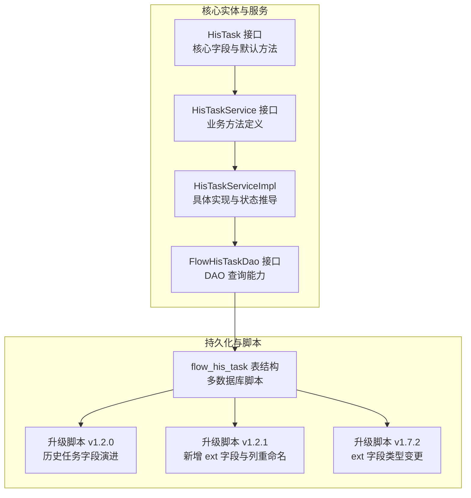
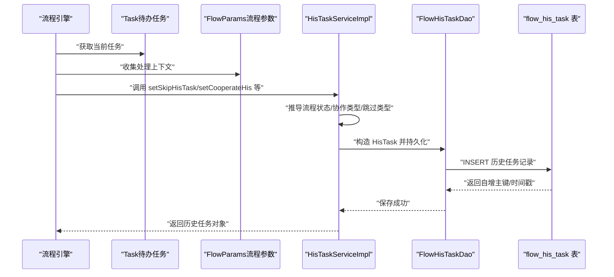
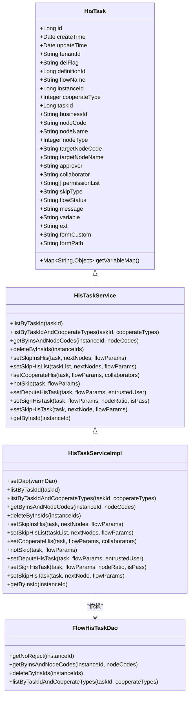

# HisTask（历史任务）实体

<cite>
**本文引用的文件**
- [HisTask.java](file://warm-flow-core/src/main/java/org/dromara/warm/flow/core/entity/HisTask.java)
- [HisTaskService.java](file://warm-flow-core/src/main/java/org/dromara/warm/flow/core/service/HisTaskService.java)
- [HisTaskServiceImpl.java](file://warm-flow-core/src/main/java/org/dromara/warm/flow/core/service/impl/HisTaskServiceImpl.java)
- [FlowHisTaskDao.java](file://warm-flow-core/src/main/java/org/dromara/warm/flow/core/orm/dao/FlowHisTaskDao.java)
- [warm-flow-all.sql（MySQL）](file://sql/mysql/warm-flow-all.sql)
- [v1-upgrade_1.2.0.sql（MySQL）](file://sql/mysql/v1-upgrade/warm-flow_1.2.0.sql)
- [v1-upgrade_1.2.1.sql（MySQL）](file://sql/mysql/v1-upgrade/warm-flow_1.2.1.sql)
- [v1-upgrade_1.7.2.sql（MySQL）](file://sql/mysql/v1-upgrade/warm-flow_1.7.2.sql)
- [sqlserver.sql（SQLServer）](file://sql/sqlserver/sqlserver.sql)
- [oracle-wram-flow-all.sql（Oracle）](file://sql/oracle/oracle-wram-flow-all.sql)
</cite>

## 目录
1. [简介](#简介)
2. [项目结构](#项目结构)
3. [核心组件](#核心组件)
4. [架构总览](#架构总览)
5. [详细组件分析](#详细组件分析)
6. [依赖关系分析](#依赖关系分析)
7. [性能考量](#性能考量)
8. [故障排查指南](#故障排查指南)
9. [结论](#结论)
10. [附录](#附录)

## 简介
本文件围绕 HisTask（历史任务）实体进行系统化技术文档编写，目标是帮助开发者全面理解历史任务的设计目的、数据保留策略、核心字段含义、与待办任务的关系、数据迁移与保留周期、审计追踪与报表统计中的作用，以及查询与分析的优化策略。文档同时提供可操作的应用示例，便于在工作流系统中正确使用该实体。

## 项目结构
HisTask 实体位于核心模块中，配合服务层、DAO 层与数据库脚本共同构成完整的历史任务数据模型与生命周期管理。下图展示与 HisTask 相关的关键文件与职责分工：

图表来源
- [HisTask.java:1-164](file://warm-flow-core/src/main/java/org/dromara/warm/flow/core/entity/HisTask.java#L1-L164)
- [HisTaskService.java:1-140](file://warm-flow-core/src/main/java/org/dromara/warm/flow/core/service/HisTaskService.java#L1-L140)
- [HisTaskServiceImpl.java:1-250](file://warm-flow-core/src/main/java/org/dromara/warm/flow/core/service/impl/HisTaskServiceImpl.java#L1-L250)
- [FlowHisTaskDao.java:1-65](file://warm-flow-core/src/main/java/org/dromara/warm/flow/core/orm/dao/FlowHisTaskDao.java#L1-L65)
- [warm-flow-all.sql（MySQL）:137-159](file://sql/mysql/warm-flow-all.sql#L137-L159)
- [v1-upgrade_1.2.0.sql（MySQL）:1-24](file://sql/mysql/v1-upgrade/warm-flow_1.2.0.sql#L1-L24)
- [v1-upgrade_1.2.1.sql（MySQL）:1-5](file://sql/mysql/v1-upgrade/warm-flow_1.2.1.sql#L1-L5)
- [v1-upgrade_1.7.2.sql（MySQL）:1-1](file://sql/mysql/v1-upgrade/warm-flow_1.7.2.sql#L1-L1)

章节来源
- [HisTask.java:1-164](file://warm-flow-core/src/main/java/org/dromara/warm/flow/core/entity/HisTask.java#L1-L164)
- [HisTaskService.java:1-140](file://warm-flow-core/src/main/java/org/dromara/warm/flow/core/service/HisTaskService.java#L1-L140)
- [HisTaskServiceImpl.java:1-250](file://warm-flow-core/src/main/java/org/dromara/warm/flow/core/service/impl/HisTaskServiceImpl.java#L1-L250)
- [FlowHisTaskDao.java:1-65](file://warm-flow-core/src/main/java/org/dromara/warm/flow/core/orm/dao/FlowHisTaskDao.java#L1-L65)
- [warm-flow-all.sql（MySQL）:137-159](file://sql/mysql/warm-flow-all.sql#L137-L159)
- [v1-upgrade_1.2.0.sql（MySQL）:1-24](file://sql/mysql/v1-upgrade/warm-flow_1.2.0.sql#L1-L24)
- [v1-upgrade_1.2.1.sql（MySQL）:1-5](file://sql/mysql/v1-upgrade/warm-flow_1.2.1.sql#L1-L5)
- [v1-upgrade_1.7.2.sql（MySQL）:1-1](file://sql/mysql/v1-upgrade/warm-flow_1.7.2.sql#L1-L1)

## 核心组件
- 实体接口：定义历史任务的全部字段与通用属性（如创建时间、更新时间、租户标识、逻辑删除标志），并提供从 JSON 字符串到 Map 的转换便捷方法。
- 服务接口：定义按任务、实例、节点编码、协作类型等维度的查询方法，以及生成不同处理形态的历史任务记录（跳转、协作、暂存、委派、会签/票签等）。
- 服务实现：封装历史任务写入逻辑，根据流程参数与当前任务状态推导流程状态、协作类型、跳过类型等，并统一填充主键与时间戳。
- DAO 接口：提供按实例与节点编码查询、按实例批量删除、按任务与协作类型过滤等底层查询能力。

章节来源
- [HisTask.java:30-163](file://warm-flow-core/src/main/java/org/dromara/warm/flow/core/entity/HisTask.java#L30-L163)
- [HisTaskService.java:33-139](file://warm-flow-core/src/main/java/org/dromara/warm/flow/core/service/HisTaskService.java#L33-L139)
- [HisTaskServiceImpl.java:41-249](file://warm-flow-core/src/main/java/org/dromara/warm/flow/core/service/impl/HisTaskServiceImpl.java#L41-L249)
- [FlowHisTaskDao.java:28-64](file://warm-flow-core/src/main/java/org/dromara/warm/flow/core/orm/dao/FlowHisTaskDao.java#L28-L64)

## 架构总览
历史任务在工作流引擎中的流转与落库路径如下：

图表来源
- [HisTaskServiceImpl.java:93-244](file://warm-flow-core/src/main/java/org/dromara/warm/flow/core/service/impl/HisTaskServiceImpl.java#L93-L244)
- [FlowHisTaskDao.java:28-64](file://warm-flow-core/src/main/java/org/dromara/warm/flow/core/orm/dao/FlowHisTaskDao.java#L28-L64)

## 详细组件分析

### 实体设计与字段说明
- 设计目的：记录流程执行过程中已完成或已处理的任务轨迹，支撑审计、统计、分析与合规追溯。
- 数据保留策略：通过 DAO 提供按实例批量删除能力，支持在流程结束后清理历史数据；同时提供按实例与节点编码查询，便于分页与归档。
- 核心字段概览（节选）：
  - 基础标识：历史任务ID、创建时间、更新时间、租户ID、删除标志
  - 关联标识：流程定义ID、流程实例ID、任务ID、业务ID
  - 节点信息：起始节点编码/名称、节点类型、目标节点编码/名称
  - 处理信息：处理人、协作人、协作类型、跳过类型、流程状态
  - 文本与结构化：处理意见、任务变量（JSON 字符串）、扩展字段（JSON 对象）
  - 表单信息：表单定制、表单路径
- 变量与扩展：
  - 变量字段提供字符串到 Map 的便捷转换，便于查询与统计。
  - 扩展字段用于承载业务侧自定义对象，便于跨系统集成与二次开发。

章节来源
- [HisTask.java:62-163](file://warm-flow-core/src/main/java/org/dromara/warm/flow/core/entity/HisTask.java#L62-L163)
- [HisTaskServiceImpl.java:100-126](file://warm-flow-core/src/main/java/org/dromara/warm/flow/core/service/impl/HisTaskServiceImpl.java#L100-L126)
- [HisTaskServiceImpl.java:129-153](file://warm-flow-core/src/main/java/org/dromara/warm/flow/core/service/impl/HisTaskServiceImpl.java#L129-L153)
- [HisTaskServiceImpl.java:156-183](file://warm-flow-core/src/main/java/org/dromara/warm/flow/core/service/impl/HisTaskServiceImpl.java#L156-L183)
- [HisTaskServiceImpl.java:186-212](file://warm-flow-core/src/main/java/org/dromara/warm/flow/core/service/impl/HisTaskServiceImpl.java#L186-L212)

### 与待办任务的关联关系
- 关联方式：历史任务记录包含任务ID与实例ID，形成与待办任务的直接映射；同时通过流程定义ID与节点信息描述流程位置。
- 数据迁移：早期版本将待办任务的权限标记拆分到独立的流程用户表，以支持更灵活的权限控制与审计；历史任务则专注于记录处理轨迹。
- 生命周期：当待办任务被处理后，系统根据处理结果生成历史任务记录，并可选择性地删除或归档对应的待办任务。

章节来源
- [HisTask.java:74-88](file://warm-flow-core/src/main/java/org/dromara/warm/flow/core/entity/HisTask.java#L74-L88)
- [v1-upgrade_1.2.0.sql（MySQL）:17-24](file://sql/mysql/v1-upgrade/warm-flow_1.2.0.sql#L17-L24)

### 数据迁移机制与保留周期
- 迁移机制：历史任务字段随版本逐步演进，包括新增扩展字段、调整列名与类型等，确保兼容性与可扩展性。
- 保留周期：系统提供按实例批量删除能力，便于按业务策略进行归档或清理；查询接口支持按实例与节点编码筛选，便于分批处理。

章节来源
- [v1-upgrade_1.2.1.sql（MySQL）:1-5](file://sql/mysql/v1-upgrade/warm-flow_1.2.1.sql#L1-L5)
- [v1-upgrade_1.7.2.sql（MySQL）:1-1](file://sql/mysql/v1-upgrade/warm-flow_1.7.2.sql#L1-L1)
- [FlowHisTaskDao.java:48-54](file://warm-flow-core/src/main/java/org/dromara/warm/flow/core/orm/dao/FlowHisTaskDao.java#L48-L54)

### 审计追踪、报表统计与流程分析
- 审计追踪：通过历史任务记录的处理人、协作人、处理时间、处理结果、节点信息等，构建完整的审批链路与责任追溯。
- 报表统计：基于协作类型、流程状态、节点类型、处理时间等维度进行聚合统计，支持趋势分析与效率评估。
- 流程分析：结合变量与扩展字段，对流程执行质量、瓶颈节点、异常路径进行深度分析。

章节来源
- [HisTaskService.java:35-139](file://warm-flow-core/src/main/java/org/dromara/warm/flow/core/service/HisTaskService.java#L35-L139)
- [HisTaskServiceImpl.java:215-217](file://warm-flow-core/src/main/java/org/dromara/warm/flow/core/service/impl/HisTaskServiceImpl.java#L215-L217)

### 查询与分析优化策略
- 索引与查询：建议在实例ID、任务ID、节点编码、协作类型、创建时间等常用过滤字段上建立索引，以提升查询性能。
- 分页与归档：利用按实例批量删除能力进行分批归档，避免一次性大范围删除带来的锁竞争。
- 变量与扩展：优先使用变量字段的 Map 转换能力进行条件过滤，减少全表扫描。

章节来源
- [FlowHisTaskDao.java:30-64](file://warm-flow-core/src/main/java/org/dromara/warm/flow/core/orm/dao/FlowHisTaskDao.java#L30-L64)
- [HisTask.java:147-149](file://warm-flow-core/src/main/java/org/dromara/warm/flow/core/entity/HisTask.java#L147-L149)

### 实际应用示例
- 查询历史任务列表
  - 按流程实例ID查询：[HisTaskService.getByInsId:137-138](file://warm-flow-core/src/main/java/org/dromara/warm/flow/core/service/HisTaskService.java#L137-L138)
  - 按任务ID查询：[HisTaskService.listByTaskId:35-35](file://warm-flow-core/src/main/java/org/dromara/warm/flow/core/service/HisTaskService.java#L35-L35)
  - 按任务ID与协作类型查询：[HisTaskService.listByTaskIdAndCooperateTypes:44-44](file://warm-flow-core/src/main/java/org/dromara/warm/flow/core/service/HisTaskService.java#L44-L44)
  - 按实例ID与节点编码查询：[HisTaskService.getByInsAndNodeCodes:53-53](file://warm-flow-core/src/main/java/org/dromara/warm/flow/core/service/HisTaskService.java#L53-L53)
- 生成历史任务记录
  - 跳转/拒绝/通过：[HisTaskService.setSkipHisTask:129-129](file://warm-flow-core/src/main/java/org/dromara/warm/flow/core/service/HisTaskService.java#L129-L129)
  - 协作审批：[HisTaskService.setCooperateHis:88-89](file://warm-flow-core/src/main/java/org/dromara/warm/flow/core/service/HisTaskService.java#L88-L89)
  - 暂存不跳转：[HisTaskService.notSkip:96-96](file://warm-flow-core/src/main/java/org/dromara/warm/flow/core/service/HisTaskService.java#L96-L96)
  - 委派处理：[HisTaskService.setDeputeHisTask:106-106](file://warm-flow-core/src/main/java/org/dromara/warm/flow/core/service/HisTaskService.java#L106-L106)
  - 会签/票签：[HisTaskService.setSignHisTask:117-117](file://warm-flow-core/src/main/java/org/dromara/warm/flow/core/service/HisTaskService.java#L117-L117)
- 删除历史任务
  - 按实例ID批量删除：[HisTaskService.deleteByInsIds:61-61](file://warm-flow-core/src/main/java/org/dromara/warm/flow/core/service/HisTaskService.java#L61-L61)

章节来源
- [HisTaskService.java:35-139](file://warm-flow-core/src/main/java/org/dromara/warm/flow/core/service/HisTaskService.java#L35-L139)
- [HisTaskServiceImpl.java:75-96](file://warm-flow-core/src/main/java/org/dromara/warm/flow/core/service/impl/HisTaskServiceImpl.java#L75-L96)
- [HisTaskServiceImpl.java:98-153](file://warm-flow-core/src/main/java/org/dromara/warm/flow/core/service/impl/HisTaskServiceImpl.java#L98-L153)
- [HisTaskServiceImpl.java:155-212](file://warm-flow-core/src/main/java/org/dromara/warm/flow/core/service/impl/HisTaskServiceImpl.java#L155-L212)

## 依赖关系分析
历史任务相关组件之间的依赖关系如下：

图表来源
- [HisTask.java:30-163](file://warm-flow-core/src/main/java/org/dromara/warm/flow/core/entity/HisTask.java#L30-L163)
- [HisTaskService.java:33-139](file://warm-flow-core/src/main/java/org/dromara/warm/flow/core/service/HisTaskService.java#L33-L139)
- [HisTaskServiceImpl.java:41-249](file://warm-flow-core/src/main/java/org/dromara/warm/flow/core/service/impl/HisTaskServiceImpl.java#L41-L249)
- [FlowHisTaskDao.java:28-64](file://warm-flow-core/src/main/java/org/dromara/warm/flow/core/orm/dao/FlowHisTaskDao.java#L28-L64)

## 性能考量
- 查询性能
  - 在实例ID、任务ID、节点编码、协作类型、创建时间等字段上建立合适索引，降低过滤成本。
  - 使用分页与批量删除策略，避免大事务与长锁持有。
- 写入性能
  - 统一使用服务层封装的状态推导与字段填充，减少重复计算与分支判断。
  - 批量生成历史任务时，尽量复用参数对象与工具类，降低内存与 GC 压力。
- 存储与归档
  - 利用扩展字段承载业务对象，减少额外表连接；同时注意字段大小限制与压缩策略。
  - 对历史数据进行定期归档与清理，保持热数据区高效。

## 故障排查指南
- 常见问题
  - 历史任务缺失：检查流程处理是否调用了历史任务生成方法，确认流程参数是否正确传递。
  - 查询结果为空：核对实例ID、节点编码、协作类型等过滤条件是否匹配。
  - 扩展字段过大：确认数据库方言对 TEXT/BLOB 的支持与大小限制。
- 排查步骤
  - 核对 DAO 查询方法与 SQL 映射，确保过滤条件正确。
  - 检查服务层状态推导逻辑，确认流程状态与跳过类型计算是否符合预期。
  - 验证数据库脚本升级是否完成，确认字段存在且类型正确。

章节来源
- [FlowHisTaskDao.java:30-64](file://warm-flow-core/src/main/java/org/dromara/warm/flow/core/orm/dao/FlowHisTaskDao.java#L30-L64)
- [HisTaskServiceImpl.java:246-248](file://warm-flow-core/src/main/java/org/dromara/warm/flow/core/service/impl/HisTaskServiceImpl.java#L246-L248)
- [v1-upgrade_1.2.1.sql（MySQL）:1-5](file://sql/mysql/v1-upgrade/warm-flow_1.2.1.sql#L1-L5)
- [v1-upgrade_1.7.2.sql（MySQL）:1-1](file://sql/mysql/v1-upgrade/warm-flow_1.7.2.sql#L1-L1)

## 结论
HisTask 实体是工作流系统审计与分析的基石，通过清晰的字段设计、完善的查询与归档能力，以及与待办任务的紧密关联，为流程治理提供了可靠的数据基础。结合合理的索引与分批处理策略，可在保证性能的同时满足长期留存与合规需求。

## 附录

### 数据库表结构与字段说明（摘录）
- 表名：flow_his_task
- 字段要点（示意）
  - 主键与通用字段：id、create_time、update_time、tenant_id、del_flag
  - 关联字段：definition_id、instance_id、task_id、business_id
  - 节点字段：node_code、node_name、node_type、target_node_code、target_node_name
  - 处理字段：approver、collaborator、cooperate_type、skip_type、flow_status
  - 文本字段：message、variable、ext
  - 表单字段：form_custom、form_path

章节来源
- [warm-flow-all.sql（MySQL）:137-159](file://sql/mysql/warm-flow-all.sql#L137-L159)
- [sqlserver.sql（SQLServer）:814-1019](file://sql/sqlserver/sqlserver.sql#L814-L1019)
- [oracle-wram-flow-all.sql（Oracle）:268-298](file://sql/oracle/oracle-wram-flow-all.sql#L268-L298)