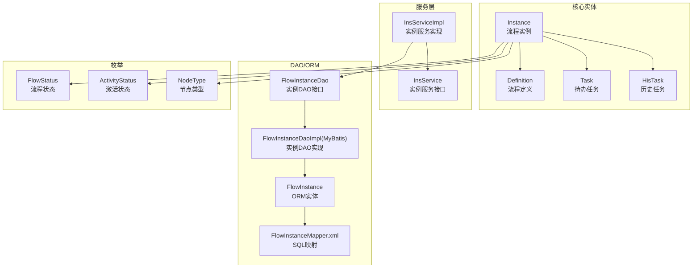
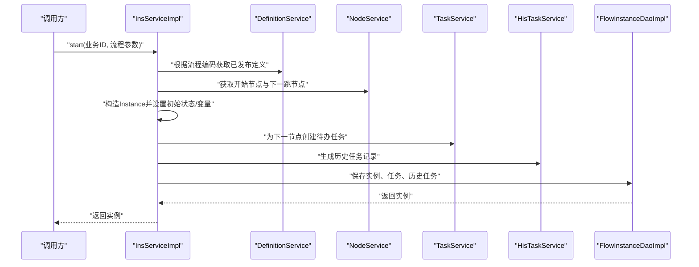
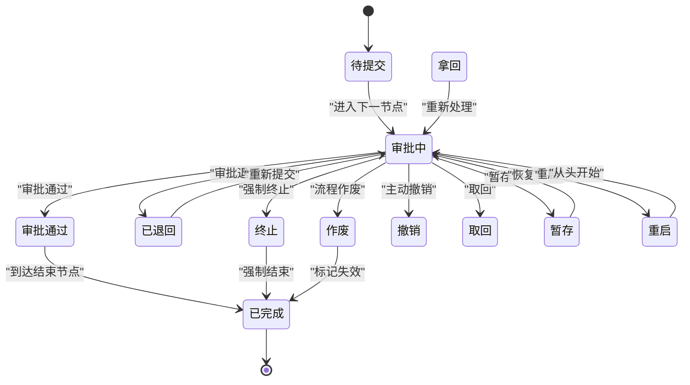
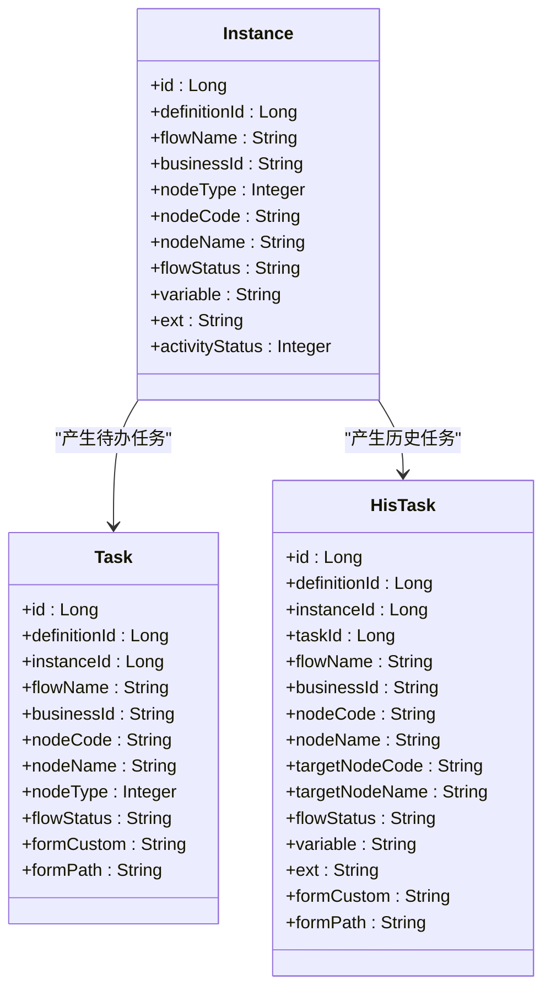
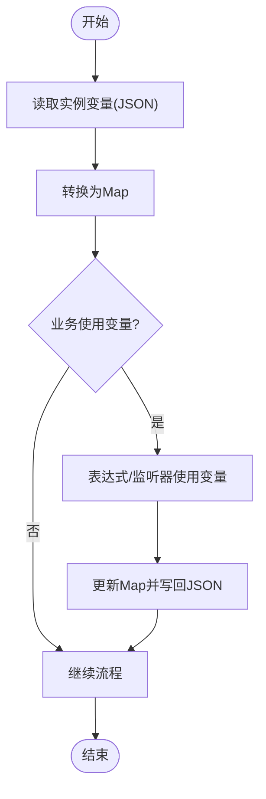
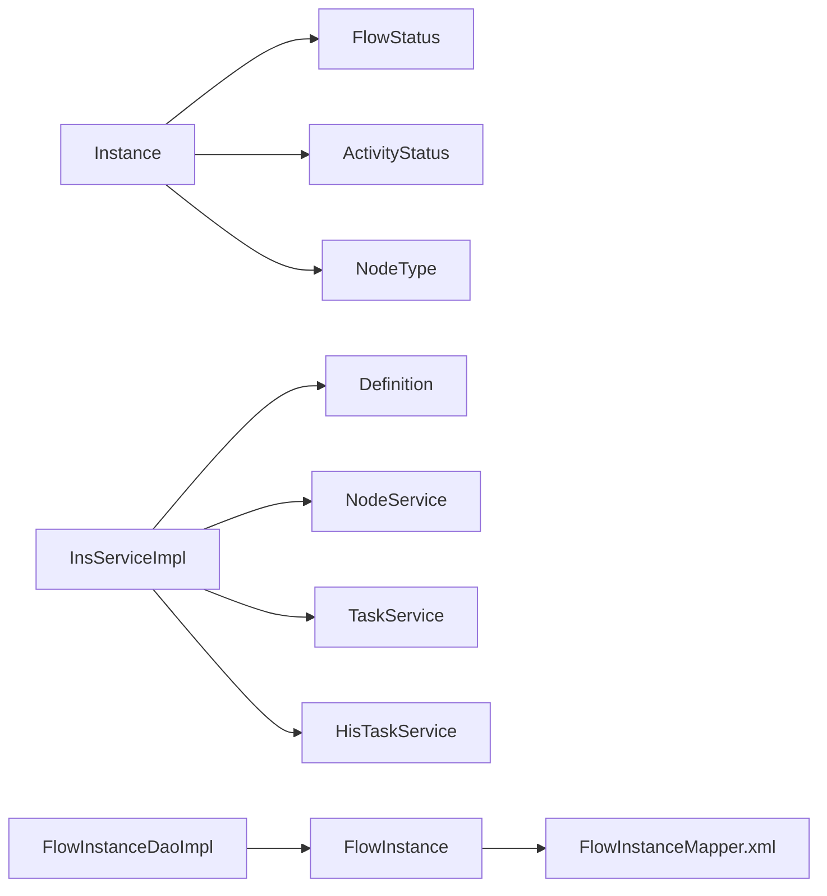

# Instance（流程实例）实体

<cite>
**本文引用的文件**
- [Instance.java](file://warm-flow-core/src/main/java/org/dromara/warm/flow/core/entity/Instance.java)
- [FlowStatus.java](file://warm-flow-core/src/main/java/org/dromara/warm/flow/core/enums/FlowStatus.java)
- [ActivityStatus.java](file://warm-flow-core/src/main/java/org/dromara/warm/flow/core/enums/ActivityStatus.java)
- [NodeType.java](file://warm-flow-core/src/main/java/org/dromara/warm/flow/core/enums/NodeType.java)
- [InsService.java](file://warm-flow-core/src/main/java/org/dromara/warm/flow/core/service/InsService.java)
- [InsServiceImpl.java](file://warm-flow-core/src/main/java/org/dromara/warm/flow/core/service/impl/InsServiceImpl.java)
- [Definition.java](file://warm-flow-core/src/main/java/org/dromara/warm/flow/core/entity/Definition.java)
- [Task.java](file://warm-flow-core/src/main/java/org/dromara/warm/flow/core/entity/Task.java)
- [HisTask.java](file://warm-flow-core/src/main/java/org/dromara/warm/flow/core/entity/HisTask.java)
- [FlowInstanceDao.java](file://warm-flow-core/src/main/java/org/dromara/warm/flow/core/orm/dao/FlowInstanceDao.java)
- [FlowInstanceDaoImpl（MyBatis）.java](file://warm-flow-orm/warm-flow-mybatis-plus-core/src/main/java/org/dromara/warm/flow/orm/dao/FlowInstanceDaoImpl.java)
- [FlowInstance.java（MyBatis 实体）](file://warm-flow-orm/warm-flow-mybatis-plus-core/src/main/java/org/dromara/warm/flow/orm/entity/FlowInstance.java)
- [FlowInstanceMapper.xml（MyBatis 映射）](file://warm-flow-orm/warm-flow-mybatis-plus-core/src/main/resources/warm/flow/FlowInstanceMapper.xml)
</cite>

## 目录
1. [简介](#简介)
2. [项目结构](#项目结构)
3. [核心组件](#核心组件)
4. [架构总览](#架构总览)
5. [详细组件分析](#详细组件分析)
6. [依赖分析](#依赖分析)
7. [性能考虑](#性能考虑)
8. [故障排查指南](#故障排查指南)
9. [结论](#结论)
10. [附录](#附录)

## 简介
本文件围绕流程实例（Instance）实体展开，系统性阐述其设计理念、核心字段、生命周期管理、状态机与状态转换规则、与流程定义（Definition）及任务（Task/HisTask）的层级关系，并结合服务层（InsService/InsServiceImpl）说明实例的创建、状态跟踪、变量管理与历史查询等关键能力。目标是帮助开发者全面理解Instance在工作流执行过程中的核心地位与管理策略。

## 项目结构
Instance位于核心模块的实体层，配合枚举（FlowStatus、ActivityStatus、NodeType）、服务层（InsService/InsServiceImpl）、DAO层（FlowInstanceDao/FlowInstanceDaoImpl）以及ORM实体（FlowInstance）共同构成完整的实例管理闭环。下图展示Instance与其周边组件的关系：

图表来源
- [Instance.java:29-165](file://warm-flow-core/src/main/java/org/dromara/warm/flow/core/entity/Instance.java#L29-L165)
- [Definition.java:29-195](file://warm-flow-core/src/main/java/org/dromara/warm/flow/core/entity/Definition.java#L29-L195)
- [Task.java:27-135](file://warm-flow-core/src/main/java/org/dromara/warm/flow/core/entity/Task.java#L27-L135)
- [HisTask.java:30-163](file://warm-flow-core/src/main/java/org/dromara/warm/flow/core/entity/HisTask.java#L30-L163)
- [InsService.java:30-93](file://warm-flow-core/src/main/java/org/dromara/warm/flow/core/service/InsService.java#L30-L93)
- [InsServiceImpl.java:46-244](file://warm-flow-core/src/main/java/org/dromara/warm/flow/core/service/impl/InsServiceImpl.java#L46-L244)
- [FlowInstanceDao.java:28-37](file://warm-flow-core/src/main/java/org/dromara/warm/flow/core/orm/dao/FlowInstanceDao.java#L28-L37)
- [FlowInstanceDaoImpl（MyBatis）.java](file://warm-flow-orm/warm-flow-mybatis-plus-core/src/main/java/org/dromara/warm/flow/orm/dao/FlowInstanceDaoImpl.java)
- [FlowInstance.java（MyBatis 实体）](file://warm-flow-orm/warm-flow-mybatis-plus-core/src/main/java/org/dromara/warm/flow/orm/entity/FlowInstance.java)
- [FlowInstanceMapper.xml（MyBatis 映射）](file://warm-flow-orm/warm-flow-mybatis-plus-core/src/main/resources/warm/flow/FlowInstanceMapper.xml)

章节来源
- [Instance.java:29-165](file://warm-flow-core/src/main/java/org/dromara/warm/flow/core/entity/Instance.java#L29-L165)
- [InsService.java:30-93](file://warm-flow-core/src/main/java/org/dromara/warm/flow/core/service/InsService.java#L30-L93)
- [InsServiceImpl.java:46-244](file://warm-flow-core/src/main/java/org/dromara/warm/flow/core/service/impl/InsServiceImpl.java#L46-L244)

## 核心组件
- 实体层：Instance（流程实例），包含实例ID、流程定义ID、实例标题（流程名称）、实例状态（FlowStatus）、节点类型/代码/名称、业务ID、流程变量、扩展信息、激活状态等。
- 枚举层：FlowStatus（流程状态）、ActivityStatus（激活状态）、NodeType（节点类型）。
- 服务层：InsService/InsServiceImpl（实例创建、状态控制、变量管理、批量删除等）。
- DAO/ORM层：FlowInstanceDao/FlowInstanceDaoImpl（持久化接口与实现），FlowInstance（ORM实体），FlowInstanceMapper.xml（SQL映射）。

章节来源
- [Instance.java:73-163](file://warm-flow-core/src/main/java/org/dromara/warm/flow/core/entity/Instance.java#L73-L163)
- [FlowStatus.java:30-102](file://warm-flow-core/src/main/java/org/dromara/warm/flow/core/enums/FlowStatus.java#L30-L102)
- [ActivityStatus.java:30-54](file://warm-flow-core/src/main/java/org/dromara/warm/flow/core/enums/ActivityStatus.java#L30-L54)
- [NodeType.java:30-158](file://warm-flow-core/src/main/java/org/dromara/warm/flow/core/enums/NodeType.java#L30-L158)
- [InsService.java:30-93](file://warm-flow-core/src/main/java/org/dromara/warm/flow/core/service/InsService.java#L30-L93)
- [InsServiceImpl.java:46-244](file://warm-flow-core/src/main/java/org/dromara/warm/flow/core/service/impl/InsServiceImpl.java#L46-L244)
- [FlowInstanceDao.java:28-37](file://warm-flow-core/src/main/java/org/dromara/warm/flow/core/orm/dao/FlowInstanceDao.java#L28-L37)

## 架构总览
Instance贯穿“创建—流转—归档”的完整生命周期，与Definition建立一对多关系，与Task/HisTask形成实例级的任务承载与历史归档关系。InsServiceImpl负责实例的启动、状态切换、变量维护与批量清理；DAO层负责持久化操作。

图表来源
- [InsServiceImpl.java:54-111](file://warm-flow-core/src/main/java/org/dromara/warm/flow/core/service/impl/InsServiceImpl.java#L54-L111)
- [InsService.java:46](file://warm-flow-core/src/main/java/org/dromara/warm/flow/core/service/InsService.java#L46)
- [FlowInstanceDaoImpl（MyBatis）.java](file://warm-flow-orm/warm-flow-mybatis-plus-core/src/main/java/org/dromara/warm/flow/orm/dao/FlowInstanceDaoImpl.java)
- [FlowInstanceMapper.xml（MyBatis 映射）](file://warm-flow-orm/warm-flow-mybatis-plus-core/src/main/resources/warm/flow/FlowInstanceMapper.xml)

## 详细组件分析

### 实体设计与核心字段
- 实例ID：继承自RootEntity，用于唯一标识流程实例。
- 流程定义ID：关联Definition，决定实例所属流程模板。
- 实例标题/流程名称：用于界面展示与检索。
- 实例状态：采用FlowStatus枚举，覆盖从“待提交”到“已完成/重启/暂存”等全链路状态。
- 节点信息：nodeType/nodeCode/nodeName，标识当前实例所处的节点类型与定位。
- 业务ID：用于业务侧关联与批量管理。
- 变量：以字符串形式存储JSON，提供getVariableMap便捷访问；支持按key删除变量。
- 扩展信息：ext字段预留业务扩展。
- 激活状态：ActivityStatus（激活/挂起），用于控制实例是否可继续流转。

章节来源
- [Instance.java:73-163](file://warm-flow-core/src/main/java/org/dromara/warm/flow/core/entity/Instance.java#L73-L163)

### 实例状态机与状态转换规则
- FlowStatus枚举涵盖“待提交、审批中、审批通过、自动完成、终止、作废、撤销、取回、已完成、已退回、失效、拿回、重启、暂存”等状态键值对。
- isFinished用于判断是否为“已完成”，便于流程结束判定。
- 实例的初始状态通常由InsServiceImpl在启动时设置为“待提交”或自定义状态。
- 激活状态（ActivityStatus）控制实例是否允许流转：激活（ACTIVITY）允许继续，挂起（SUSPENDED）阻止流转。

图表来源
- [FlowStatus.java:30-102](file://warm-flow-core/src/main/java/org/dromara/warm/flow/core/enums/FlowStatus.java#L30-L102)
- [ActivityStatus.java:30-54](file://warm-flow-core/src/main/java/org/dromara/warm/flow/core/enums/ActivityStatus.java#L30-L54)

章节来源
- [FlowStatus.java:30-102](file://warm-flow-core/src/main/java/org/dromara/warm/flow/core/enums/FlowStatus.java#L30-L102)
- [ActivityStatus.java:30-54](file://warm-flow-core/src/main/java/org/dromara/warm/flow/core/enums/ActivityStatus.java#L30-L54)

### 实例与流程定义的关联关系
- Instance通过definitionId关联Definition，确保实例在正确的流程模板下运行。
- Definition提供流程编码、名称、版本、发布状态、表单定制等信息，影响实例的表单路径与监听器行为。
- 启动流程时，InsServiceImpl会校验Definition的发布状态与激活状态，保证流程可用。

章节来源
- [Instance.java:77](file://warm-flow-core/src/main/java/org/dromara/warm/flow/core/entity/Instance.java#L77)
- [Definition.java:76-126](file://warm-flow-core/src/main/java/org/dromara/warm/flow/core/entity/Definition.java#L76-L126)
- [InsServiceImpl.java:58-68](file://warm-flow-core/src/main/java/org/dromara/warm/flow/core/service/impl/InsServiceImpl.java#L58-L68)

### 实例与任务的层级结构
- 实例与任务（Task）：实例启动后，会为下一节点创建待办任务，任务携带节点类型、节点代码、节点名称、流程状态等信息。
- 实例与历史任务（HisTask）：当任务完成或跳过时，会生成历史任务记录，保留审批人、协作类型、变量、扩展信息等审计数据。
- InsServiceImpl在启动流程时，会同时生成历史任务与待办任务，并在完成后统一保存。

图表来源
- [Instance.java:73-163](file://warm-flow-core/src/main/java/org/dromara/warm/flow/core/entity/Instance.java#L73-L163)
- [Task.java:75-134](file://warm-flow-core/src/main/java/org/dromara/warm/flow/core/entity/Task.java#L75-L134)
- [HisTask.java:66-161](file://warm-flow-core/src/main/java/org/dromara/warm/flow/core/entity/HisTask.java#L66-L161)

章节来源
- [Task.java:75-134](file://warm-flow-core/src/main/java/org/dromara/warm/flow/core/entity/Task.java#L75-L134)
- [HisTask.java:66-161](file://warm-flow-core/src/main/java/org/dromara/warm/flow/core/entity/HisTask.java#L66-L161)
- [InsServiceImpl.java:84-104](file://warm-flow-core/src/main/java/org/dromara/warm/flow/core/service/impl/InsServiceImpl.java#L84-L104)

### 实例变量的作用机制与数据传递
- 变量以JSON字符串形式存储于Instance.variable，提供getVariableMap便捷访问，便于业务侧读取与写入。
- InsServiceImpl在启动流程时，将FlowParams.variable序列化为JSON并写入实例；在后续任务创建与表达式计算中，变量参与用户与路径决策。
- 支持按key删除变量，便于清理敏感或临时数据。

图表来源
- [Instance.java:125-127](file://warm-flow-core/src/main/java/org/dromara/warm/flow/core/entity/Instance.java#L125-L127)
- [InsServiceImpl.java:187](file://warm-flow-core/src/main/java/org/dromara/warm/flow/core/service/impl/InsServiceImpl.java#L187)
- [InsServiceImpl.java:233-243](file://warm-flow-core/src/main/java/org/dromara/warm/flow/core/service/impl/InsServiceImpl.java#L233-L243)

章节来源
- [Instance.java:121-127](file://warm-flow-core/src/main/java/org/dromara/warm/flow/core/entity/Instance.java#L121-L127)
- [InsServiceImpl.java:187](file://warm-flow-core/src/main/java/org/dromara/warm/flow/core/service/impl/InsServiceImpl.java#L187)
- [InsServiceImpl.java:233-243](file://warm-flow-core/src/main/java/org/dromara/warm/flow/core/service/impl/InsServiceImpl.java#L233-L243)

### 实例扩展信息的存储与查询
- ext字段用于业务侧扩展，InsService/InsServiceImpl不直接干预其内容，仅在创建/更新时透传。
- 查询层面可通过DAO按定义ID集合批量查询实例列表，便于业务侧按流程维度聚合。

章节来源
- [Instance.java:153-155](file://warm-flow-core/src/main/java/org/dromara/warm/flow/core/entity/Instance.java#L153-L155)
- [FlowInstanceDao.java:30-36](file://warm-flow-core/src/main/java/org/dromara/warm/flow/core/orm/dao/FlowInstanceDao.java#L30-L36)
- [InsService.java:83](file://warm-flow-core/src/main/java/org/dromara/warm/flow/core/service/InsService.java#L83)

### 实例生命周期管理
- 创建：InsServiceImpl.start根据流程定义与参数创建实例、历史任务与待办任务，设置初始状态与变量。
- 运行：实例在各节点间流转，状态随审批动作变化；可通过active/unActive控制激活状态。
- 归档：流程结束后，历史任务与实例信息长期留存，支持审计与复盘。

章节来源
- [InsServiceImpl.java:54-111](file://warm-flow-core/src/main/java/org/dromara/warm/flow/core/service/impl/InsServiceImpl.java#L54-L111)
- [InsServiceImpl.java:217-230](file://warm-flow-core/src/main/java/org/dromara/warm/flow/core/service/impl/InsServiceImpl.java#L217-L230)

## 依赖分析
- Instance依赖FlowStatus、ActivityStatus、NodeType进行状态与节点语义表达。
- InsServiceImpl依赖Definition、Node、Task、HisTask服务完成实例创建与流转。
- DAO层通过FlowInstanceDao/Impl与ORM实体/映射文件完成持久化。

图表来源
- [Instance.java:129-135](file://warm-flow-core/src/main/java/org/dromara/warm/flow/core/entity/Instance.java#L129-L135)
- [FlowStatus.java:30-102](file://warm-flow-core/src/main/java/org/dromara/warm/flow/core/enums/FlowStatus.java#L30-L102)
- [ActivityStatus.java:30-54](file://warm-flow-core/src/main/java/org/dromara/warm/flow/core/enums/ActivityStatus.java#L30-L54)
- [NodeType.java:30-158](file://warm-flow-core/src/main/java/org/dromara/warm/flow/core/enums/NodeType.java#L30-L158)
- [InsServiceImpl.java:58-104](file://warm-flow-core/src/main/java/org/dromara/warm/flow/core/service/impl/InsServiceImpl.java#L58-L104)
- [FlowInstanceDaoImpl（MyBatis）.java](file://warm-flow-orm/warm-flow-mybatis-plus-core/src/main/java/org/dromara/warm/flow/orm/dao/FlowInstanceDaoImpl.java)
- [FlowInstanceMapper.xml（MyBatis 映射）](file://warm-flow-orm/warm-flow-mybatis-plus-core/src/main/resources/warm/flow/FlowInstanceMapper.xml)

章节来源
- [InsServiceImpl.java:58-104](file://warm-flow-core/src/main/java/org/dromara/warm/flow/core/service/impl/InsServiceImpl.java#L58-L104)
- [FlowInstanceDaoImpl（MyBatis）.java](file://warm-flow-orm/warm-flow-mybatis-plus-core/src/main/java/org/dromara/warm/flow/orm/dao/FlowInstanceDaoImpl.java)
- [FlowInstanceMapper.xml（MyBatis 映射）](file://warm-flow-orm/warm-flow-mybatis-plus-core/src/main/resources/warm/flow/FlowInstanceMapper.xml)

## 性能考虑
- 变量序列化/反序列化：变量以JSON字符串存储，建议避免过大对象，必要时拆分或压缩。
- 批量删除：InsServiceImpl.remove支持按实例ID批量删除任务与历史任务，减少多次IO。
- 查询优化：通过FlowInstanceDao.getByDefIds按定义ID集合批量查询，降低网络往返。
- 激活状态控制：通过unActive/active快速阻断或恢复实例流转，避免无效计算。

## 故障排查指南
- 启动失败：检查流程定义是否已发布且处于激活状态；确认开始节点存在。
- 状态异常：核对FlowStatus键值是否正确；检查isFinished判断逻辑。
- 变量丢失：确认变量写入与保存顺序；排查按key删除逻辑。
- 实例不可流转：检查实例激活状态是否为挂起。

章节来源
- [InsServiceImpl.java:58-68](file://warm-flow-core/src/main/java/org/dromara/warm/flow/core/service/impl/InsServiceImpl.java#L58-L68)
- [FlowStatus.java:98-100](file://warm-flow-core/src/main/java/org/dromara/warm/flow/core/enums/FlowStatus.java#L98-L100)
- [InsServiceImpl.java:233-243](file://warm-flow-core/src/main/java/org/dromara/warm/flow/core/service/impl/InsServiceImpl.java#L233-L243)
- [InsServiceImpl.java:217-230](file://warm-flow-core/src/main/java/org/dromara/warm/flow/core/service/impl/InsServiceImpl.java#L217-L230)

## 结论
Instance作为流程执行的载体，通过清晰的状态机、与Definition/Task/HisTask的紧密耦合，以及完善的变量与扩展机制，支撑了从创建、流转到归档的全生命周期管理。InsService/InsServiceImpl提供了稳健的启动、状态控制与变量管理能力，DAO层则保障了高可靠的数据持久化。开发者应重点关注状态转换规则、变量治理与批量操作的性能优化。

## 附录

### 实际使用示例（步骤说明）
- 实例创建
  - 准备业务ID与流程参数（包含流程编码、当前处理人、可选变量、扩展信息等）。
  - 调用InsService.start，系统根据流程定义与参数创建实例、历史任务与待办任务。
  - 参考路径：[InsService.start](file://warm-flow-core/src/main/java/org/dromara/warm/flow/core/service/InsService.java#L46)，[InsServiceImpl.start:54-111](file://warm-flow-core/src/main/java/org/dromara/warm/flow/core/service/impl/InsServiceImpl.java#L54-L111)

- 状态跟踪
  - 通过FlowStatus枚举键值判断实例状态；使用isFinished判断流程是否结束。
  - 参考路径：[FlowStatus枚举:30-102](file://warm-flow-core/src/main/java/org/dromara/warm/flow/core/enums/FlowStatus.java#L30-L102)

- 变量管理
  - 写入：在启动或后续处理中将Map写回实例变量字段。
  - 读取：通过getVariableMap便捷访问。
  - 删除：按key删除变量并保存。
  - 参考路径：[Instance变量访问:121-127](file://warm-flow-core/src/main/java/org/dromara/warm/flow/core/entity/Instance.java#L121-L127)，[InsServiceImpl变量处理](file://warm-flow-core/src/main/java/org/dromara/warm/flow/core/service/impl/InsServiceImpl.java#L187)，[InsServiceImpl删除变量:233-243](file://warm-flow-core/src/main/java/org/dromara/warm/flow/core/service/impl/InsServiceImpl.java#L233-L243)

- 历史查询
  - 通过HisTaskService或DAO按实例ID查询历史任务，获取审批意见、变量与扩展信息。
  - 参考路径：[HisTask实体:66-161](file://warm-flow-core/src/main/java/org/dromara/warm/flow/core/entity/HisTask.java#L66-L161)

- 实例激活/挂起
  - 使用InsService.active/unActive控制实例是否可继续流转。
  - 参考路径：[InsService.active/unActive:68-75](file://warm-flow-core/src/main/java/org/dromara/warm/flow/core/service/InsService.java#L68-L75)，[InsServiceImpl.active/unActive:217-230](file://warm-flow-core/src/main/java/org/dromara/warm/flow/core/service/impl/InsServiceImpl.java#L217-L230)