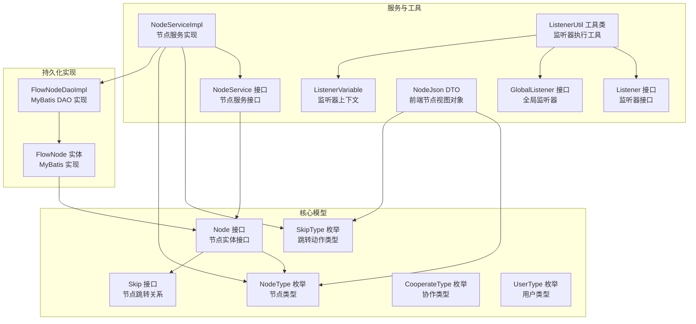
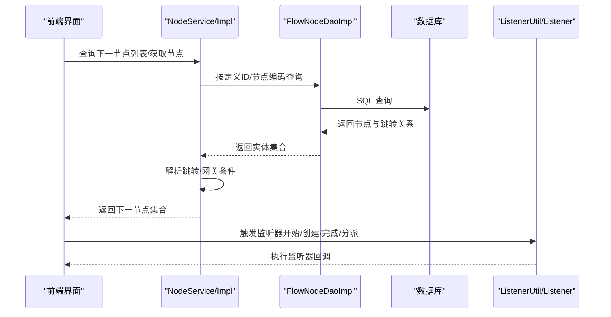
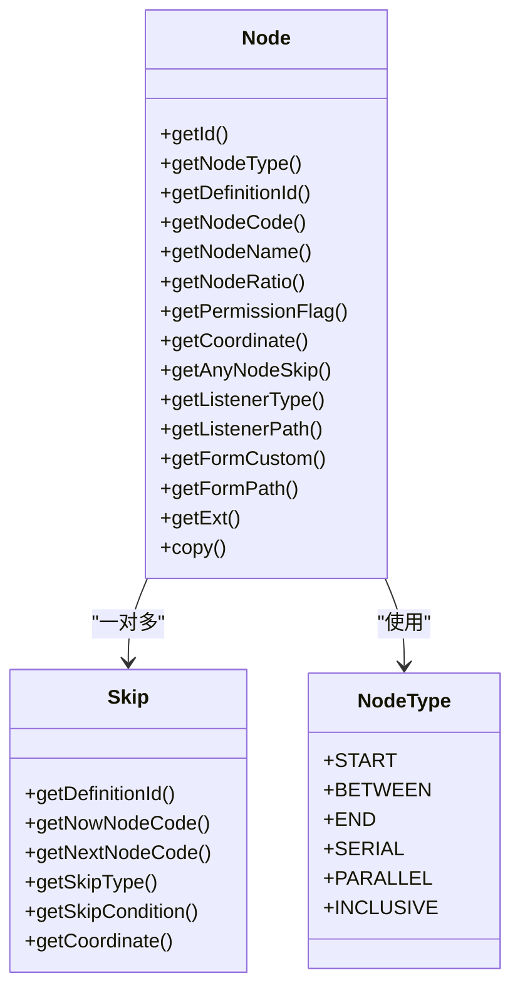
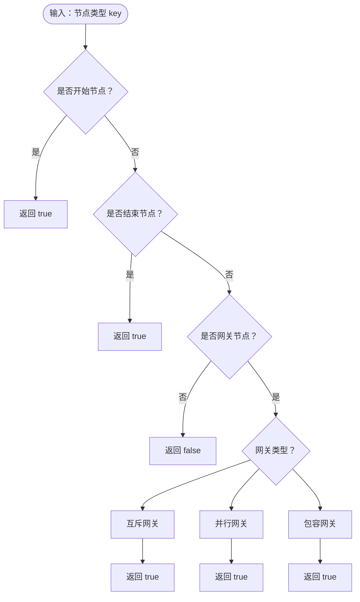
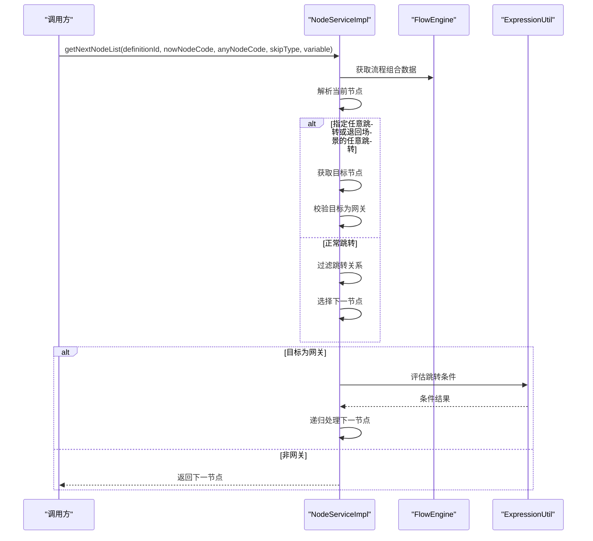
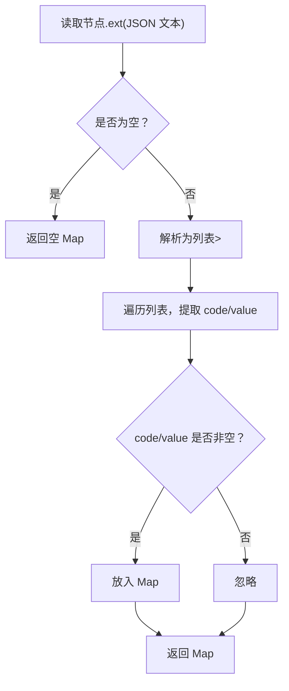
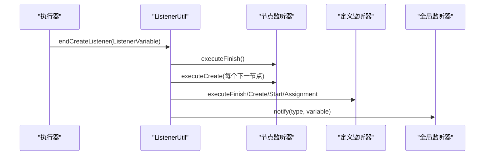
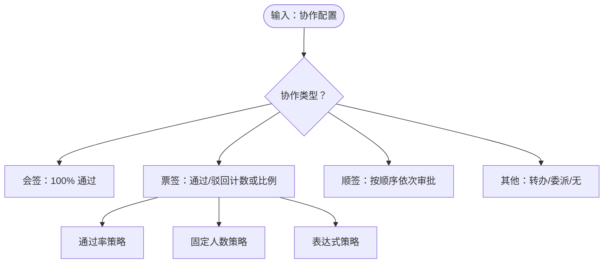
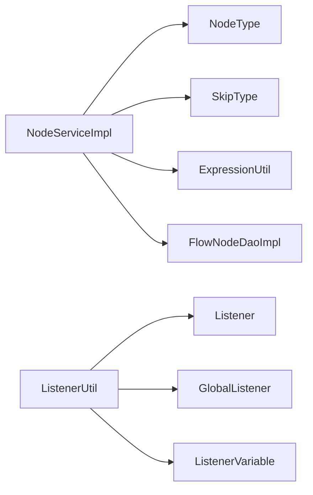

# Node（流程节点）实体

<cite>
**本文档引用的文件**
- [Node.java](file://warm-flow-core/src/main/java/org/dromara/warm/flow/core/entity/Node.java)
- [NodeType.java](file://warm-flow-core/src/main/java/org/dromara/warm/flow/core/enums/NodeType.java)
- [NodeService.java](file://warm-flow-core/src/main/java/org/dromara/warm/flow/core/service/NodeService.java)
- [NodeServiceImpl.java](file://warm-flow-core/src/main/java/org/dromara/warm/flow/core/service/impl/NodeServiceImpl.java)
- [NodeJson.java](file://warm-flow-core/src/main/java/org/dromara/warm/flow/core/dto/NodeJson.java)
- [Skip.java](file://warm-flow-core/src/main/java/org/dromara/warm/flow/core/entity/Skip.java)
- [SkipType.java](file://warm-flow-core/src/main/java/org/dromara/warm/flow/core/enums/SkipType.java)
- [CooperateType.java](file://warm-flow-core/src/main/java/org/dromara/warm/flow/core/enums/CooperateType.java)
- [UserType.java](file://warm-flow-core/src/main/java/org/dromara/warm/flow/core/enums/UserType.java)
- [Listener.java](file://warm-flow-core/src/main/java/org/dromara/warm/flow/core/listener/Listener.java)
- [GlobalListener.java](file://warm-flow-core/src/main/java/org/dromara/warm/flow/core/listener/GlobalListener.java)
- [ListenerUtil.java](file://warm-flow-core/src/main/java/org/dromara/warm/flow/core/utils/ListenerUtil.java)
- [ListenerVariable.java](file://warm-flow-core/src/main/java/org/dromara/warm/flow/core/listener/ListenerVariable.java)
- [FlowNode.java（MyBatis 实现）](file://warm-flow-orm/warm-flow-mybatis-core/src/main/java/org/dromara/warm/flow/orm/entity/FlowNode.java)
- [FlowNodeDaoImpl.java（MyBatis 实现）](file://warm-flow-orm/warm-flow-mybatis-core/src/main/java/org/dromara/warm/flow/orm/dao/FlowNodeDaoImpl.java)
- [warm-flow_1.6.7.sql](file://sql/mysql/v1-upgrade/warm-flow_1.6.7.sql)
- [warm-flow_1.7.4.sql](file://sql/mysql/v1-upgrade/warm-flow_1.7.4.sql)
</cite>

## 目录
1. [简介](#简介)
2. [项目结构](#项目结构)
3. [核心组件](#核心组件)
4. [架构总览](#架构总览)
5. [详细组件分析](#详细组件分析)
6. [依赖关系分析](#依赖关系分析)
7. [性能考虑](#性能考虑)
8. [故障排查指南](#故障排查指南)
9. [结论](#结论)
10. [附录](#附录)

## 简介
本文件围绕 Node（流程节点）实体进行系统化技术文档整理，覆盖节点设计架构、业务逻辑与关键字段，包括节点类型枚举、跳转规则、协作与投票策略、监听器配置与执行时机，以及节点扩展信息的存储与使用方式。同时提供节点创建、配置与状态管理的实践参考路径，帮助开发者快速掌握节点实体的设计思路与在流程设计中的应用。

## 项目结构
Node 实体位于核心模块中，配合枚举、服务层、DAO 层与 UI 展示层共同构成完整的流程节点能力体系。下图展示与 Node 相关的核心文件与职责划分：

**图表来源**
- [Node.java:30-161](file://warm-flow-core/src/main/java/org/dromara/warm/flow/core/entity/Node.java#L30-L161)
- [Skip.java:28-127](file://warm-flow-core/src/main/java/org/dromara/warm/flow/core/entity/Skip.java#L28-L127)
- [NodeType.java:30-160](file://warm-flow-core/src/main/java/org/dromara/warm/flow/core/enums/NodeType.java#L30-L160)
- [SkipType.java:30-100](file://warm-flow-core/src/main/java/org/dromara/warm/flow/core/enums/SkipType.java#L30-L100)
- [CooperateType.java:39-196](file://warm-flow-core/src/main/java/org/dromara/warm/flow/core/enums/CooperateType.java#L39-L196)
- [UserType.java:29-70](file://warm-flow-core/src/main/java/org/dromara/warm/flow/core/enums/UserType.java#L29-L70)
- [NodeService.java:34-228](file://warm-flow-core/src/main/java/org/dromara/warm/flow/core/service/NodeService.java#L34-L228)
- [NodeServiceImpl.java:48-367](file://warm-flow-core/src/main/java/org/dromara/warm/flow/core/service/impl/NodeServiceImpl.java#L48-L367)
- [Listener.java:25-58](file://warm-flow-core/src/main/java/org/dromara/warm/flow/core/listener/Listener.java#L25-L58)
- [GlobalListener.java:26-80](file://warm-flow-core/src/main/java/org/dromara/warm/flow/core/listener/GlobalListener.java#L26-L80)
- [ListenerUtil.java:39-158](file://warm-flow-core/src/main/java/org/dromara/warm/flow/core/utils/ListenerUtil.java#L39-L158)
- [ListenerVariable.java:93-134](file://warm-flow-core/src/main/java/org/dromara/warm/flow/core/listener/ListenerVariable.java#L93-L134)
- [NodeJson.java:38-125](file://warm-flow-core/src/main/java/org/dromara/warm/flow/core/dto/NodeJson.java#L38-L125)
- [FlowNode.java（MyBatis 实现）](file://warm-flow-orm/warm-flow-mybatis-core/src/main/java/org/dromara/warm/flow/orm/entity/FlowNode.java)
- [FlowNodeDaoImpl.java（MyBatis 实现）](file://warm-flow-orm/warm-flow-mybatis-core/src/main/java/org/dromara/warm/flow/orm/dao/FlowNodeDaoImpl.java)

**章节来源**
- [Node.java:30-161](file://warm-flow-core/src/main/java/org/dromara/warm/flow/core/entity/Node.java#L30-L161)
- [NodeService.java:34-228](file://warm-flow-core/src/main/java/org/dromara/warm/flow/core/service/NodeService.java#L34-L228)
- [NodeServiceImpl.java:48-367](file://warm-flow-core/src/main/java/org/dromara/warm/flow/core/service/impl/NodeServiceImpl.java#L48-L367)

## 核心组件
- 节点实体接口：定义节点的标识、所属流程、节点编码、名称、类型、坐标、监听器、表单定制、扩展信息等字段及复制能力。
- 节点类型枚举：涵盖开始、中间、结束、互斥网关、并行网关、包容网关六种类型，并提供类型判定工具方法。
- 节点服务接口与实现：提供节点查询、前后置节点计算、下一节点推导、网关条件判断、扩展信息解析等功能。
- 跳转关系实体与枚举：描述节点之间的流转关系、跳转动作类型（通过/退回/无动作）。
- 协作与用户类型：定义协作方式（会签、票签、加签、减签等）与用户角色类型。
- 监听器体系：支持节点开始、分派、完成、创建等生命周期监听器，以及全局监听器统一入口。
- 前端节点视图：NodeJson 作为前端展示与编辑的载体，包含节点属性、跳转列表、扩展映射等。

**章节来源**
- [Node.java:74-124](file://warm-flow-core/src/main/java/org/dromara/warm/flow/core/entity/Node.java#L74-L124)
- [NodeType.java:30-160](file://warm-flow-core/src/main/java/org/dromara/warm/flow/core/enums/NodeType.java#L30-L160)
- [NodeService.java:34-228](file://warm-flow-core/src/main/java/org/dromara/warm/flow/core/service/NodeService.java#L34-L228)
- [NodeServiceImpl.java:167-288](file://warm-flow-core/src/main/java/org/dromara/warm/flow/core/service/impl/NodeServiceImpl.java#L167-L288)
- [Skip.java:72-110](file://warm-flow-core/src/main/java/org/dromara/warm/flow/core/entity/Skip.java#L72-L110)
- [SkipType.java:30-100](file://warm-flow-core/src/main/java/org/dromara/warm/flow/core/enums/SkipType.java#L30-L100)
- [CooperateType.java:39-196](file://warm-flow-core/src/main/java/org/dromara/warm/flow/core/enums/CooperateType.java#L39-L196)
- [UserType.java:29-70](file://warm-flow-core/src/main/java/org/dromara/warm/flow/core/enums/UserType.java#L29-L70)
- [Listener.java:25-58](file://warm-flow-core/src/main/java/org/dromara/warm/flow/core/listener/Listener.java#L25-L58)
- [GlobalListener.java:26-80](file://warm-flow-core/src/main/java/org/dromara/warm/flow/core/listener/GlobalListener.java#L26-L80)
- [NodeJson.java:38-125](file://warm-flow-core/src/main/java/org/dromara/warm/flow/core/dto/NodeJson.java#L38-L125)

## 架构总览
Node 实体贯穿“模型-服务-持久化-UI”的完整链路，服务层负责业务规则与流程推导，DAO 层负责数据存取，UI 层负责可视化与交互。监听器贯穿任务生命周期，形成可扩展的事件驱动机制。

**图表来源**
- [NodeService.java:144-211](file://warm-flow-core/src/main/java/org/dromara/warm/flow/core/service/NodeService.java#L144-L211)
- [NodeServiceImpl.java:167-288](file://warm-flow-core/src/main/java/org/dromara/warm/flow/core/service/impl/NodeServiceImpl.java#L167-L288)
- [ListenerUtil.java:50-94](file://warm-flow-core/src/main/java/org/dromara/warm/flow/core/utils/ListenerUtil.java#L50-L94)

## 详细组件分析

### 节点实体与字段语义
- 节点标识与归属：节点 ID、所属流程定义 ID、租户标识、软删除标记。
- 节点元信息：节点编码（流程内唯一）、节点名称、节点类型、坐标（节点与文本位置）。
- 节点属性：权限标识（多值）、节点比例（协作/投票策略）、任意跳转目标、监听器类型与路径、表单定制与路径。
- 扩展信息：ext 字段以 JSON 文本形式存储节点扩展属性，服务层提供解析为 Map 的能力。
- 跳转关系：通过 skipList 关联到 Skip 实体，描述当前节点到下一节点的关系与条件。

**图表来源**
- [Node.java:74-160](file://warm-flow-core/src/main/java/org/dromara/warm/flow/core/entity/Node.java#L74-L160)
- [Skip.java:72-125](file://warm-flow-core/src/main/java/org/dromara/warm/flow/core/entity/Skip.java#L72-L125)
- [NodeType.java:30-57](file://warm-flow-core/src/main/java/org/dromara/warm/flow/core/enums/NodeType.java#L30-L57)

**章节来源**
- [Node.java:74-124](file://warm-flow-core/src/main/java/org/dromara/warm/flow/core/entity/Node.java#L74-L124)
- [Node.java:126-160](file://warm-flow-core/src/main/java/org/dromara/warm/flow/core/entity/Node.java#L126-L160)
- [Skip.java:72-110](file://warm-flow-core/src/main/java/org/dromara/warm/flow/core/entity/Skip.java#L72-L110)

### 节点类型枚举（NodeType）
- 取值与含义：
  - 开始节点：流程起点
  - 中间节点：普通审批节点
  - 结束节点：流程终点
  - 互斥网关：排他分支，按条件选择一条路径
  - 并行网关：并行分支，返回多条路径
  - 包容网关：包容分支，满足条件的分支均执行
- 辅助判断方法：isStart/isBetween/isEnd/isGateWay/isGateWaySerial/isGateWayParallel/isGateWayInclusive

**图表来源**
- [NodeType.java:95-158](file://warm-flow-core/src/main/java/org/dromara/warm/flow/core/enums/NodeType.java#L95-L158)

**章节来源**
- [NodeType.java:30-160](file://warm-flow-core/src/main/java/org/dromara/warm/flow/core/enums/NodeType.java#L30-L160)

### 节点跳转规则与下一节点推导
- 跳转类型：通过（PASS）、退回（REJECT）、无动作（NONE），服务层据此筛选跳转关系。
- 任意跳转：当 anyNodeCode 或节点配置的任意跳转目标存在且为退回场景时，优先跳转至指定节点。
- 网关处理：
  - 互斥网关：优先匹配带条件的分支，若无匹配则选择无条件分支。
  - 包容网关：仅保留满足条件的分支，无条件分支默认执行。
  - 并行网关：返回所有符合条件的下一节点集合。
- 路径记录：在路径数据对象中记录经过的节点与边，便于流程图渲染。

**图表来源**
- [NodeServiceImpl.java:167-288](file://warm-flow-core/src/main/java/org/dromara/warm/flow/core/service/impl/NodeServiceImpl.java#L167-L288)
- [SkipType.java:30-100](file://warm-flow-core/src/main/java/org/dromara/warm/flow/core/enums/SkipType.java#L30-L100)

**章节来源**
- [NodeService.java:144-211](file://warm-flow-core/src/main/java/org/dromara/warm/flow/core/service/NodeService.java#L144-L211)
- [NodeServiceImpl.java:167-288](file://warm-flow-core/src/main/java/org/dromara/warm/flow/core/service/impl/NodeServiceImpl.java#L167-L288)

### 节点扩展信息的存储与使用
- 存储格式：节点 ext 字段为 JSON 文本，建议存储为键值对列表，便于解析与检索。
- 解析策略：服务层将 JSON 文本解析为列表，再转为 Map，键为 code，值为 value。
- 版本演进：历史版本曾包含 skip_any_node 字段，现已迁移至 ext 扩展字段。

**图表来源**
- [NodeServiceImpl.java:296-314](file://warm-flow-core/src/main/java/org/dromara/warm/flow/core/service/impl/NodeServiceImpl.java#L296-L314)
- [warm-flow_1.6.7.sql:1-3](file://sql/mysql/v1-upgrade/warm-flow_1.6.7.sql#L1-L3)
- [warm-flow_1.7.4.sql:1-1](file://sql/mysql/v1-upgrade/warm-flow_1.7.4.sql#L1-L1)

**章节来源**
- [NodeServiceImpl.java:296-314](file://warm-flow-core/src/main/java/org/dromara/warm/flow/core/service/impl/NodeServiceImpl.java#L296-L314)
- [NodeJson.java:92-103](file://warm-flow-core/src/main/java/org/dromara/warm/flow/core/dto/NodeJson.java#L92-L103)

### 节点监听器的配置与执行时机
- 监听器类型：开始（start）、分派（assignment）、完成（finish）、创建（create）、表单加载（formLoad）。
- 执行顺序：任务完成监听器 → 下一节点开始监听器（逐个节点执行创建监听器）。
- 执行范围：节点监听器 → 流程定义监听器 → 全局监听器。
- 表达式与类路径：支持表达式监听器与类路径监听器，表达式优先执行。

**图表来源**
- [ListenerUtil.java:50-94](file://warm-flow-core/src/main/java/org/dromara/warm/flow/core/utils/ListenerUtil.java#L50-L94)
- [Listener.java:25-58](file://warm-flow-core/src/main/java/org/dromara/warm/flow/core/listener/Listener.java#L25-L58)
- [GlobalListener.java:26-80](file://warm-flow-core/src/main/java/org/dromara/warm/flow/core/listener/GlobalListener.java#L26-L80)

**章节来源**
- [Listener.java:25-58](file://warm-flow-core/src/main/java/org/dromara/warm/flow/core/listener/Listener.java#L25-L58)
- [ListenerUtil.java:50-158](file://warm-flow-core/src/main/java/org/dromara/warm/flow/core/utils/ListenerUtil.java#L50-L158)
- [GlobalListener.java:26-80](file://warm-flow-core/src/main/java/org/dromara/warm/flow/core/listener/GlobalListener.java#L26-L80)

### 协作类型与投票/签名策略
- 协作类型：无、转办、委派、会签、票签、加签、减签。
- 投票/签名策略：
  - 通过率策略：0%-100% 的比例
  - 固定人数策略：passCount=...、rejectCount=...
  - 表达式策略：default、spel、snel 前缀
  - 顺签策略：以特定后缀标识的表达式
- 用户类型：审批人、转办人、委托人权限区分。

**图表来源**
- [CooperateType.java:39-196](file://warm-flow-core/src/main/java/org/dromara/warm/flow/core/enums/CooperateType.java#L39-L196)
- [UserType.java:29-70](file://warm-flow-core/src/main/java/org/dromara/warm/flow/core/enums/UserType.java#L29-L70)

**章节来源**
- [CooperateType.java:39-196](file://warm-flow-core/src/main/java/org/dromara/warm/flow/core/enums/CooperateType.java#L39-L196)
- [UserType.java:29-70](file://warm-flow-core/src/main/java/org/dromara/warm/flow/core/enums/UserType.java#L29-L70)

### 节点创建、配置与状态管理（实践参考）
- 节点创建与复制：
  - 使用 FlowEngine.newNode() 创建新节点实例
  - 通过 setXXX 方法设置节点属性（类型、编码、名称、坐标、监听器、表单、扩展等）
  - 使用 copy() 方法基于现有节点批量复制属性
- 节点配置要点：
  - 节点编码需保证在流程内唯一
  - 坐标格式：节点坐标|文本坐标，用于前端渲染
  - 监听器类型与路径以逗号/“@”分隔，分别对应不同监听器类型
  - 扩展信息以 JSON 文本存储，建议采用键值对列表
- 状态管理：
  - 节点状态由外部流程引擎维护，前端通过 NodeJson.status 字段展示未办/待办/已办
  - 路径数据对象用于渲染流程图路径

**章节来源**
- [Node.java:142-160](file://warm-flow-core/src/main/java/org/dromara/warm/flow/core/entity/Node.java#L142-L160)
- [NodeJson.java:96-108](file://warm-flow-core/src/main/java/org/dromara/warm/flow/core/dto/NodeJson.java#L96-L108)
- [NodeJson.java:113-124](file://warm-flow-core/src/main/java/org/dromara/warm/flow/core/dto/NodeJson.java#L113-L124)

## 依赖关系分析
- 节点服务实现依赖：
  - 跳转类型与节点类型的枚举用于跳转筛选与网关判断
  - 表达式工具用于网关条件求值
  - DAO 层提供按定义 ID 与节点编码的查询能力
- 监听器执行依赖：
  - 监听器工具类统一执行节点、定义与全局监听器
  - 监听器变量承载流程定义、实例、节点、变量与任务上下文

**图表来源**
- [NodeServiceImpl.java:27-34](file://warm-flow-core/src/main/java/org/dromara/warm/flow/core/service/impl/NodeServiceImpl.java#L27-L34)
- [ListenerUtil.java:83-94](file://warm-flow-core/src/main/java/org/dromara/warm/flow/core/utils/ListenerUtil.java#L83-L94)

**章节来源**
- [NodeServiceImpl.java:27-34](file://warm-flow-core/src/main/java/org/dromara/warm/flow/core/service/impl/NodeServiceImpl.java#L27-L34)
- [ListenerUtil.java:83-94](file://warm-flow-core/src/main/java/org/dromara/warm/flow/core/utils/ListenerUtil.java#L83-L94)

## 性能考虑
- 路径搜索与去重：服务层在计算前后置节点时使用集合去重与反向排序，避免重复与环形引用导致的性能问题。
- 网关条件求值：表达式求值仅在网关节点发生，且按条件分支筛选，减少不必要的计算。
- 扩展信息解析：仅在需要时解析 JSON 文本，避免频繁序列化/反序列化。
- 数据访问：按定义 ID 一次性加载节点与跳转关系，减少多次查询。

**章节来源**
- [NodeServiceImpl.java:139-165](file://warm-flow-core/src/main/java/org/dromara/warm/flow/core/service/impl/NodeServiceImpl.java#L139-L165)
- [NodeServiceImpl.java:239-287](file://warm-flow-core/src/main/java/org/dromara/warm/flow/core/service/impl/NodeServiceImpl.java#L239-L287)

## 故障排查指南
- 缺失节点编码：在获取下一节点时若当前节点编码为空，将抛出异常，检查前端传参或节点初始化。
- 无可用跳转类型：当节点跳转关系未匹配任何 skipType 时抛出异常，检查跳转配置与动作类型。
- 网关条件不满足：包容网关在条件不满足时会过滤该分支，确认表达式语法与变量是否正确。
- 任意跳转目标非网关：指定任意跳转目标时必须为目标节点为网关，否则抛出异常。
- 开始节点禁止跳转：开始节点不可作为下一节点，检查流程设计是否合理。
- 监听器执行失败：检查监听器路径与类型配置，确保表达式监听器与类路径监听器格式正确。

**章节来源**
- [NodeServiceImpl.java:196-233](file://warm-flow-core/src/main/java/org/dromara/warm/flow/core/service/impl/NodeServiceImpl.java#L196-L233)
- [NodeServiceImpl.java:235-288](file://warm-flow-core/src/main/java/org/dromara/warm/flow/core/service/impl/NodeServiceImpl.java#L235-L288)
- [ListenerUtil.java:96-113](file://warm-flow-core/src/main/java/org/dromara/warm/flow/core/utils/ListenerUtil.java#L96-L113)

## 结论
Node（流程节点）实体通过清晰的接口设计与完善的枚举体系，支撑起流程的可视化建模、规则推导与事件驱动。服务层实现了复杂的跳转与网关逻辑，结合监听器体系与扩展信息，为流程引擎提供了高可扩展性与易用性。开发者在实际应用中应重点关注节点编码唯一性、跳转条件表达式、监听器配置与协作策略的合理性，以确保流程的正确性与可维护性。

## 附录
- 数据库升级脚本：
  - 历史版本移除 skip_any_node，新增 ext 扩展字段
  - 扩展字段类型调整为 text，适配复杂扩展信息存储

**章节来源**
- [warm-flow_1.6.7.sql:1-3](file://sql/mysql/v1-upgrade/warm-flow_1.6.7.sql#L1-L3)
- [warm-flow_1.7.4.sql:1-1](file://sql/mysql/v1-upgrade/warm-flow_1.7.4.sql#L1-L1)