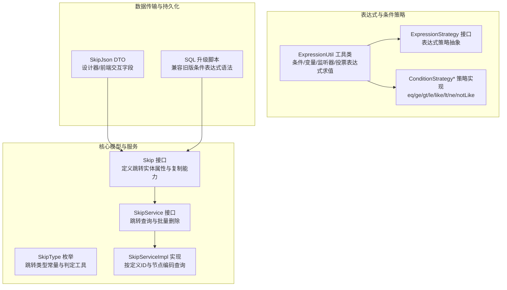
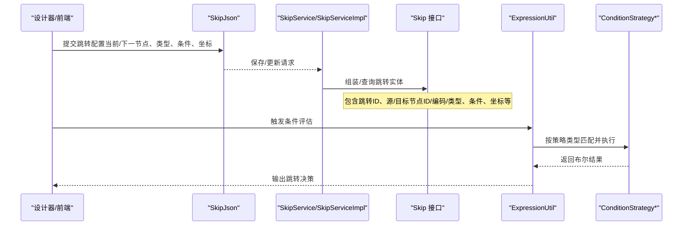
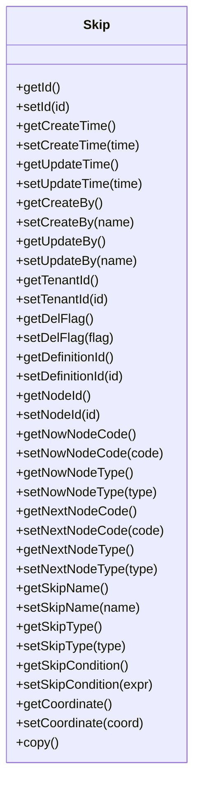
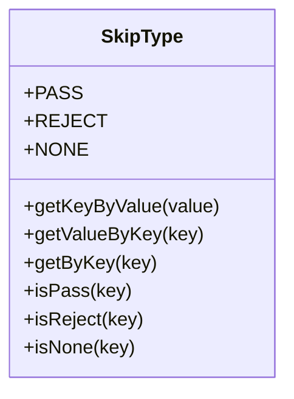
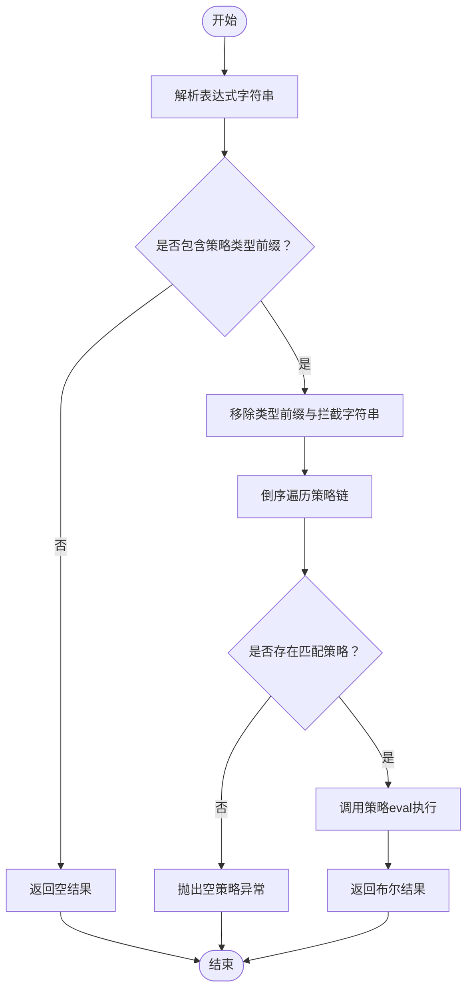
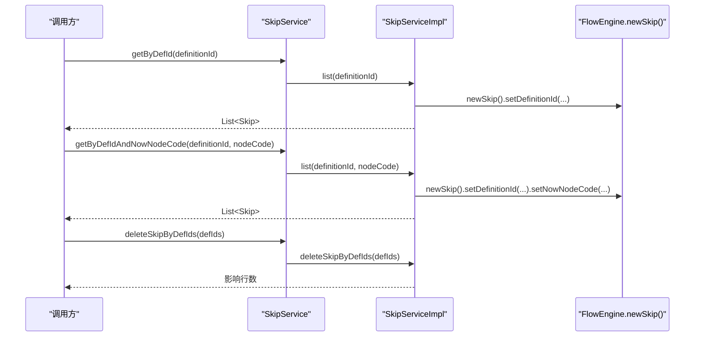
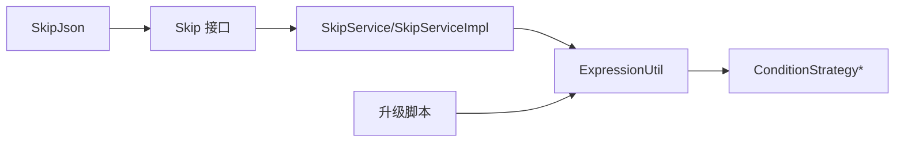

# Skip（节点跳转）实体

<cite>
**本文引用的文件**
- [Skip.java](file://warm-flow-core/src/main/java/org/dromara/warm/flow/core/entity/Skip.java)
- [SkipType.java](file://warm-flow-core/src/main/java/org/dromara/warm/flow/core/enums/SkipType.java)
- [SkipService.java](file://warm-flow-core/src/main/java/org/dromara/warm/flow/core/service/SkipService.java)
- [SkipServiceImpl.java](file://warm-flow-core/src/main/java/org/dromara/warm/flow/core/service/impl/SkipServiceImpl.java)
- [SkipJson.java](file://warm-flow-core/src/main/java/org/dromara/warm/flow/core/dto/SkipJson.java)
- [ExpressionUtil.java](file://warm-flow-core/src/main/java/org/dromara/warm/flow/core/utils/ExpressionUtil.java)
- [ExpressionStrategy.java](file://warm-flow-core/src/main/java/org/dromara/warm/flow/core/strategy/ExpressionStrategy.java)
- [ConditionStrategyEq.java](file://warm-flow-core/src/main/java/org/dromara/warm/flow/core/condition/ConditionStrategyEq.java)
- [ConditionStrategyGe.java](file://warm-flow-core/src/main/java/org/dromara/warm/flow/core/condition/ConditionStrategyGe.java)
- [ConditionStrategyGt.java](file://warm-flow-core/src/main/java/org/dromara/warm/flow/core/condition/ConditionStrategyGt.java)
- [ConditionStrategyLe.java](file://warm-flow-core/src/main/java/org/dromara/warm/flow/core/condition/ConditionStrategyLe.java)
- [ConditionStrategyLike.java](file://warm-flow-core/src/main/java/org/dromara/warm/flow/core/condition/ConditionStrategyLike.java)
- [ConditionStrategyLt.java](file://warm-flow-core/src/main/java/org/dromara/warm/flow/core/condition/ConditionStrategyLt.java)
- [ConditionStrategyNe.java](file://warm-flow-core/src/main/java/org/dromara/warm/flow/core/condition/ConditionStrategyNe.java)
- [ConditionStrategyNotLike.java](file://warm-flow-core/src/main/java/org/dromara/warm/flow/core/condition/ConditionStrategyNotLike.java)
- [warm-flow_1.3.5.sql](file://sql/mysql/v1-upgrade/warm-flow_1.3.5.sql)
</cite>

## 目录
1. [简介](#简介)
2. [项目结构](#项目结构)
3. [核心组件](#核心组件)
4. [架构总览](#架构总览)
5. [详细组件分析](#详细组件分析)
6. [依赖分析](#依赖分析)
7. [性能考虑](#性能考虑)
8. [故障排查指南](#故障排查指南)
9. [结论](#结论)
10. [附录](#附录)

## 简介
本文件围绕 Skip（节点跳转）实体展开，系统性阐述其设计原理与业务规则，覆盖跳转ID、源节点ID、目标节点ID、跳转类型（审批通过、退回、无动作）、条件表达式、坐标信息等关键属性；并结合枚举 SkipType 的取值与判定方法，解释条件表达式的语法规范与执行机制，梳理跳转规则的优先级处理与多条件匹配算法。同时提供跳转规则配置、条件表达式编写与跳转测试的实践建议，帮助开发者在流程控制中正确使用 Skip 实体。

## 项目结构
Skip 实体位于核心模块中，配合服务层、工具类与条件策略共同完成跳转规则的存储、查询与条件评估。下图展示与 Skip 直接相关的代码构件及其职责：

图表来源
- [Skip.java:28-127](file://warm-flow-core/src/main/java/org/dromara/warm/flow/core/entity/Skip.java#L28-L127)
- [SkipType.java:30-100](file://warm-flow-core/src/main/java/org/dromara/warm/flow/core/enums/SkipType.java#L30-L100)
- [SkipService.java:31-57](file://warm-flow-core/src/main/java/org/dromara/warm/flow/core/service/SkipService.java#L31-L57)
- [SkipServiceImpl.java:34-56](file://warm-flow-core/src/main/java/org/dromara/warm/flow/core/service/impl/SkipServiceImpl.java#L34-L56)
- [ExpressionUtil.java:36-195](file://warm-flow-core/src/main/java/org/dromara/warm/flow/core/utils/ExpressionUtil.java#L36-L195)
- [ExpressionStrategy.java:25-60](file://warm-flow-core/src/main/java/org/dromara/warm/flow/core/strategy/ExpressionStrategy.java#L25-L60)
- [ConditionStrategyEq.java](file://warm-flow-core/src/main/java/org/dromara/warm/flow/core/condition/ConditionStrategyEq.java)
- [ConditionStrategyGe.java](file://warm-flow-core/src/main/java/org/dromara/warm/flow/core/condition/ConditionStrategyGe.java)
- [ConditionStrategyGt.java](file://warm-flow-core/src/main/java/org/dromara/warm/flow/core/condition/ConditionStrategyGt.java)
- [ConditionStrategyLe.java](file://warm-flow-core/src/main/java/org/dromara/warm/flow/core/condition/ConditionStrategyLe.java)
- [ConditionStrategyLike.java](file://warm-flow-core/src/main/java/org/dromara/warm/flow/core/condition/ConditionStrategyLike.java)
- [ConditionStrategyLt.java](file://warm-flow-core/src/main/java/org/dromara/warm/flow/core/condition/ConditionStrategyLt.java)
- [ConditionStrategyNe.java](file://warm-flow-core/src/main/java/org/dromara/warm/flow/core/condition/ConditionStrategyNe.java)
- [ConditionStrategyNotLike.java](file://warm-flow-core/src/main/java/org/dromara/warm/flow/core/condition/ConditionStrategyNotLike.java)
- [SkipJson.java:34-85](file://warm-flow-core/src/main/java/org/dromara/warm/flow/core/dto/SkipJson.java#L34-L85)
- [warm-flow_1.3.5.sql:1-35](file://sql/mysql/v1-upgrade/warm-flow_1.3.5.sql#L1-L35)

章节来源
- [Skip.java:28-127](file://warm-flow-core/src/main/java/org/dromara/warm/flow/core/entity/Skip.java#L28-L127)
- [SkipType.java:30-100](file://warm-flow-core/src/main/java/org/dromara/warm/flow/core/enums/SkipType.java#L30-L100)
- [SkipService.java:31-57](file://warm-flow-core/src/main/java/org/dromara/warm/flow/core/service/SkipService.java#L31-L57)
- [SkipServiceImpl.java:34-56](file://warm-flow-core/src/main/java/org/dromara/warm/flow/core/service/impl/SkipServiceImpl.java#L34-L56)
- [ExpressionUtil.java:36-195](file://warm-flow-core/src/main/java/org/dromara/warm/flow/core/utils/ExpressionUtil.java#L36-L195)
- [ExpressionStrategy.java:25-60](file://warm-flow-core/src/main/java/org/dromara/warm/flow/core/strategy/ExpressionStrategy.java#L25-L60)
- [SkipJson.java:34-85](file://warm-flow-core/src/main/java/org/dromara/warm/flow/core/dto/SkipJson.java#L34-L85)
- [warm-flow_1.3.5.sql:1-35](file://sql/mysql/v1-upgrade/warm-flow_1.3.5.sql#L1-L35)

## 核心组件
- Skip 接口：定义跳转实体的核心属性（如定义ID、当前/下一节点编码与类型、跳转名称、跳转类型、跳转条件、坐标等），并提供复制能力以支持流程引擎的克隆与重用。
- SkipType 枚举：提供跳转类型常量与便捷判定方法（通过/退回/无动作），便于在流程控制中快速判断跳转意图。
- SkipService/SkipServiceImpl：提供按流程定义ID与当前节点编码查询跳转线的能力，以及按定义ID批量删除跳转线的接口。
- ExpressionUtil 与 ExpressionStrategy：统一管理表达式策略注册与执行，支持条件表达式、变量表达式、监听器表达式与投票签名表达式，具备策略链倒序匹配与拦截字符串处理机制。
- SkipJson：面向设计器与前端的传输对象，包含当前/下一节点编码、跳转名称、跳转类型、跳转条件、坐标、状态、扩展映射与提示内容等字段。
- SQL 升级脚本：兼容历史版本的条件表达式语法，确保旧数据在升级后仍可被正确识别与执行。

章节来源
- [Skip.java:28-127](file://warm-flow-core/src/main/java/org/dromara/warm/flow/core/entity/Skip.java#L28-L127)
- [SkipType.java:30-100](file://warm-flow-core/src/main/java/org/dromara/warm/flow/core/enums/SkipType.java#L30-L100)
- [SkipService.java:31-57](file://warm-flow-core/src/main/java/org/dromara/warm/flow/core/service/SkipService.java#L31-L57)
- [SkipServiceImpl.java:34-56](file://warm-flow-core/src/main/java/org/dromara/warm/flow/core/service/impl/SkipServiceImpl.java#L34-L56)
- [ExpressionUtil.java:36-195](file://warm-flow-core/src/main/java/org/dromara/warm/flow/core/utils/ExpressionUtil.java#L36-L195)
- [ExpressionStrategy.java:25-60](file://warm-flow-core/src/main/java/org/dromara/warm/flow/core/strategy/ExpressionStrategy.java#L25-L60)
- [SkipJson.java:34-85](file://warm-flow-core/src/main/java/org/dromara/warm/flow/core/dto/SkipJson.java#L34-L85)
- [warm-flow_1.3.5.sql:1-35](file://sql/mysql/v1-upgrade/warm-flow_1.3.5.sql#L1-L35)

## 架构总览
下图展示 Skip 在流程引擎中的整体交互：前端/设计器通过 SkipJson 提交跳转配置，Skip 接口承载实体属性，SkipService 提供查询与批量删除，ExpressionUtil 负责条件表达式的解析与执行，ConditionStrategy* 实现具体比较策略。

图表来源
- [SkipJson.java:34-85](file://warm-flow-core/src/main/java/org/dromara/warm/flow/core/dto/SkipJson.java#L34-L85)
- [SkipService.java:31-57](file://warm-flow-core/src/main/java/org/dromara/warm/flow/core/service/SkipService.java#L31-L57)
- [SkipServiceImpl.java:34-56](file://warm-flow-core/src/main/java/org/dromara/warm/flow/core/service/impl/SkipServiceImpl.java#L34-L56)
- [Skip.java:28-127](file://warm-flow-core/src/main/java/org/dromara/warm/flow/core/entity/Skip.java#L28-L127)
- [ExpressionUtil.java:36-195](file://warm-flow-core/src/main/java/org/dromara/warm/flow/core/utils/ExpressionUtil.java#L36-L195)
- [ConditionStrategyEq.java](file://warm-flow-core/src/main/java/org/dromara/warm/flow/core/condition/ConditionStrategyEq.java)
- [ConditionStrategyGe.java](file://warm-flow-core/src/main/java/org/dromara/warm/flow/core/condition/ConditionStrategyGe.java)
- [ConditionStrategyGt.java](file://warm-flow-core/src/main/java/org/dromara/warm/flow/core/condition/ConditionStrategyGt.java)
- [ConditionStrategyLe.java](file://warm-flow-core/src/main/java/org/dromara/warm/flow/core/condition/ConditionStrategyLe.java)
- [ConditionStrategyLike.java](file://warm-flow-core/src/main/java/org/dromara/warm/flow/core/condition/ConditionStrategyLike.java)
- [ConditionStrategyLt.java](file://warm-flow-core/src/main/java/org/dromara/warm/flow/core/condition/ConditionStrategyLt.java)
- [ConditionStrategyNe.java](file://warm-flow-core/src/main/java/org/dromara/warm/flow/core/condition/ConditionStrategyNe.java)
- [ConditionStrategyNotLike.java](file://warm-flow-core/src/main/java/org/dromara/warm/flow/core/condition/ConditionStrategyNotLike.java)

## 详细组件分析

### Skip 接口与属性语义
- 关键属性
  - 定义ID：标识所属流程定义
  - 源节点ID/编码/类型：当前节点标识与类型
  - 目标节点ID/编码/类型：下一节点标识与类型
  - 跳转名称：用于展示与调试
  - 跳转类型：由 SkipType 枚举约束（通过/退回/无动作）
  - 跳转条件：条件表达式字符串，用于动态判定是否满足跳转
  - 坐标：流程图连线坐标，用于可视化布局
- 复制能力：copy 方法基于引擎工厂创建新的 Skip 实例，便于流程克隆与实例化

图表来源
- [Skip.java:28-127](file://warm-flow-core/src/main/java/org/dromara/warm/flow/core/entity/Skip.java#L28-L127)

章节来源
- [Skip.java:28-127](file://warm-flow-core/src/main/java/org/dromara/warm/flow/core/entity/Skip.java#L28-L127)

### SkipType 枚举与使用场景
- 取值与含义
  - 审批通过（PASS）：表示流程向下一节点推进
  - 退回（REJECT）：表示流程回退至上一或指定节点
  - 无动作（NONE）：不改变流程方向，常用于仅记录不流转的场景
- 判定工具
  - 通过/退回/无动作的便捷判断方法，便于在业务分支中快速分流

图表来源
- [SkipType.java:30-100](file://warm-flow-core/src/main/java/org/dromara/warm/flow/core/enums/SkipType.java#L30-L100)

章节来源
- [SkipType.java:30-100](file://warm-flow-core/src/main/java/org/dromara/warm/flow/core/enums/SkipType.java#L30-L100)

### 条件表达式语法规范与执行机制
- 语法规范
  - 表达式以“策略类型+分隔符+参数”的形式组织，例如“eq|flag|4”
  - 历史版本中曾使用“@@策略@@|”占位符，升级脚本已将其替换为“策略|”，保证兼容性
- 执行机制
  - ExpressionUtil.evalCondition 将表达式交由策略链处理
  - 策略链采用倒序匹配，优先匹配后注册的策略实现
  - 支持拦截字符串处理，去除类型前缀后再交给具体策略执行
  - ConditionStrategy* 实现了多种比较运算（等于、大于、小于、大于等于、小于等于、不等、模糊匹配、非模糊匹配）

图表来源
- [ExpressionUtil.java:69-173](file://warm-flow-core/src/main/java/org/dromara/warm/flow/core/utils/ExpressionUtil.java#L69-L173)
- [ExpressionStrategy.java:25-60](file://warm-flow-core/src/main/java/org/dromara/warm/flow/core/strategy/ExpressionStrategy.java#L25-L60)
- [ConditionStrategyEq.java](file://warm-flow-core/src/main/java/org/dromara/warm/flow/core/condition/ConditionStrategyEq.java)
- [ConditionStrategyGe.java](file://warm-flow-core/src/main/java/org/dromara/warm/flow/core/condition/ConditionStrategyGe.java)
- [ConditionStrategyGt.java](file://warm-flow-core/src/main/java/org/dromara/warm/flow/core/condition/ConditionStrategyGt.java)
- [ConditionStrategyLe.java](file://warm-flow-core/src/main/java/org/dromara/warm/flow/core/condition/ConditionStrategyLe.java)
- [ConditionStrategyLike.java](file://warm-flow-core/src/main/java/org/dromara/warm/flow/core/condition/ConditionStrategyLike.java)
- [ConditionStrategyLt.java](file://warm-flow-core/src/main/java/org/dromara/warm/flow/core/condition/ConditionStrategyLt.java)
- [ConditionStrategyNe.java](file://warm-flow-core/src/main/java/org/dromara/warm/flow/core/condition/ConditionStrategyNe.java)
- [ConditionStrategyNotLike.java](file://warm-flow-core/src/main/java/org/dromara/warm/flow/core/condition/ConditionStrategyNotLike.java)

章节来源
- [ExpressionUtil.java:69-173](file://warm-flow-core/src/main/java/org/dromara/warm/flow/core/utils/ExpressionUtil.java#L69-L173)
- [ExpressionStrategy.java:25-60](file://warm-flow-core/src/main/java/org/dromara/warm/flow/core/strategy/ExpressionStrategy.java#L25-L60)
- [warm-flow_1.3.5.sql:1-35](file://sql/mysql/v1-upgrade/warm-flow_1.3.5.sql#L1-L35)

### 跳转规则的优先级与多条件匹配
- 优先级处理
  - 策略链倒序匹配：后注册的策略优先，便于扩展新策略而不影响既有行为
  - 拦截字符串处理：统一去除类型前缀，避免重复匹配
- 多条件跳转
  - 通过组合多个条件表达式实现复杂分支
  - 建议在设计器中为每条跳转线配置独立的条件表达式，避免单条表达式过于复杂
  - 对于“默认跳转”，可在所有条件都不满足时作为兜底路径

章节来源
- [ExpressionUtil.java:155-173](file://warm-flow-core/src/main/java/org/dromara/warm/flow/core/utils/ExpressionUtil.java#L155-L173)

### 跳转查询与批量删除
- 查询能力
  - 按流程定义ID查询全部跳转线
  - 按流程定义ID与当前节点编码查询跳转线
- 批量删除
  - 支持按定义ID集合批量删除跳转线，便于流程定义变更后的清理

图表来源
- [SkipService.java:31-57](file://warm-flow-core/src/main/java/org/dromara/warm/flow/core/service/SkipService.java#L31-L57)
- [SkipServiceImpl.java:34-56](file://warm-flow-core/src/main/java/org/dromara/warm/flow/core/service/impl/SkipServiceImpl.java#L34-L56)
- [Skip.java:112-125](file://warm-flow-core/src/main/java/org/dromara/warm/flow/core/entity/Skip.java#L112-L125)

章节来源
- [SkipService.java:31-57](file://warm-flow-core/src/main/java/org/dromara/warm/flow/core/service/SkipService.java#L31-L57)
- [SkipServiceImpl.java:34-56](file://warm-flow-core/src/main/java/org/dromara/warm/flow/core/service/impl/SkipServiceImpl.java#L34-L56)
- [Skip.java:112-125](file://warm-flow-core/src/main/java/org/dromara/warm/flow/core/entity/Skip.java#L112-L125)

### 数据传输与可视化
- SkipJson 字段
  - 当前/下一节点编码、跳转名称、跳转类型、跳转条件、坐标、状态、扩展映射、提示内容等
- 作用
  - 驱动设计器渲染与交互
  - 作为前后端传输载体，承载跳转规则的可视化配置

章节来源
- [SkipJson.java:34-85](file://warm-flow-core/src/main/java/org/dromara/warm/flow/core/dto/SkipJson.java#L34-L85)

## 依赖分析
- 内聚性
  - Skip 接口聚焦跳转实体属性与复制，内聚度高
  - SkipType 专注于跳转类型的判定工具，职责单一
  - ExpressionUtil 统一表达式执行入口，策略解耦
- 耦合性
  - Skip 与 SkipService/SkipServiceImpl 通过接口/实现分离，低耦合
  - ExpressionUtil 依赖 ConditionStrategy* 等策略实现，但通过接口编程降低耦合
- 外部依赖
  - SQL 升级脚本确保历史数据兼容，减少迁移成本

图表来源
- [Skip.java:28-127](file://warm-flow-core/src/main/java/org/dromara/warm/flow/core/entity/Skip.java#L28-L127)
- [SkipService.java:31-57](file://warm-flow-core/src/main/java/org/dromara/warm/flow/core/service/SkipService.java#L31-L57)
- [SkipServiceImpl.java:34-56](file://warm-flow-core/src/main/java/org/dromara/warm/flow/core/service/impl/SkipServiceImpl.java#L34-L56)
- [ExpressionUtil.java:36-195](file://warm-flow-core/src/main/java/org/dromara/warm/flow/core/utils/ExpressionUtil.java#L36-L195)
- [ExpressionStrategy.java:25-60](file://warm-flow-core/src/main/java/org/dromara/warm/flow/core/strategy/ExpressionStrategy.java#L25-L60)
- [SkipJson.java:34-85](file://warm-flow-core/src/main/java/org/dromara/warm/flow/core/dto/SkipJson.java#L34-L85)
- [warm-flow_1.3.5.sql:1-35](file://sql/mysql/v1-upgrade/warm-flow_1.3.5.sql#L1-L35)

章节来源
- [Skip.java:28-127](file://warm-flow-core/src/main/java/org/dromara/warm/flow/core/entity/Skip.java#L28-L127)
- [SkipService.java:31-57](file://warm-flow-core/src/main/java/org/dromara/warm/flow/core/service/SkipService.java#L31-L57)
- [SkipServiceImpl.java:34-56](file://warm-flow-core/src/main/java/org/dromara/warm/flow/core/service/impl/SkipServiceImpl.java#L34-L56)
- [ExpressionUtil.java:36-195](file://warm-flow-core/src/main/java/org/dromara/warm/flow/core/utils/ExpressionUtil.java#L36-L195)
- [ExpressionStrategy.java:25-60](file://warm-flow-core/src/main/java/org/dromara/warm/flow/core/strategy/ExpressionStrategy.java#L25-L60)
- [SkipJson.java:34-85](file://warm-flow-core/src/main/java/org/dromara/warm/flow/core/dto/SkipJson.java#L34-L85)
- [warm-flow_1.3.5.sql:1-35](file://sql/mysql/v1-upgrade/warm-flow_1.3.5.sql#L1-L35)

## 性能考虑
- 表达式策略链倒序遍历：策略数量较多时，建议合理组织策略注册顺序，避免过多无效匹配
- 条件表达式缓存：对于高频复用的条件，可在应用层引入缓存以减少重复解析
- 查询优化：按定义ID与当前节点编码查询时，建议在数据库层面建立复合索引以提升查询效率

## 故障排查指南
- 条件表达式不生效
  - 检查表达式是否包含正确的策略类型前缀与分隔符
  - 确认策略链中存在对应实现，且未被错误拦截
  - 参考升级脚本确认历史语法是否已被正确替换
- 跳转类型判定异常
  - 使用 SkipType 的便捷判定方法核对传入的类型键值
- 查询结果为空
  - 确认传入的定义ID与当前节点编码是否正确
  - 检查是否存在批量删除导致数据缺失

章节来源
- [ExpressionUtil.java:69-173](file://warm-flow-core/src/main/java/org/dromara/warm/flow/core/utils/ExpressionUtil.java#L69-L173)
- [SkipType.java:70-98](file://warm-flow-core/src/main/java/org/dromara/warm/flow/core/enums/SkipType.java#L70-L98)
- [SkipService.java:39-56](file://warm-flow-core/src/main/java/org/dromara/warm/flow/core/service/SkipService.java#L39-L56)
- [warm-flow_1.3.5.sql:1-35](file://sql/mysql/v1-upgrade/warm-flow_1.3.5.sql#L1-L35)

## 结论
Skip 实体通过清晰的属性建模与完善的查询/执行能力，为流程引擎提供了灵活的节点跳转控制。结合 SkipType 的类型判定与 ExpressionUtil 的策略化条件评估，开发者可以构建复杂而可控的流程分支。建议在实际使用中遵循统一的表达式语法、明确的跳转类型约定与合理的查询索引设计，以获得稳定高效的运行效果。

## 附录
- 实用示例（步骤说明）
  - 跳转规则配置
    - 在设计器中为当前节点配置多条跳转线，分别设置下一节点编码、跳转名称、跳转类型与条件表达式
    - 为“默认跳转”保留一条无条件或兜底条件的跳转线
  - 条件表达式编写
    - 使用“策略|变量|阈值”的格式，如“eq|flag|1”
    - 对历史数据，参考升级脚本确保语法兼容
  - 跳转测试
    - 准备一组流程变量，分别触发不同条件表达式
    - 验证跳转是否按预期发生，必要时调整策略链或表达式
- 最佳实践
  - 将跳转类型与业务语义绑定，避免滥用“无动作”
  - 对复杂条件拆分为多条跳转线，提高可读性与可维护性
  - 在数据库层面为常用查询字段建立索引，提升查询性能