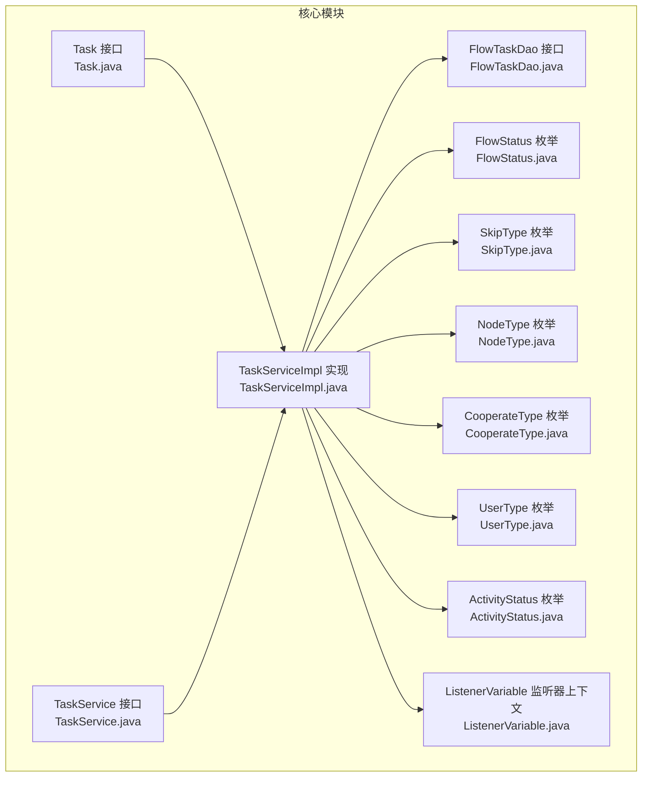
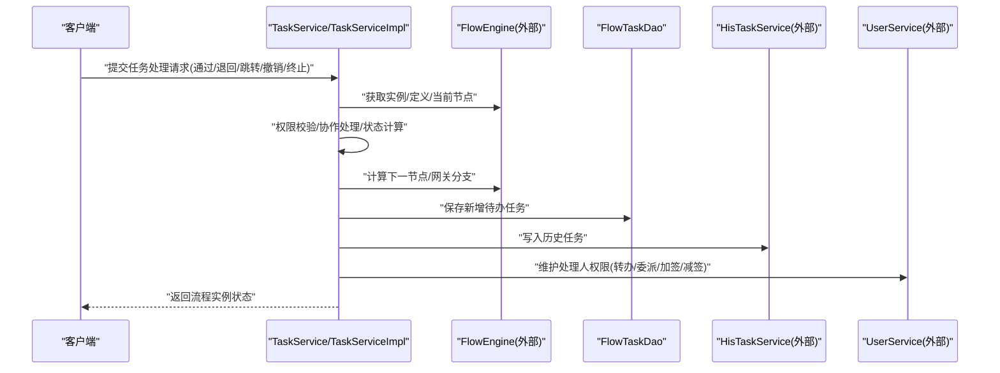
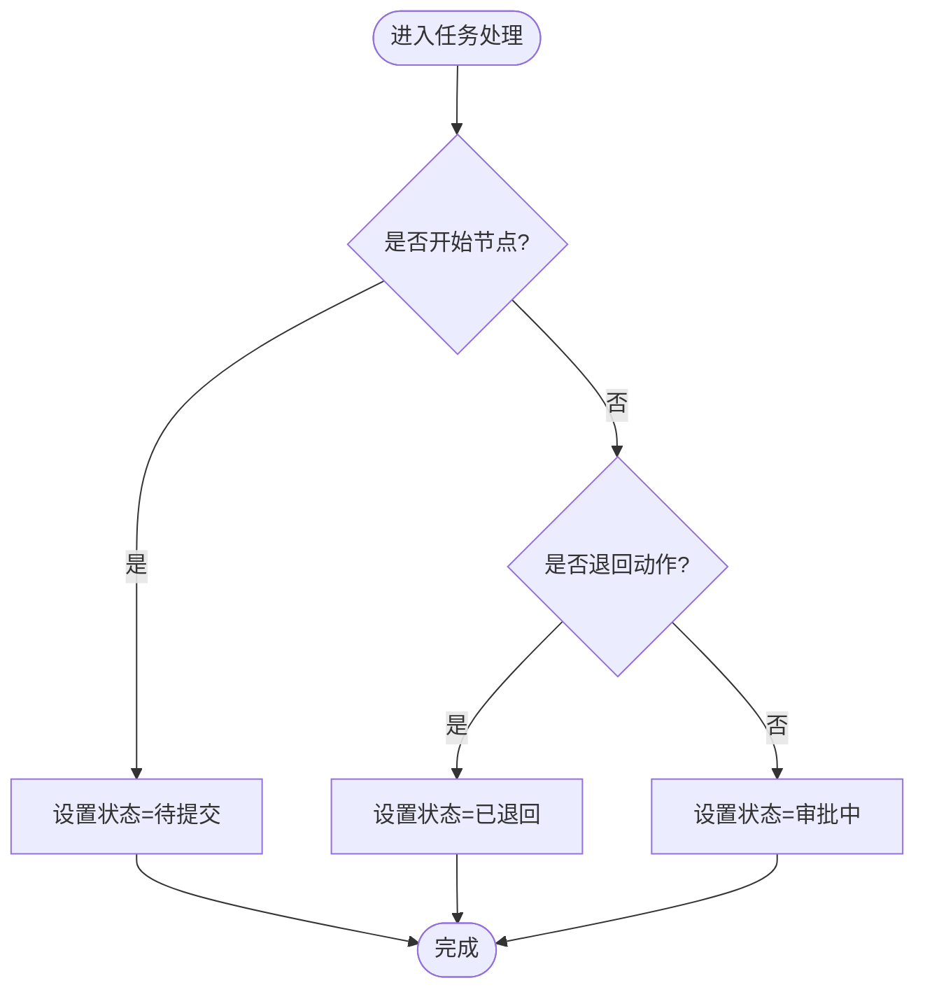
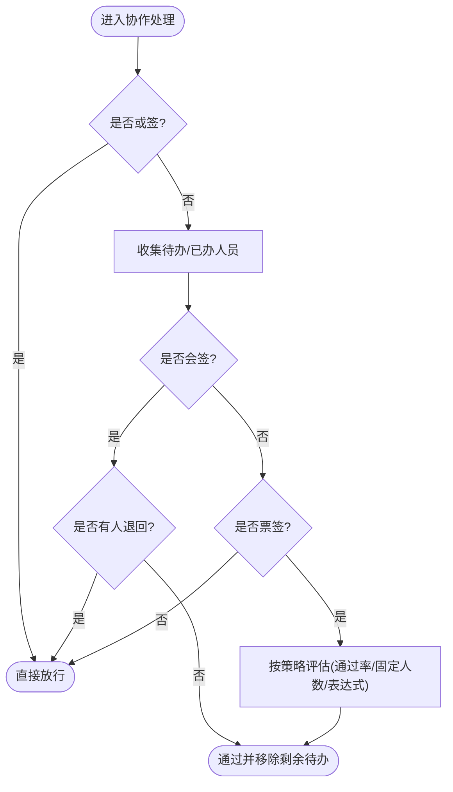
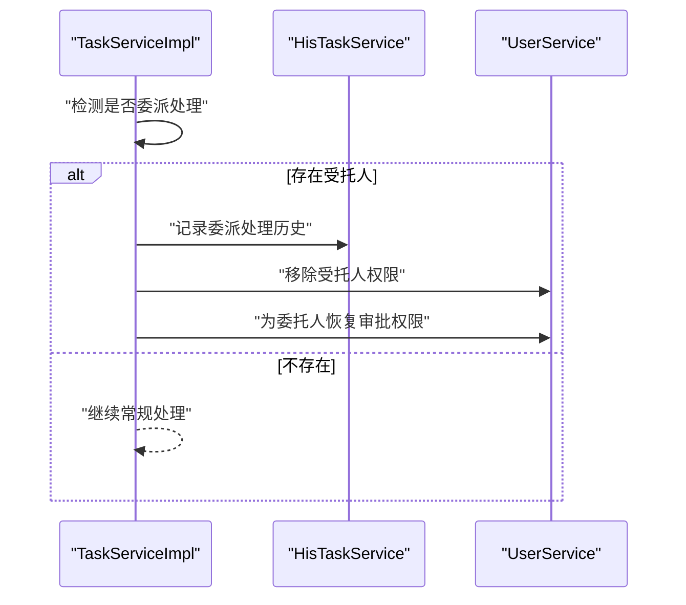
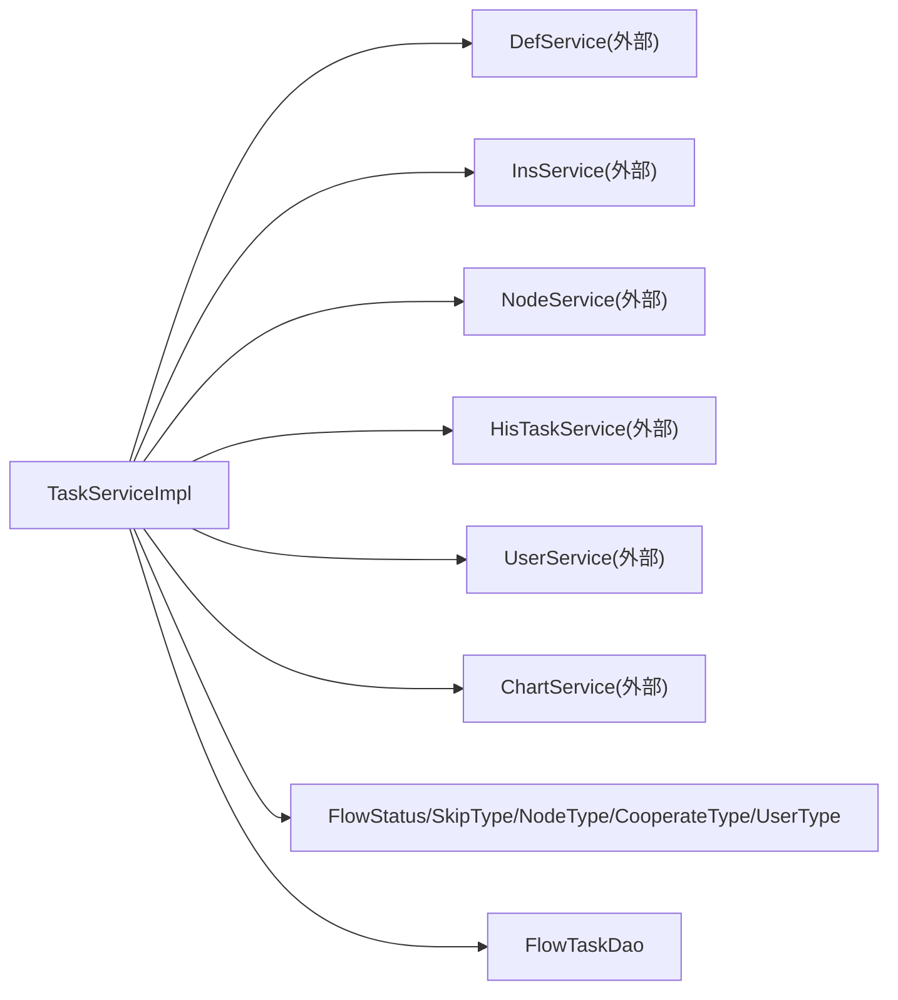

# Task（待办任务）实体

<cite>
**本文引用的文件**
- [Task.java](file://warm-flow-core/src/main/java/org/dromara/warm/flow/core/entity/Task.java)
- [TaskService.java](file://warm-flow-core/src/main/java/org/dromara/warm/flow/core/service/TaskService.java)
- [TaskServiceImpl.java](file://warm-flow-core/src/main/java/org/dromara/warm/flow/core/service/impl/TaskServiceImpl.java)
- [FlowTaskDao.java](file://warm-flow-core/src/main/java/org/dromara/warm/flow/core/orm/dao/FlowTaskDao.java)
- [FlowStatus.java](file://warm-flow-core/src/main/java/org/dromara/warm/flow/core/enums/FlowStatus.java)
- [SkipType.java](file://warm-flow-core/src/main/java/org/dromara/warm/flow/core/enums/SkipType.java)
- [NodeType.java](file://warm-flow-core/src/main/java/org/dromara/warm/flow/core/enums/NodeType.java)
- [CooperateType.java](file://warm-flow-core/src/main/java/org/dromara/warm/flow/core/enums/CooperateType.java)
- [UserType.java](file://warm-flow-core/src/main/java/org/dromara/warm/flow/core/enums/UserType.java)
- [ActivityStatus.java](file://warm-flow-core/src/main/java/org/dromara/warm/flow/core/enums/ActivityStatus.java)
- [ListenerVariable.java](file://warm-flow-core/src/main/java/org/dromara/warm/flow/core/listener/ListenerVariable.java)
</cite>

## 目录
1. [简介](#简介)
2. [项目结构](#项目结构)
3. [核心组件](#核心组件)
4. [架构总览](#架构总览)
5. [详细组件分析](#详细组件分析)
6. [依赖分析](#依赖分析)
7. [性能考量](#性能考量)
8. [故障排查指南](#故障排查指南)
9. [结论](#结论)
10. [附录](#附录)

## 简介
本文件围绕 Task（待办任务）实体展开，系统化阐述其在工作流引擎中的设计与业务逻辑，涵盖任务ID、实例ID、节点ID、任务标题、任务状态、处理人信息、委派标识、任务类型、任务权重、开始时间、截止时间、完成时间、任务变量、扩展信息等核心属性；并深入解析任务状态管理（待处理、处理中、已完成、已撤销等）、任务类型枚举的应用场景、任务权重在多人协作中的作用机制；解释任务委派的实现原理与权限控制、任务变量的数据传递与作用域管理；最后提供任务创建、分配、处理、委派、撤销等完整业务流程的代码路径示例，帮助开发者掌握任务实体在工作流执行中的关键作用与操作技巧。

## 项目结构
Task 实体位于核心模块中，配合服务层接口与实现、DAO 接口以及若干枚举类型共同构成任务生命周期管理的完整体系。核心文件分布如下：
- 实体接口：org.dromara.warm.flow.core.entity.Task
- 服务接口：org.dromara.warm.flow.core.service.TaskService
- 服务实现：org.dromara.warm.flow.core.service.impl.TaskServiceImpl
- DAO 接口：org.dromara.warm.flow.core.orm.dao.FlowTaskDao
- 枚举类型：FlowStatus、SkipType、NodeType、CooperateType、UserType、ActivityStatus
- 监听器上下文：org.dromara.warm.flow.core.listener.ListenerVariable

**图表来源**
- [Task.java:27-135](file://warm-flow-core/src/main/java/org/dromara/warm/flow/core/entity/Task.java#L27-L135)
- [TaskService.java:36-533](file://warm-flow-core/src/main/java/org/dromara/warm/flow/core/service/TaskService.java#L36-L533)
- [TaskServiceImpl.java:44-799](file://warm-flow-core/src/main/java/org/dromara/warm/flow/core/service/impl/TaskServiceImpl.java#L44-L799)
- [FlowTaskDao.java:28-39](file://warm-flow-core/src/main/java/org/dromara/warm/flow/core/orm/dao/FlowTaskDao.java#L28-L39)
- [FlowStatus.java:30-102](file://warm-flow-core/src/main/java/org/dromara/warm/flow/core/enums/FlowStatus.java#L30-L102)
- [SkipType.java:30-100](file://warm-flow-core/src/main/java/org/dromara/warm/flow/core/enums/SkipType.java#L30-L100)
- [NodeType.java:29-160](file://warm-flow-core/src/main/java/org/dromara/warm/flow/core/enums/NodeType.java#L29-L160)
- [CooperateType.java:39-196](file://warm-flow-core/src/main/java/org/dromara/warm/flow/core/enums/CooperateType.java#L39-L196)
- [UserType.java:29-70](file://warm-flow-core/src/main/java/org/dromara/warm/flow/core/enums/UserType.java#L29-L70)
- [ActivityStatus.java:30-54](file://warm-flow-core/src/main/java/org/dromara/warm/flow/core/enums/ActivityStatus.java#L30-L54)
- [ListenerVariable.java:93-212](file://warm-flow-core/src/main/java/org/dromara/warm/flow/core/listener/ListenerVariable.java#L93-L212)

**章节来源**
- [Task.java:27-135](file://warm-flow-core/src/main/java/org/dromara/warm/flow/core/entity/Task.java#L27-L135)
- [TaskService.java:36-533](file://warm-flow-core/src/main/java/org/dromara/warm/flow/core/service/TaskService.java#L36-L533)
- [TaskServiceImpl.java:44-799](file://warm-flow-core/src/main/java/org/dromara/warm/flow/core/service/impl/TaskServiceImpl.java#L44-L799)
- [FlowTaskDao.java:28-39](file://warm-flow-core/src/main/java/org/dromara/warm/flow/core/orm/dao/FlowTaskDao.java#L28-L39)

## 核心组件
- Task 实体接口：定义任务的核心字段与通用能力（继承根实体接口），包含任务标识、流程定义与实例关联、节点信息、流程状态、权限与用户列表、表单定制与路径等。
- TaskService 服务接口：定义任务全生命周期操作契约，包括审批通过/退回、任意跳转、撤销、终止、委派、转办、加签/减签、暂存等。
- TaskServiceImpl 服务实现：承接具体业务逻辑，负责任务状态计算、权限校验、协作处理（或签/会签/票签）、监听器执行、历史任务迁移、实例状态更新等。
- FlowTaskDao 数据访问接口：提供按实例与节点码查询、批量删除等基础持久化能力。
- 枚举体系：FlowStatus（流程状态）、SkipType（审批动作）、NodeType（节点类型）、CooperateType（协作类型）、UserType（用户类型）、ActivityStatus（激活状态）。
- 监听器上下文：ListenerVariable 封装流程定义、实例、当前节点、任务、下一节点/任务、变量与流程参数，贯穿监听器执行。

**章节来源**
- [Task.java:27-135](file://warm-flow-core/src/main/java/org/dromara/warm/flow/core/entity/Task.java#L27-L135)
- [TaskService.java:36-533](file://warm-flow-core/src/main/java/org/dromara/warm/flow/core/service/TaskService.java#L36-L533)
- [TaskServiceImpl.java:44-799](file://warm-flow-core/src/main/java/org/dromara/warm/flow/core/service/impl/TaskServiceImpl.java#L44-L799)
- [FlowTaskDao.java:28-39](file://warm-flow-core/src/main/java/org/dromara/warm/flow/core/orm/dao/FlowTaskDao.java#L28-L39)
- [FlowStatus.java:30-102](file://warm-flow-core/src/main/java/org/dromara/warm/flow/core/enums/FlowStatus.java#L30-L102)
- [SkipType.java:30-100](file://warm-flow-core/src/main/java/org/dromara/warm/flow/core/enums/SkipType.java#L30-L100)
- [NodeType.java:29-160](file://warm-flow-core/src/main/java/org/dromara/warm/flow/core/enums/NodeType.java#L29-L160)
- [CooperateType.java:39-196](file://warm-flow-core/src/main/java/org/dromara/warm/flow/core/enums/CooperateType.java#L39-L196)
- [UserType.java:29-70](file://warm-flow-core/src/main/java/org/dromara/warm/flow/core/enums/UserType.java#L29-L70)
- [ActivityStatus.java:30-54](file://warm-flow-core/src/main/java/org/dromara/warm/flow/core/enums/ActivityStatus.java#L30-L54)
- [ListenerVariable.java:93-212](file://warm-flow-core/src/main/java/org/dromara/warm/flow/core/listener/ListenerVariable.java#L93-L212)

## 架构总览
Task 在工作流引擎中的职责是承载“当前节点”的待办任务，驱动流程从当前节点向下一节点流转，同时维护任务状态、处理人权限、协作规则与监听器上下文。整体调用链路如下：

**图表来源**
- [TaskService.java:36-533](file://warm-flow-core/src/main/java/org/dromara/warm/flow/core/service/TaskService.java#L36-L533)
- [TaskServiceImpl.java:96-234](file://warm-flow-core/src/main/java/org/dromara/warm/flow/core/service/impl/TaskServiceImpl.java#L96-L234)
- [FlowTaskDao.java:28-39](file://warm-flow-core/src/main/java/org/dromara/warm/flow/core/orm/dao/FlowTaskDao.java#L28-L39)

## 详细组件分析

### Task 实体接口与核心属性
- 继承根实体接口，具备标准的主键、创建/更新时间与租户标识等字段。
- 关联字段：definitionId（流程定义ID）、instanceId（流程实例ID）、nodeCode/nodeName（节点编码/名称）、nodeType（节点类型）。
- 状态与权限：flowStatus（流程状态）、permissionList（权限标识列表）、userList（处理人列表）。
- 表单与扩展：formCustom/formPath（节点或定义级自定义表单）。
- 业务标识：businessId（业务ID）、flowName（流程名称）。

这些属性共同支撑任务在流程中的定位、权限控制与表单渲染。

**章节来源**
- [Task.java:27-135](file://warm-flow-core/src/main/java/org/dromara/warm/flow/core/entity/Task.java#L27-L135)

### 任务状态管理（FlowStatus）
- 定义了完整的流程状态集合，包括待提交、审批中、审批通过、自动完成、终止、作废、撤销、取回、已完成、已退回、失效、拿回、重启、暂存等。
- 服务实现根据节点类型与跳转动作动态计算任务状态，例如：
  - 开始节点：TOBESUBMIT
  - 结束节点：FINISHED
  - 退回动作：REJECT
  - 其他：APPROVAL

**图表来源**
- [TaskServiceImpl.java:640-651](file://warm-flow-core/src/main/java/org/dromara/warm/flow/core/service/impl/TaskServiceImpl.java#L640-L651)
- [FlowStatus.java:30-102](file://warm-flow-core/src/main/java/org/dromara/warm/flow/core/enums/FlowStatus.java#L30-L102)

**章节来源**
- [FlowStatus.java:30-102](file://warm-flow-core/src/main/java/org/dromara/warm/flow/core/enums/FlowStatus.java#L30-L102)
- [TaskServiceImpl.java:640-651](file://warm-flow-core/src/main/java/org/dromara/warm/flow/core/service/impl/TaskServiceImpl.java#L640-L651)

### 任务类型与节点类型（NodeType）
- NodeType 描述流程图节点类型，包括开始、中间、结束、互斥网关、并行网关、包容网关等。
- 服务实现依据当前节点类型决定任务状态与流程行为（如开始/结束节点的状态设定）。

**章节来源**
- [NodeType.java:29-160](file://warm-flow-core/src/main/java/org/dromara/warm/flow/core/enums/NodeType.java#L29-L160)
- [TaskServiceImpl.java:640-651](file://warm-flow-core/src/main/java/org/dromara/warm/flow/core/service/impl/TaskServiceImpl.java#L640-L651)

### 审批动作与跳转（SkipType）
- SkipType 定义审批动作：通过（PASS）、退回（REJECT）、无动作（NONE）。
- 服务实现通过动作类型决定状态计算与下一节点选择策略。

**章节来源**
- [SkipType.java:30-100](file://warm-flow-core/src/main/java/org/dromara/warm/flow/core/enums/SkipType.java#L30-L100)
- [TaskServiceImpl.java:166-234](file://warm-flow-core/src/main/java/org/dromara/warm/flow/core/service/impl/TaskServiceImpl.java#L166-L234)

### 协作处理与任务权重（CooperateType 与会签/票签）
- CooperateType 支持或签、转办、委派、会签、票签、加签、减签等协作方式。
- 会签/票签涉及“任务权重”概念：通过历史与待办人员统计、通过/驳回计数与比例计算，决定是否放行。
- 服务实现中对或签直接放行，对会签/票签进行计数与比例评估，必要时移除剩余待办人。

**图表来源**
- [TaskServiceImpl.java:737-800](file://warm-flow-core/src/main/java/org/dromara/warm/flow/core/service/impl/TaskServiceImpl.java#L737-L800)
- [CooperateType.java:39-196](file://warm-flow-core/src/main/java/org/dromara/warm/flow/core/enums/CooperateType.java#L39-L196)

**章节来源**
- [CooperateType.java:39-196](file://warm-flow-core/src/main/java/org/dromara/warm/flow/core/enums/CooperateType.java#L39-L196)
- [TaskServiceImpl.java:737-800](file://warm-flow-core/src/main/java/org/dromara/warm/flow/core/service/impl/TaskServiceImpl.java#L737-L800)

### 权限控制与处理人信息（UserType 与权限列表）
- UserType 定义审批人、转办人、委托人三类权限类型。
- Task 的 permissionList 与 userList 分别存储节点权限标识与实际处理人列表。
- 服务实现通过权限校验与监听器上下文，确保只有具备权限的处理人可执行操作。

**章节来源**
- [UserType.java:29-70](file://warm-flow-core/src/main/java/org/dromara/warm/flow/core/enums/UserType.java#L29-L70)
- [Task.java:120-127](file://warm-flow-core/src/main/java/org/dromara/warm/flow/core/entity/Task.java#L120-L127)
- [TaskServiceImpl.java:187-189](file://warm-flow-core/src/main/java/org/dromara/warm/flow/core/service/impl/TaskServiceImpl.java#L187-L189)

### 任务委派的实现原理
- 委派（DEPUTE）由服务实现检测“受托人”并记录历史，随后为委托人恢复审批权限，保证流程继续推进。
- 若当前处理人处于委派状态，服务实现会优先处理委派逻辑，避免重复处理。

**图表来源**
- [TaskServiceImpl.java:701-727](file://warm-flow-core/src/main/java/org/dromara/warm/flow/core/service/impl/TaskServiceImpl.java#L701-L727)

**章节来源**
- [TaskServiceImpl.java:701-727](file://warm-flow-core/src/main/java/org/dromara/warm/flow/core/service/impl/TaskServiceImpl.java#L701-L727)

### 任务变量的数据传递与作用域管理
- 服务实现将实例变量与传入变量合并，作为监听器与表达式求值的基础。
- 表达式工具支持在新增待办任务时进行变量替换，确保下一节点可见所需上下文。

**章节来源**
- [TaskServiceImpl.java:169-170](file://warm-flow-core/src/main/java/org/dromara/warm/flow/core/service/impl/TaskServiceImpl.java#L169-L170)
- [TaskServiceImpl.java:212-213](file://warm-flow-core/src/main/java/org/dromara/warm/flow/core/service/impl/TaskServiceImpl.java#L212-L213)

### 任务创建、分配、处理、委派、撤销的业务流程

#### 任务创建与分配
- 服务实现根据下一节点构建待办任务，填充定义/实例/节点信息与表单定制信息，并设置初始状态。

**章节来源**
- [TaskServiceImpl.java:532-554](file://warm-flow-core/src/main/java/org/dromara/warm/flow/core/service/impl/TaskServiceImpl.java#L532-L554)

#### 任务处理（通过/退回/任意跳转）
- 服务接口提供 pass/reject/passAtWill/rejectAtWill 等方法，最终统一由 skip 流程处理。
- 服务实现负责权限校验、协作处理、下一节点选择、监听器执行与实例状态更新。

**章节来源**
- [TaskService.java:38-159](file://warm-flow-core/src/main/java/org/dromara/warm/flow/core/service/TaskService.java#L38-L159)
- [TaskServiceImpl.java:96-234](file://warm-flow-core/src/main/java/org/dromara/warm/flow/core/service/impl/TaskServiceImpl.java#L96-L234)

#### 委派与转办
- depute/transfer 方法分别实现委派与转办，校验权限并维护处理人列表与历史记录。

**章节来源**
- [TaskService.java:367-381](file://warm-flow-core/src/main/java/org/dromara/warm/flow/core/service/TaskService.java#L367-L381)
- [TaskServiceImpl.java:401-412](file://warm-flow-core/src/main/java/org/dromara/warm/flow/core/service/impl/TaskServiceImpl.java#L401-L412)
- [TaskServiceImpl.java:388-399](file://warm-flow-core/src/main/java/org/dromara/warm/flow/core/service/impl/TaskServiceImpl.java#L388-L399)

#### 撤销与终止
- revoke/terminationByInsId/termination 等方法负责撤销与终止流程，将待办任务转历史并更新实例状态。

**章节来源**
- [TaskService.java:286-330](file://warm-flow-core/src/main/java/org/dromara/warm/flow/core/service/TaskService.java#L286-L330)
- [TaskServiceImpl.java:237-375](file://warm-flow-core/src/main/java/org/dromara/warm/flow/core/service/impl/TaskServiceImpl.java#L237-L375)

#### 暂存
- pending/pendingByInsId/pending(Task) 仅更新状态与历史记录，不触发流程跳转。

**章节来源**
- [TaskService.java:427-470](file://warm-flow-core/src/main/java/org/dromara/warm/flow/core/service/TaskService.java#L427-L470)
- [TaskServiceImpl.java:493-529](file://warm-flow-core/src/main/java/org/dromara/warm/flow/core/service/impl/TaskServiceImpl.java#L493-L529)

## 依赖分析
- TaskServiceImpl 对外依赖 FlowEngine 的各子服务（定义、实例、节点、历史任务、用户、监听器等），形成强耦合但清晰的职责边界。
- 枚举类型为状态机与流程控制提供统一语义，降低实现复杂度。
- DAO 层提供最小持久化能力，便于多 ORM 方案适配。

**图表来源**
- [TaskServiceImpl.java:166-234](file://warm-flow-core/src/main/java/org/dromara/warm/flow/core/service/impl/TaskServiceImpl.java#L166-L234)
- [FlowStatus.java:30-102](file://warm-flow-core/src/main/java/org/dromara/warm/flow/core/enums/FlowStatus.java#L30-L102)
- [SkipType.java:30-100](file://warm-flow-core/src/main/java/org/dromara/warm/flow/core/enums/SkipType.java#L30-L100)
- [NodeType.java:29-160](file://warm-flow-core/src/main/java/org/dromara/warm/flow/core/enums/NodeType.java#L29-L160)
- [CooperateType.java:39-196](file://warm-flow-core/src/main/java/org/dromara/warm/flow/core/enums/CooperateType.java#L39-L196)
- [UserType.java:29-70](file://warm-flow-core/src/main/java/org/dromara/warm/flow/core/enums/UserType.java#L29-L70)
- [FlowTaskDao.java:28-39](file://warm-flow-core/src/main/java/org/dromara/warm/flow/core/orm/dao/FlowTaskDao.java#L28-L39)

**章节来源**
- [TaskServiceImpl.java:166-234](file://warm-flow-core/src/main/java/org/dromara/warm/flow/core/service/impl/TaskServiceImpl.java#L166-L234)
- [FlowTaskDao.java:28-39](file://warm-flow-core/src/main/java/org/dromara/warm/flow/core/orm/dao/FlowTaskDao.java#L28-L39)

## 性能考量
- 并发与一致性：服务实现注释提示待办任务与实例表不同步的潜在并发问题，建议在关键路径加锁（本地或分布式）以避免竞态。
- 监听器与表达式：大量监听器与表达式求值可能带来额外开销，应合理裁剪与缓存。
- 批量操作：DAO 提供按实例ID集合删除能力，适合批量清理或终止场景。
- 变量合并：实例变量合并发生在每次跳转前，注意避免过大的变量集导致序列化/反序列化成本过高。

[本节为通用指导，无需特定文件来源]

## 故障排查指南
- 任务/实例缺失：检查 getAndCheck 流程，确认任务存在、实例存在、定义存在、当前节点存在。
- 权限不足：检查 permissionFlag 与 task.permissionList 的匹配，以及当前处理人是否在 userList 中。
- 协作异常：核对 CooperateType 与节点 ratio 配置，检查会签/票签计数与表达式求值结果。
- 委派异常：确认委派历史记录是否正确写入，委托人权限是否恢复。
- 变量丢失：确认变量合并逻辑与表达式替换是否生效。

**章节来源**
- [TaskServiceImpl.java:675-685](file://warm-flow-core/src/main/java/org/dromara/warm/flow/core/service/impl/TaskServiceImpl.java#L675-L685)
- [TaskServiceImpl.java:440-491](file://warm-flow-core/src/main/java/org/dromara/warm/flow/core/service/impl/TaskServiceImpl.java#L440-L491)
- [TaskServiceImpl.java:701-727](file://warm-flow-core/src/main/java/org/dromara/warm/flow/core/service/impl/TaskServiceImpl.java#L701-L727)

## 结论
Task 实体在工作流引擎中承担“当前节点待办”的核心职责，通过与服务层、DAO 层、枚举体系与监听器的协同，实现从任务创建、权限校验、协作处理到流程跳转、历史归档的完整闭环。开发者应重点关注状态计算、权限控制、协作策略与变量作用域，以确保流程的正确性与可维护性。

[本节为总结性内容，无需特定文件来源]

## 附录

### 常用操作与代码路径索引
- 创建任务：[addTask:532-554](file://warm-flow-core/src/main/java/org/dromara/warm/flow/core/service/impl/TaskServiceImpl.java#L532-L554)
- 通过/退回/任意跳转：[pass/reject/passAtWill/rejectAtWill/skip:38-159](file://warm-flow-core/src/main/java/org/dromara/warm/flow/core/service/TaskService.java#L38-L159)
- 撤销/终止：[revoke/terminationByInsId/termination:286-330](file://warm-flow-core/src/main/java/org/dromara/warm/flow/core/service/TaskService.java#L286-L330)
- 委派/转办/加签/减签：[depute/transfer/addSignature/reductionSignature/updateHandler:367-425](file://warm-flow-core/src/main/java/org/dromara/warm/flow/core/service/TaskService.java#L367-L425)
- 暂存：[pendingByInsId/pending/pending(Task):427-470](file://warm-flow-core/src/main/java/org/dromara/warm/flow/core/service/TaskService.java#L427-L470)
- 状态计算：[setFlowStatus:640-651](file://warm-flow-core/src/main/java/org/dromara/warm/flow/core/service/impl/TaskServiceImpl.java#L640-L651)
- 协作处理：[cooperate:737-800](file://warm-flow-core/src/main/java/org/dromara/warm/flow/core/service/impl/TaskServiceImpl.java#L737-L800)
- 委派处理：[handleDepute:701-727](file://warm-flow-core/src/main/java/org/dromara/warm/flow/core/service/impl/TaskServiceImpl.java#L701-L727)
- 变量合并：[mergeVariable:590-598](file://warm-flow-core/src/main/java/org/dromara/warm/flow/core/service/impl/TaskServiceImpl.java#L590-L598)