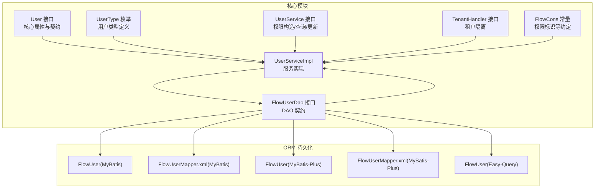
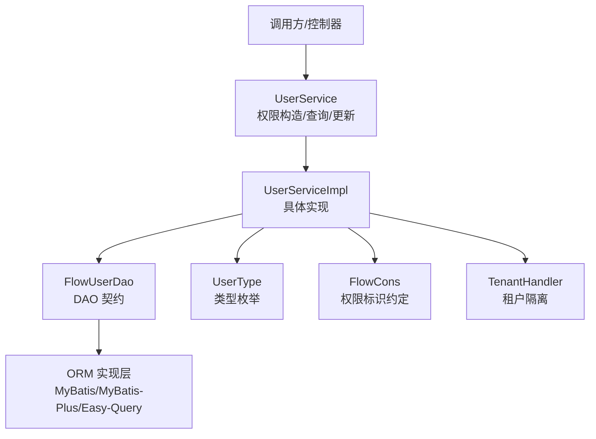
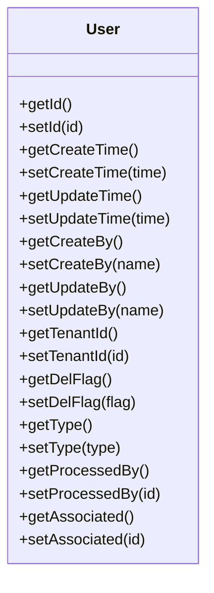
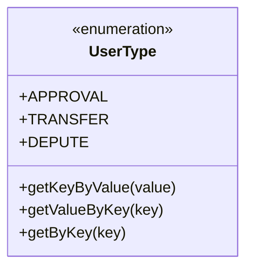
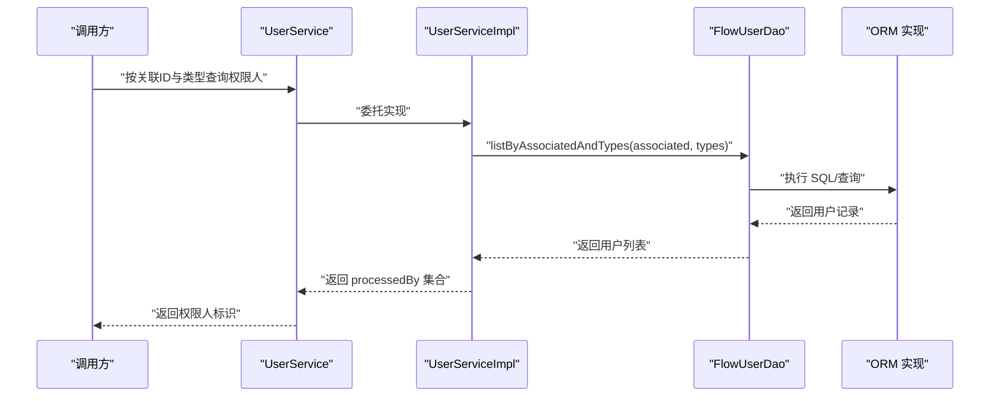
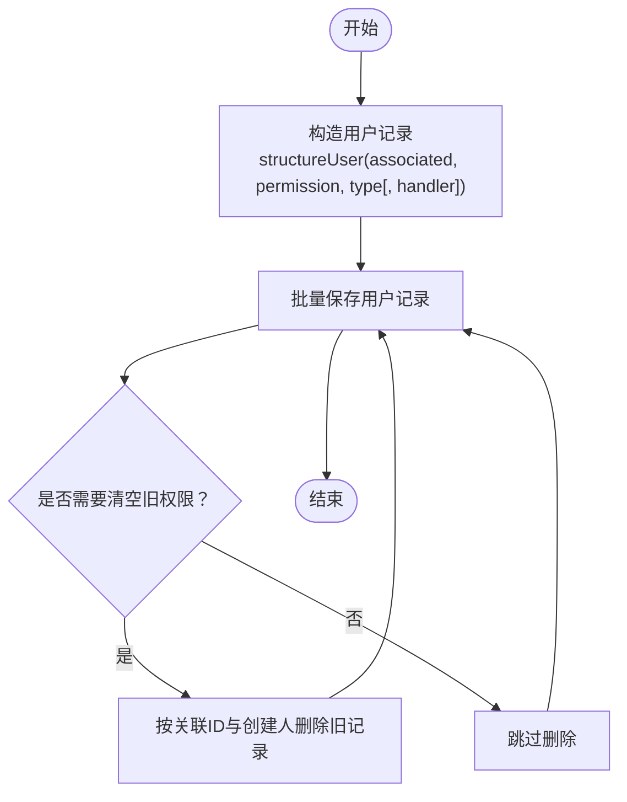
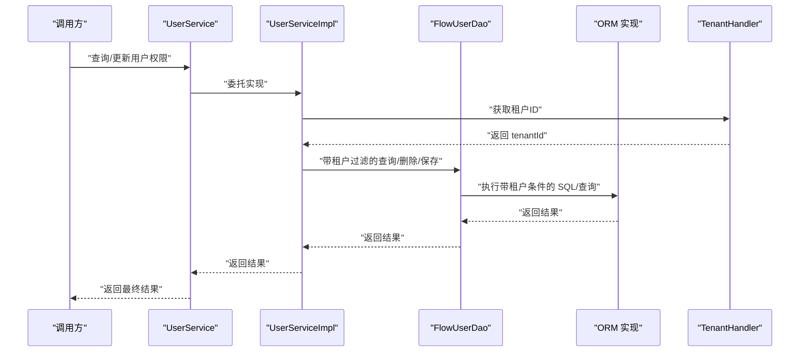
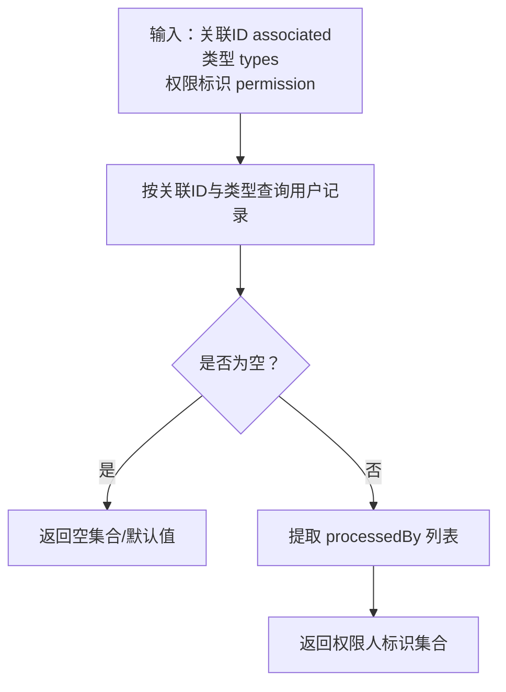
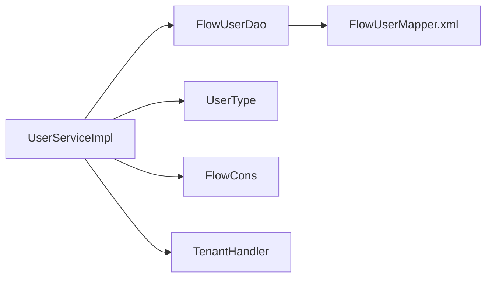

# User（用户）实体

<cite>
**本文引用的文件**
- [User.java](file://warm-flow-core/src/main/java/org/dromara/warm/flow/core/entity/User.java)
- [UserType.java](file://warm-flow-core/src/main/java/org/dromara/warm/flow/core/enums/UserType.java)
- [UserService.java](file://warm-flow-core/src/main/java/org/dromara/warm/flow/core/service/UserService.java)
- [UserServiceImpl.java](file://warm-flow-core/src/main/java/org/dromara/warm/flow/core/service/impl/UserServiceImpl.java)
- [FlowUserDao.java](file://warm-flow-core/src/main/java/org/dromara/warm/flow/core/orm/dao/FlowUserDao.java)
- [TenantHandler.java](file://warm-flow-core/src/main/java/org/dromara/warm/flow/core/handler/TenantHandler.java)
- [FlowCons.java](file://warm-flow-core/src/main/java/org/dromara/warm/flow/core/constant/FlowCons.java)
- [FlowUser.java（MyBatis 实现）](file://warm-flow-orm/warm-flow-mybatis/warm-flow-mybatis-core/src/main/java/org/dromara/warm/flow/orm/entity/FlowUser.java)
- [FlowUserMapper.xml（MyBatis 实现）](file://warm-flow-orm/warm-flow-mybatis/warm-flow-mybatis-core/src/main/resources/warm/flow/FlowUserMapper.xml)
- [FlowUser.java（MyBatis-Plus 实现）](file://warm-flow-orm/warm-flow-mybatis-plus/warm-flow-mybatis-plus-core/src/main/java/org/dromara/warm/flow/orm/entity/FlowUser.java)
- [FlowUserMapper.xml（MyBatis-Plus 实现）](file://warm-flow-orm/warm-flow-mybatis-plus/warm-flow-mybatis-plus-core/src/main/resources/warm/flow/FlowUserMapper.xml)
- [FlowUser.java（Easy-Query 实现）](file://warm-flow-orm/warm-flow-easy-query/warm-flow-easy-query-core/src/main/java/org/dromara/warm/flow/orm/entity/FlowUser.java)
</cite>

## 目录
1. [简介](#简介)
2. [项目结构](#项目结构)
3. [核心组件](#核心组件)
4. [架构总览](#架构总览)
5. [详细组件分析](#详细组件分析)
6. [依赖分析](#依赖分析)
7. [性能考虑](#性能考虑)
8. [故障排查指南](#故障排查指南)
9. [结论](#结论)
10. [附录](#附录)

## 简介
本文件围绕 User（用户）实体展开，系统性阐述其设计架构、权限体系、与流程节点的关联关系、多租户隔离机制以及权限验证的实现原理。重点覆盖以下方面：
- 用户实体的核心属性：用户ID、用户名（processedBy）、用户类型（type）、关联ID（associated）、租户ID（tenantId）等
- 用户类型枚举 UserType 的取值与权限级别含义
- 用户与流程节点（如任务、实例、历史节点等）的关联与权限映射
- 多租户环境下用户隔离策略
- 用户权限的配置、角色分配、状态管理与实际使用示例

## 项目结构
User 实体位于核心模块中，并通过 ORM 层（MyBatis、MyBatis-Plus、Easy-Query）提供持久化能力；服务层负责权限构造、查询与更新；枚举类型定义用户类型；常量与全局处理器提供通用约定与租户隔离。

图表来源
- [User.java:26-94](file://warm-flow-core/src/main/java/org/dromara/warm/flow/core/entity/User.java#L26-L94)
- [UserType.java:29-70](file://warm-flow-core/src/main/java/org/dromara/warm/flow/core/enums/UserType.java#L29-L70)
- [UserService.java:30-165](file://warm-flow-core/src/main/java/org/dromara/warm/flow/core/service/UserService.java#L30-L165)
- [UserServiceImpl.java:40-162](file://warm-flow-core/src/main/java/org/dromara/warm/flow/core/service/impl/UserServiceImpl.java#L40-L162)
- [FlowUserDao.java:28-58](file://warm-flow-core/src/main/java/org/dromara/warm/flow/core/orm/dao/FlowUserDao.java#L28-L58)
- [TenantHandler.java:23-32](file://warm-flow-core/src/main/java/org/dromara/warm/flow/core/handler/TenantHandler.java#L23-L32)
- [FlowCons.java:25-84](file://warm-flow-core/src/main/java/org/dromara/warm/flow/core/constant/FlowCons.java#L25-L84)
- [FlowUser.java（MyBatis 实现）](file://warm-flow-orm/warm-flow-mybatis/warm-flow-mybatis-core/src/main/java/org/dromara/warm/flow/orm/entity/FlowUser.java)
- [FlowUserMapper.xml（MyBatis 实现）](file://warm-flow-orm/warm-flow-mybatis/warm-flow-mybatis-core/src/main/resources/warm/flow/FlowUserMapper.xml)
- [FlowUser.java（MyBatis-Plus 实现）](file://warm-flow-orm/warm-flow-mybatis-plus/warm-flow-mybatis-plus-core/src/main/java/org/dromara/warm/flow/orm/entity/FlowUser.java)
- [FlowUserMapper.xml（MyBatis-Plus 实现）](file://warm-flow-orm/warm-flow-mybatis-plus/warm-flow-mybatis-plus-core/src/main/resources/warm/flow/FlowUserMapper.xml)
- [FlowUser.java（Easy-Query 实现）](file://warm-flow-orm/warm-flow-easy-query/warm-flow-easy-query-core/src/main/java/org/dromara/warm/flow/orm/entity/FlowUser.java)

章节来源
- [User.java:26-94](file://warm-flow-core/src/main/java/org/dromara/warm/flow/core/entity/User.java#L26-L94)
- [UserType.java:29-70](file://warm-flow-core/src/main/java/org/dromara/warm/flow/core/enums/UserType.java#L29-L70)
- [UserService.java:30-165](file://warm-flow-core/src/main/java/org/dromara/warm/flow/core/service/UserService.java#L30-L165)
- [UserServiceImpl.java:40-162](file://warm-flow-core/src/main/java/org/dromara/warm/flow/core/service/impl/UserServiceImpl.java#L40-L162)
- [FlowUserDao.java:28-58](file://warm-flow-core/src/main/java/org/dromara/warm/flow/core/orm/dao/FlowUserDao.java#L28-L58)
- [TenantHandler.java:23-32](file://warm-flow-core/src/main/java/org/dromara/warm/flow/core/handler/TenantHandler.java#L23-L32)
- [FlowCons.java:25-84](file://warm-flow-core/src/main/java/org/dromara/warm/flow/core/constant/FlowCons.java#L25-L84)

## 核心组件
- User 接口：定义用户实体的统一契约，包含基础字段（ID、创建时间、更新时间、创建人、更新人、租户ID、删除标记）以及用户相关字段（类型、权限人 processedBy、关联ID associated）。
- UserType 枚举：定义用户类型，包括审批人、转办人、委托人三类，提供 key/value 映射与查询工具方法。
- UserService 接口：提供权限人构造、按关联ID与类型查询、按办理人查询、批量更新权限等能力。
- UserServiceImpl：实现具体逻辑，包括根据任务权限列表构造用户记录、按条件查询、批量保存、按关联ID清理后写入新权限等。
- FlowUserDao 接口：DAO 层契约，提供按关联ID与类型批量查询、按办理人集合查询等方法。
- TenantHandler：全局租户处理器接口，用于多租户隔离。
- FlowCons：流程常量，包含权限标识约定（如发起人标识符）等。

章节来源
- [User.java:26-94](file://warm-flow-core/src/main/java/org/dromara/warm/flow/core/entity/User.java#L26-L94)
- [UserType.java:29-70](file://warm-flow-core/src/main/java/org/dromara/warm/flow/core/enums/UserType.java#L29-L70)
- [UserService.java:30-165](file://warm-flow-core/src/main/java/org/dromara/warm/flow/core/service/UserService.java#L30-L165)
- [UserServiceImpl.java:40-162](file://warm-flow-core/src/main/java/org/dromara/warm/flow/core/service/impl/UserServiceImpl.java#L40-L162)
- [FlowUserDao.java:28-58](file://warm-flow-core/src/main/java/org/dromara/warm/flow/core/orm/dao/FlowUserDao.java#L28-L58)
- [TenantHandler.java:23-32](file://warm-flow-core/src/main/java/org/dromara/warm/flow/core/handler/TenantHandler.java#L23-L32)
- [FlowCons.java:25-84](file://warm-flow-core/src/main/java/org/dromara/warm/flow/core/constant/FlowCons.java#L25-L84)

## 架构总览
下图展示用户实体在系统中的角色与交互关系：服务层负责业务编排，DAO 层负责数据访问，ORM 层提供不同实现（MyBatis、MyBatis-Plus、Easy-Query），租户处理器提供多租户隔离。

图表来源
- [UserService.java:30-165](file://warm-flow-core/src/main/java/org/dromara/warm/flow/core/service/UserService.java#L30-L165)
- [UserServiceImpl.java:40-162](file://warm-flow-core/src/main/java/org/dromara/warm/flow/core/service/impl/UserServiceImpl.java#L40-L162)
- [FlowUserDao.java:28-58](file://warm-flow-core/src/main/java/org/dromara/warm/flow/core/orm/dao/FlowUserDao.java#L28-L58)
- [UserType.java:29-70](file://warm-flow-core/src/main/java/org/dromara/warm/flow/core/enums/UserType.java#L29-L70)
- [FlowCons.java:25-84](file://warm-flow-core/src/main/java/org/dromara/warm/flow/core/constant/FlowCons.java#L25-L84)
- [TenantHandler.java:23-32](file://warm-flow-core/src/main/java/org/dromara/warm/flow/core/handler/TenantHandler.java#L23-L32)

## 详细组件分析

### 用户实体与属性
- 用户ID：继承自根实体，支持统一的数据填充与主键生成策略。
- 用户名/权限人 processedBy：表示具备权限的用户标识，可为真实用户ID或动态标识。
- 用户类型 type：来自 UserType 枚举，决定该用户在流程中的权限角色。
- 关联ID associated：与流程节点（任务、实例、历史节点等）建立关联，用于权限归属与查询。
- 租户ID tenantId：用于多租户隔离，确保不同租户间数据互不可见。
- 删除标记 delFlag：软删除支持。
- 创建/更新信息：统一由根实体提供，便于审计与追踪。

图表来源
- [User.java:26-94](file://warm-flow-core/src/main/java/org/dromara/warm/flow/core/entity/User.java#L26-L94)

章节来源
- [User.java:26-94](file://warm-flow-core/src/main/java/org/dromara/warm/flow/core/entity/User.java#L26-L94)

### 用户类型枚举（UserType）
- 审批人 APPROVAL：对应“待办任务的审批人权限”
- 转办人 TRANSFER：对应“待办任务的转办人权限”
- 委托人 DEPUTE：对应“待办任务的委托人权限”

提供 key/value 双向映射与查询工具方法，便于在权限标识与类型之间转换。

图表来源
- [UserType.java:29-70](file://warm-flow-core/src/main/java/org/dromara/warm/flow/core/enums/UserType.java#L29-L70)

章节来源
- [UserType.java:29-70](file://warm-flow-core/src/main/java/org/dromara/warm/flow/core/enums/UserType.java#L29-L70)

### 用户与流程节点的关联关系
- 关联ID associated：用于将用户与任务、实例、历史节点等流程对象绑定，形成“谁对哪个节点拥有何种权限”的映射。
- 权限标识约定：通过常量定义权限标识符（如发起人标识符），在流程运行时进行替换与解析，确保权限来源灵活可控。

图表来源
- [UserService.java:78-93](file://warm-flow-core/src/main/java/org/dromara/warm/flow/core/service/UserService.java#L78-L93)
- [UserServiceImpl.java:84-101](file://warm-flow-core/src/main/java/org/dromara/warm/flow/core/service/impl/UserServiceImpl.java#L84-L101)
- [FlowUserDao.java:40-57](file://warm-flow-core/src/main/java/org/dromara/warm/flow/core/orm/dao/FlowUserDao.java#L40-L57)

章节来源
- [UserService.java:78-93](file://warm-flow-core/src/main/java/org/dromara/warm/flow/core/service/UserService.java#L78-L93)
- [UserServiceImpl.java:84-101](file://warm-flow-core/src/main/java/org/dromara/warm/flow/core/service/impl/UserServiceImpl.java#L84-L101)
- [FlowUserDao.java:40-57](file://warm-flow-core/src/main/java/org/dromara/warm/flow/core/orm/dao/FlowUserDao.java#L40-L57)
- [FlowCons.java:40-41](file://warm-flow-core/src/main/java/org/dromara/warm/flow/core/constant/FlowCons.java#L40-L41)

### 权限配置与角色分配
- 权限构造：根据任务的权限列表，构造用户记录（设置类型、权限人、关联ID、创建人等），支持批量与单条构造。
- 权限更新：支持按关联ID清理旧权限后写入新权限，同时可记录委派时的办理人（handler）。
- 办理人查询：支持按关联ID与类型、按单个或多个办理人标识进行查询，满足灵活的权限检索需求。

图表来源
- [UserServiceImpl.java:123-133](file://warm-flow-core/src/main/java/org/dromara/warm/flow/core/service/impl/UserServiceImpl.java#L123-L133)
- [UserServiceImpl.java:145-160](file://warm-flow-core/src/main/java/org/dromara/warm/flow/core/service/impl/UserServiceImpl.java#L145-L160)

章节来源
- [UserServiceImpl.java:123-133](file://warm-flow-core/src/main/java/org/dromara/warm/flow/core/service/impl/UserServiceImpl.java#L123-L133)
- [UserServiceImpl.java:145-160](file://warm-flow-core/src/main/java/org/dromara/warm/flow/core/service/impl/UserServiceImpl.java#L145-L160)

### 多租户环境下的用户隔离机制
- 租户ID：用户实体继承根实体的租户ID字段，DAO 查询与删除操作均会基于租户维度进行过滤，确保跨租户数据隔离。
- 全局租户处理器：通过 TenantHandler 提供统一的租户ID获取入口，便于在不同上下文中注入租户信息。

图表来源
- [User.java:58-62](file://warm-flow-core/src/main/java/org/dromara/warm/flow/core/entity/User.java#L58-L62)
- [FlowUserDao.java:30-38](file://warm-flow-core/src/main/java/org/dromara/warm/flow/core/orm/dao/FlowUserDao.java#L30-L38)
- [TenantHandler.java:23-32](file://warm-flow-core/src/main/java/org/dromara/warm/flow/core/handler/TenantHandler.java#L23-L32)

章节来源
- [User.java:58-62](file://warm-flow-core/src/main/java/org/dromara/warm/flow/core/entity/User.java#L58-L62)
- [FlowUserDao.java:30-38](file://warm-flow-core/src/main/java/org/dromara/warm/flow/core/orm/dao/FlowUserDao.java#L30-L38)
- [TenantHandler.java:23-32](file://warm-flow-core/src/main/java/org/dromara/warm/flow/core/handler/TenantHandler.java#L23-L32)

### 权限验证的实现原理
- 权限来源解析：通过常量约定的权限标识符（如发起人标识符）在流程运行时进行替换，确保权限来源可追溯且可配置。
- 查询与匹配：根据关联ID与类型从用户表中查询 processedBy，作为后续审批/处理的依据。
- 批量与单条：支持按单个或多个关联ID、类型、办理人进行查询，满足复杂场景下的权限校验需求。

图表来源
- [UserService.java:69-87](file://warm-flow-core/src/main/java/org/dromara/warm/flow/core/service/UserService.java#L69-L87)
- [UserServiceImpl.java:71-82](file://warm-flow-core/src/main/java/org/dromara/warm/flow/core/service/impl/UserServiceImpl.java#L71-L82)
- [FlowCons.java:40-41](file://warm-flow-core/src/main/java/org/dromara/warm/flow/core/constant/FlowCons.java#L40-L41)

章节来源
- [UserService.java:69-87](file://warm-flow-core/src/main/java/org/dromara/warm/flow/core/service/UserService.java#L69-L87)
- [UserServiceImpl.java:71-82](file://warm-flow-core/src/main/java/org/dromara/warm/flow/core/service/impl/UserServiceImpl.java#L71-L82)
- [FlowCons.java:40-41](file://warm-flow-core/src/main/java/org/dromara/warm/flow/core/constant/FlowCons.java#L40-L41)

### 实际使用示例（步骤级说明）
- 创建用户并绑定到流程任务
  - 步骤1：准备任务的权限列表（如用户ID或动态标识）
  - 步骤2：调用权限构造方法，传入关联ID（任务ID）、权限列表、用户类型（审批人/转办人/委托人）
  - 步骤3：保存用户记录，完成权限绑定
  - 参考路径：[UserServiceImpl.java:135-160](file://warm-flow-core/src/main/java/org/dromara/warm/flow/core/service/impl/UserServiceImpl.java#L135-L160)

- 更新流程任务的权限人
  - 步骤1：确定是否需要清空旧权限（clear 参数）
  - 步骤2：若需清空，按关联ID与创建人删除旧记录
  - 步骤3：批量保存新的权限人记录
  - 参考路径：[UserServiceImpl.java:123-133](file://warm-flow-core/src/main/java/org/dromara/warm/flow/core/service/impl/UserServiceImpl.java#L123-L133)

- 查询某节点的权限人
  - 步骤1：指定关联ID（任务/实例/历史节点ID）
  - 步骤2：可选指定类型数组（审批人/转办人/委托人）
  - 步骤3：返回 processedBy 集合，作为后续审批/处理的依据
  - 参考路径：[UserService.java:69-87](file://warm-flow-core/src/main/java/org/dromara/warm/flow/core/service/UserService.java#L69-L87)

- 按办理人查询用户
  - 步骤1：指定关联ID与一个或多个办理人标识
  - 步骤2：可选指定类型数组
  - 步骤3：返回匹配的用户记录，便于进一步处理
  - 参考路径：[UserService.java:97-107](file://warm-flow-core/src/main/java/org/dromara/warm/flow/core/service/UserService.java#L97-L107)

章节来源
- [UserServiceImpl.java:123-160](file://warm-flow-core/src/main/java/org/dromara/warm/flow/core/service/impl/UserServiceImpl.java#L123-L160)
- [UserService.java:69-107](file://warm-flow-core/src/main/java/org/dromara/warm/flow/core/service/UserService.java#L69-L107)

## 依赖分析
- 组件内聚与耦合
  - UserServiceImpl 依赖 FlowUserDao、UserType、FlowCons、TenantHandler 等，职责清晰，耦合度适中
  - DAO 层与 ORM 实现解耦，支持多种持久化框架
- 外部依赖
  - 数据库层通过 Mapper/XML 映射实现查询与更新
  - 租户隔离通过全局处理器注入，避免硬编码

图表来源
- [UserServiceImpl.java:40-162](file://warm-flow-core/src/main/java/org/dromara/warm/flow/core/service/impl/UserServiceImpl.java#L40-L162)
- [FlowUserDao.java:28-58](file://warm-flow-core/src/main/java/org/dromara/warm/flow/core/orm/dao/FlowUserDao.java#L28-L58)
- [UserType.java:29-70](file://warm-flow-core/src/main/java/org/dromara/warm/flow/core/enums/UserType.java#L29-L70)
- [FlowCons.java:25-84](file://warm-flow-core/src/main/java/org/dromara/warm/flow/core/constant/FlowCons.java#L25-L84)
- [TenantHandler.java:23-32](file://warm-flow-core/src/main/java/org/dromara/warm/flow/core/handler/TenantHandler.java#L23-L32)

章节来源
- [UserServiceImpl.java:40-162](file://warm-flow-core/src/main/java/org/dromara/warm/flow/core/service/impl/UserServiceImpl.java#L40-L162)
- [FlowUserDao.java:28-58](file://warm-flow-core/src/main/java/org/dromara/warm/flow/core/orm/dao/FlowUserDao.java#L28-L58)

## 性能考虑
- 批量操作：优先使用批量保存与批量查询，减少数据库往返次数
- 条件过滤：在 DAO 层明确传入关联ID与类型数组，避免全表扫描
- 缓存策略：对于高频查询的权限人列表，可在应用层引入缓存以降低数据库压力
- 租户过滤：确保所有查询均带上租户条件，避免不必要的数据扫描

## 故障排查指南
- 权限人未生效
  - 检查 associated 是否正确传递至用户记录
  - 确认类型参数与 UserType 枚举一致
  - 参考路径：[UserServiceImpl.java:151-160](file://warm-flow-core/src/main/java/org/dromara/warm/flow/core/service/impl/UserServiceImpl.java#L151-L160)
- 权限更新后旧数据残留
  - 确认是否传入清空标志（clear），并在清空后重新保存
  - 参考路径：[UserServiceImpl.java:123-133](file://warm-flow-core/src/main/java/org/dromara/warm/flow/core/service/impl/UserServiceImpl.java#L123-L133)
- 多租户数据交叉
  - 确保 TenantHandler 返回正确的租户ID，并在查询/删除时带上租户条件
  - 参考路径：[TenantHandler.java:23-32](file://warm-flow-core/src/main/java/org/dromara/warm/flow/core/handler/TenantHandler.java#L23-L32)
- 权限标识解析异常
  - 检查 FlowCons 中的权限标识符是否与流程配置一致
  - 参考路径：[FlowCons.java:40-41](file://warm-flow-core/src/main/java/org/dromara/warm/flow/core/constant/FlowCons.java#L40-L41)

章节来源
- [UserServiceImpl.java:123-160](file://warm-flow-core/src/main/java/org/dromara/warm/flow/core/service/impl/UserServiceImpl.java#L123-L160)
- [TenantHandler.java:23-32](file://warm-flow-core/src/main/java/org/dromara/warm/flow/core/handler/TenantHandler.java#L23-L32)
- [FlowCons.java:40-41](file://warm-flow-core/src/main/java/org/dromara/warm/flow/core/constant/FlowCons.java#L40-L41)

## 结论
User（用户）实体通过清晰的属性设计与 UserType 类型体系，实现了对流程节点权限的精细化控制；结合 UserService 的权限构造、查询与更新能力，以及多租户隔离机制，能够稳定支撑复杂业务场景下的权限管理需求。建议在实际使用中遵循批量操作、明确条件过滤与租户隔离的最佳实践，确保性能与安全。

## 附录
- ORM 映射参考
  - MyBatis 映射文件：[FlowUserMapper.xml（MyBatis 实现）](file://warm-flow-orm/warm-flow-mybatis/warm-flow-mybatis-core/src/main/resources/warm/flow/FlowUserMapper.xml)
  - MyBatis-Plus 映射文件：[FlowUserMapper.xml（MyBatis-Plus 实现）](file://warm-flow-orm/warm-flow-mybatis-plus/warm-flow-mybatis-plus-core/src/main/resources/warm/flow/FlowUserMapper.xml)
  - Easy-Query 实体：[FlowUser.java（Easy-Query 实现）](file://warm-flow-orm/warm-flow-easy-query/warm-flow-easy-query-core/src/main/java/org/dromara/warm/flow/orm/entity/FlowUser.java)