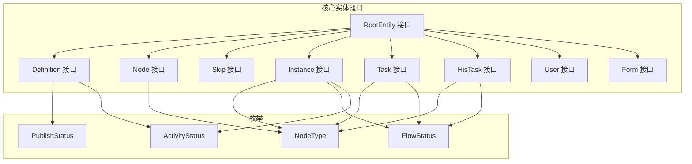
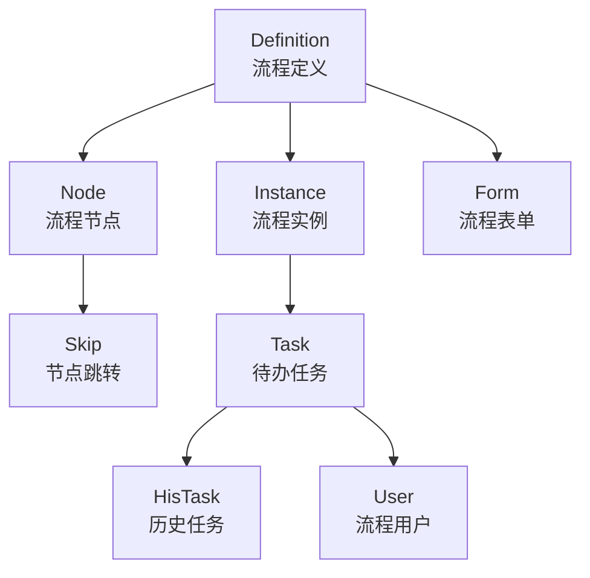
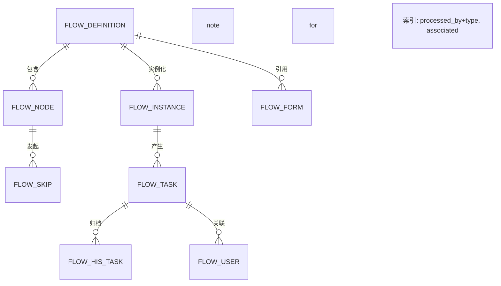

# 实体模型设计

<cite>
**本文引用的文件**
- [Definition.java](file://warm-flow-core/src/main/java/org/dromara/warm/flow/core/entity/Definition.java)
- [Node.java](file://warm-flow-core/src/main/java/org/dromara/warm/flow/core/entity/Node.java)
- [Skip.java](file://warm-flow-core/src/main/java/org/dromara/warm/flow/core/entity/Skip.java)
- [Instance.java](file://warm-flow-core/src/main/java/org/dromara/warm/flow/core/entity/Instance.java)
- [Task.java](file://warm-flow-core/src/main/java/org/dromara/warm/flow/core/entity/Task.java)
- [HisTask.java](file://warm-flow-core/src/main/java/org/dromara/warm/flow/core/entity/HisTask.java)
- [User.java](file://warm-flow-core/src/main/java/org/dromara/warm/flow/core/entity/User.java)
- [Form.java](file://warm-flow-core/src/main/java/org/dromara/warm/flow/core/entity/Form.java)
- [RootEntity.java](file://warm-flow-core/src/main/java/org/dromara/warm/flow/core/entity/RootEntity.java)
- [NodeType.java](file://warm-flow-core/src/main/java/org/dromara/warm/flow/core/enums/NodeType.java)
- [FlowStatus.java](file://warm-flow-core/src/main/java/org/dromara/warm/flow/core/enums/FlowStatus.java)
- [ActivityStatus.java](file://warm-flow-core/src/main/java/org/dromara/warm/flow/core/enums/ActivityStatus.java)
- [PublishStatus.java](file://warm-flow-core/src/main/java/org/dromara/warm/flow/core/enums/PublishStatus.java)
- [warm-flow-all.sql](file://sql/mysql/warm-flow-all.sql)
</cite>

## 目录
1. [引言](#引言)
2. [项目结构](#项目结构)
3. [核心组件](#核心组件)
4. [架构总览](#架构总览)
5. [详细组件分析](#详细组件分析)
6. [依赖分析](#依赖分析)
7. [性能考虑](#性能考虑)
8. [故障排查指南](#故障排查指南)
9. [结论](#结论)
10. [附录](#附录)

## 引言
本文件面向工作流引擎的数据建模与实体设计，系统性梳理核心实体（Definition、Node、Skip、Instance、Task、HisTask、User、Form）的属性设计、业务含义、关系映射与约束，并结合数据库表结构说明主键与外键设计。同时给出实体生命周期与状态转换的分析、使用示例与最佳实践，帮助开发者快速理解并正确应用该实体模型。

## 项目结构
实体模型位于核心模块中，采用接口化设计，统一继承基础接口 RootEntity，确保所有实体具备一致的审计与租户字段。枚举类集中定义节点类型、流程状态、激活状态与发布状态等关键语义，保证跨模块一致性。

图表来源
- [RootEntity.java:27-65](file://warm-flow-core/src/main/java/org/dromara/warm/flow/core/entity/RootEntity.java#L27-L65)
- [Definition.java:29-195](file://warm-flow-core/src/main/java/org/dromara/warm/flow/core/entity/Definition.java#L29-L195)
- [Node.java:30-161](file://warm-flow-core/src/main/java/org/dromara/warm/flow/core/entity/Node.java#L30-L161)
- [Skip.java:28-127](file://warm-flow-core/src/main/java/org/dromara/warm/flow/core/entity/Skip.java#L28-L127)
- [Instance.java:29-165](file://warm-flow-core/src/main/java/org/dromara/warm/flow/core/entity/Instance.java#L29-L165)
- [Task.java:27-135](file://warm-flow-core/src/main/java/org/dromara/warm/flow/core/entity/Task.java#L27-L135)
- [HisTask.java:30-163](file://warm-flow-core/src/main/java/org/dromara/warm/flow/core/entity/HisTask.java#L30-L163)
- [User.java:26-94](file://warm-flow-core/src/main/java/org/dromara/warm/flow/core/entity/User.java#L26-L94)
- [Form.java:26-111](file://warm-flow-core/src/main/java/org/dromara/warm/flow/core/entity/Form.java#L26-L111)
- [NodeType.java:30-160](file://warm-flow-core/src/main/java/org/dromara/warm/flow/core/enums/NodeType.java#L30-L160)
- [FlowStatus.java:30-102](file://warm-flow-core/src/main/java/org/dromara/warm/flow/core/enums/FlowStatus.java#L30-L102)
- [ActivityStatus.java:30-55](file://warm-flow-core/src/main/java/org/dromara/warm/flow/core/enums/ActivityStatus.java#L30-L55)
- [PublishStatus.java:29-70](file://warm-flow-core/src/main/java/org/dromara/warm/flow/core/enums/PublishStatus.java#L29-L70)

章节来源
- [RootEntity.java:27-65](file://warm-flow-core/src/main/java/org/dromara/warm/flow/core/entity/RootEntity.java#L27-L65)
- [Definition.java:29-195](file://warm-flow-core/src/main/java/org/dromara/warm/flow/core/entity/Definition.java#L29-L195)
- [Node.java:30-161](file://warm-flow-core/src/main/java/org/dromara/warm/flow/core/entity/Node.java#L30-L161)
- [Skip.java:28-127](file://warm-flow-core/src/main/java/org/dromara/warm/flow/core/entity/Skip.java#L28-L127)
- [Instance.java:29-165](file://warm-flow-core/src/main/java/org/dromara/warm/flow/core/entity/Instance.java#L29-L165)
- [Task.java:27-135](file://warm-flow-core/src/main/java/org/dromara/warm/flow/core/entity/Task.java#L27-L135)
- [HisTask.java:30-163](file://warm-flow-core/src/main/java/org/dromara/warm/flow/core/entity/HisTask.java#L30-L163)
- [User.java:26-94](file://warm-flow-core/src/main/java/org/dromara/warm/flow/core/entity/User.java#L26-L94)
- [Form.java:26-111](file://warm-flow-core/src/main/java/org/dromara/warm/flow/core/entity/Form.java#L26-L111)
- [NodeType.java:30-160](file://warm-flow-core/src/main/java/org/dromara/warm/flow/core/enums/NodeType.java#L30-L160)
- [FlowStatus.java:30-102](file://warm-flow-core/src/main/java/org/dromara/warm/flow/core/enums/FlowStatus.java#L30-L102)
- [ActivityStatus.java:30-55](file://warm-flow-core/src/main/java/org/dromara/warm/flow/core/enums/ActivityStatus.java#L30-L55)
- [PublishStatus.java:29-70](file://warm-flow-core/src/main/java/org/dromara/warm/flow/core/enums/PublishStatus.java#L29-L70)

## 核心组件
- RootEntity：统一的审计与租户字段接口，所有实体均实现该接口，确保一致的创建时间、更新时间、创建人、更新人、租户ID与逻辑删除标记。
- Definition：流程定义实体，包含流程编码、名称、模型、分类、版本、发布状态、表单定制策略、监听器配置、扩展字段以及与节点、用户的关联集合。
- Node：流程节点实体，包含节点类型、所属流程定义、节点编码与名称、权限标识、坐标、监听器配置、表单定制策略、扩展字段以及与跳转的关联集合。
- Skip：节点跳转关联实体，描述从当前节点到下一节点的跳转名称、类型、条件与坐标。
- Instance：流程实例实体，绑定流程定义与业务ID，记录当前节点、节点类型、流程状态、变量、表单定制策略、定义JSON、扩展字段与激活状态。
- Task：待办任务实体，记录任务归属的流程定义与实例、节点信息、流程状态、表单定制策略与权限列表。
- HisTask：历史任务实体，记录审批人、协作方式、流转类型、审批意见、变量、扩展字段与表单定制策略。
- User：流程用户实体，记录人员类型（审批人/转办人/委托人）、权限人与关联的任务ID。
- Form：流程表单实体，记录表单编码、名称、版本、发布状态、表单类型（内置/外挂）与内容或路径。

章节来源
- [RootEntity.java:27-65](file://warm-flow-core/src/main/java/org/dromara/warm/flow/core/entity/RootEntity.java#L27-L65)
- [Definition.java:29-195](file://warm-flow-core/src/main/java/org/dromara/warm/flow/core/entity/Definition.java#L29-L195)
- [Node.java:30-161](file://warm-flow-core/src/main/java/org/dromara/warm/flow/core/entity/Node.java#L30-L161)
- [Skip.java:28-127](file://warm-flow-core/src/main/java/org/dromara/warm/flow/core/entity/Skip.java#L28-L127)
- [Instance.java:29-165](file://warm-flow-core/src/main/java/org/dromara/warm/flow/core/entity/Instance.java#L29-L165)
- [Task.java:27-135](file://warm-flow-core/src/main/java/org/dromara/warm/flow/core/entity/Task.java#L27-L135)
- [HisTask.java:30-163](file://warm-flow-core/src/main/java/org/dromara/warm/flow/core/entity/HisTask.java#L30-L163)
- [User.java:26-94](file://warm-flow-core/src/main/java/org/dromara/warm/flow/core/entity/User.java#L26-L94)
- [Form.java:26-111](file://warm-flow-core/src/main/java/org/dromara/warm/flow/core/entity/Form.java#L26-L111)

## 架构总览
实体模型围绕“流程定义—节点—跳转—实例—任务—历史任务”的主线展开，User与Form作为辅助实体参与权限与表单管理。下图展示实体间的直接关系与典型交互：

图表来源
- [Definition.java:144-150](file://warm-flow-core/src/main/java/org/dromara/warm/flow/core/entity/Definition.java#L144-L150)
- [Node.java:138-140](file://warm-flow-core/src/main/java/org/dromara/warm/flow/core/entity/Node.java#L138-L140)
- [Instance.java:77-79](file://warm-flow-core/src/main/java/org/dromara/warm/flow/core/entity/Instance.java#L77-L79)
- [Task.java:75-85](file://warm-flow-core/src/main/java/org/dromara/warm/flow/core/entity/Task.java#L75-L85)
- [HisTask.java:66-80](file://warm-flow-core/src/main/java/org/dromara/warm/flow/core/entity/HisTask.java#L66-L80)
- [User.java:83-93](file://warm-flow-core/src/main/java/org/dromara/warm/flow/core/entity/User.java#L83-L93)
- [Form.java:74-106](file://warm-flow-core/src/main/java/org/dromara/warm/flow/core/entity/Form.java#L74-L106)

## 详细组件分析

### Definition（流程定义）
- 设计理念与业务含义
  - 定义一次业务流程的模板，包含流程元数据（编码、名称、模型、分类、版本）、发布状态、表单策略、监听器配置与扩展字段。
  - 支持两类设计器模型（经典/仿钉钉），便于前端可视化编辑与渲染。
- 关键属性
  - 编码与名称：唯一标识与可读名称。
  - 模型与分类：决定可视化呈现与分组。
  - 版本：用于流程迭代与并发控制。
  - 发布状态：0未发布、1已发布、9已失效。
  - 表单策略：是否自定义表单及表单路径。
  - 监听器：类型与路径，支持流程级事件处理。
  - 激活状态：0挂起、1激活。
  - 扩展字段：承载业务系统自定义信息。
- 关系映射
  - 一对多：Definition → Node（一个定义包含多个节点）。
  - 多对多：Definition ↔ User（通过节点与任务间接关联）。
  - 多对一：Definition → Form（若使用外挂表单）。
- 生命周期与状态
  - 未发布 → 已发布（发布操作）；已发布 → 已失效（版本升级或停用）。
- 最佳实践
  - 版本号与发布状态需严格管理，避免并发覆盖。
  - 表单策略与监听器应与业务解耦，通过扩展字段传递上下文。

章节来源
- [Definition.java:77-195](file://warm-flow-core/src/main/java/org/dromara/warm/flow/core/entity/Definition.java#L77-L195)
- [NodeType.java:30-160](file://warm-flow-core/src/main/java/org/dromara/warm/flow/core/enums/NodeType.java#L30-L160)
- [PublishStatus.java:29-70](file://warm-flow-core/src/main/java/org/dromara/warm/flow/core/enums/PublishStatus.java#L29-L70)
- [ActivityStatus.java:30-55](file://warm-flow-core/src/main/java/org/dromara/warm/flow/core/enums/ActivityStatus.java#L30-L55)

### Node（流程节点）
- 设计理念与业务含义
  - 描述流程中的具体环节，支持开始、中间、结束与多种网关类型。
  - 可配置权限标识、签署比例、坐标、监听器与表单策略。
- 关键属性
  - 节点类型：开始/中间/结束/互斥/并行/包容网关。
  - 所属流程定义：definition_id。
  - 编码与名称：唯一标识与可读名称。
  - 权限标识：用于访问控制。
  - 坐标：可视化布局信息。
  - 监听器：类型与路径。
  - 表单策略：是否自定义表单及表单路径。
  - 扩展字段：承载节点级业务信息。
- 关系映射
  - 多对一：Node → Definition。
  - 一对多：Node → Skip（出边跳转）。
  - 一对多：Node → Instance（实例在该节点的落点）。
- 生命周期与状态
  - 随流程定义发布而生效；节点类型变更需同步调整跳转关系。
- 最佳实践
  - 网关节点的分支条件应清晰且可测试。
  - 坐标与权限标识应与前端渲染保持一致。

章节来源
- [Node.java:74-161](file://warm-flow-core/src/main/java/org/dromara/warm/flow/core/entity/Node.java#L74-L161)
- [NodeType.java:30-160](file://warm-flow-core/src/main/java/org/dromara/warm/flow/core/enums/NodeType.java#L30-L160)

### Skip（节点跳转）
- 设计理念与业务含义
  - 描述从当前节点到下一节点的跳转关系，支持命名、类型（通过/退回）、条件表达式与坐标。
- 关键属性
  - 当前节点与下一节点的编码与类型。
  - 跳转名称、类型、条件与坐标。
- 关系映射
  - 多对一：Skip → Definition。
  - 多对一：Skip → Node（起点与终点）。
- 生命周期与状态
  - 随流程定义发布而生效；条件变化需重新校验。
- 最佳实践
  - 跳转条件应简洁明确，避免复杂嵌套。
  - 不同类型的跳转应有清晰的业务语义区分。

章节来源
- [Skip.java:72-127](file://warm-flow-core/src/main/java/org/dromara/warm/flow/core/entity/Skip.java#L72-L127)

### Instance（流程实例）
- 设计理念与业务含义
  - 流程定义的一次执行实例，绑定业务ID，记录当前节点、流程状态、变量与激活状态。
- 关键属性
  - 绑定流程定义与业务ID。
  - 当前节点信息（编码、名称、类型）。
  - 流程状态：涵盖待提交、审批中、通过、自动完成、终止、作废、撤销、完成、退回、失效、拿回、重启、暂存等。
  - 变量：以文本形式存储，可通过工具转换为Map。
  - 表单策略与定义JSON：用于前端渲染与回溯。
  - 激活状态：0挂起、1激活。
- 关系映射
  - 多对一：Instance → Definition。
  - 一对多：Instance → Task（待办任务）。
- 生命周期与状态
  - 状态机遵循 FlowStatus 的枚举值，支持正常流转与异常终止。
- 最佳实践
  - 变量建议结构化存储并通过工具转换，避免直接拼接。
  - 激活状态与流程控制需配合业务策略使用。

章节来源
- [Instance.java:77-165](file://warm-flow-core/src/main/java/org/dromara/warm/flow/core/entity/Instance.java#L77-L165)
- [FlowStatus.java:30-102](file://warm-flow-core/src/main/java/org/dromara/warm/flow/core/enums/FlowStatus.java#L30-L102)
- [ActivityStatus.java:30-55](file://warm-flow-core/src/main/java/org/dromara/warm/flow/core/enums/ActivityStatus.java#L30-L55)

### Task（待办任务）
- 设计理念与业务含义
  - 记录当前可处理的流程任务，包含任务归属、节点信息、流程状态与权限列表。
- 关键属性
  - 绑定流程定义与实例。
  - 节点信息与流程状态。
  - 表单策略与权限列表。
- 关系映射
  - 多对一：Task → Definition、Instance。
  - 一对多：Task → HisTask（历史记录）。
  - 多对一：Task → User（审批人/转办人/委托人）。
- 生命周期与状态
  - 创建后进入待办，处理完成后归档为历史任务。
- 最佳实践
  - 权限列表应与用户角色与节点权限标识匹配。
  - 表单策略与实例表单策略保持一致。

章节来源
- [Task.java:75-135](file://warm-flow-core/src/main/java/org/dromara/warm/flow/core/entity/Task.java#L75-L135)

### HisTask（历史任务）
- 设计理念与业务含义
  - 记录已完成或已取消的任务历史，包含审批人、协作方式、流转类型、审批意见、变量与扩展字段。
- 关键属性
  - 关联定义、实例与任务。
  - 起止节点信息与协作方式。
  - 流转类型（通过/退回/无动作）。
  - 审批意见、变量与扩展字段。
- 关系映射
  - 多对一：HisTask → Definition、Instance、Task。
- 生命周期与状态
  - 由任务归档产生，不可逆。
- 最佳实践
  - 审批意见应标准化，便于审计与报表。
  - 变量与扩展字段需保持结构一致。

章节来源
- [HisTask.java:66-163](file://warm-flow-core/src/main/java/org/dromara/warm/flow/core/entity/HisTask.java#L66-L163)

### User（流程用户）
- 设计理念与业务含义
  - 记录任务相关的人员类型与权限人，支持审批人、转办人、委托人三种角色。
- 关键属性
  - 人员类型：1审批人、2转办人、3委托人。
  - 权限人：具体处理人的标识。
  - 关联任务ID：与Task建立直接关联。
- 关系映射
  - 多对一：User → Task。
- 生命周期与状态
  - 随任务创建而生成，随任务归档而保留。
- 最佳实践
  - 人员类型与权限列表应保持一致，避免越权。
  - 关联字段需确保索引命中，提升查询效率。

章节来源
- [User.java:70-94](file://warm-flow-core/src/main/java/org/dromara/warm/flow/core/entity/User.java#L70-L94)

### Form（流程表单）
- 设计理念与业务含义
  - 管理流程使用的表单资源，支持内置内容与外挂路径两种模式。
- 关键属性
  - 表单编码与名称、版本。
  - 发布状态：0未发布、1已发布、9已失效。
  - 表单类型：0内置（存储内容）、1外挂（存储路径）。
  - 内容或路径：根据类型选择存储位置。
  - 扩展字段：预留业务扩展。
- 关系映射
  - 多对一：Form → Definition（通过定义的表单策略关联）。
- 生命周期与状态
  - 与流程定义版本解耦，可独立发布与失效。
- 最佳实践
  - 内置表单适合简单场景，外挂表单适合复杂表单与动态渲染。
  - 发布状态与版本号需严格管理，避免冲突。

章节来源
- [Form.java:74-111](file://warm-flow-core/src/main/java/org/dromara/warm/flow/core/entity/Form.java#L74-L111)
- [PublishStatus.java:29-70](file://warm-flow-core/src/main/java/org/dromara/warm/flow/core/enums/PublishStatus.java#L29-L70)

## 依赖分析
- 继承关系
  - 所有实体均实现 RootEntity，统一审计与租户字段。
- 枚举依赖
  - 节点类型：NodeType。
  - 流程状态：FlowStatus。
  - 激活状态：ActivityStatus。
  - 发布状态：PublishStatus。
- 数据库映射
  - 表结构与实体属性一一对应，主键均为自增长整型，外键指向对应实体主键。
  - 用户表存在复合索引与单列索引，优化权限查询与关联查询。

图表来源
- [warm-flow-all.sql:1-160](file://sql/mysql/warm-flow-all.sql#L1-L160)

章节来源
- [RootEntity.java:27-65](file://warm-flow-core/src/main/java/org/dromara/warm/flow/core/entity/RootEntity.java#L27-L65)
- [NodeType.java:30-160](file://warm-flow-core/src/main/java/org/dromara/warm/flow/core/enums/NodeType.java#L30-L160)
- [FlowStatus.java:30-102](file://warm-flow-core/src/main/java/org/dromara/warm/flow/core/enums/FlowStatus.java#L30-L102)
- [ActivityStatus.java:30-55](file://warm-flow-core/src/main/java/org/dromara/warm/flow/core/enums/ActivityStatus.java#L30-L55)
- [PublishStatus.java:29-70](file://warm-flow-core/src/main/java/org/dromara/warm/flow/core/enums/PublishStatus.java#L29-L70)
- [warm-flow-all.sql:1-160](file://sql/mysql/warm-flow-all.sql#L1-L160)

## 性能考虑
- 索引策略
  - 用户表对 (processed_by, type) 与 (associated) 建立索引，有利于权限查询与任务关联查询。
- 查询优化
  - 使用分页与条件过滤，避免全表扫描。
  - 对常用查询字段（如 business_id、node_code、flow_status）建立索引。
- 写入优化
  - 批量插入节点与跳转时，尽量减少事务拆分，降低锁竞争。
- 变量存储
  - 变量以文本存储，建议通过工具进行序列化/反序列化，避免频繁格式转换。

## 故障排查指南
- 常见问题
  - 节点权限不生效：检查节点权限标识与用户权限列表是否匹配。
  - 任务无法查询：确认任务与实例的关联字段是否正确，是否存在逻辑删除标记。
  - 流程状态异常：核对 FlowStatus 的枚举值与业务状态映射。
  - 表单加载失败：确认表单策略与表单类型是否正确，路径或内容是否有效。
- 排查步骤
  - 核对数据库表结构与实体属性映射。
  - 检查外键约束与索引是否完整。
  - 使用最小可复现样例验证状态机与条件表达式。

章节来源
- [FlowStatus.java:30-102](file://warm-flow-core/src/main/java/org/dromara/warm/flow/core/enums/FlowStatus.java#L30-L102)
- [warm-flow-all.sql:1-160](file://sql/mysql/warm-flow-all.sql#L1-L160)

## 结论
该实体模型以清晰的职责划分与强一致的枚举语义为基础，围绕流程定义、节点、跳转、实例、任务与历史构建了完整的生命周期闭环。通过统一的审计与租户接口、规范的状态机与严格的发布/激活策略，既满足复杂业务场景的灵活性，又保障了系统的可维护性与可扩展性。建议在实际落地中严格遵循版本与发布管理策略，并结合索引与查询优化提升整体性能。

## 附录
- 使用示例（概念性说明）
  - 新增流程定义：设置编码、名称、模型、分类、版本与发布状态，保存后生成主键。
  - 配置节点与跳转：为每个节点设置类型、权限标识、坐标与监听器，配置从当前节点到下一节点的跳转名称、类型与条件。
  - 启动流程实例：传入业务ID与流程定义ID，系统根据起始节点创建实例与初始任务。
  - 处理任务：审批人/转办人/委托人按权限处理任务，生成历史记录并推进流程。
- 最佳实践
  - 以版本化管理流程定义，避免直接覆盖。
  - 将复杂逻辑封装为监听器与处理器，保持实体模型简洁。
  - 对用户权限与表单策略进行集中管理，避免分散配置导致的不一致。