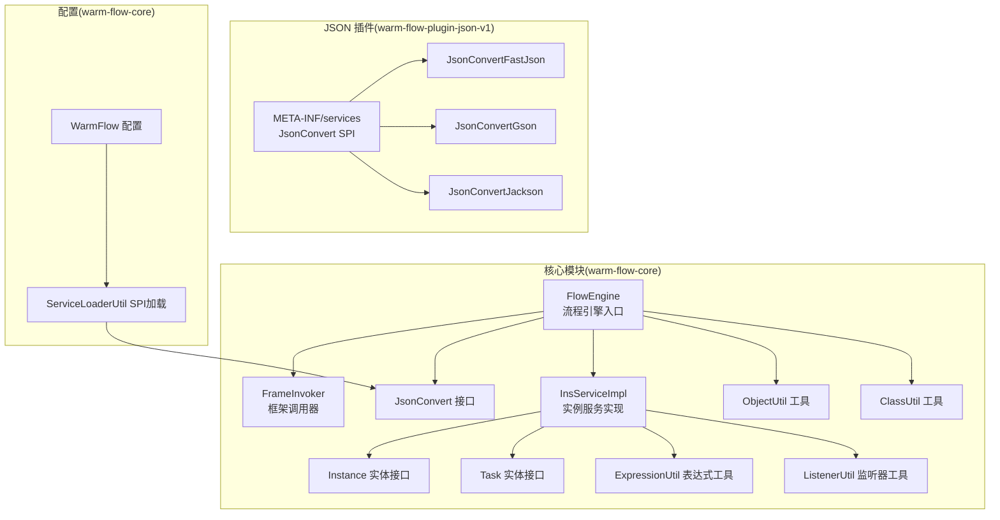
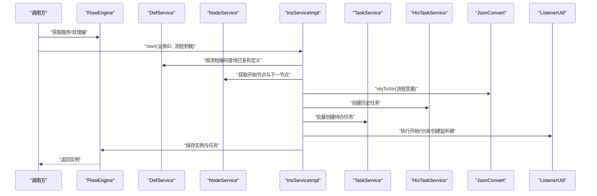
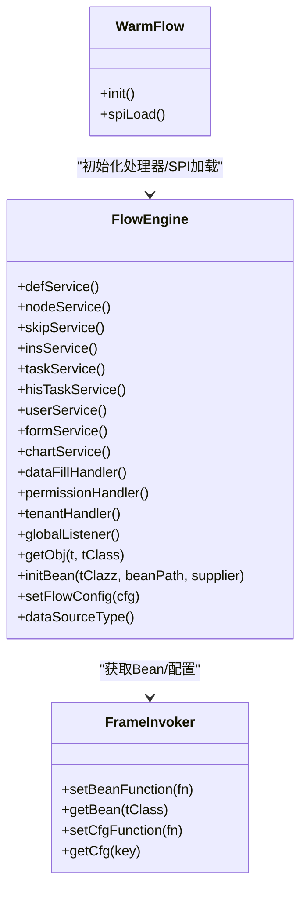
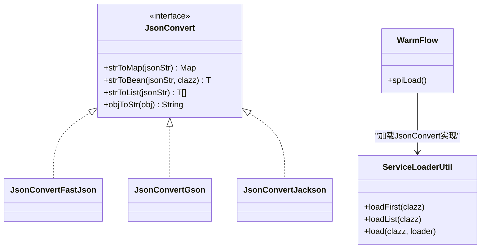
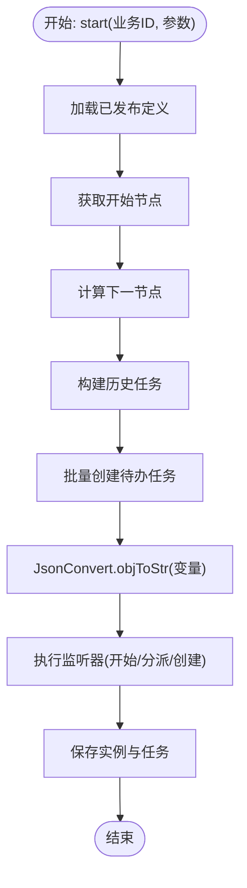
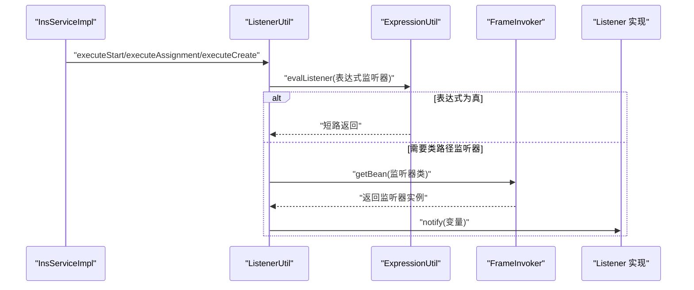
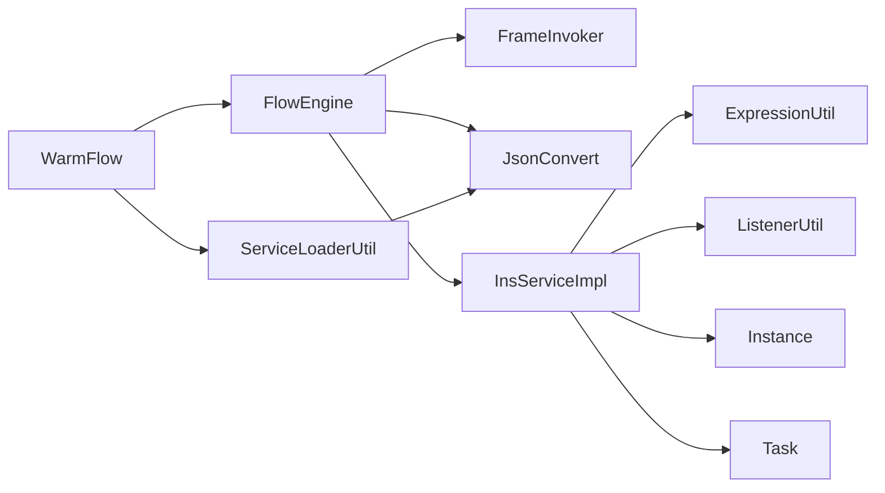

# 数据流与处理机制

<cite>
**本文引用的文件**
- [FlowEngine.java](file://warm-flow-core/src/main/java/org/dromara/warm/flow/core/FlowEngine.java)
- [FrameInvoker.java](file://warm-flow-core/src/main/java/org/dromara/warm/flow/core/invoker/FrameInvoker.java)
- [JsonConvert.java](file://warm-flow-core/src/main/java/org/dromara/warm/flow/core/json/JsonConvert.java)
- [JsonConvertFastJson.java](file://warm-flow-plugin/warm-flow-plugin-json/warm-flow-plugin-json-v1/src/main/java/org/dromara/warm/plugin/json/JsonConvertFastJson.java)
- [JsonConvertGson.java](file://warm-flow-plugin/warm-flow-plugin-json/warm-flow-plugin-json-v1/src/main/java/org/dromara/warm/plugin/json/JsonConvertGson.java)
- [JsonConvertJackson.java](file://warm-flow-plugin/warm-flow-plugin-json/warm-flow-plugin-json-v1/src/main/java/org/dromara/warm/plugin/json/JsonConvertJackson.java)
- [WarmFlow.java](file://warm-flow-core/src/main/java/org/dromara/warm/flow/core/config/WarmFlow.java)
- [ServiceLoaderUtil.java](file://warm-flow-core/src/main/java/org/dromara/warm/flow/core/utils/ServiceLoaderUtil.java)
- [InsServiceImpl.java](file://warm-flow-core/src/main/java/org/dromara/warm/flow/core/service/impl/InsServiceImpl.java)
- [Instance.java](file://warm-flow-core/src/main/java/org/dromara/warm/flow/core/entity/Instance.java)
- [Task.java](file://warm-flow-core/src/main/java/org/dromara/warm/flow/core/entity/Task.java)
- [ExpressionUtil.java](file://warm-flow-core/src/main/java/org/dromara/warm/flow/core/utils/ExpressionUtil.java)
- [ListenerUtil.java](file://warm-flow-core/src/main/java/org/dromara/warm/flow/core/utils/ListenerUtil.java)
- [ObjectUtil.java](file://warm-flow-core/src/main/java/org/dromara/warm/flow/core/utils/ObjectUtil.java)
- [ClassUtil.java](file://warm-flow-core/src/main/java/org/dromara/warm/flow/core/utils/ClassUtil.java)
- [META-INF/services/org.dromara.warm.flow.core.json.JsonConvert](file://warm-flow-plugin/warm-flow-plugin-json/warm-flow-plugin-json-v1/src/main/resources/META-INF/services/org.dromara.warm.flow.core.json.JsonConvert)
</cite>

## 目录
1. [引言](#引言)
2. [项目结构](#项目结构)
3. [核心组件](#核心组件)
4. [架构总览](#架构总览)
5. [详细组件分析](#详细组件分析)
6. [依赖分析](#依赖分析)
7. [性能考虑](#性能考虑)
8. [故障排查指南](#故障排查指南)
9. [结论](#结论)
10. [附录](#附录)

## 引言
本技术文档聚焦于工作流引擎的数据流与处理机制，围绕以下目标展开：
- 解析从流程定义到实例创建、从节点执行到任务完成的完整数据流
- 阐述 FrameInvoker 的框架调用机制与依赖注入实现
- 分析数据序列化与反序列化过程，包括 JsonConvert 的使用与扩展机制
- 解释工具类的设计与应用，如 ObjectUtil、ClassUtil 等在引擎中的作用
- 提供数据流的时序图与处理流程图，帮助开发者理解引擎内部的数据处理机制与性能优化点

## 项目结构
本项目采用多模块组织方式，核心能力集中在 warm-flow-core，JSON 序列化扩展位于 warm-flow-plugin-json，ORM 层在 warm-flow-orm，UI 在 warm-flow-ui。本文重点分析核心模块与插件模块中与数据流相关的关键文件。

图表来源
- [FlowEngine.java:39-269](file://warm-flow-core/src/main/java/org/dromara/warm/flow/core/FlowEngine.java#L39-L269)
- [FrameInvoker.java:25-71](file://warm-flow-core/src/main/java/org/dromara/warm/flow/core/invoker/FrameInvoker.java#L25-L71)
- [JsonConvert.java:26-61](file://warm-flow-core/src/main/java/org/dromara/warm/flow/core/json/JsonConvert.java#L26-L61)
- [JsonConvertFastJson.java:34-95](file://warm-flow-plugin/warm-flow-plugin-json/warm-flow-plugin-json-v1/src/main/java/org/dromara/warm/plugin/json/JsonConvertFastJson.java#L34-L95)
- [JsonConvertGson.java:35-99](file://warm-flow-plugin/warm-flow-plugin-json/warm-flow-plugin-json-v1/src/main/java/org/dromara/warm/plugin/json/JsonConvertGson.java#L35-L99)
- [JsonConvertJackson.java:41-127](file://warm-flow-plugin/warm-flow-plugin-json/warm-flow-plugin-json-v1/src/main/java/org/dromara/warm/plugin/json/JsonConvertJackson.java#L41-L127)
- [WarmFlow.java:36-157](file://warm-flow-core/src/main/java/org/dromara/warm/flow/core/config/WarmFlow.java#L36-L157)
- [ServiceLoaderUtil.java:36-91](file://warm-flow-core/src/main/java/org/dromara/warm/flow/core/utils/ServiceLoaderUtil.java#L36-L91)
- [InsServiceImpl.java:46-244](file://warm-flow-core/src/main/java/org/dromara/warm/flow/core/service/impl/InsServiceImpl.java#L46-L244)
- [Instance.java:29-165](file://warm-flow-core/src/main/java/org/dromara/warm/flow/core/entity/Instance.java#L29-L165)
- [Task.java:27-135](file://warm-flow-core/src/main/java/org/dromara/warm/flow/core/entity/Task.java#L27-L135)
- [ExpressionUtil.java:36-195](file://warm-flow-core/src/main/java/org/dromara/warm/flow/core/utils/ExpressionUtil.java#L36-L195)
- [ListenerUtil.java:39-158](file://warm-flow-core/src/main/java/org/dromara/warm/flow/core/utils/ListenerUtil.java#L39-L158)
- [ObjectUtil.java:26-87](file://warm-flow-core/src/main/java/org/dromara/warm/flow/core/utils/ObjectUtil.java#L26-L87)
- [ClassUtil.java:37-164](file://warm-flow-core/src/main/java/org/dromara/warm/flow/core/utils/ClassUtil.java#L37-L164)
- [META-INF/services/org.dromara.warm.flow.core.json.JsonConvert:1-6](file://warm-flow-plugin/warm-flow-plugin-json/warm-flow-plugin-json-v1/src/main/resources/META-INF/services/org.dromara.warm.flow.core.json.JsonConvert#L1-L6)

章节来源
- [FlowEngine.java:39-269](file://warm-flow-core/src/main/java/org/dromara/warm/flow/core/FlowEngine.java#L39-L269)
- [WarmFlow.java:36-157](file://warm-flow-core/src/main/java/org/dromara/warm/flow/core/config/WarmFlow.java#L36-L157)

## 核心组件
- 流程引擎入口：负责统一管理服务、处理器、配置与依赖注入初始化
- 框架调用器：提供 bean 与配置的获取函数，屏蔽具体框架差异
- JSON 转换接口与实现：抽象 JSON 序列化/反序列化，支持 SPI 扩展
- 实例服务：承载流程启动、任务创建、监听器执行等核心数据处理
- 实体接口：定义流程实例与任务的数据结构与序列化契约
- 工具类：提供对象判空、反射克隆、类扫描、表达式求值、监听器执行等支撑能力

章节来源
- [FlowEngine.java:39-269](file://warm-flow-core/src/main/java/org/dromara/warm/flow/core/FlowEngine.java#L39-L269)
- [FrameInvoker.java:25-71](file://warm-flow-core/src/main/java/org/dromara/warm/flow/core/invoker/FrameInvoker.java#L25-L71)
- [JsonConvert.java:26-61](file://warm-flow-core/src/main/java/org/dromara/warm/flow/core/json/JsonConvert.java#L26-L61)
- [InsServiceImpl.java:46-244](file://warm-flow-core/src/main/java/org/dromara/warm/flow/core/service/impl/InsServiceImpl.java#L46-L244)
- [Instance.java:29-165](file://warm-flow-core/src/main/java/org/dromara/warm/flow/core/entity/Instance.java#L29-L165)
- [Task.java:27-135](file://warm-flow-core/src/main/java/org/dromara/warm/flow/core/entity/Task.java#L27-L135)
- [ObjectUtil.java:26-87](file://warm-flow-core/src/main/java/org/dromara/warm/flow/core/utils/ObjectUtil.java#L26-L87)
- [ClassUtil.java:37-164](file://warm-flow-core/src/main/java/org/dromara/warm/flow/core/utils/ClassUtil.java#L37-L164)

## 架构总览
引擎通过 WarmFlow 配置初始化处理器与 JSON 转换器，再由 FlowEngine 统一调度。实例启动时，InsServiceImpl 读取发布流程、计算下一节点、创建任务与历史任务、执行监听器，并持久化数据。数据在实体与 JSON 字符串之间通过 JsonConvert 进行双向转换。

图表来源
- [InsServiceImpl.java:54-111](file://warm-flow-core/src/main/java/org/dromara/warm/flow/core/service/impl/InsServiceImpl.java#L54-L111)
- [ListenerUtil.java:67-94](file://warm-flow-core/src/main/java/org/dromara/warm/flow/core/utils/ListenerUtil.java#L67-L94)
- [Instance.java:125-127](file://warm-flow-core/src/main/java/org/dromara/warm/flow/core/entity/Instance.java#L125-L127)

## 详细组件分析

### 组件A：流程引擎与依赖注入（FlowEngine + FrameInvoker）
- FlowEngine 作为全局入口，集中管理服务、处理器与配置，并通过 FrameInvoker 获取 bean 或回退到 Supplier 创建
- FrameInvoker 以函数式接口持有 bean 与配置获取逻辑，避免直接依赖具体框架容器
- WarmFlow 在初始化阶段通过 SPI 加载 JsonConvert 实现，并调用 FlowEngine 的初始化方法装载处理器

图表来源
- [FlowEngine.java:72-267](file://warm-flow-core/src/main/java/org/dromara/warm/flow/core/FlowEngine.java#L72-L267)
- [FrameInvoker.java:42-69](file://warm-flow-core/src/main/java/org/dromara/warm/flow/core/invoker/FrameInvoker.java#L42-L69)
- [WarmFlow.java:130-157](file://warm-flow-core/src/main/java/org/dromara/warm/flow/core/config/WarmFlow.java#L130-L157)

章节来源
- [FlowEngine.java:72-267](file://warm-flow-core/src/main/java/org/dromara/warm/flow/core/FlowEngine.java#L72-L267)
- [FrameInvoker.java:25-71](file://warm-flow-core/src/main/java/org/dromara/warm/flow/core/invoker/FrameInvoker.java#L25-L71)
- [WarmFlow.java:130-157](file://warm-flow-core/src/main/java/org/dromara/warm/flow/core/config/WarmFlow.java#L130-L157)

### 组件B：数据序列化与反序列化（JsonConvert 与 SPI 扩展）
- JsonConvert 抽象 JSON 转换能力，提供字符串到 Map/Bean/List 以及对象到字符串的转换
- 通过 META-INF/services 配置 SPI，WarmFlow 在初始化时使用 ServiceLoaderUtil 加载第一个可用实现
- 插件模块提供 FastJson、Gson、Jackson 等多种实现，满足不同场景需求

图表来源
- [JsonConvert.java:26-61](file://warm-flow-core/src/main/java/org/dromara/warm/flow/core/json/JsonConvert.java#L26-L61)
- [JsonConvertFastJson.java:34-95](file://warm-flow-plugin/warm-flow-plugin-json/warm-flow-plugin-json-v1/src/main/java/org/dromara/warm/plugin/json/JsonConvertFastJson.java#L34-L95)
- [JsonConvertGson.java:35-99](file://warm-flow-plugin/warm-flow-plugin-json/warm-flow-plugin-json-v1/src/main/java/org/dromara/warm/plugin/json/JsonConvertGson.java#L35-L99)
- [JsonConvertJackson.java:41-127](file://warm-flow-plugin/warm-flow-plugin-json/warm-flow-plugin-json-v1/src/main/java/org/dromara/warm/plugin/json/JsonConvertJackson.java#L41-L127)
- [ServiceLoaderUtil.java:36-91](file://warm-flow-core/src/main/java/org/dromara/warm/flow/core/utils/ServiceLoaderUtil.java#L36-L91)
- [WarmFlow.java:149-157](file://warm-flow-core/src/main/java/org/dromara/warm/flow/core/config/WarmFlow.java#L149-L157)
- [META-INF/services/org.dromara.warm.flow.core.json.JsonConvert:1-6](file://warm-flow-plugin/warm-flow-plugin-json/warm-flow-plugin-json-v1/src/main/resources/META-INF/services/org.dromara.warm.flow.core.json.JsonConvert#L1-L6)

章节来源
- [JsonConvert.java:26-61](file://warm-flow-core/src/main/java/org/dromara/warm/flow/core/json/JsonConvert.java#L26-L61)
- [JsonConvertFastJson.java:34-95](file://warm-flow-plugin/warm-flow-plugin-json/warm-flow-plugin-json-v1/src/main/java/org/dromara/warm/plugin/json/JsonConvertFastJson.java#L34-L95)
- [JsonConvertGson.java:35-99](file://warm-flow-plugin/warm-flow-plugin-json/warm-flow-plugin-json-v1/src/main/java/org/dromara/warm/plugin/json/JsonConvertGson.java#L35-L99)
- [JsonConvertJackson.java:41-127](file://warm-flow-plugin/warm-flow-plugin-json/warm-flow-plugin-json-v1/src/main/java/org/dromara/warm/plugin/json/JsonConvertJackson.java#L41-L127)
- [ServiceLoaderUtil.java:36-91](file://warm-flow-core/src/main/java/org/dromara/warm/flow/core/utils/ServiceLoaderUtil.java#L36-L91)
- [WarmFlow.java:149-157](file://warm-flow-core/src/main/java/org/dromara/warm/flow/core/config/WarmFlow.java#L149-L157)
- [META-INF/services/org.dromara.warm.flow.core.json.JsonConvert:1-6](file://warm-flow-plugin/warm-flow-plugin-json/warm-flow-plugin-json-v1/src/main/resources/META-INF/services/org.dromara.warm.flow.core.json.JsonConvert#L1-L6)

### 组件C：实例启动与数据流（InsServiceImpl）
- 启动流程时，读取已发布定义与开始节点，计算下一节点集合，创建历史任务与待办任务
- 将流程变量通过 JsonConvert 序列化存储到实例的变量字段
- 执行监听器（开始、分派、创建），并保存实例与任务

图表来源
- [InsServiceImpl.java:54-111](file://warm-flow-core/src/main/java/org/dromara/warm/flow/core/service/impl/InsServiceImpl.java#L54-L111)
- [Instance.java:174-194](file://warm-flow-core/src/main/java/org/dromara/warm/flow/core/entity/Instance.java#L174-L194)

章节来源
- [InsServiceImpl.java:54-111](file://warm-flow-core/src/main/java/org/dromara/warm/flow/core/service/impl/InsServiceImpl.java#L54-L111)
- [Instance.java:174-194](file://warm-flow-core/src/main/java/org/dromara/warm/flow/core/entity/Instance.java#L174-L194)

### 组件D：表达式与监听器（ExpressionUtil + ListenerUtil）
- ExpressionUtil 注册条件与变量表达式策略，支持动态求值与权限转换
- ListenerUtil 支持节点级、流程级与全局监听器的执行，支持表达式监听器与类路径监听器

图表来源
- [ListenerUtil.java:83-137](file://warm-flow-core/src/main/java/org/dromara/warm/flow/core/utils/ListenerUtil.java#L83-L137)
- [ExpressionUtil.java:130-145](file://warm-flow-core/src/main/java/org/dromara/warm/flow/core/utils/ExpressionUtil.java#L130-L145)
- [FrameInvoker.java:46-52](file://warm-flow-core/src/main/java/org/dromara/warm/flow/core/invoker/FrameInvoker.java#L46-L52)

章节来源
- [ListenerUtil.java:83-137](file://warm-flow-core/src/main/java/org/dromara/warm/flow/core/utils/ListenerUtil.java#L83-L137)
- [ExpressionUtil.java:130-145](file://warm-flow-core/src/main/java/org/dromara/warm/flow/core/utils/ExpressionUtil.java#L130-L145)
- [FrameInvoker.java:46-52](file://warm-flow-core/src/main/java/org/dromara/warm/flow/core/invoker/FrameInvoker.java#L46-L52)

### 组件E：工具类设计与应用
- ObjectUtil：提供空值判断与默认值策略，简化判空与默认值处理
- ClassUtil：提供类加载、反射克隆、包扫描等功能，支撑运行时装配与策略加载
- ExpressionUtil：注册并执行表达式策略，支持条件、变量与监听器表达式
- ServiceLoaderUtil：封装 SPI 加载，提供首个实现与列表加载能力

章节来源
- [ObjectUtil.java:26-87](file://warm-flow-core/src/main/java/org/dromara/warm/flow/core/utils/ObjectUtil.java#L26-L87)
- [ClassUtil.java:37-164](file://warm-flow-core/src/main/java/org/dromara/warm/flow/core/utils/ClassUtil.java#L37-L164)
- [ExpressionUtil.java:36-195](file://warm-flow-core/src/main/java/org/dromara/warm/flow/core/utils/ExpressionUtil.java#L36-L195)
- [ServiceLoaderUtil.java:36-147](file://warm-flow-core/src/main/java/org/dromara/warm/flow/core/utils/ServiceLoaderUtil.java#L36-L147)

## 依赖分析
- FlowEngine 依赖 FrameInvoker 获取 Bean 与配置，依赖 WarmFlow 初始化处理器与 JSON 转换器
- InsServiceImpl 依赖服务层与工具类，贯穿表达式与监听器执行链
- JsonConvert 通过 SPI 与 WarmFlow 解耦，插件模块提供多种实现
- ListenerUtil 与 ExpressionUtil 协作，实现监听器与表达式的统一调度

图表来源
- [FlowEngine.java:172-267](file://warm-flow-core/src/main/java/org/dromara/warm/flow/core/FlowEngine.java#L172-L267)
- [WarmFlow.java:130-157](file://warm-flow-core/src/main/java/org/dromara/warm/flow/core/config/WarmFlow.java#L130-L157)
- [ServiceLoaderUtil.java:36-91](file://warm-flow-core/src/main/java/org/dromara/warm/flow/core/utils/ServiceLoaderUtil.java#L36-L91)
- [InsServiceImpl.java:46-244](file://warm-flow-core/src/main/java/org/dromara/warm/flow/core/service/impl/InsServiceImpl.java#L46-L244)
- [ListenerUtil.java:39-158](file://warm-flow-core/src/main/java/org/dromara/warm/flow/core/utils/ListenerUtil.java#L39-L158)
- [ExpressionUtil.java:36-195](file://warm-flow-core/src/main/java/org/dromara/warm/flow/core/utils/ExpressionUtil.java#L36-L195)
- [Instance.java:29-165](file://warm-flow-core/src/main/java/org/dromara/warm/flow/core/entity/Instance.java#L29-L165)
- [Task.java:27-135](file://warm-flow-core/src/main/java/org/dromara/warm/flow/core/entity/Task.java#L27-L135)

章节来源
- [FlowEngine.java:172-267](file://warm-flow-core/src/main/java/org/dromara/warm/flow/core/FlowEngine.java#L172-L267)
- [WarmFlow.java:130-157](file://warm-flow-core/src/main/java/org/dromara/warm/flow/core/config/WarmFlow.java#L130-L157)
- [ServiceLoaderUtil.java:36-91](file://warm-flow-core/src/main/java/org/dromara/warm/flow/core/utils/ServiceLoaderUtil.java#L36-L91)
- [InsServiceImpl.java:46-244](file://warm-flow-core/src/main/java/org/dromara/warm/flow/core/service/impl/InsServiceImpl.java#L46-L244)
- [ListenerUtil.java:39-158](file://warm-flow-core/src/main/java/org/dromara/warm/flow/core/utils/ListenerUtil.java#L39-L158)
- [ExpressionUtil.java:36-195](file://warm-flow-core/src/main/java/org/dromara/warm/flow/core/utils/ExpressionUtil.java#L36-L195)
- [Instance.java:29-165](file://warm-flow-core/src/main/java/org/dromara/warm/flow/core/entity/Instance.java#L29-L165)
- [Task.java:27-135](file://warm-flow-core/src/main/java/org/dromara/warm/flow/core/entity/Task.java#L27-L135)

## 性能考虑
- JSON 转换器选择：根据场景选择 FastJson/Gson/Jackson，注意序列化配置（如忽略空值）与异常开销
- 表达式求值：策略注册顺序影响匹配效率，建议将常用策略靠后注册以减少匹配成本
- 监听器执行：表达式监听器优先执行，可减少不必要的类加载与实例化
- 反射与类扫描：ClassUtil 的包扫描与反射克隆会带来额外开销，应避免在热路径频繁调用
- 任务批量操作：InsServiceImpl 中批量保存任务与用户，减少数据库往返次数

## 故障排查指南
- JSON 转换异常：JsonConvertJackson 在反序列化失败时抛出 FlowException，需检查输入格式与字段映射
- 监听器执行异常：ListenerUtil 在执行类路径监听器时捕获异常并继续流程，需关注日志与业务影响
- Bean 获取失败：FrameInvoker 在获取 Bean 或配置时捕获异常并返回空，需确认初始化顺序与 SPI 配置
- 表达式策略缺失：ExpressionUtil 在策略列表为空时抛出 FlowException，需检查 WarmFlow 初始化与 SPI 注册

章节来源
- [JsonConvertJackson.java:56-86](file://warm-flow-plugin/warm-flow-plugin-json/warm-flow-plugin-json-v1/src/main/java/org/dromara/warm/plugin/json/JsonConvertJackson.java#L56-L86)
- [ListenerUtil.java:115-133](file://warm-flow-core/src/main/java/org/dromara/warm/flow/core/utils/ListenerUtil.java#L115-L133)
- [FrameInvoker.java:46-69](file://warm-flow-core/src/main/java/org/dromara/warm/flow/core/invoker/FrameInvoker.java#L46-L69)
- [ExpressionUtil.java:155-173](file://warm-flow-core/src/main/java/org/dromara/warm/flow/core/utils/ExpressionUtil.java#L155-L173)

## 结论
本技术文档梳理了工作流引擎从流程定义到实例创建、从节点执行到任务完成的完整数据流，阐明了 FlowEngine 的依赖注入机制与 FrameInvoker 的框架适配能力，解析了 JsonConvert 的序列化扩展与 WarmFlow 的 SPI 初始化流程，并总结了表达式与监听器的协作机制。通过可视化图示与章节来源标注，开发者可快速定位关键实现与优化点，提升系统稳定性与性能表现。

## 附录
- 实体接口与序列化契约：Instance 与 Task 定义了流程变量的存储与读取方式，确保数据在内存与持久化层的一致性
- 工具类最佳实践：在热路径避免频繁反射与类扫描，合理使用默认值与空值判断，减少分支与异常开销