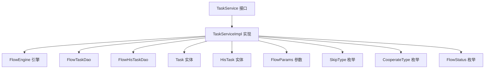
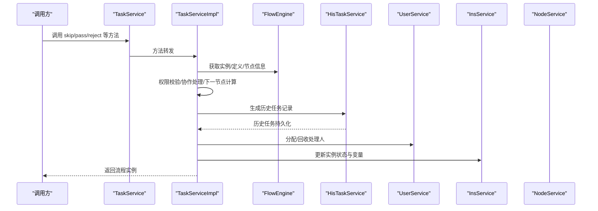
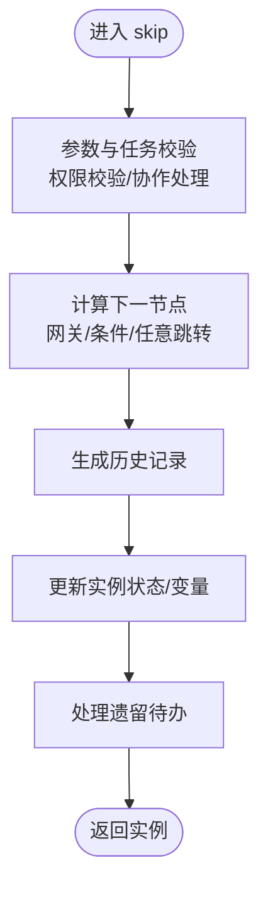
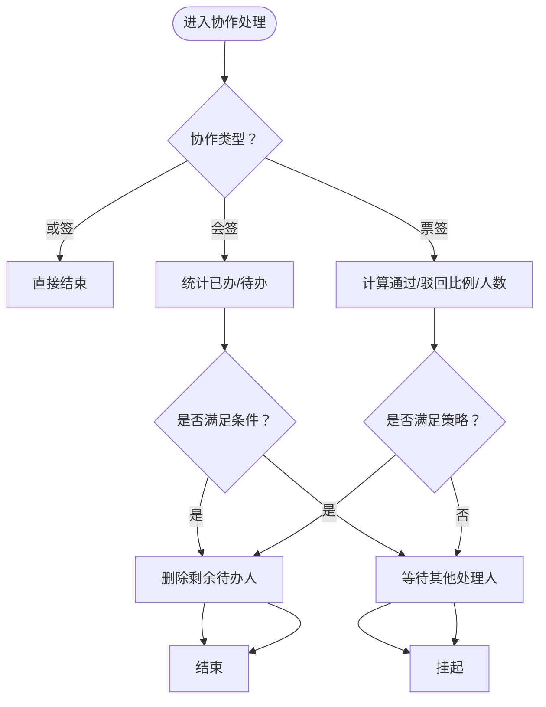
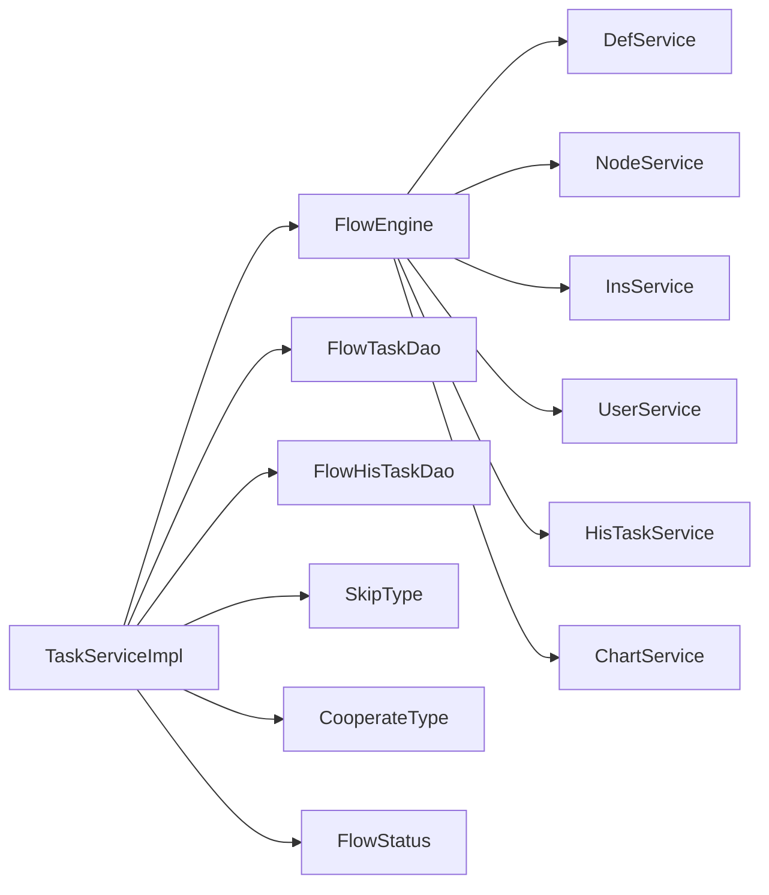

# 任务服务

<cite>
**本文引用的文件**
- [TaskService.java](file://warm-flow-core/src/main/java/org/dromara/warm/flow/core/service/TaskService.java)
- [TaskServiceImpl.java](file://warm-flow-core/src/main/java/org/dromara/warm/flow/core/service/impl/TaskServiceImpl.java)
- [Task.java](file://warm-flow-core/src/main/java/org/dromara/warm/flow/core/entity/Task.java)
- [HisTask.java](file://warm-flow-core/src/main/java/org/dromara/warm/flow/core/entity/HisTask.java)
- [HisTaskService.java](file://warm-flow-core/src/main/java/org/dromara/warm/flow/core/service/HisTaskService.java)
- [FlowParams.java](file://warm-flow-core/src/main/java/org/dromara/warm/flow/core/dto/FlowParams.java)
- [SkipType.java](file://warm-flow-core/src/main/java/org/dromara/warm/flow/core/enums/SkipType.java)
- [CooperateType.java](file://warm-flow-core/src/main/java/org/dromara/warm/flow/core/enums/CooperateType.java)
- [FlowStatus.java](file://warm-flow-core/src/main/java/org/dromara/warm/flow/core/enums/FlowStatus.java)
- [FlowTaskDao.java](file://warm-flow-core/src/main/java/org/dromara/warm/flow/core/orm/dao/FlowTaskDao.java)
- [FlowHisTaskDao.java](file://warm-flow-core/src/main/java/org/dromara/warm/flow/core/orm/dao/FlowHisTaskDao.java)
- [FlowEngine.java](file://warm-flow-core/src/main/java/org/dromara/warm/flow/core/FlowEngine.java)
</cite>

## 目录
1. [简介](#简介)
2. [项目结构](#项目结构)
3. [核心组件](#核心组件)
4. [架构总览](#架构总览)
5. [详细组件分析](#详细组件分析)
6. [依赖分析](#依赖分析)
7. [性能考量](#性能考量)
8. [故障排查指南](#故障排查指南)
9. [结论](#结论)
10. [附录](#附录)

## 简介
本文件面向开发者与实施人员，系统化梳理任务服务（TaskService）的设计与实现，围绕待办任务的生命周期（创建、分配、处理、撤销、终止、拿回、退回、跳转等）进行深入解析。文档同时阐述任务与流程实例、节点的关系，任务状态转换规则，历史任务（HisTask）的记录机制与查询能力，并给出常见操作的使用要点与最佳实践。

## 项目结构
任务服务位于 warm-flow-core 模块中，采用“接口 + 实现 + DTO/枚举/DAO”的分层组织方式：
- 接口层：TaskService 定义对外能力
- 实现层：TaskServiceImpl 负责流程编排、权限校验、协作处理、历史记录与实例状态更新
- 实体层：Task、HisTask 描述待办与历史任务的数据模型
- 参数层：FlowParams 封装流程调用所需的参数与上下文
- 枚举层：SkipType、CooperateType、FlowStatus 描述流程动作、协作方式与状态
- DAO 层：FlowTaskDao、FlowHisTaskDao 提供数据库访问能力
- 引擎层：FlowEngine 提供跨服务的统一入口与工厂方法

图表来源
- [TaskService.java](file://warm-flow-core/src/main/java/org/dromara/warm/flow/core/service/TaskService.java)
- [TaskServiceImpl.java](file://warm-flow-core/src/main/java/org/dromara/warm/flow/core/service/impl/TaskServiceImpl.java)
- [FlowTaskDao.java](file://warm-flow-core/src/main/java/org/dromara/warm/flow/core/orm/dao/FlowTaskDao.java)
- [FlowHisTaskDao.java](file://warm-flow-core/src/main/java/org/dromara/warm/flow/core/orm/dao/FlowHisTaskDao.java)
- [Task.java](file://warm-flow-core/src/main/java/org/dromara/warm/flow/core/entity/Task.java)
- [HisTask.java](file://warm-flow-core/src/main/java/org/dromara/warm/flow/core/entity/HisTask.java)
- [FlowParams.java](file://warm-flow-core/src/main/java/org/dromara/warm/flow/core/dto/FlowParams.java)
- [SkipType.java](file://warm-flow-core/src/main/java/org/dromara/warm/flow/core/enums/SkipType.java)
- [CooperateType.java](file://warm-flow-core/src/main/java/org/dromara/warm/flow/core/enums/CooperateType.java)
- [FlowStatus.java](file://warm-flow-core/src/main/java/org/dromara/warm/flow/core/enums/FlowStatus.java)

章节来源
- [TaskService.java](file://warm-flow-core/src/main/java/org/dromara/warm/flow/core/service/TaskService.java)
- [TaskServiceImpl.java](file://warm-flow-core/src/main/java/org/dromara/warm/flow/core/service/impl/TaskServiceImpl.java)

## 核心组件
- TaskService：定义任务生命周期与流程控制的对外接口，涵盖审批通过/退回、跳转、撤销、终止、委派/转办/加签/减签、暂存、表单加载等能力。
- TaskServiceImpl：具体实现，负责参数校验、权限校验、协作处理（或签/会签/票签）、下一节点计算、历史记录生成、实例状态更新、监听器触发等。
- Task/HisTask：待办任务与历史任务实体，承载流程状态、节点信息、权限列表、表单信息等。
- FlowParams：流程调用参数载体，支持跳转类型、节点编码、审批意见、流程变量、下个任务处理人、忽略校验等。
- 枚举体系：SkipType（通过/退回/无动作）、CooperateType（协作方式）、FlowStatus（流程状态）。
- DAO 层：FlowTaskDao、FlowHisTaskDao 提供按实例与节点过滤的查询与批量删除能力。

章节来源
- [TaskService.java](file://warm-flow-core/src/main/java/org/dromara/warm/flow/core/service/TaskService.java)
- [TaskServiceImpl.java](file://warm-flow-core/src/main/java/org/dromara/warm/flow/core/service/impl/TaskServiceImpl.java)
- [Task.java](file://warm-flow-core/src/main/java/org/dromara/warm/flow/core/entity/Task.java)
- [HisTask.java](file://warm-flow-core/src/main/java/org/dromara/warm/flow/core/entity/HisTask.java)
- [FlowParams.java](file://warm-flow-core/src/main/java/org/dromara/warm/flow/core/dto/FlowParams.java)
- [SkipType.java](file://warm-flow-core/src/main/java/org/dromara/warm/flow/core/enums/SkipType.java)
- [CooperateType.java](file://warm-flow-core/src/main/java/org/dromara/warm/flow/core/enums/CooperateType.java)
- [FlowStatus.java](file://warm-flow-core/src/main/java/org/dromara/warm/flow/core/enums/FlowStatus.java)
- [FlowTaskDao.java](file://warm-flow-core/src/main/java/org/dromara/warm/flow/core/orm/dao/FlowTaskDao.java)
- [FlowHisTaskDao.java](file://warm-flow-core/src/main/java/org/dromara/warm/flow/core/orm/dao/FlowHisTaskDao.java)

## 架构总览
任务服务通过 FlowEngine 统一调度各子服务（定义、节点、实例、用户、表单、监听器等），在 TaskServiceImpl 中完成流程编排与状态转换。整体遵循“先校验、再计算、后落库”的模式，确保事务一致性与可观测性。

图表来源
- [TaskServiceImpl.java](file://warm-flow-core/src/main/java/org/dromara/warm/flow/core/service/impl/TaskServiceImpl.java)
- [HisTaskService.java](file://warm-flow-core/src/main/java/org/dromara/warm/flow/core/service/HisTaskService.java)
- [FlowEngine.java](file://warm-flow-core/src/main/java/org/dromara/warm/flow/core/FlowEngine.java)

## 详细组件分析

### TaskService 接口能力概览
- 审批动作：pass/passAtWill（通过/任意通过），reject/rejectAtWill（退回/任意退回），支持自定义流程状态与历史状态。
- 流程跳转：skip/skipByInsId/rejectLast/taskBack/revoke/termination 等。
- 协作处理：transfer（转办）、depute（委派）、addSignature（加签）、reductionSignature（减签）、updateHandler（统一修改处理人）。
- 暂存：pending/pendingByInsId/pendingTask。
- 查询与装载：getByInsId/getByInsIdAndNodeCodes/load/hisLoad。
- 其他：deleteByInsIds、addTask、setInsFinishInfo、mergeVariable。

章节来源
- [TaskService.java](file://warm-flow-core/src/main/java/org/dromara/warm/flow/core/service/TaskService.java)

### TaskServiceImpl 实现要点
- 生命周期编排：以 skip 为核心入口，串联权限校验、协作处理、下一节点计算、历史记录、实例更新与监听器。
- 权限校验：checkAuth 校验当前处理人是否在任务权限列表内，支持忽略校验。
- 协作处理：cooperate 支持或签、会签、票签策略，动态决定是否继续等待或直接流转。
- 历史记录：hisTaskService 生成审批/协作/委派/暂存等历史记录，保证审计可追溯。
- 实例更新：setInsFinishInfo 合并变量、设置最终节点与状态，handUndoneTask 处理遗留待办。
- 特殊流程：revoke（撤销）、termination（终止）、taskBack（拿回）、rejectLast（驳回上一任务）等均有独立分支处理。

图表来源
- [TaskServiceImpl.java](file://warm-flow-core/src/main/java/org/dromara/warm/flow/core/service/impl/TaskServiceImpl.java)

章节来源
- [TaskServiceImpl.java](file://warm-flow-core/src/main/java/org/dromara/warm/flow/core/service/impl/TaskServiceImpl.java)

### 任务与流程实例、节点的关系
- 任务（Task）绑定到流程实例（Instance）与流程定义（Definition）及当前节点（Node），记录节点类型、状态、权限列表与表单信息。
- 流程跳转基于当前节点与下一节点集合，结合网关类型与条件表达式决定流向。
- 历史任务（HisTask）记录每次审批/协作/委派/暂存的关键信息，便于审计与回溯。

章节来源
- [Task.java](file://warm-flow-core/src/main/java/org/dromara/warm/flow/core/entity/Task.java)
- [HisTask.java](file://warm-flow-core/src/main/java/org/dromara/warm/flow/core/entity/HisTask.java)
- [FlowParams.java](file://warm-flow-core/src/main/java/org/dromara/warm/flow/core/dto/FlowParams.java)

### 任务状态转换逻辑与规则
- 通过：一般将任务状态置为“审批中”，结束节点置为“已完成”。
- 退回：将任务状态置为“已退回”，并根据规则处理遗留待办。
- 暂存：仅更新实例状态为“暂存”，不改变流程走向。
- 终止：将实例状态置为“终止”，并将所有待办转历史。
- 拿回：定位最近已办任务，重新生成待办。
- 撤销：仅允许发起人撤销，退回至开始节点或指定节点。

章节来源
- [FlowStatus.java](file://warm-flow-core/src/main/java/org/dromara/warm/flow/core/enums/FlowStatus.java)
- [SkipType.java](file://warm-flow-core/src/main/java/org/dromara/warm/flow/core/enums/SkipType.java)
- [TaskServiceImpl.java](file://warm-flow-core/src/main/java/org/dromara/warm/flow/core/service/impl/TaskServiceImpl.java)

### 历史任务（HisTask）记录机制与查询
- 记录机制：审批、协作、委派、暂存、终止、撤销等关键动作均生成历史记录，包含审批人、协作人、跳转类型、节点信息、流程变量等。
- 查询能力：按任务ID、实例ID、节点编码集合、协作类型等维度查询历史记录，支持删除与统计分析。
- 与任务联动：历史记录作为审计证据，支撑“驳回上一任务”“拿回”等逆向流程。

章节来源
- [HisTaskService.java](file://warm-flow-core/src/main/java/org/dromara/warm/flow/core/service/HisTaskService.java)
- [HisTask.java](file://warm-flow-core/src/main/java/org/dromara/warm/flow/core/entity/HisTask.java)
- [FlowHisTaskDao.java](file://warm-flow-core/src/main/java/org/dromara/warm/flow/core/orm/dao/FlowHisTaskDao.java)

### 协作处理（或签/会签/票签）算法
- 或签：无需等待其他处理人，直接结束。
- 会签：需全体通过才结束，退回时直接结束。
- 票签：支持通过率阈值、固定通过/驳回人数、默认/表达式策略，动态决定是否放行。
- 顺签：按顺序逐级审批，支持移除顺签标记。

图表来源
- [TaskServiceImpl.java](file://warm-flow-core/src/main/java/org/dromara/warm/flow/core/service/impl/TaskServiceImpl.java)
- [CooperateType.java](file://warm-flow-core/src/main/java/org/dromara/warm/flow/core/enums/CooperateType.java)

章节来源
- [TaskServiceImpl.java](file://warm-flow-core/src/main/java/org/dromara/warm/flow/core/service/impl/TaskServiceImpl.java)
- [CooperateType.java](file://warm-flow-core/src/main/java/org/dromara/warm/flow/core/enums/CooperateType.java)

### 任务查询与装载（表单）
- 任务查询：按实例ID或实例ID+节点编码集合查询待办任务。
- 表单装载：load/hisLoad 根据当前节点或历史节点的表单配置，加载表单与数据，支持监听器扩展。

章节来源
- [TaskService.java](file://warm-flow-core/src/main/java/org/dromara/warm/flow/core/service/TaskService.java)
- [TaskServiceImpl.java](file://warm-flow-core/src/main/java/org/dromara/warm/flow/core/service/impl/TaskServiceImpl.java)

### 常见操作使用示例（步骤说明）
以下为典型场景的调用步骤，便于集成与测试：
- 审批通过
  - 步骤：准备 FlowParams（skipType=通过，可选 message、variable），调用 pass 或 skip(taskId, params)。
  - 关注：权限校验、下一节点计算、历史记录生成、实例状态更新。
- 退回
  - 步骤：准备 FlowParams（skipType=退回，可选 nodeCode 任意退回），调用 reject 或 skip(taskId, params)。
  - 关注：退回指向节点后置待办的处理（一票否决）。
- 委派/转办/加签/减签
  - 步骤：准备 FlowParams（handler、addHandlers/reductionHandlers、cooperateType），调用 depute/transfer/addSignature/reductionSignature/updateHandler。
  - 关注：权限回收与新增、历史记录、监听器。
- 撤销/终止
  - 步骤：revoke/termination（支持按实例ID或任务ID），注意发起人权限与活动状态校验。
- 暂存
  - 步骤：pending（按实例ID或任务ID），仅更新实例状态与生成历史记录。
- 表单加载
  - 步骤：load/hisLoad，依据节点或历史节点的表单配置加载表单与数据。

章节来源
- [TaskService.java](file://warm-flow-core/src/main/java/org/dromara/warm/flow/core/service/TaskService.java)
- [TaskServiceImpl.java](file://warm-flow-core/src/main/java/org/dromara/warm/flow/core/service/impl/TaskServiceImpl.java)
- [FlowParams.java](file://warm-flow-core/src/main/java/org/dromara/warm/flow/core/dto/FlowParams.java)

## 依赖分析
- 内部依赖：TaskServiceImpl 依赖 FlowEngine 提供的各子服务（定义、节点、实例、用户、表单、监听器），并通过 HisTaskService 生成历史记录。
- 外部依赖：DAO 层提供按实例与节点过滤的查询与批量删除能力；枚举体系提供流程动作与状态的强约束。
- 耦合度：通过 FlowEngine 统一入口降低模块间耦合；协作处理与监听器扩展提升可插拔性。

图表来源
- [TaskServiceImpl.java](file://warm-flow-core/src/main/java/org/dromara/warm/flow/core/service/impl/TaskServiceImpl.java)
- [FlowEngine.java](file://warm-flow-core/src/main/java/org/dromara/warm/flow/core/FlowEngine.java)

章节来源
- [TaskServiceImpl.java](file://warm-flow-core/src/main/java/org/dromara/warm/flow/core/service/impl/TaskServiceImpl.java)
- [FlowEngine.java](file://warm-flow-core/src/main/java/org/dromara/warm/flow/core/FlowEngine.java)

## 性能考量
- 并发与锁：实现中已标注未来可考虑对任务ID加锁以避免并发冲突，建议在高并发场景引入分布式锁或幂等设计。
- 批量操作：deleteByInsIds、removeAndUser 等批量删除与权限回收应配合事务与分批处理，避免长事务阻塞。
- 监听器与表达式：复杂监听器与表达式评估可能带来额外开销，建议缓存常用结果与限制表达式复杂度。
- 历史记录：频繁的协作/审批会产生大量历史记录，建议定期归档与清理策略。

## 故障排查指南
- 常见异常与定位
  - 任务/实例不存在：检查 taskId/instanceId 与权限标识。
  - 权限不足：确认任务权限列表与当前处理人标识的交集。
  - 协作策略不满足：核对会签/票签阈值与历史记录统计。
  - 任意退回/跳转非法：退回节点不得指向后置节点，需校验目标节点前置待办数量。
- 排查步骤
  - 核对 FlowParams：skipType、nodeCode、handler、permissionFlag、variable、nextHandler 等。
  - 查看历史记录：hisLoad/load 与 HisTaskService 查询结果，定位审批轨迹。
  - 观察监听器：确认监听器执行顺序与异常日志。
  - 核对网关与条件：检查节点类型、条件表达式与下一节点集合。

章节来源
- [TaskServiceImpl.java](file://warm-flow-core/src/main/java/org/dromara/warm/flow/core/service/impl/TaskServiceImpl.java)
- [HisTaskService.java](file://warm-flow-core/src/main/java/org/dromara/warm/flow/core/service/HisTaskService.java)

## 结论
任务服务通过清晰的接口设计与严谨的实现，提供了从创建到撤销、从审批到协作、从暂存到终止的全生命周期能力。其与流程引擎、节点、实例、用户、表单、监听器的协同，确保了流程的可控、可观测与可扩展。建议在生产环境中关注并发控制、历史记录治理与监听器性能，并结合实际业务定制协作策略与状态映射。

## 附录
- 术语
  - 通过/退回：流程动作类型（SkipType）
  - 协作方式：审批、转办、委派、会签、票签、加签、减签（CooperateType）
  - 流程状态：待提交、审批中、审批通过、终止、作废、撤销、取回、已完成、已退回、失效、拿回、重启、暂存（FlowStatus）