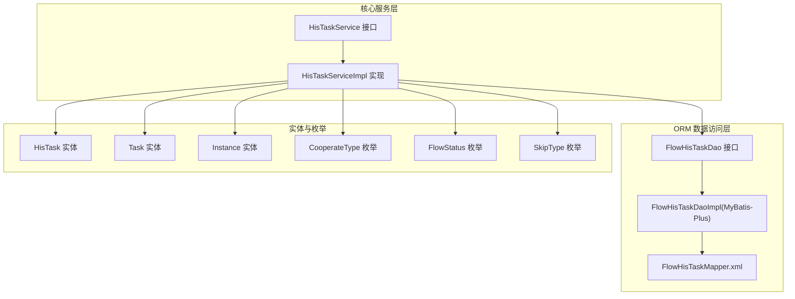
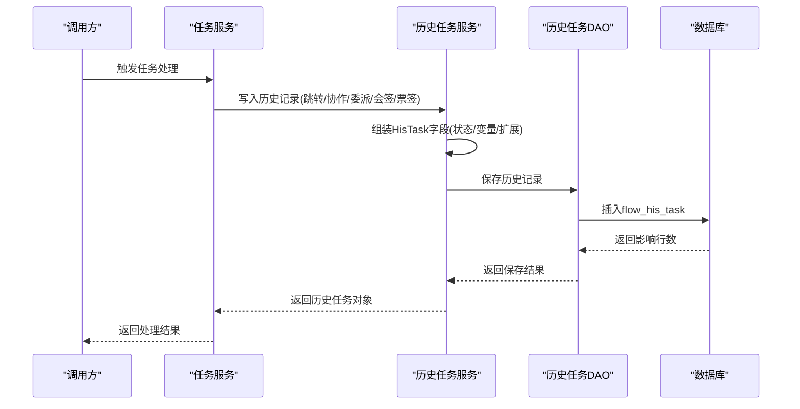
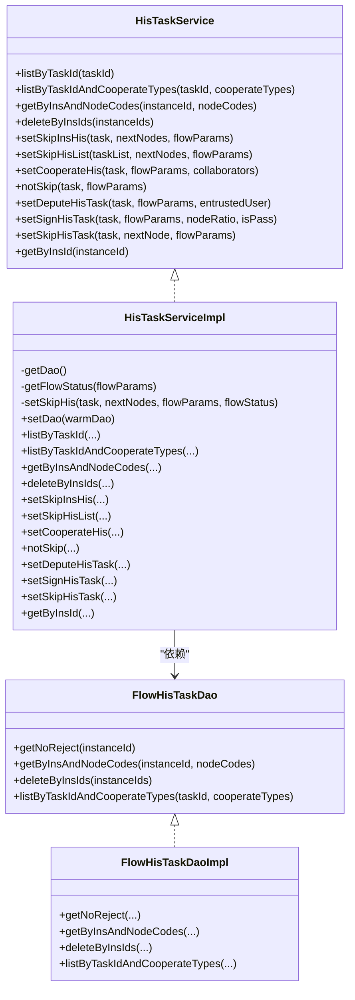
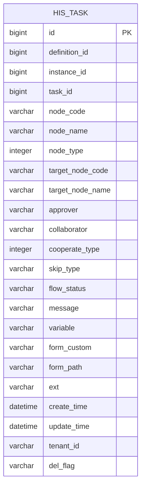
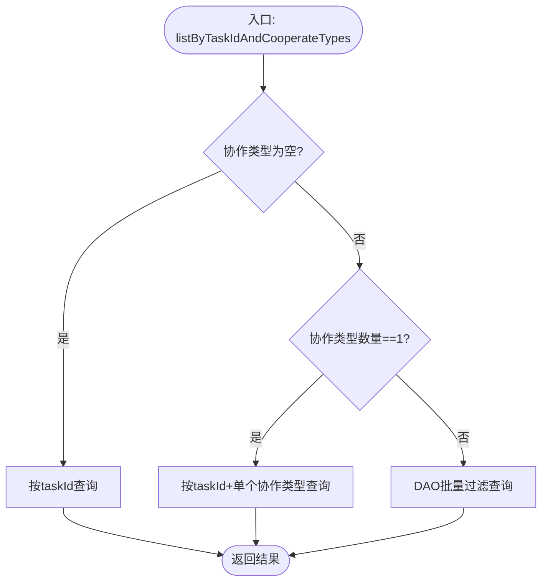
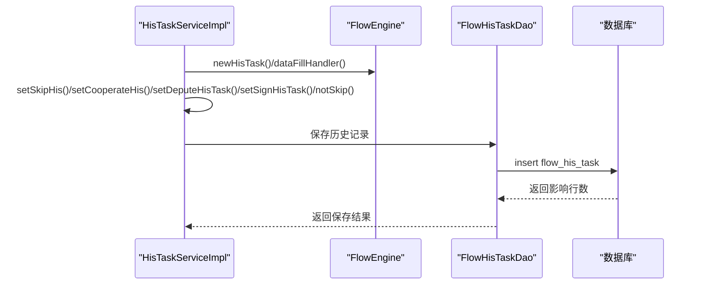
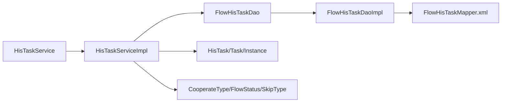

# 历史任务服务

<cite>
**本文引用的文件**
- [HisTaskService.java](file://warm-flow-core/src/main/java/org/dromara/warm/flow/core/service/HisTaskService.java)
- [HisTaskServiceImpl.java](file://warm-flow-core/src/main/java/org/dromara/warm/flow/core/service/impl/HisTaskServiceImpl.java)
- [FlowHisTaskDao.java](file://warm-flow-core/src/main/java/org/dromara/warm/flow/core/orm/dao/FlowHisTaskDao.java)
- [FlowHisTaskDaoImpl.java](file://warm-flow-orm/warm-flow-mybatis-plus/warm-flow-mybatis-plus-core/src/main/java/org/dromara/warm/flow/orm/dao/FlowHisTaskDaoImpl.java)
- [HisTask.java](file://warm-flow-core/src/main/java/org/dromara/warm/flow/core/entity/HisTask.java)
- [Task.java](file://warm-flow-core/src/main/java/org/dromara/warm/flow/core/entity/Task.java)
- [Instance.java](file://warm-flow-core/src/main/java/org/dromara/warm/flow/core/entity/Instance.java)
- [CooperateType.java](file://warm-flow-core/src/main/java/org/dromara/warm/flow/core/enums/CooperateType.java)
- [FlowStatus.java](file://warm-flow-core/src/main/java/org/dromara/warm/flow/core/enums/FlowStatus.java)
- [SkipType.java](file://warm-flow-core/src/main/java/org/dromara/warm/flow/core/enums/SkipType.java)
- [FlowHisTaskMapper.xml](file://warm-flow-orm/warm-flow-mybatis-plus/warm-flow-mybatis-plus-core/src/main/resources/warm/flow/FlowHisTaskMapper.xml)
- [warm-flow_1.2.1.sql](file://sql/mysql/v1-upgrade/warm-flow_1.2.1.sql)
</cite>

## 目录
1. [简介](#简介)
2. [项目结构](#项目结构)
3. [核心组件](#核心组件)
4. [架构总览](#架构总览)
5. [详细组件分析](#详细组件分析)
6. [依赖关系分析](#依赖关系分析)
7. [性能考量](#性能考量)
8. [故障排查指南](#故障排查指南)
9. [结论](#结论)
10. [附录](#附录)

## 简介
本技术文档围绕历史任务服务展开，系统性解析 HisTaskService 接口与 HisTaskServiceImpl 实现，覆盖历史任务的查询、统计、分析能力，并结合工作流审计与分析场景，阐述历史任务数据的存储结构、查询优化策略以及与任务服务、实例服务的关联关系。同时提供典型使用示例，帮助开发者高效利用历史数据进行流程分析与优化。

## 项目结构
历史任务服务位于核心模块与 ORM 层之间，采用“接口 + 实现 + DAO”的分层设计：
- 接口层：定义历史任务服务契约，包含查询、批量删除、协作/跳转/委派/会签/票签等历史记录写入方法。
- 实现层：基于通用服务基类，封装历史任务写入与查询逻辑，统一填充 ID、状态、变量等字段。
- DAO 层：提供按实例、节点编码、任务ID+协作类型等条件的查询与批量删除能力，支持 MyBatis/MyBatis-Plus/EasyQuery 多种实现。

图表来源
- [HisTaskService.java:33-139](file://warm-flow-core/src/main/java/org/dromara/warm/flow/core/service/HisTaskService.java#L33-L139)
- [HisTaskServiceImpl.java:41-249](file://warm-flow-core/src/main/java/org/dromara/warm/flow/core/service/impl/HisTaskServiceImpl.java#L41-L249)
- [FlowHisTaskDao.java:28-64](file://warm-flow-core/src/main/java/org/dromara/warm/flow/core/orm/dao/FlowHisTaskDao.java#L28-L64)
- [FlowHisTaskDaoImpl.java:35-77](file://warm-flow-orm/warm-flow-mybatis-plus/warm-flow-mybatis-plus-core/src/main/java/org/dromara/warm/flow/orm/dao/FlowHisTaskDaoImpl.java#L35-L77)
- [FlowHisTaskMapper.xml:1-9](file://warm-flow-orm/warm-flow-mybatis-plus/warm-flow-mybatis-plus-core/src/main/resources/warm/flow/FlowHisTaskMapper.xml#L1-L9)
- [HisTask.java:30-163](file://warm-flow-core/src/main/java/org/dromara/warm/flow/core/entity/HisTask.java#L30-L163)
- [Task.java:27-135](file://warm-flow-core/src/main/java/org/dromara/warm/flow/core/entity/Task.java#L27-L135)
- [Instance.java:29-165](file://warm-flow-core/src/main/java/org/dromara/warm/flow/core/entity/Instance.java#L29-L165)
- [CooperateType.java:39-196](file://warm-flow-core/src/main/java/org/dromara/warm/flow/core/enums/CooperateType.java#L39-L196)
- [FlowStatus.java:30-102](file://warm-flow-core/src/main/java/org/dromara/warm/flow/core/enums/FlowStatus.java#L30-L102)
- [SkipType.java:30-100](file://warm-flow-core/src/main/java/org/dromara/warm/flow/core/enums/SkipType.java#L30-L100)

章节来源
- [HisTaskService.java:33-139](file://warm-flow-core/src/main/java/org/dromara/warm/flow/core/service/HisTaskService.java#L33-L139)
- [HisTaskServiceImpl.java:41-249](file://warm-flow-core/src/main/java/org/dromara/warm/flow/core/service/impl/HisTaskServiceImpl.java#L41-L249)
- [FlowHisTaskDao.java:28-64](file://warm-flow-core/src/main/java/org/dromara/warm/flow/core/orm/dao/FlowHisTaskDao.java#L28-L64)
- [FlowHisTaskDaoImpl.java:35-77](file://warm-flow-orm/warm-flow-mybatis-plus/warm-flow-mybatis-plus-core/src/main/java/org/dromara/warm/flow/orm/dao/FlowHisTaskDaoImpl.java#L35-L77)
- [FlowHisTaskMapper.xml:1-9](file://warm-flow-orm/warm-flow-mybatis-plus/warm-flow-mybatis-plus-core/src/main/resources/warm/flow/FlowHisTaskMapper.xml#L1-L9)

## 核心组件
- 历史任务服务接口：定义历史任务查询、批量删除、协作/跳转/委派/会签/票签等历史记录写入方法，覆盖按任务ID、实例ID、节点编码、协作类型等多维查询。
- 历史任务服务实现：基于通用服务基类，统一封装历史记录写入逻辑，自动填充 ID、流程状态、变量、扩展信息等字段，并根据审批动作与协作类型推导最终状态。
- 历史任务 DAO 接口：提供按实例ID、节点编码、任务ID+协作类型等条件的查询与批量删除能力。
- 历史任务 DAO 实现：基于 MyBatis-Plus/LambdaQueryWrapper 构建查询条件，支持排序、过滤、批量删除。
- 实体与枚举：HisTask/Task/Instance 提供历史任务关键字段；CooperateType/FlowStatus/SkipType 提供协作类型、流程状态、审批动作的枚举值与判断工具。

章节来源
- [HisTaskService.java:33-139](file://warm-flow-core/src/main/java/org/dromara/warm/flow/core/service/HisTaskService.java#L33-L139)
- [HisTaskServiceImpl.java:41-249](file://warm-flow-core/src/main/java/org/dromara/warm/flow/core/service/impl/HisTaskServiceImpl.java#L41-L249)
- [FlowHisTaskDao.java:28-64](file://warm-flow-core/src/main/java/org/dromara/warm/flow/core/orm/dao/FlowHisTaskDao.java#L28-L64)
- [FlowHisTaskDaoImpl.java:35-77](file://warm-flow-orm/warm-flow-mybatis-plus/warm-flow-mybatis-plus-core/src/main/java/org/dromara/warm/flow/orm/dao/FlowHisTaskDaoImpl.java#L35-L77)
- [HisTask.java:30-163](file://warm-flow-core/src/main/java/org/dromara/warm/flow/core/entity/HisTask.java#L30-L163)
- [CooperateType.java:39-196](file://warm-flow-core/src/main/java/org/dromara/warm/flow/core/enums/CooperateType.java#L39-L196)
- [FlowStatus.java:30-102](file://warm-flow-core/src/main/java/org/dromara/warm/flow/core/enums/FlowStatus.java#L30-L102)
- [SkipType.java:30-100](file://warm-flow-core/src/main/java/org/dromara/warm/flow/core/enums/SkipType.java#L30-L100)

## 架构总览
历史任务服务在工作流引擎中的定位如下：
- 与任务服务协作：在任务执行过程中，将当前任务及后续节点信息写入历史任务表，形成完整的审计轨迹。
- 与实例服务协同：以实例ID为维度进行历史任务查询与统计，支撑流程生命周期分析。
- 与枚举体系联动：通过协作类型、流程状态、审批动作等枚举，统一历史记录的状态语义。

图表来源
- [HisTaskServiceImpl.java:75-96](file://warm-flow-core/src/main/java/org/dromara/warm/flow/core/service/impl/HisTaskServiceImpl.java#L75-L96)
- [FlowHisTaskDaoImpl.java:35-77](file://warm-flow-orm/warm-flow-mybatis-plus/warm-flow-mybatis-plus-core/src/main/java/org/dromara/warm/flow/orm/dao/FlowHisTaskDaoImpl.java#L35-L77)

## 详细组件分析

### 历史任务服务接口与实现
- 查询能力
  - 按任务ID查询历史任务列表。
  - 按任务ID与协作类型集合查询，支持空/单值/多值分支优化。
  - 按实例ID与节点编码集合查询，支持多节点过滤。
  - 按实例ID查询全部历史任务。
  - 批量删除：按实例ID集合删除历史任务。
- 写入能力
  - 跳转历史：支持单任务或多任务批量写入跳转历史。
  - 协作历史：写入协作类型、参与者、审批意见等。
  - 委派历史：写入委派人、审批意见等。
  - 会签/票签历史：根据节点比率与是否通过推导协作类型与流程状态。
  - 暂存历史：无跳转的动作，记录当前节点与状态。

图表来源
- [HisTaskService.java:33-139](file://warm-flow-core/src/main/java/org/dromara/warm/flow/core/service/HisTaskService.java#L33-L139)
- [HisTaskServiceImpl.java:41-249](file://warm-flow-core/src/main/java/org/dromara/warm/flow/core/service/impl/HisTaskServiceImpl.java#L41-L249)
- [FlowHisTaskDao.java:28-64](file://warm-flow-core/src/main/java/org/dromara/warm/flow/core/orm/dao/FlowHisTaskDao.java#L28-L64)
- [FlowHisTaskDaoImpl.java:35-77](file://warm-flow-orm/warm-flow-mybatis-plus/warm-flow-mybatis-plus-core/src/main/java/org/dromara/warm/flow/orm/dao/FlowHisTaskDaoImpl.java#L35-L77)

章节来源
- [HisTaskService.java:33-139](file://warm-flow-core/src/main/java/org/dromara/warm/flow/core/service/HisTaskService.java#L33-L139)
- [HisTaskServiceImpl.java:41-249](file://warm-flow-core/src/main/java/org/dromara/warm/flow/core/service/impl/HisTaskServiceImpl.java#L41-L249)
- [FlowHisTaskDao.java:28-64](file://warm-flow-core/src/main/java/org/dromara/warm/flow/core/orm/dao/FlowHisTaskDao.java#L28-L64)
- [FlowHisTaskDaoImpl.java:35-77](file://warm-flow-orm/warm-flow-mybatis-plus/warm-flow-mybatis-plus-core/src/main/java/org/dromara/warm/flow/orm/dao/FlowHisTaskDaoImpl.java#L35-L77)

### 历史任务数据模型与存储结构
- 关键字段
  - 定义ID、实例ID、任务ID、节点编码/名称、节点类型、目标节点编码/名称、审批人、协作人、协作类型、审批动作、流程状态、消息、变量、表单定制/路径、扩展信息、创建/更新时间等。
- 字段语义
  - 协作类型：审批、转办、委派、会签、票签、加签、减签。
  - 流程状态：待提交、审批中、审批通过、自动完成、终止、作废、撤销、取回、已完成、已退回、失效、拿回、重启、暂存。
  - 审批动作：通过、退回、无动作。
- 数据库演进
  - 历史任务表包含扩展字段用于存放业务详情对象的 JSON 字符串，便于审计与分析。

图表来源
- [HisTask.java:30-163](file://warm-flow-core/src/main/java/org/dromara/warm/flow/core/entity/HisTask.java#L30-L163)
- [warm-flow_1.2.1.sql:1-5](file://sql/mysql/v1-upgrade/warm-flow_1.2.1.sql#L1-L5)

章节来源
- [HisTask.java:30-163](file://warm-flow-core/src/main/java/org/dromara/warm/flow/core/entity/HisTask.java#L30-L163)
- [warm-flow_1.2.1.sql:1-5](file://sql/mysql/v1-upgrade/warm-flow_1.2.1.sql#L1-L5)

### 查询与统计流程
- 协作类型过滤优化
  - 当传入协作类型为空时，直接复用按任务ID查询。
  - 当仅有一个协作类型时，走单条件查询。
  - 当有多个协作类型时，走 DAO 提供的批量过滤查询，避免多次往返数据库。
- 按实例与节点编码查询
  - 支持多节点编码过滤，按创建时间倒序，便于快速定位最新历史。
- 批量删除
  - 通过实例ID集合一次性删除，减少网络往返与事务开销。

图表来源
- [HisTaskServiceImpl.java:54-63](file://warm-flow-core/src/main/java/org/dromara/warm/flow/core/service/impl/HisTaskServiceImpl.java#L54-L63)
- [FlowHisTaskDaoImpl.java:70-75](file://warm-flow-orm/warm-flow-mybatis-plus/warm-flow-mybatis-plus-core/src/main/java/org/dromara/warm/flow/orm/dao/FlowHisTaskDaoImpl.java#L70-L75)

章节来源
- [HisTaskServiceImpl.java:54-63](file://warm-flow-core/src/main/java/org/dromara/warm/flow/core/service/impl/HisTaskServiceImpl.java#L54-L63)
- [FlowHisTaskDaoImpl.java:70-75](file://warm-flow-orm/warm-flow-mybatis-plus/warm-flow-mybatis-plus-core/src/main/java/org/dromara/warm/flow/orm/dao/FlowHisTaskDaoImpl.java#L70-L75)

### 历史任务写入流程
- 跳转历史
  - 组装目标节点编码/名称、协作类型、流程状态、审批动作等字段，统一由工具方法填充 ID。
- 协作历史
  - 记录协作类型、参与者、审批意见、流程状态等。
- 委派历史
  - 记录委派人、审批动作、流程状态（依据退回/通过推断）。
- 会签/票签历史
  - 根据节点比率与是否通过推断协作类型与流程状态。
- 暂存历史
  - 记录当前节点与“无动作”审批动作。

图表来源
- [HisTaskServiceImpl.java:75-244](file://warm-flow-core/src/main/java/org/dromara/warm/flow/core/service/impl/HisTaskServiceImpl.java#L75-L244)
- [FlowHisTaskDaoImpl.java:35-77](file://warm-flow-orm/warm-flow-mybatis-plus/warm-flow-mybatis-plus-core/src/main/java/org/dromara/warm/flow/orm/dao/FlowHisTaskDaoImpl.java#L35-L77)

章节来源
- [HisTaskServiceImpl.java:75-244](file://warm-flow-core/src/main/java/org/dromara/warm/flow/core/service/impl/HisTaskServiceImpl.java#L75-L244)
- [FlowHisTaskDaoImpl.java:35-77](file://warm-flow-orm/warm-flow-mybatis-plus/warm-flow-mybatis-plus-core/src/main/java/org/dromara/warm/flow/orm/dao/FlowHisTaskDaoImpl.java#L35-L77)

### 历史任务分类统计与分析
- 任务完成情况
  - 通过流程状态与审批动作统计“通过/退回/完成”等指标，结合实例维度进行聚合。
- 处理时长分析
  - 使用创建时间与更新时间差计算每个历史任务的处理时长，按流程、节点、人员等维度分组统计。
- 人员绩效统计
  - 统计审批人处理任务数量、平均时长、通过率等，辅助绩效评估与资源调度。
- 节点效率分析
  - 分析各节点的平均处理时长、退回率、会签/票签通过率等，识别瓶颈环节。

说明：以上为概念性分析，具体实现需结合业务需求在历史任务数据基础上进行聚合与报表展示。

## 依赖关系分析
- 接口与实现
  - HisTaskService 是对外服务接口，HisTaskServiceImpl 实现其所有方法。
- DAO 与实现
  - FlowHisTaskDao 定义查询契约，FlowHisTaskDaoImpl 提供 MyBatis-Plus 实现。
- 实体与枚举
  - HisTask/Task/Instance 提供字段与默认解析方法；CooperateType/FlowStatus/SkipType 提供状态语义与判断工具。
- 配置与映射
  - FlowHisTaskMapper.xml 作为命名空间占位，实际查询由实现类通过 LambdaQueryWrapper 构建。

图表来源
- [HisTaskService.java:33-139](file://warm-flow-core/src/main/java/org/dromara/warm/flow/core/service/HisTaskService.java#L33-L139)
- [HisTaskServiceImpl.java:41-249](file://warm-flow-core/src/main/java/org/dromara/warm/flow/core/service/impl/HisTaskServiceImpl.java#L41-L249)
- [FlowHisTaskDao.java:28-64](file://warm-flow-core/src/main/java/org/dromara/warm/flow/core/orm/dao/FlowHisTaskDao.java#L28-L64)
- [FlowHisTaskDaoImpl.java:35-77](file://warm-flow-orm/warm-flow-mybatis-plus/warm-flow-mybatis-plus-core/src/main/java/org/dromara/warm/flow/orm/dao/FlowHisTaskDaoImpl.java#L35-L77)
- [FlowHisTaskMapper.xml:1-9](file://warm-flow-orm/warm-flow-mybatis-plus/warm-flow-mybatis-plus-core/src/main/resources/warm/flow/FlowHisTaskMapper.xml#L1-L9)

章节来源
- [HisTaskService.java:33-139](file://warm-flow-core/src/main/java/org/dromara/warm/flow/core/service/HisTaskService.java#L33-L139)
- [HisTaskServiceImpl.java:41-249](file://warm-flow-core/src/main/java/org/dromara/warm/flow/core/service/impl/HisTaskServiceImpl.java#L41-L249)
- [FlowHisTaskDao.java:28-64](file://warm-flow-core/src/main/java/org/dromara/warm/flow/core/orm/dao/FlowHisTaskDao.java#L28-L64)
- [FlowHisTaskDaoImpl.java:35-77](file://warm-flow-orm/warm-flow-mybatis-plus/warm-flow-mybatis-plus-core/src/main/java/org/dromara/warm/flow/orm/dao/FlowHisTaskDaoImpl.java#L35-L77)
- [FlowHisTaskMapper.xml:1-9](file://warm-flow-orm/warm-flow-mybatis-plus/warm-flow-mybatis-plus-core/src/main/resources/warm/flow/FlowHisTaskMapper.xml#L1-L9)

## 性能考量
- 查询优化
  - 协作类型多值过滤优先走 DAO 批量过滤，减少多次查询。
  - 按实例+节点编码查询时，建议在节点编码列建立索引以提升过滤效率。
  - 按创建时间倒序排序，配合分页可降低大结果集扫描成本。
- 写入优化
  - 统一使用批量插入/更新策略，避免逐条写入。
  - 合理设置变量与扩展字段大小，避免过长文本导致存储与传输开销。
- 存储演进
  - 历史任务表新增扩展字段用于存放业务详情对象 JSON，便于审计但需注意 JSON 字段的检索与索引策略。

章节来源
- [HisTaskServiceImpl.java:54-63](file://warm-flow-core/src/main/java/org/dromara/warm/flow/core/service/impl/HisTaskServiceImpl.java#L54-L63)
- [FlowHisTaskDaoImpl.java:56-75](file://warm-flow-orm/warm-flow-mybatis-plus/warm-flow-mybatis-plus-core/src/main/java/org/dromara/warm/flow/orm/dao/FlowHisTaskDaoImpl.java#L56-L75)
- [warm-flow_1.2.1.sql:1-5](file://sql/mysql/v1-upgrade/warm-flow_1.2.1.sql#L1-L5)

## 故障排查指南
- 查询异常
  - 若按任务ID+协作类型查询为空，检查协作类型是否正确传入，确认 DAO 批量过滤逻辑是否生效。
  - 若按实例+节点编码查询结果异常，检查节点编码是否匹配，确认排序与过滤条件。
- 写入异常
  - 若历史记录缺失关键字段，检查 FlowEngine 的 ID 填充与默认状态推导逻辑。
  - 若流程状态与预期不符，核对审批动作与协作类型的映射规则。
- 删除异常
  - 批量删除失败时，检查实例ID集合是否为空或重复，确认数据库权限与事务配置。

章节来源
- [HisTaskServiceImpl.java:75-244](file://warm-flow-core/src/main/java/org/dromara/warm/flow/core/service/impl/HisTaskServiceImpl.java#L75-L244)
- [FlowHisTaskDaoImpl.java:65-75](file://warm-flow-orm/warm-flow-mybatis-plus/warm-flow-mybatis-plus-core/src/main/java/org/dromara/warm/flow/orm/dao/FlowHisTaskDaoImpl.java#L65-L75)

## 结论
历史任务服务通过清晰的接口设计与高效的实现，为工作流审计与分析提供了坚实的数据基础。借助协作类型、流程状态、审批动作等枚举体系，系统能够准确记录与还原流程执行轨迹。结合查询优化与存储演进，开发者可基于历史数据开展任务完成情况、处理时长、人员绩效与节点效率等多维度分析，持续优化流程设计与资源配置。

## 附录
- 使用示例（操作步骤）
  - 查询某流程的历史任务
    - 步骤：通过实例ID查询全部历史任务，或按节点编码集合过滤。
    - 参考路径：[HisTaskService.getByInsId:137-137](file://warm-flow-core/src/main/java/org/dromara/warm/flow/core/service/HisTaskService.java#L137-L137)，[HisTaskServiceImpl.getByInsId:215-217](file://warm-flow-core/src/main/java/org/dromara/warm/flow/core/service/impl/HisTaskServiceImpl.java#L215-L217)
  - 统计任务处理时间
    - 步骤：基于历史任务的创建时间与更新时间差计算处理时长，按流程/节点/人员分组统计。
    - 参考路径：[HisTask.getCreateTime:38-42](file://warm-flow-core/src/main/java/org/dromara/warm/flow/core/entity/HisTask.java#L38-L42)，[HisTask.getUpdateTime:44-48](file://warm-flow-core/src/main/java/org/dromara/warm/flow/core/entity/HisTask.java#L44-L48)
  - 分析人员工作量
    - 步骤：统计审批人处理的任务数量、平均时长、通过率等指标。
    - 参考路径：[HisTask.getApprover:114-116](file://warm-flow-core/src/main/java/org/dromara/warm/flow/core/entity/HisTask.java#L114-L116)，[FlowStatus:30-102](file://warm-flow-core/src/main/java/org/dromara/warm/flow/core/enums/FlowStatus.java#L30-L102)，[SkipType:30-100](file://warm-flow-core/src/main/java/org/dromara/warm/flow/core/enums/SkipType.java#L30-L100)
- 与任务服务、实例服务的关联
  - 任务服务在任务处理后调用历史任务服务写入历史记录，确保审计完整性。
  - 实例服务通过实例ID驱动历史任务查询与统计，支撑流程全生命周期分析。
  - 参考路径：[Task 接口:27-135](file://warm-flow-core/src/main/java/org/dromara/warm/flow/core/entity/Task.java#L27-L135)，[Instance 接口:29-165](file://warm-flow-core/src/main/java/org/dromara/warm/flow/core/entity/Instance.java#L29-L165)