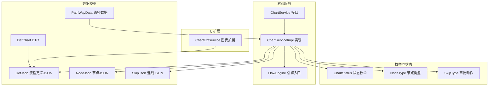
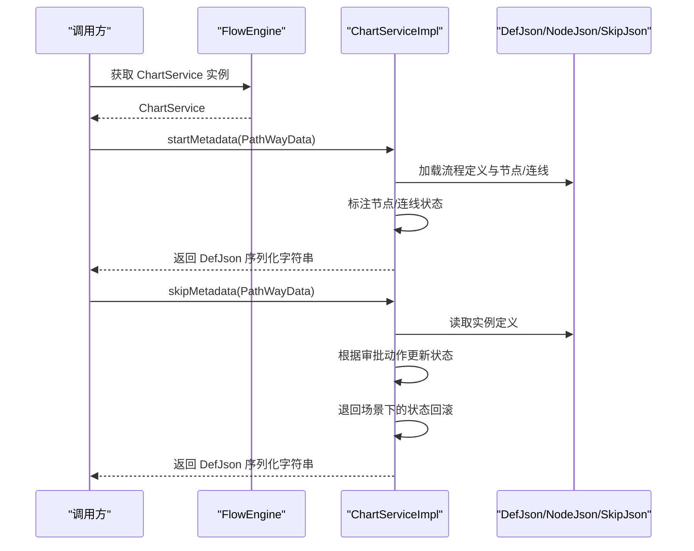
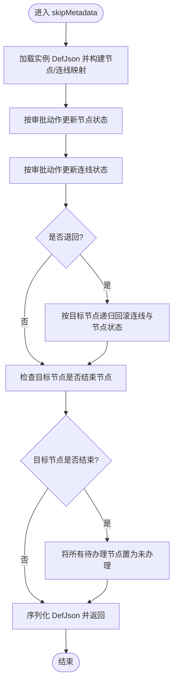
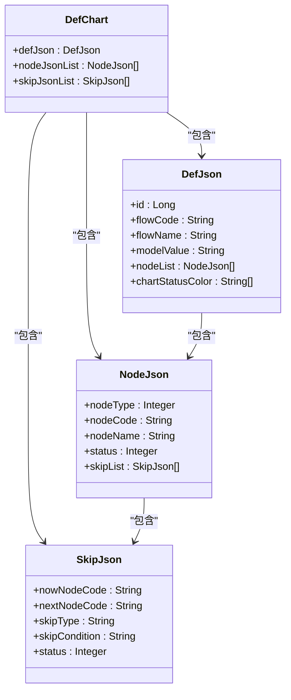
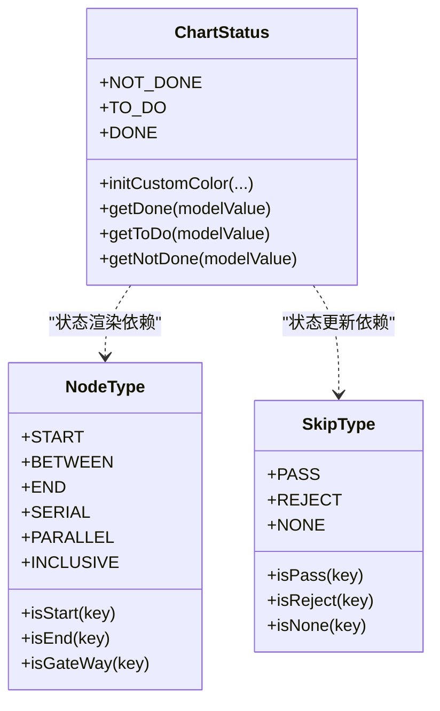
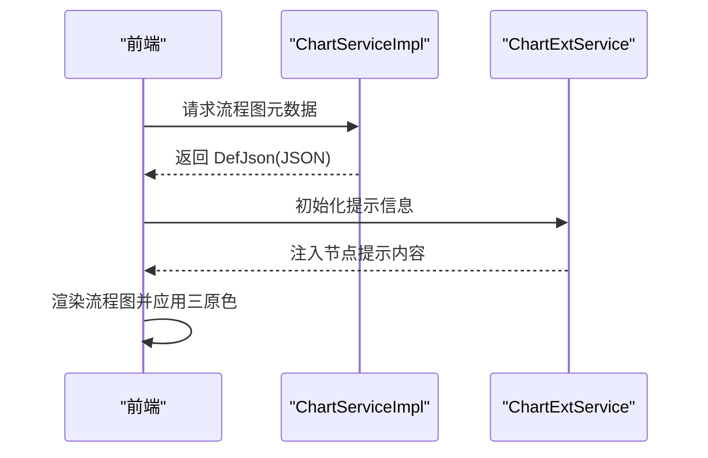
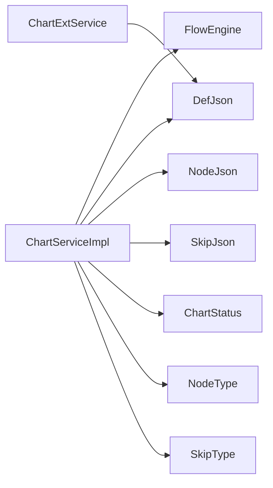

# 图表服务

<cite>
**本文引用的文件**
- [ChartService.java](file://warm-flow-core/src/main/java/org/dromara/warm/flow/core/service/ChartService.java)
- [ChartServiceImpl.java](file://warm-flow-core/src/main/java/org/dromara/warm/flow/core/service/impl/ChartServiceImpl.java)
- [DefChart.java](file://warm-flow-core/src/main/java/org/dromara/warm/flow/core/dto/DefChart.java)
- [PathWayData.java](file://warm-flow-core/src/main/java/org/dromara/warm/flow/core/dto/PathWayData.java)
- [DefJson.java](file://warm-flow-core/src/main/java/org/dromara/warm/flow/core/dto/DefJson.java)
- [NodeJson.java](file://warm-flow-core/src/main/java/org/dromara/warm/flow/core/dto/NodeJson.java)
- [SkipJson.java](file://warm-flow-core/src/main/java/org/dromara/warm/flow/core/dto/SkipJson.java)
- [ChartStatus.java](file://warm-flow-core/src/main/java/org/dromara/warm/flow/core/enums/ChartStatus.java)
- [NodeType.java](file://warm-flow-core/src/main/java/org/dromara/warm/flow/core/enums/NodeType.java)
- [SkipType.java](file://warm-flow-core/src/main/java/org/dromara/warm/flow/core/enums/SkipType.java)
- [FlowEngine.java](file://warm-flow-core/src/main/java/org/dromara/warm/flow/core/FlowEngine.java)
- [ChartExtService.java](file://warm-flow-plugin/warm-flow-plugin-ui/warm-flow-plugin-ui-core/src/main/java/org/dromara/warm/flow/ui/service/ChartExtService.java)
</cite>

## 目录
1. [简介](#简介)
2. [项目结构](#项目结构)
3. [核心组件](#核心组件)
4. [架构总览](#架构总览)
5. [详细组件分析](#详细组件分析)
6. [依赖分析](#依赖分析)
7. [性能考虑](#性能考虑)
8. [故障排查指南](#故障排查指南)
9. [结论](#结论)
10. [附录](#附录)

## 简介
本技术文档围绕图表服务展开，系统性解析 ChartService 接口与 ChartServiceImpl 的实现，重点阐述以下能力：
- 流程图元数据生成：在流程启动与运行时，基于路径数据动态标注节点与连线的状态。
- 图表统计信息：通过状态枚举与颜色映射，支持不同模型下的三原色配置，用于前端可视化渲染。
- 流程可视化数据处理：将流程定义、节点、连线等结构化数据转换为前端可消费的 JSON 格式，并按审批动作（通过/退回）更新状态。
- 工作流监控与统计分析：结合路径数据与状态枚举，为流程执行统计、任务完成率分析、流程效率评估等场景提供数据基础。

图表服务在工作流系统中承担“状态驱动的可视化”的关键角色，既服务于设计器的流程图渲染，也服务于运行期的流程监控与审计。

## 项目结构
图表服务位于核心模块中，主要涉及服务接口、实现类、DTO 数据模型、枚举与流程引擎集成点；同时配合 UI 插件中的图表扩展服务，完成提示信息与样式初始化。

**图表来源**
- [ChartService.java:28-53](file://warm-flow-core/src/main/java/org/dromara/warm/flow/core/service/ChartService.java#L28-L53)
- [ChartServiceImpl.java:46-167](file://warm-flow-core/src/main/java/org/dromara/warm/flow/core/service/impl/ChartServiceImpl.java#L46-L167)
- [DefChart.java:34-50](file://warm-flow-core/src/main/java/org/dromara/warm/flow/core/dto/DefChart.java#L34-L50)
- [PathWayData.java:38-69](file://warm-flow-core/src/main/java/org/dromara/warm/flow/core/dto/PathWayData.java#L38-L69)
- [DefJson.java:44-292](file://warm-flow-core/src/main/java/org/dromara/warm/flow/core/dto/DefJson.java#L44-L292)
- [NodeJson.java:38-126](file://warm-flow-core/src/main/java/org/dromara/warm/flow/core/dto/NodeJson.java#L38-L126)
- [SkipJson.java:34-86](file://warm-flow-core/src/main/java/org/dromara/warm/flow/core/dto/SkipJson.java#L34-L86)
- [ChartStatus.java:37-155](file://warm-flow-core/src/main/java/org/dromara/warm/flow/core/enums/ChartStatus.java#L37-L155)
- [NodeType.java:30-161](file://warm-flow-core/src/main/java/org/dromara/warm/flow/core/enums/NodeType.java#L30-L161)
- [SkipType.java:30-101](file://warm-flow-core/src/main/java/org/dromara/warm/flow/core/enums/SkipType.java#L30-L101)
- [FlowEngine.java:39-200](file://warm-flow-core/src/main/java/org/dromara/warm/flow/core/FlowEngine.java#L39-L200)
- [ChartExtService.java:31-94](file://warm-flow-plugin/warm-flow-plugin-ui/warm-flow-plugin-ui-core/src/main/java/org/dromara/warm/flow/ui/service/ChartExtService.java#L31-L94)

**章节来源**
- [ChartService.java:28-53](file://warm-flow-core/src/main/java/org/dromara/warm/flow/core/service/ChartService.java#L28-L53)
- [ChartServiceImpl.java:46-167](file://warm-flow-core/src/main/java/org/dromara/warm/flow/core/service/impl/ChartServiceImpl.java#L46-L167)
- [DefChart.java:34-50](file://warm-flow-core/src/main/java/org/dromara/warm/flow/core/dto/DefChart.java#L34-L50)
- [PathWayData.java:38-69](file://warm-flow-core/src/main/java/org/dromara/warm/flow/core/dto/PathWayData.java#L38-L69)
- [DefJson.java:44-292](file://warm-flow-core/src/main/java/org/dromara/warm/flow/core/dto/DefJson.java#L44-L292)
- [NodeJson.java:38-126](file://warm-flow-core/src/main/java/org/dromara/warm/flow/core/dto/NodeJson.java#L38-L126)
- [SkipJson.java:34-86](file://warm-flow-core/src/main/java/org/dromara/warm/flow/core/dto/SkipJson.java#L34-L86)
- [ChartStatus.java:37-155](file://warm-flow-core/src/main/java/org/dromara/warm/flow/core/enums/ChartStatus.java#L37-L155)
- [NodeType.java:30-161](file://warm-flow-core/src/main/java/org/dromara/warm/flow/core/enums/NodeType.java#L30-L161)
- [SkipType.java:30-101](file://warm-flow-core/src/main/java/org/dromara/warm/flow/core/enums/SkipType.java#L30-L101)
- [FlowEngine.java:39-200](file://warm-flow-core/src/main/java/org/dromara/warm/flow/core/FlowEngine.java#L39-L200)
- [ChartExtService.java:31-94](file://warm-flow-plugin/warm-flow-plugin-ui/warm-flow-plugin-ui-core/src/main/java/org/dromara/warm/flow/ui/service/ChartExtService.java#L31-L94)

## 核心组件
- ChartService 接口：定义两类元数据生成方法与三原色获取方法，分别用于流程启动时与运行时的可视化数据准备。
- ChartServiceImpl 实现：根据 PathWayData 与当前审批动作，对 DefJson 中的节点与连线状态进行标注，并在退回场景下进行状态回滚与重置。
- DTO 与数据模型：DefJson、NodeJson、SkipJson、DefChart、PathWayData 组成流程图可视化的数据骨架；其中 DefChart 将流程定义、节点列表、连线列表聚合为统一的数据集合。
- 枚举与状态：ChartStatus 提供三态（未办理/待办理/已办理）及颜色映射；NodeType 识别节点类型（开始/结束/网关等）；SkipType 表征审批动作（通过/退回/无动作）。
- FlowEngine 集成：通过 FlowEngine.chartService() 获取图表服务实例，贯穿于流程引擎调用链。

**章节来源**
- [ChartService.java:28-53](file://warm-flow-core/src/main/java/org/dromara/warm/flow/core/service/ChartService.java#L28-L53)
- [ChartServiceImpl.java:46-167](file://warm-flow-core/src/main/java/org/dromara/warm/flow/core/service/impl/ChartServiceImpl.java#L46-L167)
- [DefChart.java:34-50](file://warm-flow-core/src/main/java/org/dromara/warm/flow/core/dto/DefChart.java#L34-L50)
- [PathWayData.java:38-69](file://warm-flow-core/src/main/java/org/dromara/warm/flow/core/dto/PathWayData.java#L38-L69)
- [DefJson.java:44-292](file://warm-flow-core/src/main/java/org/dromara/warm/flow/core/dto/DefJson.java#L44-L292)
- [NodeJson.java:38-126](file://warm-flow-core/src/main/java/org/dromara/warm/flow/core/dto/NodeJson.java#L38-L126)
- [SkipJson.java:34-86](file://warm-flow-core/src/main/java/org/dromara/warm/flow/core/dto/SkipJson.java#L34-L86)
- [ChartStatus.java:37-155](file://warm-flow-core/src/main/java/org/dromara/warm/flow/core/enums/ChartStatus.java#L37-L155)
- [NodeType.java:30-161](file://warm-flow-core/src/main/java/org/dromara/warm/flow/core/enums/NodeType.java#L30-L161)
- [SkipType.java:30-101](file://warm-flow-core/src/main/java/org/dromara/warm/flow/core/enums/SkipType.java#L30-L101)
- [FlowEngine.java:39-200](file://warm-flow-core/src/main/java/org/dromara/warm/flow/core/FlowEngine.java#L39-L200)

## 架构总览
图表服务在流程引擎中作为“状态驱动的可视化”模块，其核心交互如下：
- 输入：PathWayData（包含流程定义/实例 ID、审批动作、目标节点、途径节点与连线）。
- 处理：ChartServiceImpl 基于当前动作与节点/连线集合，更新 DefJson 的状态字段。
- 输出：返回序列化后的 DefJson 字符串，供前端渲染或持久化存储。

**图表来源**
- [ChartServiceImpl.java:48-121](file://warm-flow-core/src/main/java/org/dromara/warm/flow/core/service/impl/ChartServiceImpl.java#L48-L121)
- [FlowEngine.java:104-106](file://warm-flow-core/src/main/java/org/dromara/warm/flow/core/FlowEngine.java#L104-L106)

**章节来源**
- [ChartServiceImpl.java:48-121](file://warm-flow-core/src/main/java/org/dromara/warm/flow/core/service/impl/ChartServiceImpl.java#L48-L121)
- [FlowEngine.java:104-106](file://warm-flow-core/src/main/java/org/dromara/warm/flow/core/FlowEngine.java#L104-L106)

## 详细组件分析

### ChartService 接口与职责
- startMetadata：用于流程启动时，基于路径数据标注初始状态（未办理/待办理/已办理），并返回可渲染的 DefJson。
- skipMetadata：用于流程运行时，依据审批动作（通过/退回）更新节点与连线状态，并在退回场景下进行状态回滚。
- getChartRgb：根据模型值（如经典/仿钉钉）返回三原色配置，供前端渲染使用。

**章节来源**
- [ChartService.java:28-53](file://warm-flow-core/src/main/java/org/dromara/warm/flow/core/service/ChartService.java#L28-L53)

### ChartServiceImpl 实现细节
- 启动元数据生成（startMetadata）
  - 从流程定义服务加载 DefJson，构建节点与连线的映射。
  - 将途径节点与连线标记为“已办理”，目标节点按是否结束节点决定“已办理/待办理”。
  - 最终将 DefJson 转换为字符串返回。
- 运行时元数据生成（skipMetadata）
  - 从实例服务加载实例定义（DefJson），构建节点与连线的映射。
  - 根据审批动作更新节点与连线状态；退回时，递归回滚后续连线与节点状态。
  - 若目标节点为结束节点，则将所有“待办理”节点重置为“未办理”，确保流程图一致性。
- 三原色获取（getChartRgb）
  - 依据模型值选择对应的颜色映射，返回三原色的 RGB 字符串数组。

**图表来源**
- [ChartServiceImpl.java:68-121](file://warm-flow-core/src/main/java/org/dromara/warm/flow/core/service/impl/ChartServiceImpl.java#L68-L121)

**章节来源**
- [ChartServiceImpl.java:48-167](file://warm-flow-core/src/main/java/org/dromara/warm/flow/core/service/impl/ChartServiceImpl.java#L48-L167)

### 数据模型与结构
- DefChart：聚合流程定义、节点列表、连线列表，便于一次性传输与处理。
- PathWayData：承载流程上下文（定义/实例 ID、审批动作、目标节点、途径节点与连线），是状态标注的主要输入。
- DefJson/NodeJson/SkipJson：流程定义与可视化元素的 JSON 表达，包含坐标、监听器、表单、提示信息等扩展字段。
- ChartStatus/NodeType/SkipType：状态与类型枚举，提供颜色映射与判断逻辑。

**图表来源**
- [DefChart.java:34-50](file://warm-flow-core/src/main/java/org/dromara/warm/flow/core/dto/DefChart.java#L34-L50)
- [DefJson.java:44-292](file://warm-flow-core/src/main/java/org/dromara/warm/flow/core/dto/DefJson.java#L44-L292)
- [NodeJson.java:38-126](file://warm-flow-core/src/main/java/org/dromara/warm/flow/core/dto/NodeJson.java#L38-L126)
- [SkipJson.java:34-86](file://warm-flow-core/src/main/java/org/dromara/warm/flow/core/dto/SkipJson.java#L34-L86)

**章节来源**
- [DefChart.java:34-50](file://warm-flow-core/src/main/java/org/dromara/warm/flow/core/dto/DefChart.java#L34-L50)
- [PathWayData.java:38-69](file://warm-flow-core/src/main/java/org/dromara/warm/flow/core/dto/PathWayData.java#L38-L69)
- [DefJson.java:44-292](file://warm-flow-core/src/main/java/org/dromara/warm/flow/core/dto/DefJson.java#L44-L292)
- [NodeJson.java:38-126](file://warm-flow-core/src/main/java/org/dromara/warm/flow/core/dto/NodeJson.java#L38-L126)
- [SkipJson.java:34-86](file://warm-flow-core/src/main/java/org/dromara/warm/flow/core/dto/SkipJson.java#L34-L86)

### 状态与颜色体系
- ChartStatus：定义三态与默认颜色，支持按模型值（经典/仿钉钉）覆盖颜色。
- NodeType：区分开始/中间/结束/网关等节点类型，影响状态标注策略。
- SkipType：区分通过/退回/无动作，决定状态更新与回滚逻辑。

**图表来源**
- [ChartStatus.java:37-155](file://warm-flow-core/src/main/java/org/dromara/warm/flow/core/enums/ChartStatus.java#L37-L155)
- [NodeType.java:30-161](file://warm-flow-core/src/main/java/org/dromara/warm/flow/core/enums/NodeType.java#L30-L161)
- [SkipType.java:30-101](file://warm-flow-core/src/main/java/org/dromara/warm/flow/core/enums/SkipType.java#L30-L101)

**章节来源**
- [ChartStatus.java:37-155](file://warm-flow-core/src/main/java/org/dromara/warm/flow/core/enums/ChartStatus.java#L37-L155)
- [NodeType.java:30-161](file://warm-flow-core/src/main/java/org/dromara/warm/flow/core/enums/NodeType.java#L30-L161)
- [SkipType.java:30-101](file://warm-flow-core/src/main/java/org/dromara/warm/flow/core/enums/SkipType.java#L30-L101)

### 与 UI 插件的协作
- ChartExtService：负责为 DefJson 初始化提示信息（如对话框样式、任务名称等），并与节点 JSON 的提示内容结构配合，提升流程图的可读性与交互体验。
- 前端渲染：前端从后端获取 DefJson（含 chartStatusColor），据此设置节点颜色；当目标节点为结束节点时，将“待办理”节点重置为“未办理”，保证流程图状态一致。

**图表来源**
- [ChartServiceImpl.java:123-133](file://warm-flow-core/src/main/java/org/dromara/warm/flow/core/service/impl/ChartServiceImpl.java#L123-L133)
- [ChartExtService.java:31-94](file://warm-flow-plugin/warm-flow-plugin-ui/warm-flow-plugin-ui-core/src/main/java/org/dromara/warm/flow/ui/service/ChartExtService.java#L31-L94)

**章节来源**
- [ChartExtService.java:31-94](file://warm-flow-plugin/warm-flow-plugin-ui/warm-flow-plugin-ui-core/src/main/java/org/dromara/warm/flow/ui/service/ChartExtService.java#L31-L94)
- [ChartServiceImpl.java:123-133](file://warm-flow-core/src/main/java/org/dromara/warm/flow/core/service/impl/ChartServiceImpl.java#L123-L133)

## 依赖分析
- ChartServiceImpl 对以下模块存在直接依赖：
  - FlowEngine：获取 defService、insService、jsonConvert 等服务与工具。
  - DefJson/NodeJson/SkipJson：作为状态标注与序列化的数据载体。
  - ChartStatus/NodeType/SkipType：作为状态与类型判断的依据。
- UI 插件 ChartExtService 与 DefJson 的提示信息结构协同，增强前端渲染效果。
- 低耦合高内聚：ChartServiceImpl 仅依赖接口与数据模型，不直接依赖具体持久化实现，便于替换与扩展。

**图表来源**
- [ChartServiceImpl.java:18-38](file://warm-flow-core/src/main/java/org/dromara/warm/flow/core/service/impl/ChartServiceImpl.java#L18-L38)
- [FlowEngine.java:72-106](file://warm-flow-core/src/main/java/org/dromara/warm/flow/core/FlowEngine.java#L72-L106)
- [ChartExtService.java:18-21](file://warm-flow-plugin/warm-flow-plugin-ui/warm-flow-plugin-ui-core/src/main/java/org/dromara/warm/flow/ui/service/ChartExtService.java#L18-L21)

**章节来源**
- [ChartServiceImpl.java:18-38](file://warm-flow-core/src/main/java/org/dromara/warm/flow/core/service/impl/ChartServiceImpl.java#L18-L38)
- [FlowEngine.java:72-106](file://warm-flow-core/src/main/java/org/dromara/warm/flow/core/FlowEngine.java#L72-L106)
- [ChartExtService.java:18-21](file://warm-flow-plugin/warm-flow-plugin-ui/warm-flow-plugin-ui-core/src/main/java/org/dromara/warm/flow/ui/service/ChartExtService.java#L18-L21)

## 性能考虑
- 时间复杂度：状态标注过程涉及节点与连线的映射与遍历，整体复杂度近似 O(N+E)，N 为节点数，E 为连线数；退回场景下的回滚采用递归，最坏情况下可能达到 O(E)。
- 空间复杂度：构建映射表与分组结构，空间开销与节点与连线数量线性相关。
- 优化建议：
  - 在高频调用场景下，缓存 DefJson 的映射结构（节点/连线键到对象的映射）可减少重复构建成本。
  - 对退回回滚逻辑进行尾递归优化或迭代改写，避免深层递归导致的栈溢出风险。
  - 对大流程图进行分页渲染或懒加载，降低前端一次性渲染压力。

[本节为通用性能讨论，不直接分析具体文件，故无“章节来源”]

## 故障排查指南
- 状态标注异常
  - 现象：节点或连线状态未按预期更新。
  - 排查：确认 PathWayData 中的 defId/insId/skipType/targetNodes/pathWayNodes/pathWaySkips 是否完整；检查节点/连线键拼接规则是否一致。
- 退回后状态未回滚
  - 现象：退回后下游节点仍保持“已办理”。
  - 排查：核对 getSkipKey 的键拼接顺序与内容；确认 rejectReset 的递归终止条件与映射过滤逻辑。
- 颜色不生效
  - 现象：前端节点颜色与期望不符。
  - 排查：确认 chartStatusColor 的长度与格式（RGB 逗号分隔）；检查模型值（CLASSICS/MIMIC）是否正确传递至 getChartRgb。
- 提示信息缺失
  - 现象：流程图节点缺少提示信息。
  - 排查：确认 ChartExtService.initPromptContent 是否被调用；检查节点 JSON 的 promptContent 字段是否注入成功。

**章节来源**
- [ChartServiceImpl.java:135-165](file://warm-flow-core/src/main/java/org/dromara/warm/flow/core/service/impl/ChartServiceImpl.java#L135-L165)
- [ChartStatus.java:55-90](file://warm-flow-core/src/main/java/org/dromara/warm/flow/core/enums/ChartStatus.java#L55-L90)
- [ChartExtService.java:46-92](file://warm-flow-plugin/warm-flow-plugin-ui/warm-flow-plugin-ui-core/src/main/java/org/dromara/warm/flow/ui/service/ChartExtService.java#L46-L92)

## 结论
图表服务通过状态驱动的方式，将流程定义与运行时路径数据转化为可渲染的可视化数据，支撑流程监控与统计分析。其设计强调：
- 明确的接口边界（ChartService）与清晰的实现（ChartServiceImpl）。
- 以 DTO 为核心的轻量数据模型，便于前后端协作与扩展。
- 以枚举与颜色映射为基础的可视化规范，保障跨模型的一致性。
- 与 UI 插件的协同，进一步完善提示信息与交互体验。

在实际应用中，建议结合业务场景对状态标注与颜色策略进行定制，并关注大流程图的性能优化与稳定性保障。

[本节为总结性内容，不直接分析具体文件，故无“章节来源”]

## 附录

### 使用示例与最佳实践
- 流程执行统计
  - 场景：统计某流程在一段时间内的发起次数、通过率、平均时长等。
  - 方案：结合实例服务与历史任务服务，按流程编码与时间范围聚合数据；图表服务用于渲染流程图以辅助定位瓶颈节点。
- 任务完成率分析
  - 场景：分析各节点的任务完成率与耗时分布。
  - 方案：基于节点状态与时间戳计算完成率；通过节点提示信息展示任务详情。
- 流程效率评估
  - 场景：评估流程整体效率与关键路径。
  - 方案：结合连线状态与网关类型，识别瓶颈与冗余路径；通过三原色直观呈现当前状态。

[本节为概念性说明，不直接分析具体文件，故无“章节来源”]