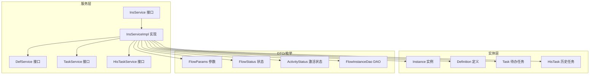
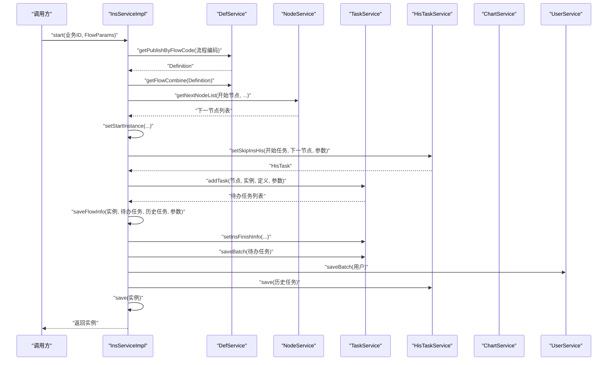
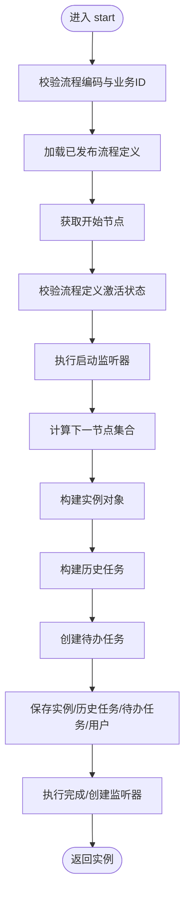
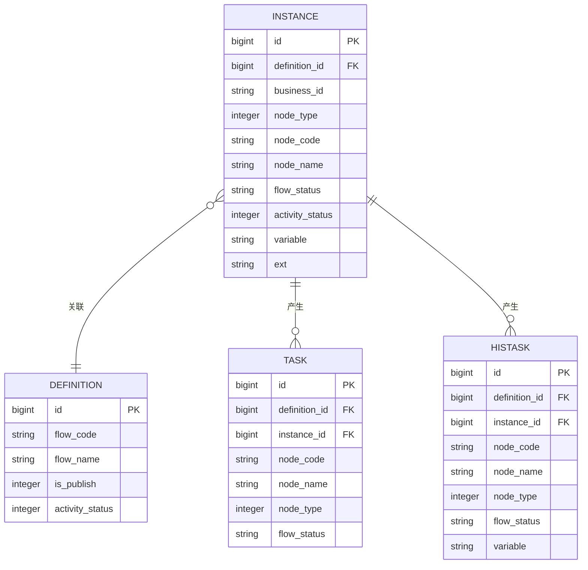
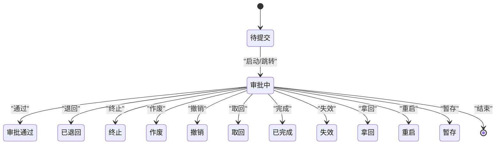
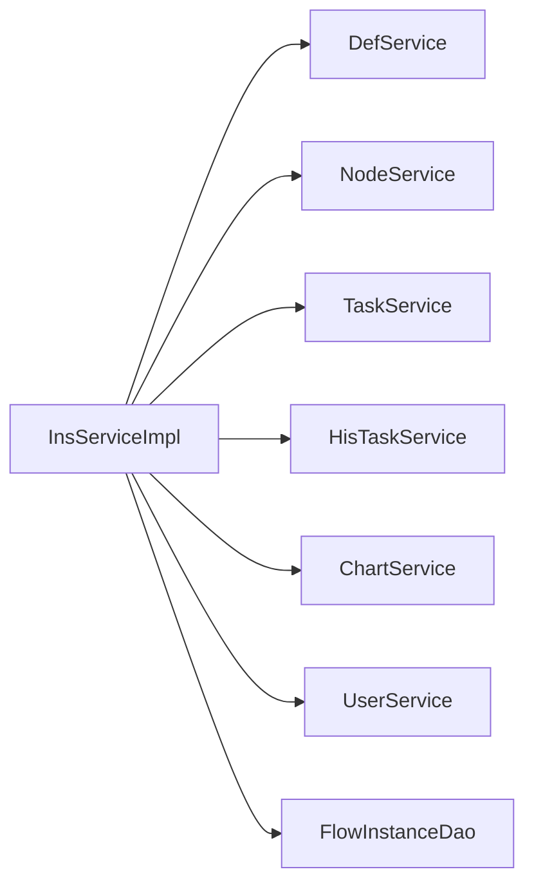

# 实例服务

<cite>
**本文引用的文件**
- [InsService.java](file://warm-flow-core/src/main/java/org/dromara/warm/flow/core/service/InsService.java)
- [InsServiceImpl.java](file://warm-flow-core/src/main/java/org/dromara/warm/flow/core/service/impl/InsServiceImpl.java)
- [Instance.java](file://warm-flow-core/src/main/java/org/dromara/warm/flow/core/entity/Instance.java)
- [Definition.java](file://warm-flow-core/src/main/java/org/dromara/warm/flow/core/entity/Definition.java)
- [Task.java](file://warm-flow-core/src/main/java/org/dromara/warm/flow/core/entity/Task.java)
- [HisTask.java](file://warm-flow-core/src/main/java/org/dromara/warm/flow/core/entity/HisTask.java)
- [FlowStatus.java](file://warm-flow-core/src/main/java/org/dromara/warm/flow/core/enums/FlowStatus.java)
- [ActivityStatus.java](file://warm-flow-core/src/main/java/org/dromara/warm/flow/core/enums/ActivityStatus.java)
- [FlowParams.java](file://warm-flow-core/src/main/java/org/dromara/warm/flow/core/dto/FlowParams.java)
- [DefService.java](file://warm-flow-core/src/main/java/org/dromara/warm/flow/core/service/DefService.java)
- [TaskService.java](file://warm-flow-core/src/main/java/org/dromara/warm/flow/core/service/TaskService.java)
- [HisTaskService.java](file://warm-flow-core/src/main/java/org/dromara/warm/flow/core/service/HisTaskService.java)
- [FlowInstanceDao.java](file://warm-flow-core/src/main/java/org/dromara/warm/flow/core/orm/dao/FlowInstanceDao.java)
</cite>

## 目录
1. [简介](#简介)
2. [项目结构](#项目结构)
3. [核心组件](#核心组件)
4. [架构总览](#架构总览)
5. [详细组件分析](#详细组件分析)
6. [依赖关系分析](#依赖关系分析)
7. [性能考量](#性能考量)
8. [故障排查指南](#故障排查指南)
9. [结论](#结论)
10. [附录](#附录)

## 简介
本文件面向“实例服务”模块，系统性梳理 InsService 接口与 InsServiceImpl 实现，围绕流程实例的创建、启动、暂停、恢复、终止等状态管理进行深入解析。文档还阐述实例与流程定义、任务之间的关系，解释实例生命周期与状态转换规则，分析实例查询能力（按条件筛选、分页查询、统计分析等），并提供核心操作示例与最佳实践，帮助开发者高效管理流程实例。

## 项目结构
实例服务位于 warm-flow-core 模块中，采用接口+实现的经典分层设计：
- 接口层：InsService 定义实例服务契约
- 实现层：InsServiceImpl 提供具体业务逻辑
- 实体层：Instance、Definition、Task、HisTask 描述核心领域模型
- 枚举层：FlowStatus、ActivityStatus 表达状态语义
- DTO 层：FlowParams 封装流程运行期参数
- DAO 层：FlowInstanceDao 提供基础数据访问能力
- 服务层：DefService、TaskService、HisTaskService 提供跨实体协作能力

图表来源
- [InsService.java:30-93](file://warm-flow-core/src/main/java/org/dromara/warm/flow/core/service/InsService.java#L30-L93)
- [InsServiceImpl.java:46-244](file://warm-flow-core/src/main/java/org/dromara/warm/flow/core/service/impl/InsServiceImpl.java#L46-L244)
- [Instance.java:29-165](file://warm-flow-core/src/main/java/org/dromara/warm/flow/core/entity/Instance.java#L29-L165)
- [Definition.java:29-195](file://warm-flow-core/src/main/java/org/dromara/warm/flow/core/entity/Definition.java#L29-L195)
- [Task.java:27-135](file://warm-flow-core/src/main/java/org/dromara/warm/flow/core/entity/Task.java#L27-L135)
- [HisTask.java:30-163](file://warm-flow-core/src/main/java/org/dromara/warm/flow/core/entity/HisTask.java#L30-L163)
- [FlowParams.java:33-335](file://warm-flow-core/src/main/java/org/dromara/warm/flow/core/dto/FlowParams.java#L33-L335)
- [FlowStatus.java:30-102](file://warm-flow-core/src/main/java/org/dromara/warm/flow/core/enums/FlowStatus.java#L30-L102)
- [ActivityStatus.java:30-55](file://warm-flow-core/src/main/java/org/dromara/warm/flow/core/enums/ActivityStatus.java#L30-L55)
- [FlowInstanceDao.java:28-37](file://warm-flow-core/src/main/java/org/dromara/warm/flow/core/orm/dao/FlowInstanceDao.java#L28-L37)

章节来源
- [InsService.java:30-93](file://warm-flow-core/src/main/java/org/dromara/warm/flow/core/service/InsService.java#L30-L93)
- [InsServiceImpl.java:46-244](file://warm-flow-core/src/main/java/org/dromara/warm/flow/core/service/impl/InsServiceImpl.java#L46-L244)

## 核心组件
- InsService：定义实例服务的统一契约，包括启动流程、删除实例、按定义查询、激活/挂起实例、按定义ID集合查询、移除变量等方法。
- InsServiceImpl：实现 InsService，负责流程启动的完整编排，包括参数校验、流程定义加载、开始节点解析、监听器执行、下一节点计算、实例与任务/历史任务持久化、状态与变量更新等。
- Instance：流程实例实体，承载业务ID、流程定义关联、节点信息、流程状态、激活状态、流程变量、扩展字段等。
- FlowParams：流程运行期参数载体，支持流程编码、当前办理人、节点编码、跳转类型、消息、变量、状态、协作方式、扩展字段、下个任务处理人及其配置策略等。
- FlowStatus/ActivityStatus：流程状态与激活状态枚举，规范状态值与判断逻辑。
- FlowInstanceDao：实例DAO接口，提供按定义ID集合查询等基础能力。

章节来源
- [InsService.java:30-93](file://warm-flow-core/src/main/java/org/dromara/warm/flow/core/service/InsService.java#L30-L93)
- [InsServiceImpl.java:46-244](file://warm-flow-core/src/main/java/org/dromara/warm/flow/core/service/impl/InsServiceImpl.java#L46-L244)
- [Instance.java:29-165](file://warm-flow-core/src/main/java/org/dromara/warm/flow/core/entity/Instance.java#L29-L165)
- [FlowParams.java:33-335](file://warm-flow-core/src/main/java/org/dromara/warm/flow/core/dto/FlowParams.java#L33-L335)
- [FlowStatus.java:30-102](file://warm-flow-core/src/main/java/org/dromara/warm/flow/core/enums/FlowStatus.java#L30-L102)
- [ActivityStatus.java:30-55](file://warm-flow-core/src/main/java/org/dromara/warm/flow/core/enums/ActivityStatus.java#L30-L55)
- [FlowInstanceDao.java:28-37](file://warm-flow-core/src/main/java/org/dromara/warm/flow/core/orm/dao/FlowInstanceDao.java#L28-L37)

## 架构总览
实例服务在工作流引擎中的定位为核心服务之一，贯穿流程从“创建—启动—流转—终止”的全生命周期。其关键交互如下：
- 启动流程：读取已发布流程定义，解析开始节点，执行监听器，计算下一节点，生成实例、历史任务与待办任务，持久化并触发完成/创建监听器。
- 状态管理：通过 FlowStatus 控制流程状态，通过 ActivityStatus 控制实例激活状态；支持激活与挂起。
- 查询能力：支持按定义ID集合查询实例、按定义ID查询实例、按实例ID集合删除实例（级联清理任务与历史任务）。
- 变量管理：支持按键移除流程变量，便于动态控制流程行为。

图表来源
- [InsServiceImpl.java:55-111](file://warm-flow-core/src/main/java/org/dromara/warm/flow/core/service/impl/InsServiceImpl.java#L55-L111)
- [DefService.java:208-208](file://warm-flow-core/src/main/java/org/dromara/warm/flow/core/service/DefService.java#L208-L208)
- [TaskService.java:480-480](file://warm-flow-core/src/main/java/org/dromara/warm/flow/core/service/TaskService.java#L480-L480)
- [HisTaskService.java:70-70](file://warm-flow-core/src/main/java/org/dromara/warm/flow/core/service/HisTaskService.java#L70-L70)

## 详细组件分析

### InsService 接口
- 方法职责
  - start：根据业务ID与流程参数启动流程，返回实例对象。
  - remove：按实例ID集合删除实例，内部会级联删除任务与历史任务。
  - getByDefId：按流程定义ID查询实例集合。
  - active/unActive：对实例进行激活/挂起操作。
  - listByDefIds：按流程定义ID集合查询实例集合。
  - removeVariables：按实例ID与变量键移除流程变量。
- 设计要点
  - 与 FlowParams 紧密耦合，确保启动时具备必要上下文。
  - 与 TaskService、HisTaskService、DefService 等协作，保证流程启动的完整性。

章节来源
- [InsService.java:30-93](file://warm-flow-core/src/main/java/org/dromara/warm/flow/core/service/InsService.java#L30-L93)

### InsServiceImpl 实现
- 启动流程流程
  - 参数校验：流程编码、业务ID非空检查。
  - 流程定义加载：通过 DefService 获取已发布流程定义与组合数据。
  - 开始节点解析：过滤开始节点，校验流程定义处于激活状态。
  - 监听器执行：启动监听器、分派监听器、完成/创建监听器。
  - 下一节点计算：基于 SkipType 与表达式计算下一节点集合。
  - 实例与历史任务构建：设置实例初始状态、节点信息、流程变量、激活状态；生成历史任务记录。
  - 待办任务创建：逐节点创建任务，支持变量表达式替换。
  - 图元元数据：通过 ChartService 记录流程图元数据。
  - 持久化：保存实例、历史任务、待办任务与用户信息。
- 状态管理
  - active：将实例设置为激活状态。
  - unActive：将实例设置为挂起状态。
- 查询与删除
  - getByDefId：按定义ID查询实例。
  - listByDefIds：按定义ID集合查询实例。
  - remove：按实例ID集合删除，级联删除任务与历史任务。
- 变量管理
  - removeVariables：按键移除实例变量并持久化。

图表来源
- [InsServiceImpl.java:55-111](file://warm-flow-core/src/main/java/org/dromara/warm/flow/core/service/impl/InsServiceImpl.java#L55-L111)
- [InsServiceImpl.java:155-165](file://warm-flow-core/src/main/java/org/dromara/warm/flow/core/service/impl/InsServiceImpl.java#L155-L165)

章节来源
- [InsServiceImpl.java:46-244](file://warm-flow-core/src/main/java/org/dromara/warm/flow/core/service/impl/InsServiceImpl.java#L46-L244)

### 实例与流程定义、任务的关系
- 实例与定义：Instance 通过 definitionId 关联 Definition，启动时携带流程名称、节点信息与状态。
- 实例与任务：启动后生成 HisTask（历史任务）与 Task（待办任务），二者共同记录流程流转轨迹。
- 实例与状态：FlowStatus 表达流程状态，ActivityStatus 表达实例激活状态，二者共同决定实例可否继续流转。

图表来源
- [Instance.java:77-163](file://warm-flow-core/src/main/java/org/dromara/warm/flow/core/entity/Instance.java#L77-L163)
- [Definition.java:77-159](file://warm-flow-core/src/main/java/org/dromara/warm/flow/core/entity/Definition.java#L77-L159)
- [Task.java:75-126](file://warm-flow-core/src/main/java/org/dromara/warm/flow/core/entity/Task.java#L75-L126)
- [HisTask.java:66-153](file://warm-flow-core/src/main/java/org/dromara/warm/flow/core/entity/HisTask.java#L66-L153)

章节来源
- [Instance.java:29-165](file://warm-flow-core/src/main/java/org/dromara/warm/flow/core/entity/Instance.java#L29-L165)
- [Definition.java:29-195](file://warm-flow-core/src/main/java/org/dromara/warm/flow/core/entity/Definition.java#L29-L195)
- [Task.java:27-135](file://warm-flow-core/src/main/java/org/dromara/warm/flow/core/entity/Task.java#L27-L135)
- [HisTask.java:30-163](file://warm-flow-core/src/main/java/org/dromara/warm/flow/core/entity/HisTask.java#L30-L163)

### 实例生命周期与状态转换规则
- 生命周期阶段
  - 创建：生成实例，初始状态为“待提交”，激活状态为“激活”。
  - 启动：根据开始节点生成首条历史任务与待办任务，进入“审批中”或自定义状态。
  - 流转：通过 TaskService 的跳转能力驱动实例状态变化，历史任务记录每次流转。
  - 结束：完成、终止、作废、撤销、取回、已完成、退回、失效、拿回、重启、暂存等状态。
- 状态转换
  - FlowStatus：涵盖待提交、审批中、审批通过、自动完成、终止、作废、撤销、取回、已完成、已退回、失效、拿回、重启、暂存等。
  - ActivityStatus：激活/挂起，影响实例是否可继续流转。
- 触发条件
  - 通过 TaskService 的 pass/reject/skip/termination 等操作改变实例状态。
  - 通过 InsService 的 active/unActive 改变实例激活状态。

图表来源
- [FlowStatus.java:34-60](file://warm-flow-core/src/main/java/org/dromara/warm/flow/core/enums/FlowStatus.java#L34-L60)
- [ActivityStatus.java:35-37](file://warm-flow-core/src/main/java/org/dromara/warm/flow/core/enums/ActivityStatus.java#L35-L37)

章节来源
- [FlowStatus.java:30-102](file://warm-flow-core/src/main/java/org/dromara/warm/flow/core/enums/FlowStatus.java#L30-L102)
- [ActivityStatus.java:30-55](file://warm-flow-core/src/main/java/org/dromara/warm/flow/core/enums/ActivityStatus.java#L30-L55)

### 实例查询功能
- 按定义ID查询：getByDefId 返回某流程定义下的所有实例。
- 按定义ID集合查询：listByDefIds 支持批量查询。
- 按实例ID集合删除：remove 内部遍历实例关联任务，级联删除任务与历史任务，再删除实例。
- DAO 支撑：FlowInstanceDao 提供按定义ID集合查询能力。

章节来源
- [InsService.java:56-83](file://warm-flow-core/src/main/java/org/dromara/warm/flow/core/service/InsService.java#L56-L83)
- [InsServiceImpl.java:114-126](file://warm-flow-core/src/main/java/org/dromara/warm/flow/core/service/impl/InsServiceImpl.java#L114-L126)
- [InsServiceImpl.java:196-214](file://warm-flow-core/src/main/java/org/dromara/warm/flow/core/service/impl/InsServiceImpl.java#L196-L214)
- [FlowInstanceDao.java:30-36](file://warm-flow-core/src/main/java/org/dromara/warm/flow/core/orm/dao/FlowInstanceDao.java#L30-L36)

### 核心操作使用示例
- 启动新流程
  - 步骤：准备 FlowParams（含流程编码、当前办理人、变量等），调用 InsService.start(businessId, flowParams)。
  - 关键点：确保流程定义已发布且处于激活状态；开始节点存在；监听器与下一节点计算正确。
- 查询实例详情
  - 方式：通过 TaskService.getByInsId(instanceId) 获取待办任务集合；通过 HisTaskService.getByInsId(instanceId) 获取历史任务集合。
- 获取实例历史
  - 方式：HisTaskService.getByInsId(instanceId) 或按节点编码集合查询。
- 状态管理
  - 激活/挂起：InsService.active(id)/unActive(id)。
  - 终止：TaskService.terminationByInsId(instanceId, flowParams)。

章节来源
- [InsService.java:32-92](file://warm-flow-core/src/main/java/org/dromara/warm/flow/core/service/InsService.java#L32-L92)
- [TaskService.java:314-345](file://warm-flow-core/src/main/java/org/dromara/warm/flow/core/service/TaskService.java#L314-L345)
- [HisTaskService.java:132-137](file://warm-flow-core/src/main/java/org/dromara/warm/flow/core/service/HisTaskService.java#L132-L137)

## 依赖关系分析
- 内聚性
  - InsServiceImpl 高度内聚于流程启动与状态管理，职责清晰。
- 耦合性
  - 与 DefService、TaskService、HisTaskService、ChartService、UserService 存在协作耦合，遵循“高内聚、低耦合”原则。
- 外部依赖
  - 通过 FlowEngine 获取各服务实例，避免直接依赖注入，提升可插拔性。

图表来源
- [InsServiceImpl.java:18-32](file://warm-flow-core/src/main/java/org/dromara/warm/flow/core/service/impl/InsServiceImpl.java#L18-L32)

章节来源
- [InsServiceImpl.java:18-32](file://warm-flow-core/src/main/java/org/dromara/warm/flow/core/service/impl/InsServiceImpl.java#L18-L32)

## 性能考量
- 启动流程的复杂度
  - 时间复杂度：与下一节点数量、监听器执行次数、任务创建数量相关，通常为 O(n)。
  - 空间复杂度：与待办任务与历史任务数量相关。
- 批量操作
  - remove 操作会遍历实例关联任务并级联删除，建议在事务中执行，避免长时间阻塞。
- 变量处理
  - JSON 序列化/反序列化开销可控，建议避免在高频路径中频繁变更大体量变量。
- 监听器与表达式
  - 监听器与表达式求值可能带来额外开销，建议在必要节点启用，避免过度使用。

## 故障排查指南
- 常见异常与定位
  - 流程编码为空：检查 FlowParams.flowCode 是否正确设置。
  - 未找到流程定义：确认流程已发布且编码正确。
  - 缺失开始节点：检查流程设计是否包含开始节点。
  - 流程定义未激活：检查 Definition.activityStatus。
  - 实例已激活/挂起：active/unActive 前先校验当前状态。
- 排查步骤
  - 启动失败：核对 FlowParams、流程定义、开始节点、监听器与下一节点计算。
  - 删除失败：确认实例ID集合有效，检查任务与历史任务删除顺序。
  - 状态异常：核对 FlowStatus 与 ActivityStatus 的转换规则与触发条件。

章节来源
- [InsServiceImpl.java:56-68](file://warm-flow-core/src/main/java/org/dromara/warm/flow/core/service/impl/InsServiceImpl.java#L56-L68)
- [InsServiceImpl.java:217-230](file://warm-flow-core/src/main/java/org/dromara/warm/flow/core/service/impl/InsServiceImpl.java#L217-L230)

## 结论
实例服务作为工作流引擎的核心模块，承担着流程实例的创建、启动、状态管理与查询等关键职责。InsServiceImpl 通过严谨的流程编排与与多服务协作，确保实例生命周期的稳定与可追溯。开发者在使用时应关注参数校验、状态转换规则与事务一致性，结合 DAO 与服务层能力实现高效的流程实例管理。

## 附录
- 相关实体与枚举
  - 实体：Instance、Definition、Task、HisTask
  - 枚举：FlowStatus、ActivityStatus
  - DTO：FlowParams
  - DAO：FlowInstanceDao
- 服务接口
  - DefService、TaskService、HisTaskService

章节来源
- [Instance.java:29-165](file://warm-flow-core/src/main/java/org/dromara/warm/flow/core/entity/Instance.java#L29-L165)
- [Definition.java:29-195](file://warm-flow-core/src/main/java/org/dromara/warm/flow/core/entity/Definition.java#L29-L195)
- [Task.java:27-135](file://warm-flow-core/src/main/java/org/dromara/warm/flow/core/entity/Task.java#L27-L135)
- [HisTask.java:30-163](file://warm-flow-core/src/main/java/org/dromara/warm/flow/core/entity/HisTask.java#L30-L163)
- [FlowStatus.java:30-102](file://warm-flow-core/src/main/java/org/dromara/warm/flow/core/enums/FlowStatus.java#L30-L102)
- [ActivityStatus.java:30-55](file://warm-flow-core/src/main/java/org/dromara/warm/flow/core/enums/ActivityStatus.java#L30-L55)
- [FlowParams.java:33-335](file://warm-flow-core/src/main/java/org/dromara/warm/flow/core/dto/FlowParams.java#L33-L335)
- [FlowInstanceDao.java:28-37](file://warm-flow-core/src/main/java/org/dromara/warm/flow/core/orm/dao/FlowInstanceDao.java#L28-L37)
- [DefService.java:34-209](file://warm-flow-core/src/main/java/org/dromara/warm/flow/core/service/DefService.java#L34-L209)
- [TaskService.java:36-533](file://warm-flow-core/src/main/java/org/dromara/warm/flow/core/service/TaskService.java#L36-L533)
- [HisTaskService.java:33-139](file://warm-flow-core/src/main/java/org/dromara/warm/flow/core/service/HisTaskService.java#L33-L139)