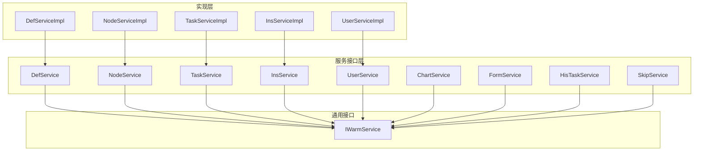
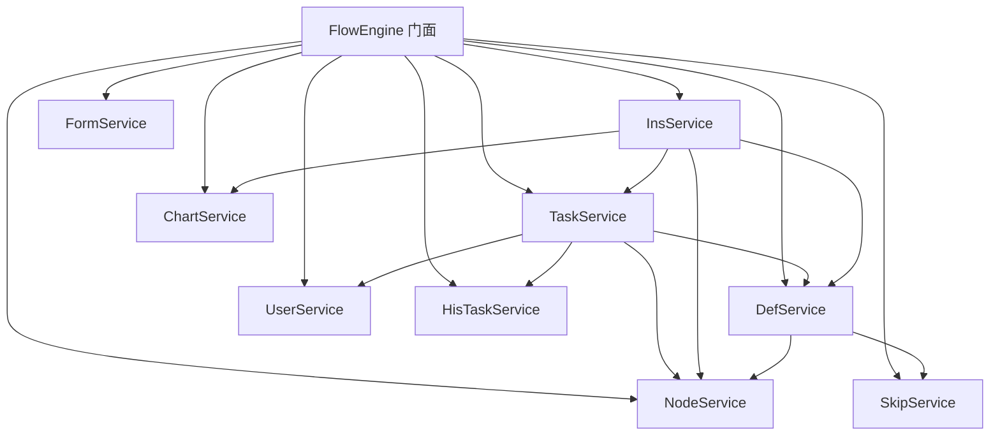
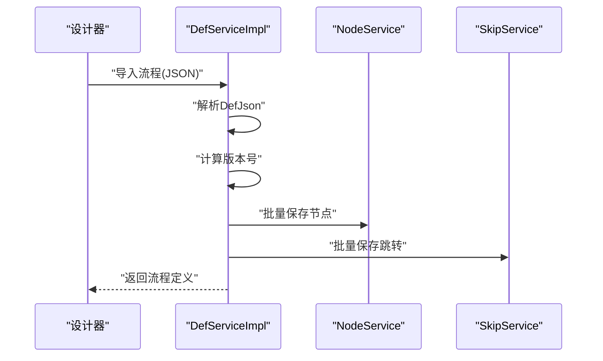
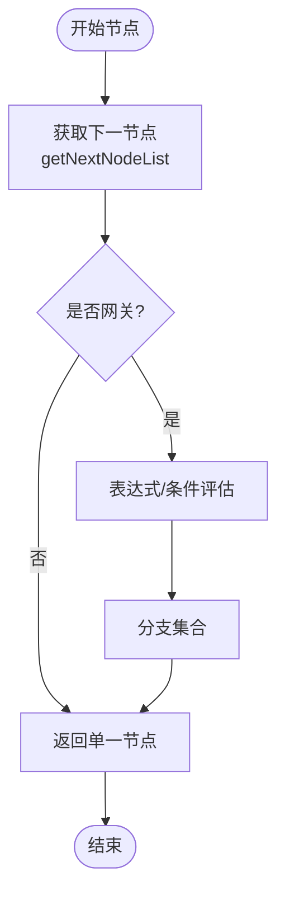
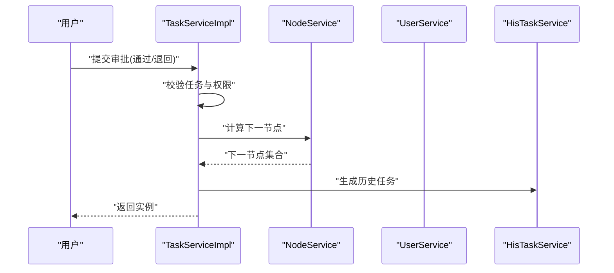
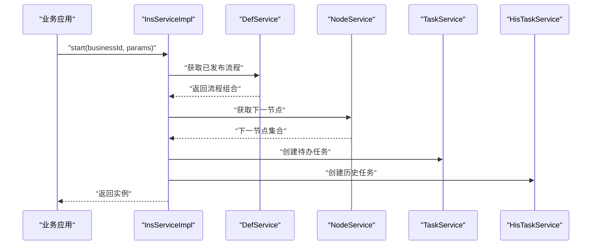
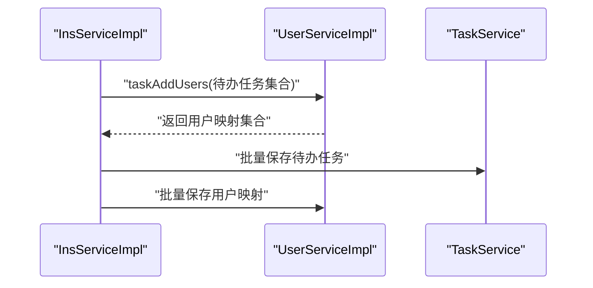
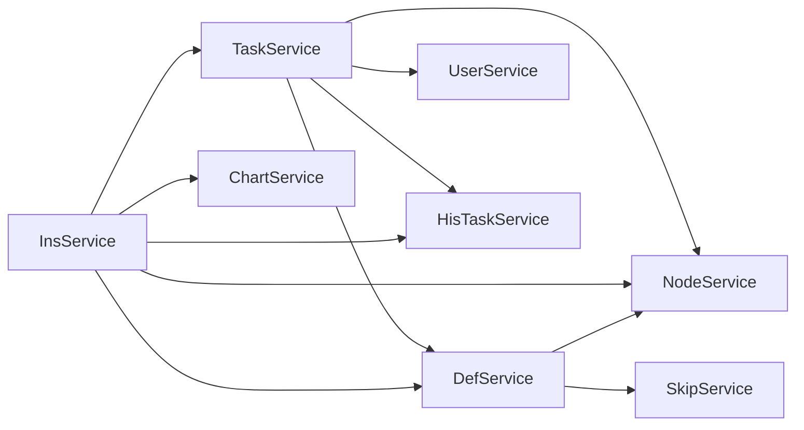

# 服务层架构设计

<cite>
**本文引用的文件**
- [DefService.java](file://warm-flow-core/src/main/java/org/dromara/warm/flow/core/service/DefService.java)
- [NodeService.java](file://warm-flow-core/src/main/java/org/dromara/warm/flow/core/service/NodeService.java)
- [TaskService.java](file://warm-flow-core/src/main/java/org/dromara/warm/flow/core/service/TaskService.java)
- [InsService.java](file://warm-flow-core/src/main/java/org/dromara/warm/flow/core/service/InsService.java)
- [UserService.java](file://warm-flow-core/src/main/java/org/dromara/warm/flow/core/service/UserService.java)
- [ChartService.java](file://warm-flow-core/src/main/java/org/dromara/warm/flow/core/service/ChartService.java)
- [FormService.java](file://warm-flow-core/src/main/java/org/dromara/warm/flow/core/service/FormService.java)
- [HisTaskService.java](file://warm-flow-core/src/main/java/org/dromara/warm/flow/core/service/HisTaskService.java)
- [SkipService.java](file://warm-flow-core/src/main/java/org/dromara/warm/flow/core/service/SkipService.java)
- [IWarmService.java](file://warm-flow-core/src/main/java/org/dromara/warm/flow/core/orm/service/IWarmService.java)
- [DefServiceImpl.java](file://warm-flow-core/src/main/java/org/dromara/warm/flow/core/service/impl/DefServiceImpl.java)
- [NodeServiceImpl.java](file://warm-flow-core/src/main/java/org/dromara/warm/flow/core/service/impl/NodeServiceImpl.java)
- [TaskServiceImpl.java](file://warm-flow-core/src/main/java/org/dromara/warm/flow/core/service/impl/TaskServiceImpl.java)
- [InsServiceImpl.java](file://warm-flow-core/src/main/java/org/dromara/warm/flow/core/service/impl/InsServiceImpl.java)
- [UserServiceImpl.java](file://warm-flow-core/src/main/java/org/dromara/warm/flow/core/service/impl/UserServiceImpl.java)
</cite>

## 目录
1. [引言](#引言)
2. [项目结构](#项目结构)
3. [核心组件](#核心组件)
4. [架构总览](#架构总览)
5. [详细组件分析](#详细组件分析)
6. [依赖分析](#依赖分析)
7. [性能考量](#性能考量)
8. [故障排查指南](#故障排查指南)
9. [结论](#结论)
10. [附录](#附录)

## 引言
本文件面向工作流引擎服务层，系统化梳理并解读服务层接口与实现的设计理念、职责边界、统一抽象与扩展机制。重点覆盖以下核心服务接口：DefService（流程定义服务）、NodeService（节点服务）、TaskService（任务服务）、InsService（实例服务）、UserService（用户服务），以及 ChartService、FormService、HisTaskService、SkipService 等支撑服务。文档旨在帮助开发者快速理解服务层整体架构、掌握接口使用方式与最佳实践，并在此基础上进行扩展与插件化开发。

## 项目结构
服务层位于 warm-flow-core 模块 org.dromara.warm.flow.core.service 包下，采用“接口 + 抽象基类 + 具体实现”的分层组织方式：
- 接口层：定义领域能力契约，如 DefService、NodeService、TaskService、InsService、UserService 等
- 抽象基类：IWarmService 提供通用 CRUD、分页、排序等基础设施能力
- 实现层：各具体服务的实现类，如 DefServiceImpl、NodeServiceImpl、TaskServiceImpl、InsServiceImpl、UserServiceImpl 等

图表来源
- [IWarmService.java:33-210](file://warm-flow-core/src/main/java/org/dromara/warm/flow/core/orm/service/IWarmService.java#L33-L210)
- [DefService.java:34-210](file://warm-flow-core/src/main/java/org/dromara/warm/flow/core/service/DefService.java#L34-L210)
- [NodeService.java:34-229](file://warm-flow-core/src/main/java/org/dromara/warm/flow/core/service/NodeService.java#L34-L229)
- [TaskService.java:36-534](file://warm-flow-core/src/main/java/org/dromara/warm/flow/core/service/TaskService.java#L36-L534)
- [InsService.java:30-94](file://warm-flow-core/src/main/java/org/dromara/warm/flow/core/service/InsService.java#L30-L94)
- [UserService.java:30-166](file://warm-flow-core/src/main/java/org/dromara/warm/flow/core/service/UserService.java#L30-L166)
- [ChartService.java:28-54](file://warm-flow-core/src/main/java/org/dromara/warm/flow/core/service/ChartService.java#L28-L54)
- [FormService.java:28-99](file://warm-flow-core/src/main/java/org/dromara/warm/flow/core/service/FormService.java#L28-L99)
- [HisTaskService.java:33-140](file://warm-flow-core/src/main/java/org/dromara/warm/flow/core/service/HisTaskService.java#L33-L140)
- [SkipService.java:31-58](file://warm-flow-core/src/main/java/org/dromara/warm/flow/core/service/SkipService.java#L31-L58)

章节来源
- [IWarmService.java:33-210](file://warm-flow-core/src/main/java/org/dromara/warm/flow/core/orm/service/IWarmService.java#L33-L210)
- [DefService.java:34-210](file://warm-flow-core/src/main/java/org/dromara/warm/flow/core/service/DefService.java#L34-L210)
- [NodeService.java:34-229](file://warm-flow-core/src/main/java/org/dromara/warm/flow/core/service/NodeService.java#L34-L229)
- [TaskService.java:36-534](file://warm-flow-core/src/main/java/org/dromara/warm/flow/core/service/TaskService.java#L36-L534)
- [InsService.java:30-94](file://warm-flow-core/src/main/java/org/dromara/warm/flow/core/service/InsService.java#L30-L94)
- [UserService.java:30-166](file://warm-flow-core/src/main/java/org/dromara/warm/flow/core/service/UserService.java#L30-L166)
- [ChartService.java:28-54](file://warm-flow-core/src/main/java/org/dromara/warm/flow/core/service/ChartService.java#L28-L54)
- [FormService.java:28-99](file://warm-flow-core/src/main/java/org/dromara/warm/flow/core/service/FormService.java#L28-L99)
- [HisTaskService.java:33-140](file://warm-flow-core/src/main/java/org/dromara/warm/flow/core/service/HisTaskService.java#L33-L140)
- [SkipService.java:31-58](file://warm-flow-core/src/main/java/org/dromara/warm/flow/core/service/SkipService.java#L31-L58)

## 核心组件
本节从职责、关键方法与典型用法三个维度，对五大核心服务进行概览式解读。

- DefService（流程定义服务）
  - 职责：流程定义、节点、跳转的导入导出、版本管理、发布/取消发布、复制、激活/挂起等
  - 关键方法：importIs/importJson/importDef、insertFlow、checkAndSave、saveDef、exportJson、getAllDataDefinition、getFlowCombine、queryDesign、publish/unPublish、copyDef、active/unActive 等
  - 典型用法：设计器导入/导出、流程复制与发布

- NodeService（节点服务）
  - 职责：节点查询、前后置节点计算、网关分支判定、下一节点推导、节点扩展信息获取
  - 关键方法：getPublishByFlowCode、previousNodeList/suffixNodeList、getByDefId/getStartNode/getEndNode、getNextNodeList/getNextNode、getNextByCheckGateway、ext 获取
  - 典型用法：流程图渲染、路由决策、网关分支选择

- TaskService（任务服务）
  - 职责：任务流转控制（通过/退回/任意跳转/拿回/撤销/终止/暂存）、任务增删改查、任务与实例状态联动、表单加载、协作处理（转办/委派/加签/减签）
  - 关键方法：pass/reject/passAtWill/rejectAtWill、skip/skipByInsId、rejectLast/rejectLastByInsId、transfer/depute/addSignature/reductionSignature、pending/pendingByInsId、load/hisLoad 等
  - 典型用法：审批操作、流程推进、协作处理、状态同步

- InsService（实例服务）
  - 职责：流程实例启动、删除、状态激活/挂起、按定义查询实例、变量管理
  - 关键方法：start、remove、getByDefId、active/unActive、listByDefIds、removeVariables
  - 典型用法：发起流程、批量删除、状态控制、变量清理

- UserService（用户服务）
  - 职责：任务与用户的关联、权限人/处理人查询与构造、权限更新
  - 关键方法：taskAddUsers/taskAddUser、deleteByTaskIds、getPermission/listByAssociatedAndTypes、updatePermission、structureUser 系列
  - 典型用法：任务授权、权限变更、用户映射

章节来源
- [DefService.java:34-210](file://warm-flow-core/src/main/java/org/dromara/warm/flow/core/service/DefService.java#L34-L210)
- [NodeService.java:34-229](file://warm-flow-core/src/main/java/org/dromara/warm/flow/core/service/NodeService.java#L34-L229)
- [TaskService.java:36-534](file://warm-flow-core/src/main/java/org/dromara/warm/flow/core/service/TaskService.java#L36-L534)
- [InsService.java:30-94](file://warm-flow-core/src/main/java/org/dromara/warm/flow/core/service/InsService.java#L30-L94)
- [UserService.java:30-166](file://warm-flow-core/src/main/java/org/dromara/warm/flow/core/service/UserService.java#L30-L166)

## 架构总览
服务层采用“接口 + 统一抽象 + 多实现”的设计模式，所有具体服务均继承自 IWarmService<T>，获得一致的 CRUD、分页、排序等通用能力。服务间通过 FlowEngine 的静态门面访问彼此，形成清晰的调用链路。

图表来源
- [IWarmService.java:33-210](file://warm-flow-core/src/main/java/org/dromara/warm/flow/core/orm/service/IWarmService.java#L33-L210)
- [DefService.java:34-210](file://warm-flow-core/src/main/java/org/dromara/warm/flow/core/service/DefService.java#L34-L210)
- [NodeService.java:34-229](file://warm-flow-core/src/main/java/org/dromara/warm/flow/core/service/NodeService.java#L34-L229)
- [TaskService.java:36-534](file://warm-flow-core/src/main/java/org/dromara/warm/flow/core/service/TaskService.java#L36-L534)
- [InsService.java:30-94](file://warm-flow-core/src/main/java/org/dromara/warm/flow/core/service/InsService.java#L30-L94)
- [UserService.java:30-166](file://warm-flow-core/src/main/java/org/dromara/warm/flow/core/service/UserService.java#L30-L166)
- [HisTaskService.java:33-140](file://warm-flow-core/src/main/java/org/dromara/warm/flow/core/service/HisTaskService.java#L33-L140)
- [SkipService.java:31-58](file://warm-flow-core/src/main/java/org/dromara/warm/flow/core/service/SkipService.java#L31-L58)
- [ChartService.java:28-54](file://warm-flow-core/src/main/java/org/dromara/warm/flow/core/service/ChartService.java#L28-L54)
- [FormService.java:28-99](file://warm-flow-core/src/main/java/org/dromara/warm/flow/core/service/FormService.java#L28-L99)

## 详细组件分析

### DefService（流程定义服务）
- 设计要点
  - 统一的导入/导出能力：支持 InputStream、JSON 字符串、DefJson 对象三种导入方式；导出为 JSON 字符串
  - 版本管理：新增流程时自动计算新版本号，保证流程演进的可追溯性
  - 数据一致性：insertFlow 将定义、节点、跳转统一入库；saveDef 支持仅保存节点/跳转
  - 发布与状态：提供发布/取消发布、激活/挂起、复制、批量状态更新等运维能力
- 典型调用链
  - 设计器导入 → DefServiceImpl.importDef → insertFlow → 调用其他服务批量保存节点/跳转
  - 导出流程 → DefServiceImpl.exportJson → ChartService.startMetadata（渲染元数据）

图表来源
- [DefServiceImpl.java:84-100](file://warm-flow-core/src/main/java/org/dromara/warm/flow/core/service/impl/DefServiceImpl.java#L84-L100)
- [DefService.java:41-82](file://warm-flow-core/src/main/java/org/dromara/warm/flow/core/service/DefService.java#L41-L82)

章节来源
- [DefService.java:34-210](file://warm-flow-core/src/main/java/org/dromara/warm/flow/core/service/DefService.java#L34-L210)
- [DefServiceImpl.java:54-150](file://warm-flow-core/src/main/java/org/dromara/warm/flow/core/service/impl/DefServiceImpl.java#L54-L150)

### NodeService（节点服务）
- 设计要点
  - 节点查询：按流程定义、节点编码、起止节点等多维查询
  - 路由推导：基于前后置关系与跳转类型，计算下一节点集合；网关节点支持条件判断
  - 扩展信息：提供节点扩展属性的统一获取入口
- 典型调用链
  - InsServiceImpl.start → NodeService.getNextNodeList → 计算下一节点集合 → 生成待办任务

图表来源
- [NodeServiceImpl.java:167-200](file://warm-flow-core/src/main/java/org/dromara/warm/flow/core/service/impl/NodeServiceImpl.java#L167-L200)
- [NodeService.java:144-200](file://warm-flow-core/src/main/java/org/dromara/warm/flow/core/service/NodeService.java#L144-L200)

章节来源
- [NodeService.java:34-229](file://warm-flow-core/src/main/java/org/dromara/warm/flow/core/service/NodeService.java#L34-L229)
- [NodeServiceImpl.java:48-200](file://warm-flow-core/src/main/java/org/dromara/warm/flow/core/service/impl/NodeServiceImpl.java#L48-L200)

### TaskService（任务服务）
- 设计要点
  - 任务流转：通过/退回、任意跳转、拿回、撤销、终止、暂存等全链路控制
  - 协作处理：转办、委派、加签、减签，支持覆盖/追加策略
  - 与实例联动：setInsFinishInfo 合并变量、设置实例状态与下一节点
  - 表单集成：load/hisLoad 支持表单数据加载
- 典型调用链
  - 用户审批 → TaskServiceImpl.skip → 校验权限/协作 → 计算下一节点 → 生成历史任务/待办任务 → 更新实例状态

图表来源
- [TaskServiceImpl.java:96-165](file://warm-flow-core/src/main/java/org/dromara/warm/flow/core/service/impl/TaskServiceImpl.java#L96-L165)
- [TaskService.java:140-330](file://warm-flow-core/src/main/java/org/dromara/warm/flow/core/service/TaskService.java#L140-L330)

章节来源
- [TaskService.java:36-534](file://warm-flow-core/src/main/java/org/dromara/warm/flow/core/service/TaskService.java#L36-L534)
- [TaskServiceImpl.java:44-200](file://warm-flow-core/src/main/java/org/dromara/warm/flow/core/service/impl/TaskServiceImpl.java#L44-L200)

### InsService（实例服务）
- 设计要点
  - 启动流程：校验发布状态与起始节点 → 计算下一节点 → 生成实例与历史任务 → 创建待办任务 → 触发监听器
  - 状态控制：激活/挂起、批量删除、按定义查询、变量清理
- 典型调用链
  - InsServiceImpl.start → DefService.getFlowCombine → NodeService.getNextNodeList → TaskService.addTask × N → HisTaskService.setSkipInsHis → 保存实例

图表来源
- [InsServiceImpl.java:54-111](file://warm-flow-core/src/main/java/org/dromara/warm/flow/core/service/impl/InsServiceImpl.java#L54-L111)
- [InsService.java:30-94](file://warm-flow-core/src/main/java/org/dromara/warm/flow/core/service/InsService.java#L30-L94)

章节来源
- [InsService.java:30-94](file://warm-flow-core/src/main/java/org/dromara/warm/flow/core/service/InsService.java#L30-L94)
- [InsServiceImpl.java:46-165](file://warm-flow-core/src/main/java/org/dromara/warm/flow/core/service/impl/InsServiceImpl.java#L46-L165)

### UserService（用户服务）
- 设计要点
  - 任务授权：根据任务权限集合构造用户映射，支持批量与单个任务
  - 权限查询：按关联 ID 与类型查询权限人/处理人
  - 权限更新：支持清空后重建、委派场景下的处理人记录
- 典型调用链
  - InsServiceImpl.saveFlowInfo → UserService.taskAddUsers → UserService.saveBatch

图表来源
- [UserServiceImpl.java:48-64](file://warm-flow-core/src/main/java/org/dromara/warm/flow/core/service/impl/UserServiceImpl.java#L48-L64)
- [UserService.java:30-166](file://warm-flow-core/src/main/java/org/dromara/warm/flow/core/service/UserService.java#L30-L166)

章节来源
- [UserService.java:30-166](file://warm-flow-core/src/main/java/org/dromara/warm/flow/core/service/UserService.java#L30-L166)
- [UserServiceImpl.java:40-163](file://warm-flow-core/src/main/java/org/dromara/warm/flow/core/service/impl/UserServiceImpl.java#L40-L163)

### 其他支撑服务
- ChartService：流程图元数据生成（启动/运行时）
- FormService：表单发布/取消发布/复制/分页查询/内容保存
- HisTaskService：历史任务查询与写入、协作与会签/票签记录
- SkipService：节点跳转线的查询与批量删除

章节来源
- [ChartService.java:28-54](file://warm-flow-core/src/main/java/org/dromara/warm/flow/core/service/ChartService.java#L28-L54)
- [FormService.java:28-99](file://warm-flow-core/src/main/java/org/dromara/warm/flow/core/service/FormService.java#L28-L99)
- [HisTaskService.java:33-140](file://warm-flow-core/src/main/java/org/dromara/warm/flow/core/service/HisTaskService.java#L33-L140)
- [SkipService.java:31-58](file://warm-flow-core/src/main/java/org/dromara/warm/flow/core/service/SkipService.java#L31-L58)

## 依赖分析
- 服务内聚与耦合
  - TaskService 依赖最多：与 NodeService、DefService、UserService、HisTaskService 紧密协作，承担流程推进的核心职责
  - InsService 作为流程入口，依赖 DefService、NodeService、TaskService、HisTaskService、ChartService
  - DefService 与 NodeService、SkipService 组合，负责流程结构的持久化与查询
- 外部依赖
  - 所有服务通过 FlowEngine 门面访问，避免循环依赖，降低耦合度
  - 通用能力 IWarmService 提供统一 CRUD 与分页接口，提升复用性

图表来源
- [TaskService.java:36-534](file://warm-flow-core/src/main/java/org/dromara/warm/flow/core/service/TaskService.java#L36-L534)
- [InsService.java:30-94](file://warm-flow-core/src/main/java/org/dromara/warm/flow/core/service/InsService.java#L30-L94)
- [DefService.java:34-210](file://warm-flow-core/src/main/java/org/dromara/warm/flow/core/service/DefService.java#L34-L210)
- [NodeService.java:34-229](file://warm-flow-core/src/main/java/org/dromara/warm/flow/core/service/NodeService.java#L34-L229)
- [HisTaskService.java:33-140](file://warm-flow-core/src/main/java/org/dromara/warm/flow/core/service/HisTaskService.java#L33-L140)
- [SkipService.java:31-58](file://warm-flow-core/src/main/java/org/dromara/warm/flow/core/service/SkipService.java#L31-L58)
- [ChartService.java:28-54](file://warm-flow-core/src/main/java/org/dromara/warm/flow/core/service/ChartService.java#L28-L54)

章节来源
- [TaskServiceImpl.java:166-200](file://warm-flow-core/src/main/java/org/dromara/warm/flow/core/service/impl/TaskServiceImpl.java#L166-L200)
- [InsServiceImpl.java:155-165](file://warm-flow-core/src/main/java/org/dromara/warm/flow/core/service/impl/InsServiceImpl.java#L155-L165)

## 性能考量
- 批量操作：大量使用 saveBatch/updateBatch，减少数据库往返
- 流程计算：NodeService 的下一节点推导基于内存结构（节点+跳转）聚合，避免多次 IO
- 并发注意：TaskServiceImpl.skip 注释提示后续可考虑对任务 ID 加锁以规避并发问题，建议在高并发场景引入分布式锁或幂等设计
- 监听器与表达式：流程启动/分配/完成监听器与变量表达式求值可能带来额外开销，建议在业务允许范围内精简监听器数量与表达式复杂度

## 故障排查指南
- 常见异常定位
  - 缺失必要参数：如节点编码、流程定义 ID、任务 ID 等，通常抛出参数校验异常
  - 流程状态不符：如流程未发布、实例被挂起、起始节点缺失等，触发流程状态异常
  - 权限不足：未满足权限处理器要求或未传入处理人标识
- 排查步骤
  - 核对 FlowParams 中的 skipType、nodeCode、handler、permissionFlag、variable 等关键字段
  - 检查流程定义发布状态与节点类型（特别是网关节点）
  - 查看历史任务与待办任务状态，确认流程走向
- 相关接口参考
  - 参数校验与断言：TaskServiceImpl.skip、InsServiceImpl.start
  - 权限校验：TaskServiceImpl.skip 中的 checkAuth 调用
  - 状态断言：InsServiceImpl.start 中对流程定义活动状态的检查

章节来源
- [TaskServiceImpl.java:166-188](file://warm-flow-core/src/main/java/org/dromara/warm/flow/core/service/impl/TaskServiceImpl.java#L166-L188)
- [InsServiceImpl.java:54-70](file://warm-flow-core/src/main/java/org/dromara/warm/flow/core/service/impl/InsServiceImpl.java#L54-L70)

## 结论
服务层通过 IWarmService 提供统一抽象，五大核心服务（DefService、NodeService、TaskService、InsService、UserService）职责清晰、边界明确，并通过 FlowEngine 门面实现松耦合协作。TaskService 作为流程推进中枢，承担最复杂的业务逻辑；InsService 作为流程入口，串联起定义、节点、任务与历史记录；DefService 与 NodeService、SkipService 共同维护流程结构的完整性。整体架构具备良好的扩展性与插件化潜力，便于在不破坏契约的前提下引入新策略与适配器。

## 附录
- 扩展与插件化建议
  - 自定义服务：遵循 IWarmService 约定，实现 CRUD、分页、排序等通用能力，再在实现类中注入 FlowEngine 门面，调用其他服务完成业务编排
  - 策略扩展：通过策略接口（如 PermissionHandler、ExpressionStrategy 等）注入自定义行为，保持服务层接口稳定
  - 监听器与事件：利用 Listener 机制在关键节点扩展业务逻辑，避免侵入核心流程
- 使用示例与集成指南
  - 启动流程：InsService.start → 生成实例与待办任务 → 触发监听器
  - 审批流转：TaskService.pass/reject → 计算下一节点 → 生成历史任务 → 更新实例状态
  - 权限管理：UserService.updatePermission → 清空旧权限并重建新权限映射
  - 流程复制/发布：DefService.copyDef/publish/unPublish → 保障版本与状态一致性