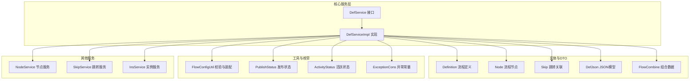
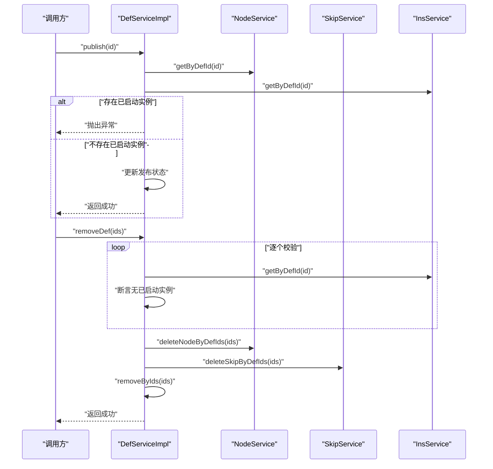
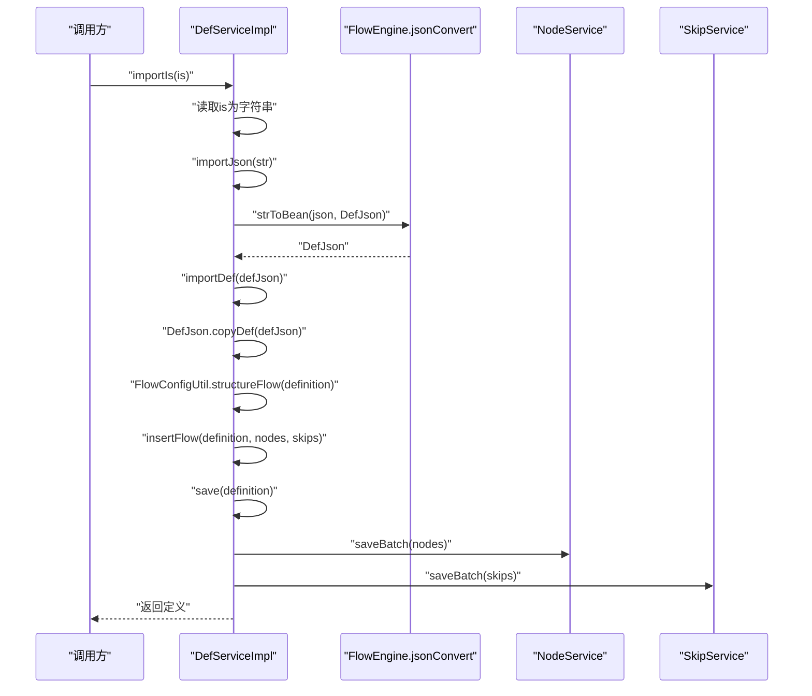
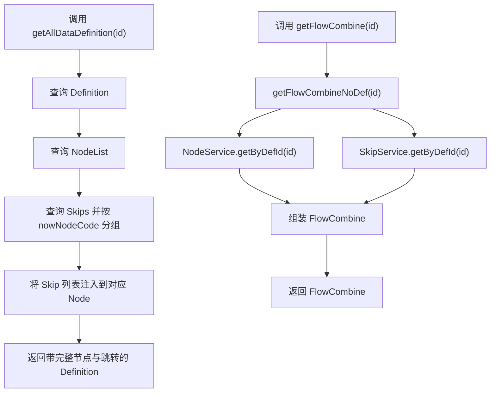
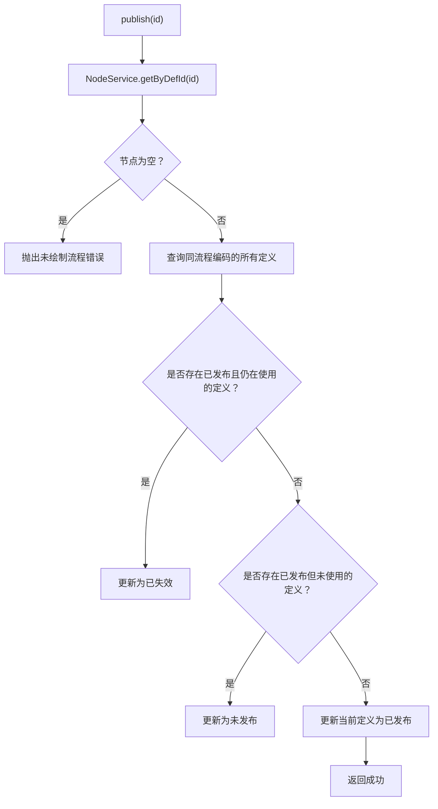
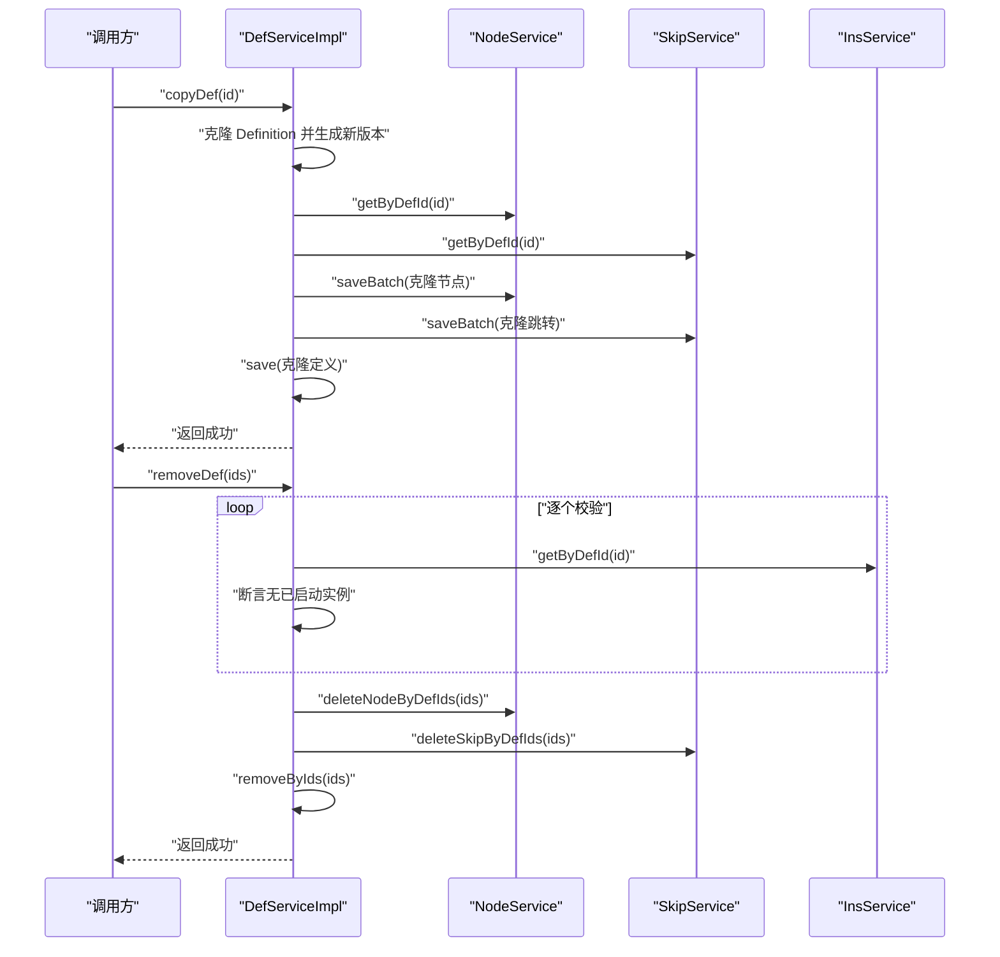
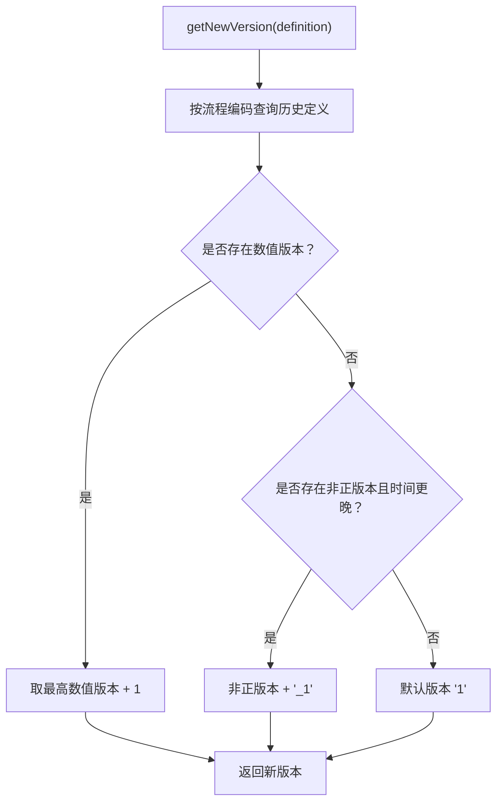
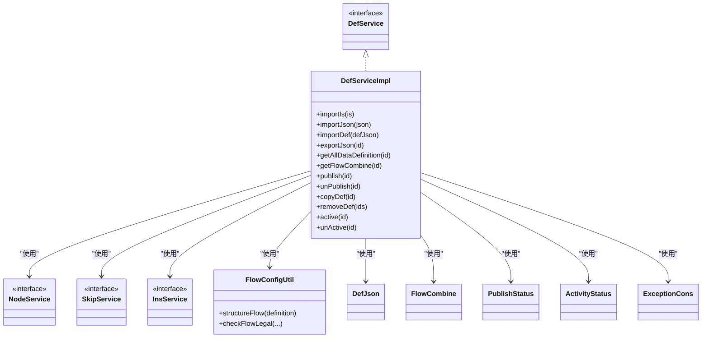

# 流程定义服务

<cite>
**本文引用的文件**
- [DefService.java](file://warm-flow-core/src/main/java/org/dromara/warm/flow/core/service/DefService.java)
- [DefServiceImpl.java](file://warm-flow-core/src/main/java/org/dromara/warm/flow/core/service/impl/DefServiceImpl.java)
- [Definition.java](file://warm-flow-core/src/main/java/org/dromara/warm/flow/core/entity/Definition.java)
- [Node.java](file://warm-flow-core/src/main/java/org/dromara/warm/flow/core/entity/Node.java)
- [Skip.java](file://warm-flow-core/src/main/java/org/dromara/warm/flow/core/entity/Skip.java)
- [DefJson.java](file://warm-flow-core/src/main/java/org/dromara/warm/flow/core/dto/DefJson.java)
- [FlowCombine.java](file://warm-flow-core/src/main/java/org/dromara/warm/flow/core/dto/FlowCombine.java)
- [FlowConfigUtil.java](file://warm-flow-core/src/main/java/org/dromara/warm/flow/core/utils/FlowConfigUtil.java)
- [NodeService.java](file://warm-flow-core/src/main/java/org/dromara/warm/flow/core/service/NodeService.java)
- [SkipService.java](file://warm-flow-core/src/main/java/org/dromara/warm/flow/core/service/SkipService.java)
- [InsService.java](file://warm-flow-core/src/main/java/org/dromara/warm/flow/core/service/InsService.java)
- [PublishStatus.java](file://warm-flow-core/src/main/java/org/dromara/warm/flow/core/enums/PublishStatus.java)
- [ActivityStatus.java](file://warm-flow-core/src/main/java/org/dromara/warm/flow/core/enums/ActivityStatus.java)
- [ExceptionCons.java](file://warm-flow-core/src/main/java/org/dromara/warm/flow/core/constant/ExceptionCons.java)
</cite>

## 目录
1. [简介](#简介)
2. [项目结构](#项目结构)
3. [核心组件](#核心组件)
4. [架构总览](#架构总览)
5. [详细组件分析](#详细组件分析)
6. [依赖分析](#依赖分析)
7. [性能考虑](#性能考虑)
8. [故障排查指南](#故障排查指南)
9. [结论](#结论)
10. [附录](#附录)

## 简介
本文件面向“流程定义服务”（DefService），围绕其接口设计理念与实现细节展开，重点涵盖以下能力：
- 流程定义的导入导出（importIs、importJson、exportJson）
- 流程数据的组合查询（getFlowCombine、getAllDataDefinition）
- 流程状态管理（publish、unPublish、active、unActive）
- 流程复制与删除（copyDef、removeDef）
- DefServiceImpl 的实现逻辑与流程定义、节点、跳转之间的关联关系
- 使用示例与最佳实践，帮助开发者正确使用流程定义服务进行工作流管理

## 项目结构
流程定义服务位于核心模块中，采用“接口 + 实现类 + DTO + 实体 + 工具 + 枚举 + 常量”的分层组织方式，便于扩展与维护。

图表来源
- [DefService.java:34-209](file://warm-flow-core/src/main/java/org/dromara/warm/flow/core/service/DefService.java#L34-L209)
- [DefServiceImpl.java:54-373](file://warm-flow-core/src/main/java/org/dromara/warm/flow/core/service/impl/DefServiceImpl.java#L54-L373)
- [Definition.java:29-195](file://warm-flow-core/src/main/java/org/dromara/warm/flow/core/entity/Definition.java#L29-L195)
- [Node.java:30-161](file://warm-flow-core/src/main/java/org/dromara/warm/flow/core/entity/Node.java#L30-L161)
- [Skip.java:28-127](file://warm-flow-core/src/main/java/org/dromara/warm/flow/core/entity/Skip.java#L28-L127)
- [DefJson.java:44-291](file://warm-flow-core/src/main/java/org/dromara/warm/flow/core/dto/DefJson.java#L44-L291)
- [FlowCombine.java:42-58](file://warm-flow-core/src/main/java/org/dromara/warm/flow/core/dto/FlowCombine.java#L42-L58)
- [FlowConfigUtil.java:35-184](file://warm-flow-core/src/main/java/org/dromara/warm/flow/core/utils/FlowConfigUtil.java#L35-L184)
- [NodeService.java:34-228](file://warm-flow-core/src/main/java/org/dromara/warm/flow/core/service/NodeService.java#L34-L228)
- [SkipService.java:31-57](file://warm-flow-core/src/main/java/org/dromara/warm/flow/core/service/SkipService.java#L31-L57)
- [InsService.java:30-93](file://warm-flow-core/src/main/java/org/dromara/warm/flow/core/service/InsService.java#L30-L93)
- [PublishStatus.java:29-70](file://warm-flow-core/src/main/java/org/dromara/warm/flow/core/enums/PublishStatus.java#L29-L70)
- [ActivityStatus.java:30-55](file://warm-flow-core/src/main/java/org/dromara/warm/flow/core/enums/ActivityStatus.java#L30-L55)
- [ExceptionCons.java:24-158](file://warm-flow-core/src/main/java/org/dromara/warm/flow/core/constant/ExceptionCons.java#L24-L158)

章节来源
- [DefService.java:34-209](file://warm-flow-core/src/main/java/org/dromara/warm/flow/core/service/DefService.java#L34-L209)
- [DefServiceImpl.java:54-373](file://warm-flow-core/src/main/java/org/dromara/warm/flow/core/service/impl/DefServiceImpl.java#L54-L373)

## 核心组件
- DefService：定义流程定义的导入导出、组合查询、状态管理、复制与删除等能力契约。
- DefServiceImpl：DefService 的默认实现，负责流程定义与节点、跳转的协同处理、版本生成、发布状态切换、复制与删除等。
- Definition/Node/Skip：流程定义、节点、跳转的实体接口，承载流程数据结构与行为。
- DefJson/FlowCombine：JSON模型与组合数据载体，用于导入导出与跨服务传递。
- FlowConfigUtil：流程配置校验与装配工具，确保流程合法性和一致性。
- NodeService/SkipService/InsService：节点、跳转、实例相关服务，为 DefServiceImpl 提供底层数据支撑。
- PublishStatus/ActivityStatus/ExceptionCons：发布状态、活跃状态与异常常量，统一状态与错误语义。

章节来源
- [DefService.java:34-209](file://warm-flow-core/src/main/java/org/dromara/warm/flow/core/service/DefService.java#L34-L209)
- [DefServiceImpl.java:54-373](file://warm-flow-core/src/main/java/org/dromara/warm/flow/core/service/impl/DefServiceImpl.java#L54-L373)
- [Definition.java:29-195](file://warm-flow-core/src/main/java/org/dromara/warm/flow/core/entity/Definition.java#L29-L195)
- [Node.java:30-161](file://warm-flow-core/src/main/java/org/dromara/warm/flow/core/entity/Node.java#L30-L161)
- [Skip.java:28-127](file://warm-flow-core/src/main/java/org/dromara/warm/flow/core/entity/Skip.java#L28-L127)
- [DefJson.java:44-291](file://warm-flow-core/src/main/java/org/dromara/warm/flow/core/dto/DefJson.java#L44-L291)
- [FlowCombine.java:42-58](file://warm-flow-core/src/main/java/org/dromara/warm/flow/core/dto/FlowCombine.java#L42-L58)
- [FlowConfigUtil.java:35-184](file://warm-flow-core/src/main/java/org/dromara/warm/flow/core/utils/FlowConfigUtil.java#L35-L184)
- [NodeService.java:34-228](file://warm-flow-core/src/main/java/org/dromara/warm/flow/core/service/NodeService.java#L34-L228)
- [SkipService.java:31-57](file://warm-flow-core/src/main/java/org/dromara/warm/flow/core/service/SkipService.java#L31-L57)
- [InsService.java:30-93](file://warm-flow-core/src/main/java/org/dromara/warm/flow/core/service/InsService.java#L30-L93)
- [PublishStatus.java:29-70](file://warm-flow-core/src/main/java/org/dromara/warm/flow/core/enums/PublishStatus.java#L29-L70)
- [ActivityStatus.java:30-55](file://warm-flow-core/src/main/java/org/dromara/warm/flow/core/enums/ActivityStatus.java#L30-L55)
- [ExceptionCons.java:24-158](file://warm-flow-core/src/main/java/org/dromara/warm/flow/core/constant/ExceptionCons.java#L24-L158)

## 架构总览
DefServiceImpl 作为流程定义服务的核心实现，围绕 Definition/Node/Skip 三元组进行数据编排，通过 NodeService/SkipService/InsService 提供查询与批量操作能力，借助 FlowConfigUtil 完成流程合法性校验与装配，最终以 DefJson/FlowCombine 作为导入导出与跨模块传递的载体。

图表来源
- [DefServiceImpl.java:219-262](file://warm-flow-core/src/main/java/org/dromara/warm/flow/core/service/impl/DefServiceImpl.java#L219-L262)
- [DefServiceImpl.java:208-217](file://warm-flow-core/src/main/java/org/dromara/warm/flow/core/service/impl/DefServiceImpl.java#L208-L217)
- [NodeService.java:219-219](file://warm-flow-core/src/main/java/org/dromara/warm/flow/core/service/NodeService.java#L219-L219)
- [SkipService.java:39-39](file://warm-flow-core/src/main/java/org/dromara/warm/flow/core/service/SkipService.java#L39-L39)
- [InsService.java:61-61](file://warm-flow-core/src/main/java/org/dromara/warm/flow/core/service/InsService.java#L61-L61)

## 详细组件分析

### 导入导出能力
- 导入能力
  - importIs：从 InputStream 读取文本并转换为 JSON，再交由 importJson 处理。
  - importJson：将 JSON 字符串反序列化为 DefJson，再调用 importDef。
  - importDef：将 DefJson 转换为 Definition/Node/Skip 组合，经 FlowConfigUtil 结构化后，调用 insertFlow 保存。
- 导出能力
  - exportJson：基于 queryDesign 获取 DefJson，并去除发布标记后序列化为字符串。

图表来源
- [DefServiceImpl.java:64-88](file://warm-flow-core/src/main/java/org/dromara/warm/flow/core/service/impl/DefServiceImpl.java#L64-L88)
- [DefServiceImpl.java:91-100](file://warm-flow-core/src/main/java/org/dromara/warm/flow/core/service/impl/DefServiceImpl.java#L91-L100)
- [DefJson.java:215-271](file://warm-flow-core/src/main/java/org/dromara/warm/flow/core/dto/DefJson.java#L215-L271)
- [FlowConfigUtil.java:43-79](file://warm-flow-core/src/main/java/org/dromara/warm/flow/core/utils/FlowConfigUtil.java#L43-L79)

章节来源
- [DefService.java:41-90](file://warm-flow-core/src/main/java/org/dromara/warm/flow/core/service/DefService.java#L41-L90)
- [DefServiceImpl.java:64-100](file://warm-flow-core/src/main/java/org/dromara/warm/flow/core/service/impl/DefServiceImpl.java#L64-L100)
- [DefJson.java:158-291](file://warm-flow-core/src/main/java/org/dromara/warm/flow/core/dto/DefJson.java#L158-L291)
- [FlowConfigUtil.java:43-79](file://warm-flow-core/src/main/java/org/dromara/warm/flow/core/utils/FlowConfigUtil.java#L43-L79)

### 组合查询与设计数据
- getFlowCombine/getFlowCombineNoDef/getFlowCombine(Definition)：从节点与跳转服务获取对应数据，组装为 FlowCombine。
- getAllDataDefinition：在 Definition 中注入 NodeList，并按节点聚合 Skip，形成“节点-跳转”映射。
- queryDesign：将 getAllDataDefinition 的结果转换为 DefJson，用于前端渲染或导出。

图表来源
- [DefServiceImpl.java:157-191](file://warm-flow-core/src/main/java/org/dromara/warm/flow/core/service/impl/DefServiceImpl.java#L157-L191)
- [DefServiceImpl.java:169-186](file://warm-flow-core/src/main/java/org/dromara/warm/flow/core/service/impl/DefServiceImpl.java#L169-L186)
- [NodeService.java:101-101](file://warm-flow-core/src/main/java/org/dromara/warm/flow/core/service/NodeService.java#L101-L101)
- [SkipService.java:47-47](file://warm-flow-core/src/main/java/org/dromara/warm/flow/core/service/SkipService.java#L47-L47)

章节来源
- [DefService.java:98-130](file://warm-flow-core/src/main/java/org/dromara/warm/flow/core/service/DefService.java#L98-L130)
- [DefServiceImpl.java:157-191](file://warm-flow-core/src/main/java/org/dromara/warm/flow/core/service/impl/DefServiceImpl.java#L157-L191)
- [DefServiceImpl.java:169-186](file://warm-flow-core/src/main/java/org/dromara/warm/flow/core/service/impl/DefServiceImpl.java#L169-L186)

### 流程状态管理
- publish/unPublish：发布/取消发布。发布前校验是否存在已启动实例，若存在则根据使用情况将其他已发布定义置为“已失效”或“未发布”，然后更新当前定义为“已发布”。取消发布同样要求无已启动实例。
- active/unActive：激活/挂起流程定义。内部通过 ActivityStatus 枚举判断与更新状态。

图表来源
- [DefServiceImpl.java:219-253](file://warm-flow-core/src/main/java/org/dromara/warm/flow/core/service/impl/DefServiceImpl.java#L219-L253)
- [ActivityStatus.java:30-55](file://warm-flow-core/src/main/java/org/dromara/warm/flow/core/enums/ActivityStatus.java#L30-L55)
- [ExceptionCons.java:156-156](file://warm-flow-core/src/main/java/org/dromara/warm/flow/core/constant/ExceptionCons.java#L156-L156)

章节来源
- [DefService.java:162-192](file://warm-flow-core/src/main/java/org/dromara/warm/flow/core/service/DefService.java#L162-L192)
- [DefServiceImpl.java:219-298](file://warm-flow-core/src/main/java/org/dromara/warm/flow/core/service/impl/DefServiceImpl.java#L219-L298)
- [ActivityStatus.java:30-55](file://warm-flow-core/src/main/java/org/dromara/warm/flow/core/enums/ActivityStatus.java#L30-L55)
- [ExceptionCons.java:156-156](file://warm-flow-core/src/main/java/org/dromara/warm/flow/core/constant/ExceptionCons.java#L156-L156)

### 流程复制与删除
- 复制 copyDef：克隆 Definition 与版本号，查询并克隆 NodeList/SkipList，重置主键并保存节点/跳转，最后保存 Definition。
- 删除 removeDef：逐个校验是否存在已启动实例，若存在则抛错；否则批量删除节点与跳转，再删除定义。

图表来源
- [DefServiceImpl.java:264-298](file://warm-flow-core/src/main/java/org/dromara/warm/flow/core/service/impl/DefServiceImpl.java#L264-L298)
- [DefServiceImpl.java:208-217](file://warm-flow-core/src/main/java/org/dromara/warm/flow/core/service/impl/DefServiceImpl.java#L208-L217)
- [NodeService.java:219-219](file://warm-flow-core/src/main/java/org/dromara/warm/flow/core/service/NodeService.java#L219-L219)
- [SkipService.java:39-39](file://warm-flow-core/src/main/java/org/dromara/warm/flow/core/service/SkipService.java#L39-L39)
- [InsService.java:61-61](file://warm-flow-core/src/main/java/org/dromara/warm/flow/core/service/InsService.java#L61-L61)

章节来源
- [DefService.java:178-192](file://warm-flow-core/src/main/java/org/dromara/warm/flow/core/service/DefService.java#L178-L192)
- [DefServiceImpl.java:264-298](file://warm-flow-core/src/main/java/org/dromara/warm/flow/core/service/impl/DefServiceImpl.java#L264-L298)
- [DefServiceImpl.java:208-217](file://warm-flow-core/src/main/java/org/dromara/warm/flow/core/service/impl/DefServiceImpl.java#L208-L217)

### 版本生成与合法性校验
- 版本生成 getNewVersion：基于流程编码查找历史定义，按数值版本递增或时间戳版本拼接生成新版本号。
- 合法性校验 checkFlowLegal：校验流程编码、开始节点数量、节点编码唯一性、跳转合法性、目标节点存在性等，确保流程图合法。

图表来源
- [DefServiceImpl.java:311-343](file://warm-flow-core/src/main/java/org/dromara/warm/flow/core/service/impl/DefServiceImpl.java#L311-L343)

章节来源
- [DefServiceImpl.java:311-371](file://warm-flow-core/src/main/java/org/dromara/warm/flow/core/service/impl/DefServiceImpl.java#L311-L371)
- [FlowConfigUtil.java:81-182](file://warm-flow-core/src/main/java/org/dromara/warm/flow/core/utils/FlowConfigUtil.java#L81-L182)

## 依赖分析
DefServiceImpl 对外依赖 NodeService/SkipService/InsService，内部依赖 FlowConfigUtil、DefJson、FlowCombine、PublishStatus、ActivityStatus、ExceptionCons 等，形成清晰的职责边界与低耦合设计。

图表来源
- [DefService.java:34-209](file://warm-flow-core/src/main/java/org/dromara/warm/flow/core/service/DefService.java#L34-L209)
- [DefServiceImpl.java:54-373](file://warm-flow-core/src/main/java/org/dromara/warm/flow/core/service/impl/DefServiceImpl.java#L54-L373)
- [NodeService.java:34-228](file://warm-flow-core/src/main/java/org/dromara/warm/flow/core/service/NodeService.java#L34-L228)
- [SkipService.java:31-57](file://warm-flow-core/src/main/java/org/dromara/warm/flow/core/service/SkipService.java#L31-L57)
- [InsService.java:30-93](file://warm-flow-core/src/main/java/org/dromara/warm/flow/core/service/InsService.java#L30-L93)
- [FlowConfigUtil.java:35-184](file://warm-flow-core/src/main/java/org/dromara/warm/flow/core/utils/FlowConfigUtil.java#L35-L184)
- [DefJson.java:44-291](file://warm-flow-core/src/main/java/org/dromara/warm/flow/core/dto/DefJson.java#L44-L291)
- [FlowCombine.java:42-58](file://warm-flow-core/src/main/java/org/dromara/warm/flow/core/dto/FlowCombine.java#L42-L58)
- [PublishStatus.java:29-70](file://warm-flow-core/src/main/java/org/dromara/warm/flow/core/enums/PublishStatus.java#L29-L70)
- [ActivityStatus.java:30-55](file://warm-flow-core/src/main/java/org/dromara/warm/flow/core/enums/ActivityStatus.java#L30-L55)
- [ExceptionCons.java:24-158](file://warm-flow-core/src/main/java/org/dromara/warm/flow/core/constant/ExceptionCons.java#L24-L158)

章节来源
- [DefServiceImpl.java:54-373](file://warm-flow-core/src/main/java/org/dromara/warm/flow/core/service/impl/DefServiceImpl.java#L54-L373)

## 性能考虑
- 批量写入：insertFlow/saveDef 在保存节点与跳转时采用批量写入，减少数据库往返次数。
- 查询优化：getAllDataDefinition 通过一次 Definition 查询与两次服务查询完成，Skip 按节点分组聚合，避免 N+1 查询。
- 版本生成：getNewVersion 仅扫描同编码历史定义，复杂度与历史版本数量线性相关。
- 合法性校验：checkFlowLegal 在导入阶段集中校验，避免运行期反复校验带来的开销。

## 故障排查指南
- 导入失败（READ_IS_ERROR）：检查输入流是否可读，确认 JSON 格式正确。
- 发布失败（NOT_DRAW_FLOW_ERROR/EXIST_START_TASK）：确认流程已绘制且无已启动实例。
- 复制失败（NOT_FOUNT_DEF）：确认流程定义存在。
- 状态变更冲突（DEFINITION_ALREADY_ACTIVITY/DEFINITION_ALREADY_SUSPENDED）：确认当前状态与目标状态一致与否。
- 删除失败（EXIST_START_TASK）：确认流程定义下无已启动实例。

章节来源
- [ExceptionCons.java:144-158](file://warm-flow-core/src/main/java/org/dromara/warm/flow/core/constant/ExceptionCons.java#L144-L158)
- [DefServiceImpl.java:219-298](file://warm-flow-core/src/main/java/org/dromara/warm/flow/core/service/impl/DefServiceImpl.java#L219-L298)

## 结论
DefService/DefServiceImpl 通过清晰的职责划分与严格的流程校验，提供了完整的流程定义生命周期管理能力。配合 NodeService/SkipService/InsService，实现了从导入导出、组合查询、状态管理到复制删除的全链路支持，适合在企业级工作流场景中稳定使用。

## 附录
- 使用建议
  - 导入流程时优先使用 importJson/importDef，确保 DefJson 结构完整。
  - 发布前务必校验流程图合法性，避免运行期异常。
  - 复制流程时注意版本号策略，避免版本冲突。
  - 删除流程前清理实例，遵循业务约束。
- 最佳实践
  - 将流程定义与节点、跳转的修改放在事务中执行，确保一致性。
  - 在高并发场景下，合理控制批量写入大小，避免数据库压力过大。
  - 对外暴露统一的流程管理入口，隐藏节点/跳转服务细节。