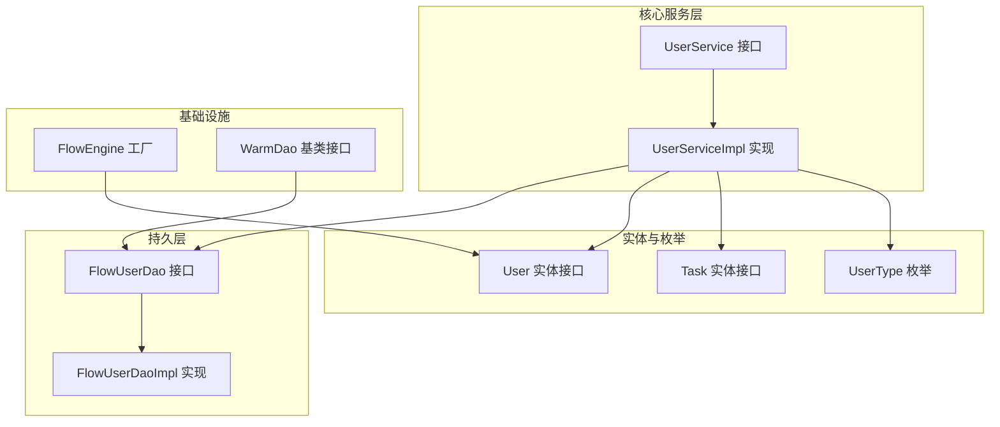
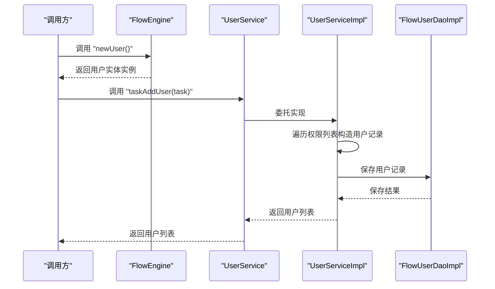
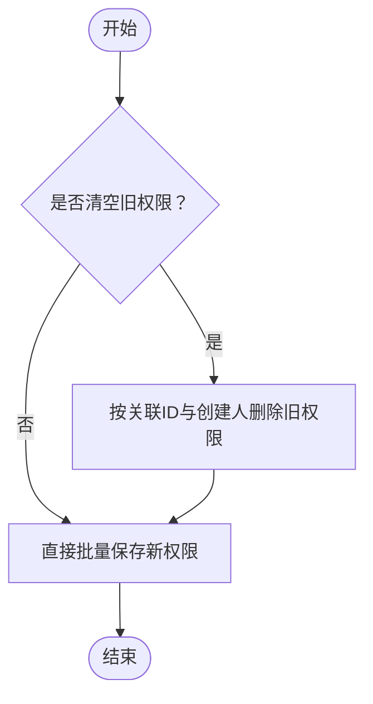
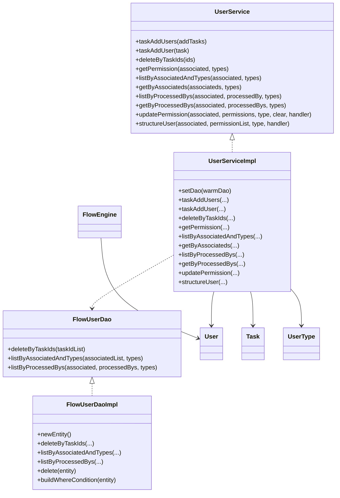

# 用户服务

<cite>
**本文引用的文件**
- [UserService.java](file://warm-flow-core/src/main/java/org/dromara/warm/flow/core/service/UserService.java)
- [UserServiceImpl.java](file://warm-flow-core/src/main/java/org/dromara/warm/flow/core/service/impl/UserServiceImpl.java)
- [User.java](file://warm-flow-core/src/main/java/org/dromara/warm/flow/core/entity/User.java)
- [Task.java](file://warm-flow-core/src/main/java/org/dromara/warm/flow/core/entity/Task.java)
- [UserType.java](file://warm-flow-core/src/main/java/org/dromara/warm/flow/core/enums/UserType.java)
- [FlowUserDao.java](file://warm-flow-core/src/main/java/org/dromara/warm/flow/core/orm/dao/FlowUserDao.java)
- [FlowUserDaoImpl.java](file://warm-flow-orm/warm-flow-easy-query/warm-flow-easy-query-core/src/main/java/org/dromara/warm/flow/orm/dao/FlowUserDaoImpl.java)
- [WarmDao.java](file://warm-flow-core/src/main/java/org/dromara/warm/flow/core/orm/dao/WarmDao.java)
- [FlowEngine.java](file://warm-flow-core/src/main/java/org/dromara/warm/flow/core/FlowEngine.java)
</cite>

## 目录
1. [简介](#简介)
2. [项目结构](#项目结构)
3. [核心组件](#核心组件)
4. [架构总览](#架构总览)
5. [详细组件分析](#详细组件分析)
6. [依赖分析](#依赖分析)
7. [性能考虑](#性能考虑)
8. [故障排查指南](#故障排查指南)
9. [结论](#结论)
10. [附录](#附录)

## 简介
本文件围绕用户服务展开，系统性解析 UserService 接口与 UserServiceImpl 实现，覆盖用户增删改查、用户信息管理、权限验证与用户在工作流引擎中的关键作用。重点阐述用户与任务、流程实例之间的关联关系，以及按部门、角色、权限等维度的查询能力。同时提供用户服务的使用示例，帮助开发者在工作流中正确管理与使用用户信息。

## 项目结构
用户服务位于核心模块中，采用“接口 + 实现 + DAO + 实体 + 枚举”的分层设计，配合流程引擎统一工厂方法创建用户实体，确保跨ORM适配的一致性。

图表来源
- [UserService.java:30-165](file://warm-flow-core/src/main/java/org/dromara/warm/flow/core/service/UserService.java#L30-L165)
- [UserServiceImpl.java:40-162](file://warm-flow-core/src/main/java/org/dromara/warm/flow/core/service/impl/UserServiceImpl.java#L40-L162)
- [FlowUserDao.java:28-58](file://warm-flow-core/src/main/java/org/dromara/warm/flow/core/orm/dao/FlowUserDao.java#L28-L58)
- [FlowUserDaoImpl.java:33-97](file://warm-flow-orm/warm-flow-easy-query/warm-flow-easy-query-core/src/main/java/org/dromara/warm/flow/orm/dao/FlowUserDaoImpl.java#L33-L97)
- [User.java:26-94](file://warm-flow-core/src/main/java/org/dromara/warm/flow/core/entity/User.java#L26-L94)
- [Task.java:27-135](file://warm-flow-core/src/main/java/org/dromara/warm/flow/core/entity/Task.java#L27-L135)
- [UserType.java:29-70](file://warm-flow-core/src/main/java/org/dromara/warm/flow/core/enums/UserType.java#L29-L70)
- [WarmDao.java:31-129](file://warm-flow-core/src/main/java/org/dromara/warm/flow/core/orm/dao/WarmDao.java#L31-L129)
- [FlowEngine.java:108-170](file://warm-flow-core/src/main/java/org/dromara/warm/flow/core/FlowEngine.java#L108-L170)

章节来源
- [UserService.java:30-165](file://warm-flow-core/src/main/java/org/dromara/warm/flow/core/service/UserService.java#L30-L165)
- [UserServiceImpl.java:40-162](file://warm-flow-core/src/main/java/org/dromara/warm/flow/core/service/impl/UserServiceImpl.java#L40-L162)
- [FlowUserDao.java:28-58](file://warm-flow-core/src/main/java/org/dromara/warm/flow/core/orm/dao/FlowUserDao.java#L28-L58)
- [FlowUserDaoImpl.java:33-97](file://warm-flow-orm/warm-flow-easy-query/warm-flow-easy-query-core/src/main/java/org/dromara/warm/flow/orm/dao/FlowUserDaoImpl.java#L33-L97)
- [User.java:26-94](file://warm-flow-core/src/main/java/org/dromara/warm/flow/core/entity/User.java#L26-L94)
- [Task.java:27-135](file://warm-flow-core/src/main/java/org/dromara/warm/flow/core/entity/Task.java#L27-L135)
- [UserType.java:29-70](file://warm-flow-core/src/main/java/org/dromara/warm/flow/core/enums/UserType.java#L29-L70)
- [WarmDao.java:31-129](file://warm-flow-core/src/main/java/org/dromara/warm/flow/core/orm/dao/WarmDao.java#L31-L129)
- [FlowEngine.java:108-170](file://warm-flow-core/src/main/java/org/dromara/warm/flow/core/FlowEngine.java#L108-L170)

## 核心组件
- UserService 接口：定义用户与流程关联的权限查询、用户构造、批量处理等能力，涵盖按任务、实例、历史节点等“关联ID”维度的用户查询与权限管理。
- UserServiceImpl 实现：具体业务逻辑，负责将任务中的权限列表转换为用户记录、按类型过滤查询、批量更新权限、清理与新增等。
- FlowUserDao 接口与 FlowUserDaoImpl 实现：DAO 层负责与数据库交互，提供按关联ID与类型组合查询、按处理人过滤、按任务ID批量删除等。
- User 实体接口：统一的用户实体契约，包含类型、处理人、关联ID、租户与软删等字段。
- Task 实体接口：流程任务实体，包含权限列表与用户列表，用于任务初始化时构建用户权限。
- UserType 枚举：用户类型常量，区分审批人、转办人、委托人等。
- FlowEngine：提供统一的实体工厂方法，便于在不同ORM适配下创建用户实体。

章节来源
- [UserService.java:30-165](file://warm-flow-core/src/main/java/org/dromara/warm/flow/core/service/UserService.java#L30-L165)
- [UserServiceImpl.java:40-162](file://warm-flow-core/src/main/java/org/dromara/warm/flow/core/service/impl/UserServiceImpl.java#L40-L162)
- [FlowUserDao.java:28-58](file://warm-flow-core/src/main/java/org/dromara/warm/flow/core/orm/dao/FlowUserDao.java#L28-L58)
- [FlowUserDaoImpl.java:33-97](file://warm-flow-orm/warm-flow-easy-query/warm-flow-easy-query-core/src/main/java/org/dromara/warm/flow/orm/dao/FlowUserDaoImpl.java#L33-L97)
- [User.java:26-94](file://warm-flow-core/src/main/java/org/dromara/warm/flow/core/entity/User.java#L26-L94)
- [Task.java:27-135](file://warm-flow-core/src/main/java/org/dromara/warm/flow/core/entity/Task.java#L27-L135)
- [UserType.java:29-70](file://warm-flow-core/src/main/java/org/dromara/warm/flow/core/enums/UserType.java#L29-L70)
- [FlowEngine.java:108-170](file://warm-flow-core/src/main/java/org/dromara/warm/flow/core/FlowEngine.java#L108-L170)

## 架构总览
用户服务在工作流引擎中的定位是“流程用户与权限的中枢”。它通过 FlowEngine.newUser() 统一创建用户实体，借助 UserServiceImpl 将任务权限映射为用户记录，再通过 FlowUserDaoImpl 进行持久化与查询。用户与任务、流程实例之间通过“关联ID”建立松耦合的多对多关系，支持按类型、处理人、权限标识等多维筛选。

图表来源
- [FlowEngine.java:156-162](file://warm-flow-core/src/main/java/org/dromara/warm/flow/core/FlowEngine.java#L156-L162)
- [UserServiceImpl.java:58-64](file://warm-flow-core/src/main/java/org/dromara/warm/flow/core/service/impl/UserServiceImpl.java#L58-L64)
- [FlowUserDaoImpl.java:36-38](file://warm-flow-orm/warm-flow-easy-query/warm-flow-easy-query-core/src/main/java/org/dromara/warm/flow/orm/dao/FlowUserDaoImpl.java#L36-L38)

## 详细组件分析

### UserService 接口设计
- 用户与任务关联：提供按任务列表/单个任务构造用户记录的能力，用于将任务的权限列表映射为审批人、转办人、委托人等。
- 权限查询：支持按关联ID与类型组合查询权限人或处理人，支持单类型与多类型混合查询；支持按处理人精确或集合查询。
- 权限更新：支持按关联ID清理旧权限后批量写入新权限，支持记录委派处理人。
- 用户构造：提供按权限标识与类型构造用户记录的方法，支持批量与单条构造。

章节来源
- [UserService.java:30-165](file://warm-flow-core/src/main/java/org/dromara/warm/flow/core/service/UserService.java#L30-L165)

### UserServiceImpl 实现细节
- 任务权限到用户记录的映射：遍历任务的权限列表，使用结构化方法构造用户记录并回填到任务对象。
- 权限查询分支：根据类型数组长度与是否为空，选择直接查询或走DAO的多类型查询，以减少不必要的数据库往返。
- 权限更新策略：当需要清空旧权限时，先按创建人与关联ID删除，再批量保存新权限，保证幂等与一致性。
- 用户构造：统一通过 FlowEngine.newUser() 创建实体，结合数据填充处理器生成主键等字段。

图表来源
- [UserServiceImpl.java:123-133](file://warm-flow-core/src/main/java/org/dromara/warm/flow/core/service/impl/UserServiceImpl.java#L123-L133)

章节来源
- [UserServiceImpl.java:40-162](file://warm-flow-core/src/main/java/org/dromara/warm/flow/core/service/impl/UserServiceImpl.java#L40-L162)

### FlowUserDao 与 FlowUserDaoImpl
- 删除按任务ID：支持按任务ID集合批量删除用户记录，便于任务撤销或重置。
- 多类型查询：支持按关联ID集合与类型数组进行组合查询，满足复杂权限场景。
- 按处理人查询：支持按关联ID、处理人集合与类型数组进行过滤查询。
- 条件构建：提供通用条件构建方法，支持按实体字段进行精确匹配。

章节来源
- [FlowUserDao.java:28-58](file://warm-flow-core/src/main/java/org/dromara/warm/flow/core/orm/dao/FlowUserDao.java#L28-L58)
- [FlowUserDaoImpl.java:33-97](file://warm-flow-orm/warm-flow-easy-query/warm-flow-easy-query-core/src/main/java/org/dromara/warm/flow/orm/dao/FlowUserDaoImpl.java#L33-L97)

### User 实体与 Task 实体
- User 实体：包含类型、处理人、关联ID、租户ID、软删标志等字段，用于承载流程中的各类用户角色。
- Task 实体：包含流程定义ID、实例ID、节点信息、业务ID、流程状态、权限列表与用户列表等，用于任务初始化与权限注入。

章节来源
- [User.java:26-94](file://warm-flow-core/src/main/java/org/dromara/warm/flow/core/entity/User.java#L26-L94)
- [Task.java:27-135](file://warm-flow-core/src/main/java/org/dromara/warm/flow/core/entity/Task.java#L27-L135)

### UserType 枚举
- 审批人：用于待办任务的审批权限。
- 转办人：用于待办任务的转办权限。
- 委托人：用于待办任务的委托权限。

章节来源
- [UserType.java:29-70](file://warm-flow-core/src/main/java/org/dromara/warm/flow/core/enums/UserType.java#L29-L70)

### FlowEngine 工厂方法
- 提供 newUser() 工厂方法，统一创建用户实体，便于在不同ORM适配下保持一致行为。
- 提供 setNewUser(...) 注册自定义用户实体实现，支持扩展。

章节来源
- [FlowEngine.java:156-162](file://warm-flow-core/src/main/java/org/dromara/warm/flow/core/FlowEngine.java#L156-L162)
- [FlowEngine.java:108-110](file://warm-flow-core/src/main/java/org/dromara/warm/flow/core/FlowEngine.java#L108-L110)

## 依赖分析
用户服务的依赖关系清晰，职责边界明确：接口层定义能力，实现层承接业务，DAO层负责持久化，实体与枚举提供数据模型与常量，FlowEngine提供统一实体工厂。

图表来源
- [UserService.java:30-165](file://warm-flow-core/src/main/java/org/dromara/warm/flow/core/service/UserService.java#L30-L165)
- [UserServiceImpl.java:40-162](file://warm-flow-core/src/main/java/org/dromara/warm/flow/core/service/impl/UserServiceImpl.java#L40-L162)
- [FlowUserDao.java:28-58](file://warm-flow-core/src/main/java/org/dromara/warm/flow/core/orm/dao/FlowUserDao.java#L28-L58)
- [FlowUserDaoImpl.java:33-97](file://warm-flow-orm/warm-flow-easy-query/warm-flow-easy-query-core/src/main/java/org/dromara/warm/flow/orm/dao/FlowUserDaoImpl.java#L33-L97)
- [User.java:26-94](file://warm-flow-core/src/main/java/org/dromara/warm/flow/core/entity/User.java#L26-L94)
- [Task.java:27-135](file://warm-flow-core/src/main/java/org/dromara/warm/flow/core/entity/Task.java#L27-L135)
- [UserType.java:29-70](file://warm-flow-core/src/main/java/org/dromara/warm/flow/core/enums/UserType.java#L29-L70)
- [FlowEngine.java:156-162](file://warm-flow-core/src/main/java/org/dromara/warm/flow/core/FlowEngine.java#L156-L162)

## 性能考虑
- 查询优化：当类型数组为空或仅有一个类型时，优先使用直接查询，避免不必要的多类型查询开销；当传入多个关联ID时，走DAO的批量查询以减少多次往返。
- 批量操作：权限更新采用批量保存，减少多次数据库往返；删除旧权限时按创建人与关联ID精确删除，避免误删。
- 数据填充：通过 FlowEngine 的数据填充处理器统一生成主键等字段，减少重复逻辑与潜在错误。

章节来源
- [UserServiceImpl.java:72-82](file://warm-flow-core/src/main/java/org/dromara/warm/flow/core/service/impl/UserServiceImpl.java#L72-L82)
- [UserServiceImpl.java:96-101](file://warm-flow-core/src/main/java/org/dromara/warm/flow/core/service/impl/UserServiceImpl.java#L96-L101)
- [UserServiceImpl.java:123-133](file://warm-flow-core/src/main/java/org/dromara/warm/flow/core/service/impl/UserServiceImpl.java#L123-L133)

## 故障排查指南
- 权限未生效：确认任务初始化时已将权限列表注入并调用用户构造方法；检查类型是否正确（审批人/转办人/委托人）。
- 查询不到用户：核对关联ID是否正确；确认类型数组是否为空或仅一个类型；若为多类型查询，确认DAO实现是否支持该组合。
- 更新失败：检查是否设置了清空旧权限；确认批量保存前的删除条件是否准确；查看数据填充处理器是否正常生成主键。
- 删除异常：确认按任务ID删除时传入的任务ID集合是否有效；检查DAO的删除条件构建是否包含必要字段。

章节来源
- [UserServiceImpl.java:58-64](file://warm-flow-core/src/main/java/org/dromara/warm/flow/core/service/impl/UserServiceImpl.java#L58-L64)
- [UserServiceImpl.java:123-133](file://warm-flow-core/src/main/java/org/dromara/warm/flow/core/service/impl/UserServiceImpl.java#L123-L133)
- [FlowUserDaoImpl.java:40-47](file://warm-flow-orm/warm-flow-easy-query/warm-flow-easy-query-core/src/main/java/org/dromara/warm/flow/orm/dao/FlowUserDaoImpl.java#L40-L47)
- [FlowUserDaoImpl.java:80-96](file://warm-flow-orm/warm-flow-easy-query/warm-flow-easy-query-core/src/main/java/org/dromara/warm/flow/orm/dao/FlowUserDaoImpl.java#L80-L96)

## 结论
用户服务通过清晰的接口与实现分离、DAO 层的多类型查询与批量操作、统一的实体工厂，实现了工作流中用户与任务、实例的高效关联与权限管理。开发者可基于此能力快速实现用户登录验证、用户信息更新、权限检查等常见场景，并在多ORM环境下保持一致的行为与性能表现。

## 附录

### 使用示例（步骤说明）
- 用户登录验证
  - 步骤1：通过 FlowEngine.newUser() 创建用户实体。
  - 步骤2：调用权限查询方法，按关联ID与类型获取处理人列表。
  - 步骤3：校验当前用户是否在返回列表中，完成登录验证。
  - 参考路径：[UserServiceImpl.java:72-82](file://warm-flow-core/src/main/java/org/dromara/warm/flow/core/service/impl/UserServiceImpl.java#L72-L82)

- 用户信息更新
  - 步骤1：准备新的权限标识列表与类型。
  - 步骤2：调用权限更新方法，设置清空旧权限与委派处理人。
  - 步骤3：等待批量保存完成，检查数据库记录。
  - 参考路径：[UserServiceImpl.java:123-133](file://warm-flow-core/src/main/java/org/dromara/warm/flow/core/service/impl/UserServiceImpl.java#L123-L133)

- 用户权限检查
  - 步骤1：确定关联ID（任务/实例/历史节点等）。
  - 步骤2：指定类型数组（可为空或多个类型）。
  - 步骤3：调用按关联ID与类型组合查询，获取用户列表。
  - 参考路径：[UserServiceImpl.java:84-93](file://warm-flow-core/src/main/java/org/dromara/warm/flow/core/service/impl/UserServiceImpl.java#L84-L93)

- 任务初始化时的用户构造
  - 步骤1：从任务对象获取权限列表。
  - 步骤2：调用用户构造方法，将权限映射为用户记录。
  - 步骤3：保存用户记录，以便后续权限校验与流转。
  - 参考路径：[UserServiceImpl.java:58-64](file://warm-flow-core/src/main/java/org/dromara/warm/flow/core/service/impl/UserServiceImpl.java#L58-L64)