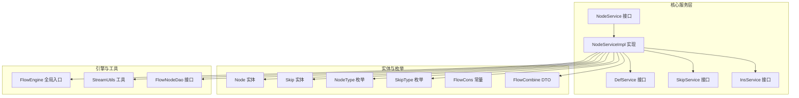
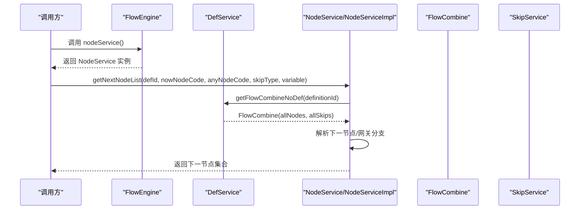
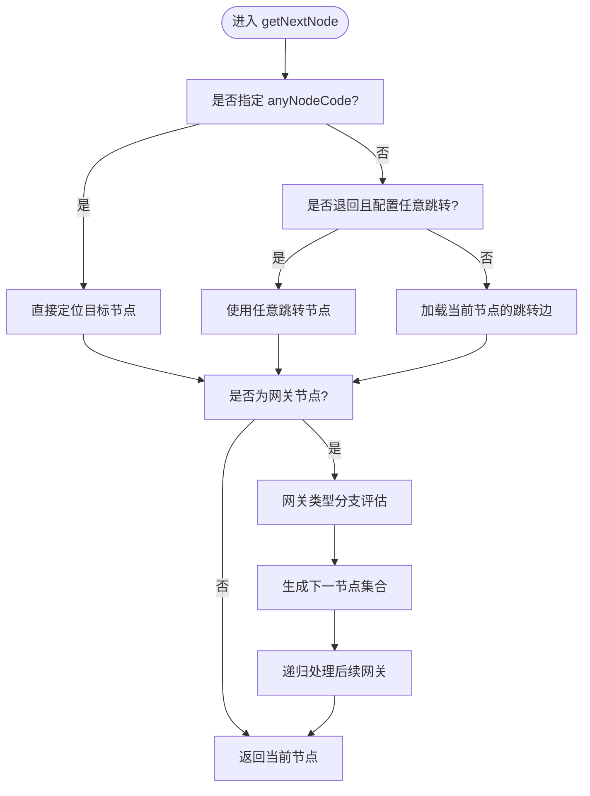
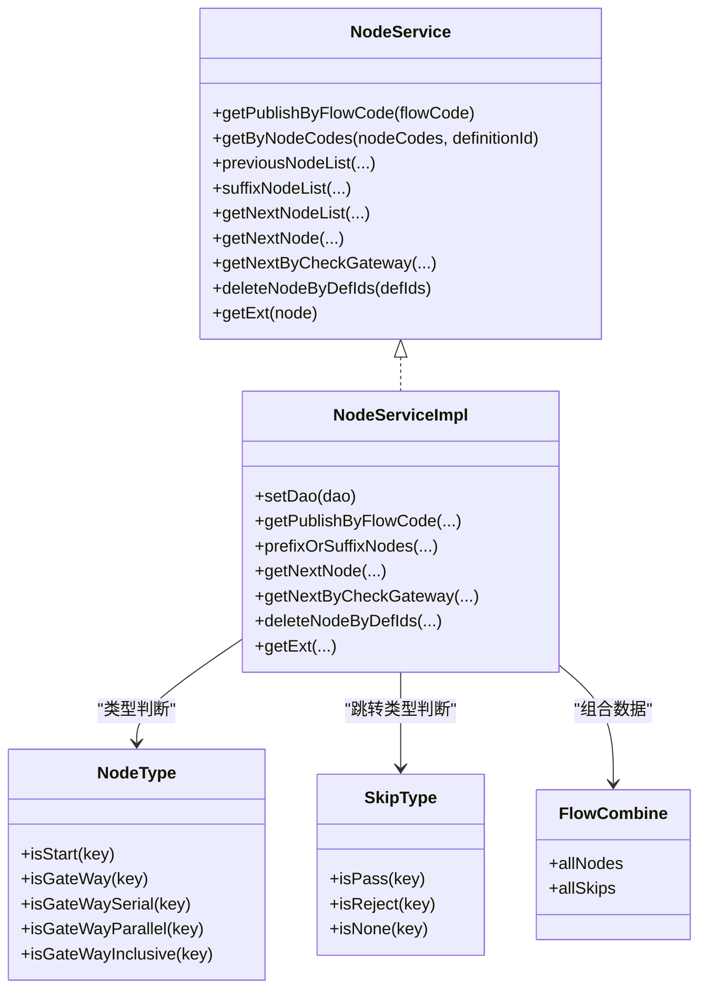

# 节点服务

<cite>
**本文引用的文件列表**
- [NodeService.java](file://warm-flow-core/src/main/java/org/dromara/warm/flow/core/service/NodeService.java)
- [NodeServiceImpl.java](file://warm-flow-core/src/main/java/org/dromara/warm/flow/core/service/impl/NodeServiceImpl.java)
- [NodeType.java](file://warm-flow-core/src/main/java/org/dromara/warm/flow/core/enums/NodeType.java)
- [Node.java](file://warm-flow-core/src/main/java/org/dromara/warm/flow/core/entity/Node.java)
- [Skip.java](file://warm-flow-core/src/main/java/org/dromara/warm/flow/core/entity/Skip.java)
- [FlowNodeDao.java](file://warm-flow-core/src/main/java/org/dromara/warm/flow/core/orm/dao/FlowNodeDao.java)
- [FlowCombine.java](file://warm-flow-core/src/main/java/org/dromara/warm/flow/core/dto/FlowCombine.java)
- [FlowCons.java](file://warm-flow-core/src/main/java/org/dromara/warm/flow/core/constant/FlowCons.java)
- [SkipType.java](file://warm-flow-core/src/main/java/org/dromara/warm/flow/core/enums/SkipType.java)
- [FlowEngine.java](file://warm-flow-core/src/main/java/org/dromara/warm/flow/core/FlowEngine.java)
- [StreamUtils.java](file://warm-flow-core/src/main/java/org/dromara/warm/flow/core/utils/StreamUtils.java)
</cite>

## 目录
1. [简介](#简介)
2. [项目结构](#项目结构)
3. [核心组件](#核心组件)
4. [架构总览](#架构总览)
5. [详细组件分析](#详细组件分析)
6. [依赖关系分析](#依赖关系分析)
7. [性能考量](#性能考量)
8. [故障排查指南](#故障排查指南)
9. [结论](#结论)
10. [附录：使用示例与配置指南](#附录使用示例与配置指南)

## 简介
本文件面向开发者，系统性解析节点服务模块，重点覆盖以下内容：
- NodeService 接口设计与职责边界
- NodeServiceImpl 实现细节与关键算法
- 节点类型管理（NodeType 枚举）与特性说明
- 节点属性配置与节点跳转规则（Skip）设置
- 节点在流程中的作用与生命周期（激活、挂起、删除）
- 使用示例与配置指南，帮助正确管理与操作流程节点

## 项目结构
节点服务位于 warm-flow-core 模块中，采用“接口 + 实现 + 枚举 + 实体 + DTO + 常量”的分层组织方式，配合 FlowEngine 提供的全局服务入口，形成清晰的服务调用链路。

图表来源
- [NodeService.java:1-229](file://warm-flow-core/src/main/java/org/dromara/warm/flow/core/service/NodeService.java#L1-L229)
- [NodeServiceImpl.java:1-368](file://warm-flow-core/src/main/java/org/dromara/warm/flow/core/service/impl/NodeServiceImpl.java#L1-L368)
- [NodeType.java:1-161](file://warm-flow-core/src/main/java/org/dromara/warm/flow/core/enums/NodeType.java#L1-L161)
- [Node.java:1-162](file://warm-flow-core/src/main/java/org/dromara/warm/flow/core/entity/Node.java#L1-L162)
- [Skip.java:1-128](file://warm-flow-core/src/main/java/org/dromara/warm/flow/core/entity/Skip.java#L1-L128)
- [FlowCombine.java:1-59](file://warm-flow-core/src/main/java/org/dromara/warm/flow/core/dto/FlowCombine.java#L1-L59)
- [FlowCons.java:1-85](file://warm-flow-core/src/main/java/org/dromara/warm/flow/core/constant/FlowCons.java#L1-L85)
- [SkipType.java:1-101](file://warm-flow-core/src/main/java/org/dromara/warm/flow/core/enums/SkipType.java#L1-L101)
- [FlowEngine.java:65-115](file://warm-flow-core/src/main/java/org/dromara/warm/flow/core/FlowEngine.java#L65-L115)
- [StreamUtils.java:1-200](file://warm-flow-core/src/main/java/org/dromara/warm/flow/core/utils/StreamUtils.java#L1-L200)
- [FlowNodeDao.java:1-43](file://warm-flow-core/src/main/java/org/dromara/warm/flow/core/orm/dao/FlowNodeDao.java#L1-L43)

章节来源
- [NodeService.java:1-229](file://warm-flow-core/src/main/java/org/dromara/warm/flow/core/service/NodeService.java#L1-L229)
- [NodeServiceImpl.java:1-368](file://warm-flow-core/src/main/java/org/dromara/warm/flow/core/service/impl/NodeServiceImpl.java#L1-L368)

## 核心组件
- NodeService：定义节点查询、前后置节点检索、下一节点计算、网关跳转判定、批量删除、节点扩展属性读取等能力。
- NodeServiceImpl：基于 FlowEngine 与 FlowCombine 组合数据，实现节点导航、跳转规则解析、网关分支选择、路径记录等逻辑。
- NodeType：统一管理节点类型（开始、中间、结束、互斥/并行/包容网关），提供类型判断工具方法。
- SkipType：统一管理审批动作（通过、退回、无动作），提供类型判断工具方法。
- Node/Skip：节点与跳转边的实体模型，承载节点属性与跳转条件。
- FlowCombine：流程数据聚合载体，包含所有节点与跳转边，便于一次性计算。
- FlowCons：流程相关常量（如 previous/suffix 标识、表单定制标记等）。
- FlowEngine：全局服务入口，提供 DefService/NodeService/SkipService 等服务实例。

章节来源
- [NodeService.java:34-229](file://warm-flow-core/src/main/java/org/dromara/warm/flow/core/service/NodeService.java#L34-L229)
- [NodeServiceImpl.java:48-368](file://warm-flow-core/src/main/java/org/dromara/warm/flow/core/service/impl/NodeServiceImpl.java#L48-L368)
- [NodeType.java:30-161](file://warm-flow-core/src/main/java/org/dromara/warm/flow/core/enums/NodeType.java#L30-L161)
- [SkipType.java:30-101](file://warm-flow-core/src/main/java/org/dromara/warm/flow/core/enums/SkipType.java#L30-L101)
- [Node.java:30-162](file://warm-flow-core/src/main/java/org/dromara/warm/flow/core/entity/Node.java#L30-L162)
- [Skip.java:28-128](file://warm-flow-core/src/main/java/org/dromara/warm/flow/core/entity/Skip.java#L28-L128)
- [FlowCombine.java:42-59](file://warm-flow-core/src/main/java/org/dromara/warm/flow/core/dto/FlowCombine.java#L42-L59)
- [FlowCons.java:25-85](file://warm-flow-core/src/main/java/org/dromara/warm/flow/core/constant/FlowCons.java#L25-L85)
- [FlowEngine.java:72-115](file://warm-flow-core/src/main/java/org/dromara/warm/flow/core/FlowEngine.java#L72-L115)

## 架构总览
节点服务围绕“流程定义 + 节点 + 跳转边”三元组工作，通过 FlowEngine 获取定义与组合数据，再由 NodeServiceImpl 进行导航与决策。

图表来源
- [NodeServiceImpl.java:167-185](file://warm-flow-core/src/main/java/org/dromara/warm/flow/core/service/impl/NodeServiceImpl.java#L167-L185)
- [FlowEngine.java:76-115](file://warm-flow-core/src/main/java/org/dromara/warm/flow/core/FlowEngine.java#L76-L115)

## 详细组件分析

### NodeService 接口设计
- 查询类方法：按流程编码获取已发布节点、按节点编码集合查询、按定义 ID 查询、按定义 ID+节点编码查询、开始/中间/结束节点查询、首个中间节点查询。
- 导航类方法：前/后置节点列表、下一节点集合与单个节点、带路径记录的下一节点计算。
- 网关处理：根据变量与网关类型（互斥/包容）计算分支，支持任意跳转与退回路径优先级。
- 删除与扩展：按定义 ID 批量删除节点；读取节点扩展属性（ext 字段）。

章节来源
- [NodeService.java:34-229](file://warm-flow-core/src/main/java/org/dromara/warm/flow/core/service/NodeService.java#L34-L229)

### NodeServiceImpl 实现要点
- 基于 FlowEngine 获取 FlowCombine（全部节点与跳转边），避免多次数据库查询。
- 前/后置节点计算：通过 Skip 关系映射，递归遍历并去重，保证结果稳定且无环。
- 下一节点计算：支持 anyNodeCode 任意跳转、退回时的任意跳转配置、跳转类型匹配、路径记录。
- 网关分支选择：
  - 互斥网关：优先匹配条件表达式，未匹配则取默认分支。
  - 包容网关：仅保留满足条件的分支，未设置条件的分支默认执行。
- 扩展属性解析：从节点 ext 字段解析为键值对映射，便于 UI 或业务扩展。

图表来源
- [NodeServiceImpl.java:196-233](file://warm-flow-core/src/main/java/org/dromara/warm/flow/core/service/impl/NodeServiceImpl.java#L196-L233)
- [NodeServiceImpl.java:235-288](file://warm-flow-core/src/main/java/org/dromara/warm/flow/core/service/impl/NodeServiceImpl.java#L235-L288)

章节来源
- [NodeServiceImpl.java:48-368](file://warm-flow-core/src/main/java/org/dromara/warm/flow/core/service/impl/NodeServiceImpl.java#L48-L368)

### 节点类型管理（NodeType）
- 类型定义：开始、中间、结束、互斥网关、并行网关、包容网关。
- 类型判断：提供 isStart/isBetween/isEnd/isGateWay/isGateWaySerial/isGateWayParallel/isGateWayInclusive 等静态方法，便于在流程控制中快速判断节点角色。
- 使用场景：
  - 开始/结束：流程起点与终点，通常不允许被退回或作为下一节点。
  - 中间：普通处理节点，线性流转。
  - 互斥网关：二选一或多选一分支，适合互斥条件判断。
  - 并行网关：并行分支汇聚，适合并行处理。
  - 包容网关：条件分支，满足条件才执行。

章节来源
- [NodeType.java:30-161](file://warm-flow-core/src/main/java/org/dromara/warm/flow/core/enums/NodeType.java#L30-L161)

### 节点属性配置
- Node 实体字段涵盖：节点类型、所属定义、节点编码/名称、坐标、权限标志、监听器类型/路径、表单定制与路径、扩展字段等。
- 扩展字段（ext）：通过 getExt 方法解析为 Map，便于 UI 或业务系统扩展节点属性。
- 任意跳转（anyNodeSkip）：在退回场景下可直接跳转至指定节点，提升流程灵活性。

章节来源
- [Node.java:74-162](file://warm-flow-core/src/main/java/org/dromara/warm/flow/core/entity/Node.java#L74-L162)
- [NodeServiceImpl.java:296-314](file://warm-flow-core/src/main/java/org/dromara/warm/flow/core/service/impl/NodeServiceImpl.java#L296-L314)

### 节点跳转规则（Skip 与 SkipType）
- Skip 实体描述节点之间的跳转关系，包含当前节点编码、下一节点编码、跳转类型、跳转条件表达式、坐标等。
- SkipType：审批动作（通过/退回/无动作），提供 isPass/isReject/isNone 判断。
- 跳转规则匹配：根据 skipType 与节点配置，选择合适的跳转边；网关节点根据条件表达式动态选择分支。

章节来源
- [Skip.java:72-128](file://warm-flow-core/src/main/java/org/dromara/warm/flow/core/entity/Skip.java#L72-L128)
- [SkipType.java:30-101](file://warm-flow-core/src/main/java/org/dromara/warm/flow/core/enums/SkipType.java#L30-L101)
- [NodeServiceImpl.java:359-366](file://warm-flow-core/src/main/java/org/dromara/warm/flow/core/service/impl/NodeServiceImpl.java#L359-L366)

### 节点在流程中的作用与生命周期
- 作用：节点是流程执行的基本单元，负责任务分配、监听器触发、表单展示、条件判断与分支选择。
- 生命周期：
  - 创建：通过 UI 设计或导入生成节点与跳转边。
  - 发布：将流程定义发布为可用版本，节点随之生效。
  - 运行：根据当前节点与变量，计算下一节点集合，支持网关分支与路径记录。
  - 结束：到达结束节点后流程终止。
  - 删除：支持按定义 ID 批量删除节点，清理历史数据。

章节来源
- [NodeService.java:214-229](file://warm-flow-core/src/main/java/org/dromara/warm/flow/core/service/NodeService.java#L214-L229)
- [NodeServiceImpl.java:291-294](file://warm-flow-core/src/main/java/org/dromara/warm/flow/core/service/impl/NodeServiceImpl.java#L291-L294)

## 依赖关系分析
- NodeServiceImpl 依赖 FlowEngine 获取 DefService/SkipService/全局 JSON 转换器等。
- 前/后置节点计算依赖 FlowCombine（allNodes/allSkips）与 SkipType 过滤。
- 网关分支选择依赖表达式工具（ExpressionUtil）与变量上下文。
- DAO 层提供按节点编码集合查询与批量删除能力，减少上层重复逻辑。

图表来源
- [NodeService.java:34-229](file://warm-flow-core/src/main/java/org/dromara/warm/flow/core/service/NodeService.java#L34-L229)
- [NodeServiceImpl.java:48-368](file://warm-flow-core/src/main/java/org/dromara/warm/flow/core/service/impl/NodeServiceImpl.java#L48-L368)
- [NodeType.java:30-161](file://warm-flow-core/src/main/java/org/dromara/warm/flow/core/enums/NodeType.java#L30-L161)
- [SkipType.java:30-101](file://warm-flow-core/src/main/java/org/dromara/warm/flow/core/enums/SkipType.java#L30-L101)
- [FlowCombine.java:42-59](file://warm-flow-core/src/main/java/org/dromara/warm/flow/core/dto/FlowCombine.java#L42-L59)

章节来源
- [NodeServiceImpl.java:132-165](file://warm-flow-core/src/main/java/org/dromara/warm/flow/core/service/impl/NodeServiceImpl.java#L132-L165)
- [FlowNodeDao.java:31-42](file://warm-flow-core/src/main/java/org/dromara/warm/flow/core/orm/dao/FlowNodeDao.java#L31-L42)

## 性能考量
- 数据聚合：通过 FlowCombine 一次性加载 allNodes/allSkips，避免多次数据库往返。
- 去重与防环：前/后置节点计算与网关分支选择均采用 visited 集合与去重策略，避免重复计算与死循环。
- 条件表达式：网关分支仅在必要时评估表达式，优先匹配空条件分支，降低计算开销。
- 批量操作：按定义 ID 批量删除节点，减少事务与网络开销。

章节来源
- [NodeServiceImpl.java:132-165](file://warm-flow-core/src/main/java/org/dromara/warm/flow/core/service/impl/NodeServiceImpl.java#L132-L165)
- [NodeServiceImpl.java:316-347](file://warm-flow-core/src/main/java/org/dromara/warm/flow/core/service/impl/NodeServiceImpl.java#L316-L347)

## 故障排查指南
- 缺失节点编码：当传入节点编码为空时抛出异常，检查流程设计或调用参数。
- 未找到下一节点：当前节点无有效跳转边或跳转类型不匹配，检查 Skip 配置与变量。
- 网关条件不满足：包容网关可能因条件不满足导致分支为空，检查表达式与变量。
- 任意跳转非网关：anyNodeCode 指定的目标必须为网关节点，否则抛出异常。
- 起点禁止退回：开始节点不允许作为下一节点，检查退回逻辑与 anyNodeSkip 配置。

章节来源
- [NodeServiceImpl.java:170-233](file://warm-flow-core/src/main/java/org/dromara/warm/flow/core/service/impl/NodeServiceImpl.java#L170-L233)
- [NodeServiceImpl.java:235-288](file://warm-flow-core/src/main/java/org/dromara/warm/flow/core/service/impl/NodeServiceImpl.java#L235-L288)

## 结论
节点服务通过清晰的接口与稳健的实现，提供了从节点查询、导航、网关分支到路径记录的全流程能力。结合 NodeType 与 SkipType 的类型体系，以及 FlowCombine 的数据聚合，能够高效支撑复杂流程的运行与扩展。建议在实际使用中：
- 明确节点类型与跳转规则，确保网关条件与变量一致
- 合理使用 anyNodeSkip 与退回路径，避免逻辑歧义
- 通过扩展字段（ext）增强节点属性，满足业务定制需求
- 使用批量删除与组合数据，优化性能与一致性

## 附录：使用示例与配置指南

### 使用示例（调用路径参考）
- 获取已发布流程的所有节点
  - 参考：[NodeServiceImpl.java:57-64](file://warm-flow-core/src/main/java/org/dromara/warm/flow/core/service/impl/NodeServiceImpl.java#L57-L64)
- 获取某一定义下的开始/结束/中间节点
  - 参考：[NodeServiceImpl.java:109-130](file://warm-flow-core/src/main/java/org/dromara/warm/flow/core/service/impl/NodeServiceImpl.java#L109-L130)
- 获取某一节点的前/后置节点集合
  - 参考：[NodeServiceImpl.java:78-96](file://warm-flow-core/src/main/java/org/dromara/warm/flow/core/service/impl/NodeServiceImpl.java#L78-L96)
- 计算下一节点（含网关分支）
  - 参考：[NodeServiceImpl.java:167-185](file://warm-flow-core/src/main/java/org/dromara/warm/flow/core/service/impl/NodeServiceImpl.java#L167-L185)
- 任意跳转与退回优先级
  - 参考：[NodeServiceImpl.java:206-217](file://warm-flow-core/src/main/java/org/dromara/warm/flow/core/service/impl/NodeServiceImpl.java#L206-L217)
- 批量删除节点
  - 参考：[NodeServiceImpl.java:291-294](file://warm-flow-core/src/main/java/org/dromara/warm/flow/core/service/impl/NodeServiceImpl.java#L291-L294)
- 读取节点扩展属性
  - 参考：[NodeServiceImpl.java:296-314](file://warm-flow-core/src/main/java/org/dromara/warm/flow/core/service/impl/NodeServiceImpl.java#L296-L314)

### 配置指南
- 节点类型选择
  - 开始/结束：用于流程起点与终点，避免退回与作为下一节点
  - 中间：普通处理节点，适合线性流程
  - 互斥/包容网关：用于条件分支，注意表达式与变量一致性
- 跳转规则设置
  - 设置跳转类型（通过/退回/无动作）与条件表达式
  - 任意跳转（anyNodeSkip）仅适用于退回场景，且目标必须为网关
- 扩展属性（ext）
  - 通过 JSON 数组形式配置键值对，便于 UI 或业务扩展

章节来源
- [NodeType.java:30-161](file://warm-flow-core/src/main/java/org/dromara/warm/flow/core/enums/NodeType.java#L30-L161)
- [SkipType.java:30-101](file://warm-flow-core/src/main/java/org/dromara/warm/flow/core/enums/SkipType.java#L30-L101)
- [Node.java:122-124](file://warm-flow-core/src/main/java/org/dromara/warm/flow/core/entity/Node.java#L122-L124)
- [NodeServiceImpl.java:296-314](file://warm-flow-core/src/main/java/org/dromara/warm/flow/core/service/impl/NodeServiceImpl.java#L296-L314)