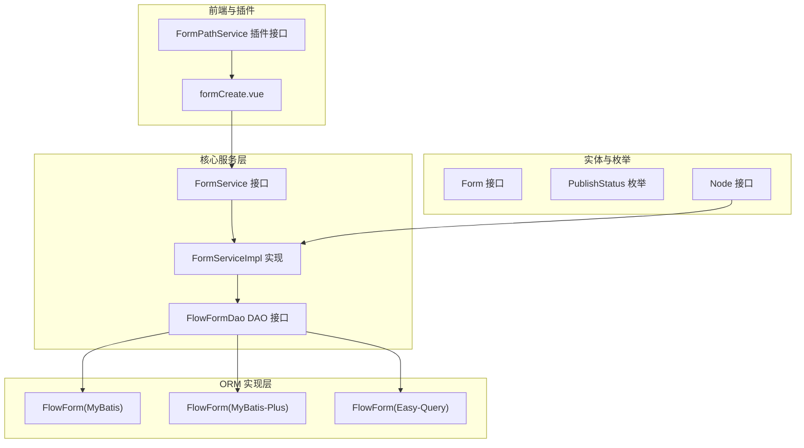
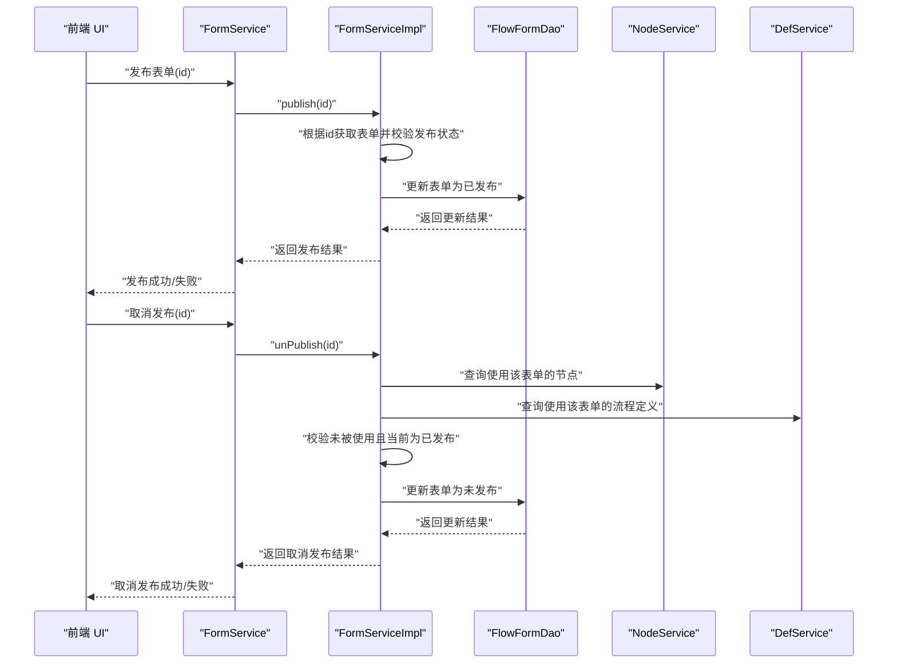
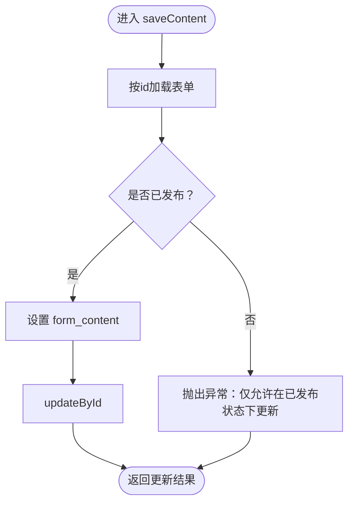
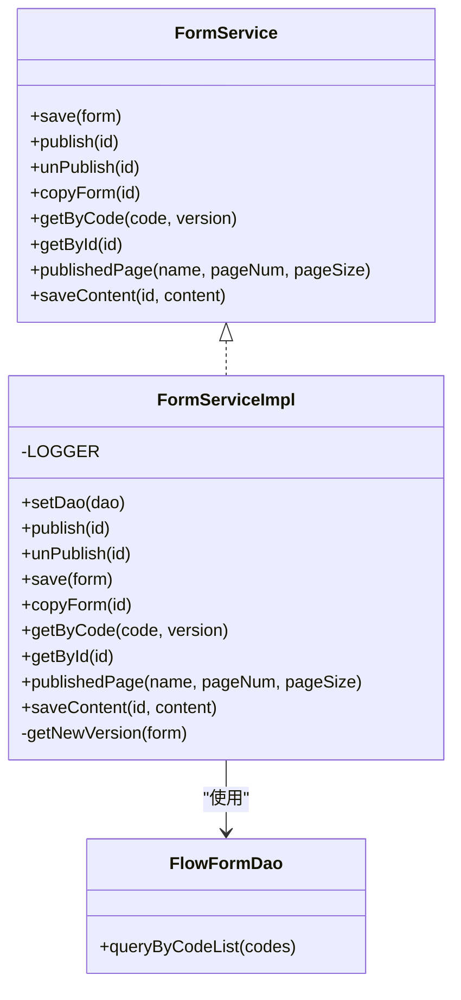

# 表单服务

<cite>
**本文引用的文件**
- [FormService.java](file://warm-flow-core/src/main/java/org/dromara/warm/flow/core/service/FormService.java)
- [FormServiceImpl.java](file://warm-flow-core/src/main/java/org/dromara/warm/flow/core/service/impl/FormServiceImpl.java)
- [Form.java](file://warm-flow-core/src/main/java/org/dromara/warm/flow/core/entity/Form.java)
- [FlowFormDao.java](file://warm-flow-core/src/main/java/org/dromara/warm/flow/core/orm/dao/FlowFormDao.java)
- [PublishStatus.java](file://warm-flow-core/src/main/java/org/dromara/warm/flow/core/enums/PublishStatus.java)
- [Node.java](file://warm-flow-core/src/main/java/org/dromara/warm/flow/core/entity/Node.java)
- [FlowForm.java（MyBatis 实现）](file://warm-flow-orm/warm-flow-mybatis/warm-flow-mybatis-core/src/main/java/org/dromara/warm/flow/orm/entity/FlowForm.java)
- [FlowForm.java（MyBatis-Plus 实现）](file://warm-flow-orm/warm-flow-mybatis-plus/warm-flow-mybatis-plus-core/src/main/java/org/dromara/warm/flow/orm/entity/FlowForm.java)
- [FlowForm.java（Easy-Query 实现）](file://warm-flow-orm/warm-flow-easy-query/warm-flow-easy-query-core/src/main/java/org/dromara/warm/flow/orm/entity/FlowForm.java)
- [formCreate.vue](file://warm-flow-ui/src/components/form/formCreate.vue)
- [FormPathService.java](file://warm-flow-plugin/warm-flow-plugin-ui/warm-flow-plugin-ui-core/src/main/java/org/dromara/warm/flow/ui/service/FormPathService.java)
</cite>

## 目录
1. [简介](#简介)
2. [项目结构](#项目结构)
3. [核心组件](#核心组件)
4. [架构总览](#架构总览)
5. [详细组件分析](#详细组件分析)
6. [依赖关系分析](#依赖关系分析)
7. [性能考量](#性能考量)
8. [故障排查指南](#故障排查指南)
9. [结论](#结论)
10. [附录：使用示例与最佳实践](#附录使用示例与最佳实践)

## 简介
本文件系统性梳理“表单服务”的设计与实现，围绕 FormService 接口与其核心实现 FormServiceImpl 展开，覆盖表单的创建、复制、发布/取消发布、按编码与版本查询、分页查询已发布表单、保存表单内容等能力。同时阐明表单在工作流中的角色：作为流程节点的“审批表单”承载业务数据与交互；解释表单与流程节点的关联关系（节点可指向内置表单或外挂表单路径），以及表单数据的存储与管理机制（内置表单存 form_content，外挂表单存 form_path）。文档还分析了版本管理策略、字段配置与验证规则的落地方式，并给出在工作流中正确使用与管理业务表单的操作建议。

## 项目结构
表单服务位于核心模块 warm-flow-core 中，采用“接口 + 抽象基类 + ORM DAO 接口”的分层设计；ORM 层由多套实现（MyBatis、MyBatis-Plus、Easy-Query）提供具体持久化能力；UI 层通过 formCreate.vue 提供表单渲染与交互；插件层提供自定义表单路径查询能力。

图表来源
- [FormService.java:28-98](file://warm-flow-core/src/main/java/org/dromara/warm/flow/core/service/FormService.java#L28-L98)
- [FormServiceImpl.java:44-146](file://warm-flow-core/src/main/java/org/dromara/warm/flow/core/service/impl/FormServiceImpl.java#L44-L146)
- [FlowFormDao.java:30-32](file://warm-flow-core/src/main/java/org/dromara/warm/flow/core/orm/dao/FlowFormDao.java#L30-L32)
- [Form.java:26-111](file://warm-flow-core/src/main/java/org/dromara/warm/flow/core/entity/Form.java#L26-L111)
- [PublishStatus.java:29-38](file://warm-flow-core/src/main/java/org/dromara/warm/flow/core/enums/PublishStatus.java#L29-L38)
- [Node.java:113-124](file://warm-flow-core/src/main/java/org/dromara/warm/flow/core/entity/Node.java#L113-L124)
- [FlowForm.java（MyBatis 实现）:52-107](file://warm-flow-orm/warm-flow-mybatis/warm-flow-mybatis-core/src/main/java/org/dromara/warm/flow/orm/entity/FlowForm.java#L52-L107)
- [FlowForm.java（MyBatis-Plus 实现）:47-115](file://warm-flow-orm/warm-flow-mybatis-plus/warm-flow-mybatis-plus-core/src/main/java/org/dromara/warm/flow/orm/entity/FlowForm.java#L47-L115)
- [FlowForm.java（Easy-Query 实现）:45-114](file://warm-flow-orm/warm-flow-easy-query/warm-flow-easy-query-core/src/main/java/org/dromara/warm/flow/orm/entity/FlowForm.java#L45-L114)
- [formCreate.vue:1-40](file://warm-flow-ui/src/components/form/formCreate.vue#L1-L40)
- [FormPathService.java:28-36](file://warm-flow-plugin/warm-flow-plugin-ui/warm-flow-plugin-ui-core/src/main/java/org/dromara/warm/flow/ui/service/FormPathService.java#L28-L36)

章节来源
- [FormService.java:28-98](file://warm-flow-core/src/main/java/org/dromara/warm/flow/core/service/FormService.java#L28-L98)
- [FormServiceImpl.java:44-146](file://warm-flow-core/src/main/java/org/dromara/warm/flow/core/service/impl/FormServiceImpl.java#L44-L146)
- [FlowFormDao.java:30-32](file://warm-flow-core/src/main/java/org/dromara/warm/flow/core/orm/dao/FlowFormDao.java#L30-L32)
- [Form.java:26-111](file://warm-flow-core/src/main/java/org/dromara/warm/flow/core/entity/Form.java#L26-L111)
- [PublishStatus.java:29-38](file://warm-flow-core/src/main/java/org/dromara/warm/flow/core/enums/PublishStatus.java#L29-L38)
- [Node.java:113-124](file://warm-flow-core/src/main/java/org/dromara/warm/flow/core/entity/Node.java#L113-L124)
- [FlowForm.java（MyBatis 实现）:52-107](file://warm-flow-orm/warm-flow-mybatis/warm-flow-mybatis-core/src/main/java/org/dromara/warm/flow/orm/entity/FlowForm.java#L52-L107)
- [FlowForm.java（MyBatis-Plus 实现）:47-115](file://warm-flow-orm/warm-flow-mybatis-plus/warm-flow-mybatis-plus-core/src/main/java/org/dromara/warm/flow/orm/entity/FlowForm.java#L47-L115)
- [FlowForm.java（Easy-Query 实现）:45-114](file://warm-flow-orm/warm-flow-easy-query/warm-flow-easy-query-core/src/main/java/org/dromara/warm/flow/orm/entity/FlowForm.java#L45-L114)
- [formCreate.vue:1-40](file://warm-flow-ui/src/components/form/formCreate.vue#L1-L40)
- [FormPathService.java:28-36](file://warm-flow-plugin/warm-flow-plugin-ui/warm-flow-plugin-ui-core/src/main/java/org/dromara/warm/flow/ui/service/FormPathService.java#L28-L36)

## 核心组件
- FormService 接口：定义表单服务的对外能力，包括保存、发布/取消发布、复制、按编码版本查询、按主键查询、分页查询已发布表单、保存表单内容等。
- FormServiceImpl 实现：基于抽象基类 WarmServiceImpl 扩展，完成版本号生成、发布状态校验、与流程节点/定义的关联校验、内容保存等逻辑。
- Form 实体接口：统一表单的字段契约（编码、名称、版本、发布状态、类型、内容/路径、扩展字段等）。
- FlowFormDao DAO 接口：ORM 层适配入口，提供按表单编码列表查询的能力。
- PublishStatus 枚举：标准化发布状态（未发布、已发布、已失效）。
- Node 实体：流程节点包含“审批表单是否自定义”和“表单路径”，用于与表单建立关联。
- ORM 实体 FlowForm：不同 ORM 实现下的具体映射类，承载表单持久化字段。
- UI 组件 formCreate.vue：负责加载表单内容、渲染规则与选项、提交审批意见与按钮。
- 插件接口 FormPathService：允许自定义表单路径树形结构，供 UI 选择。

章节来源
- [FormService.java:28-98](file://warm-flow-core/src/main/java/org/dromara/warm/flow/core/service/FormService.java#L28-L98)
- [FormServiceImpl.java:44-146](file://warm-flow-core/src/main/java/org/dromara/warm/flow/core/service/impl/FormServiceImpl.java#L44-L146)
- [Form.java:26-111](file://warm-flow-core/src/main/java/org/dromara/warm/flow/core/entity/Form.java#L26-L111)
- [FlowFormDao.java:30-32](file://warm-flow-core/src/main/java/org/dromara/warm/flow/core/orm/dao/FlowFormDao.java#L30-L32)
- [PublishStatus.java:29-38](file://warm-flow-core/src/main/java/org/dromara/warm/flow/core/enums/PublishStatus.java#L29-L38)
- [Node.java:113-124](file://warm-flow-core/src/main/java/org/dromara/warm/flow/core/entity/Node.java#L113-L124)
- [FlowForm.java（MyBatis 实现）:52-107](file://warm-flow-orm/warm-flow-mybatis/warm-flow-mybatis-core/src/main/java/org/dromara/warm/flow/orm/entity/FlowForm.java#L52-L107)
- [FlowForm.java（MyBatis-Plus 实现）:47-115](file://warm-flow-orm/warm-flow-mybatis-plus/warm-flow-mybatis-plus-core/src/main/java/org/dromara/warm/flow/orm/entity/FlowForm.java#L47-L115)
- [FlowForm.java（Easy-Query 实现）:45-114](file://warm-flow-orm/warm-flow-easy-query/warm-flow-easy-query-core/src/main/java/org/dromara/warm/flow/orm/entity/FlowForm.java#L45-L114)
- [formCreate.vue:1-40](file://warm-flow-ui/src/components/form/formCreate.vue#L1-L40)
- [FormPathService.java:28-36](file://warm-flow-plugin/warm-flow-plugin-ui/warm-flow-plugin-ui-core/src/main/java/org/dromara/warm/flow/ui/service/FormPathService.java#L28-L36)

## 架构总览
表单服务在工作流中的定位是“业务表单承载层”。流程节点通过 formCustom 与 formPath 关联到表单：若 formCustom 为“是”，则节点使用内置表单内容；否则使用外挂表单路径。表单服务负责表单的生命周期管理（创建、复制、发布/取消发布）、版本控制、内容持久化与查询。

图表来源
- [FormServiceImpl.java:55-72](file://warm-flow-core/src/main/java/org/dromara/warm/flow/core/service/impl/FormServiceImpl.java#L55-L72)
- [Node.java:113-124](file://warm-flow-core/src/main/java/org/dromara/warm/flow/core/entity/Node.java#L113-L124)
- [FormService.java:45-54](file://warm-flow-core/src/main/java/org/dromara/warm/flow/core/service/FormService.java#L45-L54)

## 详细组件分析

### FormService 接口与职责
- 保存表单：委托给实现层进行版本生成与持久化。
- 发布/取消发布：对发布状态进行约束与校验，确保安全变更。
- 复制表单：克隆现有表单并生成新版本，清空时间与ID，重置发布状态。
- 查询：支持按编码+版本精确查询、按主键查询、分页查询已发布表单。
- 保存表单内容：仅允许在已发布状态下更新表单内容，防止未发布内容被误用。

章节来源
- [FormService.java:28-98](file://warm-flow-core/src/main/java/org/dromara/warm/flow/core/service/FormService.java#L28-L98)

### FormServiceImpl 实现细节
- 版本管理：根据同一表单编码的历史版本计算最高版本号，生成下一个版本字符串。
- 发布流程：获取表单并校验当前状态，设置为已发布后更新。
- 取消发布：先检查是否存在节点或流程定义引用该表单，若存在则拒绝；若不存在且当前为已发布，则设置为未发布。
- 内容保存：仅允许在已发布状态下更新 form_content 字段。
- 复制流程：深拷贝原表单，清空ID与时间戳，重置发布状态与版本后保存。

图表来源
- [FormServiceImpl.java:113-119](file://warm-flow-core/src/main/java/org/dromara/warm/flow/core/service/impl/FormServiceImpl.java#L113-L119)

章节来源
- [FormServiceImpl.java:44-146](file://warm-flow-core/src/main/java/org/dromara/warm/flow/core/service/impl/FormServiceImpl.java#L44-L146)
- [PublishStatus.java:29-38](file://warm-flow-core/src/main/java/org/dromara/warm/flow/core/enums/PublishStatus.java#L29-L38)

### 表单实体与字段契约
- 基础字段：id、创建/更新时间、创建者/更新者、租户ID、删除标记。
- 表单标识：formCode、formName、version。
- 发布状态：isPublish（0未发布、1已发布、9失效）。
- 类型与内容：formType（0内置表单存 form_content，1外挂表单存 form_path）。
- 扩展字段：ext 供业务自定义使用。

章节来源
- [Form.java:26-111](file://warm-flow-core/src/main/java/org/dromara/warm/flow/core/entity/Form.java#L26-L111)
- [FlowForm.java（MyBatis 实现）:52-107](file://warm-flow-orm/warm-flow-mybatis/warm-flow-mybatis-core/src/main/java/org/dromara/warm/flow/orm/entity/FlowForm.java#L52-L107)
- [FlowForm.java（MyBatis-Plus 实现）:47-115](file://warm-flow-orm/warm-flow-mybatis-plus/warm-flow-mybatis-plus-core/src/main/java/org/dromara/warm/flow/orm/entity/FlowForm.java#L47-L115)
- [FlowForm.java（Easy-Query 实现）:45-114](file://warm-flow-orm/warm-flow-easy-query/warm-flow-easy-query-core/src/main/java/org/dromara/warm/flow/orm/entity/FlowForm.java#L45-L114)

### 表单与流程节点的关联关系
- 节点属性：formCustom（是否自定义表单）、formPath（表单路径）。
- 关联规则：当节点 formCustom 为“是”时，节点使用内置表单内容；否则使用外挂表单路径。
- 风险控制：取消发布前需确保无节点或流程定义引用该表单，避免破坏流程一致性。

章节来源
- [Node.java:113-124](file://warm-flow-core/src/main/java/org/dromara/warm/flow/core/entity/Node.java#L113-L124)
- [FormServiceImpl.java:62-72](file://warm-flow-core/src/main/java/org/dromara/warm/flow/core/service/impl/FormServiceImpl.java#L62-L72)

### 表单数据存储与管理机制
- 内置表单：以 JSON 规则与选项形式存储于 form_content，适合动态表单设计与渲染。
- 外挂表单：以 form_path 指向外部页面或组件，适合复杂业务场景或第三方集成。
- UI 渲染：前端 formCreate.vue 通过 API 加载表单内容并渲染，支持审批意见与按钮交互。

章节来源
- [Form.java:93-106](file://warm-flow-core/src/main/java/org/dromara/warm/flow/core/entity/Form.java#L93-L106)
- [formCreate.vue:1-40](file://warm-flow-ui/src/components/form/formCreate.vue#L1-L40)

### 版本管理策略
- 同一表单编码下，版本号基于历史最高版本递增生成。
- 新建表单时自动计算并写入版本号，保证版本序列连续性与可追溯性。

章节来源
- [FormServiceImpl.java:121-145](file://warm-flow-core/src/main/java/org/dromara/warm/flow/core/service/impl/FormServiceImpl.java#L121-L145)

### 字段配置与验证规则
- 字段配置：通过 form_content 的规则与选项描述表单字段类型、布局、默认值等。
- 验证规则：前端 UI 在节点属性中提供多种表达式类型（如默认、SpEL、SnEl）用于条件判断与校验，保障流程流转的合法性。

章节来源
- [Node.java:113-124](file://warm-flow-core/src/main/java/org/dromara/warm/flow/core/entity/Node.java#L113-L124)
- [formCreate.vue:1-40](file://warm-flow-ui/src/components/form/formCreate.vue#L1-L40)

## 依赖关系分析
- 低耦合高内聚：FormService 仅暴露必要方法；FormServiceImpl 通过 DAO 与引擎服务协作，保持清晰边界。
- 外部依赖：依赖 FlowEngine 的节点与定义服务进行使用方校验；依赖 DAO 进行版本查询与持久化。
- ORM 解耦：FlowFormDao 抽象不同 ORM 实现差异，上层无需感知具体框架。

图表来源
- [FormService.java:28-98](file://warm-flow-core/src/main/java/org/dromara/warm/flow/core/service/FormService.java#L28-L98)
- [FormServiceImpl.java:44-146](file://warm-flow-core/src/main/java/org/dromara/warm/flow/core/service/impl/FormServiceImpl.java#L44-L146)
- [FlowFormDao.java:30-32](file://warm-flow-core/src/main/java/org/dromara/warm/flow/core/orm/dao/FlowFormDao.java#L30-L32)

章节来源
- [FormService.java:28-98](file://warm-flow-core/src/main/java/org/dromara/warm/flow/core/service/FormService.java#L28-L98)
- [FormServiceImpl.java:44-146](file://warm-flow-core/src/main/java/org/dromara/warm/flow/core/service/impl/FormServiceImpl.java#L44-L146)
- [FlowFormDao.java:30-32](file://warm-flow-core/src/main/java/org/dromara/warm/flow/core/orm/dao/FlowFormDao.java#L30-L32)

## 性能考量
- 版本计算：按编码查询同组版本时建议在数据库层建立索引（表单编码、版本），减少排序与比较成本。
- 查询优化：分页查询已发布表单时，建议在 is_publish 与表单名字段建立复合索引，提升过滤效率。
- 发布/取消发布：取消发布前的引用检查涉及跨表查询，应确保节点与定义表的关联字段具备索引，避免长事务阻塞。
- 内容存储：内置表单内容较大时，建议对 form_content 进行压缩存储或分表策略，降低 IO 压力。

## 故障排查指南
- 发布状态异常：若发布/取消发布失败，请检查表单当前发布状态与是否已被节点或流程定义引用。
- 版本冲突：新建表单版本号异常时，检查历史版本是否包含非整数格式，系统会忽略非法版本并继续计算。
- 内容更新失败：仅允许在已发布状态下更新表单内容，否则会触发异常。
- 引用校验：取消发布前若提示仍被使用，请检查节点与流程定义中是否仍指向该表单 ID 或路径。

章节来源
- [FormServiceImpl.java:55-72](file://warm-flow-core/src/main/java/org/dromara/warm/flow/core/service/impl/FormServiceImpl.java#L55-L72)
- [FormServiceImpl.java:113-119](file://warm-flow-core/src/main/java/org/dromara/warm/flow/core/service/impl/FormServiceImpl.java#L113-L119)
- [PublishStatus.java:29-38](file://warm-flow-core/src/main/java/org/dromara/warm/flow/core/enums/PublishStatus.java#L29-L38)

## 结论
表单服务通过清晰的接口设计与严谨的状态校验，实现了表单生命周期的全链路管理。结合流程节点的“自定义/外挂”两种表单模式，既能满足灵活的业务表单需求，又能保证流程执行的一致性与安全性。版本管理、内容存储与 UI 渲染的协同，使得表单在工作流中成为稳定可靠的业务载体。

## 附录：使用示例与最佳实践
- 创建业务表单
  - 使用保存接口创建表单，系统自动计算版本号并写入。
  - 若为内置表单，通过 form_content 传入规则与选项；若为外挂表单，填写 form_path 指向目标页面。
  - 参考路径：[FormService.save:36-37](file://warm-flow-core/src/main/java/org/dromara/warm/flow/core/service/FormService.java#L36-L37)，[FormServiceImpl.save:75-78](file://warm-flow-core/src/main/java/org/dromara/warm/flow/core/service/impl/FormServiceImpl.java#L75-L78)

- 配置表单字段
  - 在 form_content 中定义字段规则与选项，前端 formCreate.vue 将据此渲染表单。
  - 参考路径：[formCreate.vue:1-40](file://warm-flow-ui/src/components/form/formCreate.vue#L1-L40)

- 查询表单模板
  - 按编码与版本精确查询，或分页查询已发布表单。
  - 参考路径：[FormService.getByCode:71-71](file://warm-flow-core/src/main/java/org/dromara/warm/flow/core/service/FormService.java#L71-L71)，[FormService.publishedPage:107-110](file://warm-flow-core/src/main/java/org/dromara/warm/flow/core/service/FormService.java#L107-L110)

- 发布/取消发布
  - 发布前确保内容完整且无并发修改；取消发布前需解除所有节点与流程定义的引用。
  - 参考路径：[FormServiceImpl.publish:55-60](file://warm-flow-core/src/main/java/org/dromara/warm/flow/core/service/impl/FormServiceImpl.java#L55-L60)，[FormServiceImpl.unPublish:62-72](file://warm-flow-core/src/main/java/org/dromara/warm/flow/core/service/impl/FormServiceImpl.java#L62-L72)

- 与流程引擎集成
  - 在流程节点属性中设置 formCustom 与 formPath，实现节点与表单的绑定。
  - 参考路径：[Node.formCustom/formPath:113-124](file://warm-flow-core/src/main/java/org/dromara/warm/flow/core/entity/Node.java#L113-L124)

- 自定义表单路径
  - 通过插件接口 FormPathService 提供自定义表单路径树，便于 UI 侧选择。
  - 参考路径：[FormPathService.queryFormPath:35-35](file://warm-flow-plugin/warm-flow-plugin-ui/warm-flow-plugin-ui-core/src/main/java/org/dromara/warm/flow/ui/service/FormPathService.java#L35-L35)