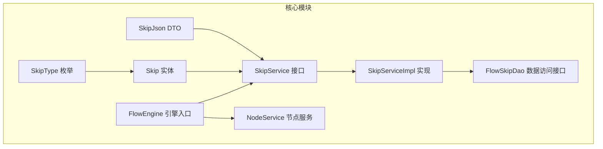
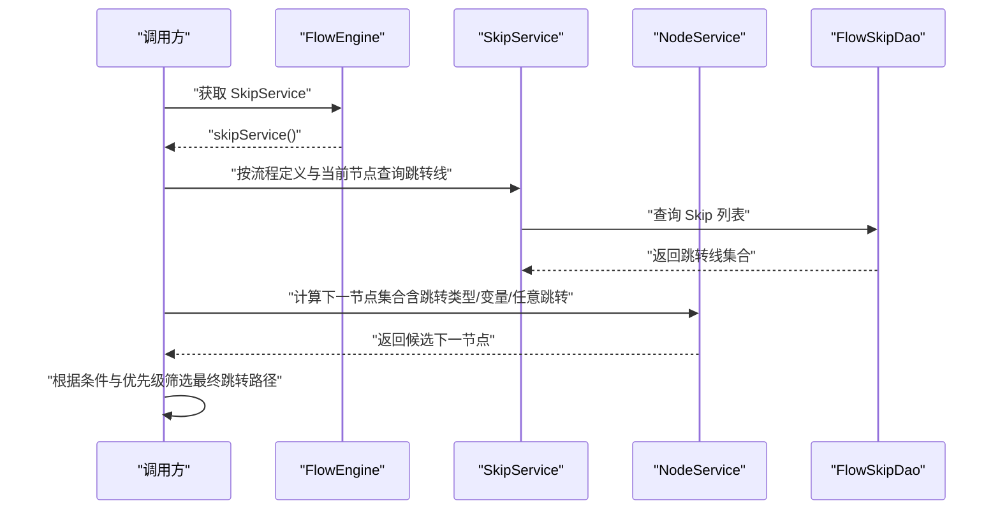
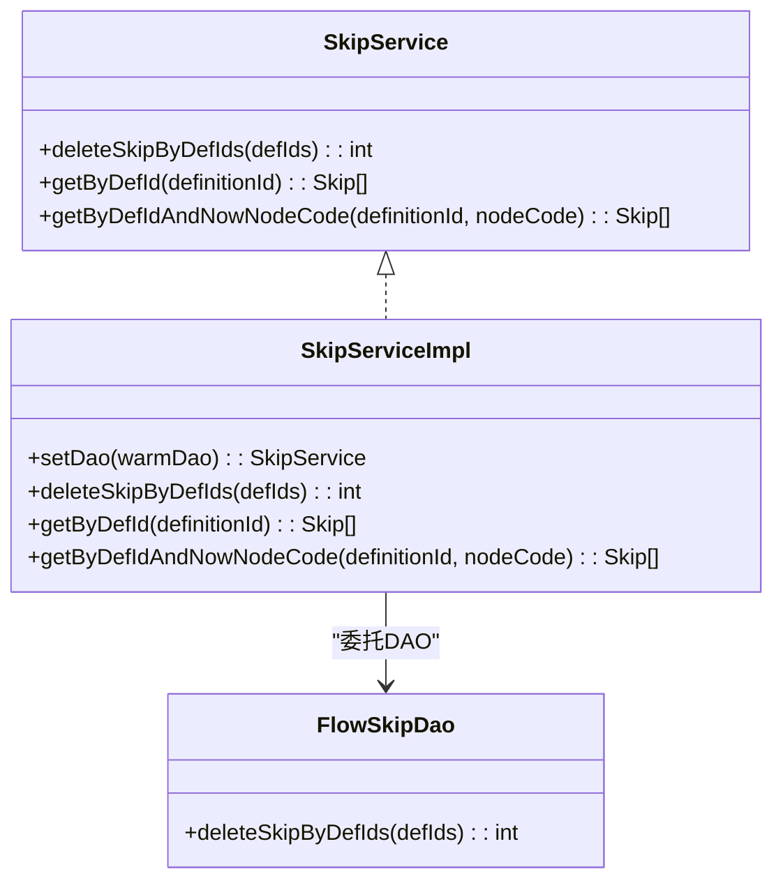
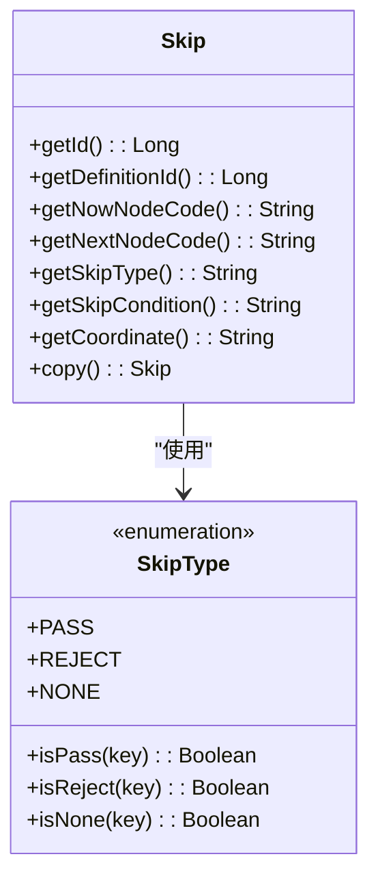
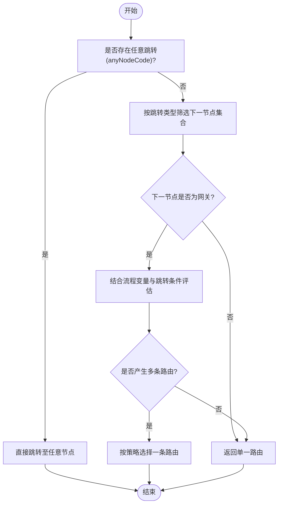
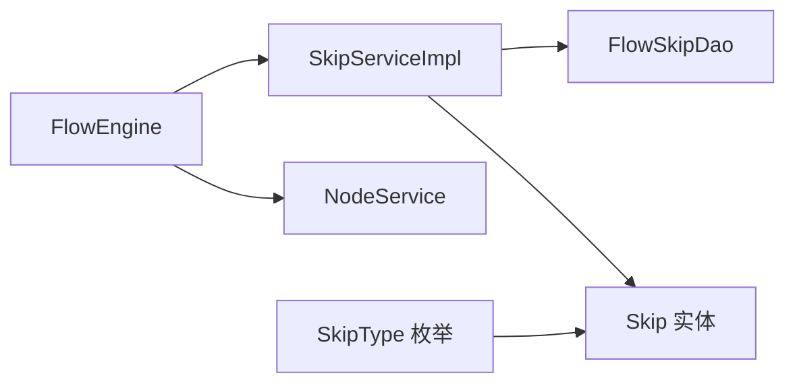

# 跳转服务

<cite>
**本文引用的文件**
- [SkipService.java](file://warm-flow-core/src/main/java/org/dromara/warm/flow/core/service/SkipService.java)
- [SkipServiceImpl.java](file://warm-flow-core/src/main/java/org/dromara/warm/flow/core/service/impl/SkipServiceImpl.java)
- [Skip.java](file://warm-flow-core/src/main/java/org/dromara/warm/flow/core/entity/Skip.java)
- [SkipType.java](file://warm-flow-core/src/main/java/org/dromara/warm/flow/core/enums/SkipType.java)
- [SkipJson.java](file://warm-flow-core/src/main/java/org/dromara/warm/flow/core/dto/SkipJson.java)
- [FlowSkipDao.java](file://warm-flow-core/src/main/java/org/dromara/warm/flow/core/orm/dao/FlowSkipDao.java)
- [FlowEngine.java](file://warm-flow-core/src/main/java/org/dromara/warm/flow/core/FlowEngine.java)
- [NodeService.java](file://warm-flow-core/src/main/java/org/dromara/warm/flow/core/service/NodeService.java)
</cite>

## 目录
1. [简介](#简介)
2. [项目结构](#项目结构)
3. [核心组件](#核心组件)
4. [架构总览](#架构总览)
5. [详细组件分析](#详细组件分析)
6. [依赖分析](#依赖分析)
7. [性能考虑](#性能考虑)
8. [故障排查指南](#故障排查指南)
9. [结论](#结论)
10. [附录](#附录)

## 简介
本文件面向“跳转服务”的技术文档，围绕 SkipService 接口与 SkipServiceImpl 实现展开，系统性阐述流程跳转规则的管理、条件跳转的配置、跳转路径的计算与优先级执行顺序，并结合节点服务与流程引擎的关系，帮助开发者正确设计与管理流程的跳转逻辑。文档同时提供使用示例与排障建议，兼顾非专业读者的理解需求。

## 项目结构
跳转服务位于核心模块中，采用分层设计：接口层定义能力，实现层对接数据访问层，实体与枚举描述跳转元数据，DTO 提供对外展示与交互的数据载体；流程引擎统一暴露各类服务实例，便于在流程运行时进行调用。

图表来源
- [SkipService.java:31-57](file://warm-flow-core/src/main/java/org/dromara/warm/flow/core/service/SkipService.java#L31-L57)
- [SkipServiceImpl.java:34-56](file://warm-flow-core/src/main/java/org/dromara/warm/flow/core/service/impl/SkipServiceImpl.java#L34-L56)
- [Skip.java:28-127](file://warm-flow-core/src/main/java/org/dromara/warm/flow/core/entity/Skip.java#L28-L127)
- [SkipType.java:30-100](file://warm-flow-core/src/main/java/org/dromara/warm/flow/core/enums/SkipType.java#L30-L100)
- [SkipJson.java:34-85](file://warm-flow-core/src/main/java/org/dromara/warm/flow/core/dto/SkipJson.java#L34-L85)
- [FlowSkipDao.java:29-38](file://warm-flow-core/src/main/java/org/dromara/warm/flow/core/orm/dao/FlowSkipDao.java#L29-L38)
- [FlowEngine.java:72-130](file://warm-flow-core/src/main/java/org/dromara/warm/flow/core/FlowEngine.java#L72-L130)
- [NodeService.java:34-228](file://warm-flow-core/src/main/java/org/dromara/warm/flow/core/service/NodeService.java#L34-L228)

章节来源
- [SkipService.java:31-57](file://warm-flow-core/src/main/java/org/dromara/warm/flow/core/service/SkipService.java#L31-L57)
- [SkipServiceImpl.java:34-56](file://warm-flow-core/src/main/java/org/dromara/warm/flow/core/service/impl/SkipServiceImpl.java#L34-L56)
- [FlowEngine.java:72-130](file://warm-flow-core/src/main/java/org/dromara/warm/flow/core/FlowEngine.java#L72-L130)

## 核心组件
- SkipService 接口：定义跳转规则的查询与批量删除能力，支持按流程定义与当前节点编码检索跳转线。
- SkipServiceImpl 实现：基于通用服务基类，委托数据访问层完成持久化操作；提供便捷查询方法。
- Skip 实体：承载跳转规则的完整元数据，包含起止节点编码、节点类型、跳转类型、跳转条件、坐标等。
- SkipType 枚举：定义跳转类型（通过、退回、无动作），并提供类型判定工具方法。
- SkipJson DTO：面向前端或外部交互的数据载体，包含跳转名称、类型、条件、坐标、状态、扩展字段等。
- FlowSkipDao 数据访问接口：声明批量删除等DAO能力，由具体ORM实现提供。
- FlowEngine 引擎入口：统一提供 newSkip() 工厂方法与 skipService() 访问器，便于在流程上下文中构造与获取跳转实体及服务。

章节来源
- [SkipService.java:31-57](file://warm-flow-core/src/main/java/org/dromara/warm/flow/core/service/SkipService.java#L31-L57)
- [SkipServiceImpl.java:34-56](file://warm-flow-core/src/main/java/org/dromara/warm/flow/core/service/impl/SkipServiceImpl.java#L34-L56)
- [Skip.java:28-127](file://warm-flow-core/src/main/java/org/dromara/warm/flow/core/entity/Skip.java#L28-L127)
- [SkipType.java:30-100](file://warm-flow-core/src/main/java/org/dromara/warm/flow/core/enums/SkipType.java#L30-L100)
- [SkipJson.java:34-85](file://warm-flow-core/src/main/java/org/dromara/warm/flow/core/dto/SkipJson.java#L34-L85)
- [FlowSkipDao.java:29-38](file://warm-flow-core/src/main/java/org/dromara/warm/flow/core/orm/dao/FlowSkipDao.java#L29-L38)
- [FlowEngine.java:108-130](file://warm-flow-core/src/main/java/org/dromara/warm/flow/core/FlowEngine.java#L108-L130)

## 架构总览
跳转服务在流程控制中的作用：
- 规则管理：以 Skip 实体为核心，记录从当前节点到下一节点的跳转关系与规则。
- 条件跳转：通过 Skip 的跳转条件字段与流程变量，在运行时动态决定是否满足跳转条件。
- 路径计算：结合节点服务的“下一节点”计算能力，综合跳转类型与条件，输出可执行的跳转路径集合。
- 优先级与顺序：当存在“任意跳转”（anyNodeCode）时，其优先级最高；随后根据跳转类型（通过/退回/无动作）与网关条件进行筛选与排序。

图表来源
- [FlowEngine.java:80-82](file://warm-flow-core/src/main/java/org/dromara/warm/flow/core/FlowEngine.java#L80-L82)
- [SkipService.java:47-56](file://warm-flow-core/src/main/java/org/dromara/warm/flow/core/service/SkipService.java#L47-L56)
- [SkipServiceImpl.java:48-55](file://warm-flow-core/src/main/java/org/dromara/warm/flow/core/service/impl/SkipServiceImpl.java#L48-L55)
- [NodeService.java:157-158](file://warm-flow-core/src/main/java/org/dromara/warm/flow/core/service/NodeService.java#L157-L158)

## 详细组件分析

### SkipService 接口与 SkipServiceImpl 实现
- 查询能力
  - 按流程定义 ID 查询所有跳转线。
  - 按流程定义 ID 与当前节点编码查询跳转线。
- 批量删除
  - 支持按流程定义 ID 集合批量删除跳转线，便于流程版本升级或清理。
- 实现要点
  - 基于 FlowEngine.newSkip() 构造查询条件，提升一致性与可维护性。
  - 委托数据访问层执行查询与删除，保持服务层职责单一。

图表来源
- [SkipService.java:31-57](file://warm-flow-core/src/main/java/org/dromara/warm/flow/core/service/SkipService.java#L31-L57)
- [SkipServiceImpl.java:34-56](file://warm-flow-core/src/main/java/org/dromara/warm/flow/core/service/impl/SkipServiceImpl.java#L34-L56)
- [FlowSkipDao.java:29-38](file://warm-flow-core/src/main/java/org/dromara/warm/flow/core/orm/dao/FlowSkipDao.java#L29-L38)

章节来源
- [SkipService.java:31-57](file://warm-flow-core/src/main/java/org/dromara/warm/flow/core/service/SkipService.java#L31-L57)
- [SkipServiceImpl.java:34-56](file://warm-flow-core/src/main/java/org/dromara/warm/flow/core/service/impl/SkipServiceImpl.java#L34-L56)
- [FlowSkipDao.java:29-38](file://warm-flow-core/src/main/java/org/dromara/warm/flow/core/orm/dao/FlowSkipDao.java#L29-L38)

### Skip 实体与 SkipType 枚举
- Skip 实体关键字段
  - 起止节点：当前节点编码、当前节点类型、下一节点编码、下一节点类型。
  - 跳转标识：跳转名称、跳转类型、跳转条件、坐标。
  - 复制能力：提供 copy() 方法，便于在流程复制或迁移场景中快速克隆跳转规则。
- SkipType 枚举
  - 定义三种跳转类型：通过、退回、无动作。
  - 提供类型判定工具方法，便于在流程运行时快速判断跳转类型。

图表来源
- [Skip.java:28-127](file://warm-flow-core/src/main/java/org/dromara/warm/flow/core/entity/Skip.java#L28-L127)
- [SkipType.java:30-100](file://warm-flow-core/src/main/java/org/dromara/warm/flow/core/enums/SkipType.java#L30-L100)

章节来源
- [Skip.java:28-127](file://warm-flow-core/src/main/java/org/dromara/warm/flow/core/entity/Skip.java#L28-L127)
- [SkipType.java:30-100](file://warm-flow-core/src/main/java/org/dromara/warm/flow/core/enums/SkipType.java#L30-L100)

### 跳转路径计算与优先级
- 优先级顺序
  - 任意跳转（anyNodeCode）优先级最高，若指定则直接跳转至该节点。
  - 否则依据跳转类型（通过/退回/无动作）筛选下一节点集合。
  - 若下一节点为网关，需结合流程变量与跳转条件进一步筛选。
- 条件跳转
  - 跳转条件存储于 Skip 的条件字段，结合流程变量在运行时评估。
  - 节点服务提供 getNextNodeList/getNextNode 等方法，综合 skipType、variable、pathWayData、flowCombine 等参数，输出候选节点集合。
- 路径选择
  - 并行网关可能返回多条候选路径，需结合业务策略（如首个可用、用户选择、条件匹配度）确定最终路径。

图表来源
- [NodeService.java:157-158](file://warm-flow-core/src/main/java/org/dromara/warm/flow/core/service/NodeService.java#L157-L158)
- [NodeService.java:185-199](file://warm-flow-core/src/main/java/org/dromara/warm/flow/core/service/NodeService.java#L185-L199)
- [NodeService.java:210-211](file://warm-flow-core/src/main/java/org/dromara/warm/flow/core/service/NodeService.java#L210-L211)

章节来源
- [NodeService.java:157-158](file://warm-flow-core/src/main/java/org/dromara/warm/flow/core/service/NodeService.java#L157-L158)
- [NodeService.java:185-199](file://warm-flow-core/src/main/java/org/dromara/warm/flow/core/service/NodeService.java#L185-L199)
- [NodeService.java:210-211](file://warm-flow-core/src/main/java/org/dromara/warm/flow/core/service/NodeService.java#L210-L211)

### 使用示例与最佳实践
- 配置节点跳转规则
  - 通过 Skip 实体设置起止节点编码、节点类型、跳转类型、跳转条件与坐标。
  - 使用 FlowEngine.newSkip() 构造实体，确保字段一致性。
- 查询跳转路径
  - 先通过 SkipService 按流程定义与当前节点查询跳转线集合。
  - 再通过 NodeService 的 getNextNodeList/getNextNode 计算下一节点集合，结合 skipType、variable、anyNodeCode 进行筛选。
- 验证跳转条件
  - 在流程运行时，结合流程变量与 Skip 的条件字段进行条件评估，确保仅在满足条件时执行跳转。
- 与节点服务协作
  - 跳转服务负责规则管理，节点服务负责路径计算与网关处理，二者协同保证流程的正确流转。

章节来源
- [SkipServiceImpl.java:48-55](file://warm-flow-core/src/main/java/org/dromara/warm/flow/core/service/impl/SkipServiceImpl.java#L48-L55)
- [NodeService.java:157-158](file://warm-flow-core/src/main/java/org/dromara/warm/flow/core/service/NodeService.java#L157-L158)
- [FlowEngine.java:124-130](file://warm-flow-core/src/main/java/org/dromara/warm/flow/core/FlowEngine.java#L124-L130)

## 依赖分析
- 组件耦合
  - SkipServiceImpl 依赖 FlowSkipDao 进行持久化操作，保持服务层与数据层分离。
  - FlowEngine 作为门面，集中提供 Skip 实体工厂与 SkipService 访问器，降低调用方对具体实现的感知。
  - 跳转服务与节点服务相互配合：前者提供规则，后者提供路径计算。
- 外部依赖
  - ORM 层实现（MyBatis/MyBatis-Plus/EasyQuery）提供 FlowSkipDao 的具体实现，跳转服务无需关心具体实现差异。

图表来源
- [SkipServiceImpl.java:34-56](file://warm-flow-core/src/main/java/org/dromara/warm/flow/core/service/impl/SkipServiceImpl.java#L34-L56)
- [FlowSkipDao.java:29-38](file://warm-flow-core/src/main/java/org/dromara/warm/flow/core/orm/dao/FlowSkipDao.java#L29-L38)
- [FlowEngine.java:80-82](file://warm-flow-core/src/main/java/org/dromara/warm/flow/core/FlowEngine.java#L80-L82)
- [NodeService.java:34-228](file://warm-flow-core/src/main/java/org/dromara/warm/flow/core/service/NodeService.java#L34-L228)
- [Skip.java:28-127](file://warm-flow-core/src/main/java/org/dromara/warm/flow/core/entity/Skip.java#L28-L127)
- [SkipType.java:30-100](file://warm-flow-core/src/main/java/org/dromara/warm/flow/core/enums/SkipType.java#L30-L100)

章节来源
- [SkipServiceImpl.java:34-56](file://warm-flow-core/src/main/java/org/dromara/warm/flow/core/service/impl/SkipServiceImpl.java#L34-L56)
- [FlowSkipDao.java:29-38](file://warm-flow-core/src/main/java/org/dromara/warm/flow/core/orm/dao/FlowSkipDao.java#L29-L38)
- [FlowEngine.java:80-82](file://warm-flow-core/src/main/java/org/dromara/warm/flow/core/FlowEngine.java#L80-L82)
- [NodeService.java:34-228](file://warm-flow-core/src/main/java/org/dromara/warm/flow/core/service/NodeService.java#L34-L228)
- [Skip.java:28-127](file://warm-flow-core/src/main/java/org/dromara/warm/flow/core/entity/Skip.java#L28-L127)
- [SkipType.java:30-100](file://warm-flow-core/src/main/java/org/dromara/warm/flow/core/enums/SkipType.java#L30-L100)

## 性能考虑
- 查询优化
  - 按流程定义 ID 与当前节点编码建立索引，减少 Skip 查询扫描范围。
  - 对 Skip 的条件字段与坐标字段进行合理索引，避免运行时条件评估造成全表扫描。
- 批量删除
  - 批量删除时尽量合并 SQL，减少网络往返与事务开销。
- 路径计算
  - 并行网关分支较多时，建议在节点服务侧尽早剪枝，减少后续评估成本。
- 缓存策略
  - 对常用流程的跳转规则进行缓存，避免重复查询；变更时及时失效。

## 故障排查指南
- 常见问题
  - 跳转条件不生效：检查 Skip 的条件字段与流程变量是否匹配，确认条件表达式语法正确。
  - 任意跳转未生效：确认 anyNodeCode 参数传入与节点服务的优先级逻辑一致。
  - 网关节点跳转异常：核对网关类型与条件字段，确保在节点服务的 getNextByCheckGateway 中正确处理。
- 排查步骤
  - 通过 SkipService 查询当前流程定义与当前节点的跳转线集合，核对跳转类型与条件。
  - 使用 NodeService 的 getNextNodeList/getNextNode 获取候选下一节点，观察是否符合预期。
  - 在 FlowEngine 中确认 newSkip() 与 skipService() 的实例是否正确初始化。

章节来源
- [SkipService.java:47-56](file://warm-flow-core/src/main/java/org/dromara/warm/flow/core/service/SkipService.java#L47-L56)
- [SkipServiceImpl.java:48-55](file://warm-flow-core/src/main/java/org/dromara/warm/flow/core/service/impl/SkipServiceImpl.java#L48-L55)
- [NodeService.java:157-158](file://warm-flow-core/src/main/java/org/dromara/warm/flow/core/service/NodeService.java#L157-L158)
- [NodeService.java:185-199](file://warm-flow-core/src/main/java/org/dromara/warm/flow/core/service/NodeService.java#L185-L199)
- [NodeService.java:210-211](file://warm-flow-core/src/main/java/org/dromara/warm/flow/core/service/NodeService.java#L210-L211)
- [FlowEngine.java:124-130](file://warm-flow-core/src/main/java/org/dromara/warm/flow/core/FlowEngine.java#L124-L130)

## 结论
跳转服务通过 Skip 实体与 SkipService 接口，为流程引擎提供了稳定、可扩展的跳转规则管理能力。结合 SkipType 的类型判定与节点服务的路径计算，能够灵活支持条件跳转、默认跳转与异常跳转等场景。遵循本文的优先级与执行顺序、使用示例与排障建议，可有效提升流程设计与实现的可靠性与可维护性。

## 附录
- 关键术语
  - 跳转类型：通过、退回、无动作。
  - 任意跳转：允许直接跳转到指定节点，优先级最高。
  - 条件跳转：基于流程变量与条件字段的动态跳转。
- 参考路径
  - 跳转规则实体与工厂：[Skip.java:28-127](file://warm-flow-core/src/main/java/org/dromara/warm/flow/core/entity/Skip.java#L28-L127)，[FlowEngine.java:124-130](file://warm-flow-core/src/main/java/org/dromara/warm/flow/core/FlowEngine.java#L124-L130)
  - 跳转服务接口与实现：[SkipService.java:31-57](file://warm-flow-core/src/main/java/org/dromara/warm/flow/core/service/SkipService.java#L31-L57)，[SkipServiceImpl.java:34-56](file://warm-flow-core/src/main/java/org/dromara/warm/flow/core/service/impl/SkipServiceImpl.java#L34-L56)
  - 路径计算与网关处理：[NodeService.java:157-158](file://warm-flow-core/src/main/java/org/dromara/warm/flow/core/service/NodeService.java#L157-L158)，[NodeService.java:185-199](file://warm-flow-core/src/main/java/org/dromara/warm/flow/core/service/NodeService.java#L185-L199)，[NodeService.java:210-211](file://warm-flow-core/src/main/java/org/dromara/warm/flow/core/service/NodeService.java#L210-L211)