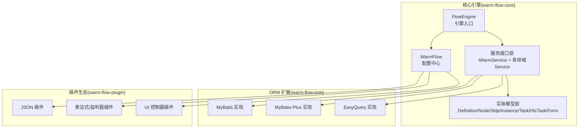
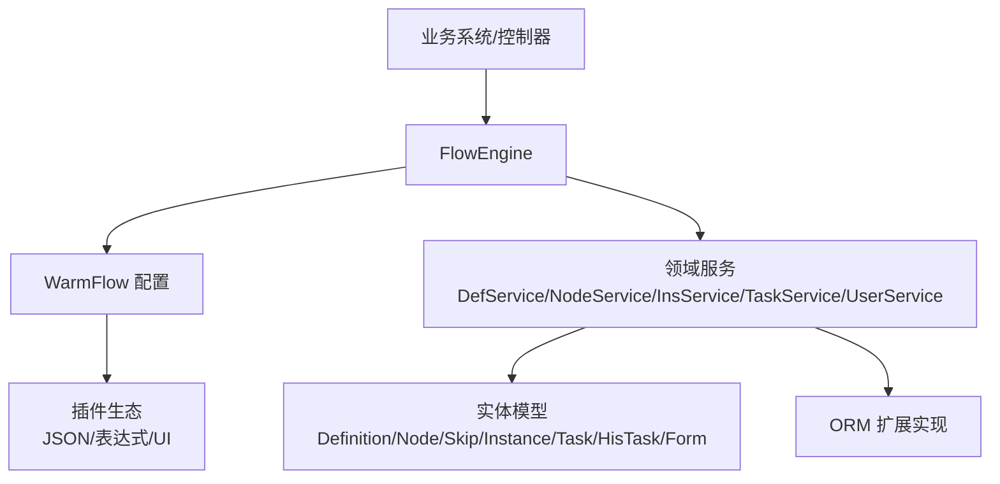
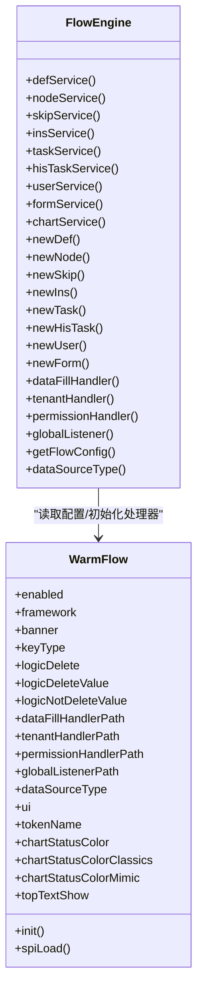
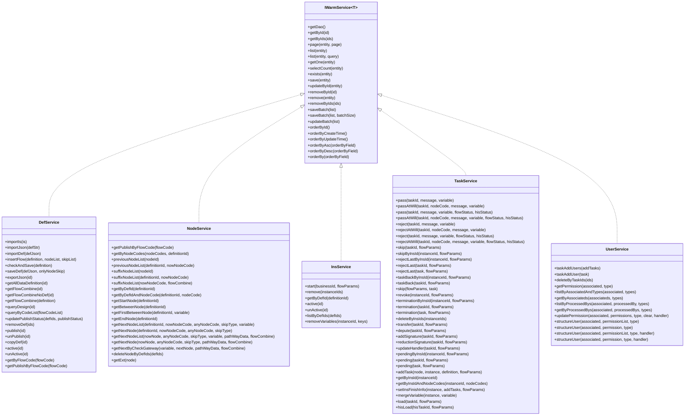
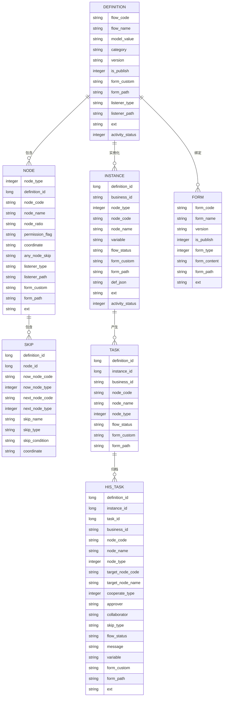
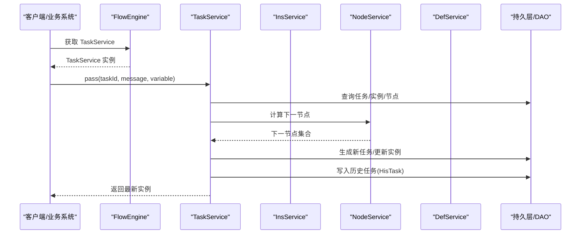
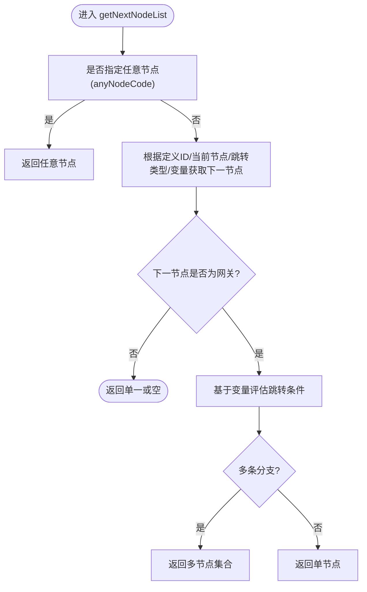
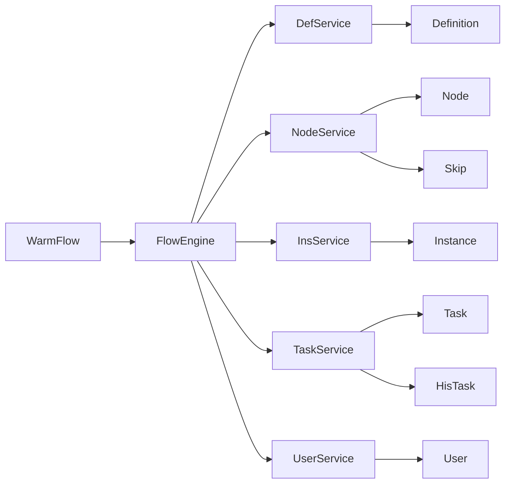

# 核心引擎架构

<cite>
**本文引用的文件**
- [FlowEngine.java](file://warm-flow-core/src/main/java/org/dromara/warm/flow/core/FlowEngine.java)
- [WarmFlow.java](file://warm-flow-core/src/main/java/org/dromara/warm/flow/core/config/WarmFlow.java)
- [IWarmService.java](file://warm-flow-core/src/main/java/org/dromara/warm/flow/core/orm/service/IWarmService.java)
- [DefService.java](file://warm-flow-core/src/main/java/org/dromara/warm/flow/core/service/DefService.java)
- [NodeService.java](file://warm-flow-core/src/main/java/org/dromara/warm/flow/core/service/NodeService.java)
- [InsService.java](file://warm-flow-core/src/main/java/org/dromara/warm/flow/core/service/InsService.java)
- [TaskService.java](file://warm-flow-core/src/main/java/org/dromara/warm/flow/core/service/TaskService.java)
- [UserService.java](file://warm-flow-core/src/main/java/org/dromara/warm/flow/core/service/UserService.java)
- [Definition.java](file://warm-flow-core/src/main/java/org/dromara/warm/flow/core/entity/Definition.java)
- [Node.java](file://warm-flow-core/src/main/java/org/dromara/warm/flow/core/entity/Node.java)
- [Skip.java](file://warm-flow-core/src/main/java/org/dromara/warm/flow/core/entity/Skip.java)
- [Instance.java](file://warm-flow-core/src/main/java/org/dromara/warm/flow/core/entity/Instance.java)
- [Task.java](file://warm-flow-core/src/main/java/org/dromara/warm/flow/core/entity/Task.java)
- [HisTask.java](file://warm-flow-core/src/main/java/org/dromara/warm/flow/core/entity/HisTask.java)
- [Form.java](file://warm-flow-core/src/main/java/org/dromara/warm/flow/core/entity/Form.java)
</cite>

## 目录
1. [引言](#引言)
2. [项目结构](#项目结构)
3. [核心组件](#核心组件)
4. [架构总览](#架构总览)
5. [详细组件分析](#详细组件分析)
6. [依赖分析](#依赖分析)
7. [性能考虑](#性能考虑)
8. [故障排查指南](#故障排查指南)
9. [结论](#结论)
10. [附录](#附录)

## 引言
本文件面向 Warm-Flow 核心引擎架构，围绕 FlowEngine 引擎入口、服务层接口与实现、核心实体模型及其关联关系进行系统化技术解读。目标是帮助开发者快速理解 Warm-Flow 的设计思想、运行机制与扩展点，掌握从流程定义、实例流转到任务处理的完整链路。

## 项目结构
Warm-Flow 采用“核心引擎 + ORM 扩展 + 插件生态”的分层组织方式：
- 核心引擎（warm-flow-core）：定义引擎入口、实体模型、服务接口、通用工具与配置。
- ORM 扩展（warm-flow-orm）：提供 MyBatis/MyBatis-Plus/EasyQuery 等多实现的 DAO/Service 封装。
- 插件生态（warm-flow-plugin）：提供 JSON 转换、表达式计算、UI 控制器等可插拔能力。
- UI 展示（warm-flow-ui）：前端可视化设计器与表单编辑器。

**章节来源**
- [FlowEngine.java:1-270](file://warm-flow-core/src/main/java/org/dromara/warm/flow/core/FlowEngine.java#L1-L270)
- [WarmFlow.java:1-174](file://warm-flow-core/src/main/java/org/dromara/warm/flow/core/config/WarmFlow.java#L1-L174)

## 核心组件
- 引擎入口 FlowEngine：统一暴露服务与实体构造器，负责初始化处理器与配置，提供 Bean 获取与 SPI 加载能力。
- 配置中心 WarmFlow：集中管理框架开关、数据源类型、逻辑删除、UI 开关、颜色主题、处理器路径等。
- 服务接口层 IWarmService：抽象通用 CRUD 与分页能力；各领域 Service（DefService/NodeService/InsService/TaskService/UserService）在此之上扩展业务方法。
- 实体模型层：Definition/Node/Skip/Instance/Task/HisTask/Form，定义流程定义、节点、跳转、实例、任务、历史任务与表单等核心数据结构。

**章节来源**
- [FlowEngine.java:39-270](file://warm-flow-core/src/main/java/org/dromara/warm/flow/core/FlowEngine.java#L39-L270)
- [WarmFlow.java:36-174](file://warm-flow-core/src/main/java/org/dromara/warm/flow/core/config/WarmFlow.java#L36-L174)
- [IWarmService.java:33-210](file://warm-flow-core/src/main/java/org/dromara/warm/flow/core/orm/service/IWarmService.java#L33-L210)

## 架构总览
Warm-Flow 的运行时架构以 FlowEngine 为中心，向上提供统一的服务访问入口，向下对接 ORM 扩展与插件生态。WarmFlow 负责初始化与装配，服务层负责业务编排，实体层承载数据契约。

**图表来源**
- [FlowEngine.java:39-270](file://warm-flow-core/src/main/java/org/dromara/warm/flow/core/FlowEngine.java#L39-L270)
- [WarmFlow.java:130-157](file://warm-flow-core/src/main/java/org/dromara/warm/flow/core/config/WarmFlow.java#L130-L157)

**章节来源**
- [FlowEngine.java:72-106](file://warm-flow-core/src/main/java/org/dromara/warm/flow/core/FlowEngine.java#L72-L106)
- [WarmFlow.java:130-157](file://warm-flow-core/src/main/java/org/dromara/warm/flow/core/config/WarmFlow.java#L130-L157)

## 详细组件分析

### FlowEngine 引擎入口
- 设计思想
  - 通过静态代理的方式对外暴露服务与实体构造器，避免直接依赖 Spring 容器，提升可移植性。
  - 支持通过 WarmFlow 配置注入处理器（数据填充、租户隔离、权限校验、全局监听）与 JSON 转换策略。
  - 提供 initBean 方法，按“配置类路径 → Spring 容器 → Supplier”顺序解析 Bean，增强扩展性。
- 关键能力
  - 服务获取：defService()/nodeService()/skipService()/insService()/taskService()/hisTaskService()/userService()/formService()/chartService()
  - 实体构造：newDef()/newNode()/newSkip()/newIns()/newTask()/newHisTask()/newUser()/newForm()
  - 处理器初始化：initDataFillHandler()/initTenantHandler()/initPermissionHandler()/initGlobalListener()
  - 配置读取：getFlowConfig()/dataSourceType()

**图表来源**
- [FlowEngine.java:39-270](file://warm-flow-core/src/main/java/org/dromara/warm/flow/core/FlowEngine.java#L39-L270)
- [WarmFlow.java:36-174](file://warm-flow-core/src/main/java/org/dromara/warm/flow/core/config/WarmFlow.java#L36-L174)

**章节来源**
- [FlowEngine.java:72-270](file://warm-flow-core/src/main/java/org/dromara/warm/flow/core/FlowEngine.java#L72-L270)
- [WarmFlow.java:130-157](file://warm-flow-core/src/main/java/org/dromara/warm/flow/core/config/WarmFlow.java#L130-L157)

### 服务层架构设计
- 通用接口 IWarmService：提供标准 CRUD、分页、批量操作与排序能力，屏蔽不同 ORM 实现差异。
- 领域服务接口：
  - DefService：流程定义导入/导出、发布/撤销、复制、组合数据查询等。
  - NodeService：节点查询、前后置节点、下一节点推导、网关校验、扩展信息读取。
  - InsService：实例启动、删除、激活/挂起、按定义 ID 查询、变量清理。
  - TaskService：审批通过/退回、任意跳转、终止/撤销、转办/委派/加签/减签、挂起、表单加载等。
  - UserService：任务关联用户维护、权限人查询与更新、用户构造等。

**图表来源**
- [IWarmService.java:33-210](file://warm-flow-core/src/main/java/org/dromara/warm/flow/core/orm/service/IWarmService.java#L33-L210)
- [DefService.java:34-210](file://warm-flow-core/src/main/java/org/dromara/warm/flow/core/service/DefService.java#L34-L210)
- [NodeService.java:34-229](file://warm-flow-core/src/main/java/org/dromara/warm/flow/core/service/NodeService.java#L34-L229)
- [InsService.java:30-94](file://warm-flow-core/src/main/java/org/dromara/warm/flow/core/service/InsService.java#L30-L94)
- [TaskService.java:36-534](file://warm-flow-core/src/main/java/org/dromara/warm/flow/core/service/TaskService.java#L36-L534)
- [UserService.java:30-166](file://warm-flow-core/src/main/java/org/dromara/warm/flow/core/service/UserService.java#L30-L166)

**章节来源**
- [IWarmService.java:33-210](file://warm-flow-core/src/main/java/org/dromara/warm/flow/core/orm/service/IWarmService.java#L33-L210)
- [DefService.java:34-210](file://warm-flow-core/src/main/java/org/dromara/warm/flow/core/service/DefService.java#L34-L210)
- [NodeService.java:34-229](file://warm-flow-core/src/main/java/org/dromara/warm/flow/core/service/NodeService.java#L34-L229)
- [InsService.java:30-94](file://warm-flow-core/src/main/java/org/dromara/warm/flow/core/service/InsService.java#L30-L94)
- [TaskService.java:36-534](file://warm-flow-core/src/main/java/org/dromara/warm/flow/core/service/TaskService.java#L36-L534)
- [UserService.java:30-166](file://warm-flow-core/src/main/java/org/dromara/warm/flow/core/service/UserService.java#L30-L166)

### 核心实体模型与关联关系
- Definition（流程定义）
  - 关键属性：流程编码、名称、模型类型、分类、版本、发布状态、表单定制、监听器类型/路径、扩展字段等。
  - 关联：包含 Node 列表与 User 列表，支持复制与导出。
- Node（流程节点）
  - 关键属性：节点类型、所属 Definition、节点编码/名称、比例/权限标志、坐标、监听器、表单定制、扩展字段等。
  - 关联：包含 Skip 列表，支持前后置节点查询与下一节点推导。
- Skip（节点跳转）
  - 关键属性：当前/下一节点编码与类型、跳转名称/类型、跳转条件、坐标等。
- Instance（流程实例）
  - 关键属性：所属 Definition、业务 ID、节点信息、流程变量、状态、表单定制、扩展字段、活动状态等。
- Task（待办任务）
  - 关键属性：所属 Definition/Instance、业务 ID、节点信息、流程状态、权限列表、用户列表、表单定制、扩展字段等。
- HisTask（历史任务）
  - 关键属性：任务来源、协作类型、目标节点、审批人/协作者、跳转类型、流程状态、意见、变量、扩展字段、表单定制等。
- Form（流程表单）
  - 关键属性：表单编码/名称、版本、发布状态、表单类型（内置/外挂）、内容/路径、扩展字段等。

**图表来源**
- [Definition.java:29-196](file://warm-flow-core/src/main/java/org/dromara/warm/flow/core/entity/Definition.java#L29-L196)
- [Node.java:30-162](file://warm-flow-core/src/main/java/org/dromara/warm/flow/core/entity/Node.java#L30-L162)
- [Skip.java:28-128](file://warm-flow-core/src/main/java/org/dromara/warm/flow/core/entity/Skip.java#L28-L128)
- [Instance.java:29-166](file://warm-flow-core/src/main/java/org/dromara/warm/flow/core/entity/Instance.java#L29-L166)
- [Task.java:27-136](file://warm-flow-core/src/main/java/org/dromara/warm/flow/core/entity/Task.java#L27-L136)
- [HisTask.java:30-164](file://warm-flow-core/src/main/java/org/dromara/warm/flow/core/entity/HisTask.java#L30-L164)
- [Form.java:26-112](file://warm-flow-core/src/main/java/org/dromara/warm/flow/core/entity/Form.java#L26-L112)

**章节来源**
- [Definition.java:29-196](file://warm-flow-core/src/main/java/org/dromara/warm/flow/core/entity/Definition.java#L29-L196)
- [Node.java:30-162](file://warm-flow-core/src/main/java/org/dromara/warm/flow/core/entity/Node.java#L30-L162)
- [Skip.java:28-128](file://warm-flow-core/src/main/java/org/dromara/warm/flow/core/entity/Skip.java#L28-L128)
- [Instance.java:29-166](file://warm-flow-core/src/main/java/org/dromara/warm/flow/core/entity/Instance.java#L29-L166)
- [Task.java:27-136](file://warm-flow-core/src/main/java/org/dromara/warm/flow/core/entity/Task.java#L27-L136)
- [HisTask.java:30-164](file://warm-flow-core/src/main/java/org/dromara/warm/flow/core/entity/HisTask.java#L30-L164)
- [Form.java:26-112](file://warm-flow-core/src/main/java/org/dromara/warm/flow/core/entity/Form.java#L26-L112)

### 关键流程：任务审批与实例流转
以“审批通过”为例，展示从 TaskService 到 Instance/Task/HisTask 的流转过程。

**图表来源**
- [TaskService.java:36-534](file://warm-flow-core/src/main/java/org/dromara/warm/flow/core/service/TaskService.java#L36-L534)
- [NodeService.java:144-229](file://warm-flow-core/src/main/java/org/dromara/warm/flow/core/service/NodeService.java#L144-L229)
- [InsService.java:30-94](file://warm-flow-core/src/main/java/org/dromara/warm/flow/core/service/InsService.java#L30-L94)

**章节来源**
- [TaskService.java:36-534](file://warm-flow-core/src/main/java/org/dromara/warm/flow/core/service/TaskService.java#L36-L534)
- [NodeService.java:144-229](file://warm-flow-core/src/main/java/org/dromara/warm/flow/core/service/NodeService.java#L144-L229)
- [InsService.java:30-94](file://warm-flow-core/src/main/java/org/dromara/warm/flow/core/service/InsService.java#L30-L94)

### 复杂逻辑：下一节点推导与网关校验

**图表来源**
- [NodeService.java:157-212](file://warm-flow-core/src/main/java/org/dromara/warm/flow/core/service/NodeService.java#L157-L212)

**章节来源**
- [NodeService.java:157-212](file://warm-flow-core/src/main/java/org/dromara/warm/flow/core/service/NodeService.java#L157-L212)

## 依赖分析
- FlowEngine 对 WarmFlow 的依赖：通过 WarmFlow.init() 注入处理器与 JSON 转换策略，同时读取数据源类型。
- 服务层对实体层的依赖：服务接口在方法签名与业务逻辑中直接引用实体，体现“以领域模型为中心”的设计。
- ORM 扩展对服务层的解耦：通过 IWarmService 抽象屏蔽具体实现，便于替换不同 ORM。

**图表来源**
- [FlowEngine.java:39-270](file://warm-flow-core/src/main/java/org/dromara/warm/flow/core/FlowEngine.java#L39-L270)
- [WarmFlow.java:130-157](file://warm-flow-core/src/main/java/org/dromara/warm/flow/core/config/WarmFlow.java#L130-L157)
- [IWarmService.java:33-210](file://warm-flow-core/src/main/java/org/dromara/warm/flow/core/orm/service/IWarmService.java#L33-L210)

**章节来源**
- [FlowEngine.java:39-270](file://warm-flow-core/src/main/java/org/dromara/warm/flow/core/FlowEngine.java#L39-L270)
- [WarmFlow.java:130-157](file://warm-flow-core/src/main/java/org/dromara/warm/flow/core/config/WarmFlow.java#L130-L157)
- [IWarmService.java:33-210](file://warm-flow-core/src/main/java/org/dromara/warm/flow/core/orm/service/IWarmService.java#L33-L210)

## 性能考虑
- 批量操作：优先使用 IWarmService.saveBatch/updateBatch，降低网络往返与事务开销。
- 分页查询：合理设置 Page 参数，避免一次性加载大结果集。
- 实体构造：通过 FlowEngine.newXxx() 构造实体，减少反射与序列化成本。
- JSON 转换：WarmFlow.spiLoad() 通过 SPI 加载 JSON 转换策略，确保序列化/反序列化高效稳定。
- 条件查询：结合 WarmQuery 进行精确过滤与排序，减少数据库压力。

## 故障排查指南
- 处理器未生效
  - 检查 WarmFlow 中处理器路径配置是否正确，确认 FlowEngine.initXxxHandler() 已被调用。
  - 确认 Spring 容器中是否存在同名 Bean，避免覆盖预期实现。
- 数据源类型识别异常
  - 若未显式配置 dataSourceType，检查数据源自动检测逻辑是否符合预期。
- 任务跳转失败
  - 核对 NodeService.getNextNodeList/Node.getNextByCheckGateway 的变量与条件表达式。
  - 检查 TaskService.skip/任意跳转参数（nodeCode/skipType/variable）是否合法。
- 实例状态不一致
  - 核对 InsService.active/unActive 与 TaskService.setInsFinishInfo 的调用时机。
- JSON 解析异常
  - 检查 WarmFlow.spiLoad() 是否成功加载 JsonConvert 实现，确认 strToMap 调用链路。

**章节来源**
- [WarmFlow.java:130-157](file://warm-flow-core/src/main/java/org/dromara/warm/flow/core/config/WarmFlow.java#L130-L157)
- [NodeService.java:157-212](file://warm-flow-core/src/main/java/org/dromara/warm/flow/core/service/NodeService.java#L157-L212)
- [TaskService.java:140-331](file://warm-flow-core/src/main/java/org/dromara/warm/flow/core/service/TaskService.java#L140-L331)
- [InsService.java:61-83](file://warm-flow-core/src/main/java/org/dromara/warm/flow/core/service/InsService.java#L61-L83)

## 结论
Warm-Flow 以 FlowEngine 为核心，通过 IWarmService 抽象与多 ORM 实现解耦，配合 WarmFlow 配置中心实现灵活扩展。实体模型清晰表达流程生命周期中的关键对象，服务层接口覆盖从定义、实例到任务的全流程编排。借助 SPI 与处理器机制，系统具备良好的可插拔性与可维护性。

## 附录
- 最佳实践建议
  - 明确职责边界：Definition/Node/Skip 专注流程设计，Instance/Task/HisTask 专注执行与审计。
  - 使用批量接口：在导入/导出/复制等场景优先使用批量写入。
  - 合理利用变量：通过流程变量驱动网关与下一节点决策，避免硬编码。
  - 配置化治理：通过 WarmFlow 统一开关与策略，减少代码侵入。
  - 监听与扩展：通过 GlobalListener 与 HandlerStrategy 扩展业务规则，保持核心稳定。