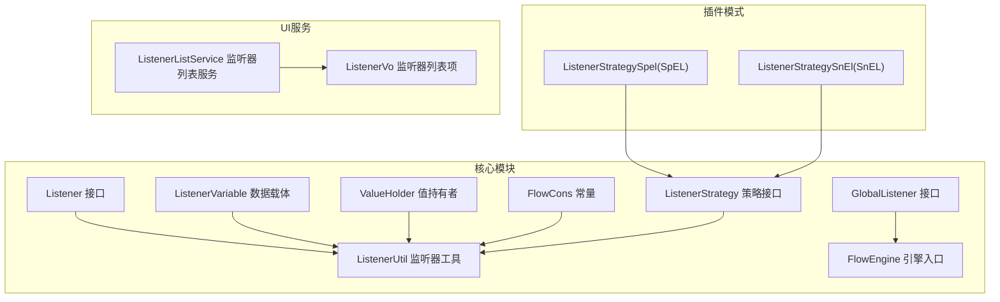
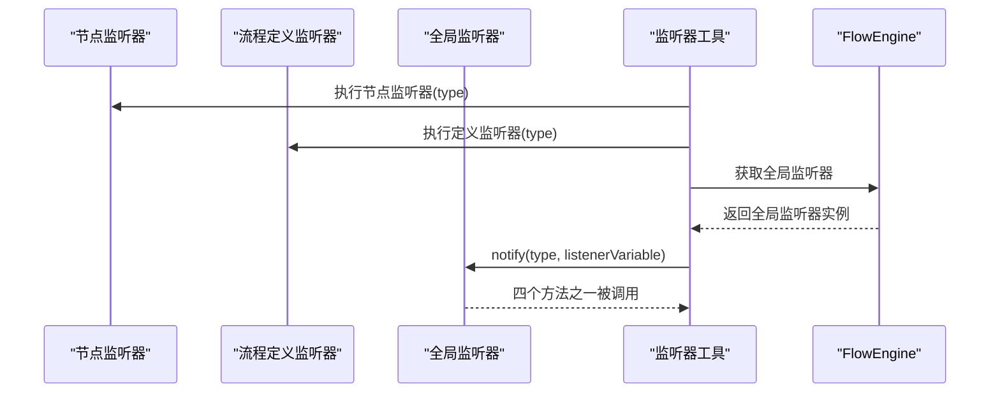
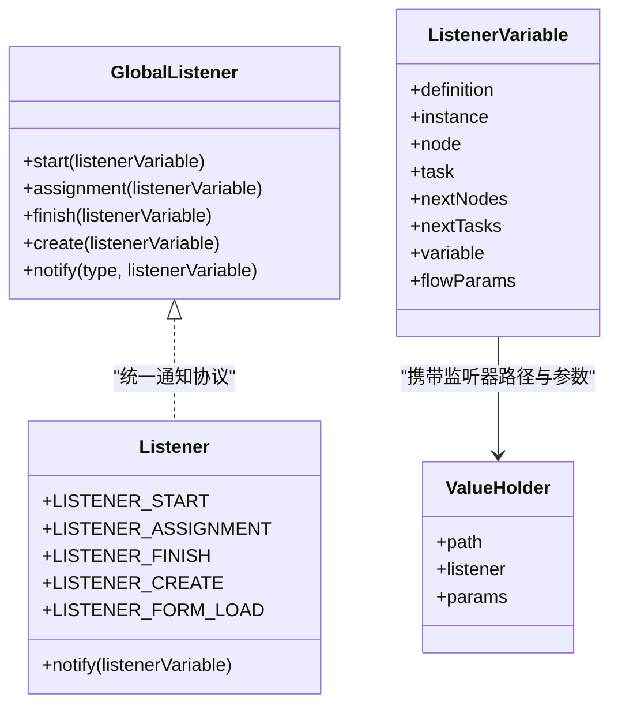
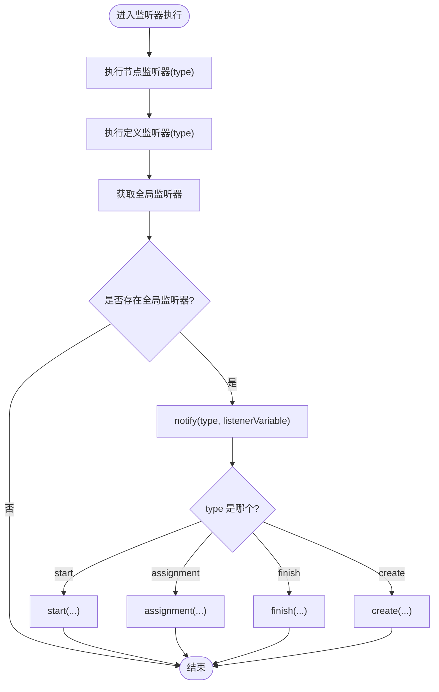
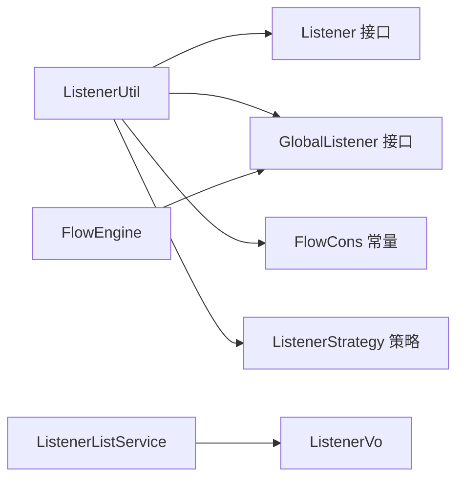

# 全局监听器

<cite>
**本文引用的文件**   
- [GlobalListener.java](file://warm-flow-core/src/main/java/org/dromara/warm/flow/core/listener/GlobalListener.java)
- [Listener.java](file://warm-flow-core/src/main/java/org/dromara/warm/flow/core/listener/Listener.java)
- [ListenerVariable.java](file://warm-flow-core/src/main/java/org/dromara/warm/flow/core/listener/ListenerVariable.java)
- [ValueHolder.java](file://warm-flow-core/src/main/java/org/dromara/warm/flow/core/listener/ValueHolder.java)
- [ListenerUtil.java](file://warm-flow-core/src/main/java/org/dromara/warm/flow/core/utils/ListenerUtil.java)
- [FlowEngine.java](file://warm-flow-core/src/main/java/org/dromara/warm/flow/core/FlowEngine.java)
- [FlowCons.java](file://warm-flow-core/src/main/java/org/dromara/warm/flow/core/constant/FlowCons.java)
- [ListenerStrategy.java](file://warm-flow-core/src/main/java/org/dromara/warm/flow/core/strategy/ListenerStrategy.java)
- [ListenerStrategySpel.java](file://warm-flow-plugin/warm-flow-plugin-modes/warm-flow-plugin-modes-sb/src/main/java/org/dromara/warm/plugin/modes/sb/expression/ListenerStrategySpel.java)
- [ListenerStrategySnEl.java](file://warm-flow-plugin/warm-flow-plugin-modes/warm-flow-plugin-modes-solon/src/main/java/org/dromara/warm/plugin/modes/solon/expression/ListenerStrategySnEl.java)
- [ListenerListService.java](file://warm-flow-plugin/warm-flow-plugin-ui/warm-flow-plugin-ui-core/src/main/java/org/dromara/warm/flow/ui/service/ListenerListService.java)
- [ListenerVo.java](file://warm-flow-plugin/warm-flow-plugin-ui/warm-flow-plugin-ui-core/src/main/java/org/dromara/warm/flow/ui/vo/ListenerVo.java)
</cite>

## 目录
1. [简介](#简介)
2. [项目结构](#项目结构)
3. [核心组件](#核心组件)
4. [架构总览](#架构总览)
5. [详细组件分析](#详细组件分析)
6. [依赖分析](#依赖分析)
7. [性能考量](#性能考量)
8. [故障排查指南](#故障排查指南)
9. [结论](#结论)
10. [附录](#附录)

## 简介
本技术文档围绕“全局监听器”展开，系统性阐述其设计理念、实现机制与在流程引擎中的唯一性与全局作用域。全局监听器作为整个系统范围内的统一扩展点，贯穿任务生命周期的关键节点：任务开始、任务分派、任务完成、任务创建。文档将结合源码路径，给出四类监听方法的应用场景与执行时机，并对比全局监听器与节点监听器的差异与选择策略；同时提供实现示例、参数处理、异常处理与最佳实践，帮助开发者在保证可维护性的同时获得稳定性能。

## 项目结构
全局监听器相关代码主要位于核心模块的监听器与工具层，配合常量、策略与引擎入口，形成完整的监听链路。

**图表来源**
- [GlobalListener.java:26-80](file://warm-flow-core/src/main/java/org/dromara/warm/flow/core/listener/GlobalListener.java#L26-L80)
- [Listener.java:25-58](file://warm-flow-core/src/main/java/org/dromara/warm/flow/core/listener/Listener.java#L25-L58)
- [ListenerVariable.java:32-212](file://warm-flow-core/src/main/java/org/dromara/warm/flow/core/listener/ListenerVariable.java#L32-L212)
- [ValueHolder.java:24-39](file://warm-flow-core/src/main/java/org/dromara/warm/flow/core/listener/ValueHolder.java#L24-L39)
- [ListenerUtil.java:83-94](file://warm-flow-core/src/main/java/org/dromara/warm/flow/core/utils/ListenerUtil.java#L83-L94)
- [FlowEngine.java:192-222](file://warm-flow-core/src/main/java/org/dromara/warm/flow/core/FlowEngine.java#L192-L222)
- [FlowCons.java:25-84](file://warm-flow-core/src/main/java/org/dromara/warm/flow/core/constant/FlowCons.java#L25-L84)
- [ListenerStrategy.java:26-38](file://warm-flow-core/src/main/java/org/dromara/warm/flow/core/strategy/ListenerStrategy.java#L26-L38)
- [ListenerStrategySpel.java:28-41](file://warm-flow-plugin/warm-flow-plugin-modes/warm-flow-plugin-modes-sb/src/main/java/org/dromara/warm/plugin/modes/sb/expression/ListenerStrategySpel.java#L28-L41)
- [ListenerStrategySnEl.java:28-41](file://warm-flow-plugin/warm-flow-plugin-modes/warm-flow-plugin-modes-solon/src/main/java/org/dromara/warm/plugin/modes/solon/expression/ListenerStrategySnEl.java#L28-L41)
- [ListenerListService.java:27-35](file://warm-flow-plugin/warm-flow-plugin-ui/warm-flow-plugin-ui-core/src/main/java/org/dromara/warm/flow/ui/service/ListenerListService.java#L27-L35)
- [ListenerVo.java:34-52](file://warm-flow-plugin/warm-flow-plugin-ui/warm-flow-plugin-ui-core/src/main/java/org/dromara/warm/flow/ui/vo/ListenerVo.java#L34-L52)

**章节来源**
- [GlobalListener.java:26-80](file://warm-flow-core/src/main/java/org/dromara/warm/flow/core/listener/GlobalListener.java#L26-L80)
- [Listener.java:25-58](file://warm-flow-core/src/main/java/org/dromara/warm/flow/core/listener/Listener.java#L25-L58)
- [ListenerVariable.java:32-212](file://warm-flow-core/src/main/java/org/dromara/warm/flow/core/listener/ListenerVariable.java#L32-L212)
- [ValueHolder.java:24-39](file://warm-flow-core/src/main/java/org/dromara/warm/flow/core/listener/ValueHolder.java#L24-L39)
- [ListenerUtil.java:83-94](file://warm-flow-core/src/main/java/org/dromara/warm/flow/core/utils/ListenerUtil.java#L83-L94)
- [FlowEngine.java:192-222](file://warm-flow-core/src/main/java/org/dromara/warm/flow/core/FlowEngine.java#L192-L222)
- [FlowCons.java:25-84](file://warm-flow-core/src/main/java/org/dromara/warm/flow/core/constant/FlowCons.java#L25-L84)
- [ListenerStrategy.java:26-38](file://warm-flow-core/src/main/java/org/dromara/warm/flow/core/strategy/ListenerStrategy.java#L26-L38)
- [ListenerStrategySpel.java:28-41](file://warm-flow-plugin/warm-flow-plugin-modes/warm-flow-plugin-modes-sb/src/main/java/org/dromara/warm/plugin/modes/sb/expression/ListenerStrategySpel.java#L28-L41)
- [ListenerStrategySnEl.java:28-41](file://warm-flow-plugin/warm-flow-plugin-modes/warm-flow-plugin-modes-solon/src/main/java/org/dromara/warm/plugin/modes/solon/expression/ListenerStrategySnEl.java#L28-L41)
- [ListenerListService.java:27-35](file://warm-flow-plugin/warm-flow-plugin-ui/warm-flow-plugin-ui-core/src/main/java/org/dromara/warm/flow/ui/service/ListenerListService.java#L27-L35)
- [ListenerVo.java:34-52](file://warm-flow-plugin/warm-flow-plugin-ui/warm-flow-plugin-ui-core/src/main/java/org/dromara/warm/flow/ui/vo/ListenerVo.java#L34-L52)

## 核心组件
- 全局监听器接口：定义任务生命周期的四个钩子方法，提供统一的全局扩展能力。
- 监听器接口与常量：定义监听器类型枚举与通用通知协议。
- 监听器变量：封装流程上下文、节点、任务、下一节点/任务、流程变量与引擎参数。
- 值持有者：承载监听器路径与参数，用于解析与执行。
- 监听器工具：负责按顺序执行节点监听器、定义监听器与全局监听器，并支持表达式策略。
- 引擎入口：提供全局监听器的初始化与获取。
- 策略接口与实现：支持表达式语言策略（SpEL/SnEL），用于监听器表达式解析。
- UI服务与模型：提供监听器列表与展示模型，辅助设计器配置。

**章节来源**
- [GlobalListener.java:26-80](file://warm-flow-core/src/main/java/org/dromara/warm/flow/core/listener/GlobalListener.java#L26-L80)
- [Listener.java:25-58](file://warm-flow-core/src/main/java/org/dromara/warm/flow/core/listener/Listener.java#L25-L58)
- [ListenerVariable.java:32-212](file://warm-flow-core/src/main/java/org/dromara/warm/flow/core/listener/ListenerVariable.java#L32-L212)
- [ValueHolder.java:24-39](file://warm-flow-core/src/main/java/org/dromara/warm/flow/core/listener/ValueHolder.java#L24-L39)
- [ListenerUtil.java:83-94](file://warm-flow-core/src/main/java/org/dromara/warm/flow/core/utils/ListenerUtil.java#L83-L94)
- [FlowEngine.java:192-222](file://warm-flow-core/src/main/java/org/dromara/warm/flow/core/FlowEngine.java#L192-L222)
- [ListenerStrategy.java:26-38](file://warm-flow-core/src/main/java/org/dromara/warm/flow/core/strategy/ListenerStrategy.java#L26-L38)
- [ListenerStrategySpel.java:28-41](file://warm-flow-plugin/warm-flow-plugin-modes/warm-flow-plugin-modes-sb/src/main/java/org/dromara/warm/plugin/modes/sb/expression/ListenerStrategySpel.java#L28-L41)
- [ListenerStrategySnEl.java:28-41](file://warm-flow-plugin/warm-flow-plugin-modes/warm-flow-plugin-modes-solon/src/main/java/org/dromara/warm/plugin/modes/solon/expression/ListenerStrategySnEl.java#L28-L41)
- [ListenerListService.java:27-35](file://warm-flow-plugin/warm-flow-plugin-ui/warm-flow-plugin-ui-core/src/main/java/org/dromara/warm/flow/ui/service/ListenerListService.java#L27-L35)
- [ListenerVo.java:34-52](file://warm-flow-plugin/warm-flow-plugin-ui/warm-flow-plugin-ui-core/src/main/java/org/dromara/warm/flow/ui/vo/ListenerVo.java#L34-L52)

## 架构总览
全局监听器在流程引擎中的位置与调用链如下：

**图表来源**
- [ListenerUtil.java:83-94](file://warm-flow-core/src/main/java/org/dromara/warm/flow/core/utils/ListenerUtil.java#L83-L94)
- [FlowEngine.java:218-222](file://warm-flow-core/src/main/java/org/dromara/warm/flow/core/FlowEngine.java#L218-L222)
- [GlobalListener.java:64-79](file://warm-flow-core/src/main/java/org/dromara/warm/flow/core/listener/GlobalListener.java#L64-L79)

**章节来源**
- [ListenerUtil.java:83-94](file://warm-flow-core/src/main/java/org/dromara/warm/flow/core/utils/ListenerUtil.java#L83-L94)
- [FlowEngine.java:218-222](file://warm-flow-core/src/main/java/org/dromara/warm/flow/core/FlowEngine.java#L218-L222)
- [GlobalListener.java:64-79](file://warm-flow-core/src/main/java/org/dromara/warm/flow/core/listener/GlobalListener.java#L64-L79)

## 详细组件分析

### 全局监听器接口设计
- 设计理念：全局监听器在整个系统范围内仅存在一个实例，提供统一的生命周期钩子，避免重复逻辑分散在各节点或定义处。
- 生命周期钩子：
  - start：任务开始办理时触发，适合做前置校验、日志记录、资源准备。
  - assignment：动态修改待办任务信息时触发，适合调整下一节点或任务分配策略。
  - finish：当前任务完成后触发，适合做后置处理、统计与归档。
  - create：任务创建时触发，适合初始化任务属性、生成业务编号等。
- 执行时机：由监听器工具在对应事件发生时统一调度，确保全局一致性。

**图表来源**
- [GlobalListener.java:26-80](file://warm-flow-core/src/main/java/org/dromara/warm/flow/core/listener/GlobalListener.java#L26-L80)
- [Listener.java:25-58](file://warm-flow-core/src/main/java/org/dromara/warm/flow/core/listener/Listener.java#L25-L58)
- [ListenerVariable.java:32-212](file://warm-flow-core/src/main/java/org/dromara/warm/flow/core/listener/ListenerVariable.java#L32-L212)
- [ValueHolder.java:24-39](file://warm-flow-core/src/main/java/org/dromara/warm/flow/core/listener/ValueHolder.java#L24-L39)

**章节来源**
- [GlobalListener.java:26-80](file://warm-flow-core/src/main/java/org/dromara/warm/flow/core/listener/GlobalListener.java#L26-L80)
- [Listener.java:25-58](file://warm-flow-core/src/main/java/org/dromara/warm/flow/core/listener/Listener.java#L25-L58)
- [ListenerVariable.java:32-212](file://warm-flow-core/src/main/java/org/dromara/warm/flow/core/listener/ListenerVariable.java#L32-L212)
- [ValueHolder.java:24-39](file://warm-flow-core/src/main/java/org/dromara/warm/flow/core/listener/ValueHolder.java#L24-L39)

### 监听器执行流程与参数处理
- 执行顺序：节点监听器 → 流程定义监听器 → 全局监听器。
- 参数处理：监听器路径支持携带参数，工具类会解析路径与参数，并将参数注入到流程变量中供监听器使用。
- 表达式策略：若监听器路径以特定标记开头，将优先尝试表达式求值策略（SpEL/SnEL），成功则不再加载类路径。

**图表来源**
- [ListenerUtil.java:83-94](file://warm-flow-core/src/main/java/org/dromara/warm/flow/core/utils/ListenerUtil.java#L83-L94)
- [GlobalListener.java:64-79](file://warm-flow-core/src/main/java/org/dromara/warm/flow/core/listener/GlobalListener.java#L64-L79)

**章节来源**
- [ListenerUtil.java:83-94](file://warm-flow-core/src/main/java/org/dromara/warm/flow/core/utils/ListenerUtil.java#L83-L94)
- [FlowCons.java:36-46](file://warm-flow-core/src/main/java/org/dromara/warm/flow/core/constant/FlowCons.java#L36-L46)
- [ListenerStrategy.java:26-38](file://warm-flow-core/src/main/java/org/dromara/warm/flow/core/strategy/ListenerStrategy.java#L26-L38)
- [ListenerStrategySpel.java:28-41](file://warm-flow-plugin/warm-flow-plugin-modes/warm-flow-plugin-modes-sb/src/main/java/org/dromara/warm/plugin/modes/sb/expression/ListenerStrategySpel.java#L28-L41)
- [ListenerStrategySnEl.java:28-41](file://warm-flow-plugin/warm-flow-plugin-modes/warm-flow-plugin-modes-solon/src/main/java/org/dromara/warm/plugin/modes/solon/expression/ListenerStrategySnEl.java#L28-L41)

### 全局监听器与节点监听器的区别与选择
- 区别：
  - 作用域：全局监听器对整套流程生效；节点监听器仅对特定节点生效。
  - 可重用性：全局监听器避免在多个节点重复配置；节点监听器更灵活但易重复。
  - 维护成本：全局监听器集中管理，便于统一变更；节点监听器分散，易遗漏。
- 选择策略：
  - 使用全局监听器：跨节点的通用逻辑（如审计、日志、统一校验、统一后处理）。
  - 使用节点监听器：节点特异性的业务规则（如分支判断、个性化任务生成）。

**章节来源**
- [Listener.java:25-58](file://warm-flow-core/src/main/java/org/dromara/warm/flow/core/listener/Listener.java#L25-L58)
- [ListenerUtil.java:83-94](file://warm-flow-core/src/main/java/org/dromara/warm/flow/core/utils/ListenerUtil.java#L83-L94)

### 实现示例与开发要点
- 接口实现：实现全局监听器接口，按需覆盖 start/assignment/finish/create 方法。
- 参数处理：通过监听器变量读取流程上下文与业务参数；必要时从流程变量中读取/写入。
- 异常处理：在监听器内部捕获并记录异常，避免中断流程；可结合全局异常策略统一处理。
- 表达式监听器：若采用表达式策略，确保表达式安全（参考表达式策略实现）。
- 初始化与注册：通过引擎入口初始化全局监听器，确保在流程启动前完成注册。

**章节来源**
- [GlobalListener.java:26-80](file://warm-flow-core/src/main/java/org/dromara/warm/flow/core/listener/GlobalListener.java#L26-L80)
- [ListenerUtil.java:83-94](file://warm-flow-core/src/main/java/org/dromara/warm/flow/core/utils/ListenerUtil.java#L83-L94)
- [FlowEngine.java:192-222](file://warm-flow-core/src/main/java/org/dromara/warm/flow/core/FlowEngine.java#L192-L222)
- [ListenerStrategySpel.java:28-41](file://warm-flow-plugin/warm-flow-plugin-modes/warm-flow-plugin-modes-sb/src/main/java/org/dromara/warm/plugin/modes/sb/expression/ListenerStrategySpel.java#L28-L41)
- [ListenerStrategySnEl.java:28-41](file://warm-flow-plugin/warm-flow-plugin-modes/warm-flow-plugin-modes-solon/src/main/java/org/dromara/warm/plugin/modes/solon/expression/ListenerStrategySnEl.java#L28-L41)

## 依赖分析
- 监听器工具依赖：
  - 监听器接口与类型常量：用于识别监听器类型与统一通知。
  - 全局监听器：在执行链末端统一触发。
  - 常量与正则：用于解析监听器路径与参数。
  - 表达式策略：优先执行表达式，避免不必要的类加载。
- 引擎入口依赖：
  - 全局监听器实例：提供全局监听器的获取与初始化。
- UI服务依赖：
  - 监听器列表服务与视图模型：为设计器提供监听器类型与路径提示。

**图表来源**
- [ListenerUtil.java:83-94](file://warm-flow-core/src/main/java/org/dromara/warm/flow/core/utils/ListenerUtil.java#L83-L94)
- [FlowEngine.java:192-222](file://warm-flow-core/src/main/java/org/dromara/warm/flow/core/FlowEngine.java#L192-L222)
- [ListenerListService.java:27-35](file://warm-flow-plugin/warm-flow-plugin-ui/warm-flow-plugin-ui-core/src/main/java/org/dromara/warm/flow/ui/service/ListenerListService.java#L27-L35)
- [ListenerVo.java:34-52](file://warm-flow-plugin/warm-flow-plugin-ui/warm-flow-plugin-ui-core/src/main/java/org/dromara/warm/flow/ui/vo/ListenerVo.java#L34-L52)

**章节来源**
- [ListenerUtil.java:83-94](file://warm-flow-core/src/main/java/org/dromara/warm/flow/core/utils/ListenerUtil.java#L83-L94)
- [FlowEngine.java:192-222](file://warm-flow-core/src/main/java/org/dromara/warm/flow/core/FlowEngine.java#L192-L222)
- [ListenerListService.java:27-35](file://warm-flow-plugin/warm-flow-plugin-ui/warm-flow-plugin-ui-core/src/main/java/org/dromara/warm/flow/ui/service/ListenerListService.java#L27-L35)
- [ListenerVo.java:34-52](file://warm-flow-plugin/warm-flow-plugin-ui/warm-flow-plugin-ui-core/src/main/java/org/dromara/warm/flow/ui/vo/ListenerVo.java#L34-L52)

## 性能考量
- 减少全局监听器复杂度：将重逻辑拆分为独立服务或策略，避免在全局监听器中执行耗时操作。
- 合理使用表达式策略：表达式优先执行，减少不必要的类加载与反射开销。
- 控制监听器数量：全局监听器应聚焦通用逻辑，避免过度配置导致链路过长。
- 上下文最小化：仅在监听器变量中传递必要字段，降低序列化与传播成本。
- 异步化非关键路径：对不影响流程推进的操作采用异步处理，提升吞吐。

## 故障排查指南
- 全局监听器未生效：
  - 检查引擎是否正确初始化全局监听器。
  - 确认监听器工具在对应事件中调用了全局监听器通知。
- 监听器参数未生效：
  - 检查监听器路径参数解析逻辑与流程变量注入逻辑。
  - 确认表达式策略是否正确执行并阻断后续类加载。
- 表达式执行异常：
  - 校验表达式策略实现与安全限制，确保表达式合法。
- 节点监听器与全局监听器冲突：
  - 明确职责边界，避免重复逻辑在多处实现。

**章节来源**
- [FlowEngine.java:192-222](file://warm-flow-core/src/main/java/org/dromara/warm/flow/core/FlowEngine.java#L192-L222)
- [ListenerUtil.java:83-94](file://warm-flow-core/src/main/java/org/dromara/warm/flow/core/utils/ListenerUtil.java#L83-L94)
- [FlowCons.java:36-46](file://warm-flow-core/src/main/java/org/dromara/warm/flow/core/constant/FlowCons.java#L36-L46)
- [ListenerStrategySpel.java:28-41](file://warm-flow-plugin/warm-flow-plugin-modes/warm-flow-plugin-modes-sb/src/main/java/org/dromara/warm/plugin/modes/sb/expression/ListenerStrategySpel.java#L28-L41)
- [ListenerStrategySnEl.java:28-41](file://warm-flow-plugin/warm-flow-plugin-modes/warm-flow-plugin-modes-solon/src/main/java/org/dromara/warm/plugin/modes/solon/expression/ListenerStrategySnEl.java#L28-L41)

## 结论
全局监听器通过统一的生命周期钩子，为流程引擎提供了强大的全局扩展能力。它与节点监听器互补：前者强调跨节点的通用逻辑，后者强调节点特异性规则。遵循本文的实现要点、参数处理与性能建议，可在保证系统稳定性的同时，最大化发挥全局监听器的价值。

## 附录
- 监听器类型常量：start、assignment、finish、create、formLoad。
- 监听器变量字段：流程定义、流程实例、节点、任务、下一节点/任务、流程变量、引擎参数。
- 表达式策略：SpEL 与 SnEL，用于监听器表达式解析与安全控制。

**章节来源**
- [Listener.java:25-58](file://warm-flow-core/src/main/java/org/dromara/warm/flow/core/listener/Listener.java#L25-L58)
- [ListenerVariable.java:32-212](file://warm-flow-core/src/main/java/org/dromara/warm/flow/core/listener/ListenerVariable.java#L32-L212)
- [ListenerStrategySpel.java:28-41](file://warm-flow-plugin/warm-flow-plugin-modes/warm-flow-plugin-modes-sb/src/main/java/org/dromara/warm/plugin/modes/sb/expression/ListenerStrategySpel.java#L28-L41)
- [ListenerStrategySnEl.java:28-41](file://warm-flow-plugin/warm-flow-plugin-modes/warm-flow-plugin-modes-solon/src/main/java/org/dromara/warm/plugin/modes/solon/expression/ListenerStrategySnEl.java#L28-L41)