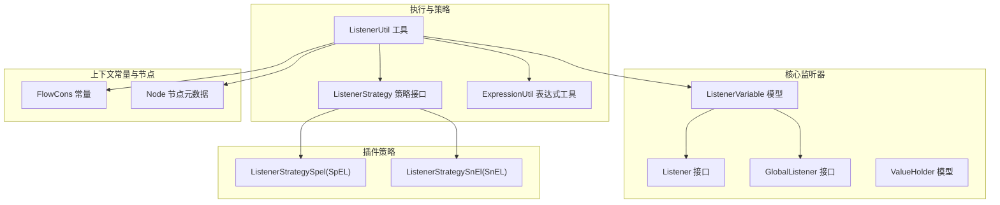
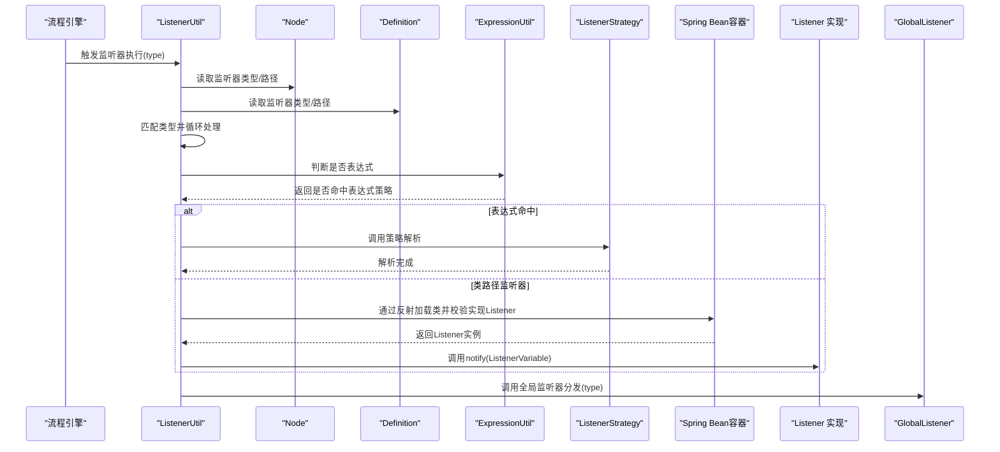
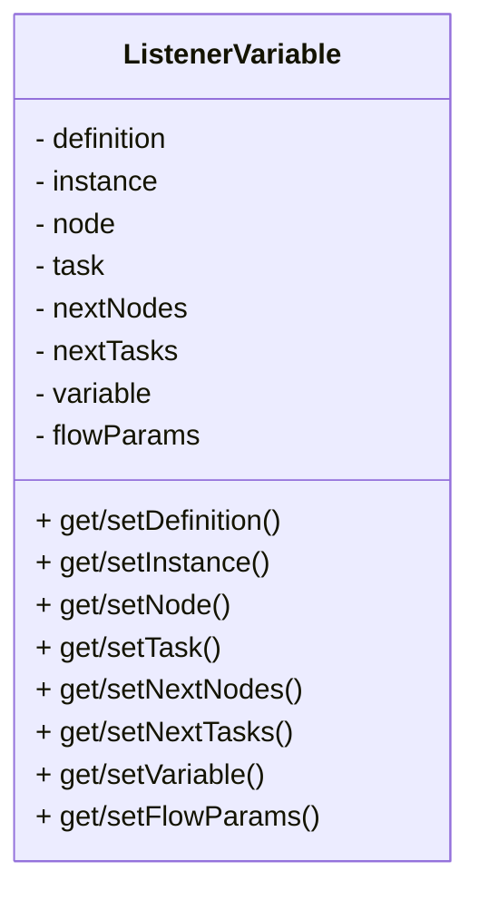
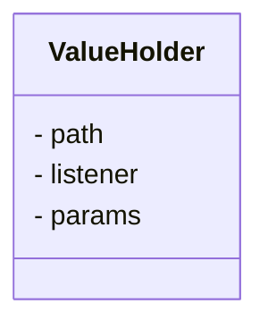
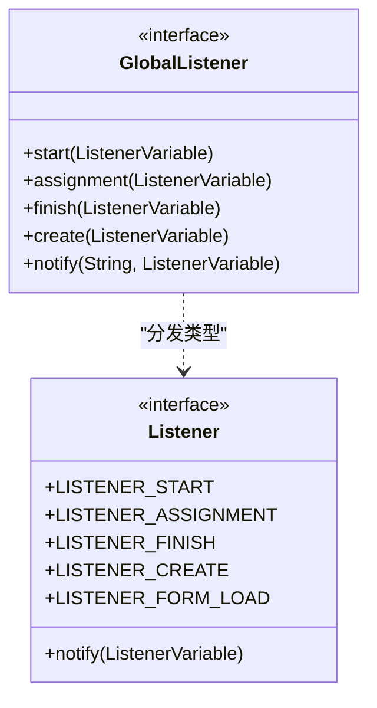
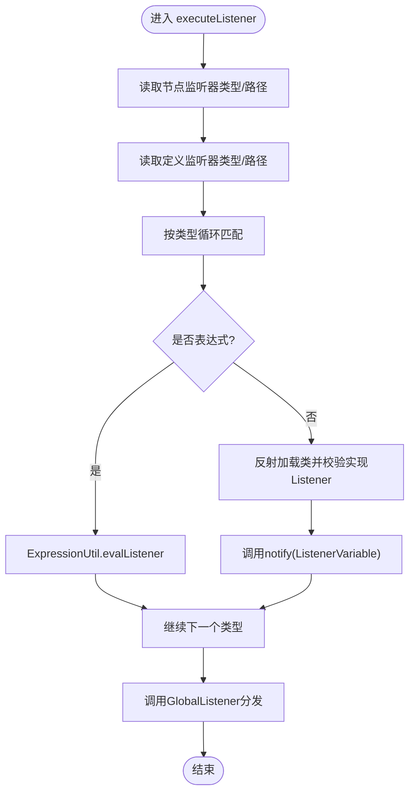
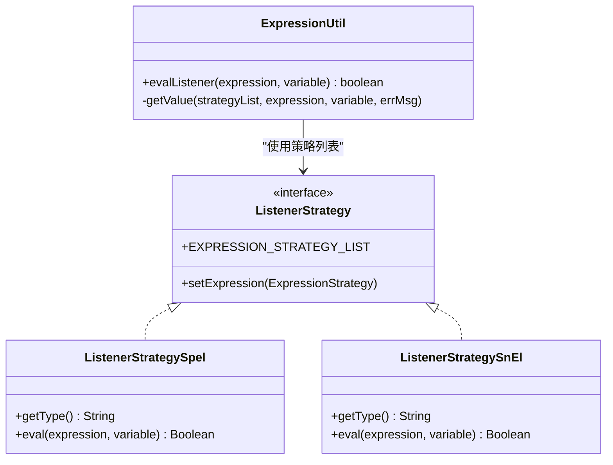
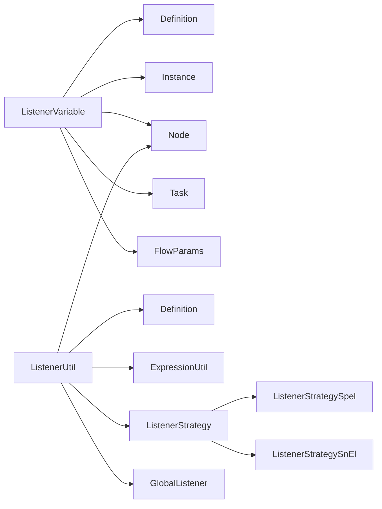

# 变量监听器

<cite>
**本文引用的文件**
- [ListenerVariable.java](file://warm-flow-core/src/main/java/org/dromara/warm/flow/core/listener/ListenerVariable.java)
- [ValueHolder.java](file://warm-flow-core/src/main/java/org/dromara/warm/flow/core/listener/ValueHolder.java)
- [Listener.java](file://warm-flow-core/src/main/java/org/dromara/warm/flow/core/listener/Listener.java)
- [GlobalListener.java](file://warm-flow-core/src/main/java/org/dromara/warm/flow/core/listener/GlobalListener.java)
- [ListenerUtil.java](file://warm-flow-core/src/main/java/org/dromara/warm/flow/core/utils/ListenerUtil.java)
- [ListenerStrategy.java](file://warm-flow-core/src/main/java/org/dromara/warm/flow/core/strategy/ListenerStrategy.java)
- [ListenerStrategySpel.java](file://warm-flow-plugin/warm-flow-plugin-modes/warm-flow-plugin-modes-sb/src/main/java/org/dromara/warm/plugin/modes/sb/expression/ListenerStrategySpel.java)
- [ListenerStrategySnEl.java](file://warm-flow-plugin/warm-flow-plugin-modes/warm-flow-plugin-modes-solon/src/main/java/org/dromara/warm/plugin/modes/solon/expression/ListenerStrategySnEl.java)
- [ExpressionUtil.java](file://warm-flow-core/src/main/java/org/dromara/warm/flow/core/utils/ExpressionUtil.java)
- [FlowCons.java](file://warm-flow-core/src/main/java/org/dromara/warm/flow/core/constant/FlowCons.java)
- [Node.java](file://warm-flow-core/src/main/java/org/dromara/warm/flow/core/entity/Node.java)
</cite>

## 目录
1. [简介](#简介)
2. [项目结构](#项目结构)
3. [核心组件](#核心组件)
4. [架构总览](#架构总览)
5. [详细组件分析](#详细组件分析)
6. [依赖关系分析](#依赖关系分析)
7. [性能考虑](#性能考虑)
8. [故障排查指南](#故障排查指南)
9. [结论](#结论)
10. [附录：使用示例与最佳实践](#附录使用示例与最佳实践)

## 简介
本技术文档围绕“变量监听器”展开，系统性解析其设计理念与实现机制，重点覆盖：
- 流程变量的监听、传递与处理
- ListenerVariable 的核心能力：变量的获取、设置、更新
- ValueHolder 的值持有机制：路径、监听器、参数的封装与生命周期
- 监听器在流程执行中的应用场景：变量变更通知、数据同步、状态跟踪
- 使用示例与开发要点：变量定义、监听器实现、事件处理
- 性能优化与内存管理建议

## 项目结构
变量监听器相关代码主要位于核心模块与插件模块：
- 核心监听器接口与模型：Listener、GlobalListener、ListenerVariable、ValueHolder
- 监听器执行工具：ListenerUtil
- 表达式策略与解析：ListenerStrategy、ExpressionUtil、SpEL/SnEL 插件策略
- 常量与节点元数据：FlowCons、Node

图表来源
- [Listener.java:25-58](file://warm-flow-core/src/main/java/org/dromara/warm/flow/core/listener/Listener.java#L25-L58)
- [GlobalListener.java:26-80](file://warm-flow-core/src/main/java/org/dromara/warm/flow/core/listener/GlobalListener.java#L26-L80)
- [ListenerVariable.java:32-212](file://warm-flow-core/src/main/java/org/dromara/warm/flow/core/listener/ListenerVariable.java#L32-L212)
- [ValueHolder.java:24-39](file://warm-flow-core/src/main/java/org/dromara/warm/flow/core/listener/ValueHolder.java#L24-L39)
- [ListenerUtil.java:40-158](file://warm-flow-core/src/main/java/org/dromara/warm/flow/core/utils/ListenerUtil.java#L40-L158)
- [ListenerStrategy.java:26-38](file://warm-flow-core/src/main/java/org/dromara/warm/flow/core/strategy/ListenerStrategy.java#L26-L38)
- [ListenerStrategySpel.java:28-40](file://warm-flow-plugin/warm-flow-plugin-modes/warm-flow-plugin-modes-sb/src/main/java/org/dromara/warm/plugin/modes/sb/expression/ListenerStrategySpel.java#L28-L40)
- [ListenerStrategySnEl.java:28-40](file://warm-flow-plugin/warm-flow-plugin-modes/warm-flow-plugin-modes-solon/src/main/java/org/dromara/warm/plugin/modes/solon/expression/ListenerStrategySnEl.java#L28-L40)
- [ExpressionUtil.java:36-195](file://warm-flow-core/src/main/java/org/dromara/warm/flow/core/utils/ExpressionUtil.java#L36-L195)
- [FlowCons.java:25-84](file://warm-flow-core/src/main/java/org/dromara/warm/flow/core/constant/FlowCons.java#L25-L84)
- [Node.java:30-161](file://warm-flow-core/src/main/java/org/dromara/warm/flow/core/entity/Node.java#L30-L161)

章节来源
- [ListenerVariable.java:32-212](file://warm-flow-core/src/main/java/org/dromara/warm/flow/core/listener/ListenerVariable.java#L32-L212)
- [ListenerUtil.java:40-158](file://warm-flow-core/src/main/java/org/dromara/warm/flow/core/utils/ListenerUtil.java#L40-L158)
- [FlowCons.java:25-84](file://warm-flow-core/src/main/java/org/dromara/warm/flow/core/constant/FlowCons.java#L25-L84)

## 核心组件
- Listener：监听器接口，定义监听类型常量与 notify 方法，用于接收 ListenerVariable 并执行业务逻辑。
- GlobalListener：全局监听器接口，默认空实现，按类型分发到对应方法，便于系统级统一处理。
- ListenerVariable：监听器上下文载体，封装 Definition、Instance、Node、Task、nextNodes、nextTasks、variable、flowParams 等，贯穿监听器执行全链路。
- ValueHolder：值持有器，封装监听器路径与参数，供解析与反射调用使用。
- ListenerUtil：监听器执行工具，负责按节点与定义层级执行监听器、表达式优先判断、参数注入、全局监听器分发。
- ListenerStrategy：监听器表达式策略接口，配合 ExpressionUtil 统一调度。
- FlowCons：常量定义，包含监听器分隔符、监听器参数键、监听器正则等。

章节来源
- [Listener.java:25-58](file://warm-flow-core/src/main/java/org/dromara/warm/flow/core/listener/Listener.java#L25-L58)
- [GlobalListener.java:26-80](file://warm-flow-core/src/main/java/org/dromara/warm/flow/core/listener/GlobalListener.java#L26-L80)
- [ListenerVariable.java:32-212](file://warm-flow-core/src/main/java/org/dromara/warm/flow/core/listener/ListenerVariable.java#L32-L212)
- [ValueHolder.java:24-39](file://warm-flow-core/src/main/java/org/dromara/warm/flow/core/listener/ValueHolder.java#L24-L39)
- [ListenerUtil.java:40-158](file://warm-flow-core/src/main/java/org/dromara/warm/flow/core/utils/ListenerUtil.java#L40-L158)
- [ListenerStrategy.java:26-38](file://warm-flow-core/src/main/java/org/dromara/warm/flow/core/strategy/ListenerStrategy.java#L26-L38)
- [ExpressionUtil.java:36-195](file://warm-flow-core/src/main/java/org/dromara/warm/flow/core/utils/ExpressionUtil.java#L36-L195)
- [FlowCons.java:25-84](file://warm-flow-core/src/main/java/org/dromara/warm/flow/core/constant/FlowCons.java#L25-L84)

## 架构总览
变量监听器的执行链路如下：
- 在流程节点事件（开始、分派、完成、创建）发生时，由 ListenerUtil 收敛执行
- 依次读取 Node 与 Definition 的监听器配置，按类型匹配并执行
- 若监听器路径为表达式（如以特定前缀开头），优先交由 ExpressionUtil 与 ListenerStrategy 解析执行
- 否则通过反射加载类路径，强校验实现 Listener 接口后调用 notify
- 最后调用全局监听器 GlobalListener 进行统一分发

图表来源
- [ListenerUtil.java:83-137](file://warm-flow-core/src/main/java/org/dromara/warm/flow/core/utils/ListenerUtil.java#L83-L137)
- [ExpressionUtil.java:130-133](file://warm-flow-core/src/main/java/org/dromara/warm/flow/core/utils/ExpressionUtil.java#L130-L133)
- [ListenerStrategy.java:26-38](file://warm-flow-core/src/main/java/org/dromara/warm/flow/core/strategy/ListenerStrategy.java#L26-L38)
- [Listener.java:25-58](file://warm-flow-core/src/main/java/org/dromara/warm/flow/core/listener/Listener.java#L25-L58)
- [GlobalListener.java:64-79](file://warm-flow-core/src/main/java/org/dromara/warm/flow/core/listener/GlobalListener.java#L64-L79)

## 详细组件分析

### ListenerVariable：监听器上下文模型
- 职责：承载监听器执行所需的全部上下文，包括流程定义、实例、节点、任务、下一跳节点与任务、流程变量、工作流内置参数等
- 设计要点：
  - 提供多构造函数以适配不同场景（仅变量、含节点、含任务、含下一跳等）
  - 提供 getter/setter 便于在监听器链路中传递与更新
  - toString 便于日志追踪
- 生命周期：随监听器事件产生与销毁，避免跨事件复用同一实例，防止脏读

图表来源
- [ListenerVariable.java:32-212](file://warm-flow-core/src/main/java/org/dromara/warm/flow/core/listener/ListenerVariable.java#L32-L212)

章节来源
- [ListenerVariable.java:32-212](file://warm-flow-core/src/main/java/org/dromara/warm/flow/core/listener/ListenerVariable.java#L32-L212)

### ValueHolder：监听器路径与参数持有
- 职责：封装监听器路径与参数，供解析与反射调用
- 关键点：
  - path：监听器类路径
  - params：监听器参数字符串（可能为 JSON 或其他格式）
- 生命周期：仅在解析阶段使用，解析后即被丢弃或复用，避免长期驻留

图表来源
- [ValueHolder.java:24-39](file://warm-flow-core/src/main/java/org/dromara/warm/flow/core/listener/ValueHolder.java#L24-L39)

章节来源
- [ValueHolder.java:24-39](file://warm-flow-core/src/main/java/org/dromara/warm/flow/core/listener/ValueHolder.java#L24-L39)

### Listener 与 GlobalListener：监听器契约与全局分发
- Listener：定义监听类型常量与 notify 方法，监听器实现需按类型处理 ListenerVariable
- GlobalListener：默认空实现，按类型分发到对应方法，便于系统级统一处理

图表来源
- [Listener.java:25-58](file://warm-flow-core/src/main/java/org/dromara/warm/flow/core/listener/Listener.java#L25-L58)
- [GlobalListener.java:26-80](file://warm-flow-core/src/main/java/org/dromara/warm/flow/core/listener/GlobalListener.java#L26-L80)

章节来源
- [Listener.java:25-58](file://warm-flow-core/src/main/java/org/dromara/warm/flow/core/listener/Listener.java#L25-L58)
- [GlobalListener.java:26-80](file://warm-flow-core/src/main/java/org/dromara/warm/flow/core/listener/GlobalListener.java#L26-L80)

### ListenerUtil：监听器执行与分发
- 核心职责：
  - endCreateListener：先执行完成监听器，再对下一节点执行创建监听器
  - executeStart/executeAssignment/executeFinish/executeCreate：按类型执行监听器
  - executeListener：按节点与定义顺序执行监听器，并调用全局监听器
  - execute：解析监听器类型与路径，优先表达式策略，否则反射加载类并调用 notify
  - getListenerPath：从字符串中提取 path 与 params
- 关键流程图：

图表来源
- [ListenerUtil.java:83-137](file://warm-flow-core/src/main/java/org/dromara/warm/flow/core/utils/ListenerUtil.java#L83-L137)
- [ExpressionUtil.java:130-133](file://warm-flow-core/src/main/java/org/dromara/warm/flow/core/utils/ExpressionUtil.java#L130-L133)

章节来源
- [ListenerUtil.java:40-158](file://warm-flow-core/src/main/java/org/dromara/warm/flow/core/utils/ListenerUtil.java#L40-L158)

### 表达式策略与解析：ListenerStrategy 与 ExpressionUtil
- ListenerStrategy：监听器表达式策略接口，维护策略列表，支持扩展
- ExpressionUtil.evalListener：根据策略列表匹配并执行表达式，返回布尔值表示是否命中策略
- 插件策略：
  - ListenerStrategySpel：基于 SpEL 的监听器表达式策略
  - ListenerStrategySnEl：基于 SnEL 的监听器表达式策略

图表来源
- [ListenerStrategy.java:26-38](file://warm-flow-core/src/main/java/org/dromara/warm/flow/core/strategy/ListenerStrategy.java#L26-L38)
- [ExpressionUtil.java:130-173](file://warm-flow-core/src/main/java/org/dromara/warm/flow/core/utils/ExpressionUtil.java#L130-L173)
- [ListenerStrategySpel.java:28-40](file://warm-flow-plugin/warm-flow-plugin-modes/warm-flow-plugin-modes-sb/src/main/java/org/dromara/warm/plugin/modes/sb/expression/ListenerStrategySpel.java#L28-L40)
- [ListenerStrategySnEl.java:28-40](file://warm-flow-plugin/warm-flow-plugin-modes/warm-flow-plugin-modes-solon/src/main/java/org/dromara/warm/plugin/modes/solon/expression/ListenerStrategySnEl.java#L28-L40)

章节来源
- [ListenerStrategy.java:26-38](file://warm-flow-core/src/main/java/org/dromara/warm/flow/core/strategy/ListenerStrategy.java#L26-L38)
- [ExpressionUtil.java:36-195](file://warm-flow-core/src/main/java/org/dromara/warm/flow/core/utils/ExpressionUtil.java#L36-L195)
- [ListenerStrategySpel.java:28-40](file://warm-flow-plugin/warm-flow-plugin-modes/warm-flow-plugin-modes-sb/src/main/java/org/dromara/warm/plugin/modes/sb/expression/ListenerStrategySpel.java#L28-L40)
- [ListenerStrategySnEl.java:28-40](file://warm-flow-plugin/warm-flow-plugin-modes/warm-flow-plugin-modes-solon/src/main/java/org/dromara/warm/plugin/modes/solon/expression/ListenerStrategySnEl.java#L28-L40)

### 常量与节点：FlowCons 与 Node
- FlowCons：定义监听器分隔符、监听器参数键、监听器正则等
- Node：提供监听器类型与路径字段，作为监听器配置的数据源

章节来源
- [FlowCons.java:25-84](file://warm-flow-core/src/main/java/org/dromara/warm/flow/core/constant/FlowCons.java#L25-L84)
- [Node.java:106-112](file://warm-flow-core/src/main/java/org/dromara/warm/flow/core/entity/Node.java#L106-L112)

## 依赖关系分析
- ListenerVariable 依赖于 Definition、Instance、Node、Task、FlowParams 等实体与参数
- ListenerUtil 依赖于 Node、Definition、ExpressionUtil、ListenerStrategy、GlobalListener
- 表达式策略通过 ExpressionUtil 注册到 ListenerStrategy 的策略列表中
- 插件层提供 SpEL 与 SnEL 的具体策略实现

图表来源
- [ListenerVariable.java:32-212](file://warm-flow-core/src/main/java/org/dromara/warm/flow/core/listener/ListenerVariable.java#L32-L212)
- [ListenerUtil.java:83-137](file://warm-flow-core/src/main/java/org/dromara/warm/flow/core/utils/ListenerUtil.java#L83-L137)
- [ListenerStrategy.java:26-38](file://warm-flow-core/src/main/java/org/dromara/warm/flow/core/strategy/ListenerStrategy.java#L26-L38)
- [ListenerStrategySpel.java:28-40](file://warm-flow-plugin/warm-flow-plugin-modes/warm-flow-plugin-modes-sb/src/main/java/org/dromara/warm/plugin/modes/sb/expression/ListenerStrategySpel.java#L28-L40)
- [ListenerStrategySnEl.java:28-40](file://warm-flow-plugin/warm-flow-plugin-modes/warm-flow-plugin-modes-solon/src/main/java/org/dromara/warm/plugin/modes/solon/expression/ListenerStrategySnEl.java#L28-L40)

章节来源
- [ListenerUtil.java:83-137](file://warm-flow-core/src/main/java/org/dromara/warm/flow/core/utils/ListenerUtil.java#L83-L137)
- [ListenerStrategy.java:26-38](file://warm-flow-core/src/main/java/org/dromara/warm/flow/core/strategy/ListenerStrategy.java#L26-L38)

## 性能考虑
- 表达式优先：优先通过表达式策略快速判定与执行，减少反射开销
- 策略注册顺序：采用倒序匹配，后注册策略优先，避免重复扫描
- 变量参数复用：通过 FlowCons.WARM_LISTENER_PARAM 注入参数，避免额外序列化
- 对象池与缓存：建议在高并发场景下对反射加载的监听器实例进行缓存，降低类加载与校验成本
- 内存管理：避免在 ListenerVariable 中持有大对象；及时清理临时变量；监听器内部避免持有外部上下文引用

## 故障排查指南
- 监听器未生效
  - 检查 Node/Definition 的监听器类型与路径是否正确配置
  - 确认类型与路径数组长度一致，且按顺序匹配
- 表达式未执行
  - 确认表达式前缀与策略类型一致
  - 检查 ExpressionUtil 是否已注册对应策略
- 反射加载失败
  - 确认类路径正确且实现了 Listener 接口
  - 检查 Spring Bean 容器是否可获取该 Bean
- 全局监听器未触发
  - 确认 FlowEngine 中已设置 GlobalListener
  - 检查类型分发逻辑是否正确

章节来源
- [ListenerUtil.java:96-137](file://warm-flow-core/src/main/java/org/dromara/warm/flow/core/utils/ListenerUtil.java#L96-L137)
- [ExpressionUtil.java:155-173](file://warm-flow-core/src/main/java/org/dromara/warm/flow/core/utils/ExpressionUtil.java#L155-L173)
- [GlobalListener.java:64-79](file://warm-flow-core/src/main/java/org/dromara/warm/flow/core/listener/GlobalListener.java#L64-L79)

## 结论
变量监听器通过 ListenerVariable 将流程上下文标准化传递，借助 ListenerUtil 与 ExpressionUtil 实现表达式与类路径两种执行方式，并通过 GlobalListener 提供系统级统一处理。该设计具备良好的扩展性与可维护性，适合在复杂流程场景中实现变量变更通知、数据同步与状态跟踪等关键能力。

## 附录：使用示例与最佳实践
- 变量定义
  - 在流程变量 Map 中存放业务数据，必要时通过 FlowCons.WARM_LISTENER_PARAM 注入监听器参数
- 监听器实现
  - 实现 Listener 接口，按类型处理 ListenerVariable，避免在监听器内持有长生命周期上下文
- 事件处理
  - 在开始/分派/完成/创建等事件中，依据 ListenerVariable 更新业务状态或触发外部系统
- 表达式监听器
  - 使用表达式策略（如 SpEL/SnEL）编写监听器表达式，优先执行表达式逻辑
- 性能与内存
  - 减少反射次数，合理缓存监听器实例
  - 控制变量大小，避免在监听器中复制大对象
  - 及时清理临时变量，避免内存泄漏

章节来源
- [Listener.java:25-58](file://warm-flow-core/src/main/java/org/dromara/warm/flow/core/listener/Listener.java#L25-L58)
- [ListenerUtil.java:96-137](file://warm-flow-core/src/main/java/org/dromara/warm/flow/core/utils/ListenerUtil.java#L96-L137)
- [ExpressionUtil.java:130-133](file://warm-flow-core/src/main/java/org/dromara/warm/flow/core/utils/ExpressionUtil.java#L130-L133)
- [FlowCons.java:44-46](file://warm-flow-core/src/main/java/org/dromara/warm/flow/core/constant/FlowCons.java#L44-L46)