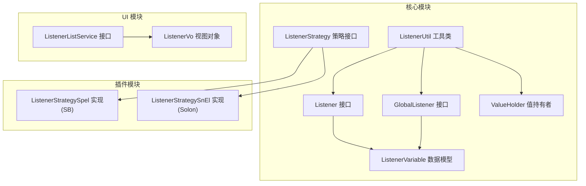
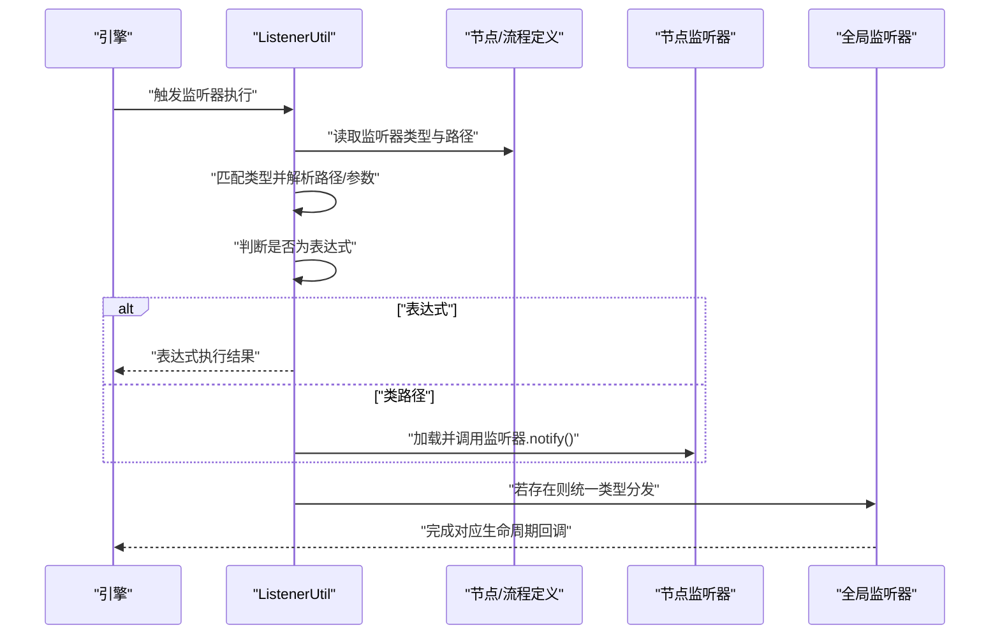
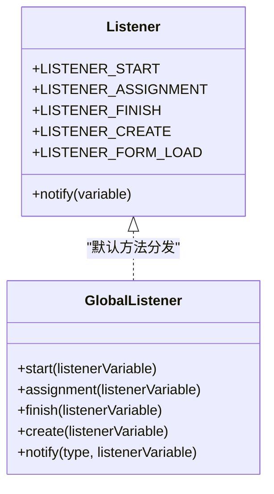
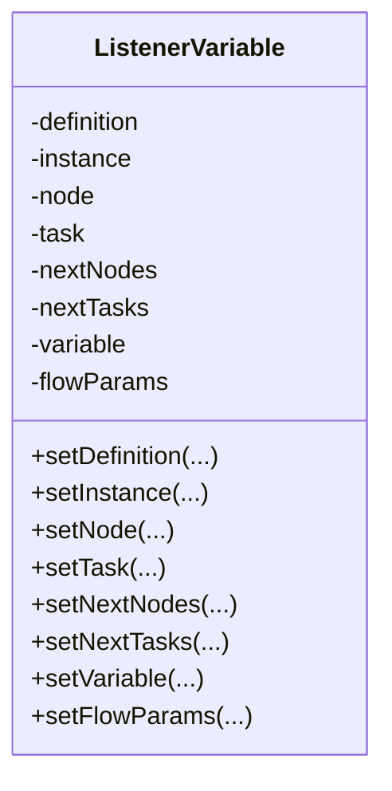
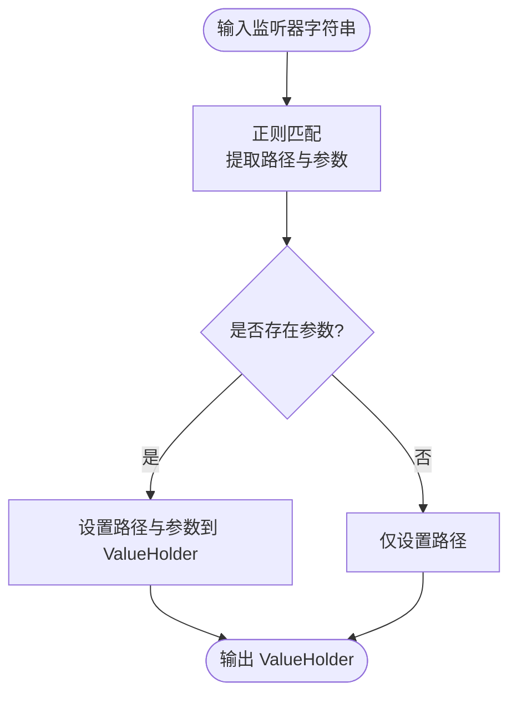
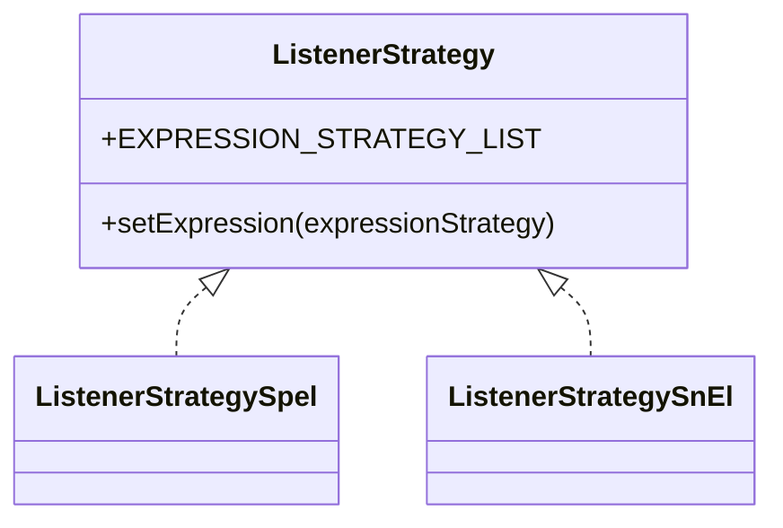
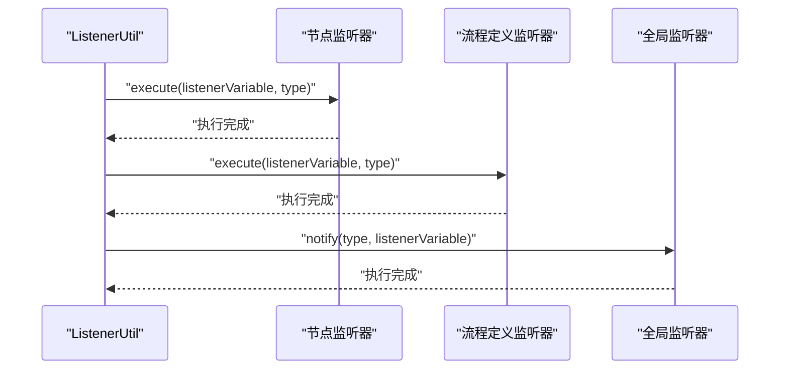
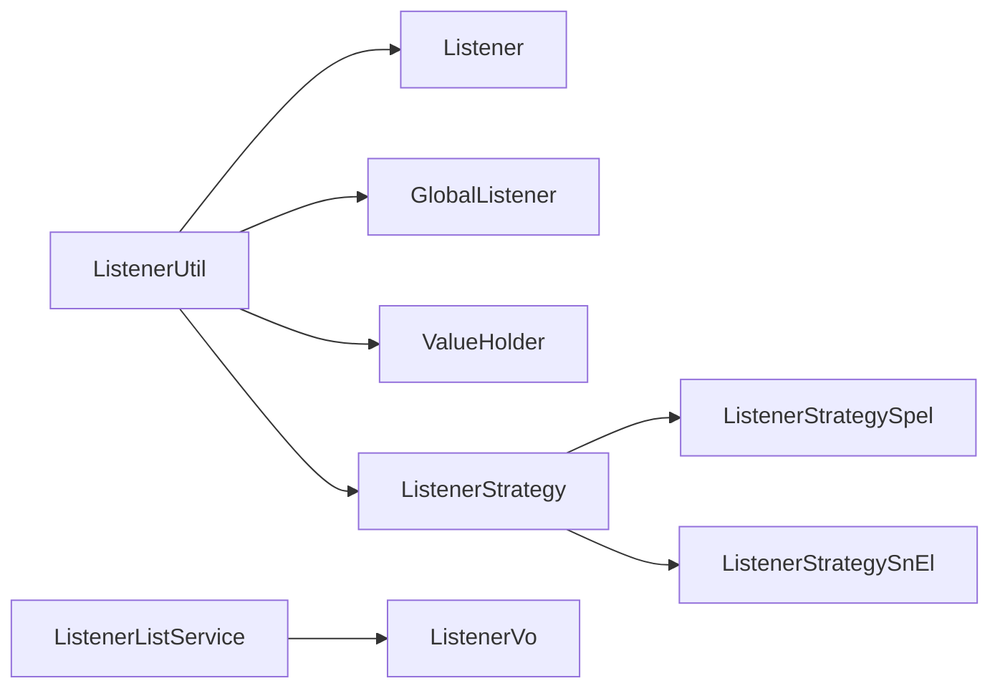

# 监听器系统

<cite>
**本文引用的文件**
- [GlobalListener.java](file://warm-flow-core/src/main/java/org/dromara/warm/flow/core/listener/GlobalListener.java)
- [Listener.java](file://warm-flow-core/src/main/java/org/dromara/warm/flow/core/listener/Listener.java)
- [ListenerVariable.java](file://warm-flow-core/src/main/java/org/dromara/warm/flow/core/listener/ListenerVariable.java)
- [ValueHolder.java](file://warm-flow-core/src/main/java/org/dromara/warm/flow/core/listener/ValueHolder.java)
- [ListenerStrategy.java](file://warm-flow-core/src/main/java/org/dromara/warm/flow/core/strategy/ListenerStrategy.java)
- [ListenerUtil.java](file://warm-flow-core/src/main/java/org/dromara/warm/flow/core/utils/ListenerUtil.java)
- [ListenerStrategySpel.java](file://warm-flow-plugin/warm-flow-plugin-modes/warm-flow-plugin-modes-sb/src/main/java/org/dromara/warm/plugin/modes/sb/expression/ListenerStrategySpel.java)
- [ListenerStrategySnEl.java](file://warm-flow-plugin/warm-flow-plugin-modes/warm-flow-plugin-modes-solon/src/main/java/org/dromara/warm/plugin/modes/solon/expression/ListenerStrategySnEl.java)
- [ListenerListService.java](file://warm-flow-plugin/warm-flow-plugin-ui/warm-flow-plugin-ui-core/src/main/java/org/dromara/warm/flow/ui/service/ListenerListService.java)
- [ListenerVo.java](file://warm-flow-plugin/warm-flow-plugin-ui/warm-flow-plugin-ui-core/src/main/java/org/dromara/warm/flow/ui/vo/ListenerVo.java)
</cite>

## 目录
1. [简介](#简介)
2. [项目结构](#项目结构)
3. [核心组件](#核心组件)
4. [架构总览](#架构总览)
5. [详细组件分析](#详细组件分析)
6. [依赖分析](#依赖分析)
7. [性能考虑](#性能考虑)
8. [故障排查指南](#故障排查指南)
9. [结论](#结论)
10. [附录](#附录)

## 简介
本技术文档围绕 Warm-Flow 的监听器系统进行深入解析，涵盖全局监听器与节点监听器的设计理念、生命周期管理、变量监听器的数据模型、监听器策略模式的实现方式，并提供监听器开发指南、最佳实践与性能优化建议。目标是帮助开发者在不直接阅读源码的情况下，也能快速理解并正确使用监听器扩展工作流行为。

## 项目结构
监听器相关代码主要分布在以下模块中：
- 核心模块：定义监听器接口、变量模型、工具类与策略接口
- 插件模块：提供基于不同运行环境（Spring Boot/Solon）的表达式策略实现
- UI 模块：提供监听器列表服务与视图对象，用于设计器下拉选择

图表来源
- [Listener.java:25-58](file://warm-flow-core/src/main/java/org/dromara/warm/flow/core/listener/Listener.java#L25-L58)
- [GlobalListener.java:26-80](file://warm-flow-core/src/main/java/org/dromara/warm/flow/core/listener/GlobalListener.java#L26-L80)
- [ListenerVariable.java:32-212](file://warm-flow-core/src/main/java/org/dromara/warm/flow/core/listener/ListenerVariable.java#L32-L212)
- [ValueHolder.java:24-39](file://warm-flow-core/src/main/java/org/dromara/warm/flow/core/listener/ValueHolder.java#L24-L39)
- [ListenerStrategy.java:26-38](file://warm-flow-core/src/main/java/org/dromara/warm/flow/core/strategy/ListenerStrategy.java#L26-L38)
- [ListenerUtil.java:39-158](file://warm-flow-core/src/main/java/org/dromara/warm/flow/core/utils/ListenerUtil.java#L39-L158)
- [ListenerStrategySpel.java](file://warm-flow-plugin/warm-flow-plugin-modes/warm-flow-plugin-modes-sb/src/main/java/org/dromara/warm/plugin/modes/sb/expression/ListenerStrategySpel.java)
- [ListenerStrategySnEl.java](file://warm-flow-plugin/warm-flow-plugin-modes/warm-flow-plugin-modes-solon/src/main/java/org/dromara/warm/plugin/modes/solon/expression/ListenerStrategySnEl.java)
- [ListenerListService.java:27-35](file://warm-flow-plugin/warm-flow-plugin-ui/warm-flow-plugin-ui-core/src/main/java/org/dromara/warm/flow/ui/service/ListenerListService.java#L27-L35)
- [ListenerVo.java:34-52](file://warm-flow-plugin/warm-flow-plugin-ui/warm-flow-plugin-ui-core/src/main/java/org/dromara/warm/flow/ui/vo/ListenerVo.java#L34-L52)

章节来源
- [Listener.java:25-58](file://warm-flow-core/src/main/java/org/dromara/warm/flow/core/listener/Listener.java#L25-L58)
- [GlobalListener.java:26-80](file://warm-flow-core/src/main/java/org/dromara/warm/flow/core/listener/GlobalListener.java#L26-L80)
- [ListenerVariable.java:32-212](file://warm-flow-core/src/main/java/org/dromara/warm/flow/core/listener/ListenerVariable.java#L32-L212)
- [ValueHolder.java:24-39](file://warm-flow-core/src/main/java/org/dromara/warm/flow/core/listener/ValueHolder.java#L24-L39)
- [ListenerStrategy.java:26-38](file://warm-flow-core/src/main/java/org/dromara/warm/flow/core/strategy/ListenerStrategy.java#L26-L38)
- [ListenerUtil.java:39-158](file://warm-flow-core/src/main/java/org/dromara/warm/flow/core/utils/ListenerUtil.java#L39-L158)
- [ListenerStrategySpel.java](file://warm-flow-plugin/warm-flow-plugin-modes/warm-flow-plugin-modes-sb/src/main/java/org/dromara/warm/plugin/modes/sb/expression/ListenerStrategySpel.java)
- [ListenerStrategySnEl.java](file://warm-flow-plugin/warm-flow-plugin-modes/warm-flow-plugin-modes-solon/src/main/java/org/dromara/warm/plugin/modes/solon/expression/ListenerStrategySnEl.java)
- [ListenerListService.java:27-35](file://warm-flow-plugin/warm-flow-plugin-ui/warm-flow-plugin-ui-core/src/main/java/org/dromara/warm/flow/ui/service/ListenerListService.java#L27-L35)
- [ListenerVo.java:34-52](file://warm-flow-plugin/warm-flow-plugin-ui/warm-flow-plugin-ui-core/src/main/java/org/dromara/warm/flow/ui/vo/ListenerVo.java#L34-L52)

## 核心组件
- 监听器接口：定义监听器类型常量与统一通知方法，支持节点级监听器
- 全局监听器接口：定义系统级监听器生命周期方法，统一通过类型字符串分发
- 监听器变量模型：封装流程定义、实例、节点、任务、下一节点/任务、流程变量与工作流内置参数
- 值持有者：拆分监听器路径与参数，便于表达式与类路径的统一处理
- 监听器策略接口：抽象表达式策略集合，支持多实现（SPeL/SnEl）
- 监听器工具类：负责监听器的解析、执行顺序与全局监听器调用
- UI 列表服务与视图对象：为设计器提供监听器类型、路径与描述信息

章节来源
- [Listener.java:25-58](file://warm-flow-core/src/main/java/org/dromara/warm/flow/core/listener/Listener.java#L25-L58)
- [GlobalListener.java:26-80](file://warm-flow-core/src/main/java/org/dromara/warm/flow/core/listener/GlobalListener.java#L26-L80)
- [ListenerVariable.java:32-212](file://warm-flow-core/src/main/java/org/dromara/warm/flow/core/listener/ListenerVariable.java#L32-L212)
- [ValueHolder.java:24-39](file://warm-flow-core/src/main/java/org/dromara/warm/flow/core/listener/ValueHolder.java#L24-L39)
- [ListenerStrategy.java:26-38](file://warm-flow-core/src/main/java/org/dromara/warm/flow/core/strategy/ListenerStrategy.java#L26-L38)
- [ListenerUtil.java:39-158](file://warm-flow-core/src/main/java/org/dromara/warm/flow/core/utils/ListenerUtil.java#L39-L158)
- [ListenerListService.java:27-35](file://warm-flow-plugin/warm-flow-plugin-ui/warm-flow-plugin-ui-core/src/main/java/org/dromara/warm/flow/ui/service/ListenerListService.java#L27-L35)
- [ListenerVo.java:34-52](file://warm-flow-plugin/warm-flow-plugin-ui/warm-flow-plugin-ui-core/src/main/java/org/dromara/warm/flow/ui/vo/ListenerVo.java#L34-L52)

## 架构总览
监听器系统采用“节点监听器 + 全局监听器”的双层设计。节点监听器由节点或流程定义配置，按类型执行；全局监听器在整个系统范围内仅存在一个，按类型统一调度。工具类负责解析监听器配置、判断是否为表达式、加载类路径并调用监听器，同时维护变量参数传递。

图表来源
- [ListenerUtil.java:83-137](file://warm-flow-core/src/main/java/org/dromara/warm/flow/core/utils/ListenerUtil.java#L83-L137)
- [GlobalListener.java:64-79](file://warm-flow-core/src/main/java/org/dromara/warm/flow/core/listener/GlobalListener.java#L64-L79)
- [Listener.java:57-57](file://warm-flow-core/src/main/java/org/dromara/warm/flow/core/listener/Listener.java#L57-L57)

## 详细组件分析

### 监听器接口与生命周期
- 节点监听器接口定义了四种类型：开始、分派、完成、创建、表单加载。统一通过 notify 方法接收监听器变量，便于扩展与集中处理。
- 全局监听器接口提供相同的生命周期方法，并通过类型字符串进行分发，确保全局一致性。

图表来源
- [Listener.java:25-58](file://warm-flow-core/src/main/java/org/dromara/warm/flow/core/listener/Listener.java#L25-L58)
- [GlobalListener.java:26-80](file://warm-flow-core/src/main/java/org/dromara/warm/flow/core/listener/GlobalListener.java#L26-L80)

章节来源
- [Listener.java:25-58](file://warm-flow-core/src/main/java/org/dromara/warm/flow/core/listener/Listener.java#L25-L58)
- [GlobalListener.java:26-80](file://warm-flow-core/src/main/java/org/dromara/warm/flow/core/listener/GlobalListener.java#L26-L80)

### 监听器变量模型与数据流
- 监听器变量封装了流程上下文：流程定义、实例、节点、当前任务、下一节点集合、新创建任务集合、流程变量与工作流内置参数。
- 变量模型支持多种构造方式，便于在不同阶段注入所需上下文。
- 工具类在执行监听器前后对变量进行裁剪与补充，避免污染或缺失关键字段。

图表来源
- [ListenerVariable.java:32-212](file://warm-flow-core/src/main/java/org/dromara/warm/flow/core/listener/ListenerVariable.java#L32-L212)

章节来源
- [ListenerVariable.java:32-212](file://warm-flow-core/src/main/java/org/dromara/warm/flow/core/listener/ListenerVariable.java#L32-L212)

### 值持有者与路径解析
- 值持有者用于从配置字符串中提取监听器路径与参数，支持表达式与类路径两种形式。
- 解析规则通过正则匹配，确保路径与参数分离，便于后续表达式求值或反射加载。

图表来源
- [ValueHolder.java:24-39](file://warm-flow-core/src/main/java/org/dromara/warm/flow/core/listener/ValueHolder.java#L24-L39)
- [ListenerUtil.java:146-157](file://warm-flow-core/src/main/java/org/dromara/warm/flow/core/utils/ListenerUtil.java#L146-L157)

章节来源
- [ValueHolder.java:24-39](file://warm-flow-core/src/main/java/org/dromara/warm/flow/core/listener/ValueHolder.java#L24-L39)
- [ListenerUtil.java:146-157](file://warm-flow-core/src/main/java/org/dromara/warm/flow/core/utils/ListenerUtil.java#L146-L157)

### 监听器策略模式与表达式执行
- 策略接口抽象了表达式策略集合，允许在不同运行环境下注入不同的表达式实现（如 SPeL 或 SnEl）。
- 工具类在执行监听器前会尝试将路径作为表达式进行求值，若表达式返回真值，则不再执行类路径加载，从而提升灵活性与性能。

图表来源
- [ListenerStrategy.java:26-38](file://warm-flow-core/src/main/java/org/dromara/warm/flow/core/strategy/ListenerStrategy.java#L26-L38)
- [ListenerStrategySpel.java](file://warm-flow-plugin/warm-flow-plugin-modes/warm-flow-plugin-modes-sb/src/main/java/org/dromara/warm/plugin/modes/sb/expression/ListenerStrategySpel.java)
- [ListenerStrategySnEl.java](file://warm-flow-plugin/warm-flow-plugin-modes/warm-flow-plugin-modes-solon/src/main/java/org/dromara/warm/plugin/modes/solon/expression/ListenerStrategySnEl.java)

章节来源
- [ListenerStrategy.java:26-38](file://warm-flow-core/src/main/java/org/dromara/warm/flow/core/strategy/ListenerStrategy.java#L26-L38)
- [ListenerStrategySpel.java](file://warm-flow-plugin/warm-flow-plugin-modes/warm-flow-plugin-modes-sb/src/main/java/org/dromara/warm/plugin/modes/sb/expression/ListenerStrategySpel.java)
- [ListenerStrategySnEl.java](file://warm-flow-plugin/warm-flow-plugin-modes/warm-flow-plugin-modes-solon/src/main/java/org/dromara/warm/plugin/modes/solon/expression/ListenerStrategySnEl.java)

### 监听器执行流程与生命周期
- 工具类负责监听器的统一执行入口，按类型依次执行节点监听器、流程定义监听器，最后调用全局监听器。
- 在“完成-创建”场景中，先执行完成监听器，再遍历下一节点并执行其创建监听器，保证流程语义正确性。

图表来源
- [ListenerUtil.java:83-94](file://warm-flow-core/src/main/java/org/dromara/warm/flow/core/utils/ListenerUtil.java#L83-L94)
- [GlobalListener.java:64-79](file://warm-flow-core/src/main/java/org/dromara/warm/flow/core/listener/GlobalListener.java#L64-L79)

章节来源
- [ListenerUtil.java:46-94](file://warm-flow-core/src/main/java/org/dromara/warm/flow/core/utils/ListenerUtil.java#L46-L94)

### UI 支持与监听器列表
- UI 提供监听器列表服务接口与视图对象，用于设计器下拉选择，包含监听器类型、全限定类路径与描述信息。
- 设计器可据此生成监听器配置，配合工具类解析与执行。

章节来源
- [ListenerListService.java:27-35](file://warm-flow-plugin/warm-flow-plugin-ui/warm-flow-plugin-ui-core/src/main/java/org/dromara/warm/flow/ui/service/ListenerListService.java#L27-L35)
- [ListenerVo.java:34-52](file://warm-flow-plugin/warm-flow-plugin-ui/warm-flow-plugin-ui-core/src/main/java/org/dromara/warm/flow/ui/vo/ListenerVo.java#L34-L52)

## 依赖分析
- 耦合关系
  - 工具类依赖监听器接口与全局监听器接口，以及值持有者与表达式工具，形成清晰的执行链路
  - 策略接口与具体实现解耦于运行环境（SB/Solon），通过 SPI 或自动装配注入
- 关系可视化

图表来源
- [ListenerUtil.java:39-158](file://warm-flow-core/src/main/java/org/dromara/warm/flow/core/utils/ListenerUtil.java#L39-L158)
- [ListenerStrategy.java:26-38](file://warm-flow-core/src/main/java/org/dromara/warm/flow/core/strategy/ListenerStrategy.java#L26-L38)
- [ListenerStrategySpel.java](file://warm-flow-plugin/warm-flow-plugin-modes/warm-flow-plugin-modes-sb/src/main/java/org/dromara/warm/plugin/modes/sb/expression/ListenerStrategySpel.java)
- [ListenerStrategySnEl.java](file://warm-flow-plugin/warm-flow-plugin-modes/warm-flow-plugin-modes-solon/src/main/java/org/dromara/warm/plugin/modes/solon/expression/ListenerStrategySnEl.java)
- [ListenerListService.java:27-35](file://warm-flow-plugin/warm-flow-plugin-ui/warm-flow-plugin-ui-core/src/main/java/org/dromara/warm/flow/ui/service/ListenerListService.java#L27-L35)
- [ListenerVo.java:34-52](file://warm-flow-plugin/warm-flow-plugin-ui/warm-flow-plugin-ui-core/src/main/java/org/dromara/warm/flow/ui/vo/ListenerVo.java#L34-L52)

章节来源
- [ListenerUtil.java:39-158](file://warm-flow-core/src/main/java/org/dromara/warm/flow/core/utils/ListenerUtil.java#L39-L158)
- [ListenerStrategy.java:26-38](file://warm-flow-core/src/main/java/org/dromara/warm/flow/core/strategy/ListenerStrategy.java#L26-L38)
- [ListenerStrategySpel.java](file://warm-flow-plugin/warm-flow-plugin-modes/warm-flow-plugin-modes-sb/src/main/java/org/dromara/warm/plugin/modes/sb/expression/ListenerStrategySpel.java)
- [ListenerStrategySnEl.java](file://warm-flow-plugin/warm-flow-plugin-modes/warm-flow-plugin-modes-solon/src/main/java/org/dromara/warm/plugin/modes/solon/expression/ListenerStrategySnEl.java)
- [ListenerListService.java:27-35](file://warm-flow-plugin/warm-flow-plugin-ui/warm-flow-plugin-ui-core/src/main/java/org/dromara/warm/flow/ui/service/ListenerListService.java#L27-L35)
- [ListenerVo.java:34-52](file://warm-flow-plugin/warm-flow-plugin-ui/warm-flow-plugin-ui-core/src/main/java/org/dromara/warm/flow/ui/vo/ListenerVo.java#L34-L52)

## 性能考虑
- 表达式优先：当监听器路径被识别为表达式时，优先执行表达式逻辑，避免不必要的类加载与反射开销
- 变量裁剪：在执行下一节点创建监听器前，清理不必要的上下文字段，减少序列化与传递成本
- 全局监听器按需：仅在存在全局监听器时才进行统一分发，降低空分支判断成本
- 批量执行：同一类型监听器按配置顺序执行，避免重复扫描与多次反射

## 故障排查指南
- 监听器未生效
  - 检查监听器类型与路径配置是否一致，确认类型字符串与配置项匹配
  - 若使用表达式，请确认表达式语法正确且返回布尔值
- 类加载失败
  - 确认监听器类路径正确，且实现了监听器接口
  - 检查容器是否成功注入监听器 Bean
- 变量丢失
  - 确保在监听器中对变量进行必要的读写操作，避免覆盖或遗漏
  - 注意工具类在执行监听器前会移除特定参数键，避免误用
- 执行顺序异常
  - 对于“完成-创建”场景，确认下一节点集合与任务集合正确映射
  - 如需严格顺序，可在监听器内部自行协调或通过表达式策略控制

章节来源
- [ListenerUtil.java:96-137](file://warm-flow-core/src/main/java/org/dromara/warm/flow/core/utils/ListenerUtil.java#L96-L137)
- [ListenerUtil.java:46-65](file://warm-flow-core/src/main/java/org/dromara/warm/flow/core/utils/ListenerUtil.java#L46-L65)

## 结论
Warm-Flow 的监听器系统通过“节点监听器 + 全局监听器”的双层设计，结合策略模式与表达式执行，提供了灵活、可扩展的工作流扩展能力。借助监听器变量模型与工具类的生命周期管理，开发者可以安全地在流程的关键节点插入自定义逻辑，同时保持良好的性能与可维护性。

## 附录
- 开发指南
  - 接口实现：实现监听器接口并提供 notify 方法，按需覆盖生命周期方法
  - 参数传递：通过监听器变量读取流程上下文，必要时向变量写入自定义参数
  - 表达式优先：将复杂条件逻辑放入表达式，减少类加载与反射次数
  - 调试技巧：在监听器中打印关键上下文，利用 UI 列表服务核对配置
- 最佳实践
  - 明确区分节点监听器与全局监听器的职责边界
  - 合理组织监听器执行顺序，避免相互干扰
  - 使用表达式策略统一表达式求值，便于跨框架迁移
  - 对高并发场景下的监听器进行幂等设计，确保重复执行的安全性