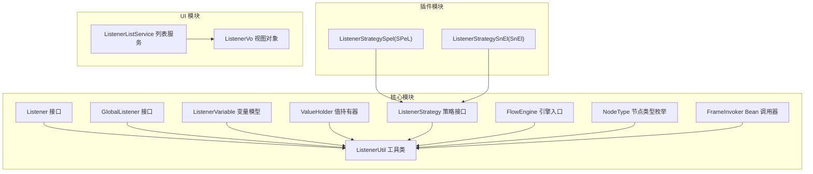
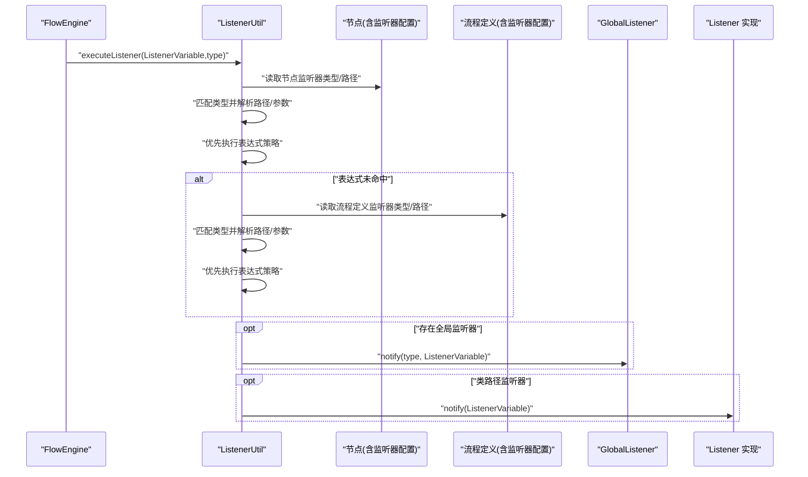
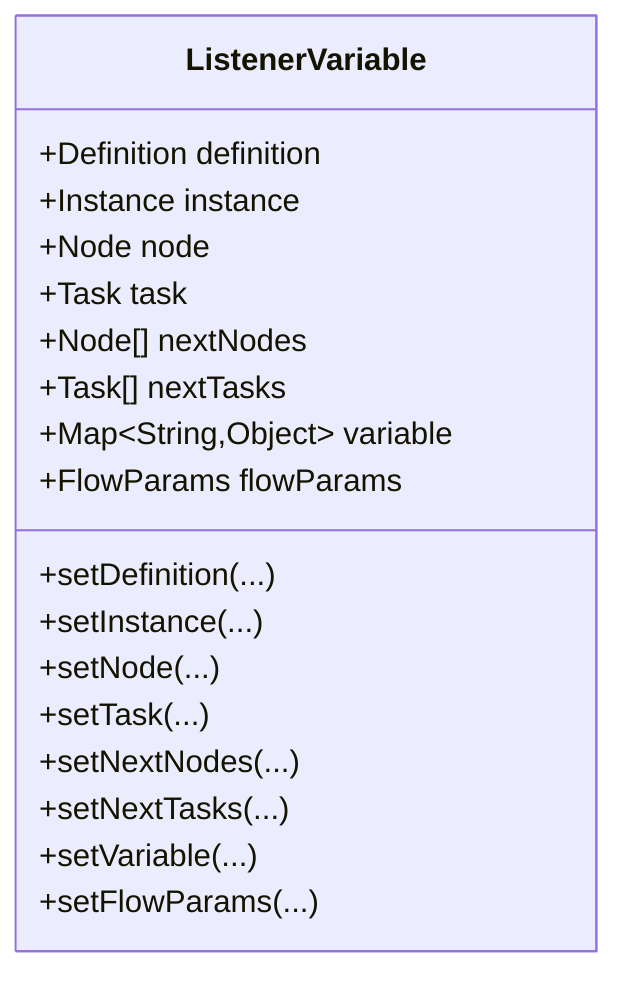
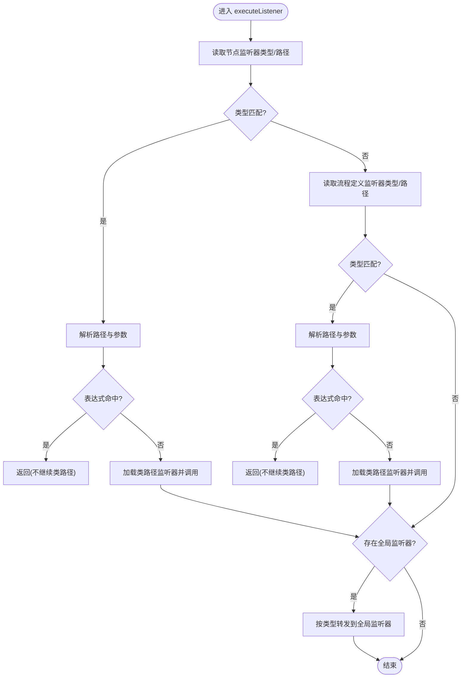
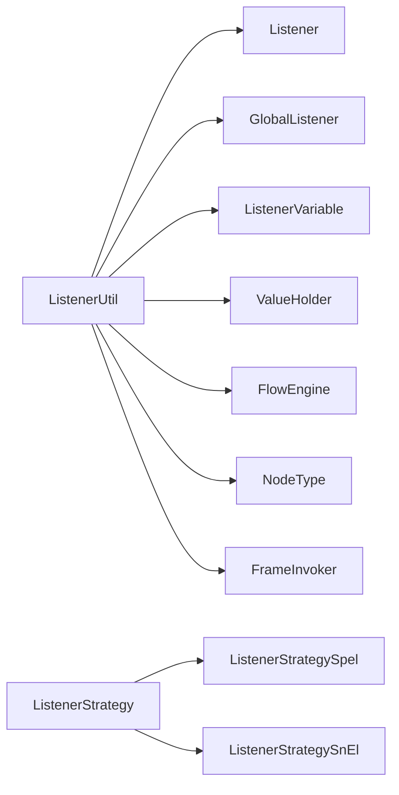

# 节点监听器

<cite>
**本文引用的文件**
- [Listener.java](file://warm-flow-core/src/main/java/org/dromara/warm/flow/core/listener/Listener.java)
- [GlobalListener.java](file://warm-flow-core/src/main/java/org/dromara/warm/flow/core/listener/GlobalListener.java)
- [ListenerVariable.java](file://warm-flow-core/src/main/java/org/dromara/warm/flow/core/listener/ListenerVariable.java)
- [ValueHolder.java](file://warm-flow-core/src/main/java/org/dromara/warm/flow/core/listener/ValueHolder.java)
- [ListenerStrategy.java](file://warm-flow-core/src/main/java/org/dromara/warm/flow/core/strategy/ListenerStrategy.java)
- [ListenerUtil.java](file://warm-flow-core/src/main/java/org/dromara/warm/flow/core/utils/ListenerUtil.java)
- [FlowEngine.java](file://warm-flow-core/src/main/java/org/dromara/warm/flow/core/FlowEngine.java)
- [NodeType.java](file://warm-flow-core/src/main/java/org/dromara/warm/flow/core/enums/NodeType.java)
- [FrameInvoker.java](file://warm-flow-core/src/main/java/org/dromara/warm/flow/core/invoker/FrameInvoker.java)
- [ListenerStrategySpel.java](file://warm-flow-plugin/warm-flow-plugin-modes/warm-flow-plugin-modes-sb/src/main/java/org/dromara/warm/plugin/modes/sb/expression/ListenerStrategySpel.java)
- [ListenerStrategySnEl.java](file://warm-flow-plugin/warm-flow-plugin-modes/warm-flow-plugin-modes-solon/src/main/java/org/dromara/warm/plugin/modes/solon/expression/ListenerStrategySnEl.java)
- [ListenerListService.java](file://warm-flow-plugin/warm-flow-plugin-ui/warm-flow-plugin-ui-core/src/main/java/org/dromara/warm/flow/ui/service/ListenerListService.java)
- [ListenerVo.java](file://warm-flow-plugin/warm-flow-plugin-ui/warm-flow-plugin-ui-core/src/main/java/org/dromara/warm/flow/ui/vo/ListenerVo.java)
</cite>

## 目录
1. [简介](#简介)
2. [项目结构](#项目结构)
3. [核心组件](#核心组件)
4. [架构总览](#架构总览)
5. [组件详解](#组件详解)
6. [依赖关系分析](#依赖关系分析)
7. [性能考量](#性能考量)
8. [故障排查指南](#故障排查指南)
9. [结论](#结论)
10. [附录](#附录)

## 简介
本文件围绕“节点监听器”展开，系统性阐述其设计原理、生命周期管理、与全局监听器的关系、ListenerVariable 的数据传递机制，以及开发与调试的最佳实践。目标读者既包括需要快速上手的开发者，也包括希望深入理解实现细节的架构师。

## 项目结构
节点监听器能力由核心模块与插件模块共同构成：
- 核心模块提供监听器接口、变量模型、策略接口与工具类
- 插件模块提供表达式策略实现（SPeL/SnEl），UI 模块提供监听器列表与视图对象
- 运行时通过 FlowEngine 获取全局监听器，并在节点流转的关键节点调用监听器

图表来源
- [ListenerUtil.java:83-94](file://warm-flow-core/src/main/java/org/dromara/warm/flow/core/utils/ListenerUtil.java#L83-L94)
- [Listener.java:25-58](file://warm-flow-core/src/main/java/org/dromara/warm/flow/core/listener/Listener.java#L25-L58)
- [GlobalListener.java:26-80](file://warm-flow-core/src/main/java/org/dromara/warm/flow/core/listener/GlobalListener.java#L26-L80)
- [ListenerVariable.java:32-213](file://warm-flow-core/src/main/java/org/dromara/warm/flow/core/listener/ListenerVariable.java#L32-L213)
- [ValueHolder.java:24-40](file://warm-flow-core/src/main/java/org/dromara/warm/flow/core/listener/ValueHolder.java#L24-L40)
- [ListenerStrategy.java:26-38](file://warm-flow-core/src/main/java/org/dromara/warm/flow/core/strategy/ListenerStrategy.java#L26-L38)
- [ListenerStrategySpel.java](file://warm-flow-plugin/warm-flow-plugin-modes/warm-flow-plugin-modes-sb/src/main/java/org/dromara/warm/plugin/modes/sb/expression/ListenerStrategySpel.java)
- [ListenerStrategySnEl.java](file://warm-flow-plugin/warm-flow-plugin-modes/warm-flow-plugin-modes-solon/src/main/java/org/dromara/warm/plugin/modes/solon/expression/ListenerStrategySnEl.java)
- [ListenerListService.java](file://warm-flow-plugin/warm-flow-plugin-ui/warm-flow-plugin-ui-core/src/main/java/org/dromara/warm/flow/ui/service/ListenerListService.java)
- [ListenerVo.java](file://warm-flow-plugin/warm-flow-plugin-ui/warm-flow-plugin-ui-core/src/main/java/org/dromara/warm/flow/ui/vo/ListenerVo.java)

章节来源
- [ListenerUtil.java:45-94](file://warm-flow-core/src/main/java/org/dromara/warm/flow/core/utils/ListenerUtil.java#L45-L94)
- [Listener.java:25-58](file://warm-flow-core/src/main/java/org/dromara/warm/flow/core/listener/Listener.java#L25-L58)
- [GlobalListener.java:26-80](file://warm-flow-core/src/main/java/org/dromara/warm/flow/core/listener/GlobalListener.java#L26-L80)
- [ListenerVariable.java:32-213](file://warm-flow-core/src/main/java/org/dromara/warm/flow/core/listener/ListenerVariable.java#L32-L213)
- [ValueHolder.java:24-40](file://warm-flow-core/src/main/java/org/dromara/warm/flow/core/listener/ValueHolder.java#L24-L40)
- [ListenerStrategy.java:26-38](file://warm-flow-core/src/main/java/org/dromara/warm/flow/core/strategy/ListenerStrategy.java#L26-L38)

## 核心组件
- 监听器接口：定义监听器类型常量与统一通知方法
- 全局监听器接口：提供默认空实现的 start/assignment/finish/create 四类回调
- 监听器变量模型：封装流程定义、实例、节点、任务、下一批节点/任务、流程变量、引擎参数等上下文
- 值持有器：拆分监听器路径与参数
- 监听器策略接口：抽象表达式策略注册与扩展点
- 监听器工具类：负责监听器的解析、执行顺序、与全局监听器的桥接

章节来源
- [Listener.java:25-58](file://warm-flow-core/src/main/java/org/dromara/warm/flow/core/listener/Listener.java#L25-L58)
- [GlobalListener.java:26-80](file://warm-flow-core/src/main/java/org/dromara/warm/flow/core/listener/GlobalListener.java#L26-L80)
- [ListenerVariable.java:32-213](file://warm-flow-core/src/main/java/org/dromara/warm/flow/core/listener/ListenerVariable.java#L32-L213)
- [ValueHolder.java:24-40](file://warm-flow-core/src/main/java/org/dromara/warm/flow/core/listener/ValueHolder.java#L24-L40)
- [ListenerStrategy.java:26-38](file://warm-flow-core/src/main/java/org/dromara/warm/flow/core/strategy/ListenerStrategy.java#L26-L38)
- [ListenerUtil.java:83-137](file://warm-flow-core/src/main/java/org/dromara/warm/flow/core/utils/ListenerUtil.java#L83-L137)

## 架构总览
节点监听器在流程引擎的关键节点被触发，遵循“节点监听器 → 全局监听器”的执行链路。工具类负责解析监听器配置、按类型匹配、执行表达式或加载类路径监听器，并维护 ListenerVariable 的上下文传递。

图表来源
- [ListenerUtil.java:83-137](file://warm-flow-core/src/main/java/org/dromara/warm/flow/core/utils/ListenerUtil.java#L83-L137)
- [GlobalListener.java:64-79](file://warm-flow-core/src/main/java/org/dromara/warm/flow/core/listener/GlobalListener.java#L64-L79)
- [Listener.java:57-57](file://warm-flow-core/src/main/java/org/dromara/warm/flow/core/listener/Listener.java#L57-L57)

## 组件详解

### 监听器生命周期与触发时机
- 生命周期阶段
  - 开始监听器：任务开始办理时触发
  - 分派监听器：动态修改待办任务信息时触发
  - 完成监听器：当前任务完成后触发
  - 创建监听器：新任务创建时触发
  - 表单加载监听器：内置表单使用场景
- 触发时机
  - 节点监听器：在节点流转的关键节点按类型触发
  - 全局监听器：在整个流程生命周期内按类型触发
  - 表单加载监听器：表单加载阶段触发

章节来源
- [Listener.java:30-50](file://warm-flow-core/src/main/java/org/dromara/warm/flow/core/listener/Listener.java#L30-L50)
- [GlobalListener.java:33-79](file://warm-flow-core/src/main/java/org/dromara/warm/flow/core/listener/GlobalListener.java#L33-L79)
- [ListenerUtil.java:67-81](file://warm-flow-core/src/main/java/org/dromara/warm/flow/core/utils/ListenerUtil.java#L67-L81)

### ListenerVariable 数据传递机制
- 上下文字段
  - 流程定义、流程实例、节点、当前任务、下一批节点与任务、流程变量、引擎参数
- 构造与设置
  - 提供多构造函数以适配不同场景
  - 支持链式 setter 以复用同一变量对象
- 传递策略
  - 在节点监听器与全局监听器之间传递，确保监听器可访问完整上下文
  - 在“完成 → 创建”链路中，工具类会重置节点/任务/下一批节点/任务，保证监听器只感知当前上下文

图表来源
- [ListenerVariable.java:32-213](file://warm-flow-core/src/main/java/org/dromara/warm/flow/core/listener/ListenerVariable.java#L32-L213)

章节来源
- [ListenerVariable.java:75-124](file://warm-flow-core/src/main/java/org/dromara/warm/flow/core/listener/ListenerVariable.java#L75-L124)
- [ListenerUtil.java:50-65](file://warm-flow-core/src/main/java/org/dromara/warm/flow/core/utils/ListenerUtil.java#L50-L65)

### 节点监听器与全局监听器的关系与区别
- 关系
  - 节点监听器：绑定在节点或流程定义上，按节点类型触发
  - 全局监听器：在整个流程生命周期内按类型触发，作为补充或横切关注点
- 区别
  - 作用域：节点监听器更贴近业务节点；全局监听器覆盖全链路
  - 触发条件：节点监听器受节点类型约束；全局监听器受类型约束但无节点绑定
- 选择策略
  - 仅在特定节点需要行为：使用节点监听器
  - 跨节点的横切逻辑：使用全局监听器
  - 复合场景：两者配合，先执行节点监听器，再执行全局监听器

章节来源
- [GlobalListener.java:26-80](file://warm-flow-core/src/main/java/org/dromara/warm/flow/core/listener/GlobalListener.java#L26-L80)
- [ListenerUtil.java:83-94](file://warm-flow-core/src/main/java/org/dromara/warm/flow/core/utils/ListenerUtil.java#L83-L94)

### 监听器执行顺序与解析流程
- 解析与匹配
  - 从节点与流程定义分别读取监听器类型与路径
  - 按类型匹配，逐项解析路径与参数
- 表达式优先
  - 若监听器路径为表达式策略命中，则直接执行表达式逻辑并返回
- 类路径加载
  - 若非表达式或表达式未命中，尝试加载类路径监听器
  - 通过 Bean 调用器获取实现类，注入 ListenerVariable 并调用通知方法
- 全局监听器桥接
  - 若存在全局监听器，按类型转发到对应回调

图表来源
- [ListenerUtil.java:83-137](file://warm-flow-core/src/main/java/org/dromara/warm/flow/core/utils/ListenerUtil.java#L83-L137)
- [GlobalListener.java:64-79](file://warm-flow-core/src/main/java/org/dromara/warm/flow/core/listener/GlobalListener.java#L64-L79)

章节来源
- [ListenerUtil.java:83-137](file://warm-flow-core/src/main/java/org/dromara/warm/flow/core/utils/ListenerUtil.java#L83-L137)

### 监听器变量的获取、设置与传递
- 获取
  - 通过 ListenerVariable 的 getter 方法访问上下文字段
- 设置
  - 使用链式 setter 更新节点、任务、下一批节点/任务、流程变量等
- 传递
  - 在“完成 → 创建”链路中，工具类会重置上下文，确保监听器只感知当前节点/任务

章节来源
- [ListenerVariable.java:126-196](file://warm-flow-core/src/main/java/org/dromara/warm/flow/core/listener/ListenerVariable.java#L126-L196)
- [ListenerUtil.java:50-65](file://warm-flow-core/src/main/java/org/dromara/warm/flow/core/utils/ListenerUtil.java#L50-L65)

### 监听器与表达式策略的集成
- 策略接口
  - 通过策略接口注册多种表达式实现（如 SPeL、SnEl）
- 执行顺序
  - 监听器解析时优先尝试表达式策略，若命中则不再加载类路径监听器
- 扩展点
  - 可通过 SPI 或配置扩展新的表达式策略实现

章节来源
- [ListenerStrategy.java:26-38](file://warm-flow-core/src/main/java/org/dromara/warm/flow/core/strategy/ListenerStrategy.java#L26-L38)
- [ListenerStrategySpel.java](file://warm-flow-plugin/warm-flow-plugin-modes/warm-flow-plugin-modes-sb/src/main/java/org/dromara/warm/plugin/modes/sb/expression/ListenerStrategySpel.java)
- [ListenerStrategySnEl.java](file://warm-flow-plugin/warm-flow-plugin-modes/warm-flow-plugin-modes-solon/src/main/java/org/dromara/warm/plugin/modes/solon/expression/ListenerStrategySnEl.java)
- [ListenerUtil.java:111-113](file://warm-flow-core/src/main/java/org/dromara/warm/flow/core/utils/ListenerUtil.java#L111-L113)

### 与 UI 的集成
- 列表服务与视图对象用于在前端展示与配置监听器
- 通过 UI 层可直观地维护监听器路径、参数与类型

章节来源
- [ListenerListService.java](file://warm-flow-plugin/warm-flow-plugin-ui/warm-flow-plugin-ui-core/src/main/java/org/dromara/warm/flow/ui/service/ListenerListService.java)
- [ListenerVo.java](file://warm-flow-plugin/warm-flow-plugin-ui/warm-flow-plugin-ui-core/src/main/java/org/dromara/warm/flow/ui/vo/ListenerVo.java)

## 依赖关系分析
- 耦合与内聚
  - ListenerUtil 对节点类型、引擎入口、Bean 调用器、表达式工具等有直接依赖，内聚度高
  - Listener 与 GlobalListener 采用接口隔离，便于替换与扩展
- 外部依赖
  - 表达式策略依赖 Spring/Solon 环境（具体取决于运行时）
  - UI 模块依赖后端服务与视图对象进行配置展示

图表来源
- [ListenerUtil.java:18-27](file://warm-flow-core/src/main/java/org/dromara/warm/flow/core/utils/ListenerUtil.java#L18-L27)
- [Listener.java:25-58](file://warm-flow-core/src/main/java/org/dromara/warm/flow/core/listener/Listener.java#L25-L58)
- [GlobalListener.java:26-80](file://warm-flow-core/src/main/java/org/dromara/warm/flow/core/listener/GlobalListener.java#L26-L80)
- [ListenerVariable.java:32-213](file://warm-flow-core/src/main/java/org/dromara/warm/flow/core/listener/ListenerVariable.java#L32-L213)
- [ValueHolder.java:24-40](file://warm-flow-core/src/main/java/org/dromara/warm/flow/core/listener/ValueHolder.java#L24-L40)
- [ListenerStrategy.java:26-38](file://warm-flow-core/src/main/java/org/dromara/warm/flow/core/strategy/ListenerStrategy.java#L26-L38)
- [ListenerStrategySpel.java](file://warm-flow-plugin/warm-flow-plugin-modes/warm-flow-plugin-modes-sb/src/main/java/org/dromara/warm/plugin/modes/sb/expression/ListenerStrategySpel.java)
- [ListenerStrategySnEl.java](file://warm-flow-plugin/warm-flow-plugin-modes/warm-flow-plugin-modes-solon/src/main/java/org/dromara/warm/plugin/modes/solon/expression/ListenerStrategySnEl.java)

章节来源
- [ListenerUtil.java:18-27](file://warm-flow-core/src/main/java/org/dromara/warm/flow/core/utils/ListenerUtil.java#L18-L27)

## 性能考量
- 表达式优先策略可减少不必要的类加载与反射调用，提升执行效率
- 监听器路径解析与参数提取应避免重复计算，可在工具类内部缓存必要结果
- 全局监听器建议保持轻量逻辑，避免阻塞关键路径
- 大批量节点流转时，建议合并监听器调用次数，减少上下文切换

## 故障排查指南
- 监听器未触发
  - 检查节点/流程定义的监听器类型是否与触发时机一致
  - 确认监听器路径与参数格式正确，且表达式策略未提前拦截
- 监听器参数丢失
  - 确认 ListenerVariable 中流程变量已正确设置与传递
  - 注意工具类在执行表达式后会移除特定键值，避免误删业务变量
- 全局监听器未生效
  - 确认 FlowEngine 中已注入全局监听器
  - 检查类型匹配是否正确
- 表达式策略未执行
  - 检查监听器路径是否符合表达式模式
  - 确认表达式策略实现已注册

章节来源
- [ListenerUtil.java:96-137](file://warm-flow-core/src/main/java/org/dromara/warm/flow/core/utils/ListenerUtil.java#L96-L137)
- [GlobalListener.java:64-79](file://warm-flow-core/src/main/java/org/dromara/warm/flow/core/listener/GlobalListener.java#L64-L79)
- [FlowEngine.java](file://warm-flow-core/src/main/java/org/dromara/warm/flow/core/FlowEngine.java)

## 结论
节点监听器通过清晰的生命周期与严格的上下文传递机制，实现了对流程节点行为的灵活扩展；结合全局监听器与表达式策略，既能满足细粒度控制，也能实现跨节点的横切逻辑。开发时建议遵循“表达式优先、类路径兜底、全局补充”的原则，并通过 UI 进行可视化配置与验证。

## 附录

### 开发指南（接口实现、参数处理、异常处理）
- 接口实现
  - 实现 Listener 接口，按需覆盖通知方法
  - 如需全链路监听，实现 GlobalListener 的对应回调
- 参数处理
  - 使用 ValueHolder 解析监听器路径与参数
  - 将参数放入 ListenerVariable 的流程变量中，避免硬编码
- 异常处理
  - 在监听器内部捕获并记录异常，避免影响主流程
  - 对表达式策略与类路径加载分别进行异常分支处理

章节来源
- [Listener.java:25-58](file://warm-flow-core/src/main/java/org/dromara/warm/flow/core/listener/Listener.java#L25-L58)
- [GlobalListener.java:26-80](file://warm-flow-core/src/main/java/org/dromara/warm/flow/core/listener/GlobalListener.java#L26-L80)
- [ValueHolder.java:24-40](file://warm-flow-core/src/main/java/org/dromara/warm/flow/core/listener/ValueHolder.java#L24-L40)
- [ListenerUtil.java:115-133](file://warm-flow-core/src/main/java/org/dromara/warm/flow/core/utils/ListenerUtil.java#L115-L133)

### 最佳实践与调试技巧
- 最佳实践
  - 将复杂逻辑放入表达式策略，类路径监听器保持简洁
  - 使用链式 setter 复用 ListenerVariable，减少重复构造
  - 在“完成 → 创建”链路中，利用工具类重置上下文，避免状态污染
- 调试技巧
  - 在表达式策略与类路径监听器中添加日志，定位执行路径
  - 使用 UI 配置监听器，结合断点观察上下文变化
  - 对全局监听器进行单元测试，确保跨节点一致性

章节来源
- [ListenerUtil.java:50-65](file://warm-flow-core/src/main/java/org/dromara/warm/flow/core/utils/ListenerUtil.java#L50-L65)
- [ListenerStrategy.java:26-38](file://warm-flow-core/src/main/java/org/dromara/warm/flow/core/strategy/ListenerStrategy.java#L26-L38)