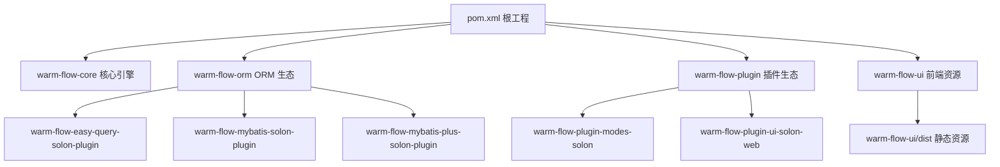
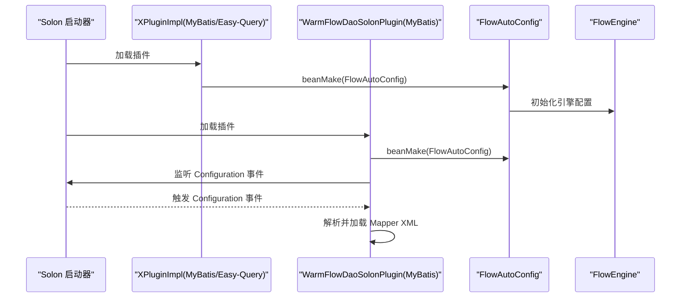
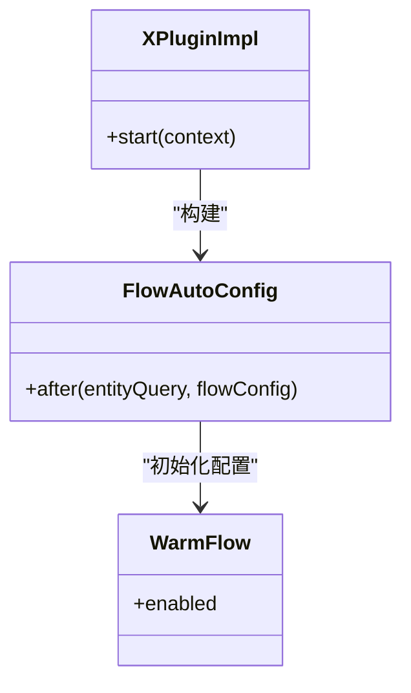
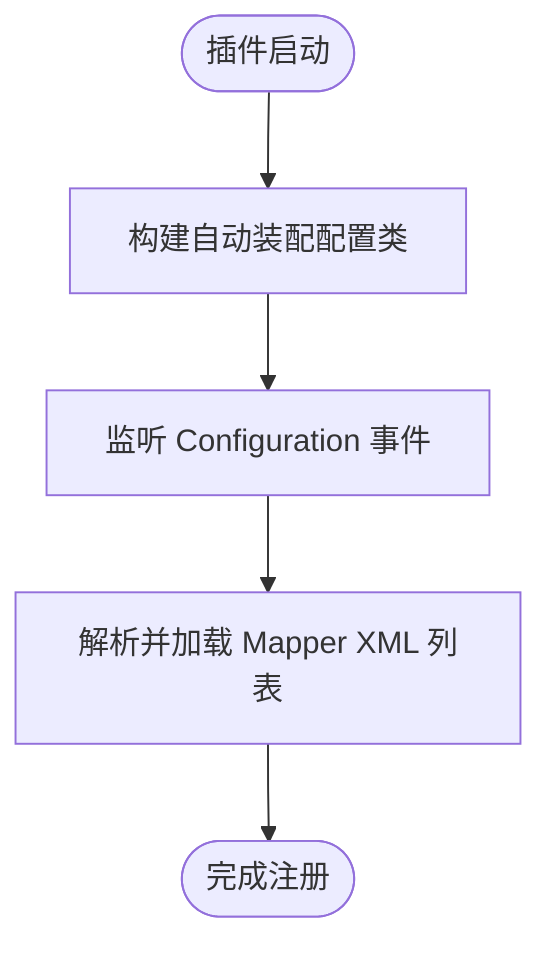
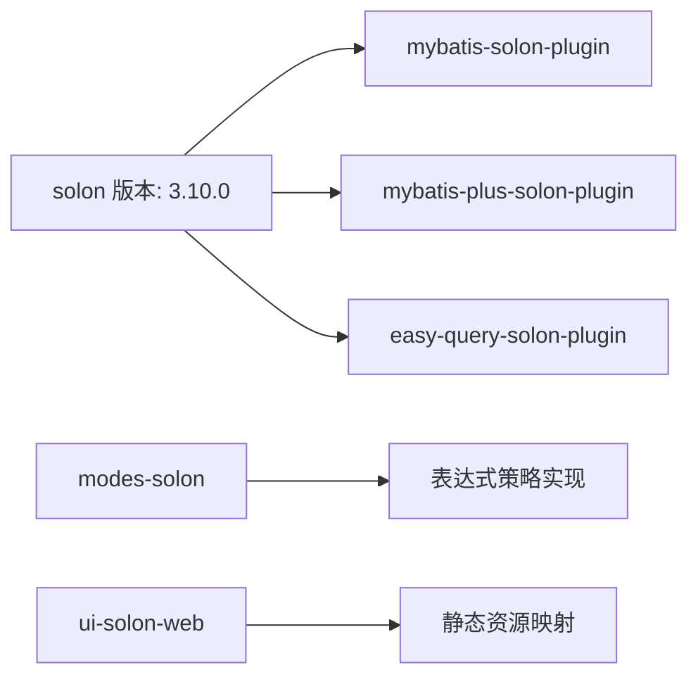

# Solon 框架部署

<cite>
**本文引用的文件**
- [pom.xml](file://pom.xml)
- [org.dromara.warm.flow.solon.properties](file://warm-flow-orm/warm-flow-easy-query/warm-flow-easy-query-solon-plugin/src/main/resources/META-INF/solon/org.dromara.warm.flow.solon.properties)
- [org.dromara.warm.flow.solon.properties](file://warm-flow-orm/warm-flow-mybatis/warm-flow-mybatis-solon-plugin/src/main/resources/META-INF/solon/org.dromara.warm.flow.solon.properties)
- [org.dromara.warm.plugin.modes.solon.properties](file://warm-flow-plugin/warm-flow-plugin-modes/warm-flow-plugin-modes-solon/src/main/resources/META-INF/solon/org.dromara.warm.plugin.modes.solon.properties)
- [org.dromara.warm.flow.ui.properties](file://warm-flow-plugin/warm-flow-plugin-ui/warm-flow-plugin-ui-solon-web/src/main/resources/META-INF/solon/org.dromara.warm.flow.ui.properties)
- [XPluginImpl.java](file://warm-flow-orm/warm-flow-easy-query/warm-flow-easy-query-solon-plugin/src/main/java/org/dromara/warm/flow/solon/XPluginImpl.java)
- [WarmFlowDaoSolonPlugin.java](file://warm-flow-orm/warm-flow-mybatis/warm-flow-mybatis-solon-plugin/src/main/java/org/dromara/warm/flow/solon/WarmFlowDaoSolonPlugin.java)
- [WarmFlowModesSolonPlugin.java](file://warm-flow-plugin/warm-flow-plugin-modes/warm-flow-plugin-modes-solon/src/main/java/org/dromara/warm/plugin/modes/solon/WarmFlowModesSolonPlugin.java)
- [WarmFlowUiSolonPlugin.java](file://warm-flow-plugin/warm-flow-plugin-ui/warm-flow-plugin-ui-solon-web/src/main/java/org/dromara/warm/flow/ui/WarmFlowUiSolonPlugin.java)
- [FlowAutoConfig.java](file://warm-flow-orm/warm-flow-easy-query/warm-flow-easy-query-solon-plugin/src/main/java/org/dromara/warm/flow/solon/config/FlowAutoConfig.java)
</cite>

## 目录
1. [简介](#简介)
2. [项目结构](#项目结构)
3. [核心组件](#核心组件)
4. [架构总览](#架构总览)
5. [详细组件分析](#详细组件分析)
6. [依赖分析](#依赖分析)
7. [性能考虑](#性能考虑)
8. [故障排查指南](#故障排查指南)
9. [结论](#结论)
10. [附录](#附录)

## 简介
本指南面向在 Solon 框架下部署 Warm-Flow 的工程实践，重点覆盖以下方面：
- Solon 框架特点与优势：轻量、高性能、原生支持（AOP、IOC、注解驱动）等
- Warm-Flow 在 Solon 下的打包与部署：jar 包部署、嵌入式服务器配置
- 配置管理：app.properties 配置、多环境配置、配置中心集成思路
- 插件系统：ORM 插件（MyBatis、MyBatis-Plus、Easy-Query）、UI 插件、表达式模式插件的启用与配置
- 原生特性利用：AOP、IOC、注解驱动在 Warm-Flow 中的应用
- 启动与停止：systemd 服务配置、Docker 容器化部署建议

## 项目结构
Warm-Flow 采用 Maven 多模块结构，围绕核心引擎、ORM 支持、插件生态与前端 UI 进行组织。Solon 相关能力主要通过各模块的 Solon 插件实现。

图表来源
- [pom.xml:58-62](file://pom.xml#L58-L62)

章节来源
- [pom.xml:58-62](file://pom.xml#L58-L62)

## 核心组件
- 插件入口与自动装配
  - Easy-Query 插件：通过插件属性声明插件类，启动时在上下文中构建自动装配配置类，完成框架注入与引擎配置初始化。
  - MyBatis 插件：在插件启动时构建自动装配配置类，并监听 Configuration 事件，动态加载 Mapper XML。
  - 表达式模式插件：在插件启动时扫描并注册 Bean 配置类，提供表达式策略实现。
  - UI 插件：在插件启动时扫描控制器与静态资源映射，按配置决定是否暴露前端静态资源路径。

章节来源
- [XPluginImpl.java:27-32](file://warm-flow-orm/warm-flow-easy-query/warm-flow-easy-query-solon-plugin/src/main/java/org/dromara/warm/flow/solon/XPluginImpl.java#L27-L32)
- [WarmFlowDaoSolonPlugin.java:33-60](file://warm-flow-orm/warm-flow-mybatis/warm-flow-mybatis-solon-plugin/src/main/java/org/dromara/warm/flow/solon/WarmFlowDaoSolonPlugin.java#L33-L60)
- [WarmFlowModesSolonPlugin.java:27-34](file://warm-flow-plugin/warm-flow-plugin-modes/warm-flow-plugin-modes-solon/src/main/java/org/dromara/warm/plugin/modes/solon/WarmFlowModesSolonPlugin.java#L27-L34)
- [WarmFlowUiSolonPlugin.java:29-40](file://warm-flow-plugin/warm-flow-plugin-ui/warm-flow-plugin-ui-solon-web/src/main/java/org/dromara/warm/flow/ui/WarmFlowUiSolonPlugin.java#L29-L40)

## 架构总览
Warm-Flow 在 Solon 下的运行时架构由“插件加载 → 自动装配 → 引擎初始化”构成。插件通过 META-INF/solon 属性文件声明，启动时由 Solon 加载并执行插件逻辑；随后自动装配配置类负责注册核心 Bean 并设置框架调用器，最终完成 FlowEngine 的配置。

图表来源
- [XPluginImpl.java:27-32](file://warm-flow-orm/warm-flow-easy-query/warm-flow-easy-query-solon-plugin/src/main/java/org/dromara/warm/flow/solon/XPluginImpl.java#L27-L32)
- [WarmFlowDaoSolonPlugin.java:35-59](file://warm-flow-orm/warm-flow-mybatis/warm-flow-mybatis-solon-plugin/src/main/java/org/dromara/warm/flow/solon/WarmFlowDaoSolonPlugin.java#L35-L59)
- [FlowAutoConfig.java:36-50](file://warm-flow-orm/warm-flow-easy-query/warm-flow-easy-query-solon-plugin/src/main/java/org/dromara/warm/flow/solon/config/FlowAutoConfig.java#L36-L50)

## 详细组件分析

### Easy-Query 插件（ORM）
- 插件声明与启动流程
  - 通过属性文件声明插件类，启动时在 AppContext 中构建自动装配配置类。
  - 自动装配配置类中设置框架调用器，使引擎可从 Solon IOC 获取依赖。
- 关键点
  - 条件装配：基于配置开关控制启用。
  - 框架注入：将 EasyEntityQuery 注册为可用 Bean，供引擎调用。

图表来源
- [XPluginImpl.java:27-32](file://warm-flow-orm/warm-flow-easy-query/warm-flow-easy-query-solon-plugin/src/main/java/org/dromara/warm/flow/solon/XPluginImpl.java#L27-L32)
- [FlowAutoConfig.java:36-50](file://warm-flow-orm/warm-flow-easy-query/warm-flow-easy-query-solon-plugin/src/main/java/org/dromara/warm/flow/solon/config/FlowAutoConfig.java#L36-L50)

章节来源
- [org.dromara.warm.flow.solon.properties:1-1](file://warm-flow-orm/warm-flow-easy-query/warm-flow-easy-query-solon-plugin/src/main/resources/META-INF/solon/org.dromara.warm.flow.solon.properties#L1-L1)
- [XPluginImpl.java:27-32](file://warm-flow-orm/warm-flow-easy-query/warm-flow-easy-query-solon-plugin/src/main/java/org/dromara/warm/flow/solon/XPluginImpl.java#L27-L32)
- [FlowAutoConfig.java:36-50](file://warm-flow-orm/warm-flow-easy-query/warm-flow-easy-query-solon-plugin/src/main/java/org/dromara/warm/flow/solon/config/FlowAutoConfig.java#L36-L50)

### MyBatis 插件（ORM）
- 插件声明与启动流程
  - 启动时构建自动装配配置类，并监听 Configuration 事件。
  - 在事件回调中解析并加载一组 Mapper XML 文件，完成 SQL 映射注册。
- 关键点
  - 动态加载：避免硬编码，统一从资源目录加载。
  - 异常处理：加载异常时抛出运行时异常，便于快速定位问题。

图表来源
- [WarmFlowDaoSolonPlugin.java:35-59](file://warm-flow-orm/warm-flow-mybatis/warm-flow-mybatis-solon-plugin/src/main/java/org/dromara/warm/flow/solon/WarmFlowDaoSolonPlugin.java#L35-L59)

章节来源
- [org.dromara.warm.flow.solon.properties:1-1](file://warm-flow-orm/warm-flow-mybatis/warm-flow-mybatis-solon-plugin/src/main/resources/META-INF/solon/org.dromara.warm.flow.solon.properties#L1-L1)
- [WarmFlowDaoSolonPlugin.java:33-60](file://warm-flow-orm/warm-flow-mybatis/warm-flow-mybatis-solon-plugin/src/main/java/org/dromara/warm/flow/solon/WarmFlowDaoSolonPlugin.java#L33-L60)

### 表达式模式插件（Modes）
- 插件声明与启动流程
  - 启动时在 AppContext 中构建 Bean 配置类，注册表达式策略实现。
- 关键点
  - 与 Easy-Query/MyBatis 插件协同，提供条件判断、处理器、监听器、投票签名等策略的 Solon 实现。

章节来源
- [org.dromara.warm.plugin.modes.solon.properties:1-1](file://warm-flow-plugin/warm-flow-plugin-modes/warm-flow-plugin-modes-solon/src/main/resources/META-INF/solon/org.dromara.warm.plugin.modes.solon.properties#L1-L1)
- [WarmFlowModesSolonPlugin.java:27-34](file://warm-flow-plugin/warm-flow-plugin-modes/warm-flow-plugin-modes-solon/src/main/java/org/dromara/warm/plugin/modes/solon/WarmFlowModesSolonPlugin.java#L27-L34)

### UI 插件（Web）
- 插件声明与启动流程
  - 启动时扫描控制器与 WarmFlow 配置，按需注册静态资源映射，暴露前端静态资源。
- 关键点
  - 条件注册：仅在 UI 开启时挂载静态资源路径。
  - 资源位置：从类路径的特定目录提供静态资源。

章节来源
- [org.dromara.warm.flow.ui.properties:1-1](file://warm-flow-plugin/warm-flow-plugin-ui/warm-flow-plugin-ui-solon-web/src/main/resources/META-INF/solon/org.dromara.warm.flow.ui.properties#L1-L1)
- [WarmFlowUiSolonPlugin.java:29-40](file://warm-flow-plugin/warm-flow-plugin-ui/warm-flow-plugin-ui-solon-web/src/main/java/org/dromara/warm/flow/ui/WarmFlowUiSolonPlugin.java#L29-L40)

## 依赖分析
- 版本与模块
  - 根工程统一管理 Solon 版本与各 ORM/JSON/UI 插件版本。
  - 通过 dependencyManagement 管理依赖版本，确保多模块一致性。
- 插件依赖
  - 各 ORM 插件与表达式模式插件均以 Solon 插件形式存在，通过属性文件声明插件类。
  - UI 插件在 Web 模块中提供控制器与静态资源映射。

图表来源
- [pom.xml:79](file://pom.xml#L79)
- [pom.xml:115-144](file://pom.xml#L115-L144)
- [pom.xml:160-203](file://pom.xml#L160-L203)
- [pom.xml:205-236](file://pom.xml#L205-L236)

章节来源
- [pom.xml:64-102](file://pom.xml#L64-L102)
- [pom.xml:104-432](file://pom.xml#L104-L432)

## 性能考虑
- 轻量与原生：Solon 作为轻量级框架，减少启动时间与内存占用，适合微服务与嵌入式场景。
- 插件化加载：按需启用 ORM 与 UI 插件，避免不必要的初始化开销。
- 动态 Mapper 加载：MyBatis 插件在 Configuration 事件中批量加载 XML，降低启动阶段的耦合度。
- 缓存与连接池：结合 HikariCP 等连接池与日志系统，优化数据库访问与可观测性。

## 故障排查指南
- 插件未生效
  - 检查 META-INF/solon 属性文件中的插件类声明是否正确。
  - 确认插件 jar 已被打包到应用中。
- MyBatis Mapper 加载失败
  - 核对 Mapper XML 路径是否存在于类路径。
  - 查看插件启动日志，确认 Configuration 事件触发与异常堆栈。
- UI 资源无法访问
  - 确认 WarmFlow 配置中 UI 开关已启用。
  - 检查静态资源映射路径是否正确挂载。

章节来源
- [WarmFlowDaoSolonPlugin.java:39-59](file://warm-flow-orm/warm-flow-mybatis/warm-flow-mybatis-solon-plugin/src/main/java/org/dromara/warm/flow/solon/WarmFlowDaoSolonPlugin.java#L39-L59)
- [WarmFlowUiSolonPlugin.java:34-39](file://warm-flow-plugin/warm-flow-plugin-ui/warm-flow-plugin-ui-solon-web/src/main/java/org/dromara/warm/flow/ui/WarmFlowUiSolonPlugin.java#L34-L39)

## 结论
Warm-Flow 在 Solon 下通过插件化机制实现了 ORM、表达式模式与 UI 的灵活组合。借助 Solon 的轻量与原生特性，可快速构建高性能、可扩展的工作流应用。建议在生产环境中结合容器化与 systemd 部署，配合配置中心与监控体系，实现稳定可靠的运行保障。

## 附录

### 部署与打包
- 打包命令
  - 使用 Maven 清理并打包：mvn clean package -DskipTests
  - 安装至本地仓库：mvn clean install -DskipTests
- 运行方式
  - 单独运行：java -jar warm-flow-xxx.jar
  - 嵌入式服务器：Solon 默认内置，无需额外 war 包部署

章节来源
- [pom.xml:527-532](file://pom.xml#L527-L532)

### 配置管理
- app.properties 配置
  - 可通过 Solon 配置文件定义 warm-flow.enabled 等开关项，影响插件与引擎初始化行为。
- 多环境配置
  - 通过不同 profile 或外部配置文件切换开发/测试/生产环境参数。
- 配置中心集成
  - 建议将配置中心（如 Nacos、Apollo）接入 Solon，实现动态配置更新与灰度发布。

### 插件启用清单
- ORM 插件
  - MyBatis：启用后自动加载 Mapper XML
  - MyBatis-Plus：启用后提供增强能力
  - Easy-Query：启用后提供代理查询能力
- 表达式模式插件：启用后提供条件、处理器、监听器、投票签名等策略实现
- UI 插件：启用后挂载前端静态资源路径

章节来源
- [org.dromara.warm.flow.solon.properties:1-1](file://warm-flow-orm/warm-flow-easy-query/warm-flow-easy-query-solon-plugin/src/main/resources/META-INF/solon/org.dromara.warm.flow.solon.properties#L1-L1)
- [org.dromara.warm.flow.solon.properties:1-1](file://warm-flow-orm/warm-flow-mybatis/warm-flow-mybatis-solon-plugin/src/main/resources/META-INF/solon/org.dromara.warm.flow.solon.properties#L1-L1)
- [org.dromara.warm.plugin.modes.solon.properties:1-1](file://warm-flow-plugin/warm-flow-plugin-modes/warm-flow-plugin-modes-solon/src/main/resources/META-INF/solon/org.dromara.warm.plugin.modes.solon.properties#L1-L1)
- [org.dromara.warm.flow.ui.properties:1-1](file://warm-flow-plugin/warm-flow-plugin-ui/warm-flow-plugin-ui-solon-web/src/main/resources/META-INF/solon/org.dromara.warm.flow.ui.properties#L1-L1)

### 原生特性利用
- AOP：通过注解与拦截器实现横切关注点（如权限校验、数据脱敏）
- IOC：通过 @Bean、@Configuration、@Condition 等注解进行依赖注入与条件装配
- 注解驱动：基于注解的自动装配与插件发现，简化配置与提升开发效率

### 启动与停止脚本与服务配置
- systemd 服务配置
  - 创建服务单元文件，设置 ExecStart 指向 java -jar 启动命令
  - 设置 Restart=always 与日志输出路径
- Docker 容器化部署
  - 基于官方 JRE 镜像构建镜像
  - 将打包后的 jar 复制至镜像内，设置 ENTRYPOINT 为 java -jar
  - 暴露端口并挂载配置文件与日志目录