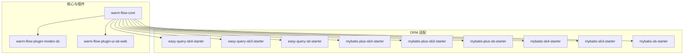
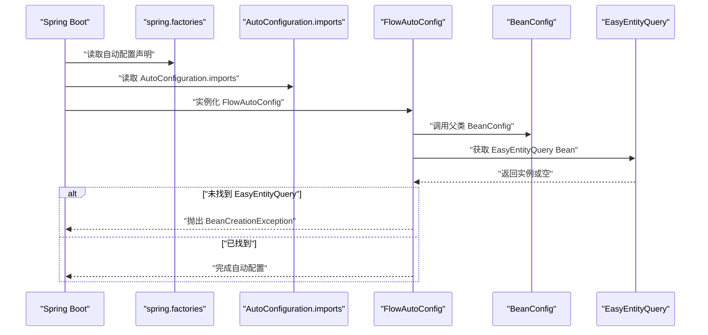
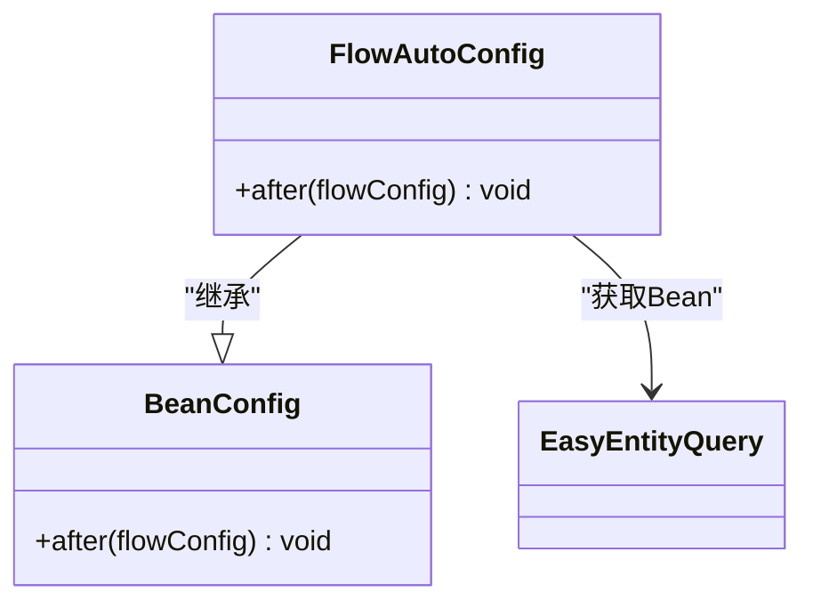
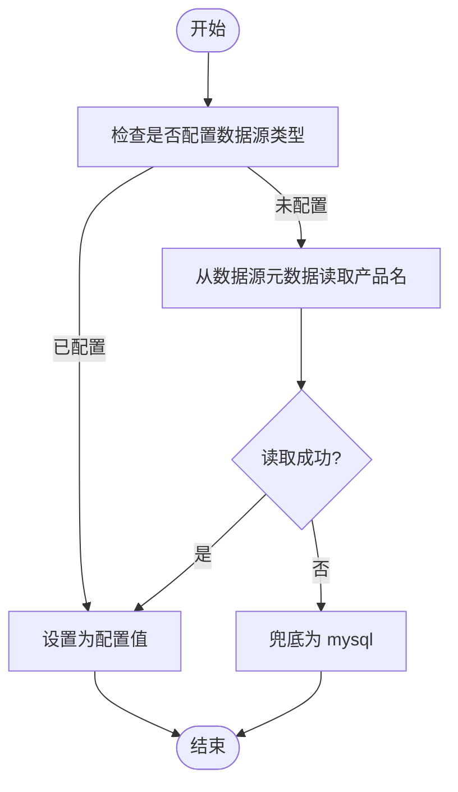
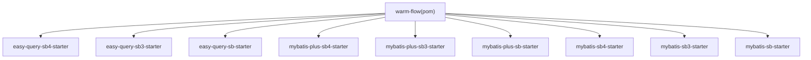

# Spring Boot 部署

<cite>
**本文引用的文件**
- [FlowAutoConfig.java](file://warm-flow-orm/warm-flow-easy-query/warm-flow-easy-query-sb-starter/src/main/java/org/dromara/warm/flow/spring/boot/config/FlowAutoConfig.java)
- [spring.factories](file://warm-flow-orm/warm-flow-easy-query/warm-flow-easy-query-sb-starter/src/main/resources/META-INF/spring.factories)
- [AutoConfiguration.imports](file://warm-flow-orm/warm-flow-easy-query/warm-flow-easy-query-sb-starter/src/main/resources/META-INF/spring/org.springframework.boot.autoconfigure.AutoConfiguration.imports)
- [FlowAutoConfig.java](file://warm-flow-orm/warm-flow-easy-query/warm-flow-easy-query-sb3-starter/src/main/java/org/dromara/warm/flow/spring/boot/config/FlowAutoConfig.java)
- [AutoConfiguration.imports](file://warm-flow-orm/warm-flow-easy-query/warm-flow-easy-query-sb3-starter/src/main/resources/META-INF/spring/org.springframework.boot.autoconfigure.AutoConfiguration.imports)
- [FlowAutoConfig.java](file://warm-flow-orm/warm-flow-easy-query/warm-flow-easy-query-sb4-starter/src/main/java/org/dromara/warm/flow/spring/boot/config/FlowAutoConfig.java)
- [CommonUtil.java](file://warm-flow-orm/warm-flow-mybatis/warm-flow-mybatis-core/src/main/java/org/dromara/warm/flow/orm/utils/CommonUtil.java)
- [pom.xml](file://warm-flow/pom.xml)
- [pom.xml](file://warm-flow-orm/warm-flow-easy-query/warm-flow-easy-query-sb4-starter/pom.xml)
- [pom.xml](file://warm-flow-orm/warm-flow-mybatis-plus/warm-flow-mybatis-plus-sb4-starter/pom.xml)
- [pom.xml](file://warm-flow-orm/warm-flow-mybatis/warm-flow-mybatis-sb4-starter/pom.xml)
- [pom.xml](file://warm-flow-orm/warm-flow-easy-query/warm-flow-easy-query-sb3-starter/pom.xml)
- [pom.xml](file://warm-flow-orm/warm-flow-easy-query/warm-flow-easy-query-sb-starter/pom.xml)
- [pom.xml](file://warm-flow-orm/warm-flow-mybatis-plus/warm-flow-mybatis-plus-sb3-starter/pom.xml)
- [pom.xml](file://warm-flow-orm/warm-flow-mybatis-plus/warm-flow-mybatis-plus-sb-starter/pom.xml)
- [pom.xml](file://warm-flow-orm/warm-flow-mybatis/warm-flow-mybatis-sb3-starter/pom.xml)
- [pom.xml](file://warm-flow-orm/warm-flow-mybatis/warm-flow-mybatis-sb-starter/pom.xml)
- [pom.xml](file://warm-flow-orm/warm-flow-easy-query/warm-flow-easy-query-solon-plugin/pom.xml)
- [pom.xml](file://warm-flow-orm/warm-flow-mybatis-plus/warm-flow-mybatis-plus-solon-plugin/pom.xml)
- [pom.xml](file://warm-flow-orm/warm-flow-mybatis/warm-flow-mybatis-solon-plugin/pom.xml)
- [pom.xml](file://warm-flow-orm/warm-flow-plugin-modes/warm-flow-plugin-modes-sb/pom.xml)
- [pom.xml](file://warm-flow-orm/warm-flow-plugin-ui/warm-flow-plugin-ui-sb-web/pom.xml)
- [pom.xml](file://warm-flow/warm-flow-core/pom.xml)
</cite>

## 目录
1. [简介](#简介)
2. [项目结构](#项目结构)
3. [核心组件](#核心组件)
4. [架构总览](#架构总览)
5. [详细组件分析](#详细组件分析)
6. [依赖分析](#依赖分析)
7. [性能考虑](#性能考虑)
8. [故障排查指南](#故障排查指南)
9. [结论](#结论)
10. [附录](#附录)

## 简介
本指南面向在 Spring Boot 环境下部署 Warm-Flow 的工程实践，覆盖以下主题：
- Spring Boot 打包方式：传统 fat jar 与可执行 jar 的差异与选择建议
- 自动配置机制：FlowAutoConfig 的配置流程与 @EnableAutoConfiguration 的作用
- 数据库连接配置：MySQL、Oracle、PostgreSQL、SQL Server 的连接参数要点
- 应用配置管理：application.yml 关键项、多环境切换、外部化配置
- 启动参数：JVM 参数、系统属性、环境变量
- 健康检查与监控：Actuator 端点与健康指标配置

## 项目结构
Warm-Flow 采用多模块 Maven 结构，核心与 ORM 层按不同持久化方案拆分，并提供 Spring Boot Starter 适配层。关键模块如下：
- 核心引擎：warm-flow-core
- ORM 适配：easy-query、mybatis、mybatis-plus 多实现
- 模式与表达式：表达式策略、监听器策略等
- UI 插件：UI 控制器与前端资源
- Solon 插件：用于非 Spring Boot 场景

图表来源
- [pom.xml](file://warm-flow/pom.xml)
- [pom.xml](file://warm-flow-orm/warm-flow-easy-query/warm-flow-easy-query-sb-starter/pom.xml)
- [pom.xml](file://warm-flow-orm/warm-flow-easy-query/warm-flow-easy-query-sb3-starter/pom.xml)
- [pom.xml](file://warm-flow-orm/warm-flow-easy-query/warm-flow-easy-query-sb4-starter/pom.xml)
- [pom.xml](file://warm-flow-orm/warm-flow-mybatis-plus/warm-flow-mybatis-plus-sb-starter/pom.xml)
- [pom.xml](file://warm-flow-orm/warm-flow-mybatis-plus/warm-flow-mybatis-plus-sb3-starter/pom.xml)
- [pom.xml](file://warm-flow-orm/warm-flow-mybatis-plus/warm-flow-mybatis-plus-sb4-starter/pom.xml)
- [pom.xml](file://warm-flow-orm/warm-flow-mybatis/warm-flow-mybatis-sb-starter/pom.xml)
- [pom.xml](file://warm-flow-orm/warm-flow-mybatis/warm-flow-mybatis-sb3-starter/pom.xml)
- [pom.xml](file://warm-flow-orm/warm-flow-mybatis/warm-flow-mybatis-sb4-starter/pom.xml)

章节来源
- [pom.xml](file://warm-flow/pom.xml)

## 核心组件
- 自动配置入口：FlowAutoConfig
  - 通过条件注解控制启用，基于配置开关 warm-flow.enabled
  - 继承 BeanConfig 完成工作流相关 Bean 的注册与初始化
  - 启动后校验 EasyEntityQuery 是否存在，缺失则抛出 BeanCreationException
- ORM 工具：CommonUtil
  - 从 MyBatis Configuration 中推断数据源类型，若未显式配置则默认 mysql
  - 支持从数据源元数据中识别数据库产品名称，增强兼容性

章节来源
- [FlowAutoConfig.java:32-44](file://warm-flow-orm/warm-flow-easy-query/warm-flow-easy-query-sb-starter/src/main/java/org/dromara/warm/flow/spring/boot/config/FlowAutoConfig.java#L32-L44)
- [CommonUtil.java:34-60](file://warm-flow-orm/warm-flow-mybatis/warm-flow-mybatis-core/src/main/java/org/dromara/warm/flow/orm/utils/CommonUtil.java#L34-L60)

## 架构总览
Warm-Flow 在 Spring Boot 下的自动装配流程如下：

图表来源
- [spring.factories:1-3](file://warm-flow-orm/warm-flow-easy-query/warm-flow-easy-query-sb-starter/src/main/resources/META-INF/spring.factories#L1-L3)
- [AutoConfiguration.imports:1-2](file://warm-flow-orm/warm-flow-easy-query/warm-flow-easy-query-sb-starter/src/main/resources/META-INF/spring/org.springframework.boot.autoconfigure.AutoConfiguration.imports#L1-L2)
- [FlowAutoConfig.java:32-44](file://warm-flow-orm/warm-flow-easy-query/warm-flow-easy-query-sb-starter/src/main/java/org/dromara/warm/flow/spring/boot/config/FlowAutoConfig.java#L32-L44)

## 详细组件分析

### 自动配置组件 FlowAutoConfig
- 功能职责
  - 条件启用：仅当 warm-flow.enabled 为 true 或未配置时生效
  - Bean 注册：继承自 BeanConfig，完成工作流上下文与策略 Bean 的注册
  - 运行期校验：确保 EasyEntityQuery 存在，否则中断启动
- 配置开关
  - 通过属性 warm-flow.enabled 控制是否启用自动配置
- 兼容版本
  - sb-starter、sb3-starter、sb4-starter 三套适配，均使用相同配置类

图表来源
- [FlowAutoConfig.java:32-44](file://warm-flow-orm/warm-flow-easy-query/warm-flow-easy-query-sb-starter/src/main/java/org/dromara/warm/flow/spring/boot/config/FlowAutoConfig.java#L32-L44)

章节来源
- [FlowAutoConfig.java:32-44](file://warm-flow-orm/warm-flow-easy-query/warm-flow-easy-query-sb-starter/src/main/java/org/dromara/warm/flow/spring/boot/config/FlowAutoConfig.java#L32-L44)
- [FlowAutoConfig.java:32-44](file://warm-flow-orm/warm-flow-easy-query/warm-flow-easy-query-sb3-starter/src/main/java/org/dromara/warm/flow/spring/boot/config/FlowAutoConfig.java#L32-L44)
- [FlowAutoConfig.java:32-44](file://warm-flow-orm/warm-flow-easy-query/warm-flow-easy-query-sb4-starter/src/main/java/org/dromara/warm/flow/spring/boot/config/FlowAutoConfig.java#L32-L44)

### ORM 数据库类型推断
- 推断逻辑
  - 若未显式配置数据源类型，则从 MyBatis Configuration 的数据源元数据中读取数据库产品名称
  - 若仍为空，兜底为 mysql
- 影响范围
  - 影响 SQL 方言与语法适配，确保生成的 SQL 与目标数据库兼容

图表来源
- [CommonUtil.java:34-60](file://warm-flow-orm/warm-flow-mybatis/warm-flow-mybatis-core/src/main/java/org/dromara/warm/flow/orm/utils/CommonUtil.java#L34-L60)

章节来源
- [CommonUtil.java:34-60](file://warm-flow-orm/warm-flow-mybatis/warm-flow-mybatis-core/src/main/java/org/dromara/warm/flow/orm/utils/CommonUtil.java#L34-L60)

### Spring Boot 打包方式与选择
- 传统 fat jar
  - 将依赖打包进最终 jar，便于单文件分发与部署
  - 适合对依赖隔离要求不高、追求简单交付的场景
- 可执行 jar（Spring Boot Executable Jar）
  - 使用特定的 jar 布局与启动器，支持直接 java -jar 启动
  - 提供更丰富的内嵌服务器与自动配置能力
- 选择建议
  - 若使用 Spring Boot Starter 适配，推荐可执行 jar，以获得完整的自动装配与启动体验
  - 若已有成熟的构建链路且 fat jar 能满足需求，也可沿用

[本节为通用实践说明，不直接分析具体文件]

### 数据库连接配置示例（MySQL/Oracle/PostgreSQL/SQL Server）
- 通用要点
  - 驱动依赖：确保引入对应数据库驱动依赖
  - 连接参数：url、用户名、密码、连接池参数（如 hikari.pool-size）
  - 数据源类型：可显式指定数据源类型以避免 ORM 方言推断误差
- MySQL
  - 驱动：mysql-connector-java
  - url 示例：jdbc:mysql://host:port/db?useUnicode=true&characterEncoding=UTF-8&useSSL=false&serverTimezone=GMT%2B8
- Oracle
  - 驱动：ojdbc8
  - url 示例：jdbc:oracle:thin:@//host:port/service
- PostgreSQL
  - 驱动：postgresql
  - url 示例：jdbc:postgresql://host:port/db
- SQL Server
  - 驱动：mssql-jdbc
  - url 示例：jdbc:sqlserver://host:port;databaseName=db

[本节为通用实践说明，不直接分析具体文件]

### 应用配置文件管理（application.yml）
- 关键配置项
  - 数据源：driver-class-name、jdbc-url、username、password、hikari 连接池参数
  - 数据源类型：显式设置数据源类型以避免推断
  - Warm-Flow 开关：warm-flow.enabled 控制自动配置启用
- 多环境配置
  - 使用 spring.profiles.active 切换 dev/test/prod
  - 通过 application-dev.yml、application-prod.yml 分离配置
- 外部化配置
  - 优先级：命令行 > 系统属性 > 环境变量 > 配置文件
  - 建议将敏感信息（数据库密码）置于环境变量或密钥管理

[本节为通用实践说明，不直接分析具体文件]

### 启动参数配置
- JVM 参数
  - 堆大小：-Xms/-Xmx
  - GC 与内存：-XX:+UseG1GC、-XX:MaxMetaspaceSize
  - 日志：-Djava.util.logging.config.file
- 系统属性
  - spring.profiles.active、warm-flow.enabled、server.port
- 环境变量
  - DATABASE_PASSWORD、JAVA_OPTS 等

[本节为通用实践说明，不直接分析具体文件]

### 健康检查与监控（Actuator）
- 开启端点
  - management.endpoints.web.exposure.include=health,info,metrics
  - management.endpoint.health.show-details=always
- 健康指标
  - 数据源健康检查：确保数据库连通性
  - 自定义健康指示器：可扩展业务健康状态
- 监控集成
  - 结合 Micrometer 与 Prometheus/Grafana 实现指标采集与可视化

[本节为通用实践说明，不直接分析具体文件]

## 依赖分析
Warm-Flow 的 Spring Boot 适配通过 Starter 模块引入，核心依赖关系如下：

图表来源
- [pom.xml](file://warm-flow/pom.xml)
- [pom.xml](file://warm-flow-orm/warm-flow-easy-query/warm-flow-easy-query-sb-starter/pom.xml)
- [pom.xml](file://warm-flow-orm/warm-flow-easy-query/warm-flow-easy-query-sb3-starter/pom.xml)
- [pom.xml](file://warm-flow-orm/warm-flow-easy-query/warm-flow-easy-query-sb4-starter/pom.xml)
- [pom.xml](file://warm-flow-orm/warm-flow-mybatis-plus/warm-flow-mybatis-plus-sb-starter/pom.xml)
- [pom.xml](file://warm-flow-orm/warm-flow-mybatis-plus/warm-flow-mybatis-plus-sb3-starter/pom.xml)
- [pom.xml](file://warm-flow-orm/warm-flow-mybatis-plus/warm-flow-mybatis-plus-sb4-starter/pom.xml)
- [pom.xml](file://warm-flow-orm/warm-flow-mybatis/warm-flow-mybatis-sb-starter/pom.xml)
- [pom.xml](file://warm-flow-orm/warm-flow-mybatis/warm-flow-mybatis-sb3-starter/pom.xml)
- [pom.xml](file://warm-flow-orm/warm-flow-mybatis/warm-flow-mybatis-sb4-starter/pom.xml)

章节来源
- [pom.xml](file://warm-flow/pom.xml)

## 性能考虑
- 连接池优化
  - 合理设置最大池大小、空闲超时、连接生命周期
- SQL 优化
  - 使用 ORM 提供的查询代理与分页工具，避免 N+1 查询
- 缓存策略
  - 对热点流程定义与表单进行缓存，降低数据库压力
- JVM 调优
  - 根据业务并发与数据规模调整堆大小与 GC 策略

[本节为通用实践说明，不直接分析具体文件]

## 故障排查指南
- 启动报错：EasyEntityQuery 未找到
  - 现象：启动时报 BeanCreationException，提示缺少 EasyEntityQuery
  - 排查：确认已引入对应 ORM Starter（如 easy-query），并正确配置数据源
- 数据源类型异常
  - 现象：SQL 方言错误或语法不兼容
  - 排查：显式设置数据源类型，避免从元数据推断失败
- 自动配置未生效
  - 现象：warm-flow 相关 Bean 未注册
  - 排查：检查 warm-flow.enabled 是否为 true；确认 spring.factories 或 AutoConfiguration.imports 已被加载

章节来源
- [FlowAutoConfig.java:36-43](file://warm-flow-orm/warm-flow-easy-query/warm-flow-easy-query-sb-starter/src/main/java/org/dromara/warm/flow/spring/boot/config/FlowAutoConfig.java#L36-L43)
- [CommonUtil.java:34-60](file://warm-flow-orm/warm-flow-mybatis/warm-flow-mybatis-core/src/main/java/org/dromara/warm/flow/orm/utils/CommonUtil.java#L34-L60)

## 结论
- Warm-Flow 在 Spring Boot 下通过 Starter 与自动配置实现开箱即用
- 建议优先使用可执行 jar 并结合 Actuator 进行健康与监控
- 显式配置数据源类型与连接参数，确保 ORM 方言与数据库兼容
- 通过多环境配置与外部化配置提升部署灵活性与安全性

[本节为总结性内容，不直接分析具体文件]

## 附录
- 版本与构建
  - sb4-starter、sb3-starter、sb-starter 分别适配不同 Spring Boot 版本
  - 构建工具与 JDK 版本在各模块的 pom 中有明确声明

章节来源
- [pom.xml:75-89](file://warm-flow-orm/warm-flow-easy-query/warm-flow-easy-query-sb4-starter/pom.xml#L75-L89)
- [pom.xml](file://warm-flow-orm/warm-flow-mybatis-plus/warm-flow-mybatis-plus-sb4-starter/pom.xml)
- [pom.xml](file://warm-flow-orm/warm-flow-mybatis/warm-flow-mybatis-sb4-starter/pom.xml)
- [pom.xml](file://warm-flow-orm/warm-flow-easy-query/warm-flow-easy-query-sb3-starter/pom.xml)
- [pom.xml](file://warm-flow-orm/warm-flow-easy-query/warm-flow-easy-query-sb-starter/pom.xml)
- [pom.xml](file://warm-flow-orm/warm-flow-mybatis-plus/warm-flow-mybatis-plus-sb3-starter/pom.xml)
- [pom.xml](file://warm-flow-orm/warm-flow-mybatis-plus/warm-flow-mybatis-plus-sb-starter/pom.xml)
- [pom.xml](file://warm-flow-orm/warm-flow-mybatis/warm-flow-mybatis-sb3-starter/pom.xml)
- [pom.xml](file://warm-flow-orm/warm-flow-mybatis/warm-flow-mybatis-sb-starter/pom.xml)
- [pom.xml](file://warm-flow-orm/warm-flow-easy-query/warm-flow-easy-query-solon-plugin/pom.xml)
- [pom.xml](file://warm-flow-orm/warm-flow-mybatis-plus/warm-flow-mybatis-plus-solon-plugin/pom.xml)
- [pom.xml](file://warm-flow-orm/warm-flow-mybatis/warm-flow-mybatis-solon-plugin/pom.xml)
- [pom.xml](file://warm-flow-orm/warm-flow-plugin-modes/warm-flow-plugin-modes-sb/pom.xml)
- [pom.xml](file://warm-flow-orm/warm-flow-plugin-ui/warm-flow-plugin-ui-sb-web/pom.xml)
- [pom.xml](file://warm-flow/warm-flow-core/pom.xml)