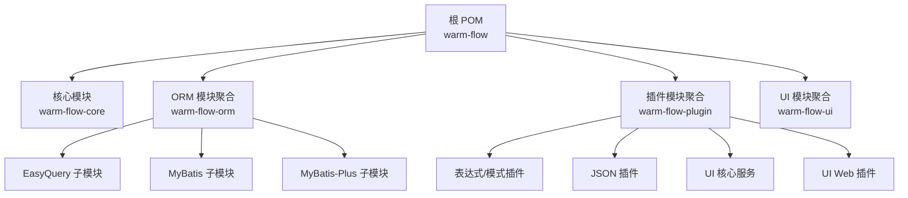
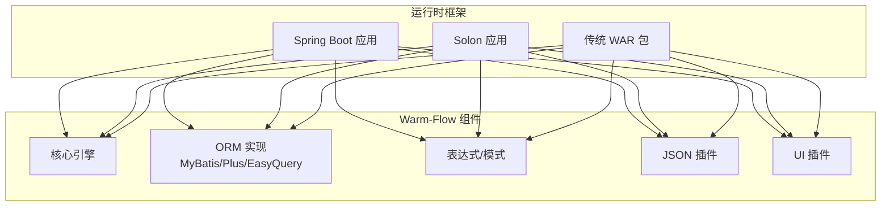
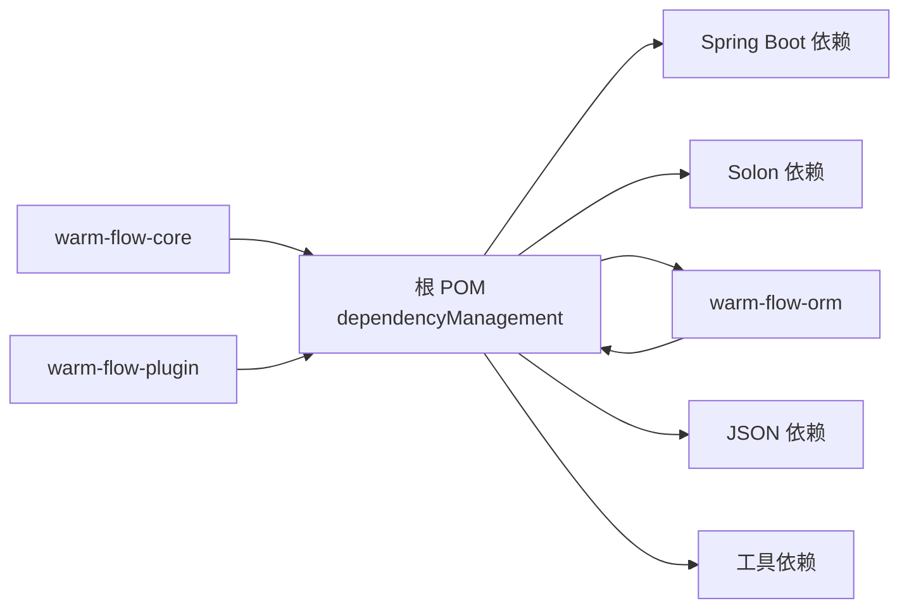

# 应用部署

<cite>
**本文引用的文件**
- [根 POM（总控）](file://pom.xml)
- [核心模块 POM](file://warm-flow-core/pom.xml)
- [ORM 模块聚合 POM](file://warm-flow-orm/pom.xml)
- [插件模块聚合 POM](file://warm-flow-plugin/pom.xml)
- [UI 模块聚合 POM](file://warm-flow-ui/pom.xml)
- [EasyQuery-Solon 插件属性](file://warm-flow-orm/warm-flow-easy-query/warm-flow-easy-query-solon-plugin/src/main/resources/META-INF/solon/org.dromara.warm.flow.solon.properties)
- [MyBatis-Solon 插件属性](file://warm-flow-orm/warm-flow-mybatis/warm-flow-mybatis-solon-plugin/src/main/resources/META-INF/solon/org.dromara.warm.flow.solon.properties)
- [MyBatis-Plus-Solon 插件属性](file://warm-flow-orm/warm-flow-mybatis-plus/warm-flow-mybatis-plus-solon-plugin/src/main/resources/META-INF/solon/org.dromara.warm.flow.solon.properties)
- [UI-Solon 插件属性](file://warm-flow-plugin/warm-flow-plugin-ui/warm-flow-plugin-ui-solon-web/src/main/resources/META-INF/solon/org.dromara.warm.flow.ui.properties)
- [MySQL 升级脚本（v1.8.4 → v1.8.5）](file://sql/mysql/v1-upgrade/warm-flow_1.8.4.sql)
- [MySQL 升级脚本（v1.8.5 → v1.8.5）](file://sql/mysql/v1-upgrade/warm-flow_1.8.5.sql)
- [MySQL 全量初始化脚本](file://sql/mysql/warm-flow-all.sql)
</cite>

## 目录
1. [简介](#简介)
2. [项目结构](#项目结构)
3. [核心组件](#核心组件)
4. [架构总览](#架构总览)
5. [详细组件分析](#详细组件分析)
6. [依赖分析](#依赖分析)
7. [性能考虑](#性能考虑)
8. [故障排查指南](#故障排查指南)
9. [结论](#结论)
10. [附录](#附录)

## 简介
本指南面向 Warm-Flow 应用的生产部署，覆盖以下方面：
- 打包与构建：Maven 命令、构建参数、产物位置
- 运行环境部署：Spring Boot、Solon 框架、传统 WAR 包
- 配置管理：application.yml、数据库连接、日志、安全
- 启停流程：启动参数、环境变量、健康检查
- 负载均衡与集群：Nginx 反向代理、Tomcat 集群、Spring Cloud
- 部署验证与回滚：验证方法、回滚策略

## 项目结构
Warm-Flow 采用多模块聚合工程，顶层 POM 管理版本与插件，子模块按“核心能力”“ORM 层”“插件层”“前端 UI”划分。

图表来源
- [根 POM（总控）:58-62](file://pom.xml#L58-L62)
- [ORM 模块聚合 POM](file://warm-flow-orm/pom.xml)
- [插件模块聚合 POM](file://warm-flow-plugin/pom.xml)
- [UI 模块聚合 POM](file://warm-flow-ui/pom.xml)

章节来源
- [根 POM（总控）:58-62](file://pom.xml#L58-L62)
- [核心模块 POM:1-35](file://warm-flow-core/pom.xml#L1-L35)

## 核心组件
- 核心引擎与实体：定义流程引擎、实体模型、服务接口与实现
- ORM 支持：提供 MyBatis、MyBatis-Plus、EasyQuery 多实现，适配 Spring Boot 与 Solon
- 表达式与模式：支持 SpEL/Snack 等表达式解析与监听器策略
- JSON 插件：支持 Jackson/FastJson/Gson 等序列化实现
- UI 插件：提供前端资源与控制器集成（Spring Boot 与 Solon）

章节来源
- [根 POM（总控）:104-433](file://pom.xml#L104-L433)
- [核心模块 POM:16-33](file://warm-flow-core/pom.xml#L16-L33)

## 架构总览
Warm-Flow 的部署形态由运行时框架决定：
- Spring Boot：通过 Starter 自动装配 ORM 与 UI 组件
- Solon：通过 Plugin 自动注册 ORM 与 UI 组件
- 传统 WAR：需自行装配框架与静态资源

图表来源
- [根 POM（总控）:104-433](file://pom.xml#L104-L433)
- [EasyQuery-Solon 插件属性:1-2](file://warm-flow-orm/warm-flow-easy-query/warm-flow-easy-query-solon-plugin/src/main/resources/META-INF/solon/org.dromara.warm.flow.solon.properties#L1-L2)
- [MyBatis-Solon 插件属性](file://warm-flow-orm/warm-flow-mybatis/warm-flow-mybatis-solon-plugin/src/main/resources/META-INF/solon/org.dromara.warm.flow.solon.properties)
- [MyBatis-Plus-Solon 插件属性](file://warm-flow-orm/warm-flow-mybatis-plus/warm-flow-mybatis-plus-solon-plugin/src/main/resources/META-INF/solon/org.dromara.warm.flow.solon.properties)
- [UI-Solon 插件属性](file://warm-flow-plugin/warm-flow-plugin-ui/warm-flow-plugin-ui-solon-web/src/main/resources/META-INF/solon/org.dromara.warm.flow.ui.properties)

## 详细组件分析

### 构建与打包
- 构建命令
  - 清理并打包：mvn clean package -DskipTests
  - 安装到本地仓库：mvn clean install -DskipTests
  - 发布至中央仓库（需 release profile）：mvn clean deploy -P release
- 构建参数
  - 跳过测试：-DskipTests
  - 版本升级：mvn versions:set -DnewVersion=x.y.z && mvn versions:commit
- 产物位置
  - 各模块 target 目录下生成 jar/war 与源码、文档附件
  - 发布产物由 central-publishing-maven-plugin 控制

章节来源
- [根 POM（总控）:527-532](file://pom.xml#L527-L532)

### Spring Boot 应用部署
- 选择 Starter
  - MyBatis：warm-flow-mybatis-sb-starter
  - MyBatis-Plus：warm-flow-mybatis-plus-sb-starter
  - EasyQuery：warm-flow-easy-query-sb-starter 或 sb3/starter
- 配置要点
  - 数据库连接：驱动、URL、账号密码、连接池参数
  - 日志：logback/log4j2 配置与级别
  - 安全：如启用 Spring Security，配置拦截规则
- 启动方式
  - Java -jar 启动，或使用 Spring Boot 插件运行
  - 健康检查：/actuator/health（如启用 actuator）
- 集群与负载均衡
  - 使用 Nginx 反向代理多实例
  - 使用 Spring Cloud（Eureka/Nacos）进行服务发现与路由

章节来源
- [根 POM（总控）:104-433](file://pom.xml#L104-L433)

### Solon 框架部署
- 选择 Plugin
  - MyBatis：warm-flow-mybatis-solon-plugin
  - MyBatis-Plus：warm-flow-mybatis-plus-solon-plugin
  - EasyQuery：warm-flow-easy-query-solon-plugin
  - UI：warm-flow-plugin-ui-solon-web
- 插件注册
  - 通过 META-INF/solon/*.properties 自动注册
- 启动方式
  - 使用 Solon CLI 或打包为可执行 jar 启动
  - 健康检查：可通过 Solon 原生健康端点或自定义端点
- 集群与负载均衡
  - Nginx 反向代理多实例
  - 使用 Solon 集成的服务发现（如 Nacos/Sentinel）

章节来源
- [EasyQuery-Solon 插件属性:1-2](file://warm-flow-orm/warm-flow-easy-query/warm-flow-easy-query-solon-plugin/src/main/resources/META-INF/solon/org.dromara.warm.flow.solon.properties#L1-L2)
- [MyBatis-Solon 插件属性](file://warm-flow-orm/warm-flow-mybatis/warm-flow-mybatis-solon-plugin/src/main/resources/META-INF/solon/org.dromara.warm.flow.solon.properties)
- [MyBatis-Plus-Solon 插件属性](file://warm-flow-orm/warm-flow-mybatis-plus/warm-flow-mybatis-plus-solon-plugin/src/main/resources/META-INF/solon/org.dromara.warm.flow.solon.properties)
- [UI-Solon 插件属性](file://warm-flow-plugin/warm-flow-plugin-ui/warm-flow-plugin-ui-solon-web/src/main/resources/META-INF/solon/org.dromara.warm.flow.ui.properties)

### 传统 WAR 包部署
- 适用场景
  - 需要嵌入现有 Tomcat/容器
- 步骤
  - 将所选 ORM/UI 插件与核心模块打包为 WAR
  - 在容器中部署 WAR，配置数据源与日志
  - 访问路径映射至应用上下文
- 注意事项
  - 确保容器版本与 JDK 版本兼容
  - 静态资源与反向代理配置

章节来源
- [根 POM（总控）:68-71](file://pom.xml#L68-L71)

### 配置文件管理
- application.yml（Spring Boot）
  - 数据库连接：驱动、URL、用户名、密码、连接池参数
  - 日志：日志级别、输出格式、文件滚动策略
  - 安全：如开启 CSRF、CORS、认证与授权规则
- logback.xml（可选）
  - 自定义日志配置，覆盖 application.yml 中的日志设置
- Solon 配置
  - 使用 solon.cfg.yaml 或环境变量注入配置
  - ORM/UI 插件通过插件属性自动装配

章节来源
- [根 POM（总控）:64-102](file://pom.xml#L64-L102)

### 服务启动与停止
- 启动参数
  - JVM 参数：堆大小、GC、JFR、JMX
  - 应用参数：端口、上下文路径、环境标识
- 环境变量
  - DB_URL、DB_USER、DB_PWD、LOG_LEVEL 等
- 健康检查
  - Spring Boot：/actuator/health
  - Solon：自定义健康端点或使用内置健康检查
- 停止流程
  - 平滑关闭：发送 SIGTERM，等待优雅关闭完成
  - 强制停止：超时后发送 SIGKILL

章节来源
- [根 POM（总控）:527-532](file://pom.xml#L527-L532)

### 负载均衡与集群
- Nginx 反向代理
  - upstream 指向多个实例
  - 健康检查：基于 TCP/HTTP 探针
  - 会话保持：根据业务需求选择策略
- Tomcat 集群
  - 开启集群会话复制或使用外部缓存
  - 负载均衡器分发请求
- Spring Cloud 集成
  - 服务注册与发现：Eureka/Nacos
  - 路由与网关：Zuul/Spring Cloud Gateway
  - 配置中心：Spring Cloud Config

章节来源
- [根 POM（总控）:76-79](file://pom.xml#L76-L79)

### 部署验证与回滚
- 部署验证
  - 接口测试：创建/启动流程、查询任务与实例
  - 数据校验：数据库表结构与数据一致性
  - 性能测试：并发与响应时间
- 回滚策略
  - 快照回滚：容器/系统快照
  - 版本回退：回退到上一个稳定版本
  - 数据回滚：基于备份与增量日志

章节来源
- [根 POM（总控）:527-532](file://pom.xml#L527-L532)

## 依赖分析
Warm-Flow 的依赖集中在顶层 POM 的 dependencyManagement 中统一管理，各子模块按需引入对应 Starter/Plugin 以获得一致的版本与能力。

图表来源
- [根 POM（总控）:104-433](file://pom.xml#L104-L433)

章节来源
- [根 POM（总控）:104-433](file://pom.xml#L104-L433)

## 性能考虑
- 连接池与数据库
  - 使用 HikariCP，合理设置最大连接数与空闲超时
- 缓存与热点数据
  - 对流程定义与用户信息进行缓存
- 监控与日志
  - 启用慢查询日志与 APM 监控
- 集群与伸缩
  - 水平扩展实例数量，结合缓存与共享存储

## 故障排查指南
- 启动失败
  - 检查 JDK 版本与容器兼容性
  - 校验 application.yml 与环境变量
- 数据库问题
  - 校验连接串、驱动版本与权限
  - 执行初始化/升级脚本
- ORM 相关
  - 确认 Starter/Plugin 与 ORM 版本匹配
- UI 访问异常
  - 校验静态资源路径与反向代理配置

章节来源
- [根 POM（总控）:76-97](file://pom.xml#L76-L97)

## 结论
Warm-Flow 提供了多运行时与多 ORM 的灵活组合，结合标准的 Spring Boot 与 Solon 部署方式，可快速落地生产环境。建议在生产中统一版本管理、完善监控与回滚策略，并通过 Nginx/Tomcat/Spring Cloud 实现高可用与弹性伸缩。

## 附录

### 数据库初始化与升级
- 初始化脚本
  - MySQL 全量初始化：[MySQL 全量初始化脚本](file://sql/mysql/warm-flow-all.sql)
- 升级脚本
  - v1.8.4 → v1.8.5：[升级脚本](file://sql/mysql/v1-upgrade/warm-flow_1.8.4.sql)
  - v1.8.5 → v1.8.5（补丁）：[升级脚本](file://sql/mysql/v1-upgrade/warm-flow_1.8.5.sql)

章节来源
- [MySQL 升级脚本（v1.8.4 → v1.8.5）](file://sql/mysql/v1-upgrade/warm-flow_1.8.4.sql)
- [MySQL 升级脚本（v1.8.5 → v1.8.5）](file://sql/mysql/v1-upgrade/warm-flow_1.8.5.sql)
- [MySQL 全量初始化脚本](file://sql/mysql/warm-flow-all.sql)