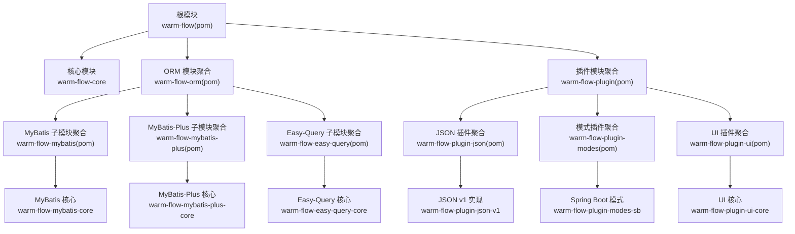
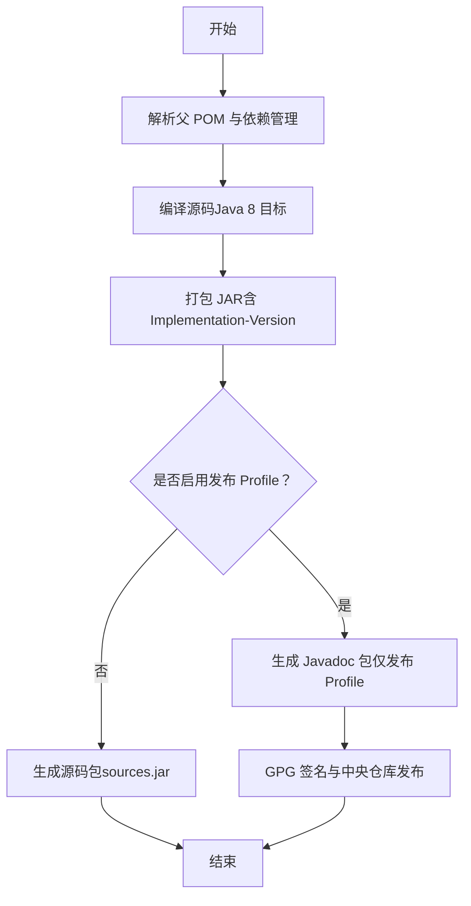
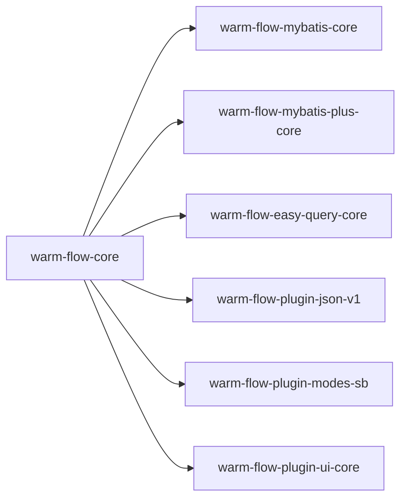
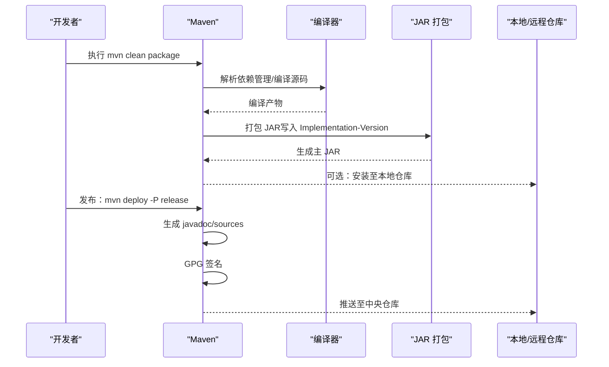

# 构建与打包

<cite>
**本文引用的文件**
- [根 pom.xml](file://pom.xml)
- [核心模块 pom.xml](file://warm-flow-core/pom.xml)
- [ORM 模块聚合 pom.xml](file://warm-flow-orm/pom.xml)
- [ORM MyBatis 核心 pom.xml](file://warm-flow-orm/warm-flow-mybatis/warm-flow-mybatis-core/pom.xml)
- [ORM MyBatis Plus 核心 pom.xml](file://warm-flow-orm/warm-flow-mybatis-plus/warm-flow-mybatis-plus-core/pom.xml)
- [ORM Easy-Query 核心 pom.xml](file://warm-flow-orm/warm-flow-easy-query/warm-flow-easy-query-core/pom.xml)
- [插件模块聚合 pom.xml](file://warm-flow-plugin/pom.xml)
- [JSON 插件聚合 pom.xml](file://warm-flow-plugin/warm-flow-plugin-json/pom.xml)
- [JSON 插件 v1 pom.xml](file://warm-flow-plugin/warm-flow-plugin-json/warm-flow-plugin-json-v1/pom.xml)
- [模式插件聚合 pom.xml](file://warm-flow-plugin/warm-flow-plugin-modes/pom.xml)
- [模式插件 Spring Boot pom.xml](file://warm-flow-plugin/warm-flow-plugin-modes/warm-flow-plugin-modes-sb/pom.xml)
- [UI 插件聚合 pom.xml](file://warm-flow-plugin/warm-flow-plugin-ui/pom.xml)
- [UI 插件核心 pom.xml](file://warm-flow-plugin/warm-flow-plugin-ui/warm-flow-plugin-ui-core/pom.xml)
</cite>

## 目录
1. [简介](#简介)
2. [项目结构](#项目结构)
3. [核心组件](#核心组件)
4. [架构总览](#架构总览)
5. [详细组件分析](#详细组件分析)
6. [依赖分析](#依赖分析)
7. [性能考虑](#性能考虑)
8. [故障排查指南](#故障排查指南)
9. [结论](#结论)
10. [附录](#附录)

## 简介
本指南面向 Warm-Flow 项目的构建与打包，覆盖 Maven 命令与参数、多模块构建结构、构建环境要求、配置管理（版本/依赖/插件）、构建优化技巧以及产物组织结构说明。目标是帮助开发者快速、稳定地完成本地构建与发布。

## 项目结构
Warm-Flow 采用多模块聚合结构，顶层 pom 负责统一版本与插件配置，各功能域按“核心/ORM/插件”拆分，每个子域再细分子模块，形成清晰的层次化组织。

图表来源
- [根 pom.xml:58-62](file://pom.xml#L58-L62)
- [ORM 模块聚合 pom.xml:17-21](file://warm-flow-orm/pom.xml#L17-L21)
- [插件模块聚合 pom.xml:17-21](file://warm-flow-plugin/pom.xml#L17-L21)

章节来源
- [根 pom.xml:58-62](file://pom.xml#L58-L62)
- [ORM 模块聚合 pom.xml:17-21](file://warm-flow-orm/pom.xml#L17-L21)
- [插件模块聚合 pom.xml:17-21](file://warm-flow-plugin/pom.xml#L17-L21)

## 核心组件
- 根模块（warm-flow）：定义统一版本属性、依赖管理、通用插件（源码包、JAR 清单、发布配置）及构建 profile（发布到中央仓库）。
- 核心模块（warm-flow-core）：流程引擎与实体、服务、工具的基础实现，无框架绑定，作为所有 ORM/插件模块的上游依赖。
- ORM 子模块：
  - MyBatis 核心（warm-flow-mybatis-core）：基于 MyBatis 的 DAO/实体/Mapper 映射。
  - MyBatis-Plus 核心（warm-flow-mybatis-plus-core）：基于 MyBatis-Plus 的增强能力。
  - Easy-Query 核心（warm-flow-easy-query-core）：基于 entity-query 的查询扩展。
- 插件子模块：
  - JSON 插件（warm-flow-plugin-json-v1）：提供多种 JSON 实现选择。
  - 模式插件（warm-flow-plugin-modes-sb）：Spring Boot 自动装配与表达式策略。
  - UI 插件（warm-flow-plugin-ui-core）：前端资源与后端 Web 集成。

章节来源
- [根 pom.xml:104-433](file://pom.xml#L104-L433)
- [核心模块 pom.xml:16-33](file://warm-flow-core/pom.xml#L16-L33)
- [ORM MyBatis 核心 pom.xml:16-31](file://warm-flow-orm/warm-flow-mybatis/warm-flow-mybatis-core/pom.xml#L16-L31)
- [ORM MyBatis Plus 核心 pom.xml:16-30](file://warm-flow-orm/warm-flow-mybatis-plus/warm-flow-mybatis-plus-core/pom.xml#L16-L30)
- [ORM Easy-Query 核心 pom.xml:16-38](file://warm-flow-orm/warm-flow-easy-query/warm-flow-easy-query-core/pom.xml#L16-L38)
- [JSON 插件 v1 pom.xml:16-51](file://warm-flow-plugin/warm-flow-plugin-json/warm-flow-plugin-json-v1/pom.xml#L16-L51)
- [模式插件 Spring Boot pom.xml:16-61](file://warm-flow-plugin/warm-flow-plugin-modes/warm-flow-plugin-modes-sb/pom.xml#L16-L61)
- [UI 插件核心 pom.xml:16-33](file://warm-flow-plugin/warm-flow-plugin-ui/warm-flow-plugin-ui-core/pom.xml#L16-L33)

## 架构总览
下图展示构建阶段的关键步骤与产物：

图表来源
- [根 pom.xml:435-463](file://pom.xml#L435-L463)
- [根 pom.xml:465-525](file://pom.xml#L465-L525)

## 详细组件分析

### 构建命令与参数
- 清理并打包：mvn clean package
  - 默认行为：清理输出目录、编译、测试、打包；可配合 -DskipTests 跳过测试。
- 安装到本地仓库：mvn clean install
  - 将构件安装至本地 ~/.m2/repository，便于本地其他模块引用。
- 发布到中央仓库：mvn clean deploy -P release
  - 启用 release profile，生成 javadoc、签名并推送至中央仓库。
- 统一版本升级：mvn versions:set -DnewVersion=x.y.z
  - 适用于批量更新多模块版本，配合 versions:commit/revert 使用。

章节来源
- [根 pom.xml:527-532](file://pom.xml#L527-L532)

### 构建环境要求
- Java 版本
  - 编译与运行目标：Java 8（maven-compiler-target/source=8）
  - 属性中保留 Java 17 及路径，用于特定场景或工具链
- Maven 版本
  - 使用 maven-4.0.0.xsd，建议使用较新稳定版 Maven（如 3.9.x）
- 操作系统
  - 跨平台（Windows/Linux/macOS），需满足 Java 运行环境

章节来源
- [根 pom.xml:68-73](file://pom.xml#L68-L73)

### 构建配置管理
- 版本管理
  - 顶层 version 控制所有模块版本；属性 ${warm-flow} 与之同步
- 依赖管理
  - 通过 dependencyManagement 统一声明 Spring Boot/Solon、MyBatis/Plus/Easy-Query、JSON 库、日志等版本
  - 子模块按需引入，避免重复指定版本
- 插件配置
  - 源码包插件：maven-source-plugin，生成 sources.jar
  - JAR 插件：maven-jar-plugin，在清单中写入 Implementation-Version
  - 发布 Profile：maven-javadoc-plugin、maven-gpg-plugin、central-publishing-maven-plugin、maven-deploy-plugin

章节来源
- [根 pom.xml:64-102](file://pom.xml#L64-L102)
- [根 pom.xml:104-433](file://pom.xml#L104-L433)
- [根 pom.xml:435-463](file://pom.xml#L435-L463)
- [根 pom.xml:465-525](file://pom.xml#L465-L525)

### 构建优化技巧
- 并行构建
  - 使用 -T 或 --threads 控制线程数，提升多模块并行编译效率
- 跳过测试
  - -DskipTests 或 -Dmaven.test.skip=true 快速构建
- 增量构建
  - 在 IDE 中启用增量编译，减少全量编译时间
- 选择性模块
  - 使用 -pl 与 -am/-amd 仅构建指定模块及其依赖
- 发布 Profile
  - 仅在需要时启用 -P release，避免不必要的 javadoc/gpg 步骤

[本节为通用实践建议，不直接分析具体文件]

### 构建产物组织结构
- JAR 产物
  - 核心与各子模块均生成主 JAR，清单中包含 Implementation-Version
- 源码包
  - 通过 maven-source-plugin 生成 sources.jar，便于依赖方调试与审计
- 文档包
  - 发布 Profile 下生成 javadoc.jar
- 插件与启动器
  - 各 ORM/插件模块按 Spring Boot/Solon 兼容性提供 starter/plugin 形态（由各子模块 pom 定义）

章节来源
- [根 pom.xml:435-463](file://pom.xml#L435-L463)
- [根 pom.xml:465-525](file://pom.xml#L465-L525)

## 依赖分析

### 依赖关系图（代码级）

图表来源
- [核心模块 pom.xml:16-33](file://warm-flow-core/pom.xml#L16-L33)
- [ORM MyBatis 核心 pom.xml:16-31](file://warm-flow-orm/warm-flow-mybatis/warm-flow-mybatis-core/pom.xml#L16-L31)
- [ORM MyBatis Plus 核心 pom.xml:16-30](file://warm-flow-orm/warm-flow-mybatis-plus/warm-flow-mybatis-plus-core/pom.xml#L16-L30)
- [ORM Easy-Query 核心 pom.xml:16-38](file://warm-flow-orm/warm-flow-easy-query/warm-flow-easy-query-core/pom.xml#L16-L38)
- [JSON 插件 v1 pom.xml:16-51](file://warm-flow-plugin/warm-flow-plugin-json/warm-flow-plugin-json-v1/pom.xml#L16-L51)
- [模式插件 Spring Boot pom.xml:16-61](file://warm-flow-plugin/warm-flow-plugin-modes/warm-flow-plugin-modes-sb/pom.xml#L16-L61)
- [UI 插件核心 pom.xml:16-33](file://warm-flow-plugin/warm-flow-plugin-ui/warm-flow-plugin-ui-core/pom.xml#L16-L33)

### 关键流程（以核心模块为例）

图表来源
- [根 pom.xml:435-463](file://pom.xml#L435-L463)
- [根 pom.xml:465-525](file://pom.xml#L465-L525)

## 性能考虑
- 多模块并行：合理划分模块边界，利用 -T 参数提升并行度
- 选择性构建：CI 中仅构建变更模块，减少整体耗时
- 跳过测试：开发阶段使用 -DskipTests，发布前再执行完整测试
- 依赖精简：通过 dependencyManagement 集中管理版本，避免重复依赖导致的下载与解析开销

[本节为通用指导，不直接分析具体文件]

## 故障排查指南
- 版本不一致
  - 症状：子模块与父 POM 版本不匹配
  - 处理：使用 versions:set 统一升级，并执行 versions:commit
- Java 版本不兼容
  - 症状：编译报错或运行时报 class 版本错误
  - 处理：确保 JAVA_HOME 与 Maven 编译目标一致（当前为 Java 8）
- 发布失败（GPG/签名）
  - 症状：GPG 插件执行失败
  - 处理：检查本地 GPG 密钥与 settings.xml server 配置
- 依赖冲突
  - 症状：类找不到或方法签名不匹配
  - 处理：使用 dependency:tree 分析冲突，必要时在 dependencyManagement 中锁定版本

章节来源
- [根 pom.xml:530-532](file://pom.xml#L530-L532)

## 结论
Warm-Flow 的多模块结构清晰、版本与依赖集中管理，结合标准的 Maven 生命周期与发布 Profile，能够高效产出稳定的构件。遵循本文的命令、配置与优化建议，可在不同环境下稳定完成构建与发布。

## 附录

### 常用命令速查
- 清理并打包：mvn clean package
- 安装到本地：mvn clean install
- 发布到中央仓库：mvn clean deploy -P release
- 统一版本升级：mvn versions:set -DnewVersion=x.y.z

章节来源
- [根 pom.xml:527-532](file://pom.xml#L527-L532)