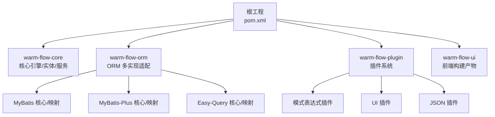
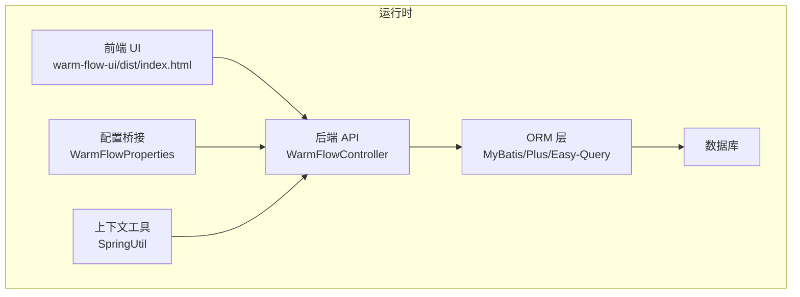
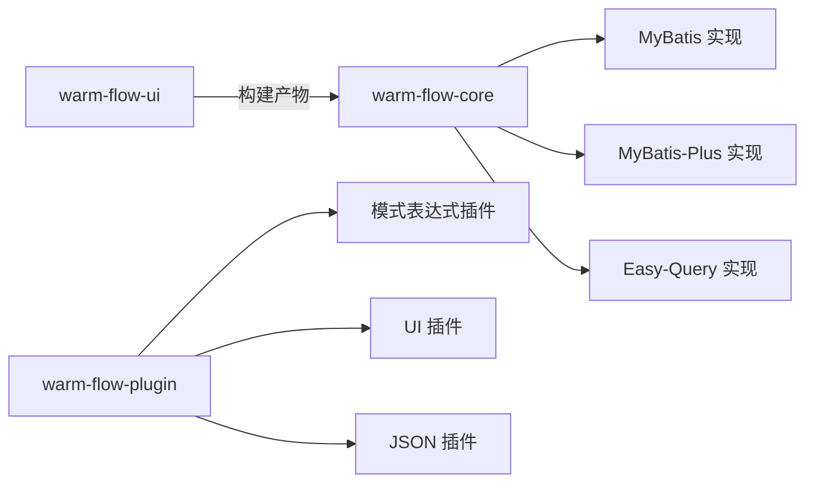

# 部署验证与监控

<cite>
**本文引用的文件**   
- [pom.xml](file://pom.xml)
- [release.yml](file://.github/workflows/release.yml)
- [WarmFlowProperties.java](file://warm-flow-plugin/warm-flow-plugin-modes/warm-flow-plugin-modes-sb/src/main/java/org/dromara/warm/plugin/modes/sb/config/WarmFlowProperties.java)
- [SpringUtil.java](file://warm-flow-plugin/warm-flow-plugin-modes/warm-flow-plugin-modes-sb/src/main/java/org/dromara/warm/plugin/modes/sb/utils/SpringUtil.java)
- [CommonUtil.java](file://warm-flow-orm/warm-flow-mybatis/warm-flow-mybatis-core/src/main/java/org/dromara/warm/flow/orm/utils/CommonUtil.java)
- [WarmFlowController.java](file://warm-flow-plugin/warm-flow-plugin-ui/warm-flow-plugin-ui-solon-web/src/main/java/org/dromara/warm/flow/ui/controller/WarmFlowController.java)
- [warm-flow-all.sql](file://sql/mysql/warm-flow-all.sql)
- [v1-upgrade 文件夹](file://sql/mysql/v1-upgrade/)
- [warm-flow-ui/index.html](file://warm-flow-ui/dist/index.html)
</cite>

## 目录
1. [简介](#简介)
2. [项目结构](#项目结构)
3. [核心组件](#核心组件)
4. [架构总览](#架构总览)
5. [详细组件分析](#详细组件分析)
6. [依赖关系分析](#依赖关系分析)
7. [性能考量](#性能考量)
8. [故障排查指南](#故障排查指南)
9. [结论](#结论)
10. [附录](#附录)

## 简介
本指南面向 Warm-Flow 应用在生产环境的部署验证与监控，覆盖服务启动检查、API 接口测试、数据库连接验证、核心功能验证；健康检查端点与自定义健康指标；JVM/应用/数据库/第三方服务监控；日志与告警；以及自动化部署与 CI/CD 集成方案。内容基于仓库现有技术栈与模块进行落地说明，帮助运维与开发团队快速建立稳定可靠的运行保障体系。

## 项目结构
Warm-Flow 采用多模块聚合工程，核心模块包括：
- 核心引擎与实体：warm-flow-core
- ORM 支持：warm-flow-orm（MyBatis、MyBatis-Plus、Easy-Query 多生态适配）
- 插件系统：warm-flow-plugin（模式表达式、UI、JSON 实现等）
- 前端 UI：warm-flow-ui（Vue3 构建产物）

图表来源
- [pom.xml:58-62](file://pom.xml#L58-L62)
- [pom.xml:104-433](file://pom.xml#L104-L433)

章节来源
- [pom.xml:58-62](file://pom.xml#L58-L62)
- [pom.xml:104-433](file://pom.xml#L104-L433)

## 核心组件
- 配置桥接：WarmFlowProperties 将框架配置暴露为 Spring Boot 配置属性，便于外部注入与覆盖。
- 上下文工具：SpringUtil 提供静态获取 ApplicationContext 的能力，便于在非 Spring 环境或工具类中访问 Bean。
- 数据源类型推断：CommonUtil 在未显式配置数据源类型时，通过 JDBC 元数据推断数据库类型，确保 SQL 方言正确。
- UI 控制器：WarmFlowController 提供节点扩展、监听器列表等接口，用于前端可视化与流程配置。

章节来源
- [WarmFlowProperties.java:16-26](file://warm-flow-plugin/warm-flow-plugin-modes/warm-flow-plugin-modes-sb/src/main/java/org/dromara/warm/plugin/modes/sb/config/WarmFlowProperties.java#L16-L26)
- [SpringUtil.java:16-41](file://warm-flow-plugin/warm-flow-plugin-modes/warm-flow-plugin-modes-sb/src/main/java/org/dromara/warm/plugin/modes/sb/utils/SpringUtil.java#L16-L41)
- [CommonUtil.java:26-61](file://warm-flow-orm/warm-flow-mybatis/warm-flow-mybatis-core/src/main/java/org/dromara/warm/flow/orm/utils/CommonUtil.java#L26-L61)
- [WarmFlowController.java:220-243](file://warm-flow-plugin/warm-flow-plugin-ui/warm-flow-plugin-ui-solon-web/src/main/java/org/dromara/warm/flow/ui/controller/WarmFlowController.java#L220-L243)

## 架构总览
Warm-Flow 同时支持 Spring Boot 与 Solon 生态，ORM 层提供 MyBatis、MyBatis-Plus、Easy-Query 多实现，前端通过 Vue3 构建产物提供可视化设计与表单编辑能力。

图表来源
- [WarmFlowController.java:220-243](file://warm-flow-plugin/warm-flow-plugin-ui/warm-flow-plugin-ui-solon-web/src/main/java/org/dromara/warm/flow/ui/controller/WarmFlowController.java#L220-L243)
- [WarmFlowProperties.java:16-26](file://warm-flow-plugin/warm-flow-plugin-modes/warm-flow-plugin-modes-sb/src/main/java/org/dromara/warm/plugin/modes/sb/config/WarmFlowProperties.java#L16-L26)
- [SpringUtil.java:16-41](file://warm-flow-plugin/warm-flow-plugin-modes/warm-flow-plugin-modes-sb/src/main/java/org/dromara/warm/plugin/modes/sb/utils/SpringUtil.java#L16-L41)
- [CommonUtil.java:26-61](file://warm-flow-orm/warm-flow-mybatis/warm-flow-mybatis-core/src/main/java/org/dromara/warm/flow/orm/utils/CommonUtil.java#L26-L61)

## 详细组件分析

### 部署验证清单与步骤
- 服务启动检查
  - 依据所选运行时（Spring Boot 或 Solon）完成打包与启动，观察控制台输出与端口绑定情况。
  - 访问健康检查端点（如 /actuator/health），确认应用处于健康状态。
- API 接口测试
  - 调用 WarmFlowController 中的公开接口，如节点扩展、监听器列表等，验证返回结构与业务逻辑。
- 数据库连接验证
  - 使用数据库客户端连接目标实例，执行基础查询，验证连通性与权限。
  - 若未显式配置数据源类型，CommonUtil 会尝试通过 JDBC 元数据推断数据库类型，确保 SQL 方言正确。
- 核心功能验证
  - 前端访问 warm-flow-ui/dist/index.html，进入流程设计器与表单设计器，完成基本交互验证。

章节来源
- [WarmFlowController.java:220-243](file://warm-flow-plugin/warm-flow-plugin-ui/warm-flow-plugin-ui-solon-web/src/main/java/org/dromara/warm/flow/ui/controller/WarmFlowController.java#L220-L243)
- [CommonUtil.java:26-61](file://warm-flow-orm/warm-flow-mybatis/warm-flow-mybatis-core/src/main/java/org/dromara/warm/flow/orm/utils/CommonUtil.java#L26-L61)
- [warm-flow-all.sql](file://sql/mysql/warm-flow-all.sql)

### 健康检查与自定义健康指标
- 健康端点
  - Spring Boot 场景建议启用 Actuator，并访问 /actuator/health 查看整体健康状态。
- 自定义健康检查
  - 可基于 WarmFlowProperties 注入配置，结合 SpringUtil 获取上下文，对数据库、缓存、第三方服务进行探测并上报健康状态。
- 健康状态监控
  - 结合外部监控系统（如 Prometheus/Grafana/PagerDuty）采集健康端点数据，设置阈值与告警规则。

章节来源
- [WarmFlowProperties.java:16-26](file://warm-flow-plugin/warm-flow-plugin-modes/warm-flow-plugin-modes-sb/src/main/java/org/dromara/warm/plugin/modes/sb/config/WarmFlowProperties.java#L16-L26)
- [SpringUtil.java:16-41](file://warm-flow-plugin/warm-flow-plugin-modes/warm-flow-plugin-modes-sb/src/main/java/org/dromara/warm/plugin/modes/sb/utils/SpringUtil.java#L16-L41)

### 性能监控方案
- JVM 监控
  - 启用 JMX/JavaMelody/Micrometer，采集堆内存、GC、线程、类加载等指标。
- 应用性能监控
  - 通过 WarmFlowController 的接口调用链路埋点，统计请求耗时、QPS、错误率。
- 数据库性能监控
  - 关注慢查询、连接池利用率（如 HikariCP）、事务提交耗时；结合 CommonUtil 的数据源类型推断，确保 SQL 方言与性能分析一致。
- 第三方服务监控
  - 对外依赖（如消息队列、存储网关）设置探活与延迟监控，异常时触发告警。

章节来源
- [pom.xml:81-83](file://pom.xml#L81-L83)
- [CommonUtil.java:26-61](file://warm-flow-orm/warm-flow-mybatis/warm-flow-mybatis-core/src/main/java/org/dromara/warm/flow/orm/utils/CommonUtil.java#L26-L61)

### 日志监控与告警
- 日志收集
  - 统一输出到 stdout/stderr，结合容器平台（Docker/K8s）或日志代理（Filebeat/Fluent Bit）集中收集。
- 错误日志监控
  - 设置 ERROR/WARN 级别阈值，结合业务异常（如 FlowException）进行分类统计。
- 性能日志分析
  - 对关键接口与数据库操作记录耗时日志，辅助定位热点与瓶颈。
- 告警规则
  - 基于日志与指标系统设置规则，如错误率突增、响应时间超阈、健康检查失败等。

章节来源
- [pom.xml:140-144](file://pom.xml#L140-L144)

### 故障排查指南
- 常见部署问题
  - 版本不兼容：检查 Java 版本与 Spring Boot/Solon 版本匹配关系。
  - 数据库方言不匹配：若未显式配置数据源类型，CommonUtil 会尝试推断，仍需核对 SQL 方言。
- 启动失败排查
  - 检查端口占用、数据库连接串、初始化脚本执行情况。
- 运行时异常处理
  - 关注 FlowException 与通用异常工具，结合日志定位具体环节。
- 性能问题诊断
  - 从 JVM 指标、接口耗时、数据库慢查询三方面入手，逐步收敛范围。

章节来源
- [pom.xml:64-102](file://pom.xml#L64-L102)
- [CommonUtil.java:26-61](file://warm-flow-orm/warm-flow-mybatis/warm-flow-mybatis-core/src/main/java/org/dromara/warm/flow/orm/utils/CommonUtil.java#L26-L61)

### 自动化部署与 CI/CD 集成
- GitHub Actions 工作流
  - 仓库提供 release.yml 示例，可参考其 Java 环境配置与 Maven 发布流程，按需启用或扩展。
- Docker 容器化部署
  - 建议基于最小镜像构建，复制打包产物与数据库初始化脚本，启动时执行 warm-flow-all.sql 完成初始化。
- Kubernetes 部署
  - 使用 Deployment/Service/Ingress 管理应用与入口；结合 ConfigMap/Secret 管理配置；持久化数据库与日志目录。

章节来源
- [.github/workflows/release.yml:1-41](file://.github/workflows/release.yml#L1-L41)
- [warm-flow-all.sql](file://sql/mysql/warm-flow-all.sql)

## 依赖关系分析
Warm-Flow 通过统一的依赖管理与多模块组织，形成“核心引擎 + ORM 多实现 + 插件系统”的解耦架构。ORM 层提供多种实现以适配不同运行时与数据库类型；插件层扩展表达式、UI、JSON 等能力；前端 UI 作为独立产物集成到后端资源中。

图表来源
- [pom.xml:104-433](file://pom.xml#L104-L433)

章节来源
- [pom.xml:104-433](file://pom.xml#L104-L433)

## 性能考量
- 数据库层
  - 使用 HikariCP 作为连接池，关注连接池大小、泄漏检测与超时配置。
  - 通过 CommonUtil 的数据源类型推断，确保 SQL 方言与性能优化策略一致。
- 应用层
  - 对关键接口进行限流与熔断，避免级联故障。
- 监控层
  - 以指标驱动容量规划，结合日志与追踪（APM）进行根因分析。

章节来源
- [pom.xml:81-83](file://pom.xml#L81-L83)
- [CommonUtil.java:26-61](file://warm-flow-orm/warm-flow-mybatis/warm-flow-mybatis-core/src/main/java/org/dromara/warm/flow/orm/utils/CommonUtil.java#L26-L61)

## 故障排查指南
- 启动阶段
  - 端口冲突：检查进程占用与防火墙策略。
  - 数据库不可达：核对连接串、网络连通性与账号权限。
- 运行阶段
  - 接口异常：结合 WarmFlowController 的返回结构与日志，定位业务分支。
  - 数据库异常：检查慢查询、锁等待与事务隔离级别。
- 配置问题
  - 数据源类型未配置：依赖 CommonUtil 的自动推断，必要时显式指定以避免歧义。

章节来源
- [WarmFlowController.java:220-243](file://warm-flow-plugin/warm-flow-plugin-ui/warm-flow-plugin-ui-solon-web/src/main/java/org/dromara/warm/flow/ui/controller/WarmFlowController.java#L220-L243)
- [CommonUtil.java:26-61](file://warm-flow-orm/warm-flow-mybatis/warm-flow-mybatis-core/src/main/java/org/dromara/warm/flow/orm/utils/CommonUtil.java#L26-L61)

## 结论
通过完善的部署验证流程、健康检查与自定义指标、多层次性能监控、日志与告警体系，以及自动化 CI/CD 集成，Warm-Flow 可在生产环境中保持高可用与可观测性。建议结合实际运行时（Spring Boot/Solon）与数据库类型，持续优化配置与监控策略。

## 附录
- 数据库初始化
  - 使用 warm-flow-all.sql 完成表结构与初始数据导入；升级脚本位于 v1-upgrade 目录，按版本顺序执行。
- 前端访问
  - 前端构建产物位于 warm-flow-ui/dist/index.html，部署后可通过浏览器访问流程设计器与表单设计器。

章节来源
- [warm-flow-all.sql](file://sql/mysql/warm-flow-all.sql)
- [v1-upgrade 文件夹](file://sql/mysql/v1-upgrade/)
- [warm-flow-ui/index.html](file://warm-flow-ui/dist/index.html)