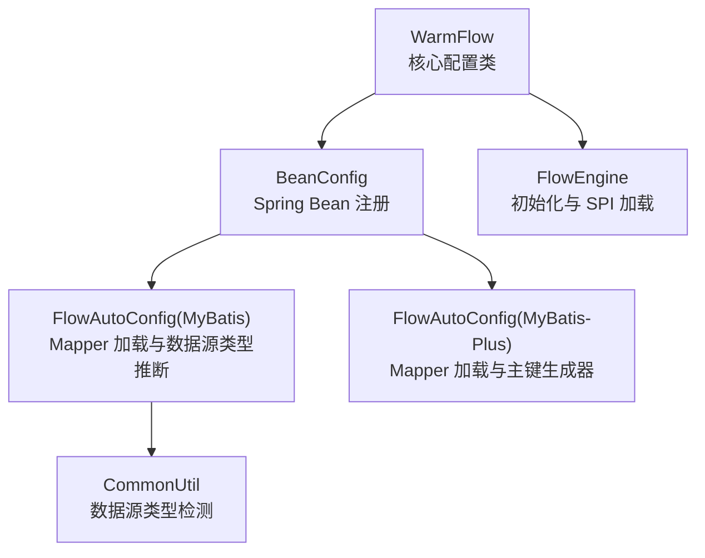
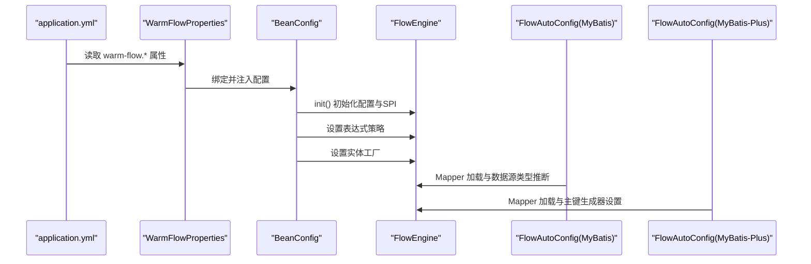
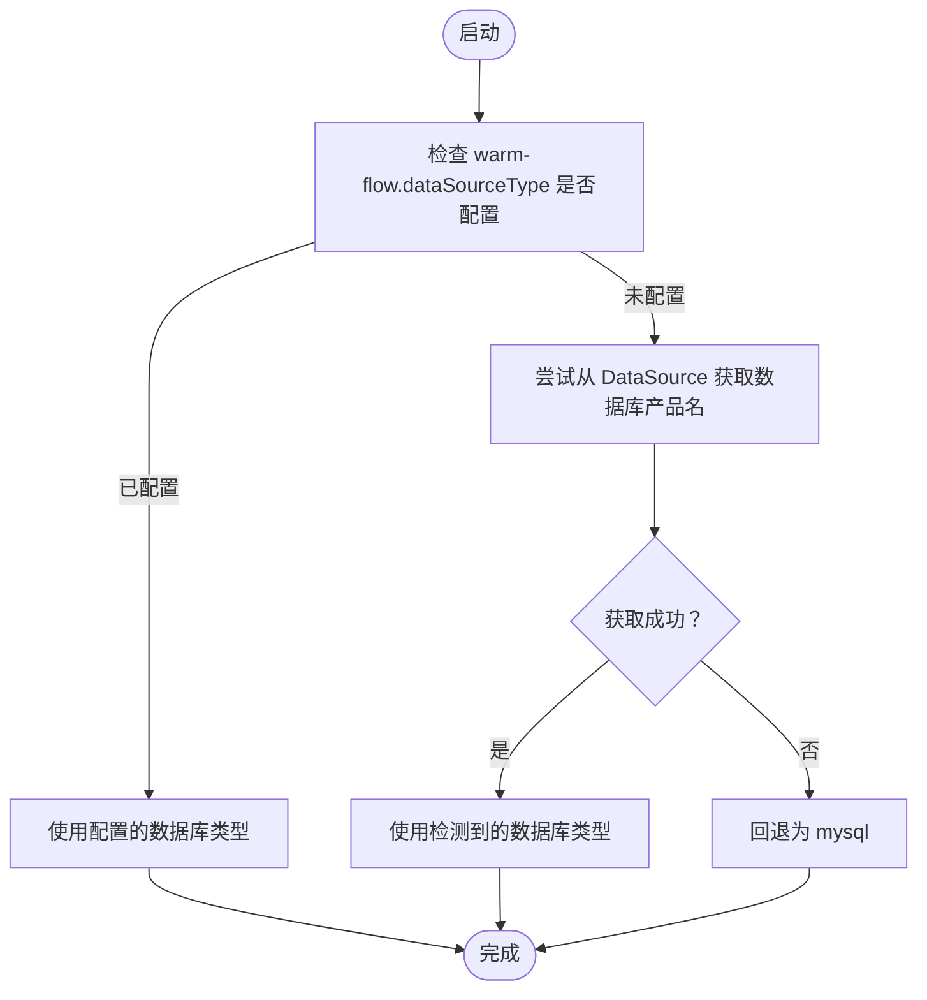
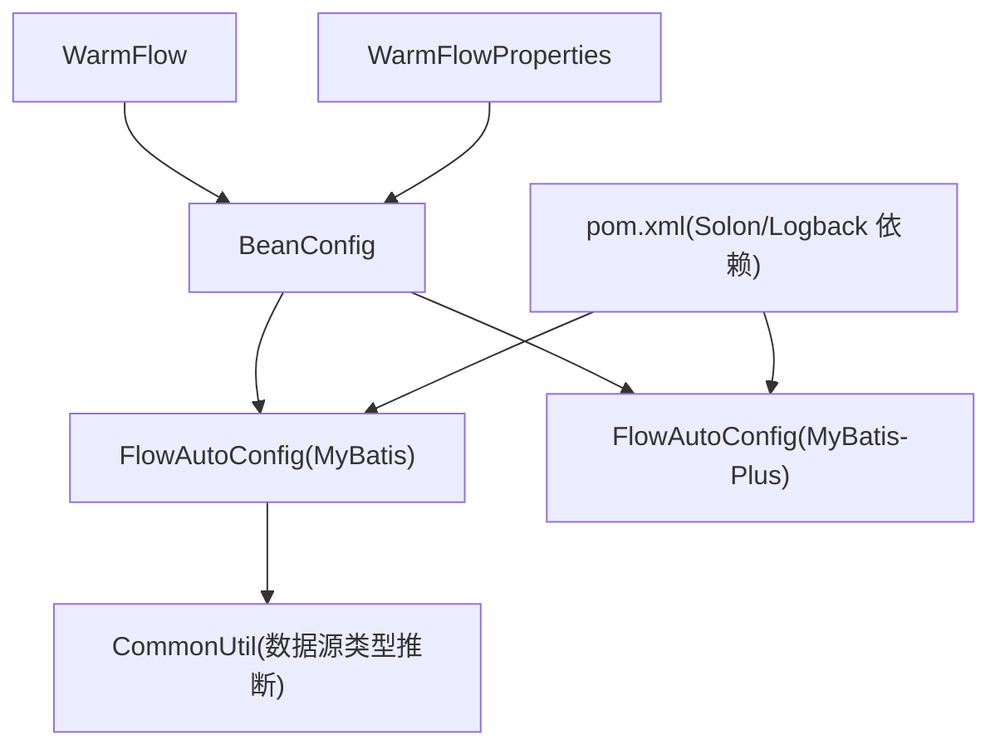

# 配置文件管理

<cite>
**本文引用的文件**
- [WarmFlow.java](file://warm-flow-core/src/main/java/org/dromara/warm/flow/core/config/WarmFlow.java)
- [BeanConfig.java](file://warm-flow-plugin/warm-flow-plugin-modes/warm-flow-plugin-modes-sb/src/main/java/org/dromara/warm/plugin/modes/sb/config/BeanConfig.java)
- [WarmFlowProperties.java](file://warm-flow-plugin/warm-flow-plugin-modes/warm-flow-plugin-modes-sb/src/main/java/org/dromara/warm/plugin/modes/sb/config/WarmFlowProperties.java)
- [FlowAutoConfig.java（MyBatis）](file://warm-flow-orm/warm-flow-mybatis/warm-flow-mybatis-sb-starter/src/main/java/org/dromara/warm/flow/spring/boot/config/FlowAutoConfig.java)
- [FlowAutoConfig.java（MyBatis-Plus）](file://warm-flow-orm/warm-flow-mybatis-plus/warm-flow-mybatis-plus-sb-starter/src/main/java/org/dromara/warm/flow/spring/boot/config/FlowAutoConfig.java)
- [CommonUtil.java](file://warm-flow-orm/warm-flow-mybatis/warm-flow-mybatis-core/src/main/java/org/dromara/warm/flow/orm/utils/CommonUtil.java)
- [FlowConfigCons.java](file://warm-flow-core/src/main/java/org/dromara/warm/flow/core/constant/FlowConfigCons.java)
- [pom.xml](file://pom.xml)
- [cache.js](file://warm-flow-ui/src/plugins/cache.js)
</cite>

## 目录
1. [简介](#简介)
2. [项目结构与配置入口](#项目结构与配置入口)
3. [核心配置组件](#核心配置组件)
4. [架构总览](#架构总览)
5. [详细组件分析](#详细组件分析)
6. [依赖关系分析](#依赖关系分析)
7. [性能与调优建议](#性能与调优建议)
8. [故障排查指南](#故障排查指南)
9. [结论](#结论)
10. [附录：配置清单与最佳实践](#附录配置清单与最佳实践)

## 简介
本指南围绕 Warm-Flow 的配置文件管理进行系统化说明，覆盖以下主题：
- 配置文件的作用域与命名规范（如 application.yml、环境区分文件）
- 数据库连接与多数据源配置要点
- 日志配置与输出策略
- 安全配置（CORS、HTTPS、认证授权）
- 缓存配置（Redis 与前端缓存）
- 性能调优（线程池、内存、JVM 参数）
- 配置加密与安全管理（敏感信息保护、文件权限）

说明：当前代码库未直接提供 application.yml 或 logback.xml 等具体配置文件内容；本指南基于现有代码结构与自动装配机制，给出可落地的配置建议与最佳实践。

## 项目结构与配置入口
Warm-Flow 采用 Spring Boot 自动装配与多 ORM 模块组合的方式组织配置与初始化流程：
- 核心配置类 WarmFlow 提供统一的属性载体与初始化入口
- Spring Boot Starter 通过 AutoConfiguration 在条件满足时注册 Bean 并加载 MyBatis Mapper
- ORM 模块（MyBatis / MyBatis-Plus）负责 SQL 映射与数据源类型推断
- 插件模式模块提供表达式、安全与 UI 相关能力

图表来源
- [WarmFlow.java:34-174](file://warm-flow-core/src/main/java/org/dromara/warm/flow/core/config/WarmFlow.java#L34-L174)
- [BeanConfig.java:47-178](file://warm-flow-plugin/warm-flow-plugin-modes/warm-flow-plugin-modes-sb/src/main/java/org/dromara/warm/plugin/modes/sb/config/BeanConfig.java#L47-L178)
- [FlowAutoConfig.java（MyBatis）:32-72](file://warm-flow-orm/warm-flow-mybatis/warm-flow-mybatis-sb-starter/src/main/java/org/dromara/warm/flow/spring/boot/config/FlowAutoConfig.java#L32-L72)
- [FlowAutoConfig.java（MyBatis-Plus）:26-43](file://warm-flow-orm/warm-flow-mybatis-plus/warm-flow-mybatis-plus-sb-starter/src/main/java/org/dromara/warm/flow/spring/boot/config/FlowAutoConfig.java#L26-L43)
- [CommonUtil.java:29-61](file://warm-flow-orm/warm-flow-mybatis/warm-flow-mybatis-core/src/main/java/org/dromara/warm/flow/orm/utils/CommonUtil.java#L29-L61)

章节来源
- [WarmFlow.java:34-174](file://warm-flow-core/src/main/java/org/dromara/warm/flow/core/config/WarmFlow.java#L34-L174)
- [BeanConfig.java:47-178](file://warm-flow-plugin/warm-flow-plugin-modes/warm-flow-plugin-modes-sb/src/main/java/org/dromara/warm/plugin/modes/sb/config/BeanConfig.java#L47-L178)
- [FlowAutoConfig.java（MyBatis）:32-72](file://warm-flow-orm/warm-flow-mybatis/warm-flow-mybatis-sb-starter/src/main/java/org/dromara/warm/flow/spring/boot/config/FlowAutoConfig.java#L32-L72)
- [FlowAutoConfig.java（MyBatis-Plus）:26-43](file://warm-flow-orm/warm-flow-mybatis-plus/warm-flow-mybatis-plus-sb-starter/src/main/java/org/dromara/warm/flow/spring/boot/config/FlowAutoConfig.java#L26-L43)
- [CommonUtil.java:29-61](file://warm-flow-orm/warm-flow-mybatis/warm-flow-mybatis-core/src/main/java/org/dromara/warm/flow/orm/utils/CommonUtil.java#L29-L61)

## 核心配置组件
- WarmFlow：集中定义 Warm-Flow 的属性项，包括开关、框架类型、逻辑删除、UI 开关、鉴权令牌名、流程状态颜色、数据源类型、SPI 扩展点等，并提供 init 方法完成初始化与 SPI 加载。
- WarmFlowProperties：将配置前缀映射到 WarmFlow，便于 Spring Boot 读取 application.yml 中的 warm-flow.* 属性。
- BeanConfig：在 warm-flow.enabled 条件满足时启用，注册工作流相关 DAO 与 Service，并完成 FlowEngine 初始化、表达式策略注册、实体工厂设置等。
- FlowAutoConfig（MyBatis/MyBatis-Plus）：在启用条件下扫描 Mapper 并加载自定义 XML；MyBatis 版本还负责根据数据源推断数据库类型。

章节来源
- [WarmFlow.java:34-174](file://warm-flow-core/src/main/java/org/dromara/warm/flow/core/config/WarmFlow.java#L34-L174)
- [WarmFlowProperties.java:18-26](file://warm-flow-plugin/warm-flow-plugin-modes/warm-flow-plugin-modes-sb/src/main/java/org/dromara/warm/plugin/modes/sb/config/WarmFlowProperties.java#L18-L26)
- [BeanConfig.java:47-178](file://warm-flow-plugin/warm-flow-plugin-modes/warm-flow-plugin-modes-sb/src/main/java/org/dromara/warm/plugin/modes/sb/config/BeanConfig.java#L47-L178)
- [FlowAutoConfig.java（MyBatis）:32-72](file://warm-flow-orm/warm-flow-mybatis/warm-flow-mybatis-sb-starter/src/main/java/org/dromara/warm/flow/spring/boot/config/FlowAutoConfig.java#L32-L72)
- [FlowAutoConfig.java（MyBatis-Plus）:26-43](file://warm-flow-orm/warm-flow-mybatis-plus/warm-flow-mybatis-plus-sb-starter/src/main/java/org/dromara/warm/flow/spring/boot/config/FlowAutoConfig.java#L26-L43)

## 架构总览
下图展示从配置读取到工作流引擎初始化的关键流程：

图表来源
- [WarmFlowProperties.java:18-26](file://warm-flow-plugin/warm-flow-plugin-modes/warm-flow-plugin-modes-sb/src/main/java/org/dromara/warm/plugin/modes/sb/config/WarmFlowProperties.java#L18-L26)
- [BeanConfig.java:140-153](file://warm-flow-plugin/warm-flow-plugin-modes/warm-flow-plugin-modes-sb/src/main/java/org/dromara/warm/plugin/modes/sb/config/BeanConfig.java#L140-L153)
- [FlowAutoConfig.java（MyBatis）:49-53](file://warm-flow-orm/warm-flow-mybatis/warm-flow-mybatis-sb-starter/src/main/java/org/dromara/warm/flow/spring/boot/config/FlowAutoConfig.java#L49-L53)
- [FlowAutoConfig.java（MyBatis-Plus）:37-41](file://warm-flow-orm/warm-flow-mybatis-plus/warm-flow-mybatis-plus-sb-starter/src/main/java/org/dromara/warm/flow/spring/boot/config/FlowAutoConfig.java#L37-L41)

## 详细组件分析

### 配置文件作用域与命名规范
- 建议使用 Spring Boot 标准命名：application.yml 作为通用配置，application-{profile}.yml 用于环境区分（如 dev、prod）。Warm-Flow 的属性前缀为 warm-flow.*，可通过 profile 切换不同环境下的数据库、日志、安全等参数。
- 通过 warm-flow.enabled 控制是否启用 Warm-Flow 功能；未显式配置时默认启用。

章节来源
- [BeanConfig.java:47-51](file://warm-flow-plugin/warm-flow-plugin-modes/warm-flow-plugin-modes-sb/src/main/java/org/dromara/warm/plugin/modes/sb/config/BeanConfig.java#L47-L51)
- [FlowConfigCons.java:23-47](file://warm-flow-core/src/main/java/org/dromara/warm/flow/core/constant/FlowConfigCons.java#L23-L47)

### 数据库连接与多数据源配置
- 数据源类型推断：MyBatis 版本在未显式配置 warm-flow.dataSourceType 时，会尝试从 DataSource 获取数据库产品名；若失败则回退为 mysql。
- 多数据源：可在 application.yml 中按 Spring Boot 多数据源规范定义多个数据源，并结合 ORM 模块选择 MyBatis 或 MyBatis-Plus；Warm-Flow 会优先使用配置的类型，其次自动推断。
- 主键生成策略：MyBatis-Plus 模块在启动后设置默认主键生成器；MyBatis 模块通过 XML Mapper 与配置加载完成实体映射。

图表来源
- [CommonUtil.java:34-60](file://warm-flow-orm/warm-flow-mybatis/warm-flow-mybatis-core/src/main/java/org/dromara/warm/flow/orm/utils/CommonUtil.java#L34-L60)
- [FlowAutoConfig.java（MyBatis）:49-53](file://warm-flow-orm/warm-flow-mybatis/warm-flow-mybatis-sb-starter/src/main/java/org/dromara/warm/flow/spring/boot/config/FlowAutoConfig.java#L49-L53)

章节来源
- [CommonUtil.java:34-60](file://warm-flow-orm/warm-flow-mybatis/warm-flow-mybatis-core/src/main/java/org/dromara/warm/flow/orm/utils/CommonUtil.java#L34-L60)
- [FlowAutoConfig.java（MyBatis）:49-53](file://warm-flow-orm/warm-flow-mybatis/warm-flow-mybatis-sb-starter/src/main/java/org/dromara/warm/flow/spring/boot/config/FlowAutoConfig.java#L49-L53)
- [FlowAutoConfig.java（MyBatis-Plus）:37-41](file://warm-flow-orm/warm-flow-mybatis-plus/warm-flow-mybatis-plus-sb-starter/src/main/java/org/dromara/warm/flow/spring/boot/config/FlowAutoConfig.java#L37-L41)

### 日志配置方案
- 日志框架：项目引入了 Solon 的日志实现依赖，表明可与 Logback 协同工作；实际日志配置应放置于项目的日志配置文件中（如 logback-spring.xml），并通过 Spring Boot Profile 控制不同环境的日志级别与输出。
- 建议：按环境设置日志级别（开发环境更详细，生产环境收敛）、输出到文件并开启滚动策略、统一日志格式以便集中采集。

章节来源
- [pom.xml:115-146](file://pom.xml#L115-L146)

### 安全配置选项
- CORS：通过 Spring Web 的跨域配置启用，允许前端域名访问后端 API。
- HTTPS：在网关或反向代理层统一开启 TLS；后端可通过 server.ssl.* 配置（如需内嵌服务器）。
- 认证授权：Warm-Flow 默认使用 Authorization 令牌头（可通过 warm-flow.tokenName 修改），结合业务系统的鉴权机制使用。

章节来源
- [WarmFlow.java:106-109](file://warm-flow-core/src/main/java/org/dromara/warm/flow/core/config/WarmFlow.java#L106-L109)

### 缓存配置
- Redis：在 application.yml 中配置 Redis 连接参数（主机、端口、密码、数据库索引、超时等），并启用 Spring Cache 或 RedisTemplate。
- 前端缓存：提供会话级缓存工具，适合存储轻量级前端状态；注意仅用于非敏感数据。

章节来源
- [cache.js:1-37](file://warm-flow-ui/src/plugins/cache.js#L1-L37)

### 表达式与安全执行
- 表达式策略：Warm-Flow 在初始化时注册多种表达式策略（条件、监听、处理器、投票签名），以支持灵活的业务规则。
- 类型安全：插件模块内置类型白名单与黑名单，限制危险类的反射使用，降低表达式执行风险。

章节来源
- [BeanConfig.java:155-162](file://warm-flow-plugin/warm-flow-plugin-modes/warm-flow-plugin-modes-sb/src/main/java/org/dromara/warm/plugin/modes/sb/config/BeanConfig.java#L155-L162)

## 依赖关系分析
Warm-Flow 的配置与初始化依赖关系如下：

图表来源
- [WarmFlow.java:34-174](file://warm-flow-core/src/main/java/org/dromara/warm/flow/core/config/WarmFlow.java#L34-L174)
- [BeanConfig.java:47-178](file://warm-flow-plugin/warm-flow-plugin-modes/warm-flow-plugin-modes-sb/src/main/java/org/dromara/warm/plugin/modes/sb/config/BeanConfig.java#L47-L178)
- [FlowAutoConfig.java（MyBatis）:32-72](file://warm-flow-orm/warm-flow-mybatis/warm-flow-mybatis-sb-starter/src/main/java/org/dromara/warm/flow/spring/boot/config/FlowAutoConfig.java#L32-L72)
- [FlowAutoConfig.java（MyBatis-Plus）:26-43](file://warm-flow-orm/warm-flow-mybatis-plus/warm-flow-mybatis-plus-sb-starter/src/main/java/org/dromara/warm/flow/spring/boot/config/FlowAutoConfig.java#L26-L43)
- [CommonUtil.java:29-61](file://warm-flow-orm/warm-flow-mybatis/warm-flow-mybatis-core/src/main/java/org/dromara/warm/flow/orm/utils/CommonUtil.java#L29-L61)
- [pom.xml:115-146](file://pom.xml#L115-L146)

章节来源
- [pom.xml:115-146](file://pom.xml#L115-L146)

## 性能与调优建议
- 线程池：为异步任务与定时任务配置独立线程池，避免阻塞 Web 线程；根据请求峰值与 CPU 核心数调整线程数量。
- 内存参数：合理设置 JVM 堆大小与新生代比例，结合 GC 日志观察停顿时间，必要时切换 G1/ ZGC。
- 连接池：数据库连接池参数（最大连接数、空闲超时、连接生命周期）应与业务 QPS 和数据库承载能力匹配。
- ORM 层：MyBatis-Plus 默认主键生成器可满足大多数场景；复杂查询建议开启二级缓存或使用 Redis 缓存热点数据。
- 前端缓存：利用会话级缓存减少重复请求，但避免缓存敏感数据。

## 故障排查指南
- 启动不生效：确认 warm-flow.enabled 为 true；检查 warm-flow.* 前缀的属性是否正确写入 application.yml。
- 数据源类型异常：若未配置 warm-flow.dataSourceType，检查 DataSource 是否可用；必要时手动指定数据库类型。
- 表达式报错：核对表达式策略是否正确注册；确保表达式中使用的类在类型白名单内。
- 日志无输出：确认日志配置文件已加载且与 Profile 匹配；检查日志级别与输出目标。

章节来源
- [BeanConfig.java:47-51](file://warm-flow-plugin/warm-flow-plugin-modes/warm-flow-plugin-modes-sb/src/main/java/org/dromara/warm/plugin/modes/sb/config/BeanConfig.java#L47-L51)
- [CommonUtil.java:34-60](file://warm-flow-orm/warm-flow-mybatis/warm-flow-mybatis-core/src/main/java/org/dromara/warm/flow/orm/utils/CommonUtil.java#L34-L60)

## 结论
Warm-Flow 的配置体系以 Spring Boot 为基础，通过自动装配与属性绑定实现开箱即用。结合本文提供的配置清单与最佳实践，可在不同环境中快速部署并稳定运行。建议在生产环境重点关注日志、安全与性能三个方面，并持续监控关键指标以指导后续优化。

## 附录：配置清单与最佳实践
- 配置文件命名与作用域
  - application.yml：通用配置
  - application-dev.yml / application-prod.yml：开发/生产环境差异化配置
  - 通过 spring.profiles.active 切换环境
- 数据库配置要点
  - 显式设置 warm-flow.dataSourceType 以避免自动推断失败
  - 多数据源时为每个数据源配置独立的 MyBatis/MyBatis-Plus 模块
- 日志配置
  - 使用 logback-spring.xml；按环境设置日志级别与滚动策略
- 安全配置
  - CORS 白名单与预检缓存；HTTPS 在网关层开启
  - 认证授权使用 Authorization 头，令牌名可通过 warm-flow.tokenName 自定义
- 缓存
  - Redis：连接参数、超时、序列化策略
  - 前端：仅缓存非敏感数据，注意清理策略
- 性能调优
  - 线程池、JVM 参数、连接池参数与 ORM 缓存策略
- 加密与安全管理
  - 敏感信息使用密文存储或外部配置中心；严格控制配置文件权限