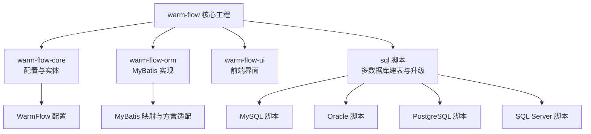
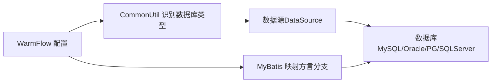

# 备份与恢复

<cite>
**本文引用的文件**
- [README.md](file://README.md)
- [warm-flow-all.sql](file://sql/mysql/warm-flow-all.sql)
- [oracle-wram-flow-all.sql](file://sql/oracle/oracle-wram-flow-all.sql)
- [postgresql-warm-flow-all.sql](file://sql/postgresql/postgresql-warm-flow-all.sql)
- [sqlserver.sql](file://sql/sqlserver/sqlserver.sql)
- [CommonUtil.java](file://warm-flow-orm/warm-flow-mybatis/warm-flow-mybatis-core/src/main/java/org/dromara/warm/flow/orm/utils/CommonUtil.java)
- [WarmFlow.java](file://warm-flow-core/src/main/java/org/dromara/warm/flow/core/config/WarmFlow.java)
- [FlowDefinitionMapper.xml](file://warm-flow-orm/warm-flow-mybatis/warm-flow-mybatis-core/src/main/resources/warm/flow/FlowDefinitionMapper.xml)
- [warm-flow_1.2.0.sql](file://sql/mysql/v1-upgrade/warm-flow_1.2.0.sql)
- [warm-flow_1.3.7.sql](file://sql/mysql/v1-upgrade/warm-flow_1.3.7.sql)
</cite>

## 目录
1. [简介](#简介)
2. [项目结构](#项目结构)
3. [核心组件](#核心组件)
4. [架构总览](#架构总览)
5. [详细组件分析](#详细组件分析)
6. [依赖关系分析](#依赖关系分析)
7. [性能考量](#性能考量)
8. [故障排查指南](#故障排查指南)
9. [结论](#结论)
10. [附录](#附录)

## 简介
本指南面向 Warm-Flow 工作流引擎的数据库备份与恢复运维实践，结合仓库内提供的多数据库脚本与运行时配置能力，给出可落地的备份策略设计、不同数据库平台的备份命令与脚本示例、恢复流程规范、备份数据管理与验证测试方法，并补充监控与告警建议。Warm-Flow 支持 MySQL、Oracle、PostgreSQL、SQL Server 等主流数据库，且通过运行时识别数据库类型以适配不同方言。

## 项目结构
仓库中与数据库备份直接相关的关键内容分布如下：
- 多数据库初始化与升级脚本位于 sql 目录，覆盖 MySQL、Oracle、PostgreSQL、SQL Server 的建表与索引定义
- 运行时根据数据源自动识别数据库类型，确保 SQL 方言适配
- 配置类提供数据源类型注入入口，便于统一管理



**图表来源**
- [README.md](file://README.md)
- [warm-flow-all.sql](file://sql/mysql/warm-flow-all.sql)
- [oracle-wram-flow-all.sql](file://sql/oracle/oracle-wram-flow-all.sql)
- [postgresql-warm-flow-all.sql](file://sql/postgresql/postgresql-warm-flow-all.sql)
- [sqlserver.sql](file://sql/sqlserver/sqlserver.sql)
- [CommonUtil.java](file://warm-flow-orm/warm-flow-mybatis/warm-flow-mybatis-core/src/main/java/org/dromara/warm/flow/orm/utils/CommonUtil.java)
- [WarmFlow.java](file://warm-flow-core/src/main/java/org/dromara/warm/flow/core/config/WarmFlow.java)

**章节来源**
- [README.md](file://README.md)
- [warm-flow-all.sql](file://sql/mysql/warm-flow-all.sql)
- [oracle-wram-flow-all.sql](file://sql/oracle/oracle-wram-flow-all.sql)
- [postgresql-warm-flow-all.sql](file://sql/postgresql/postgresql-warm-flow-all.sql)
- [sqlserver.sql](file://sql/sqlserver/sqlserver.sql)

## 核心组件
- 数据库脚本与表结构
  - MySQL、Oracle、PostgreSQL、SQL Server 的全量初始化脚本，包含 flow_definition、flow_node、flow_skip、flow_instance、flow_task、flow_his_task、flow_user 等核心表
- 运行时数据库类型识别
  - 通过读取 JDBC 元数据获取数据库产品名，兜底为 MySQL，确保方言适配
- 配置入口
  - WarmFlow 配置类提供 dataSourceType 注入点，便于显式指定或覆盖自动识别结果

**章节来源**
- [warm-flow-all.sql](file://sql/mysql/warm-flow-all.sql)
- [oracle-wram-flow-all.sql](file://sql/oracle/oracle-wram-flow-all.sql)
- [postgresql-warm-flow-all.sql](file://sql/postgresql/postgresql-warm-flow-all.sql)
- [sqlserver.sql](file://sql/sqlserver/sqlserver.sql)
- [CommonUtil.java](file://warm-flow-orm/warm-flow-mybatis/warm-flow-mybatis-core/src/main/java/org/dromara/warm/flow/orm/utils/CommonUtil.java)
- [WarmFlow.java](file://warm-flow-core/src/main/java/org/dromara/warm/flow/core/config/WarmFlow.java)

## 架构总览
下图展示备份与恢复在 Warm-Flow 中的总体流程：应用层通过 ORM 访问数据库；备份侧从数据库导出结构与数据；恢复侧将备份导入数据库；验证侧通过查询与一致性检查确认有效性。

```mermaid
graph TB
subgraph "应用层"
APP["Warm-Flow 应用"]
ORM["ORM 层MyBatis"]
end
subgraph "数据库层"
DB["目标数据库MySQL/Oracle/PG/SQLServer"]
end
subgraph "备份与恢复"
BK["备份工具/脚本"]
RS["恢复工具/脚本"]
VT["验证与测试"]
end
APP --> ORM --> DB
DB <- --> BK
DB <- --> RS
BK --> VT
RS --> VT
```

[本图为概念性架构示意，不直接映射具体源码文件，故无“图表来源”]

## 详细组件分析

### 备份策略设计
- 全量备份
  - 适用场景：首次部署、重大升级前、灾备演练
  - 执行要点：导出完整结构与数据，包含索引、约束、序列（Oracle）、扩展属性（SQL Server）
- 增量备份
  - 适用场景：生产高频更新、缩短 RTO
  - 执行要点：基于数据库日志或二进制日志，按时间窗口提取变更；需配合校验与一致性检查
- 差异备份
  - 适用场景：周期性基线 + 小量差异，兼顾速度与空间
  - 执行要点：以最近一次全量为基线，导出差异数据；恢复时需先应用全量再应用差异

[本节为通用策略说明，不直接分析具体文件，故无“章节来源”]

### 不同数据库平台的备份命令与脚本示例

- MySQL
  - 全量备份（mysqldump）
    - 命令示例：mysqldump -u 用户 -p 密码 --single-transaction --routines --triggers --set-gtid-purged=OFF warm_db > backup_$(date +%Y%m%d_%H%M%S).sql
    - 说明：使用单事务保证一致性；导出存储过程、触发器；关闭 GTID 以避免兼容性问题
  - 恢复
    - 命令示例：mysql -u 用户 -p 密码 warm_db < backup_YYYYMMDD_HHMMSS.sql
  - 参考脚本
    - 初始化脚本：[warm-flow-all.sql](file://sql/mysql/warm-flow-all.sql)
    - 升级脚本示例：[warm-flow_1.2.0.sql](file://sql/mysql/v1-upgrade/warm-flow_1.2.0.sql)、[warm-flow_1.3.7.sql](file://sql/mysql/v1-upgrade/warm-flow_1.3.7.sql)

- Oracle
  - 全量备份（expdp）
    - 示例：expdp 用户/密码@SID DIRECTORY=DATA_PUMP_DIR DUMPFILE=wf_%U.dmp SCHEMAS=warm_schema
  - 恢复（impdp）
    - 示例：impdp 用户/密码@SID DIRECTORY=DATA_PUMP_DIR DUMPFILE=wf_%U.dmp SCHEMAS=warm_schema
  - 参考脚本
    - 初始化脚本：[oracle-wram-flow-all.sql](file://sql/oracle/oracle-wram-flow-all.sql)

- PostgreSQL
  - 全量备份（pg_dump）
    - 示例：pg_dump -h 主机 -p 端口 -U 用户 -d 数据库 -v -f backup_$(date +%Y%m%d_%H%M%S).sql
  - 恢复
    - 示例：psql -h 主机 -p 端口 -U 用户 -d 数据库 -f backup_YYYYMMDD_HHMMSS.sql
  - 参考脚本
    - 初始化脚本：[postgresql-warm-flow-all.sql](file://sql/postgresql/postgresql-warm-flow-all.sql)

- SQL Server
  - 全量备份（SQL 语句）
    - 示例：BACKUP DATABASE [warm_db] TO DISK = N'\\backup_share\warm_full.bak' WITH FORMAT, INIT, NAME = 'warm_full'
  - 恢复
    - 示例：RESTORE DATABASE [warm_db] FROM DISK = N'\\backup_share\warm_full.bak' WITH REPLACE
  - 参考脚本
    - 初始化脚本：[sqlserver.sql](file://sql/sqlserver/sqlserver.sql)

**章节来源**
- [warm-flow-all.sql](file://sql/mysql/warm-flow-all.sql)
- [oracle-wram-flow-all.sql](file://sql/oracle/oracle-wram-flow-all.sql)
- [postgresql-warm-flow-all.sql](file://sql/postgresql/postgresql-warm-flow-all.sql)
- [sqlserver.sql](file://sql/sqlserver/sqlserver.sql)
- [warm-flow_1.2.0.sql](file://sql/mysql/v1-upgrade/warm-flow_1.2.0.sql)
- [warm-flow_1.3.7.sql](file://sql/mysql/v1-upgrade/warm-flow_1.3.7.sql)

### 恢复流程规范
- 完全恢复
  - 步骤：停止应用 → 导入全量备份 → 启动应用 → 校验关键表数据完整性
- 时间点恢复（TAR）
  - 步骤：定位日志/增量备份 → 应用全量 → 应用增量至目标时间点 → 启动应用
- 部分恢复
  - 场景：仅恢复特定业务表或租户数据
  - 步骤：隔离目标对象 → 选择性导入 → 校验业务一致性

[本节为通用流程说明，不直接分析具体文件，故无“章节来源”]

### 备份数据的存储与管理
- 文件命名规范
  - 规范：数据库名_类型_日期时间_序号.sql 或 .bak/.dmp
  - 示例：warm_mysql_full_20250401_103000_001.sql
- 存储位置
  - 建议：本地快照 + 远程对象存储（如 OSS/COS/S3），并设置生命周期策略
- 保留周期
  - 建议：全量备份保留 30-90 天，增量/差异保留 7-30 天，过期自动清理
- 版本与升级
  - 升级脚本与初始化脚本分离，便于按版本演进与回滚

**章节来源**
- [warm-flow-all.sql](file://sql/mysql/warm-flow-all.sql)
- [oracle-wram-flow-all.sql](file://sql/oracle/oracle-wram-flow-all.sql)
- [postgresql-warm-flow-all.sql](file://sql/postgresql/postgresql-warm-flow-all.sql)
- [sqlserver.sql](file://sql/sqlserver/sqlserver.sql)

### 备份验证与恢复测试
- 结构一致性
  - 对比表数量、列定义、索引、约束与注释
- 数据一致性
  - 关键表抽样核对：flow_definition、flow_instance、flow_task、flow_his_task、flow_user
- 恢复测试
  - 在测试环境执行恢复 → 启动 Warm-Flow → 执行基础流程用例（发起、审批、退回、完成）
- 自动化验证
  - 编写 SQL 查询与业务脚本，定期自动化执行

[本节为通用验证方法说明，不直接分析具体文件，故无“章节来源”]

### 监控与告警
- 备份监控
  - 监控项：备份任务状态、耗时、大小、失败次数、存储容量
  - 告警阈值：失败率>0%、耗时超阈、存储不足
- 恢复监控
  - 监控项：恢复耗时、应用启动时间、关键接口延迟
  - 告警阈值：恢复超时、应用启动失败、接口异常

[本节为通用监控建议说明，不直接分析具体文件，故无“章节来源”]

## 依赖关系分析
Warm-Flow 在运行时通过 JDBC 元数据识别数据库类型，确保 ORM 方言适配正确；同时提供配置入口以覆盖自动识别结果。多数据库脚本在仓库中分别提供，便于按平台选择合适的备份/恢复工具。



**图表来源**
- [CommonUtil.java](file://warm-flow-orm/warm-flow-mybatis/warm-flow-mybatis-core/src/main/java/org/dromara/warm/flow/orm/utils/CommonUtil.java)
- [WarmFlow.java](file://warm-flow-core/src/main/java/org/dromara/warm/flow/core/config/WarmFlow.java)
- [FlowDefinitionMapper.xml](file://warm-flow-orm/warm-flow-mybatis/warm-flow-mybatis-core/src/main/resources/warm/flow/FlowDefinitionMapper.xml)

**章节来源**
- [CommonUtil.java](file://warm-flow-orm/warm-flow-mybatis/warm-flow-mybatis-core/src/main/java/org/dromara/warm/flow/orm/utils/CommonUtil.java)
- [WarmFlow.java](file://warm-flow-core/src/main/java/org/dromara/warm/flow/core/config/WarmFlow.java)
- [FlowDefinitionMapper.xml](file://warm-flow-orm/warm-flow-mybatis/warm-flow-mybatis-core/src/main/resources/warm/flow/FlowDefinitionMapper.xml)

## 性能考量
- 备份窗口
  - 选择业务低峰时段执行全量备份；增量备份采用日志轮转策略
- 并行与压缩
  - 多文件并行导出与压缩，缩短备份时间
- 恢复效率
  - 分离日志文件、禁用约束导入后再启用、批量插入优化

[本节为通用性能建议说明，不直接分析具体文件，故无“章节来源”]

## 故障排查指南
- 备份失败
  - 检查数据库连接、权限、磁盘空间；查看备份工具日志
- 恢复异常
  - 核对备份文件完整性；确认数据库版本兼容；检查字符集与排序规则
- ORM 方言错误
  - 确认 WarmFlow.dataSourceType 配置；检查 MyBatis 映射是否包含对应数据库分支

**章节来源**
- [CommonUtil.java](file://warm-flow-orm/warm-flow-mybatis/warm-flow-mybatis-core/src/main/java/org/dromara/warm/flow/orm/utils/CommonUtil.java)
- [WarmFlow.java](file://warm-flow-core/src/main/java/org/dromara/warm/flow/core/config/WarmFlow.java)
- [FlowDefinitionMapper.xml](file://warm-flow-orm/warm-flow-mybatis/warm-flow-mybatis-core/src/main/resources/warm/flow/FlowDefinitionMapper.xml)

## 结论
通过仓库内的多数据库脚本与运行时数据库类型识别能力，Warm-Flow 能够在不同数据库平台上稳定运行。结合本文给出的备份策略、命令示例、恢复流程与验证方法，可构建完善的数据库备份与恢复体系，保障业务连续性与数据安全。

## 附录
- 快速对照
  - MySQL 初始化脚本：[warm-flow-all.sql](file://sql/mysql/warm-flow-all.sql)
  - Oracle 初始化脚本：[oracle-wram-flow-all.sql](file://sql/oracle/oracle-wram-flow-all.sql)
  - PostgreSQL 初始化脚本：[postgresql-warm-flow-all.sql](file://sql/postgresql/postgresql-warm-flow-all.sql)
  - SQL Server 初始化脚本：[sqlserver.sql](file://sql/sqlserver/sqlserver.sql)
  - 运行时数据库类型识别：[CommonUtil.java](file://warm-flow-orm/warm-flow-mybatis/warm-flow-mybatis-core/src/main/java/org/dromara/warm/flow/orm/utils/CommonUtil.java)
  - 配置入口：[WarmFlow.java](file://warm-flow-core/src/main/java/org/dromara/warm/flow/core/config/WarmFlow.java)
  - MyBatis 方言分支：[FlowDefinitionMapper.xml](file://warm-flow-orm/warm-flow-mybatis/warm-flow-mybatis-core/src/main/resources/warm/flow/FlowDefinitionMapper.xml)