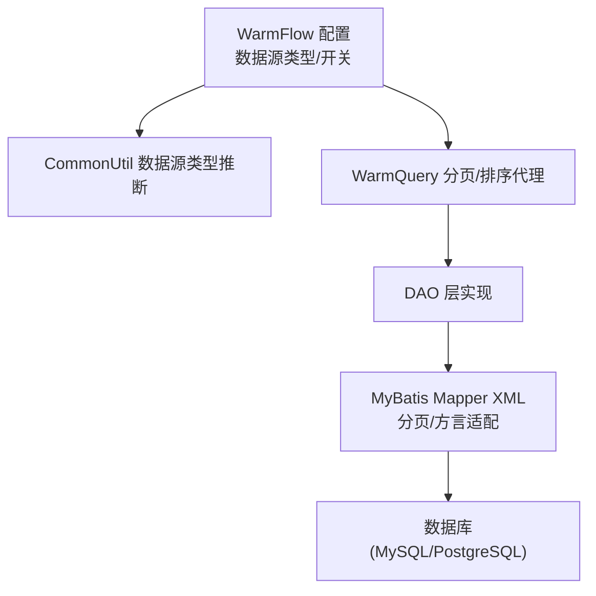
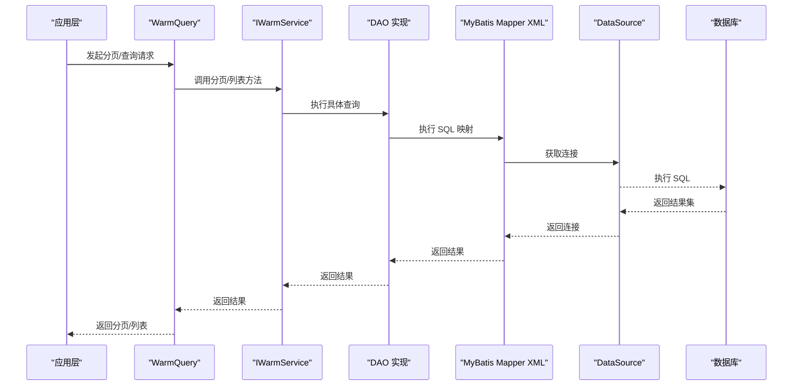
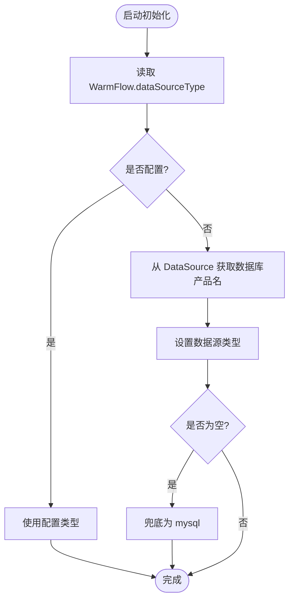
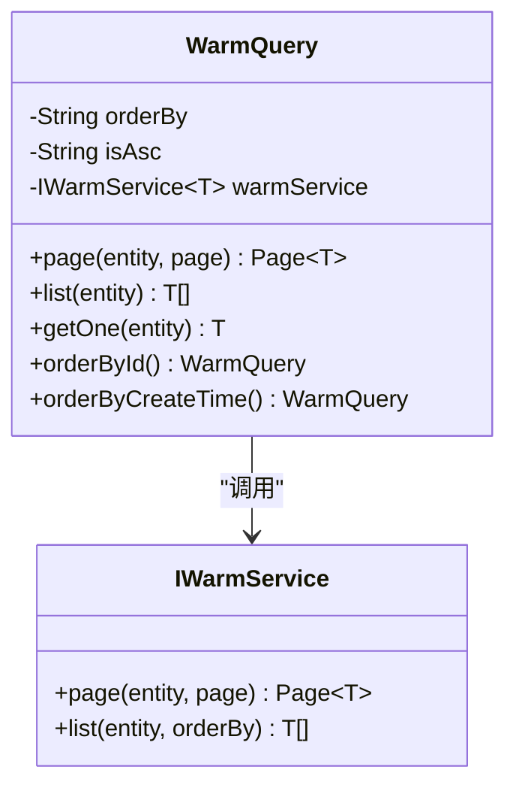
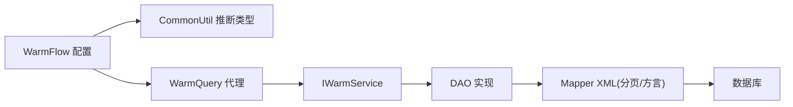

# 性能监控

<cite>
**本文引用的文件**
- [WarmFlow.java](file://warm-flow-core/src/main/java/org/dromara/warm/flow/core/config/WarmFlow.java)
- [CommonUtil.java](file://warm-flow-orm/warm-flow-mybatis/warm-flow-mybatis-core/src/main/java/org/dromara/warm/flow/orm/utils/CommonUtil.java)
- [WarmQuery.java](file://warm-flow-core/src/main/java/org/dromara/warm/flow/core/orm/agent/WarmQuery.java)
- [SqlHelper.java](file://warm-flow-core/src/main/java/org/dromara/warm/flow/core/utils/SqlHelper.java)
- [FlowInstance.java](file://warm-flow-orm/warm-flow-mybatis/warm-flow-mybatis-core/src/main/java/org/dromara/warm/flow/orm/entity/FlowInstance.java)
- [FlowSkipMapper.xml](file://warm-flow-orm/warm-flow-mybatis/warm-flow-mybatis-core/src/main/resources/warm/flow/FlowSkipMapper.xml)
- [warm-flow_1.7.0.sql](file://sql/mysql/v1-upgrade/warm-flow_1.7.0.sql)
- [postgresql-warm-flow-all.sql](file://sql/postgresql/postgresql-warm-flow-all.sql)
- [warm-flow_1.3.5.sql](file://sql/mysql/v1-upgrade/warm-flow_1.3.5.sql)
</cite>

## 目录
1. [简介](#简介)
2. [项目结构](#项目结构)
3. [核心组件](#核心组件)
4. [架构总览](#架构总览)
5. [详细组件分析](#详细组件分析)
6. [依赖关系分析](#依赖关系分析)
7. [性能考量](#性能考量)
8. [故障排查指南](#故障排查指南)
9. [结论](#结论)
10. [附录](#附录)

## 简介
本指南面向 Warm-Flow 的数据库性能监控与优化，聚焦以下目标：
- 关键性能指标监控：连接数、查询响应时间、锁等待、缓冲池使用率等
- 诊断工具与方法：慢查询日志分析、执行计划分析、索引使用检查
- 优化策略：索引优化、SQL 优化、连接池与内存配置调优
- 告警体系：阈值设定、规则设计、通知机制
- 实战案例：常见瓶颈识别与解决步骤
- 基准测试与容量规划：评估与扩容建议

说明：Warm-Flow 支持多 ORM 扩展与多数据库类型，本文以 MyBatis 与多数据库适配能力为基础，结合项目中的分页与数据源类型推断逻辑，给出通用的监控与优化建议。

## 项目结构
Warm-Flow 的数据库相关能力主要分布在以下模块：
- 核心配置与初始化：WarmFlow 配置项、数据源类型推断
- ORM 层适配：MyBatis XML 映射、分页方言适配
- 查询代理与工具：WarmQuery 分页排序、SqlHelper 结果判断
- 数据库脚本：MySQL/PostgreSQL DDL 与版本升级脚本

图表来源
- [WarmFlow.java:93-98](file://warm-flow-core/src/main/java/org/dromara/warm/flow/core/config/WarmFlow.java#L93-L98)
- [CommonUtil.java:34-60](file://warm-flow-orm/warm-flow-mybatis/warm-flow-mybatis-core/src/main/java/org/dromara/warm/flow/orm/utils/CommonUtil.java#L34-L60)
- [WarmQuery.java:34-103](file://warm-flow-core/src/main/java/org/dromara/warm/flow/core/orm/agent/WarmQuery.java#L34-L103)
- [FlowSkipMapper.xml:87-103](file://warm-flow-orm/warm-flow-mybatis/warm-flow-mybatis-core/src/main/resources/warm/flow/FlowSkipMapper.xml#L87-L103)

章节来源
- [WarmFlow.java:93-98](file://warm-flow-core/src/main/java/org/dromara/warm/flow/core/config/WarmFlow.java#L93-L98)
- [CommonUtil.java:34-60](file://warm-flow-orm/warm-flow-mybatis/warm-flow-mybatis-core/src/main/java/org/dromara/warm/flow/orm/utils/CommonUtil.java#L34-L60)
- [WarmQuery.java:34-103](file://warm-flow-core/src/main/java/org/dromara/warm/flow/core/orm/agent/WarmQuery.java#L34-L103)
- [FlowSkipMapper.xml:87-103](file://warm-flow-orm/warm-flow-mybatis/warm-flow-mybatis-core/src/main/resources/warm/flow/FlowSkipMapper.xml#L87-L103)

## 核心组件
- 数据源类型推断：当未显式配置数据源类型时，框架会从 DataSource 获取数据库产品名作为兜底类型，确保分页与方言适配正确。
- 分页与排序代理：WarmQuery 提供统一的分页与排序入口，简化服务层调用。
- SQL 工具：SqlHelper 提供布尔判断与计数返回的辅助方法，便于结果判定。
- 多数据库方言：Mapper XML 中根据数据源类型选择 Oracle 或 MySQL/其他数据库的分页写法。

章节来源
- [CommonUtil.java:34-60](file://warm-flow-orm/warm-flow-mybatis/warm-flow-mybatis-core/src/main/java/org/dromara/warm/flow/orm/utils/CommonUtil.java#L34-L60)
- [WarmQuery.java:61-87](file://warm-flow-core/src/main/java/org/dromara/warm/flow/core/orm/agent/WarmQuery.java#L61-L87)
- [SqlHelper.java:33-55](file://warm-flow-core/src/main/java/org/dromara/warm/flow/core/utils/SqlHelper.java#L33-L55)
- [FlowSkipMapper.xml:87-103](file://warm-flow-orm/warm-flow-mybatis/warm-flow-mybatis-core/src/main/resources/warm/flow/FlowSkipMapper.xml#L87-L103)

## 架构总览
下图展示从应用到数据库的关键链路，以及与监控相关的关注点：

图表来源
- [WarmQuery.java:61-87](file://warm-flow-core/src/main/java/org/dromara/warm/flow/core/orm/agent/WarmQuery.java#L61-L87)
- [FlowSkipMapper.xml:87-103](file://warm-flow-orm/warm-flow-mybatis/warm-flow-mybatis-core/src/main/resources/warm/flow/FlowSkipMapper.xml#L87-L103)

## 详细组件分析

### 数据源类型推断与分页适配
- WarmFlow 配置项支持显式指定数据源类型；若未配置，CommonUtil 将尝试从 DataSource 获取数据库产品名，并设置兜底类型为 MySQL。
- MyBatis Mapper XML 中根据数据源类型选择 Oracle 或 MySQL/其他数据库的分页写法，避免跨库分页语法不一致导致的性能问题。

图表来源
- [WarmFlow.java:93-98](file://warm-flow-core/src/main/java/org/dromara/warm/flow/core/config/WarmFlow.java#L93-L98)
- [CommonUtil.java:34-60](file://warm-flow-orm/warm-flow-mybatis/warm-flow-mybatis-core/src/main/java/org/dromara/warm/flow/orm/utils/CommonUtil.java#L34-L60)

章节来源
- [WarmFlow.java:93-98](file://warm-flow-core/src/main/java/org/dromara/warm/flow/core/config/WarmFlow.java#L93-L98)
- [CommonUtil.java:34-60](file://warm-flow-orm/warm-flow-mybatis/warm-flow-mybatis-core/src/main/java/org/dromara/warm/flow/orm/utils/CommonUtil.java#L34-L60)
- [FlowSkipMapper.xml:87-103](file://warm-flow-orm/warm-flow-mybatis/warm-flow-mybatis-core/src/main/resources/warm/flow/FlowSkipMapper.xml#L87-L103)

### 分页与排序代理（WarmQuery）
- WarmQuery 提供 page/list/getOne/orderById/orderByCreateTime 等便捷方法，统一排序与分页入口，减少重复代码与错误。
- 分页参数由 Page 对象承载，WarmQuery 在调用服务层前注入排序字段与方向。

图表来源
- [WarmQuery.java:34-103](file://warm-flow-core/src/main/java/org/dromara/warm/flow/core/orm/agent/WarmQuery.java#L34-L103)

章节来源
- [WarmQuery.java:61-87](file://warm-flow-core/src/main/java/org/dromara/warm/flow/core/orm/agent/WarmQuery.java#L61-L87)

### SQL 结果辅助（SqlHelper）
- 提供 retBool 与 retCount 等静态方法，用于统一判断操作是否成功与统计结果，便于上层逻辑处理与监控埋点。

章节来源
- [SqlHelper.java:33-55](file://warm-flow-core/src/main/java/org/dromara/warm/flow/core/utils/SqlHelper.java#L33-L55)

### 实体与状态字段（FlowInstance）
- FlowInstance 包含流程状态字段 flow_status，配合数据库脚本可追踪流程生命周期关键节点的性能表现。

章节来源
- [FlowInstance.java:104-111](file://warm-flow-orm/warm-flow-mybatis/warm-flow-mybatis-core/src/main/java/org/dromara/warm/flow/orm/entity/FlowInstance.java#L104-L111)
- [warm-flow_1.7.0.sql:1-11](file://sql/mysql/v1-upgrade/warm-flow_1.7.0.sql#L1-L11)
- [postgresql-warm-flow-all.sql:149-170](file://sql/postgresql/postgresql-warm-flow-all.sql#L149-L170)

## 依赖关系分析
- WarmFlow 配置项驱动数据源类型推断，CommonUtil 保证分页与方言适配一致性。
- WarmQuery 通过 IWarmService 抽象屏蔽具体 DAO 实现，便于在不同 ORM 扩展间切换。
- MyBatis Mapper XML 根据数据源类型选择分页写法，降低跨库兼容成本。

图表来源
- [WarmFlow.java:93-98](file://warm-flow-core/src/main/java/org/dromara/warm/flow/core/config/WarmFlow.java#L93-L98)
- [CommonUtil.java:34-60](file://warm-flow-orm/warm-flow-mybatis/warm-flow-mybatis-core/src/main/java/org/dromara/warm/flow/orm/utils/CommonUtil.java#L34-L60)
- [WarmQuery.java:34-103](file://warm-flow-core/src/main/java/org/dromara/warm/flow/core/orm/agent/WarmQuery.java#L34-L103)
- [FlowSkipMapper.xml:87-103](file://warm-flow-orm/warm-flow-mybatis/warm-flow-mybatis-core/src/main/resources/warm/flow/FlowSkipMapper.xml#L87-L103)

章节来源
- [WarmFlow.java:93-98](file://warm-flow-core/src/main/java/org/dromara/warm/flow/core/config/WarmFlow.java#L93-L98)
- [CommonUtil.java:34-60](file://warm-flow-orm/warm-flow-mybatis/warm-flow-mybatis-core/src/main/java/org/dromara/warm/flow/orm/utils/CommonUtil.java#L34-L60)
- [WarmQuery.java:34-103](file://warm-flow-core/src/main/java/org/dromara/warm/flow/core/orm/agent/WarmQuery.java#L34-L103)
- [FlowSkipMapper.xml:87-103](file://warm-flow-orm/warm-flow-mybatis/warm-flow-mybatis-core/src/main/resources/warm/flow/FlowSkipMapper.xml#L87-L103)

## 性能考量
- 连接数监控
  - 关注连接池活跃连接数与最大连接数，避免连接泄漏与超限。
  - 结合 WarmQuery 的分页与排序，减少一次性大结果集拉取，降低连接占用时间。
- 查询响应时间
  - 使用 WarmQuery 统一分页与排序，避免全表扫描；必要时引入索引覆盖。
- 锁等待
  - 避免长事务与热点更新；对高并发写入场景，考虑分片或异步化。
- 缓冲池使用率
  - 针对 InnoDB 缓冲池命中率与页读写比进行观测，结合 SQL 计划与索引策略优化。

## 故障排查指南
- 慢查询定位
  - 通过数据库慢查询日志识别耗时 SQL；结合执行计划分析索引使用情况与扫描范围。
- 执行计划分析
  - 关注全表扫描、回表次数、临时表与排序开销；优先补充缺失索引或调整查询条件。
- 索引使用检查
  - 检查 WHERE、JOIN、ORDER BY 字段是否命中索引；避免函数作用于列导致索引失效。
- 版本升级与兼容性
  - MySQL 升级脚本中新增/修改了流程状态字段，需确认索引与查询路径是否随之调整。
  - PostgreSQL DDL 注释与字段类型与 MySQL 存在差异，需分别核验索引与查询计划。

章节来源
- [warm-flow_1.7.0.sql:1-11](file://sql/mysql/v1-upgrade/warm-flow_1.7.0.sql#L1-L11)
- [postgresql-warm-flow-all.sql:149-170](file://sql/postgresql/postgresql-warm-flow-all.sql#L149-L170)

## 结论
通过对 Warm-Flow 的数据源类型推断、分页与排序代理、SQL 结果辅助以及多数据库方言适配的梳理，可以建立一套覆盖连接数、响应时间、锁等待与缓冲池使用率的监控体系。结合慢查询日志、执行计划与索引检查，能够有效定位瓶颈并实施针对性优化。同时，版本升级脚本与数据库 DDL 的差异提醒我们需按数据库类型分别验证与优化。

## 附录

### 关键性能指标监控清单
- 连接数：活跃连接数、排队等待数、最大连接数
- 响应时间：P50/P95/P99 查询耗时
- 锁等待：锁等待时间、死锁次数
- 缓冲池：InnoDB 缓冲池命中率、页读写比
- 表扫描：全表扫描次数、回表次数

### 诊断工具与方法
- 慢查询日志：启用并定期分析，定位热点 SQL
- 执行计划：EXPLAIN/EXPLAIN ANALYZE 分析索引与扫描
- 索引检查：确认 WHERE/JOIN/OBY 字段索引覆盖
- 连接池监控：观察连接池队列长度与超时

### 优化策略
- 索引优化：补充缺失索引、合并冗余索引、避免函数作用于列
- 查询优化：改写复杂子查询、拆分大事务、减少不必要的排序与去重
- 连接池调优：合理设置最大连接数、空闲回收、超时阈值
- 内存配置：增大缓冲池、调整排序与临时表内存上限

### 告警体系
- 阈值设置：连接池等待超时、慢查询阈值、缓冲池命中率下限
- 规则设计：连续 N 分钟超过阈值触发告警
- 通知机制：邮件/IM/短信联动，分级处理

### 实战案例
- 案例一：分页查询慢
  - 现象：分页接口 P95 超过 2s
  - 排查：发现 ORDER BY 未命中索引且存在隐式函数
  - 处理：新增复合索引，移除函数作用域
- 案例二：连接池排队严重
  - 现象：连接池排队长度持续增长
  - 排查：存在长事务与未释放连接
  - 处理：缩短事务、增加连接池大小、完善连接回收

### 基准测试与容量规划
- 基准测试：固定并发与数据规模，测量吞吐与延迟
- 容量规划：基于峰值 QPS 与 RT，预留 20%-30% 安全余量，结合缓存与读写分离