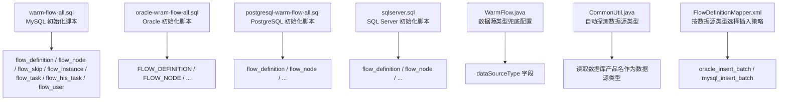
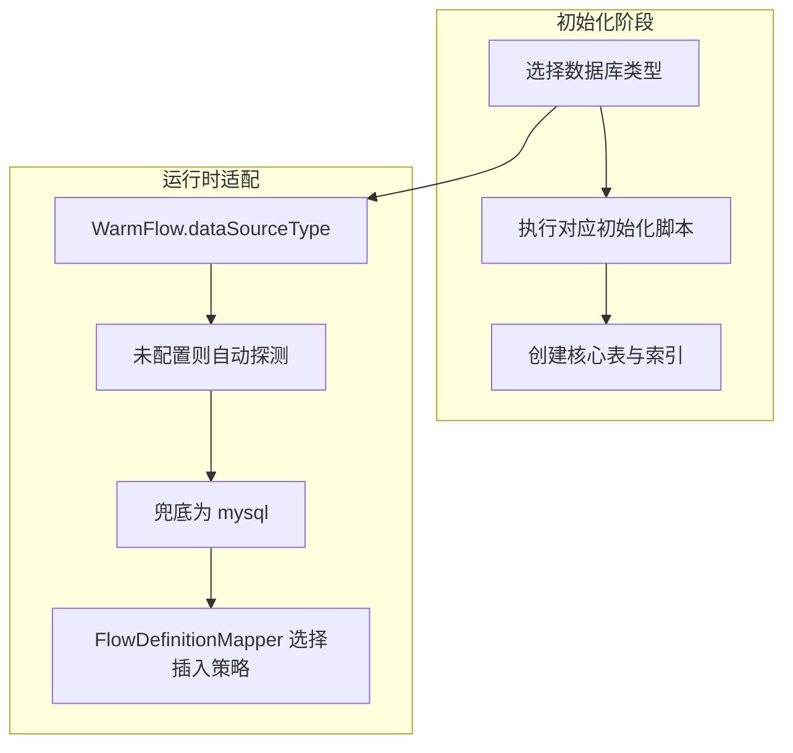
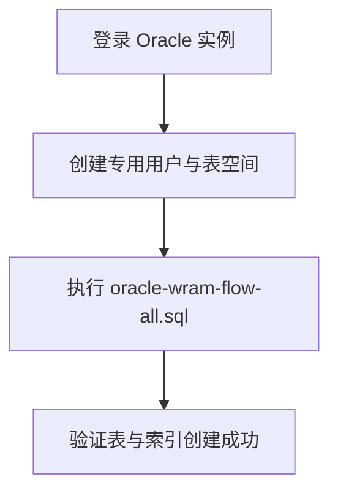
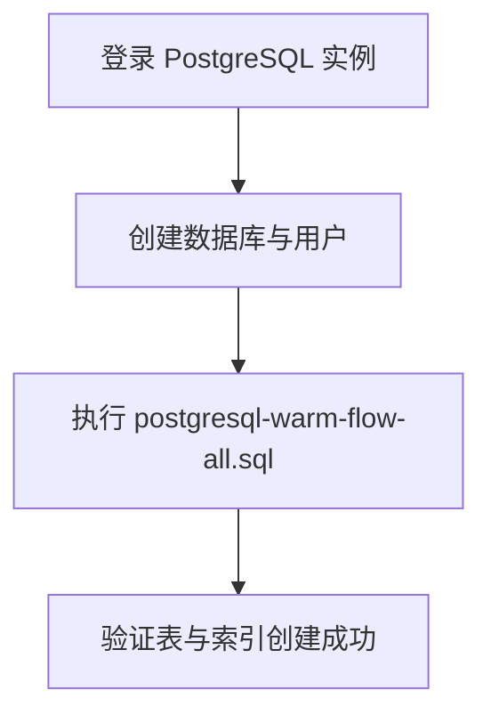
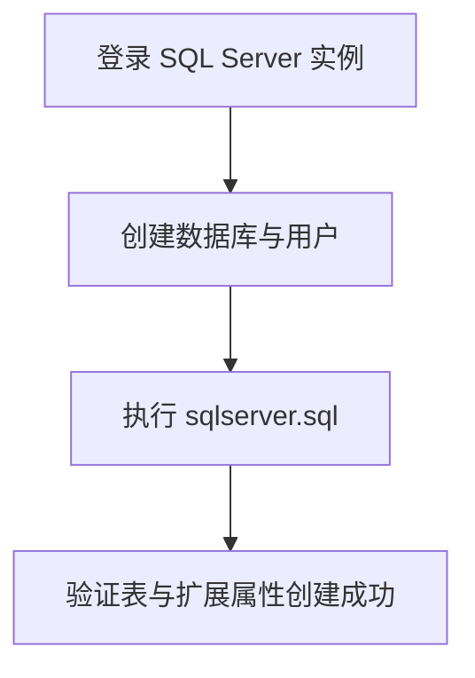
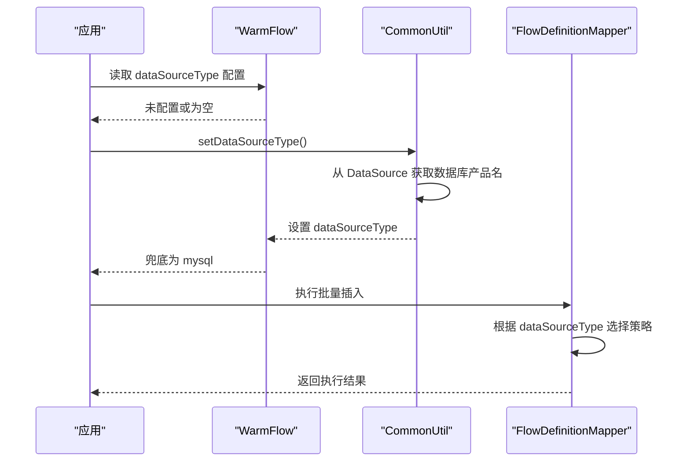
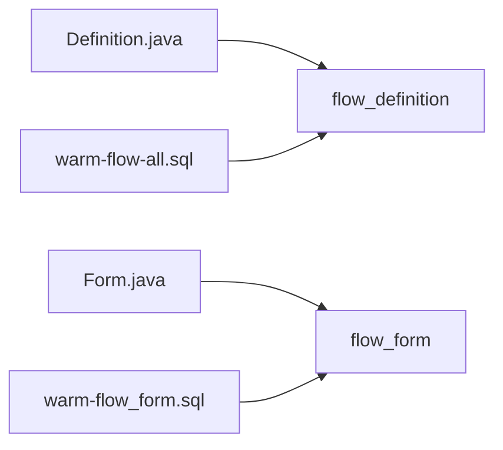

# 数据库初始化

<cite>
**本文引用的文件**   
- [warm-flow-all.sql](file://sql/mysql/warm-flow-all.sql)
- [oracle-wram-flow-all.sql](file://sql/oracle/oracle-wram-flow-all.sql)
- [postgresql-warm-flow-all.sql](file://sql/postgresql/postgresql-warm-flow-all.sql)
- [sqlserver.sql](file://sql/sqlserver/sqlserver.sql)
- [WarmFlow.java](file://warm-flow-core/src/main/java/org/dromara/warm/flow/core/config/WarmFlow.java)
- [CommonUtil.java](file://warm-flow-orm/warm-flow-mybatis/warm-flow-mybatis-core/src/main/java/org/dromara/warm/flow/orm/utils/CommonUtil.java)
- [FlowDefinitionMapper.xml](file://warm-flow-orm/warm-flow-mybatis/warm-flow-mybatis-core/src/main/resources/warm/flow/FlowDefinitionMapper.xml)
- [warm-flow_1.8.4.sql](file://sql/mysql/v1-upgrade/warm-flow_1.8.4.sql)
- [warm-flow_form.sql](file://sql/mysql/v1-upgrade/warm-flow_form.sql)
- [Definition.java](file://warm-flow-core/src/main/java/org/dromara/warm/flow/core/entity/Definition.java)
- [Form.java](file://warm-flow-core/src/main/java/org/dromara/warm/flow/core/entity/Form.java)
</cite>

## 目录
1. [简介](#简介)
2. [项目结构](#项目结构)
3. [核心组件](#核心组件)
4. [架构总览](#架构总览)
5. [详细组件分析](#详细组件分析)
6. [依赖关系分析](#依赖关系分析)
7. [性能考虑](#性能考虑)
8. [故障排查指南](#故障排查指南)
9. [结论](#结论)
10. [附录](#附录)

## 简介
本指南面向 Warm-Flow 的数据库初始化与部署，覆盖多数据库支持（MySQL 8.0+、Oracle 12c+、PostgreSQL 12+、SQL Server 2016+），提供环境准备、实例与字符集配置、用户权限与安全加固、表结构初始化顺序与注意事项、以及连接配置要点（连接串、连接池与超时）。文档严格基于仓库内 SQL 脚本与核心配置文件进行说明，确保可操作性与准确性。

## 项目结构
Warm-Flow 提供多数据库的初始化脚本与核心配置，关键位置如下：
- 多数据库初始化脚本位于 sql 目录，按数据库类型拆分
- 核心配置类用于识别数据源类型与兜底策略
- ORM 层在映射文件中根据数据源类型选择不同插入策略

**图表来源**
- [warm-flow-all.sql:1-160](file://sql/mysql/warm-flow-all.sql#L1-L160)
- [oracle-wram-flow-all.sql:1-311](file://sql/oracle/oracle-wram-flow-all.sql#L1-L311)
- [postgresql-warm-flow-all.sql:1-296](file://sql/postgresql/postgresql-warm-flow-all.sql#L1-L296)
- [sqlserver.sql:1-800](file://sql/sqlserver/sqlserver.sql#L1-L800)
- [WarmFlow.java:94-98](file://warm-flow-core/src/main/java/org/dromara/warm/flow/core/config/WarmFlow.java#L94-L98)
- [CommonUtil.java:34-60](file://warm-flow-orm/warm-flow-mybatis/warm-flow-mybatis-core/src/main/java/org/dromara/warm/flow/orm/utils/CommonUtil.java#L34-L60)
- [FlowDefinitionMapper.xml:417-426](file://warm-flow-orm/warm-flow-mybatis/warm-flow-mybatis-core/src/main/resources/warm/flow/FlowDefinitionMapper.xml#L417-L426)

**章节来源**
- [warm-flow-all.sql:1-160](file://sql/mysql/warm-flow-all.sql#L1-L160)
- [oracle-wram-flow-all.sql:1-311](file://sql/oracle/oracle-wram-flow-all.sql#L1-L311)
- [postgresql-warm-flow-all.sql:1-296](file://sql/postgresql/postgresql-warm-flow-all.sql#L1-L296)
- [sqlserver.sql:1-800](file://sql/sqlserver/sqlserver.sql#L1-L800)
- [WarmFlow.java:94-98](file://warm-flow-core/src/main/java/org/dromara/warm/flow/core/config/WarmFlow.java#L94-L98)
- [CommonUtil.java:34-60](file://warm-flow-orm/warm-flow-mybatis/warm-flow-mybatis-core/src/main/java/org/dromara/warm/flow/orm/utils/CommonUtil.java#L34-L60)
- [FlowDefinitionMapper.xml:417-426](file://warm-flow-orm/warm-flow-mybatis/warm-flow-mybatis-core/src/main/resources/warm/flow/FlowDefinitionMapper.xml#L417-L426)

## 核心组件
- 数据库初始化脚本：按数据库类型提供完整表结构与注释，覆盖流程定义、节点、跳转、实例、任务、历史任务、用户等核心表
- 数据源类型识别：当未显式配置数据源类型时，框架会自动探测数据库产品名；若仍为空则兜底为 MySQL
- 插入策略适配：映射文件根据数据源类型选择 Oracle 或 MySQL 的批量插入策略

**章节来源**
- [warm-flow-all.sql:1-160](file://sql/mysql/warm-flow-all.sql#L1-L160)
- [oracle-wram-flow-all.sql:1-311](file://sql/oracle/oracle-wram-flow-all.sql#L1-L311)
- [postgresql-warm-flow-all.sql:1-296](file://sql/postgresql/postgresql-warm-flow-all.sql#L1-L296)
- [sqlserver.sql:1-800](file://sql/sqlserver/sqlserver.sql#L1-L800)
- [WarmFlow.java:94-98](file://warm-flow-core/src/main/java/org/dromara/warm/flow/core/config/WarmFlow.java#L94-L98)
- [CommonUtil.java:34-60](file://warm-flow-orm/warm-flow-mybatis/warm-flow-mybatis-core/src/main/java/org/dromara/warm/flow/orm/utils/CommonUtil.java#L34-L60)
- [FlowDefinitionMapper.xml:417-426](file://warm-flow-orm/warm-flow-mybatis/warm-flow-mybatis-core/src/main/resources/warm/flow/FlowDefinitionMapper.xml#L417-L426)

## 架构总览
下图展示 Warm-Flow 在不同数据库上的初始化与运行时适配关系：

**图表来源**
- [WarmFlow.java:94-98](file://warm-flow-core/src/main/java/org/dromara/warm/flow/core/config/WarmFlow.java#L94-L98)
- [CommonUtil.java:34-60](file://warm-flow-orm/warm-flow-mybatis/warm-flow-mybatis-core/src/main/java/org/dromara/warm/flow/orm/utils/CommonUtil.java#L34-L60)
- [FlowDefinitionMapper.xml:417-426](file://warm-flow-orm/warm-flow-mybatis/warm-flow-mybatis-core/src/main/resources/warm/flow/FlowDefinitionMapper.xml#L417-L426)

## 详细组件分析

### MySQL 初始化
- 版本要求：8.0+
- 字符集与排序规则：建议使用 UTF8MB4 与合适排序规则（如 utf8mb4_0900_ai_ci 或 utf8mb4_unicode_ci）
- 初始化脚本包含以下核心表：
  - flow_definition：流程定义
  - flow_node：流程节点
  - flow_skip：节点跳转关联
  - flow_instance：流程实例
  - flow_task：待办任务
  - flow_his_task：历史任务记录
  - flow_user：流程用户
- 升级与扩展：
  - 版本升级脚本移除旧列并调整字段长度
  - 表单扩展脚本提供 flow_form 表定义（开发中）

**图表来源**
- [warm-flow-all.sql:1-160](file://sql/mysql/warm-flow-all.sql#L1-L160)

**章节来源**
- [warm-flow-all.sql:1-160](file://sql/mysql/warm-flow-all.sql#L1-L160)
- [warm-flow_1.8.4.sql:1-4](file://sql/mysql/v1-upgrade/warm-flow_1.8.4.sql#L1-L4)
- [warm-flow_form.sql:1-18](file://sql/mysql/v1-upgrade/warm-flow_form.sql#L1-L18)

### Oracle 初始化
- 版本要求：12c+
- 初始化脚本提供与 MySQL 对应的表结构，使用大写表名与列名，并包含注释
- 关键表同 MySQL 对应表，命名采用全大写

**图表来源**
- [oracle-wram-flow-all.sql:1-311](file://sql/oracle/oracle-wram-flow-all.sql#L1-L311)

**章节来源**
- [oracle-wram-flow-all.sql:1-311](file://sql/oracle/oracle-wram-flow-all.sql#L1-L311)

### PostgreSQL 初始化
- 版本要求：12+
- 初始化脚本提供小写表名与标准 SQL 类型映射，包含注释与索引
- 关键表同 MySQL 对应表，命名采用小写

**图表来源**
- [postgresql-warm-flow-all.sql:1-296](file://sql/postgresql/postgresql-warm-flow-all.sql#L1-L296)

**章节来源**
- [postgresql-warm-flow-all.sql:1-296](file://sql/postgresql/postgresql-warm-flow-all.sql#L1-L296)

### SQL Server 初始化
- 版本要求：2016+
- 初始化脚本提供 nvarchar 类型与扩展属性设置，包含注释与主键约束
- 关键表同 MySQL 对应表，命名采用小写

**图表来源**
- [sqlserver.sql:1-800](file://sql/sqlserver/sqlserver.sql#L1-L800)

**章节来源**
- [sqlserver.sql:1-800](file://sql/sqlserver/sqlserver.sql#L1-L800)

### 数据源类型识别与适配
- 当未配置数据源类型时，框架会尝试从数据源元数据中读取数据库产品名
- 若仍为空，则兜底为 mysql
- 映射文件根据数据源类型选择 Oracle 或 MySQL 的批量插入策略

**图表来源**
- [WarmFlow.java:94-98](file://warm-flow-core/src/main/java/org/dromara/warm/flow/core/config/WarmFlow.java#L94-L98)
- [CommonUtil.java:34-60](file://warm-flow-orm/warm-flow-mybatis/warm-flow-mybatis-core/src/main/java/org/dromara/warm/flow/orm/utils/CommonUtil.java#L34-L60)
- [FlowDefinitionMapper.xml:417-426](file://warm-flow-orm/warm-flow-mybatis/warm-flow-mybatis-core/src/main/resources/warm/flow/FlowDefinitionMapper.xml#L417-L426)

**章节来源**
- [WarmFlow.java:94-98](file://warm-flow-core/src/main/java/org/dromara/warm/flow/core/config/WarmFlow.java#L94-L98)
- [CommonUtil.java:34-60](file://warm-flow-orm/warm-flow-mybatis/warm-flow-mybatis-core/src/main/java/org/dromara/warm/flow/orm/utils/CommonUtil.java#L34-L60)
- [FlowDefinitionMapper.xml:417-426](file://warm-flow-orm/warm-flow-mybatis/warm-flow-mybatis-core/src/main/resources/warm/flow/FlowDefinitionMapper.xml#L417-L426)

## 依赖关系分析
- 初始化脚本与核心实体类的字段保持一致，确保 ORM 映射正确
- 表单扩展脚本定义了 flow_form 表，用于后续表单能力扩展

**图表来源**
- [Definition.java:24-196](file://warm-flow-core/src/main/java/org/dromara/warm/flow/core/entity/Definition.java#L24-L196)
- [Form.java:21-112](file://warm-flow-core/src/main/java/org/dromara/warm/flow/core/entity/Form.java#L21-L112)
- [warm-flow-all.sql:1-160](file://sql/mysql/warm-flow-all.sql#L1-L160)
- [warm-flow_form.sql:1-18](file://sql/mysql/v1-upgrade/warm-flow_form.sql#L1-L18)

**章节来源**
- [Definition.java:24-196](file://warm-flow-core/src/main/java/org/dromara/warm/flow/core/entity/Definition.java#L24-L196)
- [Form.java:21-112](file://warm-flow-core/src/main/java/org/dromara/warm/flow/core/entity/Form.java#L21-L112)
- [warm-flow-all.sql:1-160](file://sql/mysql/warm-flow-all.sql#L1-L160)
- [warm-flow_form.sql:1-18](file://sql/mysql/v1-upgrade/warm-flow_form.sql#L1-L18)

## 性能考虑
- 建议在生产环境为 flow_user 表的常用查询列建立复合索引，以提升权限与用户关联查询效率
- 合理设置数据库缓冲池与统计信息收集策略，确保大批量插入与查询性能稳定
- 连接池参数需结合业务并发与数据库资源进行调优（详见附录）

## 故障排查指南
- 数据源类型识别失败
  - 现象：未配置 dataSourceType 且自动探测失败，最终兜底为 mysql
  - 排查：检查数据源连接与元数据访问权限，确认数据库产品名可被正确读取
- Oracle 批量插入异常
  - 现象：批量插入走 Oracle 策略但报错
  - 排查：确认映射文件中的 Oracle 批量插入片段可用，核对序列与 DML 语法
- MySQL 升级后字段不兼容
  - 现象：字段长度或类型变更导致报错
  - 排查：执行版本升级脚本，确认字段修改与删除操作已执行

**章节来源**
- [CommonUtil.java:34-60](file://warm-flow-orm/warm-flow-mybatis/warm-flow-mybatis-core/src/main/java/org/dromara/warm/flow/orm/utils/CommonUtil.java#L34-L60)
- [FlowDefinitionMapper.xml:417-426](file://warm-flow-orm/warm-flow-mybatis/warm-flow-mybatis-core/src/main/resources/warm/flow/FlowDefinitionMapper.xml#L417-L426)
- [warm-flow_1.8.4.sql:1-4](file://sql/mysql/v1-upgrade/warm-flow_1.8.4.sql#L1-L4)

## 结论
Warm-Flow 提供完善的多数据库初始化脚本与运行时适配机制。按照本文档的环境准备、字符集与排序规则配置、用户权限与安全加固、表结构初始化顺序与注意事项，以及连接配置要点，可顺利完成 Warm-Flow 的数据库初始化与上线部署。

## 附录

### 数据库环境准备与系统要求
- MySQL 8.0+：建议使用 UTF8MB4 字符集与合适排序规则
- Oracle 12c+：使用大写表名与列名，确保注释与索引创建
- PostgreSQL 12+：使用小写表名与标准类型映射
- SQL Server 2016+：使用 nvarchar 类型与扩展属性设置

**章节来源**
- [warm-flow-all.sql:1-160](file://sql/mysql/warm-flow-all.sql#L1-L160)
- [oracle-wram-flow-all.sql:1-311](file://sql/oracle/oracle-wram-flow-all.sql#L1-L311)
- [postgresql-warm-flow-all.sql:1-296](file://sql/postgresql/postgresql-warm-flow-all.sql#L1-L296)
- [sqlserver.sql:1-800](file://sql/sqlserver/sqlserver.sql#L1-L800)

### 数据库创建步骤（通用）
- 创建数据库实例与专用用户
- 设置字符集与排序规则（MySQL 建议 UTF8MB4）
- 执行对应数据库的初始化脚本
- 验证核心表与索引创建成功

**章节来源**
- [warm-flow-all.sql:1-160](file://sql/mysql/warm-flow-all.sql#L1-L160)
- [oracle-wram-flow-all.sql:1-311](file://sql/oracle/oracle-wram-flow-all.sql#L1-L311)
- [postgresql-warm-flow-all.sql:1-296](file://sql/postgresql/postgresql-warm-flow-all.sql#L1-L296)
- [sqlserver.sql:1-800](file://sql/sqlserver/sqlserver.sql#L1-L800)

### 用户权限配置指南
- 为 Warm-Flow 创建专用数据库用户
- 授权最小必要权限（读写核心表）
- 建议启用连接限制与会话超时策略，避免资源滥用

**章节来源**
- [warm-flow-all.sql:1-160](file://sql/mysql/warm-flow-all.sql#L1-L160)
- [oracle-wram-flow-all.sql:1-311](file://sql/oracle/oracle-wram-flow-all.sql#L1-L311)
- [postgresql-warm-flow-all.sql:1-296](file://sql/postgresql/postgresql-warm-flow-all.sql#L1-L296)
- [sqlserver.sql:1-800](file://sql/sqlserver/sqlserver.sql#L1-L800)

### 表结构初始化顺序与注意事项
- 顺序：先执行基础表初始化脚本，再执行版本升级脚本
- 注意事项：确保字符集与排序规则满足业务需求；Oracle 与 PostgreSQL 的大小写与类型映射需与脚本一致

**章节来源**
- [warm-flow-all.sql:1-160](file://sql/mysql/warm-flow-all.sql#L1-L160)
- [warm-flow_1.8.4.sql:1-4](file://sql/mysql/v1-upgrade/warm-flow_1.8.4.sql#L1-L4)
- [oracle-wram-flow-all.sql:1-311](file://sql/oracle/oracle-wram-flow-all.sql#L1-L311)
- [postgresql-warm-flow-all.sql:1-296](file://sql/postgresql/postgresql-warm-flow-all.sql#L1-L296)
- [sqlserver.sql:1-800](file://sql/sqlserver/sqlserver.sql#L1-L800)

### 数据库连接配置示例（关键项）
- 连接串格式：根据数据库类型填写主机、端口、数据库名、用户名与密码
- 连接池参数：最大连接数、空闲连接数、连接生命周期等
- 超时设置：连接超时、命令超时、事务超时
- 数据源类型：未配置时将自动探测并兜底为 MySQL

**章节来源**
- [WarmFlow.java:94-98](file://warm-flow-core/src/main/java/org/dromara/warm/flow/core/config/WarmFlow.java#L94-L98)
- [CommonUtil.java:34-60](file://warm-flow-orm/warm-flow-mybatis/warm-flow-mybatis-core/src/main/java/org/dromara/warm/flow/orm/utils/CommonUtil.java#L34-L60)
- [FlowDefinitionMapper.xml:417-426](file://warm-flow-orm/warm-flow-mybatis/warm-flow-mybatis-core/src/main/resources/warm/flow/FlowDefinitionMapper.xml#L417-L426)